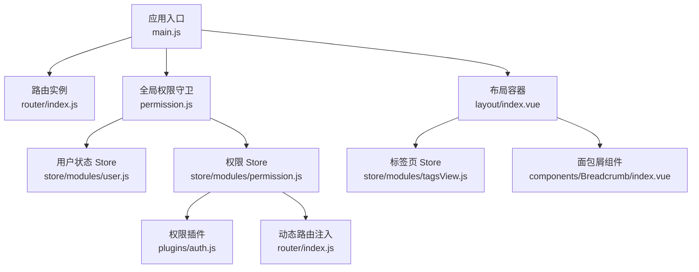
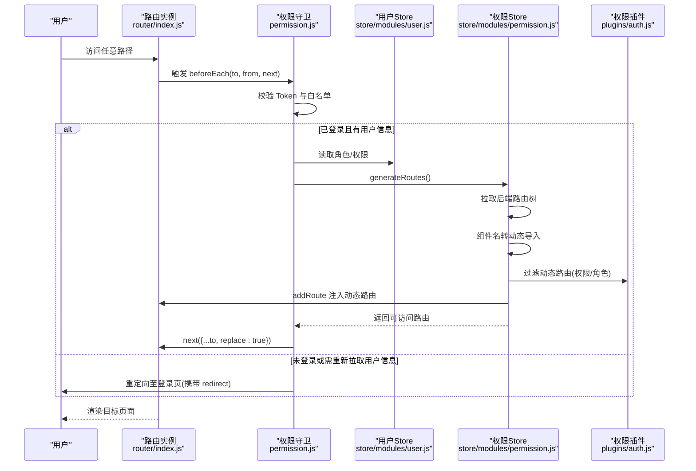
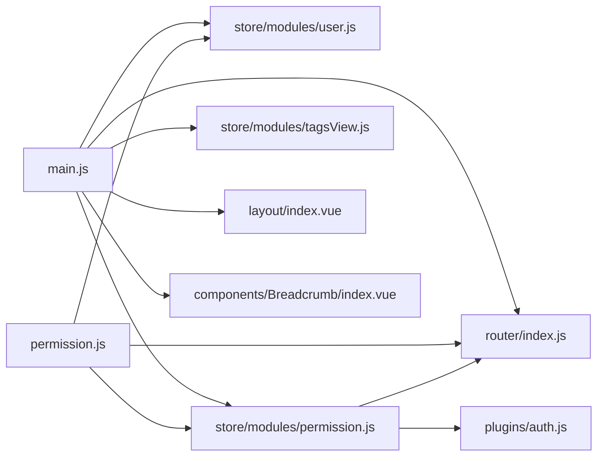

# 路由与导航

<cite>
**本文引用的文件**
- [main.js](file://antflow-vue/src/main.js)
- [permission.js](file://antflow-vue/src/permission.js)
- [router/index.js](file://antflow-vue/src/router/index.js)
- [store/modules/permission.js](file://antflow-vue/src/store/modules/permission.js)
- [store/modules/user.js](file://antflow-vue/src/store/modules/user.js)
- [store/modules/tagsView.js](file://antflow-vue/src/store/modules/tagsView.js)
- [layout/index.vue](file://antflow-vue/src/layout/index.vue)
- [components/Breadcrumb/index.vue](file://antflow-vue/src/components/Breadcrumb/index.vue)
- [plugins/auth.js](file://antflow-vue/src/plugins/auth.js)
- [utils/auth.js](file://antflow-vue/src/utils/auth.js)
</cite>

## 目录
1. [简介](#简介)
2. [项目结构](#项目结构)
3. [核心组件](#核心组件)
4. [架构总览](#架构总览)
5. [详细组件分析](#详细组件分析)
6. [依赖关系分析](#依赖关系分析)
7. [性能考量](#性能考量)
8. [故障排查指南](#故障排查指南)
9. [结论](#结论)
10. [附录](#附录)

## 简介
本文件面向需要在 Antdv/Element Plus 生态下构建灵活导航系统的开发者，系统性梳理并说明本项目的路由与导航体系：包括 Vue Router 配置策略、路由守卫实现机制、权限控制集成方式；动态路由生成、菜单自动生成、面包屑导航的实现原理；路由懒加载策略、路由缓存机制、导航状态管理；以及路由参数处理、查询字符串管理、路由元信息使用。文末提供配置指南、最佳实践与组件开发方法，帮助快速落地可维护的导航系统。

## 项目结构
本项目前端采用 Vite + Vue 3 + Pinia 架构，路由与导航相关的关键位置如下：
- 应用入口与插件注册：应用启动时注册路由、状态、指令与插件，统一挂载到 DOM。
- 路由定义：常量路由与动态路由分离，常量路由在应用启动时即存在，动态路由按权限异步注入。
- 权限守卫：全局前置守卫负责登录态校验、标题设置、白名单放行、首次拉取用户信息与动态路由注入。
- 权限与菜单：权限插件提供权限判断能力；权限 Store 负责从后端拉取路由树、转换视图组件、过滤动态路由并注入。
- 导航与缓存：布局容器承载侧边栏、顶部导航、标签页与主内容区；标签页 Store 管理访问历史与缓存列表；面包屑根据匹配的 matched 路由生成层级导航。

图表来源
- [main.js:1-110](file://antflow-vue/src/main.js#L1-L110)
- [router/index.js:1-339](file://antflow-vue/src/router/index.js#L1-L339)
- [permission.js:1-77](file://antflow-vue/src/permission.js#L1-L77)
- [store/modules/user.js:1-130](file://antflow-vue/src/store/modules/user.js#L1-L130)
- [store/modules/permission.js:1-143](file://antflow-vue/src/store/modules/permission.js#L1-L143)
- [plugins/auth.js:1-61](file://antflow-vue/src/plugins/auth.js#L1-L61)
- [layout/index.vue:1-142](file://antflow-vue/src/layout/index.vue#L1-L142)
- [store/modules/tagsView.js:1-183](file://antflow-vue/src/store/modules/tagsView.js#L1-L183)
- [components/Breadcrumb/index.vue:1-98](file://antflow-vue/src/components/Breadcrumb/index.vue#L1-L98)

章节来源
- [main.js:1-110](file://antflow-vue/src/main.js#L1-L110)
- [router/index.js:1-339](file://antflow-vue/src/router/index.js#L1-L339)

## 核心组件
- 路由实例与配置
  - 常量路由：登录页、404、重定向、首页、个人中心等基础路由。
  - 动态路由：基于权限的业务路由，如流程发起、设计、预览、外部应用等，通过权限过滤后注入。
  - 懒加载：所有视图组件均以动态导入形式加载，结合打包器进行代码分割。
  - 元信息：title/icon/breadcrumb/noCache/activeMenu 等用于侧边栏、面包屑与缓存控制。
- 全局权限守卫
  - 白名单放行、无 Token 重定向登录、有 Token 但用户信息缺失时拉取用户信息与动态路由。
  - 动态路由注入完成后，使用 replace 确保路由切换正确。
- 权限 Store
  - 从后端拉取路由树，转换组件名称为动态导入函数，过滤动态路由并注入。
  - 生成侧边栏、顶部菜单与默认路由集合，供布局与面包屑使用。
- 用户 Store
  - 维护 token、角色、权限、头像等用户信息；登录成功写入 Cookie，登出清除。
- 标签页 Store
  - 维护已访问视图、缓存视图、iframe 视图；支持关闭左侧/右侧/其它/全部标签页；受 noCache 控制决定是否缓存。
- 布局与面包屑
  - 布局容器承载侧边栏、顶部导航、标签页与主内容区；面包屑根据 matched 路由生成层级导航，支持首页前置与重定向页屏蔽。
- 权限插件
  - 提供 hasPermi/hasRole 及 OR/AND 组合判断，用于动态路由过滤与指令权限控制。

章节来源
- [router/index.js:27-93](file://antflow-vue/src/router/index.js#L27-L93)
- [router/index.js:95-324](file://antflow-vue/src/router/index.js#L95-L324)
- [permission.js:20-72](file://antflow-vue/src/permission.js#L20-L72)
- [store/modules/permission.js:33-54](file://antflow-vue/src/store/modules/permission.js#L33-L54)
- [store/modules/user.js:10-127](file://antflow-vue/src/store/modules/user.js#L10-L127)
- [store/modules/tagsView.js:1-183](file://antflow-vue/src/store/modules/tagsView.js#L1-L183)
- [components/Breadcrumb/index.vue:12-84](file://antflow-vue/src/components/Breadcrumb/index.vue#L12-L84)
- [plugins/auth.js:27-60](file://antflow-vue/src/plugins/auth.js#L27-L60)

## 架构总览
下图展示了从用户访问到页面渲染、权限校验与动态路由注入的全链路：

图表来源
- [permission.js:20-72](file://antflow-vue/src/permission.js#L20-L72)
- [store/modules/user.js:42-109](file://antflow-vue/src/store/modules/user.js#L42-L109)
- [store/modules/permission.js:33-54](file://antflow-vue/src/store/modules/permission.js#L33-L54)
- [plugins/auth.js:114-129](file://antflow-vue/src/plugins/auth.js#L114-L129)
- [router/index.js:326-339](file://antflow-vue/src/router/index.js#L326-L339)

## 详细组件分析

### 路由配置与懒加载策略
- 常量路由与动态路由分离：常量路由在应用启动时即存在，保证基础页面可用；动态路由按权限异步注入，避免一次性加载全部业务路由。
- 懒加载实现：视图组件均通过动态导入方式加载，结合打包器进行代码分割，降低首屏体积。
- 元信息使用：通过 meta 控制标题、图标、面包屑显示、缓存策略与侧边栏高亮。
- 历史滚动恢复：scrollBehavior 在页面切换时恢复滚动位置或回到顶部。

章节来源
- [router/index.js:27-93](file://antflow-vue/src/router/index.js#L27-L93)
- [router/index.js:95-324](file://antflow-vue/src/router/index.js#L95-L324)
- [router/index.js:326-339](file://antflow-vue/src/router/index.js#L326-L339)

### 路由守卫实现机制
- 白名单：登录、注册等无需登录即可访问的路径。
- 标题设置：命中路由元信息 title 时，同步更新页面标题。
- 登录态与用户信息：无 Token 直接重定向登录；有 Token 但角色为空时，先拉取用户信息再生成路由。
- 动态路由注入：将后端返回的路由树转换为组件并注入，确保权限生效后才允许进入。
- 替换路由：注入完成后使用 replace 确保浏览器历史栈正确。

章节来源
- [permission.js:14-18](file://antflow-vue/src/permission.js#L14-L18)
- [permission.js:20-72](file://antflow-vue/src/permission.js#L20-L72)

### 权限控制集成方式
- 权限模型：支持按权限字符串与角色两种维度，提供 OR/AND 组合判断。
- 动态路由过滤：根据用户权限对动态路由进行筛选，仅保留可访问项。
- 指令与组件：权限插件可配合指令与组件使用，实现按钮级权限控制。

章节来源
- [plugins/auth.js:27-60](file://antflow-vue/src/plugins/auth.js#L27-L60)
- [store/modules/permission.js:114-129](file://antflow-vue/src/store/modules/permission.js#L114-L129)

### 动态路由生成与菜单自动生成
- 后端路由树：从接口拉取路由数据，包含组件名、权限/角色、父子关系等。
- 组件映射：将组件名映射为动态导入函数，支持 Layout/ParentView/InnerLink 等特殊组件。
- 菜单生成：将过滤后的路由树作为侧边栏与顶部菜单的数据源；默认路由用于面包屑与首页前置。
- 动态注入：将动态路由逐条 addRoute 注入，形成最终可访问路由表。

章节来源
- [store/modules/permission.js:33-54](file://antflow-vue/src/store/modules/permission.js#L33-L54)
- [store/modules/permission.js:58-84](file://antflow-vue/src/store/modules/permission.js#L58-L84)
- [store/modules/permission.js:131-140](file://antflow-vue/src/store/modules/permission.js#L131-L140)

### 面包屑导航实现原理
- 匹配逻辑：根据当前路由的 matched 信息生成层级；对于多级路径，通过默认路由集合递归匹配。
- 首页前置：若首个匹配项不是首页，自动在最前插入首页项。
- 可点击性：支持 redirect 或直接跳转；末级不显示链接。
- 展示控制：可通过 meta.breadcrumb=false 关闭特定路由的面包屑展示。

章节来源
- [components/Breadcrumb/index.vue:20-40](file://antflow-vue/src/components/Breadcrumb/index.vue#L20-L40)
- [components/Breadcrumb/index.vue:50-74](file://antflow-vue/src/components/Breadcrumb/index.vue#L50-L74)

### 路由缓存机制与导航状态管理
- 标签页管理：记录已访问视图与缓存视图，支持关闭左侧/右侧/其它/全部标签页；固定标签（affix）不可关闭。
- 缓存策略：受路由元信息 noCache 控制；noCache=true 不加入缓存列表。
- iframe 视图：支持在 iframe 中打开外部链接，并纳入标签页管理。
- 布局联动：布局容器根据设备与侧边栏状态调整样式与宽度。

章节来源
- [store/modules/tagsView.js:9-183](file://antflow-vue/src/store/modules/tagsView.js#L9-L183)
- [layout/index.vue:16-94](file://antflow-vue/src/layout/index.vue#L16-L94)

### 路由参数处理、查询字符串管理与元信息使用
- 参数与重定向：支持路径参数与查询字符串；重定向页不更新面包屑。
- 元信息字段：title/icon/breadcrumb/noCache/activeMenu/affix 等用于界面与行为控制。
- 页面标题：命中路由元信息 title 时，同步更新页面标题。

章节来源
- [components/Breadcrumb/index.vue:76-84](file://antflow-vue/src/components/Breadcrumb/index.vue#L76-L84)
- [permission.js:22-23](file://antflow-vue/src/permission.js#L22-L23)
- [router/index.js:18-25](file://antflow-vue/src/router/index.js#L18-L25)

## 依赖关系分析
- 入口依赖：main.js 引入并注册路由、状态、指令与插件，确保应用启动时具备导航能力。
- 守卫依赖：permission.js 依赖用户与权限 Store、路由实例与进度条库。
- 权限依赖：permission.js 依赖权限插件与路由实例，完成动态注入。
- 导航依赖：layout/index.vue 依赖 app/tagsView/settings 等 Store；breadcrumb 依赖 permission Store 与路由。

图表来源
- [main.js:15-101](file://antflow-vue/src/main.js#L15-L101)
- [permission.js:1-11](file://antflow-vue/src/permission.js#L1-L11)
- [store/modules/permission.js:1-6](file://antflow-vue/src/store/modules/permission.js#L1-L6)
- [plugins/auth.js:1](file://antflow-vue/src/plugins/auth.js#L1-L1)

章节来源
- [main.js:15-101](file://antflow-vue/src/main.js#L15-L101)
- [permission.js:1-11](file://antflow-vue/src/permission.js#L1-L11)
- [store/modules/permission.js:1-6](file://antflow-vue/src/store/modules/permission.js#L1-L6)

## 性能考量
- 代码分割：所有视图组件均采用动态导入，减少首屏加载体积。
- 懒加载策略：结合路由分块与按需加载，避免一次性加载全部业务模块。
- 缓存控制：通过 noCache 与 keep-alive 协同，平衡内存占用与交互体验。
- 路由注入优化：仅在首次登录或角色变化时拉取并注入动态路由，避免重复请求。

## 故障排查指南
- 登录后无法进入：检查 Token 是否存在、用户信息是否拉取成功、动态路由是否注入完成。
- 面包屑不显示：确认路由 meta.title 存在，且面包屑组件未被禁用。
- 标签页不缓存：检查路由 meta.noCache 是否为 true，或组件是否在缓存列表中。
- 权限不足：确认后端返回的权限/角色与路由 permissions/roles 是否一致，权限插件判断是否正确。

章节来源
- [permission.js:20-72](file://antflow-vue/src/permission.js#L20-L72)
- [store/modules/permission.js:114-129](file://antflow-vue/src/store/modules/permission.js#L114-L129)
- [store/modules/tagsView.js:30-35](file://antflow-vue/src/store/modules/tagsView.js#L30-L35)
- [components/Breadcrumb/index.vue:39-40](file://antflow-vue/src/components/Breadcrumb/index.vue#L39-L40)

## 结论
本项目通过“常量路由 + 动态路由”的双轨设计，结合全局守卫与权限 Store，实现了灵活可控的导航体系。配合标签页缓存、面包屑与布局容器，提供了良好的用户体验。建议在后续迭代中持续完善权限模型、路由元信息规范与缓存策略，以进一步提升可维护性与性能。

## 附录

### 路由配置指南
- 常量路由：放置登录、404、重定向、首页、个人中心等基础页面。
- 动态路由：按业务域划分，明确 permissions/roles、组件名与元信息。
- 懒加载：统一使用动态导入，确保代码分割生效。
- 元信息：合理设置 title/icon/breadcrumb/noCache/activeMenu/affix 等字段。

章节来源
- [router/index.js:27-93](file://antflow-vue/src/router/index.js#L27-L93)
- [router/index.js:95-324](file://antflow-vue/src/router/index.js#L95-L324)

### 权限控制最佳实践
- 权限与角色并行：优先使用权限字符串，必要时使用角色组合判断。
- 动态过滤：在权限 Store 中统一过滤动态路由，避免在组件内分散处理。
- 指令与组件：结合权限插件与指令，实现按钮级细粒度控制。

章节来源
- [plugins/auth.js:27-60](file://antflow-vue/src/plugins/auth.js#L27-L60)
- [store/modules/permission.js:114-129](file://antflow-vue/src/store/modules/permission.js#L114-L129)

### 导航组件开发方法
- 布局容器：根据设备与侧边栏状态动态切换样式，确保移动端适配。
- 标签页：遵循 affix/noCache 等约定，提供关闭与清理能力。
- 面包屑：根据 matched 与默认路由集合生成层级，支持首页前置与禁用展示。

章节来源
- [layout/index.vue:16-94](file://antflow-vue/src/layout/index.vue#L16-L94)
- [store/modules/tagsView.js:9-183](file://antflow-vue/src/store/modules/tagsView.js#L9-L183)
- [components/Breadcrumb/index.vue:20-84](file://antflow-vue/src/components/Breadcrumb/index.vue#L20-L84)