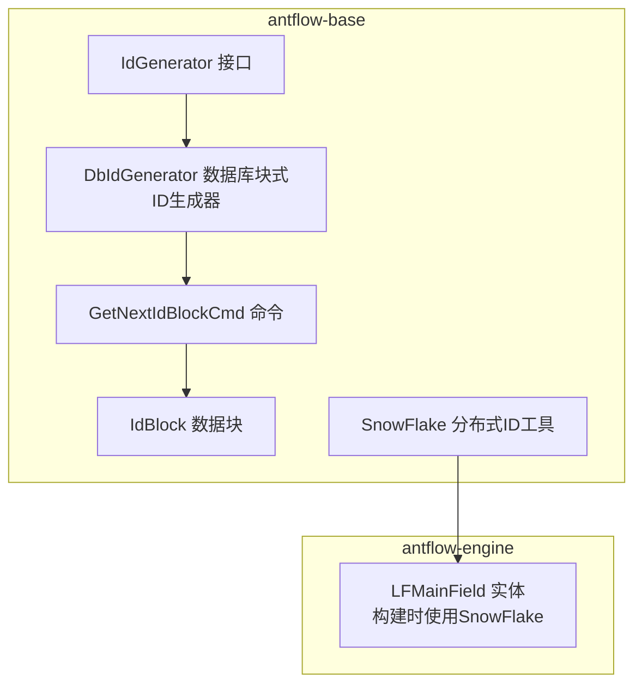
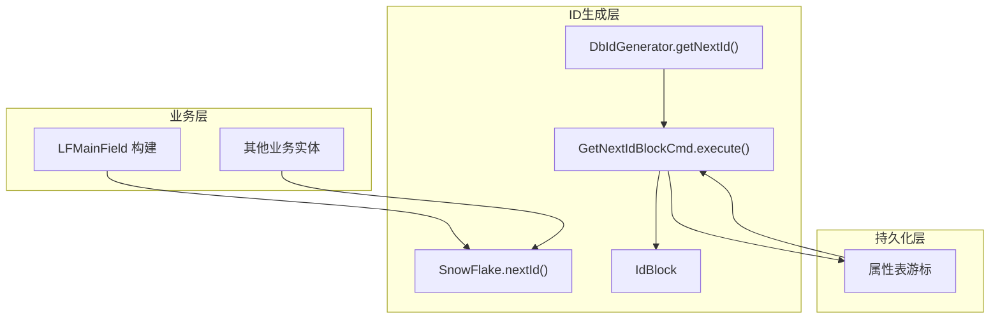
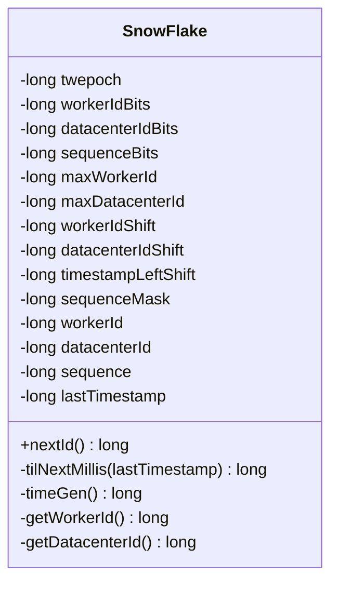
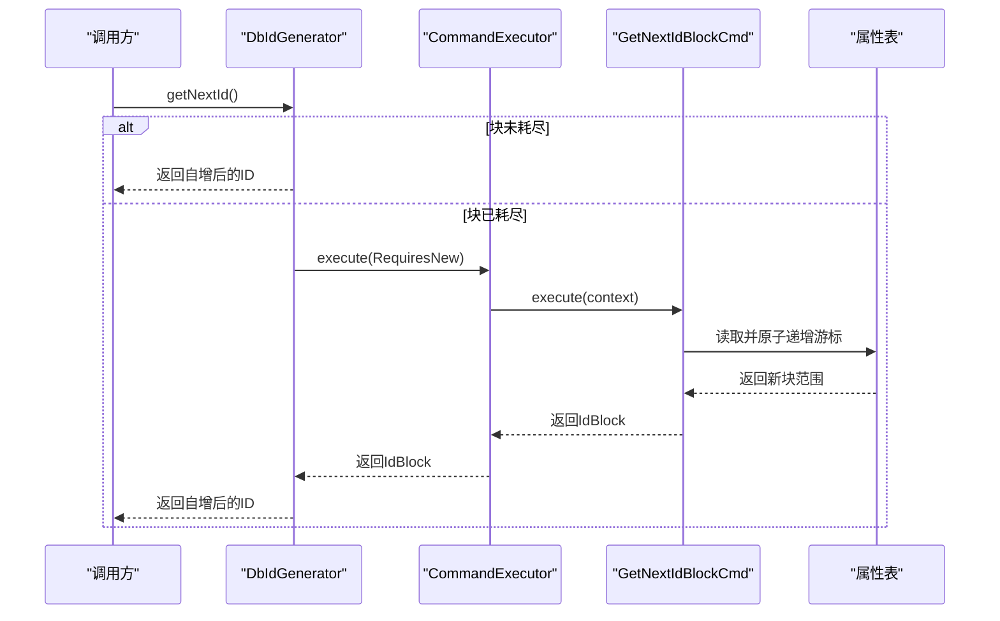
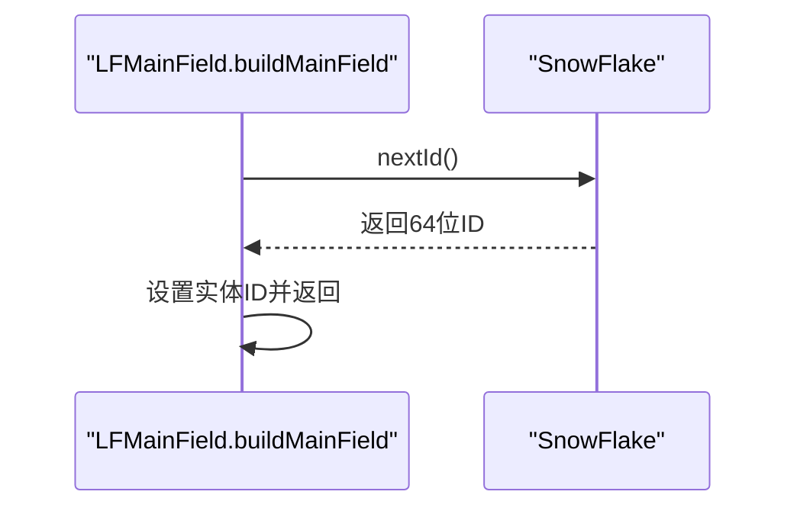
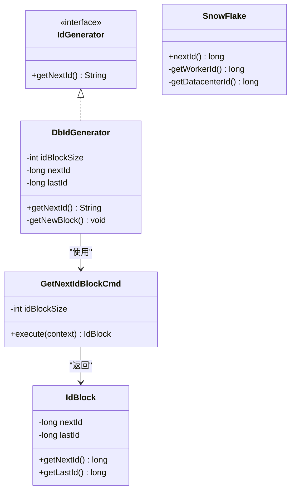

# ID生成系统

<cite>
**本文引用的文件**
- [SnowFlake.java](file://antflow-base/src/main/java/org/openoa/base/util/SnowFlake.java)
- [DbIdGenerator.java](file://antflow-base/src/main/java/org/activiti/engine/impl/db/DbIdGenerator.java)
- [GetNextIdBlockCmd.java](file://antflow-base/src/main/java/org/activiti/engine/impl/cmd/GetNextIdBlockCmd.java)
- [IdBlock.java](file://antflow-base/src/main/java/org/activiti/engine/impl/db/IdBlock.java)
- [IdGenerator.java](file://antflow-base/src/main/java/org/activiti/engine/impl/cfg/IdGenerator.java)
- [ProcessEngineConfigurationImpl.java](file://antflow-base/src/main/java/org/activiti/engine/impl/cfg/ProcessEngineConfigurationImpl.java)
- [LFMainField.java](file://antflow-engine/src/main/java/org/openoa/engine/lowflow/entity/LFMainField.java)
- [4.后端系统.md](file://doc/系统介绍篇/4.后端系统.md)
</cite>

## 目录
1. [简介](#简介)
2. [项目结构](#项目结构)
3. [核心组件](#核心组件)
4. [架构总览](#架构总览)
5. [详细组件分析](#详细组件分析)
6. [依赖关系分析](#依赖关系分析)
7. [性能考量](#性能考量)
8. [故障排查指南](#故障排查指南)
9. [结论](#结论)
10. [附录](#附录)

## 简介
本文件面向ID生成系统的技术文档，聚焦于SnowFlake算法在本项目中的实现与应用，涵盖64位ID结构设计、分布式唯一性保障、Kubernetes环境下的Worker ID生成策略、时钟漂移检测与回退机制、性能优化与扩展性考虑，以及故障恢复与使用指南。文档同时给出关键流程的可视化图示与定位路径，便于读者快速理解与落地。

## 项目结构
围绕ID生成的关键代码分布在两个模块：
- antflow-base：包含通用ID生成器接口、数据库块式ID生成器、命令与数据块模型，以及文档中描述的SnowFlake工具类。
- antflow-engine：包含业务实体对ID生成的实际调用点，例如低代码主字段实体在构建时使用SnowFlake生成主键。

**图表来源**
- [IdGenerator.java:27-31](file://antflow-base/src/main/java/org/activiti/engine/impl/cfg/IdGenerator.java#L27-L31)
- [DbIdGenerator.java:25-71](file://antflow-base/src/main/java/org/activiti/engine/impl/db/DbIdGenerator.java#L25-L71)
- [GetNextIdBlockCmd.java:24-42](file://antflow-base/src/main/java/org/activiti/engine/impl/cmd/GetNextIdBlockCmd.java#L24-L42)
- [IdBlock.java:18-34](file://antflow-base/src/main/java/org/activiti/engine/impl/db/IdBlock.java#L18-L34)
- [SnowFlake.java:11-126](file://antflow-base/src/main/java/org/openoa/base/util/SnowFlake.java#L11-L126)
- [LFMainField.java:103-113](file://antflow-engine/src/main/java/org/openoa/engine/lowflow/entity/LFMainField.java#L103-L113)

**章节来源**
- [IdGenerator.java:18-31](file://antflow-base/src/main/java/org/activiti/engine/impl/cfg/IdGenerator.java#L18-L31)
- [DbIdGenerator.java:25-71](file://antflow-base/src/main/java/org/activiti/engine/impl/db/DbIdGenerator.java#L25-L71)
- [GetNextIdBlockCmd.java:24-42](file://antflow-base/src/main/java/org/activiti/engine/impl/cmd/GetNextIdBlockCmd.java#L24-L42)
- [IdBlock.java:18-34](file://antflow-base/src/main/java/org/activiti/engine/impl/db/IdBlock.java#L18-L34)
- [SnowFlake.java:11-126](file://antflow-base/src/main/java/org/openoa/base/util/SnowFlake.java#L11-L126)
- [LFMainField.java:103-113](file://antflow-engine/src/main/java/org/openoa/engine/lowflow/entity/LFMainField.java#L103-L113)

## 核心组件
- SnowFlake（分布式ID工具类）
  - 采用64位整型ID，位段为：时间戳（41位）、数据中心ID（5位）、工作ID（5位）、序列号（12位）。
  - 在Kubernetes环境下优先从环境变量中提取Pod名称生成Worker ID；在非K8s环境则回退至本机IP或MAC地址哈希。
  - 内置时钟回拨保护：若检测到时钟回拨，抛出异常；同一毫秒内的序列号自增并掩码，耗尽则等待下一毫秒。
- DbIdGenerator（数据库块式ID生成器）
  - 通过命令执行获取连续ID块，减少数据库访问频率；内部维护当前块的起止范围，按需拉取新块。
- GetNextIdBlockCmd（命令）
  - 从属性表中读取当前游标并原子性递增，返回新的ID块范围。
- IdBlock（数据块）
  - 描述一次批量ID分配的起止范围。
- IdGenerator（接口）
  - 统一的ID生成抽象，DbIdGenerator与SnowFlake均实现该接口的getNextId方法。
- LFMainField（业务实体）
  - 在实体构建阶段调用SnowFlake生成主键，体现SnowFlake在业务层的应用。

**章节来源**
- [SnowFlake.java:13-24](file://antflow-base/src/main/java/org/openoa/base/util/SnowFlake.java#L13-L24)
- [SnowFlake.java:38-65](file://antflow-base/src/main/java/org/openoa/base/util/SnowFlake.java#L38-L65)
- [DbIdGenerator.java:34-46](file://antflow-base/src/main/java/org/activiti/engine/impl/db/DbIdGenerator.java#L34-L46)
- [GetNextIdBlockCmd.java:33-41](file://antflow-base/src/main/java/org/activiti/engine/impl/cmd/GetNextIdBlockCmd.java#L33-L41)
- [IdBlock.java:23-33](file://antflow-base/src/main/java/org/activiti/engine/impl/db/IdBlock.java#L23-L33)
- [IdGenerator.java:27-31](file://antflow-base/src/main/java/org/activiti/engine/impl/cfg/IdGenerator.java#L27-L31)
- [LFMainField.java:108-110](file://antflow-engine/src/main/java/org/openoa/engine/lowflow/entity/LFMainField.java#L108-L110)

## 架构总览
下图展示了ID生成在系统中的整体交互：业务实体通过SnowFlake生成分布式ID；同时，工作流引擎使用数据库块式ID生成器以提升吞吐并降低数据库压力。

**图表来源**
- [LFMainField.java:108-110](file://antflow-engine/src/main/java/org/openoa/engine/lowflow/entity/LFMainField.java#L108-L110)
- [SnowFlake.java:40-65](file://antflow-base/src/main/java/org/openoa/base/util/SnowFlake.java#L40-L65)
- [DbIdGenerator.java:34-46](file://antflow-base/src/main/java/org/activiti/engine/impl/db/DbIdGenerator.java#L34-L46)
- [GetNextIdBlockCmd.java:33-41](file://antflow-base/src/main/java/org/activiti/engine/impl/cmd/GetNextIdBlockCmd.java#L33-L41)
- [IdBlock.java:23-33](file://antflow-base/src/main/java/org/activiti/engine/impl/db/IdBlock.java#L23-L33)

## 详细组件分析

### SnowFlake 组件分析
- 结构设计
  - 位段划分：时间戳（41位）、数据中心ID（5位）、工作ID（5位）、序列号（12位），合计64位。
  - 左移位与掩码：通过位移与掩码确保各字段不重叠且数值合法。
- Worker ID 与数据中心 ID 生成
  - Worker ID：优先从环境变量中解析Pod名称，取其哈希值与最大Worker ID掩码；失败时回退至本机IP哈希。
  - 数据中心 ID：遍历所有网络接口，拼接MAC地址字符串，取其哈希值与最大数据中心ID掩码；异常时回退为0。
- 时钟漂移检测与回退
  - 若当前时间戳小于上次时间戳，则抛出异常，防止ID重复。
  - 同一毫秒内序列号自增并掩码；当序列号溢出时，等待下一毫秒再继续。
- 性能与扩展性
  - 本地生成，无网络开销；序列号上限为4096（12位），在毫秒级内可支撑高并发。
  - Worker ID与数据中心ID位宽限制了最大实例数与数据中心数量，需结合部署规模规划。

**图表来源**
- [SnowFlake.java:13-24](file://antflow-base/src/main/java/org/openoa/base/util/SnowFlake.java#L13-L24)
- [SnowFlake.java:40-76](file://antflow-base/src/main/java/org/openoa/base/util/SnowFlake.java#L40-L76)
- [SnowFlake.java:88-124](file://antflow-base/src/main/java/org/openoa/base/util/SnowFlake.java#L88-L124)

**章节来源**
- [SnowFlake.java:13-24](file://antflow-base/src/main/java/org/openoa/base/util/SnowFlake.java#L13-L24)
- [SnowFlake.java:38-76](file://antflow-base/src/main/java/org/openoa/base/util/SnowFlake.java#L38-L76)
- [SnowFlake.java:88-124](file://antflow-base/src/main/java/org/openoa/base/util/SnowFlake.java#L88-L124)

### 数据库块式ID生成器（DbIdGenerator）分析
- 作用
  - 通过命令执行批量获取ID区间，减少数据库写入次数，提高吞吐。
- 关键流程
  - 当前块耗尽时，执行命令获取新块；每次调用返回自增后的ID。
- 事务与执行器
  - 依赖命令执行器与命令配置，可在需要时开启独立事务。

**图表来源**
- [DbIdGenerator.java:34-46](file://antflow-base/src/main/java/org/activiti/engine/impl/db/DbIdGenerator.java#L34-L46)
- [GetNextIdBlockCmd.java:33-41](file://antflow-base/src/main/java/org/activiti/engine/impl/cmd/GetNextIdBlockCmd.java#L33-L41)
- [IdBlock.java:23-33](file://antflow-base/src/main/java/org/activiti/engine/impl/db/IdBlock.java#L23-L33)

**章节来源**
- [DbIdGenerator.java:34-46](file://antflow-base/src/main/java/org/activiti/engine/impl/db/DbIdGenerator.java#L34-L46)
- [GetNextIdBlockCmd.java:33-41](file://antflow-base/src/main/java/org/activiti/engine/impl/cmd/GetNextIdBlockCmd.java#L33-L41)
- [IdBlock.java:23-33](file://antflow-base/src/main/java/org/activiti/engine/impl/db/IdBlock.java#L23-L33)

### 业务实体调用链（LFMainField）
- 调用点
  - 在实体构建过程中调用SnowFlake生成主键，确保业务数据的全局唯一标识。
- 影响范围
  - 低代码主字段实体广泛使用该策略，保障表单数据主键的唯一性与可排序性。

**图表来源**
- [LFMainField.java:108-110](file://antflow-engine/src/main/java/org/openoa/engine/lowflow/entity/LFMainField.java#L108-L110)
- [SnowFlake.java:40-65](file://antflow-base/src/main/java/org/openoa/base/util/SnowFlake.java#L40-L65)

**章节来源**
- [LFMainField.java:108-110](file://antflow-engine/src/main/java/org/openoa/engine/lowflow/entity/LFMainField.java#L108-L110)

## 依赖关系分析
- 接口与实现
  - IdGenerator为统一抽象，DbIdGenerator与SnowFlake分别实现不同场景下的ID生成策略。
- 组件耦合
  - DbIdGenerator依赖命令执行器与命令配置，形成“命令-执行器-存储”的清晰分层。
  - SnowFlake为纯本地工具类，与业务实体直接耦合，便于在各处复用。
- 可能的循环依赖
  - 代码结构中未见循环依赖迹象；DbIdGenerator与SnowFlake分别服务于不同上下文。

**图表来源**
- [IdGenerator.java:27-31](file://antflow-base/src/main/java/org/activiti/engine/impl/cfg/IdGenerator.java#L27-L31)
- [DbIdGenerator.java:25-71](file://antflow-base/src/main/java/org/activiti/engine/impl/db/DbIdGenerator.java#L25-L71)
- [GetNextIdBlockCmd.java:24-42](file://antflow-base/src/main/java/org/activiti/engine/impl/cmd/GetNextIdBlockCmd.java#L24-L42)
- [IdBlock.java:18-34](file://antflow-base/src/main/java/org/activiti/engine/impl/db/IdBlock.java#L18-L34)

**章节来源**
- [IdGenerator.java:27-31](file://antflow-base/src/main/java/org/activiti/engine/impl/cfg/IdGenerator.java#L27-L31)
- [DbIdGenerator.java:25-71](file://antflow-base/src/main/java/org/activiti/engine/impl/db/DbIdGenerator.java#L25-L71)
- [GetNextIdBlockCmd.java:24-42](file://antflow-base/src/main/java/org/activiti/engine/impl/cmd/GetNextIdBlockCmd.java#L24-L42)
- [IdBlock.java:18-34](file://antflow-base/src/main/java/org/activiti/engine/impl/db/IdBlock.java#L18-L34)

## 性能考量
- SnowFlake
  - 本地生成，避免网络与锁竞争；序列号上限为4096，单机毫秒级吞吐高。
  - Worker ID与数据中心ID位宽限制了并发粒度与扩展规模，建议结合部署规模评估。
- DbIdGenerator
  - 批量获取ID块显著降低数据库写入频率；通过调整块大小平衡内存占用与数据库压力。
  - RequiresNew事务可避免与其他事务冲突，但需权衡事务开销。
- 时钟漂移
  - 回拨保护避免ID重复，但会触发异常；建议在容器环境中确保时钟同步（如NTP）。

[本节为通用性能讨论，无需列出具体文件来源]

## 故障排查指南
- 时钟回拨异常
  - 现象：生成ID时报错提示时钟回拨。
  - 排查：检查宿主机/容器时钟同步；确认K8s节点NTP配置。
  - 参考路径：[SnowFlake.java:43-46](file://antflow-base/src/main/java/org/openoa/base/util/SnowFlake.java#L43-L46)
- Worker ID冲突
  - 现象：多个实例产生相同Worker ID导致ID冲突。
  - 排查：确认K8s环境变量是否正确注入Pod名称；回退路径是否稳定。
  - 参考路径：[SnowFlake.java:88-101](file://antflow-base/src/main/java/org/openoa/base/util/SnowFlake.java#L88-L101)
- 数据中心ID异常
  - 现象：网络接口不可用导致数据中心ID异常。
  - 排查：检查网络接口状态；必要时固定数据中心ID。
  - 参考路径：[SnowFlake.java:106-124](file://antflow-base/src/main/java/org/openoa/base/util/SnowFlake.java#L106-L124)
- 数据库块式ID耗尽
  - 现象：频繁触发拉取新块，数据库写入压力增大。
  - 排查：增大块大小；检查命令执行器事务配置。
  - 参考路径：[DbIdGenerator.java:34-46](file://antflow-base/src/main/java/org/activiti/engine/impl/db/DbIdGenerator.java#L34-L46)，[ProcessEngineConfigurationImpl.java:1415-1427](file://antflow-base/src/main/java/org/activiti/engine/impl/cfg/ProcessEngineConfigurationImpl.java#L1415-L1427)

**章节来源**
- [SnowFlake.java:43-46](file://antflow-base/src/main/java/org/openoa/base/util/SnowFlake.java#L43-L46)
- [SnowFlake.java:88-101](file://antflow-base/src/main/java/org/openoa/base/util/SnowFlake.java#L88-L101)
- [SnowFlake.java:106-124](file://antflow-base/src/main/java/org/openoa/base/util/SnowFlake.java#L106-L124)
- [DbIdGenerator.java:34-46](file://antflow-base/src/main/java/org/activiti/engine/impl/db/DbIdGenerator.java#L34-L46)
- [ProcessEngineConfigurationImpl.java:1415-1427](file://antflow-base/src/main/java/org/activiti/engine/impl/cfg/ProcessEngineConfigurationImpl.java#L1415-L1427)

## 结论
本项目的ID生成体系融合了SnowFlake的高吞吐本地生成与数据库块式ID生成两种策略，既满足Kubernetes环境下的分布式唯一性需求，又兼顾了传统工作流引擎对ID块的批量需求。通过严格的位段设计、时钟漂移保护与回退机制，系统在性能与可靠性之间取得良好平衡。建议在生产环境中配合时钟同步、合理的块大小与监控告警，持续优化ID生成链路。

[本节为总结性内容，无需列出具体文件来源]

## 附录

### 64位ID结构与位段说明
- 时间戳（41位）：用于标识生成时间，具备递增与可排序特性。
- 数据中心ID（5位）：区分物理或逻辑数据中心。
- 工作ID（5位）：区分同一数据中心内的不同实例。
- 序列号（12位）：同一毫秒内的自增序列，上限4096。

**章节来源**
- [SnowFlake.java:13-24](file://antflow-base/src/main/java/org/openoa/base/util/SnowFlake.java#L13-L24)

### 使用指南与最佳实践
- 选择策略
  - 对于业务实体（如低代码主字段），推荐使用SnowFlake生成64位ID。
  - 对于工作流引擎内部对象，可使用数据库块式ID生成器以提升吞吐。
- Kubernetes部署
  - 确保Pod名称环境变量可用，以便生成稳定的Worker ID；若不可用，回退路径仍可工作。
- 性能优化
  - 调整数据库ID块大小以匹配业务峰值；监控序列号耗尽频率。
  - 在高并发场景下，建议将Worker ID与数据中心ID合理分布到不同实例与节点。
- 故障恢复
  - 发生时钟回拨时，应立即排查时钟同步问题；必要时暂停服务修复后再恢复。
  - 对数据库块式ID，检查命令执行器与事务配置，避免死锁与长时间持有游标。

**章节来源**
- [LFMainField.java:108-110](file://antflow-engine/src/main/java/org/openoa/engine/lowflow/entity/LFMainField.java#L108-L110)
- [DbIdGenerator.java:48-54](file://antflow-base/src/main/java/org/activiti/engine/impl/db/DbIdGenerator.java#L48-L54)
- [ProcessEngineConfigurationImpl.java:1415-1427](file://antflow-base/src/main/java/org/activiti/engine/impl/cfg/ProcessEngineConfigurationImpl.java#L1415-L1427)
- [4.后端系统.md:318-373](file://doc/系统介绍篇/4.后端系统.md#L318-L373)