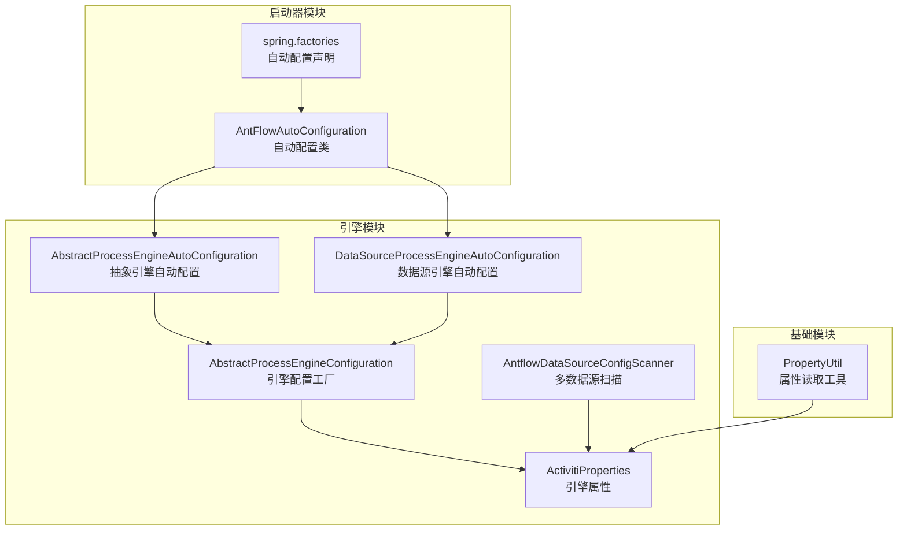
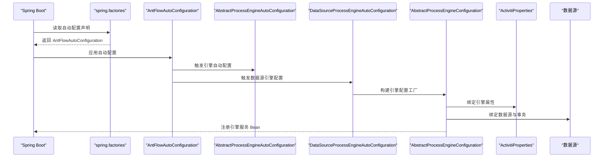
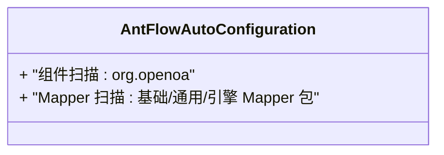
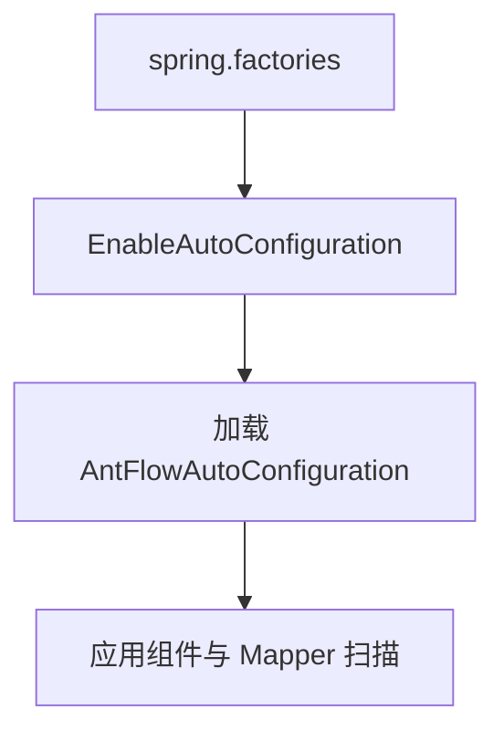
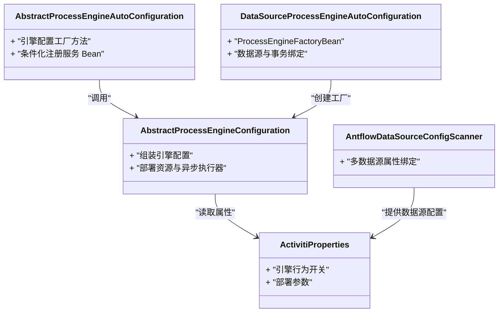
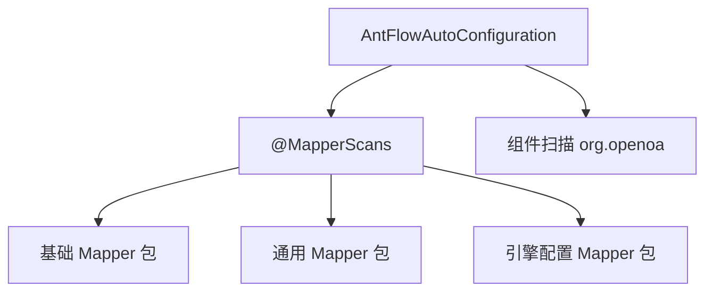
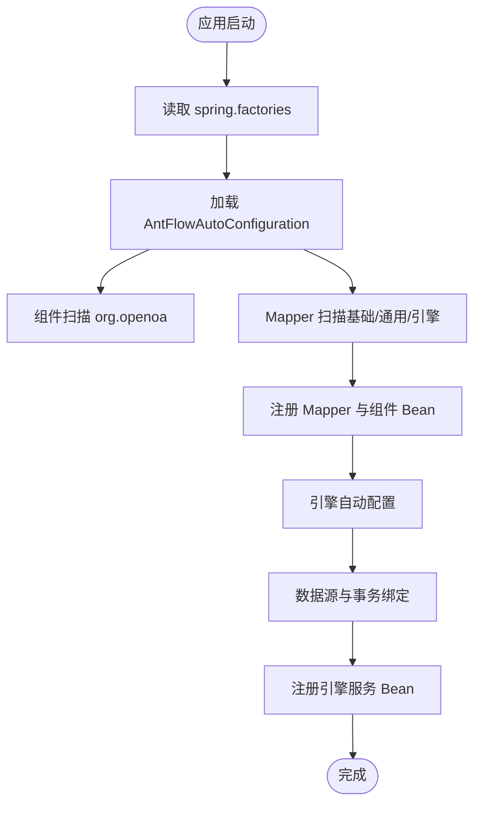
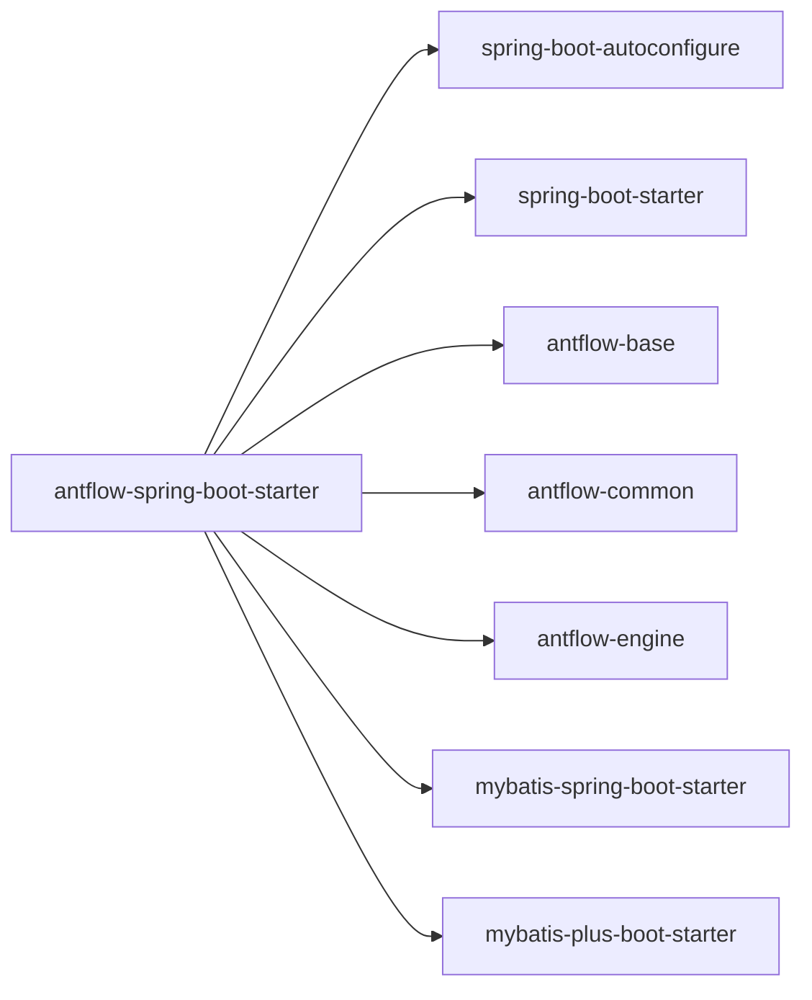

# Spring Boot 集成

<cite>
**本文档引用的文件**
- [AntFlowAutoConfiguration.java](file://antflow-spring-boot-starter/src/main/java/org/openoa/starter/config/AntFlowAutoConfiguration.java)
- [spring.factories](file://antflow-spring-boot-starter/src/main/resources/META-INF/spring.factories)
- [pom.xml（starter）](file://antflow-spring-boot-starter/pom.xml)
- [AbstractProcessEngineAutoConfiguration.java](file://antflow-engine/src/main/java/org/activiti/spring/boot/engine/AbstractProcessEngineAutoConfiguration.java)
- [DataSourceProcessEngineAutoConfiguration.java](file://antflow-engine/src/main/java/org/activiti/spring/boot/engine/DataSourceProcessEngineAutoConfiguration.java)
- [AbstractProcessEngineConfiguration.java](file://antflow-engine/src/main/java/org/openoa/engine/conf/engineconfig/AbstractProcessEngineConfiguration.java)
- [ActivitiProperties.java](file://antflow-engine/src/main/java/org/openoa/engine/conf/engineconfig/ActivitiProperties.java)
- [AntflowDataSourceConfigScanner.java](file://antflow-engine/src/main/java/org/openoa/engine/conf/engineconfig/AntflowDataSourceConfigScanner.java)
- [MyBatisPlusConfig.java](file://antflow-engine/src/main/java/org/openoa/engine/conf/mybatis/MyBatisPlusConfig.java)
- [PropertyUtil.java](file://antflow-base/src/main/java/org/openoa/base/util/PropertyUtil.java)
- [开发环境搭建.md](file://doc/系统介绍篇/21.开发环境搭建.md)
</cite>

## 目录
1. [简介](#简介)
2. [项目结构](#项目结构)
3. [核心组件](#核心组件)
4. [架构总览](#架构总览)
5. [详细组件分析](#详细组件分析)
6. [依赖分析](#依赖分析)
7. [性能考虑](#性能考虑)
8. [故障排查指南](#故障排查指南)
9. [结论](#结论)
10. [附录](#附录)

## 简介
本文件面向希望在 Spring Boot 应用中集成 AntFlow 的开发者，系统讲解 AntFlow 如何通过 Spring Boot 自动配置机制无缝接入：从自动配置类、组件扫描策略、MyBatis Mapper 扫描配置，到 spring.factories 的作用、启动器发现与配置加载流程。同时提供最佳实践、可选自定义配置点以及常见问题排查建议。

## 项目结构
AntFlow 的 Spring Boot 集成主要由“启动器模块”和“引擎模块”协作完成：
- 启动器模块（antflow-spring-boot-starter）：提供自动配置类与 spring.factories，负责声明式启用 AntFlow 的核心能力。
- 引擎模块（antflow-engine）：提供 Activiti 进程引擎的自动配置、数据源绑定、流程部署与服务 Bean 注册等能力。
- 基础模块（antflow-base）：提供通用工具与基础能力，如配置读取工具等。

图表来源
- [AntFlowAutoConfiguration.java:1-19](file://antflow-spring-boot-starter/src/main/java/org/openoa/starter/config/AntFlowAutoConfiguration.java#L1-L19)
- [spring.factories:1-2](file://antflow-spring-boot-starter/src/main/resources/META-INF/spring.factories#L1-L2)
- [AbstractProcessEngineAutoConfiguration.java:110-156](file://antflow-engine/src/main/java/org/activiti/spring/boot/engine/AbstractProcessEngineAutoConfiguration.java#L110-L156)
- [DataSourceProcessEngineAutoConfiguration.java:59-70](file://antflow-engine/src/main/java/org/activiti/spring/boot/engine/DataSourceProcessEngineAutoConfiguration.java#L59-L70)
- [AbstractProcessEngineConfiguration.java:57-90](file://antflow-engine/src/main/java/org/openoa/engine/conf/engineconfig/AbstractProcessEngineConfiguration.java#L57-L90)
- [ActivitiProperties.java:69-124](file://antflow-engine/src/main/java/org/openoa/engine/conf/engineconfig/ActivitiProperties.java#L69-L124)
- [AntflowDataSourceConfigScanner.java:1-30](file://antflow-engine/src/main/java/org/openoa/engine/conf/engineconfig/AntflowDataSourceConfigScanner.java#L1-L30)
- [PropertyUtil.java:1-15](file://antflow-base/src/main/java/org/openoa/base/util/PropertyUtil.java#L1-L15)

章节来源
- [AntFlowAutoConfiguration.java:1-19](file://antflow-spring-boot-starter/src/main/java/org/openoa/starter/config/AntFlowAutoConfiguration.java#L1-L19)
- [spring.factories:1-2](file://antflow-spring-boot-starter/src/main/resources/META-INF/spring.factories#L1-L2)
- [pom.xml（starter）:1-321](file://antflow-spring-boot-starter/pom.xml#L1-L321)

## 核心组件
- 自动配置类：AntFlowAutoConfiguration 使用 @MapperScans 与 @ComponentScan 对 MyBatis Mapper 包与 AntFlow 模块包进行扫描，确保引擎与业务 Mapper 可被自动注册为 Bean。
- spring.factories：声明 EnableAutoConfiguration=AntFlowAutoConfiguration，使 Spring Boot 在启动时自动发现并应用该自动配置。
- 引擎自动配置：AbstractProcessEngineAutoConfiguration 与 DataSourceProcessEngineAutoConfiguration 提供引擎配置工厂、数据源绑定、事务管理与服务 Bean 的条件化注册。
- 属性与数据源：ActivitiProperties 提供引擎行为开关与部署参数；AntflowDataSourceConfigScanner 通过环境属性绑定实现多数据源配置扫描。
- MyBatis 配置：MyBatisPlusConfig（注释示例）展示了如何集中配置 MyBatis Plus 插件、分页与乐观锁等能力，便于统一治理。

章节来源
- [AntFlowAutoConfiguration.java:8-18](file://antflow-spring-boot-starter/src/main/java/org/openoa/starter/config/AntFlowAutoConfiguration.java#L8-L18)
- [spring.factories:1-2](file://antflow-spring-boot-starter/src/main/resources/META-INF/spring.factories#L1-L2)
- [AbstractProcessEngineAutoConfiguration.java:110-156](file://antflow-engine/src/main/java/org/activiti/spring/boot/engine/AbstractProcessEngineAutoConfiguration.java#L110-L156)
- [DataSourceProcessEngineAutoConfiguration.java:59-70](file://antflow-engine/src/main/java/org/activiti/spring/boot/engine/DataSourceProcessEngineAutoConfiguration.java#L59-L70)
- [AbstractProcessEngineConfiguration.java:57-90](file://antflow-engine/src/main/java/org/openoa/engine/conf/engineconfig/AbstractProcessEngineConfiguration.java#L57-L90)
- [ActivitiProperties.java:69-124](file://antflow-engine/src/main/java/org/openoa/engine/conf/engineconfig/ActivitiProperties.java#L69-L124)
- [AntflowDataSourceConfigScanner.java:1-30](file://antflow-engine/src/main/java/org/openoa/engine/conf/engineconfig/AntflowDataSourceConfigScanner.java#L1-L30)
- [MyBatisPlusConfig.java:1-141](file://antflow-engine/src/main/java/org/openoa/engine/conf/mybatis/MyBatisPlusConfig.java#L1-L141)

## 架构总览
下图展示从 Spring Boot 启动到 AntFlow 自动配置生效、引擎初始化与数据源绑定的整体流程。

图表来源
- [spring.factories:1-2](file://antflow-spring-boot-starter/src/main/resources/META-INF/spring.factories#L1-L2)
- [AntFlowAutoConfiguration.java:8-18](file://antflow-spring-boot-starter/src/main/java/org/openoa/starter/config/AntFlowAutoConfiguration.java#L8-L18)
- [AbstractProcessEngineAutoConfiguration.java:110-156](file://antflow-engine/src/main/java/org/activiti/spring/boot/engine/AbstractProcessEngineAutoConfiguration.java#L110-L156)
- [DataSourceProcessEngineAutoConfiguration.java:59-70](file://antflow-engine/src/main/java/org/activiti/spring/boot/engine/DataSourceProcessEngineAutoConfiguration.java#L59-L70)
- [AbstractProcessEngineConfiguration.java:57-90](file://antflow-engine/src/main/java/org/openoa/engine/conf/engineconfig/AbstractProcessEngineConfiguration.java#L57-L90)
- [ActivitiProperties.java:69-124](file://antflow-engine/src/main/java/org/openoa/engine/conf/engineconfig/ActivitiProperties.java#L69-L124)

## 详细组件分析

### 自动配置类：AntFlowAutoConfiguration
- 组件扫描策略
  - 使用 @ComponentScan 指定包前缀 org.openoa，确保 AntFlow 模块中的组件（如服务、适配器、监听器等）被纳入容器。
- MyBatis Mapper 扫描策略
  - 使用 @MapperScans 声明对多个 Mapper 包的扫描：基础模块、通用模块与引擎配置模块的 Mapper 包，保证业务与引擎相关 Mapper 被自动注册为 SqlSession 的代理 Bean。
- 设计要点
  - 将扫描范围收敛在 org.openoa 下，避免对第三方或无关包进行无谓扫描，提升启动性能与隔离性。

图表来源
- [AntFlowAutoConfiguration.java:8-18](file://antflow-spring-boot-starter/src/main/java/org/openoa/starter/config/AntFlowAutoConfiguration.java#L8-L18)

章节来源
- [AntFlowAutoConfiguration.java:8-18](file://antflow-spring-boot-starter/src/main/java/org/openoa/starter/config/AntFlowAutoConfiguration.java#L8-L18)

### spring.factories 与启动器发现机制
- spring.factories 声明了 EnableAutoConfiguration=AntFlowAutoConfiguration，使 Spring Boot 在启动时自动发现并应用该自动配置类。
- 该机制属于 Spring Boot 标准 SPI 发现方式，无需显式 @Import 或 @EnableAutoConfiguration 注解即可生效。

图表来源
- [spring.factories:1-2](file://antflow-spring-boot-starter/src/main/resources/META-INF/spring.factories#L1-L2)

章节来源
- [spring.factories:1-2](file://antflow-spring-boot-starter/src/main/resources/META-INF/spring.factories#L1-L2)

### 引擎自动配置与数据源绑定
- 抽象引擎自动配置
  - AbstractProcessEngineAutoConfiguration 提供引擎配置工厂方法，接收流程定义资源、数据源、事务管理器与异步执行器等，构建 SpringProcessEngineConfiguration。
- 数据源引擎自动配置
  - DataSourceProcessEngineAutoConfiguration 在存在数据源与事务管理器时，创建 ProcessEngineFactoryBean 并注册引擎 Bean。
- 引擎配置工厂
  - AbstractProcessEngineConfiguration.processEngineConfigurationBean 负责组装引擎配置，包括是否启用异步执行器、部署资源等。
- 属性与多数据源
  - ActivitiProperties 提供引擎行为开关（如异步执行器、REST API、JPA 等）与部署名称等参数。
  - AntflowDataSourceConfigScanner 通过环境属性绑定，扫描 spring.antflow.* 前缀下的多数据源配置，便于在复杂场景下按租户或模块分离数据源。

图表来源
- [AbstractProcessEngineAutoConfiguration.java:110-156](file://antflow-engine/src/main/java/org/activiti/spring/boot/engine/AbstractProcessEngineAutoConfiguration.java#L110-L156)
- [DataSourceProcessEngineAutoConfiguration.java:59-70](file://antflow-engine/src/main/java/org/activiti/spring/boot/engine/DataSourceProcessEngineAutoConfiguration.java#L59-L70)
- [AbstractProcessEngineConfiguration.java:57-90](file://antflow-engine/src/main/java/org/openoa/engine/conf/engineconfig/AbstractProcessEngineConfiguration.java#L57-L90)
- [ActivitiProperties.java:69-124](file://antflow-engine/src/main/java/org/openoa/engine/conf/engineconfig/ActivitiProperties.java#L69-L124)
- [AntflowDataSourceConfigScanner.java:1-30](file://antflow-engine/src/main/java/org/openoa/engine/conf/engineconfig/AntflowDataSourceConfigScanner.java#L1-L30)

章节来源
- [AbstractProcessEngineAutoConfiguration.java:110-156](file://antflow-engine/src/main/java/org/activiti/spring/boot/engine/AbstractProcessEngineAutoConfiguration.java#L110-L156)
- [DataSourceProcessEngineAutoConfiguration.java:59-70](file://antflow-engine/src/main/java/org/activiti/spring/boot/engine/DataSourceProcessEngineAutoConfiguration.java#L59-L70)
- [AbstractProcessEngineConfiguration.java:57-90](file://antflow-engine/src/main/java/org/openoa/engine/conf/engineconfig/AbstractProcessEngineConfiguration.java#L57-L90)
- [ActivitiProperties.java:69-124](file://antflow-engine/src/main/java/org/openoa/engine/conf/engineconfig/ActivitiProperties.java#L69-L124)
- [AntflowDataSourceConfigScanner.java:1-30](file://antflow-engine/src/main/java/org/openoa/engine/conf/engineconfig/AntflowDataSourceConfigScanner.java#L1-L30)

### MyBatis 配置与扫描
- 启动器已引入 MyBatis 与 MyBatis-Plus Starter，AntFlowAutoConfiguration 通过 @MapperScans 显式声明 Mapper 包扫描，确保引擎与业务 Mapper 被纳入容器。
- 若需集中配置 MyBatis-Plus 插件（如分页、乐观锁），可参考 MyBatisPlusConfig 中的注释示例，统一管理插件与 SQL Session 工厂。

图表来源
- [AntFlowAutoConfiguration.java:8-18](file://antflow-spring-boot-starter/src/main/java/org/openoa/starter/config/AntFlowAutoConfiguration.java#L8-L18)
- [MyBatisPlusConfig.java:1-141](file://antflow-engine/src/main/java/org/openoa/engine/conf/mybatis/MyBatisPlusConfig.java#L1-L141)

章节来源
- [AntFlowAutoConfiguration.java:8-18](file://antflow-spring-boot-starter/src/main/java/org/openoa/starter/config/AntFlowAutoConfiguration.java#L8-L18)
- [MyBatisPlusConfig.java:1-141](file://antflow-engine/src/main/java/org/openoa/engine/conf/mybatis/MyBatisPlusConfig.java#L1-L141)

### 配置加载流程（概念）
以下流程图展示从 spring.factories 到自动配置应用与引擎初始化的概念过程，帮助理解配置加载顺序与关键节点。

（本图为概念流程，不对应具体源码文件）

## 依赖分析
- 启动器依赖
  - spring-boot-autoconfigure：提供自动配置基础设施。
  - spring-boot-starter、spring-boot-starter-mail 等：提供 Web 与邮件等基础能力。
  - antflow-base、antflow-common、antflow-engine：提供核心业务与引擎能力。
  - MyBatis 与 MyBatis-Plus Starter：提供 ORM 能力。
- 版本与依赖管理
  - 通过 dependencyManagement 统一管理 Spring Boot 版本，确保与运行时一致。

图表来源
- [pom.xml（starter）:35-120](file://antflow-spring-boot-starter/pom.xml#L35-L120)

章节来源
- [pom.xml（starter）:1-321](file://antflow-spring-boot-starter/pom.xml#L1-L321)

## 性能考虑
- 组件扫描范围收敛：仅扫描 org.openoa 包，减少不必要的类加载与反射开销。
- Mapper 扫描精准：通过 @MapperScans 指定必要包，避免全项目扫描带来的启动时间增长。
- 条件化 Bean 注册：引擎服务 Bean 采用 @ConditionalOnMissingBean，避免重复注册与冲突。
- 多数据源按需启用：通过属性绑定与条件判断，仅在需要时创建额外数据源与引擎实例。

（本节为通用指导，不直接分析具体文件）

## 故障排查指南
- 自动配置未生效
  - 确认 spring.factories 是否存在于 META-INF 目录且内容正确。
  - 确认应用依赖了 antflow-spring-boot-starter，并处于可扫描范围内。
- 组件或 Mapper 未被注册
  - 检查 AntFlowAutoConfiguration 的扫描包是否覆盖到目标类所在包。
  - 确认目标类满足组件扫描与 Mapper 注解要求。
- 引擎服务 Bean 冲突
  - 若自定义了引擎配置 Bean，请确保命名唯一或移除重复定义。
- 数据源绑定异常
  - 检查 spring.antflow.* 前缀的多数据源属性是否正确绑定。
  - 确认数据源与事务管理器已正确配置并可用。
- 属性读取问题
  - 使用 PropertyUtil 读取配置时，确认环境变量或配置文件中存在相应键值。

章节来源
- [spring.factories:1-2](file://antflow-spring-boot-starter/src/main/resources/META-INF/spring.factories#L1-L2)
- [AntFlowAutoConfiguration.java:8-18](file://antflow-spring-boot-starter/src/main/java/org/openoa/starter/config/AntFlowAutoConfiguration.java#L8-L18)
- [AntflowDataSourceConfigScanner.java:1-30](file://antflow-engine/src/main/java/org/openoa/engine/conf/engineconfig/AntflowDataSourceConfigScanner.java#L1-L30)
- [PropertyUtil.java:1-15](file://antflow-base/src/main/java/org/openoa/base/util/PropertyUtil.java#L1-L15)

## 结论
AntFlow 通过标准的 Spring Boot 自动配置机制与启动器，实现了对 MyBatis Mapper 与 AntFlow 组件的自动化装配。结合引擎自动配置、数据源绑定与属性管理，能够在不编写大量样板代码的前提下，快速在 Spring Boot 应用中启用流程引擎能力。遵循本文的最佳实践与排查建议，可有效提升集成效率与稳定性。

## 附录
- 参考文档：开发环境搭建与 Spring 自动配置说明
  - [开发环境搭建.md:196-231](file://doc/系统介绍篇/21.开发环境搭建.md#L196-L231)

章节来源
- [开发环境搭建.md:196-231](file://doc/系统介绍篇/21.开发环境搭建.md#L196-L231)