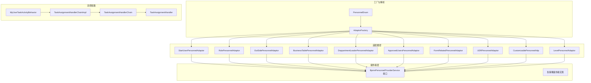
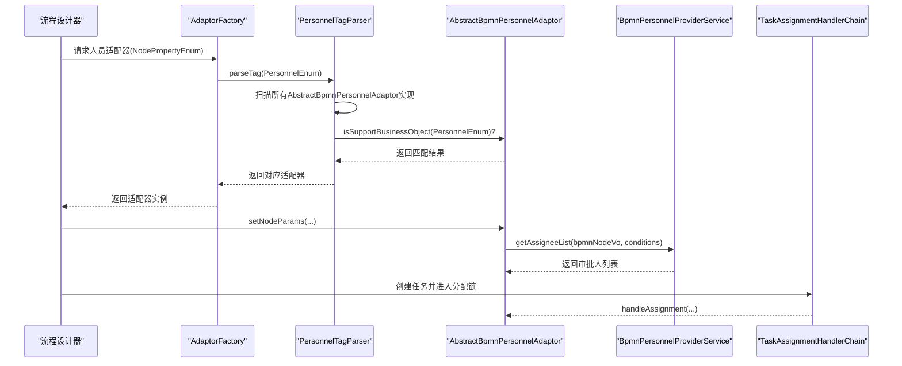
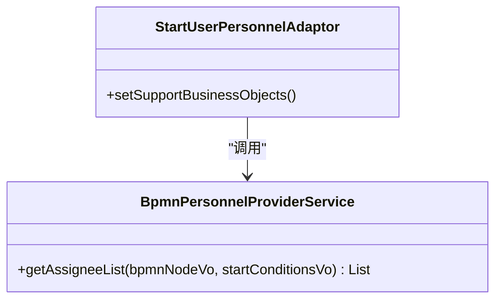
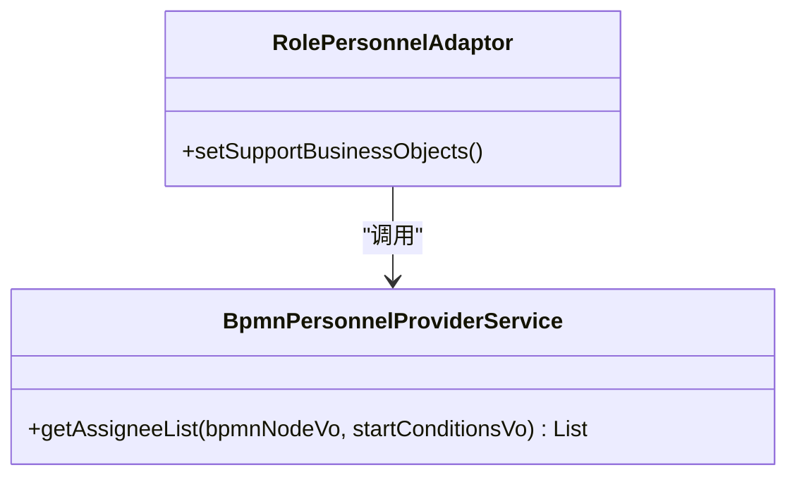
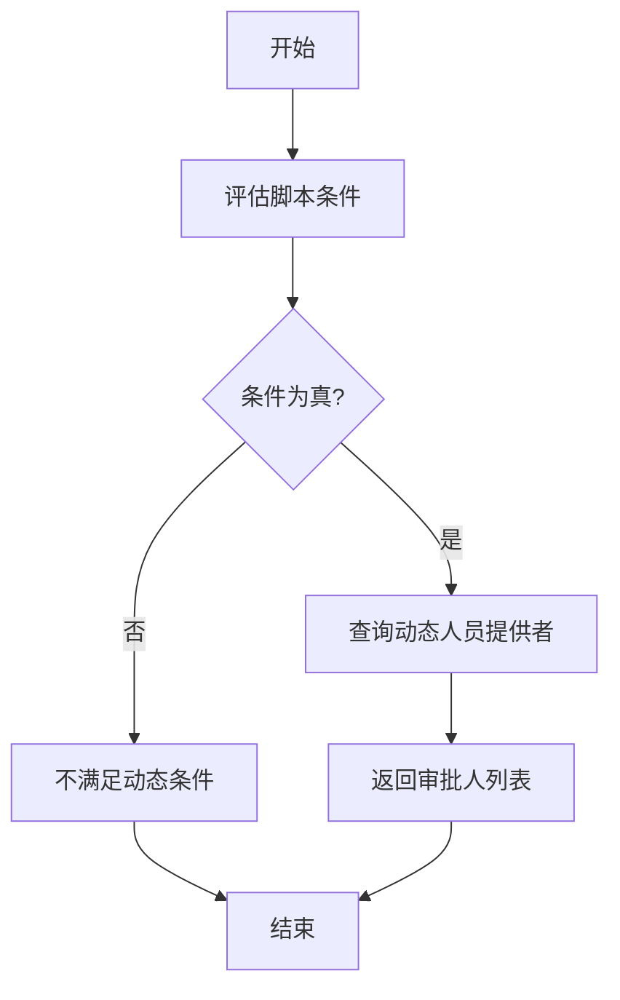
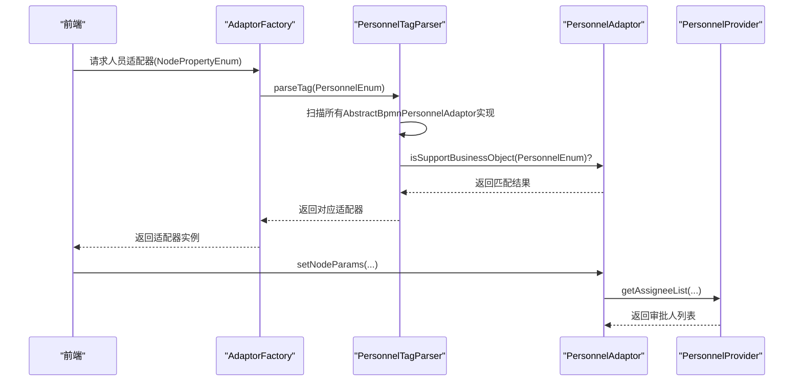
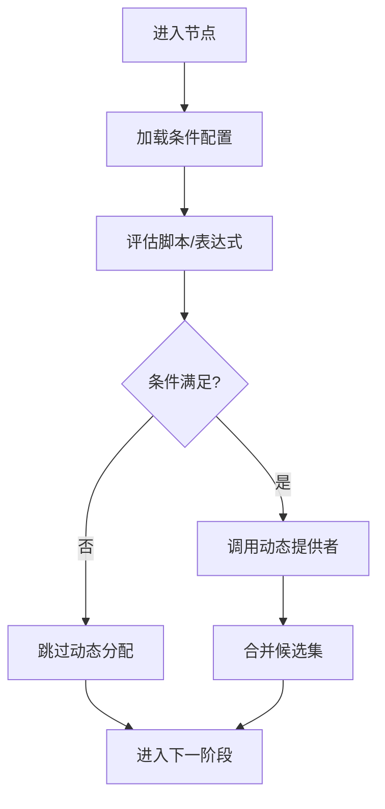

# 任务分配策略

<cite>
**本文引用的文件**
- [AbstractBusinessConfigurationAdaptor.java](file://antflow-engine/src/main/java/org/openoa/engine/bpmnconf/adp/personneladp/AbstractBusinessConfigurationAdaptor.java)
- [StartUserPersonnelAdaptor.java](file://antflow-engine/src/main/java/org/openoa/engine/bpmnconf/adp/personneladp/StartUserPersonnelAdaptor.java)
- [RolePersonnelAdaptor.java](file://antflow-engine/src/main/java/org/openoa/engine/bpmnconf/adp/personneladp/RolePersonnelAdaptor.java)
- [OutSidePersonnelAdaptor.java](file://antflow-engine/src/main/java/org/openoa/engine/bpmnconf/adp/personneladp/OutSidePersonnelAdaptor.java)
- [BusinessTablePersonnelAdaptor.java](file://antflow-engine/src/main/java/org/openoa/engine/bpmnconf/adp/personneladp/BusinessTablePersonnelAdaptor.java)
- [DeppartmentLeaderPersonnelAdaptor.java](file://antflow-engine/src/main/java/org/openoa/engine/bpmnconf/adp/personneladp/DeppartmentLeaderPersonnelAdaptor.java)
- [ApprovedUsersPersonnelAdaptor.java](file://antflow-engine/src/main/java/org/openoa/engine/bpmnconf/adp/personneladp/ApprovedUsersPersonnelAdaptor.java)
- [FormRelatedPersonnelAdaptor.java](file://antflow-engine/src/main/java/org/openoa/engine/bpmnconf/adp/personneladp/FormRelatedPersonnelAdaptor.java)
- [UDRPersonnelAdaptor.java](file://antflow-engine/src/main/java/org/openoa/engine/bpmnconf/adp/personneladp/UDRPersonnelAdaptor.java)
- [CustomizablePersonnelAdp.java](file://antflow-engine/src/main/java/org/openoa/engine/bpmnconf/adp/personneladp/CustomizablePersonnelAdp.java)
- [LevelPersonnelAdaptor.java](file://antflow-engine/src/main/java/org/openoa/engine/bpmnconf/adp/personneladp/LevelPersonnelAdaptor.java)
- [AdaptorFactory.java](file://antflow-engine/src/main/java/org/openoa/engine/factory/AdaptorFactory.java)
- [BpmnPersonnelProviderService.java](file://antflow-base/src/main/java/org/openoa/base/interf/BpmnPersonnelProviderService.java)
- [PersonnelEnum.java](file://antflow-base/src/main/java/org/openoa/base/constant/enums/PersonnelEnum.java)
- [TaskAssignmentHandler.java](file://antflow-engine/src/main/java/org/openoa/engine/bpmnconf/service/flowcontrol/TaskAssignmentHandler.java)
- [TaskAssignmentHandlerChainImpl.java](file://antflow-engine/src/main/java/org/openoa/engine/bpmnconf/service/flowcontrol/TaskAssignmentHandlerChainImpl.java)
- [TaskAssignmentHandlerChain.java](file://antflow-engine/src/main/java/org/openoa/engine/bpmnconf/service/flowcontrol/TaskAssignmentHandlerChain.java)
- [MyUserTaskActivityBehavior.java](file://antflow-engine/src/main/java/org/openoa/engine/bpmnconf/service/flowcontrol/MyUserTaskActivityBehavior.java)
- [ScriptCondition.java](file://antflow-base/src/main/java/org/activiti/engine/impl/scripting/ScriptCondition.java)
- [UelExpressionCondition.java](file://antflow-base/src/main/java/org/activiti/engine/impl/el/UelExpressionCondition.java)
- [Antflow新增审批人规则完整实现指南.md](file://doc/高级篇/Antflow新增审批人规则完整实现指南.md)
- [4.后端系统.md](file://doc/系统介绍篇/4.后端系统.md)
- [6.流程配置系统.md](file://doc/系统介绍篇/6.流程配置系统.md)
</cite>

## 目录
1. [简介](#简介)
2. [项目结构](#项目结构)
3. [核心组件](#核心组件)
4. [架构总览](#架构总览)
5. [详细组件分析](#详细组件分析)
6. [依赖分析](#依赖分析)
7. [性能考虑](#性能考虑)
8. [故障排查指南](#故障排查指南)
9. [结论](#结论)
10. [附录](#附录)

## 简介
本文件围绕任务分配策略展开，系统性阐述用户分配、角色分配、动态分配三种策略的实现机制与应用场景；深入解析人员适配器体系，包括用户选择器、角色选择器、部门选择器等具体实现；阐明动态人员计算逻辑、条件评估机制与优先级处理；并给出任务分配算法、并发控制与负载均衡策略建议及配置与使用示例路径。

## 项目结构
任务分配策略相关代码主要分布在以下模块：
- 适配器层：人员适配器实现位于 personneladp 包，覆盖用户、角色、部门、发起人、被审批人、表单关联、UDR 规则、可自选、层级、业务表、外部接入等策略。
- 提供者层：各策略对应的人员提供者服务接口与实现，用于查询候选审批人。
- 工厂与解析：AdaptorFactory 与 PersonnelTagParser 负责根据节点属性解析并返回对应适配器。
- 流控链路：TaskAssignmentHandler 及其链式实现，贯穿任务创建与分配阶段。
- 条件评估：脚本与表达式条件评估器，支撑动态分支与动态人员选择。

图表来源
- [StartUserPersonnelAdaptor.java:1-25](file://antflow-engine/src/main/java/org/openoa/engine/bpmnconf/adp/personneladp/StartUserPersonnelAdaptor.java#L1-L25)
- [RolePersonnelAdaptor.java:1-25](file://antflow-engine/src/main/java/org/openoa/engine/bpmnconf/adp/personneladp/RolePersonnelAdaptor.java#L1-L25)
- [OutSidePersonnelAdaptor.java:1-25](file://antflow-engine/src/main/java/org/openoa/engine/bpmnconf/adp/personneladp/OutSidePersonnelAdaptor.java#L1-L25)
- [BusinessTablePersonnelAdaptor.java:1-25](file://antflow-engine/src/main/java/org/openoa/engine/bpmnconf/adp/personneladp/BusinessTablePersonnelAdaptor.java#L1-L25)
- [DeppartmentLeaderPersonnelAdaptor.java:1-20](file://antflow-engine/src/main/java/org/openoa/engine/bpmnconf/adp/personneladp/DeppartmentLeaderPersonnelAdaptor.java#L1-L20)
- [ApprovedUsersPersonnelAdaptor.java:1-18](file://antflow-engine/src/main/java/org/openoa/engine/bpmnconf/adp/personneladp/ApprovedUsersPersonnelAdaptor.java#L1-L18)
- [FormRelatedPersonnelAdaptor.java:1-20](file://antflow-engine/src/main/java/org/openoa/engine/bpmnconf/adp/personneladp/FormRelatedPersonnelAdaptor.java#L1-L20)
- [UDRPersonnelAdaptor.java:1-20](file://antflow-engine/src/main/java/org/openoa/engine/bpmnconf/adp/personneladp/UDRPersonnelAdaptor.java#L1-L20)
- [CustomizablePersonnelAdp.java:1-28](file://antflow-engine/src/main/java/org/openoa/engine/bpmnconf/adp/personneladp/CustomizablePersonnelAdp.java#L1-L28)
- [LevelPersonnelAdaptor.java:1-25](file://antflow-engine/src/main/java/org/openoa/engine/bpmnconf/adp/personneladp/LevelPersonnelAdaptor.java#L1-L25)
- [AdaptorFactory.java:1-34](file://antflow-engine/src/main/java/org/openoa/engine/factory/AdaptorFactory.java#L1-L34)
- [PersonnelEnum.java:1-54](file://antflow-base/src/main/java/org/openoa/base/constant/enums/PersonnelEnum.java#L1-L54)
- [TaskAssignmentHandler.java:1-13](file://antflow-engine/src/main/java/org/openoa/engine/bpmnconf/service/flowcontrol/TaskAssignmentHandler.java#L1-L13)
- [TaskAssignmentHandlerChain.java:1-13](file://antflow-engine/src/main/java/org/openoa/engine/bpmnconf/service/flowcontrol/TaskAssignmentHandlerChain.java#L1-L13)
- [TaskAssignmentHandlerChainImpl.java:1-55](file://antflow-engine/src/main/java/org/openoa/engine/bpmnconf/service/flowcontrol/TaskAssignmentHandlerChainImpl.java#L1-L55)
- [MyUserTaskActivityBehavior.java:1-33](file://antflow-engine/src/main/java/org/openoa/engine/bpmnconf/service/flowcontrol/MyUserTaskActivityBehavior.java#L1-L33)

章节来源
- [AdaptorFactory.java:1-34](file://antflow-engine/src/main/java/org/openoa/engine/factory/AdaptorFactory.java#L1-L34)
- [PersonnelEnum.java:1-54](file://antflow-base/src/main/java/org/openoa/base/constant/enums/PersonnelEnum.java#L1-L54)

## 核心组件
- 人员适配器：基于节点属性枚举，为不同策略提供统一的适配入口，封装参数设置与调用提供者获取审批人列表。
- 人员提供者服务：定义统一的 getAssigneeList 接口，具体策略通过实现类完成查询。
- 任务分配处理器链：在用户任务行为基础上构建链式处理器，按序执行分配逻辑。
- 条件评估器：脚本与表达式条件评估器，用于动态分支与动态人员选择的条件判断。

章节来源
- [BpmnPersonnelProviderService.java:1-26](file://antflow-base/src/main/java/org/openoa/base/interf/BpmnPersonnelProviderService.java#L1-L26)
- [TaskAssignmentHandler.java:1-13](file://antflow-engine/src/main/java/org/openoa/engine/bpmnconf/service/flowcontrol/TaskAssignmentHandler.java#L1-L13)
- [ScriptCondition.java:36-76](file://antflow-base/src/main/java/org/activiti/engine/impl/scripting/ScriptCondition.java#L36-L76)
- [UelExpressionCondition.java:36-63](file://antflow-base/src/main/java/org/activiti/engine/impl/el/UelExpressionCondition.java#L36-L63)

## 架构总览
下图展示了从节点属性到适配器、再到提供者与任务分配的整体流程：

图表来源
- [AdaptorFactory.java:23-26](file://antflow-engine/src/main/java/org/openoa/engine/factory/AdaptorFactory.java#L23-L26)
- [Antflow新增审批人规则完整实现指南.md:114-132](file://doc/高级篇/Antflow新增审批人规则完整实现指南.md#L114-L132)

章节来源
- [Antflow新增审批人规则完整实现指南.md:56-132](file://doc/高级篇/Antflow新增审批人规则完整实现指南.md#L56-L132)

## 详细组件分析

### 用户分配策略
- 策略说明：直接指定某个用户作为审批人，适用于固定审批人场景。
- 适配器实现：通过用户选择器策略适配器，绑定对应提供者服务。
- 应用场景：财务付款、合同审批等需要固定审批人的流程节点。

图表来源
- [StartUserPersonnelAdaptor.java:16-24](file://antflow-engine/src/main/java/org/openoa/engine/bpmnconf/adp/personneladp/StartUserPersonnelAdaptor.java#L16-L24)
- [BpmnPersonnelProviderService.java:18-25](file://antflow-base/src/main/java/org/openoa/base/interf/BpmnPersonnelProviderService.java#L18-L25)

章节来源
- [StartUserPersonnelAdaptor.java:1-25](file://antflow-engine/src/main/java/org/openoa/engine/bpmnconf/adp/personneladp/StartUserPersonnelAdaptor.java#L1-L25)

### 角色分配策略
- 策略说明：根据角色标识获取该角色下的所有用户，适用于按组织角色分发任务。
- 适配器实现：角色选择器策略适配器，绑定角色提供者服务。
- 应用场景：部门经理审批、合规审核、风控审批等。

图表来源
- [RolePersonnelAdaptor.java:16-24](file://antflow-engine/src/main/java/org/openoa/engine/bpmnconf/adp/personneladp/RolePersonnelAdaptor.java#L16-L24)
- [BpmnPersonnelProviderService.java:18-25](file://antflow-base/src/main/java/org/openoa/base/interf/BpmnPersonnelProviderService.java#L18-L25)

章节来源
- [RolePersonnelAdaptor.java:1-25](file://antflow-engine/src/main/java/org/openoa/engine/bpmnconf/adp/personneladp/RolePersonnelAdaptor.java#L1-L25)

### 动态分配策略
- 策略说明：依据流程运行时上下文与条件表达式动态计算审批人，支持脚本与表达式两种条件评估方式。
- 实现要点：
  - 条件评估：脚本条件与表达式条件均返回布尔值，决定是否满足动态分支或动态人员选择。
  - 人员提供：动态人员由对应提供者实现查询，结合条件评估结果进行筛选。
- 应用场景：跨部门协作、预算阈值触发、节假日/轮值排班等。

图表来源
- [ScriptCondition.java:39-60](file://antflow-base/src/main/java/org/activiti/engine/impl/scripting/ScriptCondition.java#L39-L60)
- [UelExpressionCondition.java:43-62](file://antflow-base/src/main/java/org/activiti/engine/impl/el/UelExpressionCondition.java#L43-L62)

章节来源
- [ScriptCondition.java:36-76](file://antflow-base/src/main/java/org/activiti/engine/impl/scripting/ScriptCondition.java#L36-L76)
- [UelExpressionCondition.java:36-63](file://antflow-base/src/main/java/org/activiti/engine/impl/el/UelExpressionCondition.java#L36-L63)

### 人员适配器工作原理
- 适配器注册与解析：工厂根据节点属性枚举解析 PersonnelEnum，扫描所有适配器实现并通过 isSupportBusinessObject 判断匹配。
- 参数设置：适配器接收节点参数与业务条件，调用对应提供者查询审批人。
- 提供者职责：实现 getAssigneeList，返回候选审批人集合。

图表来源
- [AdaptorFactory.java:23-26](file://antflow-engine/src/main/java/org/openoa/engine/factory/AdaptorFactory.java#L23-L26)
- [Antflow新增审批人规则完整实现指南.md:114-132](file://doc/高级篇/Antflow新增审批人规则完整实现指南.md#L114-L132)

章节来源
- [AdaptorFactory.java:1-34](file://antflow-engine/src/main/java/org/openoa/engine/factory/AdaptorFactory.java#L1-L34)
- [Antflow新增审批人规则完整实现指南.md:110-132](file://doc/高级篇/Antflow新增审批人规则完整实现指南.md#L110-L132)

### 动态人员计算逻辑、条件评估机制与优先级处理
- 动态人员计算：在节点执行时，先评估条件（脚本或表达式），满足条件后调用对应提供者查询人员。
- 条件评估机制：
  - 脚本条件：支持语言与执行上下文，返回布尔值。
  - 表达式条件：通过表达式管理器求值，返回布尔值。
- 优先级处理：当存在多个动态条件时，应明确条件顺序与互斥关系，避免重复触发；可通过条件编号或组合条件实现优先级。

图表来源
- [ScriptCondition.java:39-60](file://antflow-base/src/main/java/org/activiti/engine/impl/scripting/ScriptCondition.java#L39-L60)
- [UelExpressionCondition.java:43-62](file://antflow-base/src/main/java/org/activiti/engine/impl/el/UelExpressionCondition.java#L43-L62)

章节来源
- [ScriptCondition.java:36-76](file://antflow-base/src/main/java/org/activiti/engine/impl/scripting/ScriptCondition.java#L36-L76)
- [UelExpressionCondition.java:36-63](file://antflow-base/src/main/java/org/activiti/engine/impl/el/UelExpressionCondition.java#L36-L63)

### 任务分配算法、并发控制与负载均衡策略
- 分配算法：
  - 串行分配：按策略顺序依次查询，合并候选集。
  - 并发分配：对多策略查询采用并行执行，最后合并去重。
- 并发控制：
  - 使用线程池限制并发度，避免大量查询导致数据库压力。
  - 对提供者查询加超时与重试策略。
- 负载均衡：
  - 对热点提供者增加缓存层，减少重复查询。
  - 在多实例或多租户场景下，按租户/部门维度进行分片查询。

章节来源
- [4.后端系统.md:252-361](file://doc/系统介绍篇/4.后端系统.md#L252-L361)

## 依赖分析
- 适配器与提供者：各策略适配器依赖对应提供者服务接口，通过统一的 getAssigneeList 获取审批人。
- 工厂与枚举：工厂根据 PersonnelEnum 与节点属性解析适配器，确保策略与节点配置一致。
- 流控链路：任务行为扩展通过链式处理器实现分配逻辑的可插拔与可组合。

图表来源
- [PersonnelEnum.java:38-48](file://antflow-base/src/main/java/org/openoa/base/constant/enums/PersonnelEnum.java#L38-L48)
- [AdaptorFactory.java:23-26](file://antflow-engine/src/main/java/org/openoa/engine/factory/AdaptorFactory.java#L23-L26)
- [BpmnPersonnelProviderService.java:18-25](file://antflow-base/src/main/java/org/openoa/base/interf/BpmnPersonnelProviderService.java#L18-L25)
- [MyUserTaskActivityBehavior.java:23-33](file://antflow-engine/src/main/java/org/openoa/engine/bpmnconf/service/flowcontrol/MyUserTaskActivityBehavior.java#L23-L33)
- [TaskAssignmentHandlerChainImpl.java:23-54](file://antflow-engine/src/main/java/org/openoa/engine/bpmnconf/service/flowcontrol/TaskAssignmentHandlerChainImpl.java#L23-L54)

章节来源
- [PersonnelEnum.java:1-54](file://antflow-base/src/main/java/org/openoa/base/constant/enums/PersonnelEnum.java#L1-L54)
- [AdaptorFactory.java:1-34](file://antflow-engine/src/main/java/org/openoa/engine/factory/AdaptorFactory.java#L1-L34)
- [TaskAssignmentHandlerChainImpl.java:1-55](file://antflow-engine/src/main/java/org/openoa/engine/bpmnconf/service/flowcontrol/TaskAssignmentHandlerChainImpl.java#L1-L55)

## 性能考虑
- 缓存策略：对常用角色、部门、发起人等查询结果进行缓存，降低数据库压力。
- 分页与限流：提供者查询支持分页与最大返回条数限制，避免一次性返回过多数据。
- 异步化：对于耗时较长的动态条件评估与人员查询，采用异步执行与回调机制。
- 数据库优化：为人员查询建立必要的索引，如角色、部门、状态等字段。

## 故障排查指南
- 适配器未匹配：确认节点属性与 PersonnelEnum 是否一致，检查 isSupportBusinessObject 的实现。
- 提供者返回空：核对业务条件与查询参数，确认提供者实现是否正确过滤。
- 条件评估失败：检查脚本/表达式语法与上下文变量，确保返回布尔值。
- 分配链异常：检查链式处理器顺序与异常处理，确保异常可捕获与日志记录。

章节来源
- [ScriptCondition.java:52-60](file://antflow-base/src/main/java/org/activiti/engine/impl/scripting/ScriptCondition.java#L52-L60)
- [UelExpressionCondition.java:53-62](file://antflow-base/src/main/java/org/activiti/engine/impl/el/UelExpressionCondition.java#L53-L62)

## 结论
本系统通过人员适配器与提供者服务实现了灵活的任务分配策略，结合条件评估与链式流控，能够覆盖从固定用户到动态人员的多种场景。建议在生产环境中引入缓存、限流与异步化策略，确保高并发下的稳定性与性能。

## 附录

### 策略配置与使用示例路径
- 用户分配：参考适配器与提供者绑定关系，设置节点属性为用户选择器。
  - 示例路径：[StartUserPersonnelAdaptor.java:16-24](file://antflow-engine/src/main/java/org/openoa/engine/bpmnconf/adp/personneladp/StartUserPersonnelAdaptor.java#L16-L24)
- 角色分配：设置节点属性为角色选择器，绑定角色提供者。
  - 示例路径：[RolePersonnelAdaptor.java:16-24](file://antflow-engine/src/main/java/org/openoa/engine/bpmnconf/adp/personneladp/RolePersonnelAdaptor.java#L16-L24)
- 动态分配：配置脚本或表达式条件，满足条件后调用动态提供者。
  - 示例路径：[ScriptCondition.java:39-60](file://antflow-base/src/main/java/org/activiti/engine/impl/scripting/ScriptCondition.java#L39-L60)，[UelExpressionCondition.java:43-62](file://antflow-base/src/main/java/org/activiti/engine/impl/el/UelExpressionCondition.java#L43-L62)
- 业务表关联：通过业务表人员适配器与提供者实现跨表联动。
  - 示例路径：[BusinessTablePersonnelAdaptor.java:16-24](file://antflow-engine/src/main/java/org/openoa/engine/bpmnconf/adp/personneladp/BusinessTablePersonnelAdaptor.java#L16-L24)

章节来源
- [StartUserPersonnelAdaptor.java:1-25](file://antflow-engine/src/main/java/org/openoa/engine/bpmnconf/adp/personneladp/StartUserPersonnelAdaptor.java#L1-L25)
- [RolePersonnelAdaptor.java:1-25](file://antflow-engine/src/main/java/org/openoa/engine/bpmnconf/adp/personneladp/RolePersonnelAdaptor.java#L1-L25)
- [BusinessTablePersonnelAdaptor.java:1-25](file://antflow-engine/src/main/java/org/openoa/engine/bpmnconf/adp/personneladp/BusinessTablePersonnelAdaptor.java#L1-L25)
- [ScriptCondition.java:36-76](file://antflow-base/src/main/java/org/activiti/engine/impl/scripting/ScriptCondition.java#L36-L76)
- [UelExpressionCondition.java:36-63](file://antflow-base/src/main/java/org/activiti/engine/impl/el/UelExpressionCondition.java#L36-L63)