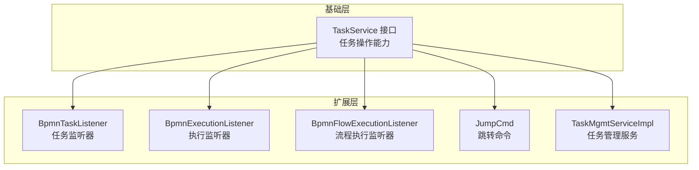
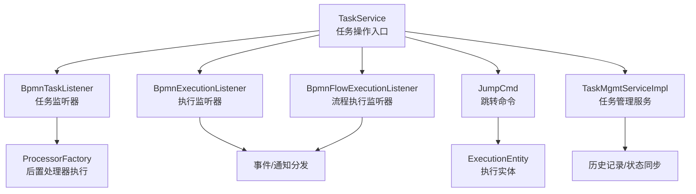
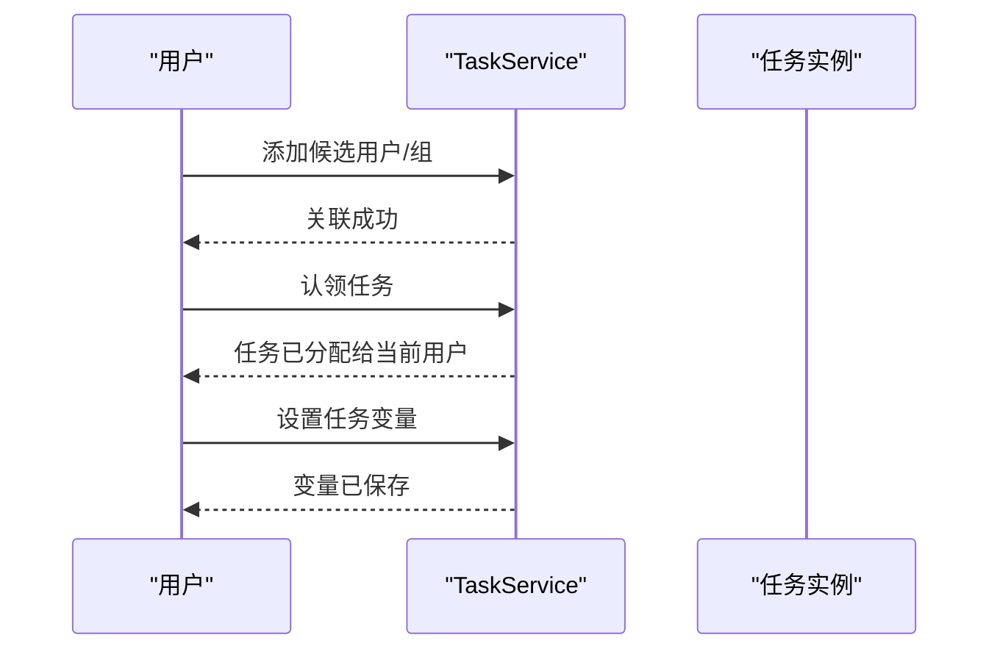
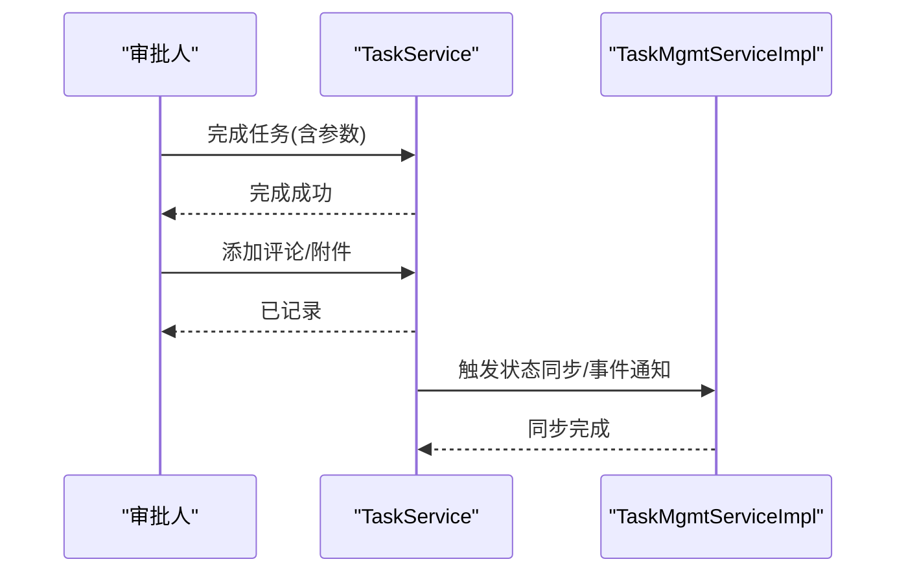
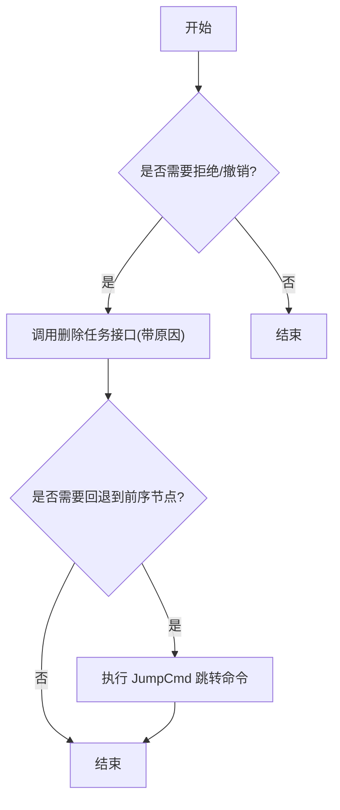
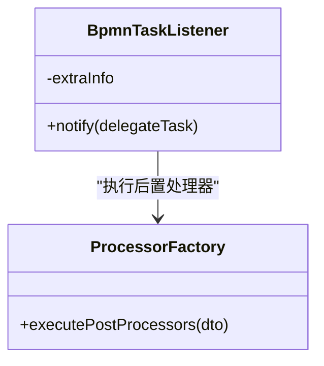
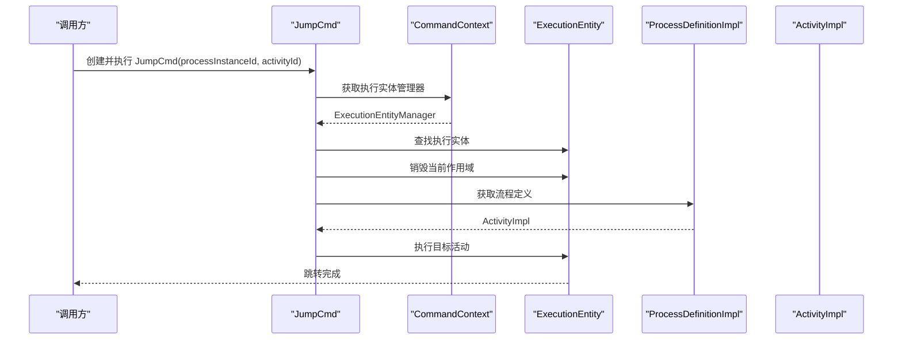
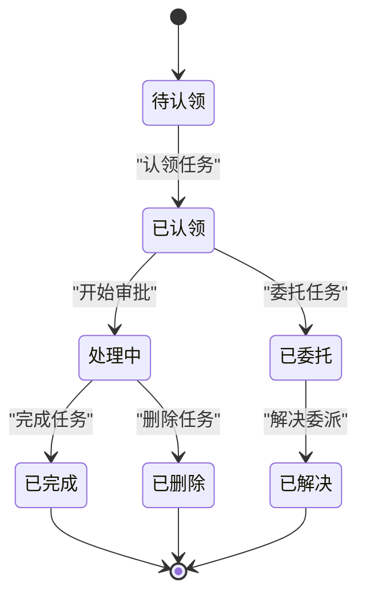
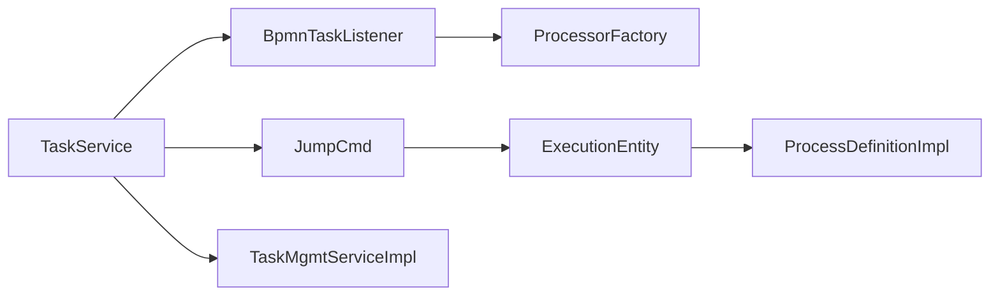

# 任务处理流程

<cite>
**本文引用的文件**
- [JumpCmd.java](file://antflow-engine/src/main/java/org/openoa/engine/bpmnconf/cmd/JumpCmd.java)
- [BpmnTaskListener.java](file://antflow-engine/src/main/java/org/openoa/engine/bpmnconf/activitilistener/BpmnTaskListener.java)
- [TaskService.java](file://antflow-base/src/main/java/org/activiti/engine/TaskService.java)
- [TaskMgmtServiceImpl.java](file://antflow-engine/src/main/java/org/openoa/engine/bpmnconf/common/TaskMgmtServiceImpl.java)
- [BpmnExecutionListener.java](file://antflow-engine/src/main/java/org/openoa/engine/bpmnconf/activitilistener/BpmnExecutionListener.java)
- [BpmnFlowExecutionListener.java](file://antflow-engine/src/main/java/org/openoa/engine/bpmnconf/activitilistener/BpmnFlowExecutionListener.java)
</cite>

## 目录
1. [简介](#简介)
2. [项目结构](#项目结构)
3. [核心组件](#核心组件)
4. [架构总览](#架构总览)
5. [详细组件分析](#详细组件分析)
6. [依赖分析](#依赖分析)
7. [性能考虑](#性能考虑)
8. [故障排查指南](#故障排查指南)
9. [结论](#结论)
10. [附录](#附录)

## 简介
本文件围绕 AntFlow 工作流引擎中的“任务处理流程”进行系统化梳理，覆盖任务从创建到完成的全生命周期管理，重点解析以下方面：
- 任务收集：候选用户/组、任务分配与认领
- 审批处理：任务完成、委托与转办、变量传递
- 拒绝操作：任务删除、回退与撤销
- 完成确认：任务状态转换与历史记录
- 任务监听器：执行监听器与任务监听器的触发时机与处理逻辑
- 跳转命令：JumpCmd 的实现原理与使用场景
- 任务状态转换、数据同步与事件通知机制
- 提供流程图与代码示例路径，帮助定位关键步骤与扩展点

## 项目结构
AntFlow 将工作流能力分为基础层与业务扩展层：
- 基础层（antflow-base）：封装 Activiti 引擎接口与通用能力，如 TaskService、RuntimeService 等
- 扩展层（antflow-engine）：在基础之上提供业务监听器、命令扩展、任务管理服务等

图表来源
- [TaskService.java:38-477](file://antflow-base/src/main/java/org/activiti/engine/TaskService.java#L38-L477)
- [BpmnTaskListener.java:59-123](file://antflow-engine/src/main/java/org/openoa/engine/bpmnconf/activitilistener/BpmnTaskListener.java#L59-L123)
- [BpmnExecutionListener.java](file://antflow-engine/src/main/java/org/openoa/engine/bpmnconf/activitilistener/BpmnExecutionListener.java)
- [BpmnFlowExecutionListener.java](file://antflow-engine/src/main/java/org/openoa/engine/bpmnconf/activitilistener/BpmnFlowExecutionListener.java)
- [JumpCmd.java:12-35](file://antflow-engine/src/main/java/org/openoa/engine/bpmnconf/cmd/JumpCmd.java#L12-L35)
- [TaskMgmtServiceImpl.java](file://antflow-engine/src/main/java/org/openoa/engine/bpmnconf/common/TaskMgmtServiceImpl.java)

章节来源
- [TaskService.java:38-477](file://antflow-base/src/main/java/org/activiti/engine/TaskService.java#L38-L477)

## 核心组件
- 任务服务（TaskService）：提供任务创建、认领、完成、委托、转办、评论、附件、变量等核心能力
- 任务监听器（BpmnTaskListener）：在任务生命周期事件中注入业务上下文、执行后置处理器
- 执行监听器（BpmnExecutionListener/BpmnFlowExecutionListener）：在流程/节点执行阶段触发，用于状态变更与通知
- 跳转命令（JumpCmd）：通过命令模式直接驱动执行指针跳转至指定活动
- 任务管理服务（TaskMgmtServiceImpl）：封装任务状态转换、数据同步与事件通知

章节来源
- [TaskService.java:38-477](file://antflow-base/src/main/java/org/activiti/engine/TaskService.java#L38-L477)
- [BpmnTaskListener.java:59-123](file://antflow-engine/src/main/java/org/openoa/engine/bpmnconf/activitilistener/BpmnTaskListener.java#L59-L123)
- [BpmnExecutionListener.java](file://antflow-engine/src/main/java/org/openoa/engine/bpmnconf/activitilistener/BpmnExecutionListener.java)
- [BpmnFlowExecutionListener.java](file://antflow-engine/src/main/java/org/openoa/engine/bpmnconf/activitilistener/BpmnFlowExecutionListener.java)
- [JumpCmd.java:12-35](file://antflow-engine/src/main/java/org/openoa/engine/bpmnconf/cmd/JumpCmd.java#L12-L35)
- [TaskMgmtServiceImpl.java](file://antflow-engine/src/main/java/org/openoa/engine/bpmnconf/common/TaskMgmtServiceImpl.java)

## 架构总览
下图展示了任务生命周期中各组件的交互关系与职责分工：

图表来源
- [TaskService.java:38-477](file://antflow-base/src/main/java/org/activiti/engine/TaskService.java#L38-L477)
- [BpmnTaskListener.java:59-123](file://antflow-engine/src/main/java/org/openoa/engine/bpmnconf/activitilistener/BpmnTaskListener.java#L59-L123)
- [BpmnExecutionListener.java](file://antflow-engine/src/main/java/org/openoa/engine/bpmnconf/activitilistener/BpmnExecutionListener.java)
- [BpmnFlowExecutionListener.java](file://antflow-engine/src/main/java/org/openoa/engine/bpmnconf/activitilistener/BpmnFlowExecutionListener.java)
- [JumpCmd.java:12-35](file://antflow-engine/src/main/java/org/openoa/engine/bpmnconf/cmd/JumpCmd.java#L12-L35)
- [TaskMgmtServiceImpl.java](file://antflow-engine/src/main/java/org/openoa/engine/bpmnconf/common/TaskMgmtServiceImpl.java)

## 详细组件分析

### 任务收集与分配
- 候选人/组关联：通过 TaskService 的候选用户/组添加方法建立任务与身份的关联
- 认领与委派：支持任务认领（claim/unclaim）、委托（delegateTask）与解决（resolveTask）
- 变量与本地变量：支持任务级变量设置与查询，满足个性化表单与后续处理需求

图表来源
- [TaskService.java:236-298](file://antflow-base/src/main/java/org/activiti/engine/TaskService.java#L236-L298)
- [TaskService.java:330-395](file://antflow-base/src/main/java/org/activiti/engine/TaskService.java#L330-L395)

章节来源
- [TaskService.java:236-298](file://antflow-base/src/main/java/org/activiti/engine/TaskService.java#L236-L298)
- [TaskService.java:330-395](file://antflow-base/src/main/java/org/activiti/engine/TaskService.java#L330-L395)

### 审批处理与完成确认
- 完成任务：支持带参数完成（complete），可传入任务变量或本地作用域变量
- 委派与转办：委托给他人处理，完成后需解决委派状态
- 评论与附件：为审批过程提供证据链与补充信息

图表来源
- [TaskService.java:149-203](file://antflow-base/src/main/java/org/activiti/engine/TaskService.java#L149-L203)
- [TaskService.java:409-472](file://antflow-base/src/main/java/org/activiti/engine/TaskService.java#L409-L472)
- [TaskMgmtServiceImpl.java](file://antflow-engine/src/main/java/org/openoa/engine/bpmnconf/common/TaskMgmtServiceImpl.java)

章节来源
- [TaskService.java:149-203](file://antflow-base/src/main/java/org/activiti/engine/TaskService.java#L149-L203)
- [TaskService.java:409-472](file://antflow-base/src/main/java/org/activiti/engine/TaskService.java#L409-L472)
- [TaskMgmtServiceImpl.java](file://antflow-engine/src/main/java/org/openoa/engine/bpmnconf/common/TaskMgmtServiceImpl.java)

### 拒绝操作与撤销
- 删除任务：支持按原因删除任务，并可选择是否级联删除历史
- 回退与撤销：结合流程跳转命令（JumpCmd）实现节点回退与状态重置

图表来源
- [TaskService.java:67-122](file://antflow-base/src/main/java/org/activiti/engine/TaskService.java#L67-L122)
- [JumpCmd.java:12-35](file://antflow-engine/src/main/java/org/openoa/engine/bpmnconf/cmd/JumpCmd.java#L12-L35)

章节来源
- [TaskService.java:67-122](file://antflow-base/src/main/java/org/activiti/engine/TaskService.java#L67-L122)
- [JumpCmd.java:12-35](file://antflow-engine/src/main/java/org/openoa/engine/bpmnconf/cmd/JumpCmd.java#L12-L35)

### 任务监听器机制
- 任务监听器（BpmnTaskListener）：在任务事件发生时注入业务上下文（流程编码、业务编号、表单编码、发起人等），并执行后置处理器，便于扩展审批规则与数据准备
- 执行监听器（BpmnExecutionListener/BpmnFlowExecutionListener）：在流程/节点执行阶段触发，负责状态变更、通知发送与后续处理

图表来源
- [BpmnTaskListener.java:59-123](file://antflow-engine/src/main/java/org/openoa/engine/bpmnconf/activitilistener/BpmnTaskListener.java#L59-L123)

章节来源
- [BpmnTaskListener.java:59-123](file://antflow-engine/src/main/java/org/openoa/engine/bpmnconf/activitilistener/BpmnTaskListener.java#L59-L123)
- [BpmnExecutionListener.java](file://antflow-engine/src/main/java/org/openoa/engine/bpmnconf/activitilistener/BpmnExecutionListener.java)
- [BpmnFlowExecutionListener.java](file://antflow-engine/src/main/java/org/openoa/engine/bpmnconf/activitilistener/BpmnFlowExecutionListener.java)

### 跳转命令实现原理与使用场景
- 实现原理：通过命令模式获取执行实体，销毁当前作用域并定位目标活动，强制执行目标活动，从而实现流程跳转
- 使用场景：审批不通过回退至上一审批节点、异常分支处理、跨节点跳转等

图表来源
- [JumpCmd.java:12-35](file://antflow-engine/src/main/java/org/openoa/engine/bpmnconf/cmd/JumpCmd.java#L12-L35)

章节来源
- [JumpCmd.java:12-35](file://antflow-engine/src/main/java/org/openoa/engine/bpmnconf/cmd/JumpCmd.java#L12-L35)

### 任务状态转换、数据同步与事件通知
- 状态转换：通过任务完成、删除、委托、转办等操作驱动状态迁移
- 数据同步：任务管理服务在完成后进行历史记录更新与数据同步
- 事件通知：执行监听器与任务监听器在关键节点触发事件，推送通知与后续处理

图表来源
- [TaskService.java:124-183](file://antflow-base/src/main/java/org/activiti/engine/TaskService.java#L124-L183)
- [TaskMgmtServiceImpl.java](file://antflow-engine/src/main/java/org/openoa/engine/bpmnconf/common/TaskMgmtServiceImpl.java)

章节来源
- [TaskService.java:124-183](file://antflow-base/src/main/java/org/activiti/engine/TaskService.java#L124-L183)
- [TaskMgmtServiceImpl.java](file://antflow-engine/src/main/java/org/openoa/engine/bpmnconf/common/TaskMgmtServiceImpl.java)

## 依赖分析
- 组件耦合：任务监听器依赖任务服务与处理器工厂；跳转命令依赖执行实体与流程定义；任务管理服务依赖历史与状态同步
- 外部依赖：基于 Activiti 引擎的 TaskService 与命令上下文

图表来源
- [TaskService.java:38-477](file://antflow-base/src/main/java/org/activiti/engine/TaskService.java#L38-L477)
- [BpmnTaskListener.java:59-123](file://antflow-engine/src/main/java/org/openoa/engine/bpmnconf/activitilistener/BpmnTaskListener.java#L59-L123)
- [JumpCmd.java:12-35](file://antflow-engine/src/main/java/org/openoa/engine/bpmnconf/cmd/JumpCmd.java#L12-L35)
- [TaskMgmtServiceImpl.java](file://antflow-engine/src/main/java/org/openoa/engine/bpmnconf/common/TaskMgmtServiceImpl.java)

章节来源
- [TaskService.java:38-477](file://antflow-base/src/main/java/org/activiti/engine/TaskService.java#L38-L477)
- [BpmnTaskListener.java:59-123](file://antflow-engine/src/main/java/org/openoa/engine/bpmnconf/activitilistener/BpmnTaskListener.java#L59-L123)
- [JumpCmd.java:12-35](file://antflow-engine/src/main/java/org/openoa/engine/bpmnconf/cmd/JumpCmd.java#L12-L35)
- [TaskMgmtServiceImpl.java](file://antflow-engine/src/main/java/org/openoa/engine/bpmnconf/common/TaskMgmtServiceImpl.java)

## 性能考虑
- 任务变量访问：优先使用局部变量减少作用域查找开销
- 批量操作：批量删除任务时注意级联删除对历史表的影响
- 监听器执行：避免在监听器中执行耗时操作，必要时异步化
- 跳转命令：仅在必要时使用，避免频繁跳转导致状态不一致

## 故障排查指南
- 任务认领冲突：若任务已被他人认领，需先取消再认领
- 委派未解决：完成前必须先解决委派状态
- 删除失败：检查任务是否仍在运行流程中
- 跳转异常：确认目标活动 ID 是否存在于当前流程定义中

章节来源
- [TaskService.java:124-183](file://antflow-base/src/main/java/org/activiti/engine/TaskService.java#L124-L183)
- [TaskService.java:67-122](file://antflow-base/src/main/java/org/activiti/engine/TaskService.java#L67-L122)
- [JumpCmd.java:12-35](file://antflow-engine/src/main/java/org/openoa/engine/bpmnconf/cmd/JumpCmd.java#L12-L35)

## 结论
AntFlow 在 Activiti 基础之上提供了完善的任务生命周期管理能力，通过监听器扩展、命令式跳转与统一的任务管理服务，实现了灵活的审批流程编排与强大的业务适配性。建议在实际落地中：
- 明确监听器职责边界，避免过度耦合
- 合理使用跳转命令，确保流程可审计
- 做好状态同步与事件通知，保障数据一致性

## 附录
- 任务操作参考路径
  - [任务创建与保存:45-57](file://antflow-base/src/main/java/org/activiti/engine/TaskService.java#L45-L57)
  - [任务认领与取消认领:124-142](file://antflow-base/src/main/java/org/activiti/engine/TaskService.java#L124-142)
  - [任务完成与参数传递:149-203](file://antflow-base/src/main/java/org/activiti/engine/TaskService.java#L149-203)
  - [委托与解决委派:153-183](file://antflow-base/src/main/java/org/activiti/engine/TaskService.java#L153-183)
  - [删除任务与原因记录:67-122](file://antflow-base/src/main/java/org/activiti/engine/TaskService.java#L67-122)
  - [任务变量设置与查询:330-395](file://antflow-base/src/main/java/org/activiti/engine/TaskService.java#L330-395)
  - [评论与附件管理:409-472](file://antflow-base/src/main/java/org/activiti/engine/TaskService.java#L409-472)
- 监听器与命令参考路径
  - [任务监听器触发与后置处理器:59-123](file://antflow-engine/src/main/java/org/openoa/engine/bpmnconf/activitilistener/BpmnTaskListener.java#L59-123)
  - [执行监听器与流程监听器](file://antflow-engine/src/main/java/org/openoa/engine/bpmnconf/activitilistener/BpmnExecutionListener.java)
  - [流程跳转命令实现:12-35](file://antflow-engine/src/main/java/org/openoa/engine/bpmnconf/cmd/JumpCmd.java#L12-35)
  - [任务管理服务（状态同步/事件通知）](file://antflow-engine/src/main/java/org/openoa/engine/bpmnconf/common/TaskMgmtServiceImpl.java)