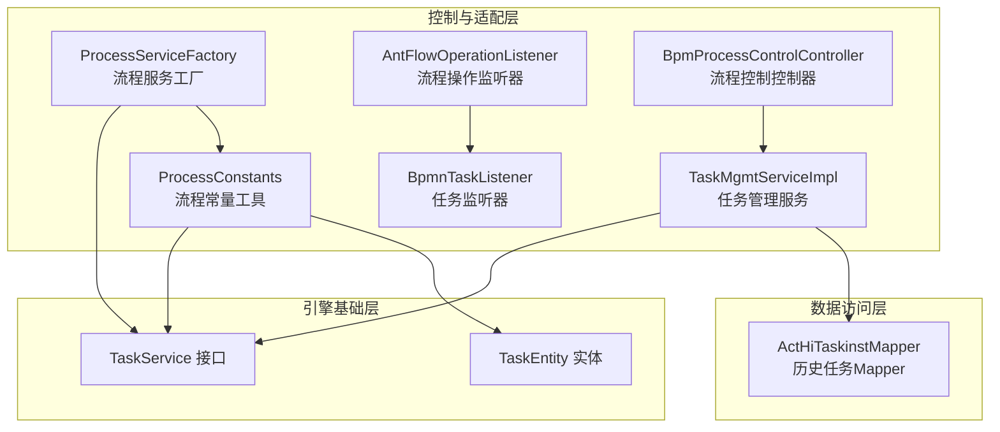
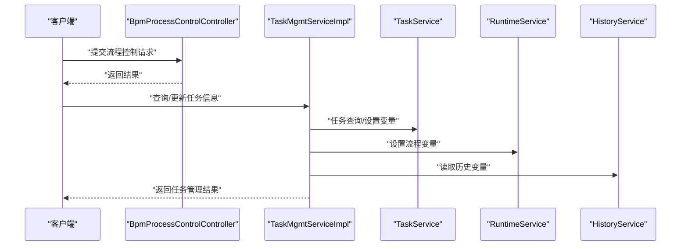
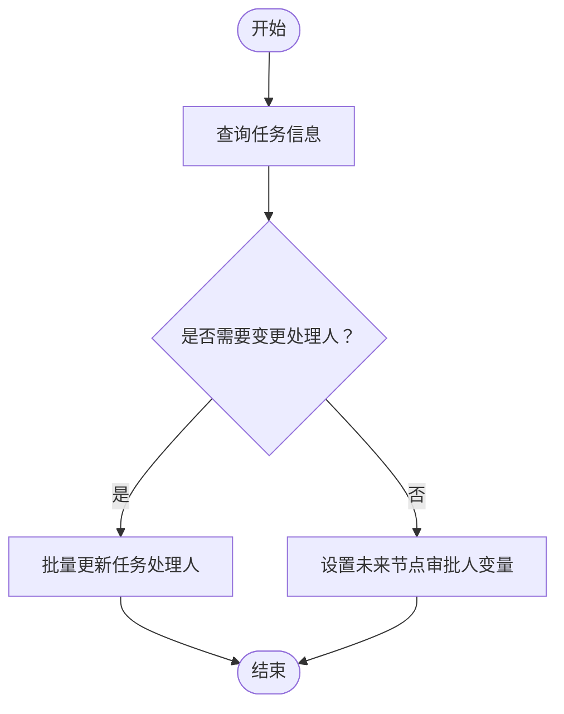
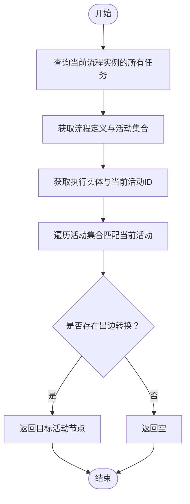
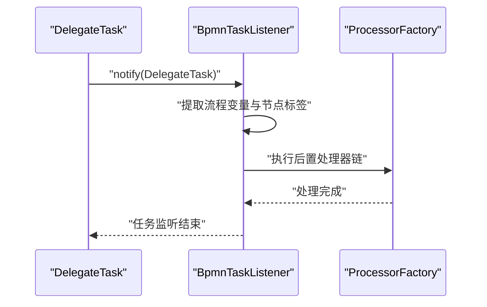
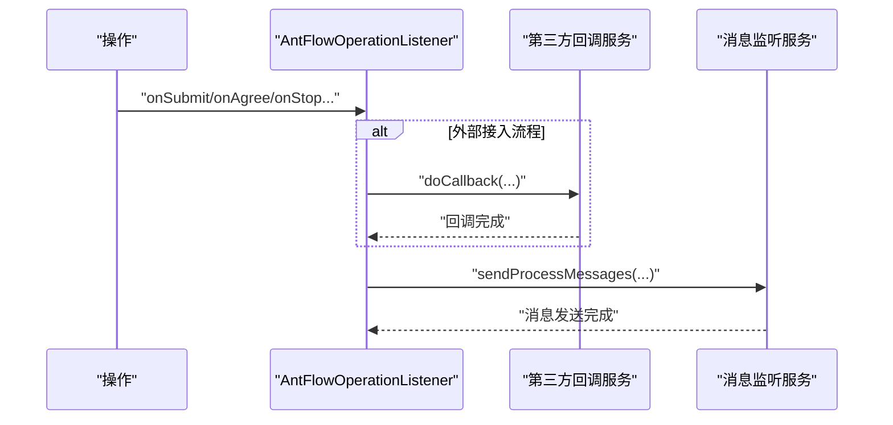
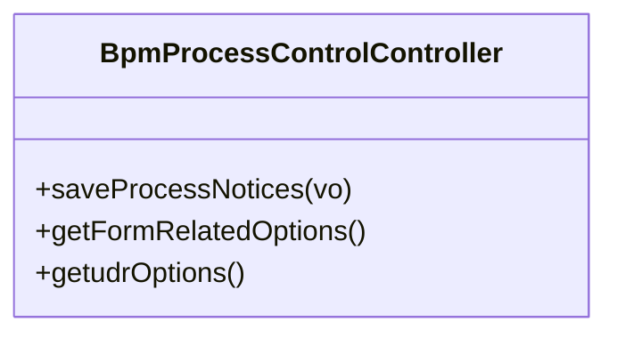
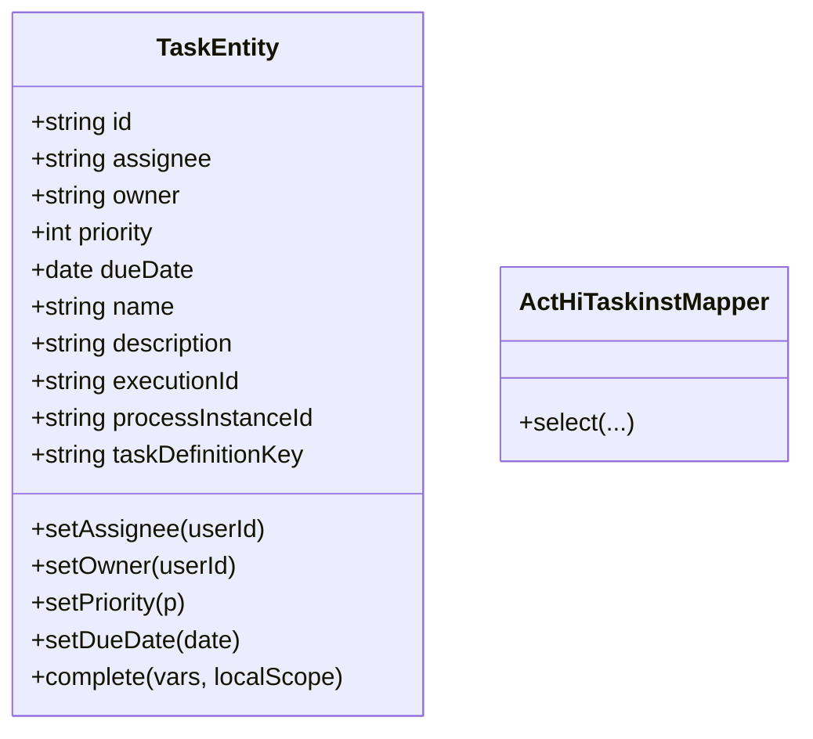
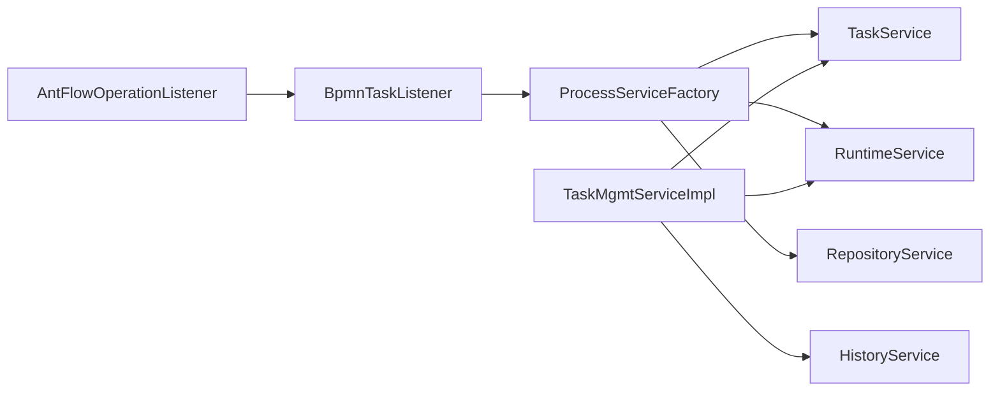

# 任务流控制机制

<cite>
**本文档引用的文件**
- [TaskMgmtServiceImpl.java](file://antflow-engine/src/main/java/org/openoa/engine/bpmnconf/common/TaskMgmtServiceImpl.java)
- [BpmProcessControlController.java](file://antflow-engine/src/main/java/org/openoa/engine/bpmnconf/controller/BpmProcessControlController.java)
- [TaskService.java](file://antflow-base/src/main/java/org/activiti/engine/TaskService.java)
- [ProcessConstants.java](file://antflow-engine/src/main/java/org/openoa/engine/bpmnconf/common/ProcessConstants.java)
- [TaskEntity.java](file://antflow-base/src/main/java/org/activiti/engine/impl/persistence/entity/TaskEntity.java)
- [ProcessServiceFactory.java](file://antflow-engine/src/main/java/org/openoa/engine/bpmnconf/common/ProcessServiceFactory.java)
- [AntFlowOperationListener.java](file://antflow-engine/src/main/java/org/openoa/engine/bpmnconf/activitilistener/AntFlowOperationListener.java)
- [BpmnTaskListener.java](file://antflow-engine/src/main/java/org/openoa/engine/bpmnconf/activitilistener/BpmnTaskListener.java)
- [ActHiTaskinstMapper.java](file://antflow-engine/src/main/java/org/openoa/engine/bpmnconf/mapper/ActHiTaskinstMapper.java)
</cite>

## 目录
1. [简介](#简介)
2. [项目结构](#项目结构)
3. [核心组件](#核心组件)
4. [架构总览](#架构总览)
5. [详细组件分析](#详细组件分析)
6. [依赖关系分析](#依赖关系分析)
7. [性能考虑](#性能考虑)
8. [故障排除指南](#故障排除指南)
9. [结论](#结论)
10. [附录](#附录)

## 简介
本文件系统性梳理任务流控制机制的设计与实现，覆盖任务分配策略、执行流程、用户与角色分配、动态分配、数据收集、审批流程、拒绝处理、完成操作、任务状态管理、并发控制、错误处理与重试机制，并提供可扩展点与关键实现路径指引。目标读者包括需要理解或扩展该任务流控制体系的工程师与技术管理者。

## 项目结构
任务流控制相关代码主要分布在以下模块：
- 引擎基础层：基于 Activiti 的 TaskService、TaskEntity 等核心接口与实体
- 控制与适配层：任务管理服务、流程常量工具、监听器与控制器
- 数据访问层：MyBatis Mapper 接口，用于历史任务等数据读取

**图表来源**
- [TaskMgmtServiceImpl.java:56-394](file://antflow-engine/src/main/java/org/openoa/engine/bpmnconf/common/TaskMgmtServiceImpl.java#L56-L394)
- [ProcessConstants.java:39-158](file://antflow-engine/src/main/java/org/openoa/engine/bpmnconf/common/ProcessConstants.java#L39-L158)
- [ProcessServiceFactory.java:19-67](file://antflow-engine/src/main/java/org/openoa/engine/bpmnconf/common/ProcessServiceFactory.java#L19-L67)
- [AntFlowOperationListener.java:18-207](file://antflow-engine/src/main/java/org/openoa/engine/bpmnconf/activitilistener/AntFlowOperationListener.java#L18-L207)
- [BpmnTaskListener.java:59-123](file://antflow-engine/src/main/java/org/openoa/engine/bpmnconf/activitilistener/BpmnTaskListener.java#L59-L123)
- [BpmProcessControlController.java:27-61](file://antflow-engine/src/main/java/org/openoa/engine/bpmnconf/controller/BpmProcessControlController.java#L27-L61)
- [ActHiTaskinstMapper.java:1-10](file://antflow-engine/src/main/java/org/openoa/engine/bpmnconf/mapper/ActHiTaskinstMapper.java#L1-L10)

**章节来源**
- [TaskMgmtServiceImpl.java:56-394](file://antflow-engine/src/main/java/org/openoa/engine/bpmnconf/common/TaskMgmtServiceImpl.java#L56-L394)
- [ProcessConstants.java:39-158](file://antflow-engine/src/main/java/org/openoa/engine/bpmnconf/common/ProcessConstants.java#L39-L158)
- [ProcessServiceFactory.java:19-67](file://antflow-engine/src/main/java/org/openoa/engine/bpmnconf/common/ProcessServiceFactory.java#L19-L67)
- [AntFlowOperationListener.java:18-207](file://antflow-engine/src/main/java/org/openoa/engine/bpmnconf/activitilistener/AntFlowOperationListener.java#L18-L207)
- [BpmnTaskListener.java:59-123](file://antflow-engine/src/main/java/org/openoa/engine/bpmnconf/activitilistener/BpmnTaskListener.java#L59-L123)
- [BpmProcessControlController.java:27-61](file://antflow-engine/src/main/java/org/openoa/engine/bpmnconf/controller/BpmProcessControlController.java#L27-L61)
- [ActHiTaskinstMapper.java:1-10](file://antflow-engine/src/main/java/org/openoa/engine/bpmnconf/mapper/ActHiTaskinstMapper.java#L1-L10)

## 核心组件
- 任务管理服务：负责任务查询、变更、执行实例重建、变量同步等
- 流程常量工具：提供下一节点解析、任务查询、前序任务定位等能力
- 流程服务工厂：聚合引擎服务（TaskService、RuntimeService、RepositoryService 等）
- 任务监听器：在任务生命周期触发时执行扩展逻辑
- 操作监听器：对流程提交、同意、终止、转发等操作进行回调与消息发送
- 控制器：对外暴露流程控制相关的接口（如流程通知配置、分配规则选项）

**章节来源**
- [TaskMgmtServiceImpl.java:56-394](file://antflow-engine/src/main/java/org/openoa/engine/bpmnconf/common/TaskMgmtServiceImpl.java#L56-L394)
- [ProcessConstants.java:39-158](file://antflow-engine/src/main/java/org/openoa/engine/bpmnconf/common/ProcessConstants.java#L39-L158)
- [ProcessServiceFactory.java:19-67](file://antflow-engine/src/main/java/org/openoa/engine/bpmnconf/common/ProcessServiceFactory.java#L19-L67)
- [BpmnTaskListener.java:59-123](file://antflow-engine/src/main/java/org/openoa/engine/bpmnconf/activitilistener/BpmnTaskListener.java#L59-L123)
- [AntFlowOperationListener.java:18-207](file://antflow-engine/src/main/java/org/openoa/engine/bpmnconf/activitilistener/AntFlowOperationListener.java#L18-L207)
- [BpmProcessControlController.java:27-61](file://antflow-engine/src/main/java/org/openoa/engine/bpmnconf/controller/BpmProcessControlController.java#L27-L61)

## 架构总览
任务流控制以 Activiti 引擎为核心，通过服务工厂注入引擎能力；业务侧通过任务管理服务与流程常量工具协调任务状态与流程推进；监听器在关键节点触发扩展处理；控制器提供对外接口。

**图表来源**
- [BpmProcessControlController.java:27-61](file://antflow-engine/src/main/java/org/openoa/engine/bpmnconf/controller/BpmProcessControlController.java#L27-L61)
- [TaskMgmtServiceImpl.java:56-394](file://antflow-engine/src/main/java/org/openoa/engine/bpmnconf/common/TaskMgmtServiceImpl.java#L56-L394)
- [TaskService.java:38-477](file://antflow-base/src/main/java/org/activiti/engine/TaskService.java#L38-L477)

## 详细组件分析

### 任务管理服务（TaskMgmtServiceImpl）
职责与能力：
- 任务查询与变更：支持按 taskId 查询、批量更新任务处理人
- 流程变量动态设置：为未来节点设置审批人列表
- 历史任务实例重建：复制历史任务、变量与执行上下文，重建当前活动任务
- 流程信息视图：整合表单模板、通知配置等信息

关键流程示意：

**图表来源**
- [TaskMgmtServiceImpl.java:86-167](file://antflow-engine/src/main/java/org/openoa/engine/bpmnconf/common/TaskMgmtServiceImpl.java#L86-L167)

实现要点：
- 使用 TaskService 查询任务，结合业务键与流程编码定位当前任务
- 通过 RuntimeService 设置流程变量，实现动态分配
- 历史任务重建时，复制 TaskEntity、VariableInstanceEntity 并更新历史任务状态

**章节来源**
- [TaskMgmtServiceImpl.java:86-394](file://antflow-engine/src/main/java/org/openoa/engine/bpmnconf/common/TaskMgmtServiceImpl.java#L86-L394)

### 流程常量工具（ProcessConstants）
职责与能力：
- 解析下一节点：基于当前任务与流程定义，计算下一个活动节点
- 任务查询：按业务键与流程编码查询当前任务 ID
- 前序任务定位：从历史任务中筛选已完成且非抄送节点的前序任务

**图表来源**
- [ProcessConstants.java:49-83](file://antflow-engine/src/main/java/org/openoa/engine/bpmnconf/common/ProcessConstants.java#L49-L83)

**章节来源**
- [ProcessConstants.java:49-158](file://antflow-engine/src/main/java/org/openoa/engine/bpmnconf/common/ProcessConstants.java#L49-L158)

### 任务监听器（BpmnTaskListener）
职责与能力：
- 在任务生命周期触发时，收集流程上下文（bpmnCode、processNumber、formCode、businessId、startUser 等），构建 BpmNextTaskDto
- 将节点额外信息写入任务表单键，供后续处理器使用
- 触发后置处理器链路，实现任务节点的扩展处理

**图表来源**
- [BpmnTaskListener.java:65-122](file://antflow-engine/src/main/java/org/openoa/engine/bpmnconf/activitilistener/BpmnTaskListener.java#L65-L122)

**章节来源**
- [BpmnTaskListener.java:65-123](file://antflow-engine/src/main/java/org/openoa/engine/bpmnconf/activitilistener/BpmnTaskListener.java#L65-L123)

### 操作监听器（AntFlowOperationListener）
职责与能力：
- 对流程关键操作（提交、同意、终止、转发、退回修改、加批等）进行回调与消息发送
- 支持外部接入场景下的回调处理

**图表来源**
- [AntFlowOperationListener.java:29-206](file://antflow-engine/src/main/java/org/openoa/engine/bpmnconf/activitilistener/AntFlowOperationListener.java#L29-L206)

**章节来源**
- [AntFlowOperationListener.java:29-207](file://antflow-engine/src/main/java/org/openoa/engine/bpmnconf/activitilistener/AntFlowOperationListener.java#L29-L207)

### 控制器（BpmProcessControlController）
职责与能力：
- 提供流程通知配置保存接口
- 返回表单相关选项（如“由发起人选择模块”等）
- 返回用户自定义规则选项（用于任务分配规则）

**图表来源**
- [BpmProcessControlController.java:27-61](file://antflow-engine/src/main/java/org/openoa/engine/bpmnconf/controller/BpmProcessControlController.java#L27-L61)

**章节来源**
- [BpmProcessControlController.java:27-61](file://antflow-engine/src/main/java/org/openoa/engine/bpmnconf/controller/BpmProcessControlController.java#L27-L61)

### 数据模型与实体
- TaskEntity：任务实体，包含任务属性（assignee、owner、priority、dueDate 等）、变量作用域、身份关联等
- 历史任务 Mapper：提供历史任务实例的查询能力，支撑前序任务定位与变量回溯

**图表来源**
- [TaskEntity.java:57-800](file://antflow-base/src/main/java/org/activiti/engine/impl/persistence/entity/TaskEntity.java#L57-L800)
- [ActHiTaskinstMapper.java:1-10](file://antflow-engine/src/main/java/org/openoa/engine/bpmnconf/mapper/ActHiTaskinstMapper.java#L1-L10)

**章节来源**
- [TaskEntity.java:57-800](file://antflow-base/src/main/java/org/activiti/engine/impl/persistence/entity/TaskEntity.java#L57-L800)
- [ActHiTaskinstMapper.java:1-10](file://antflow-engine/src/main/java/org/openoa/engine/bpmnconf/mapper/ActHiTaskinstMapper.java#L1-L10)

## 依赖关系分析
- 服务聚合：ProcessServiceFactory 注入 TaskService、RuntimeService、RepositoryService 等，为其他组件提供统一入口
- 任务管理服务依赖：TaskMgmtServiceImpl 依赖 TaskService、RuntimeService、HistoryService、Mapper 等
- 监听器依赖：BpmnTaskListener 与 AntFlowOperationListener 依赖业务上下文与消息服务

**图表来源**
- [ProcessServiceFactory.java:19-67](file://antflow-engine/src/main/java/org/openoa/engine/bpmnconf/common/ProcessServiceFactory.java#L19-L67)
- [TaskMgmtServiceImpl.java:56-76](file://antflow-engine/src/main/java/org/openoa/engine/bpmnconf/common/TaskMgmtServiceImpl.java#L56-L76)
- [BpmnTaskListener.java:59-123](file://antflow-engine/src/main/java/org/openoa/engine/bpmnconf/activitilistener/BpmnTaskListener.java#L59-L123)
- [AntFlowOperationListener.java:18-207](file://antflow-engine/src/main/java/org/openoa/engine/bpmnconf/activitilistener/AntFlowOperationListener.java#L18-L207)

**章节来源**
- [ProcessServiceFactory.java:19-67](file://antflow-engine/src/main/java/org/openoa/engine/bpmnconf/common/ProcessServiceFactory.java#L19-L67)
- [TaskMgmtServiceImpl.java:56-76](file://antflow-engine/src/main/java/org/openoa/engine/bpmnconf/common/TaskMgmtServiceImpl.java#L56-L76)
- [BpmnTaskListener.java:59-123](file://antflow-engine/src/main/java/org/openoa/engine/bpmnconf/activitilistener/BpmnTaskListener.java#L59-L123)
- [AntFlowOperationListener.java:18-207](file://antflow-engine/src/main/java/org/openoa/engine/bpmnconf/activitilistener/AntFlowOperationListener.java#L18-L207)

## 性能考虑
- 变量批量写入：历史变量复制采用批量插入，减少多次持久化开销
- 任务查询优化：通过流程实例 ID 与任务定义键进行定向查询，避免全表扫描
- 监听器轻量化：监听器仅做上下文提取与回调触发，避免重型计算
- 并发控制：利用 Activiti 内置的任务声明与委托状态，避免重复处理

[本节为通用指导，无需特定文件来源]

## 故障排除指南
常见问题与处理建议：
- 任务已处理但仍被查询：检查历史任务状态更新逻辑，确保历史任务 endTime 与删除原因正确
- 动态分配失败：确认流程变量设置成功，且未来节点审批人列表格式正确
- 监听器未触发：核对任务监听器注册与节点额外信息写入是否生效
- 外部回调异常：检查回调参数与第三方服务可用性

**章节来源**
- [TaskMgmtServiceImpl.java:350-394](file://antflow-engine/src/main/java/org/openoa/engine/bpmnconf/common/TaskMgmtServiceImpl.java#L350-L394)
- [AntFlowOperationListener.java:29-206](file://antflow-engine/src/main/java/org/openoa/engine/bpmnconf/activitilistener/AntFlowOperationListener.java#L29-L206)

## 结论
该任务流控制机制以 Activiti 为基础，通过任务管理服务、流程常量工具与监听器形成完整的任务生命周期管理体系。其支持动态分配、历史任务重建、消息回调与流程控制接口，具备良好的扩展性与可维护性。建议在生产环境中结合监控与日志完善可观测性，并持续优化变量批量处理与查询路径。

[本节为总结性内容，无需特定文件来源]

## 附录
- 关键实现路径参考
  - 任务查询与变更：[TaskMgmtServiceImpl.java:86-167](file://antflow-engine/src/main/java/org/openoa/engine/bpmnconf/common/TaskMgmtServiceImpl.java#L86-L167)
  - 历史任务重建：[TaskMgmtServiceImpl.java:258-394](file://antflow-engine/src/main/java/org/openoa/engine/bpmnconf/common/TaskMgmtServiceImpl.java#L258-L394)
  - 下一节点解析：[ProcessConstants.java:49-83](file://antflow-engine/src/main/java/org/openoa/engine/bpmnconf/common/ProcessConstants.java#L49-L83)
  - 任务监听与后置处理器：[BpmnTaskListener.java:65-122](file://antflow-engine/src/main/java/org/openoa/engine/bpmnconf/activitilistener/BpmnTaskListener.java#L65-L122)
  - 操作回调与消息发送：[AntFlowOperationListener.java:29-206](file://antflow-engine/src/main/java/org/openoa/engine/bpmnconf/activitilistener/AntFlowOperationListener.java#L29-L206)
  - 流程控制接口：[BpmProcessControlController.java:27-61](file://antflow-engine/src/main/java/org/openoa/engine/bpmnconf/controller/BpmProcessControlController.java#L27-L61)

[本节为补充说明，无需特定文件来源]