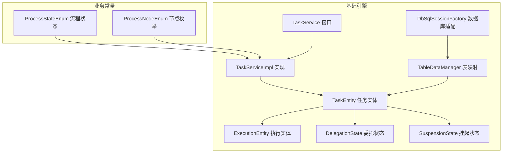
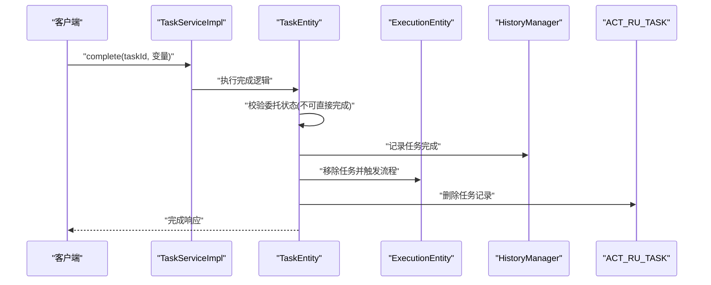
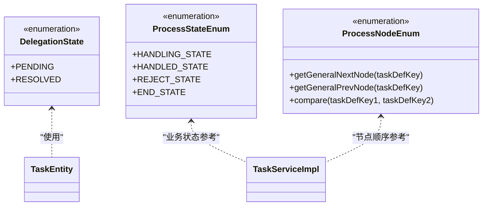
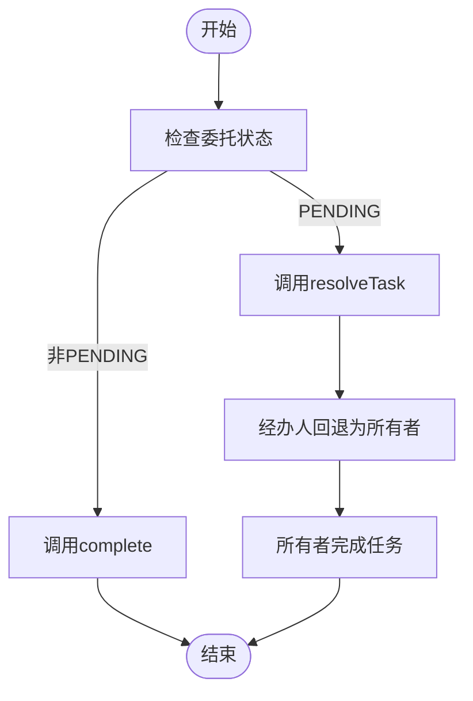
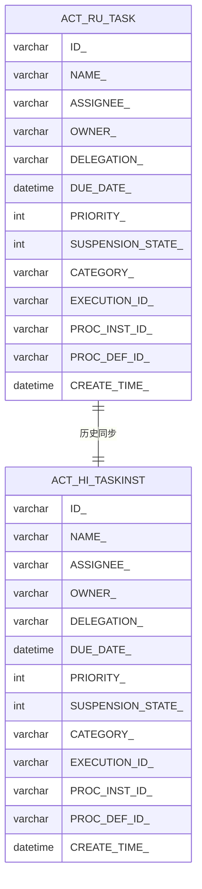
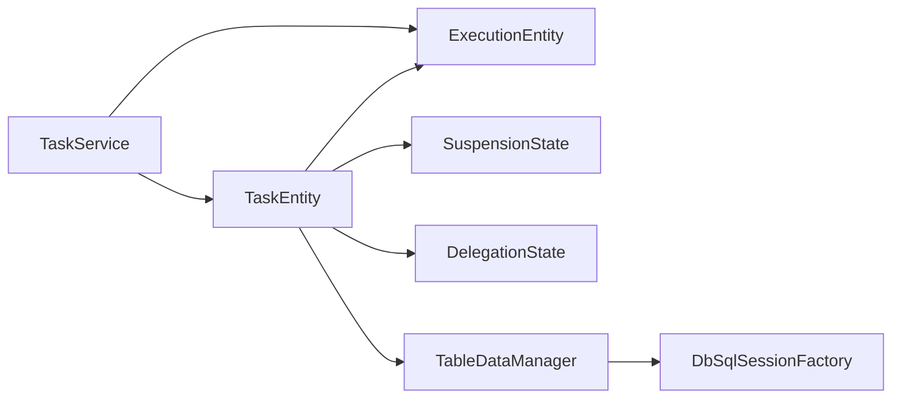

# 任务状态管理

<cite>
**本文档引用的文件**
- [DelegationState.java](file://antflow-base/src/main/java/org/activiti/engine/task/DelegationState.java)
- [ProcessStateEnum.java](file://antflow-base/src/main/java/org/openoa/base/constant/enums/ProcessStateEnum.java)
- [ProcessNodeEnum.java](file://antflow-base/src/main/java/org/openoa/base/constant/enums/ProcessNodeEnum.java)
- [TaskService.java](file://antflow-base/src/main/java/org/activiti/engine/TaskService.java)
- [TaskServiceImpl.java](file://antflow-base/src/main/java/org/activiti/engine/impl/TaskServiceImpl.java)
- [TaskEntity.java](file://antflow-base/src/main/java/org/activiti/engine/impl/persistence/entity/TaskEntity.java)
- [ExecutionEntity.java](file://antflow-base/src/main/java/org/activiti/engine/impl/persistence/entity/ExecutionEntity.java)
- [TableDataManager.java](file://antflow-base/src/main/java/org/activiti/engine/impl/persistence/entity/TableDataManager.java)
- [SuspensionState.java](file://antflow-base/src/main/java/org/activiti/engine/impl/persistence/entity/SuspensionState.java)
- [NewTaskCmd.java](file://antflow-base/src/main/java/org/activiti/engine/impl/cmd/NewTaskCmd.java)
- [DbSqlSessionFactory.java](file://antflow-base/src/main/java/org/activiti/engine/impl/db/DbSqlSessionFactory.java)
- [7.流程验证与控制.md](file://doc/系统介绍篇/7.流程验证与控制.md)
- [14.流程设计器和流程节点配置.md](file://doc/系统介绍篇/14.流程设计器和流程节点配置.md)
</cite>

## 目录
1. [简介](#简介)
2. [项目结构](#项目结构)
3. [核心组件](#核心组件)
4. [架构总览](#架构总览)
5. [详细组件分析](#详细组件分析)
6. [依赖关系分析](#依赖关系分析)
7. [性能考虑](#性能考虑)
8. [故障排除指南](#故障排除指南)
9. [结论](#结论)

## 简介
本文件聚焦于AntFlow工作流系统中的任务状态管理，系统性阐述任务状态的定义、转换规则与持久化机制，解析任务状态枚举、状态转换图与约束条件，并对比任务实例、历史任务与待办任务在状态管理上的差异与策略。同时，说明状态变更的触发条件、验证规则与回滚机制，覆盖状态查询接口、批量状态更新与状态统计能力，并提供最佳实践与性能优化建议。

## 项目结构
围绕任务状态管理的关键代码分布在以下模块：
- 基础引擎：任务委托状态、任务服务接口与实现、任务实体与执行实体、持久化映射等
- 业务常量：流程状态与节点枚举，用于业务侧状态语义与节点编号管理
- 文档资料：流程验证与控制、流程设计器与节点配置，体现状态相关的约束与验证

**图表来源**
- [TaskService.java](file://antflow-base/src/main/java/org/activiti/engine/TaskService.java)
- [TaskServiceImpl.java](file://antflow-base/src/main/java/org/activiti/engine/impl/TaskServiceImpl.java)
- [TaskEntity.java](file://antflow-base/src/main/java/org/activiti/engine/impl/persistence/entity/TaskEntity.java)
- [ExecutionEntity.java](file://antflow-base/src/main/java/org/activiti/engine/impl/persistence/entity/ExecutionEntity.java)
- [DelegationState.java](file://antflow-base/src/main/java/org/activiti/engine/task/DelegationState.java)
- [SuspensionState.java](file://antflow-base/src/main/java/org/activiti/engine/impl/persistence/entity/SuspensionState.java)
- [TableDataManager.java](file://antflow-base/src/main/java/org/activiti/engine/impl/persistence/entity/TableDataManager.java)
- [DbSqlSessionFactory.java](file://antflow-base/src/main/java/org/activiti/engine/impl/db/DbSqlSessionFactory.java)
- [ProcessStateEnum.java](file://antflow-base/src/main/java/org/openoa/base/constant/enums/ProcessStateEnum.java)
- [ProcessNodeEnum.java](file://antflow-base/src/main/java/org/openoa/base/constant/enums/ProcessNodeEnum.java)

**章节来源**
- [TaskService.java](file://antflow-base/src/main/java/org/activiti/engine/TaskService.java)
- [TaskServiceImpl.java](file://antflow-base/src/main/java/org/activiti/engine/impl/TaskServiceImpl.java)
- [TaskEntity.java](file://antflow-base/src/main/java/org/activiti/engine/impl/persistence/entity/TaskEntity.java)
- [ProcessStateEnum.java](file://antflow-base/src/main/java/org/openoa/base/constant/enums/ProcessStateEnum.java)
- [ProcessNodeEnum.java](file://antflow-base/src/main/java/org/openoa/base/constant/enums/ProcessNodeEnum.java)

## 核心组件
- 任务委托状态（DelegationState）：定义任务委托的两种状态（待处理、已解决），用于控制委托任务的流转与回退。
- 任务服务接口与实现（TaskService/TaskServiceImpl）：提供任务创建、保存、删除、认领、完成、委派、解决、设置优先级与到期日、变量读写、评论附件等能力。
- 任务实体（TaskEntity）：封装任务的持久化属性（所有者、经办人、委托状态、父任务ID、名称、描述、优先级、创建时间、到期日、挂起状态、分类、租户ID等），并负责历史记录与事件分发。
- 执行实体（ExecutionEntity）：承载流程执行上下文，驱动任务在流程中的推进与并发分支。
- 表映射与数据库适配（TableDataManager/DbSqlSessionFactory）：将任务实体映射到运行时表（ACT_RU_TASK）等，支撑状态持久化。
- 挂起状态（SuspensionState）：统一管理流程与任务的激活/挂起状态切换。
- 流程状态与节点枚举（ProcessStateEnum/ProcessNodeEnum）：为业务侧提供流程状态与节点编号的语义化定义。

**章节来源**
- [DelegationState.java](file://antflow-base/src/main/java/org/activiti/engine/task/DelegationState.java)
- [TaskService.java](file://antflow-base/src/main/java/org/activiti/engine/TaskService.java)
- [TaskServiceImpl.java](file://antflow-base/src/main/java/org/activiti/engine/impl/TaskServiceImpl.java)
- [TaskEntity.java](file://antflow-base/src/main/java/org/activiti/engine/impl/persistence/entity/TaskEntity.java)
- [ExecutionEntity.java](file://antflow-base/src/main/java/org/activiti/engine/impl/persistence/entity/ExecutionEntity.java)
- [TableDataManager.java](file://antflow-base/src/main/java/org/activiti/engine/impl/persistence/entity/TableDataManager.java)
- [SuspensionState.java](file://antflow-base/src/main/java/org/activiti/engine/impl/persistence/entity/SuspensionState.java)
- [ProcessStateEnum.java](file://antflow-base/src/main/java/org/openoa/base/constant/enums/ProcessStateEnum.java)
- [ProcessNodeEnum.java](file://antflow-base/src/main/java/org/openoa/base/constant/enums/ProcessNodeEnum.java)

## 架构总览
任务状态管理贯穿“服务层-实体层-持久化层”的全链路，形成如下闭环：
- 服务层接收状态变更请求（认领、完成、委派、解决、设置到期日、设置优先级等）
- 实体层执行状态校验与历史记录，必要时触发监听器与事件分发
- 持久化层将状态写入运行时表（ACT_RU_TASK）与历史表，确保一致性与可追溯性

**图表来源**
- [TaskServiceImpl.java](file://antflow-base/src/main/java/org/activiti/engine/impl/TaskServiceImpl.java)
- [TaskEntity.java](file://antflow-base/src/main/java/org/activiti/engine/impl/persistence/entity/TaskEntity.java)
- [ExecutionEntity.java](file://antflow-base/src/main/java/org/activiti/engine/impl/persistence/entity/ExecutionEntity.java)
- [TableDataManager.java](file://antflow-base/src/main/java/org/activiti/engine/impl/persistence/entity/TableDataManager.java)

## 详细组件分析

### 任务状态枚举与约束
- 委托状态（DelegationState）
  - PENDING：委派中，经办人处理后需“解决”回退给所有者
  - RESOLVED：委派已解决，任务回到所有者待审
  - 约束：处于PENDING时禁止直接完成，必须先resolve再由所有者完成
- 流程状态（ProcessStateEnum）
  - 审批中、审批通过、审批拒绝、作废等，用于业务侧流程整体状态表达
- 节点枚举（ProcessNodeEnum）
  - 提供节点编号与定义键的映射，支持获取下一节点、前一节点与比较节点顺序

**图表来源**
- [DelegationState.java](file://antflow-base/src/main/java/org/activiti/engine/task/DelegationState.java)
- [ProcessStateEnum.java](file://antflow-base/src/main/java/org/openoa/base/constant/enums/ProcessStateEnum.java)
- [ProcessNodeEnum.java](file://antflow-base/src/main/java/org/openoa/base/constant/enums/ProcessNodeEnum.java)
- [TaskEntity.java](file://antflow-base/src/main/java/org/activiti/engine/impl/persistence/entity/TaskEntity.java)
- [TaskServiceImpl.java](file://antflow-base/src/main/java/org/activiti/engine/impl/TaskServiceImpl.java)

**章节来源**
- [DelegationState.java](file://antflow-base/src/main/java/org/activiti/engine/task/DelegationState.java)
- [ProcessStateEnum.java](file://antflow-base/src/main/java/org/openoa/base/constant/enums/ProcessStateEnum.java)
- [ProcessNodeEnum.java](file://antflow-base/src/main/java/org/openoa/base/constant/enums/ProcessNodeEnum.java)
- [TaskEntity.java](file://antflow-base/src/main/java/org/activiti/engine/impl/persistence/entity/TaskEntity.java)

### 状态转换规则与触发条件
- 委托流程
  - 委派：调用delegateTask，设置委托状态为PENDING，经办人变为委派人
  - 解决：调用resolveTask，委托状态变为RESOLVED，经办人回退为所有者
  - 完成：仅当非PENDING状态时允许完成；PENDING状态必须先resolve
- 认领/取消认领
  - claim/unclaim：对任务进行认领或取消认领，触发历史记录与事件分发
- 设置到期日与优先级
  - setDueDate/setPriority：更新任务到期日与优先级，记录历史并可触发更新事件
- 删除任务
  - deleteTask/deleteTasks：支持带原因删除与级联删除历史

**图表来源**
- [TaskService.java](file://antflow-base/src/main/java/org/activiti/engine/TaskService.java)
- [TaskEntity.java](file://antflow-base/src/main/java/org/activiti/engine/impl/persistence/entity/TaskEntity.java)

**章节来源**
- [TaskService.java](file://antflow-base/src/main/java/org/activiti/engine/TaskService.java)
- [TaskEntity.java](file://antflow-base/src/main/java/org/activiti/engine/impl/persistence/entity/TaskEntity.java)

### 持久化机制与数据模型
- 运行时表映射
  - 任务实体映射到ACT_RU_TASK，包含任务关键字段（assignee、owner、delegation、dueDate、priority、category等）
  - 通过TableDataManager与DbSqlSessionFactory实现数据库方言适配与SQL映射
- 历史记录
  - 任务状态变更（如完成、认领、委派、解决、到期日、优先级、分类等）均会记录历史，保证审计与追踪
- 并发与执行推进
  - ExecutionEntity负责流程并发执行与分支汇聚，任务完成后从执行上下文中移除并触发后续流转

**图表来源**
- [TableDataManager.java](file://antflow-base/src/main/java/org/activiti/engine/impl/persistence/entity/TableDataManager.java)
- [DbSqlSessionFactory.java](file://antflow-base/src/main/java/org/activiti/engine/impl/db/DbSqlSessionFactory.java)
- [TaskEntity.java](file://antflow-base/src/main/java/org/activiti/engine/impl/persistence/entity/TaskEntity.java)

**章节来源**
- [TableDataManager.java](file://antflow-base/src/main/java/org/activiti/engine/impl/persistence/entity/TableDataManager.java)
- [DbSqlSessionFactory.java](file://antflow-base/src/main/java/org/activiti/engine/impl/db/DbSqlSessionFactory.java)
- [TaskEntity.java](file://antflow-base/src/main/java/org/activiti/engine/impl/persistence/entity/TaskEntity.java)

### 状态查询接口与批量更新
- 查询接口
  - createTaskQuery/createNativeTaskQuery：提供动态与原生SQL查询任务
  - getVariables/getVariablesLocal/getVariable/getVariableLocal：读取任务变量（全局与本地作用域）
  - getTaskComments/getProcessInstanceComments：读取任务/流程实例评论
  - getTaskAttachments/getProcessInstanceAttachments：读取任务/流程实例附件
- 批量更新
  - setVariables/setVariablesLocal：批量设置任务变量（全局与本地）
  - setAssignee/setOwner：批量设置经办人与所有者
  - setPriority/setDueDate：批量设置优先级与到期日
- 状态统计
  - 结合查询接口与业务枚举（ProcessStateEnum/ProcessNodeEnum）可实现按状态、节点、部门、人员等维度的统计

**章节来源**
- [TaskService.java](file://antflow-base/src/main/java/org/activiti/engine/TaskService.java)
- [TaskServiceImpl.java](file://antflow-base/src/main/java/org/activiti/engine/impl/TaskServiceImpl.java)
- [ProcessStateEnum.java](file://antflow-base/src/main/java/org/openoa/base/constant/enums/ProcessStateEnum.java)
- [ProcessNodeEnum.java](file://antflow-base/src/main/java/org/openoa/base/constant/enums/ProcessNodeEnum.java)

### 状态变更的触发条件、验证规则与回滚机制
- 触发条件
  - 业务操作：认领、完成、委派、解决、设置到期日、设置优先级、删除任务等
  - 流程推进：任务完成后从执行上下文移除并触发后续流转
- 验证规则
  - 委托状态校验：PENDING状态下禁止直接完成
  - 任务存在性与权限校验：不存在任务抛出异常，未授权操作抛出异常
- 回滚机制
  - 委派解决：从RESOLVED回退到PENDING需重新委派
  - 删除任务：支持带原因删除与级联删除历史，便于审计与恢复

**章节来源**
- [TaskEntity.java](file://antflow-base/src/main/java/org/activiti/engine/impl/persistence/entity/TaskEntity.java)
- [TaskService.java](file://antflow-base/src/main/java/org/activiti/engine/TaskService.java)

### 任务实例、历史任务与待办任务的差异与管理策略
- 任务实例（运行时）
  - 存在于ACT_RU_TASK，反映当前流程中正在执行的任务状态
  - 关注实时性与并发推进，状态变更直接影响流程执行
- 历史任务
  - 通过历史管理记录任务生命周期关键事件（创建、完成、委派、解决、到期日变更、优先级变更等）
  - 用于审计、报表与合规追溯
- 待办任务
  - 通过TaskService查询（如按经办人、候选用户、候选组等），结合身份关联（IdentityLink）过滤
  - 管理策略：基于委托状态与挂起状态进行筛选与展示

**章节来源**
- [TaskEntity.java](file://antflow-base/src/main/java/org/activiti/engine/impl/persistence/entity/TaskEntity.java)
- [TaskService.java](file://antflow-base/src/main/java/org/activiti/engine/TaskService.java)

### 状态约束条件与流程验证
- 节点跳转与控制
  - 支持跳转到指定节点、删除当前任务、启动目标节点等控制能力
- 设计器与节点配置验证
  - 流程设计阶段的验证框架确保至少存在一个审批节点、并行分支需包含聚合器、条件并行验证等

**章节来源**
- [7.流程验证与控制.md](file://doc/系统介绍篇/7.流程验证与控制.md)
- [14.流程设计器和流程节点配置.md](file://doc/系统介绍篇/14.流程设计器和流程节点配置.md)

## 依赖关系分析
任务状态管理涉及跨层依赖，包括服务层对实体层的调用、实体层对执行层的依赖、以及持久化层对数据库层的映射。

**图表来源**
- [TaskService.java](file://antflow-base/src/main/java/org/activiti/engine/TaskService.java)
- [TaskEntity.java](file://antflow-base/src/main/java/org/activiti/engine/impl/persistence/entity/TaskEntity.java)
- [ExecutionEntity.java](file://antflow-base/src/main/java/org/activiti/engine/impl/persistence/entity/ExecutionEntity.java)
- [SuspensionState.java](file://antflow-base/src/main/java/org/activiti/engine/impl/persistence/entity/SuspensionState.java)
- [DelegationState.java](file://antflow-base/src/main/java/org/activiti/engine/task/DelegationState.java)
- [TableDataManager.java](file://antflow-base/src/main/java/org/activiti/engine/impl/persistence/entity/TableDataManager.java)
- [DbSqlSessionFactory.java](file://antflow-base/src/main/java/org/activiti/engine/impl/db/DbSqlSessionFactory.java)

**章节来源**
- [TaskService.java](file://antflow-base/src/main/java/org/activiti/engine/TaskService.java)
- [TaskEntity.java](file://antflow-base/src/main/java/org/activiti/engine/impl/persistence/entity/TaskEntity.java)
- [ExecutionEntity.java](file://antflow-base/src/main/java/org/activiti/engine/impl/persistence/entity/ExecutionEntity.java)
- [TableDataManager.java](file://antflow-base/src/main/java/org/activiti/engine/impl/persistence/entity/TableDataManager.java)

## 性能考虑
- 变量访问优化
  - 使用局部变量读取（getVariablesLocal）减少跨作用域查询开销
  - 批量设置变量（setVariables）优于逐个设置
- 查询优化
  - 使用原生查询（createNativeTaskQuery）与精确过滤条件，避免全表扫描
  - 对高频查询建立合适的索引（如ASSIGNEE、PROC_INST_ID、CREATE_TIME等）
- 并发与事务
  - 利用ExecutionEntity的并发执行模型，合理拆分并行分支以提升吞吐
  - 控制事务边界，避免长事务占用锁资源
- 历史与审计
  - 历史表规模增长较快，建议定期归档与清理策略，平衡审计需求与性能

## 故障排除指南
- 常见异常与处理
  - 委托状态异常：PENDING状态下尝试完成任务会抛出异常，应先resolve再完成
  - 任务不存在：删除/修改任务时若任务不存在会抛出对象未找到异常，需先确认任务ID
  - 权限不足：未授权用户操作任务会抛出异常，需校验身份与角色
- 排查步骤
  - 检查任务委托状态与挂起状态
  - 核对任务变量作用域与命名空间
  - 查看历史记录定位问题发生点
  - 分析流程并发路径，确认是否存在死锁或阻塞

**章节来源**
- [TaskEntity.java](file://antflow-base/src/main/java/org/activiti/engine/impl/persistence/entity/TaskEntity.java)
- [TaskService.java](file://antflow-base/src/main/java/org/activiti/engine/TaskService.java)

## 结论
AntFlow的任务状态管理体系以委托状态、挂起状态为核心，结合任务服务、实体与持久化层，实现了从创建、认领、委派、解决到完成的完整生命周期管理。通过历史记录与事件分发，系统具备良好的可审计性与可观测性。配合流程验证与节点配置验证，能够有效保障流程设计与执行的一致性。在实际应用中，建议遵循状态约束、优化查询与变量访问、合理规划历史归档策略，以获得更优的性能与稳定性。