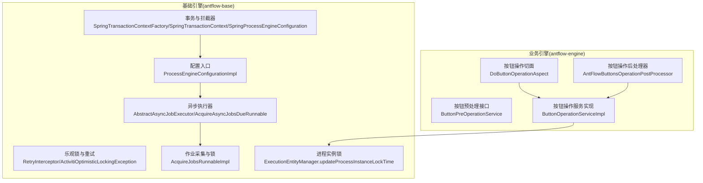
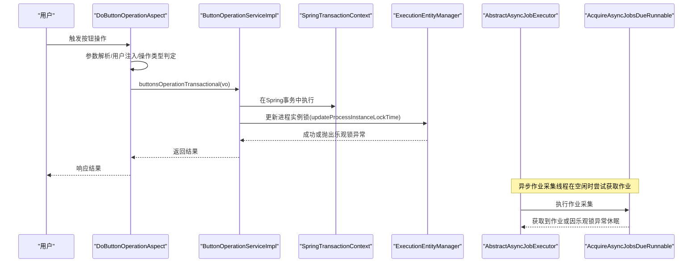
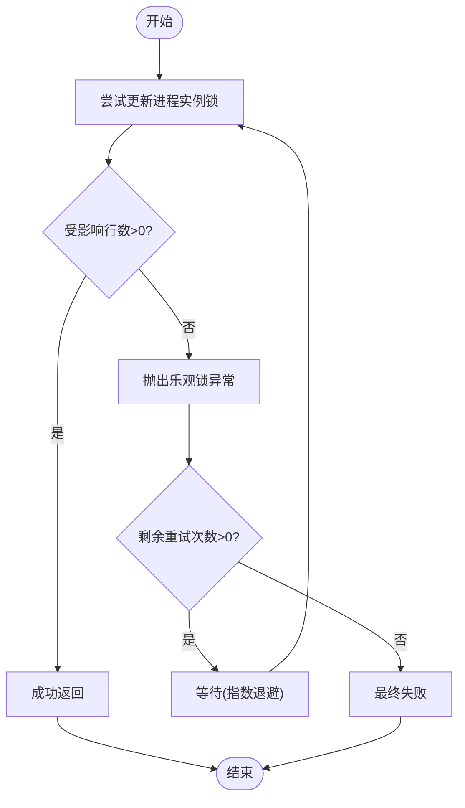
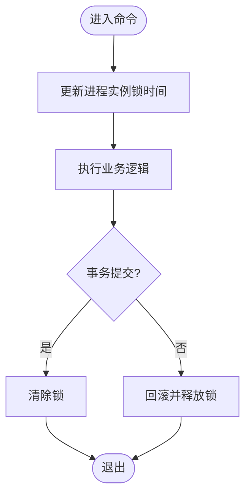
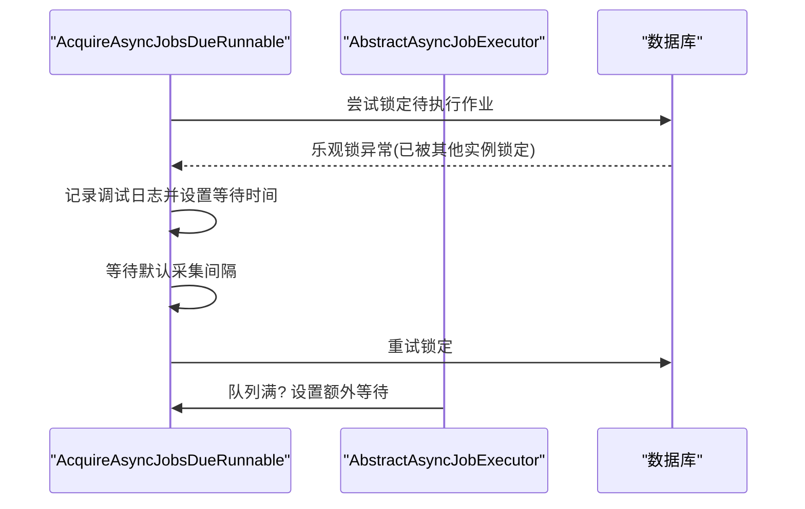
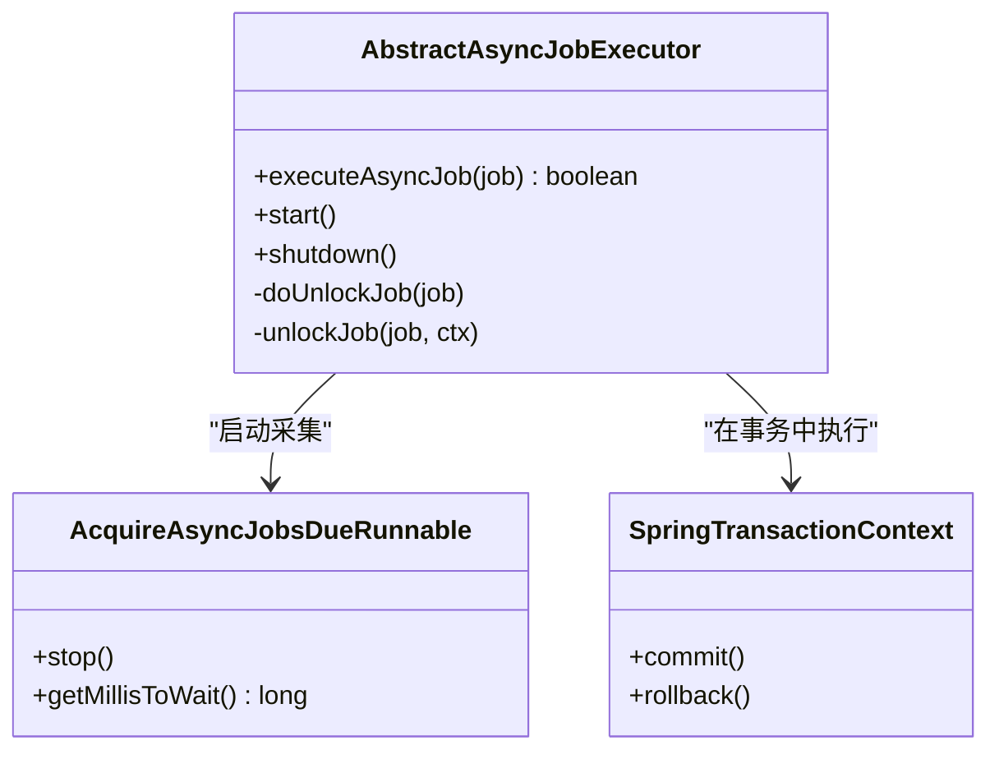
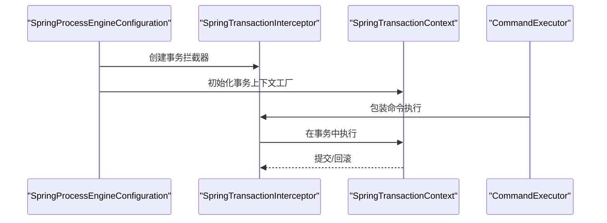
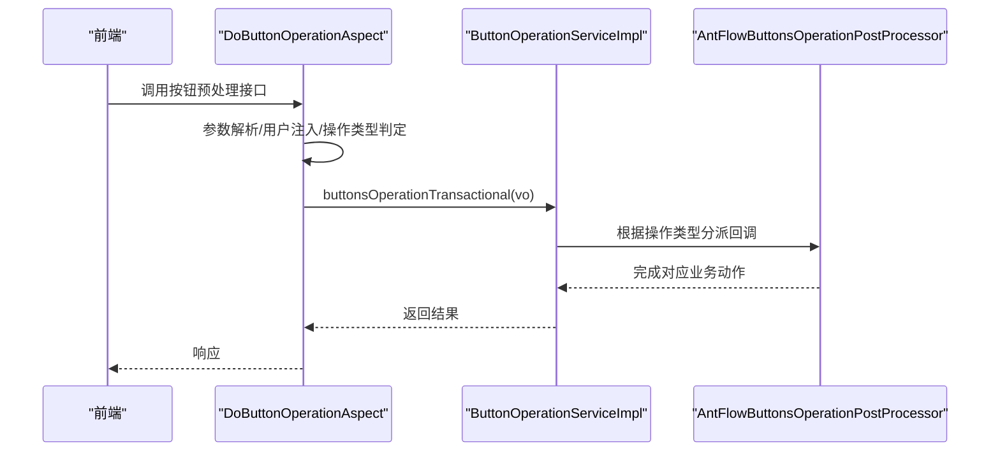
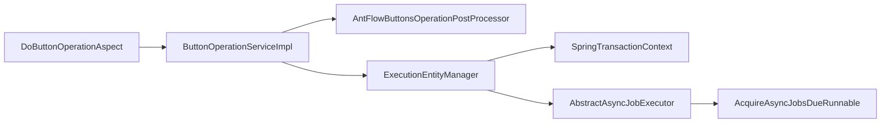

# 并发控制机制

<cite>
**本文引用的文件**   
- [ExecutionEntityManager.java](file://antflow-base/src/main/java/org/activiti/engine/impl/persistence/entity/ExecutionEntityManager.java)
- [RetryInterceptor.java](file://antflow-base/src/main/java/org/activiti/engine/impl/interceptor/RetryInterceptor.java)
- [ActivitiOptimisticLockingException.java](file://antflow-base/src/main/java/org/activiti/engine/ActivitiOptimisticLockingException.java)
- [AbstractAsyncJobExecutor.java](file://antflow-base/src/main/java/org/activiti/engine/impl/asyncexecutor/AbstractAsyncJobExecutor.java)
- [AcquireAsyncJobsDueRunnable.java](file://antflow-base/src/main/java/org/activiti/engine/impl/asyncexecutor/AcquireAsyncJobsDueRunnable.java)
- [AcquireJobsRunnableImpl.java](file://antflow-base/src/main/java/org/activiti/engine/impl/jobexecutor/AcquireJobsRunnableImpl.java)
- [ProcessEngineConfiguration.java](file://antflow-base/src/main/java/org/activiti/engine/ProcessEngineConfiguration.java)
- [SpringTransactionContextFactory.java](file://antflow-base/src/main/java/org/activiti/spring/SpringTransactionContextFactory.java)
- [SpringTransactionContext.java](file://antflow-base/src/main/java/org/activiti/spring/SpringTransactionContext.java)
- [SpringProcessEngineConfiguration.java](file://antflow-base/src/main/java/org/activiti/spring/SpringProcessEngineConfiguration.java)
- [ProcessEngineConfigurationImpl.java](file://antflow-base/src/main/java/org/activiti/engine/impl/cfg/ProcessEngineConfigurationImpl.java)
- [ExecutorPerTenantAsyncExecutor.java](file://antflow-base/src/main/java/org/activiti/engine/impl/asyncexecutor/multitenant/ExecutorPerTenantAsyncExecutor.java)
- [DoButtonOperationAspect.java](file://antflow-engine/src/main/java/org/openoa/engine/conf/aspect/DoButtonOperationAspect.java)
- [AntFlowButtonsOperationPostProcessor.java](file://antflow-engine/src/main/java/org/openoa/engine/lowflow/service/AntFlowButtonsOperationPostProcessor.java)
- [ButtonPreOperationService.java](file://antflow-engine/src/main/java/org/openoa/engine/factory/ButtonPreOperationService.java)
- [ButtonOperationServiceImpl.java](file://antflow-engine/src/main/java/org/openoa/engine/bpmnconf/service/biz/ButtonOperationServiceImpl.java)
- [DeduplicationTypeEnum.java](file://antflow-base/src/main/java/org/openoa/base/constant/enums/DeduplicationTypeEnum.java)
- [DuplicationProcessStrategyEnum.java](file://antflow-base/src/main/java/org/openoa/base/constant/enums/DuplicationProcessStrategyEnum.java)
</cite>

## 目录
1. [简介](#简介)
2. [项目结构](#项目结构)
3. [核心组件](#核心组件)
4. [架构总览](#架构总览)
5. [详细组件分析](#详细组件分析)
6. [依赖分析](#依赖分析)
7. [性能考量](#性能考量)
8. [故障排查指南](#故障排查指南)
9. [结论](#结论)
10. [附录](#附录)

## 简介
本文件系统化梳理并发控制机制，覆盖多用户并发处理同一任务时的策略设计，包括乐观锁、悲观锁与分布式锁的应用场景；异步处理、线程安全与事务一致性；按钮操作的并发控制、重复提交防护与幂等性保障；并发冲突检测、死锁预防与超时处理；以及配置选项、性能调优与故障恢复策略。文档面向工程实践，既提供代码级分析，也给出可视化图示与可操作建议。

## 项目结构
并发控制相关能力横跨基础引擎与业务引擎两层：
- 基础引擎层（antflow-base）：提供事务、乐观锁、异步执行器、作业采集与锁机制等基础设施。
- 业务引擎层（antflow-engine）：封装按钮操作的切面、事务包装与流程回调，实现业务层面的并发控制与幂等保障。

图表来源
- [SpringProcessEngineConfiguration.java:90-112](file://antflow-base/src/main/java/org/activiti/spring/SpringProcessEngineConfiguration.java#L90-L112)
- [ProcessEngineConfigurationImpl.java:1358-1384](file://antflow-base/src/main/java/org/activiti/engine/impl/cfg/ProcessEngineConfigurationImpl.java#L1358-L1384)
- [AbstractAsyncJobExecutor.java:68-107](file://antflow-base/src/main/java/org/activiti/engine/impl/asyncexecutor/AbstractAsyncJobExecutor.java#L68-L107)
- [AcquireAsyncJobsDueRunnable.java:67-115](file://antflow-base/src/main/java/org/activiti/engine/impl/asyncexecutor/AcquireAsyncJobsDueRunnable.java#L67-L115)
- [AcquireJobsRunnableImpl.java:70-97](file://antflow-base/src/main/java/org/activiti/engine/impl/jobexecutor/AcquireJobsRunnableImpl.java#L70-L97)
- [ExecutionEntityManager.java:214-238](file://antflow-base/src/main/java/org/activiti/engine/impl/persistence/entity/ExecutionEntityManager.java#L214-L238)
- [DoButtonOperationAspect.java:35-66](file://antflow-engine/src/main/java/org/openoa/engine/conf/aspect/DoButtonOperationAspect.java#L35-L66)
- [AntFlowButtonsOperationPostProcessor.java:16-99](file://antflow-engine/src/main/java/org/openoa/engine/lowflow/service/AntFlowButtonsOperationPostProcessor.java#L16-L99)
- [ButtonPreOperationService.java:10-12](file://antflow-engine/src/main/java/org/openoa/engine/factory/ButtonPreOperationService.java#L10-L12)
- [ButtonOperationServiceImpl.java](file://antflow-engine/src/main/java/org/openoa/engine/bpmnconf/service/biz/ButtonOperationServiceImpl.java)

章节来源
- [SpringProcessEngineConfiguration.java:90-112](file://antflow-base/src/main/java/org/activiti/spring/SpringProcessEngineConfiguration.java#L90-L112)
- [ProcessEngineConfigurationImpl.java:1358-1384](file://antflow-base/src/main/java/org/activiti/engine/impl/cfg/ProcessEngineConfigurationImpl.java#L1358-L1384)
- [AbstractAsyncJobExecutor.java:68-107](file://antflow-base/src/main/java/org/activiti/engine/impl/asyncexecutor/AbstractAsyncJobExecutor.java#L68-L107)
- [AcquireAsyncJobsDueRunnable.java:67-115](file://antflow-base/src/main/java/org/activiti/engine/impl/asyncexecutor/AcquireAsyncJobsDueRunnable.java#L67-L115)
- [AcquireJobsRunnableImpl.java:70-97](file://antflow-base/src/main/java/org/activiti/engine/impl/jobexecutor/AcquireJobsRunnableImpl.java#L70-L97)
- [ExecutionEntityManager.java:214-238](file://antflow-base/src/main/java/org/activiti/engine/impl/persistence/entity/ExecutionEntityManager.java#L214-L238)
- [DoButtonOperationAspect.java:35-66](file://antflow-engine/src/main/java/org/openoa/engine/conf/aspect/DoButtonOperationAspect.java#L35-L66)
- [AntFlowButtonsOperationPostProcessor.java:16-99](file://antflow-engine/src/main/java/org/openoa/engine/lowflow/service/AntFlowButtonsOperationPostProcessor.java#L16-L99)
- [ButtonPreOperationService.java:10-12](file://antflow-engine/src/main/java/org/openoa/engine/factory/ButtonPreOperationService.java#L10-L12)
- [ButtonOperationServiceImpl.java](file://antflow-engine/src/main/java/org/openoa/engine/bpmnconf/service/biz/ButtonOperationServiceImpl.java)

## 核心组件
- 事务与拦截器：基于Spring的事务上下文工厂与拦截器，确保命令执行在Spring事务边界内，统一提交/回滚。
- 乐观锁与重试：通过重试拦截器在并发冲突时进行指数退避重试，降低冲突概率。
- 异步执行器与作业采集：异步作业锁定、队列满等待与失败解锁，避免重复执行与饥饿。
- 进程实例锁：对流程实例加锁，防止并发修改导致的数据竞争。
- 按钮操作切面与后处理器：在业务入口处进行参数解析、用户信息注入与事务包装，结合流程回调实现幂等与一致性。

章节来源
- [SpringTransactionContextFactory.java:25-41](file://antflow-base/src/main/java/org/activiti/spring/SpringTransactionContextFactory.java#L25-L41)
- [SpringTransactionContext.java:35-61](file://antflow-base/src/main/java/org/activiti/spring/SpringTransactionContext.java#L35-L61)
- [RetryInterceptor.java:35-92](file://antflow-base/src/main/java/org/activiti/engine/impl/interceptor/RetryInterceptor.java#L35-L92)
- [ActivitiOptimisticLockingException.java:23-31](file://antflow-base/src/main/java/org/activiti/engine/ActivitiOptimisticLockingException.java#L23-L31)
- [AbstractAsyncJobExecutor.java:68-107](file://antflow-base/src/main/java/org/activiti/engine/impl/asyncexecutor/AbstractAsyncJobExecutor.java#L68-L107)
- [AcquireAsyncJobsDueRunnable.java:67-115](file://antflow-base/src/main/java/org/activiti/engine/impl/asyncexecutor/AcquireAsyncJobsDueRunnable.java#L67-L115)
- [ExecutionEntityManager.java:214-238](file://antflow-base/src/main/java/org/activiti/engine/impl/persistence/entity/ExecutionEntityManager.java#L214-L238)
- [DoButtonOperationAspect.java:35-66](file://antflow-engine/src/main/java/org/openoa/engine/conf/aspect/DoButtonOperationAspect.java#L35-L66)
- [AntFlowButtonsOperationPostProcessor.java:16-99](file://antflow-engine/src/main/java/org/openoa/engine/lowflow/service/AntFlowButtonsOperationPostProcessor.java#L16-L99)

## 架构总览
下图展示从按钮点击到流程推进的并发控制路径，涵盖参数解析、事务包装、作业采集与进程实例锁等关键环节。

图表来源
- [DoButtonOperationAspect.java:35-66](file://antflow-engine/src/main/java/org/openoa/engine/conf/aspect/DoButtonOperationAspect.java#L35-L66)
- [ButtonOperationServiceImpl.java](file://antflow-engine/src/main/java/org/openoa/engine/bpmnconf/service/biz/ButtonOperationServiceImpl.java)
- [SpringTransactionContext.java:57-61](file://antflow-base/src/main/java/org/activiti/spring/SpringTransactionContext.java#L57-L61)
- [ExecutionEntityManager.java:214-238](file://antflow-base/src/main/java/org/activiti/engine/impl/persistence/entity/ExecutionEntityManager.java#L214-L238)
- [AbstractAsyncJobExecutor.java:68-107](file://antflow-base/src/main/java/org/activiti/engine/impl/asyncexecutor/AbstractAsyncJobExecutor.java#L68-L107)
- [AcquireAsyncJobsDueRunnable.java:67-115](file://antflow-base/src/main/java/org/activiti/engine/impl/asyncexecutor/AcquireAsyncJobsDueRunnable.java#L67-L115)

## 详细组件分析

### 乐观锁与重试机制
- 冲突检测：当更新进程实例锁返回0影响行数时，抛出乐观锁异常，表明并发冲突。
- 重试策略：重试拦截器按指数退避等待后再次执行，限制最大重试次数，避免无限循环。
- 适用场景：高并发写入同一流程实例时，通过重试降低冲突概率，提升吞吐。

图表来源
- [ExecutionEntityManager.java:227-230](file://antflow-base/src/main/java/org/activiti/engine/impl/persistence/entity/ExecutionEntityManager.java#L227-L230)
- [RetryInterceptor.java:35-59](file://antflow-base/src/main/java/org/activiti/engine/impl/interceptor/RetryInterceptor.java#L35-L59)

章节来源
- [ExecutionEntityManager.java:214-238](file://antflow-base/src/main/java/org/activiti/engine/impl/persistence/entity/ExecutionEntityManager.java#L214-L238)
- [RetryInterceptor.java:35-92](file://antflow-base/src/main/java/org/activiti/engine/impl/interceptor/RetryInterceptor.java#L35-L92)
- [ActivitiOptimisticLockingException.java:23-31](file://antflow-base/src/main/java/org/activiti/engine/ActivitiOptimisticLockingException.java#L23-L31)

### 悲观锁实现（进程实例锁）
- 加锁：通过更新进程实例的锁时间与过期时间实现“短锁”策略，减少持锁时间。
- 解锁：在事务提交或异常时清理锁，避免死锁。
- 场景：对同一流程实例的并发修改进行短期独占，确保一致性。

图表来源
- [ExecutionEntityManager.java:214-238](file://antflow-base/src/main/java/org/activiti/engine/impl/persistence/entity/ExecutionEntityManager.java#L214-L238)

章节来源
- [ExecutionEntityManager.java:214-238](file://antflow-base/src/main/java/org/activiti/engine/impl/persistence/entity/ExecutionEntityManager.java#L214-L238)

### 分布式锁与集群作业采集
- 锁持有者：异步执行器维护唯一锁拥有者标识，避免多实例互相抢占。
- 作业采集：采集线程在遇到乐观锁异常时记录日志并短暂休眠，体现“集群预期行为”。
- 队列满等待：当执行队列已满时，采集线程等待指定时间，防止过载。

图表来源
- [AcquireAsyncJobsDueRunnable.java:76-87](file://antflow-base/src/main/java/org/activiti/engine/impl/asyncexecutor/AcquireAsyncJobsDueRunnable.java#L76-L87)
- [AbstractAsyncJobExecutor.java:55-60](file://antflow-base/src/main/java/org/activiti/engine/impl/asyncexecutor/AbstractAsyncJobExecutor.java#L55-L60)

章节来源
- [AbstractAsyncJobExecutor.java:55-60](file://antflow-base/src/main/java/org/activiti/engine/impl/asyncexecutor/AbstractAsyncJobExecutor.java#L55-L60)
- [AcquireAsyncJobsDueRunnable.java:76-115](file://antflow-base/src/main/java/org/activiti/engine/impl/asyncexecutor/AcquireAsyncJobsDueRunnable.java#L76-L115)

### 异步处理与线程安全
- 线程模型：异步执行器启动采集线程与执行线程，执行失败时自动解锁，避免饥饿。
- 事务边界：所有命令在Spring事务上下文中执行，保证数据库一致性。
- 作业解锁：执行拒绝或异常时主动解锁，允许其他实例接管。

图表来源
- [AbstractAsyncJobExecutor.java:68-107](file://antflow-base/src/main/java/org/activiti/engine/impl/asyncexecutor/AbstractAsyncJobExecutor.java#L68-L107)
- [AcquireAsyncJobsDueRunnable.java:117-132](file://antflow-base/src/main/java/org/activiti/engine/impl/asyncexecutor/AcquireAsyncJobsDueRunnable.java#L117-L132)
- [SpringTransactionContext.java:57-61](file://antflow-base/src/main/java/org/activiti/spring/SpringTransactionContext.java#L57-L61)

章节来源
- [AbstractAsyncJobExecutor.java:68-107](file://antflow-base/src/main/java/org/activiti/engine/impl/asyncexecutor/AbstractAsyncJobExecutor.java#L68-L107)
- [AcquireAsyncJobsDueRunnable.java:117-132](file://antflow-base/src/main/java/org/activiti/engine/impl/asyncexecutor/AcquireAsyncJobsDueRunnable.java#L117-L132)
- [SpringTransactionContext.java:57-61](file://antflow-base/src/main/java/org/activiti/spring/SpringTransactionContext.java#L57-L61)

### 事务一致性处理
- 事务拦截器：SpringProcessEngineConfiguration负责创建Spring事务拦截器与事务上下文工厂。
- 默认命令配置：启用上下文复用，减少事务传播开销。
- 事务同步顺序：可配置事务同步适配器顺序，确保回调顺序可控。

图表来源
- [SpringProcessEngineConfiguration.java:98-112](file://antflow-base/src/main/java/org/activiti/spring/SpringProcessEngineConfiguration.java#L98-L112)
- [SpringTransactionContextFactory.java:39-41](file://antflow-base/src/main/java/org/activiti/spring/SpringTransactionContextFactory.java#L39-L41)
- [SpringTransactionContext.java:57-61](file://antflow-base/src/main/java/org/activiti/spring/SpringTransactionContext.java#L57-L61)

章节来源
- [SpringProcessEngineConfiguration.java:90-112](file://antflow-base/src/main/java/org/activiti/spring/SpringProcessEngineConfiguration.java#L90-L112)
- [SpringTransactionContextFactory.java:25-41](file://antflow-base/src/main/java/org/activiti/spring/SpringTransactionContextFactory.java#L25-L41)
- [SpringTransactionContext.java:35-61](file://antflow-base/src/main/java/org/activiti/spring/SpringTransactionContext.java#L35-L61)

### 按钮操作的并发控制与幂等性
- 切面拦截：DoButtonOperationAspect在进入业务方法前进行参数解析、用户注入与操作类型判定，并调用事务包装方法。
- 业务回调：AntFlowButtonsOperationPostProcessor根据操作类型分派到具体流程回调，确保操作语义正确。
- 幂等保障：通过事务包裹与流程实例锁，避免重复提交导致的状态不一致；结合去重策略减少冗余审批任务。

图表来源
- [DoButtonOperationAspect.java:35-66](file://antflow-engine/src/main/java/org/openoa/engine/conf/aspect/DoButtonOperationAspect.java#L35-L66)
- [AntFlowButtonsOperationPostProcessor.java:16-99](file://antflow-engine/src/main/java/org/openoa/engine/lowflow/service/AntFlowButtonsOperationPostProcessor.java#L16-L99)
- [ButtonPreOperationService.java:10-12](file://antflow-engine/src/main/java/org/openoa/engine/factory/ButtonPreOperationService.java#L10-L12)

章节来源
- [DoButtonOperationAspect.java:35-66](file://antflow-engine/src/main/java/org/openoa/engine/conf/aspect/DoButtonOperationAspect.java#L35-L66)
- [AntFlowButtonsOperationPostProcessor.java:16-99](file://antflow-engine/src/main/java/org/openoa/engine/lowflow/service/AntFlowButtonsOperationPostProcessor.java#L16-L99)
- [ButtonPreOperationService.java:10-12](file://antflow-engine/src/main/java/org/openoa/engine/factory/ButtonPreOperationService.java#L10-L12)

### 并发冲突检测与死锁预防
- 冲突检测：乐观锁异常作为并发冲突信号，触发重试或降级处理。
- 死锁预防：进程实例锁采用短锁策略，避免长时间持锁；异步作业解锁机制防止实例间相互阻塞。
- 超时处理：采集线程在队列满或冲突时等待固定时间，避免忙等。

章节来源
- [RetryInterceptor.java:35-92](file://antflow-base/src/main/java/org/activiti/engine/impl/interceptor/RetryInterceptor.java#L35-L92)
- [ExecutionEntityManager.java:214-238](file://antflow-base/src/main/java/org/activiti/engine/impl/persistence/entity/ExecutionEntityManager.java#L214-L238)
- [AcquireAsyncJobsDueRunnable.java:76-115](file://antflow-base/src/main/java/org/activiti/engine/impl/asyncexecutor/AcquireAsyncJobsDueRunnable.java#L76-L115)

## 依赖分析
- 组件耦合：业务切面依赖按钮操作服务；按钮操作服务依赖流程回调处理器；流程回调处理器依赖引擎实体与执行器；执行器依赖作业采集与事务上下文。
- 外部依赖：Spring事务管理器、数据库连接池与锁表/字段设计。

图表来源
- [DoButtonOperationAspect.java:35-66](file://antflow-engine/src/main/java/org/openoa/engine/conf/aspect/DoButtonOperationAspect.java#L35-L66)
- [ButtonOperationServiceImpl.java](file://antflow-engine/src/main/java/org/openoa/engine/bpmnconf/service/biz/ButtonOperationServiceImpl.java)
- [AntFlowButtonsOperationPostProcessor.java:16-99](file://antflow-engine/src/main/java/org/openoa/engine/lowflow/service/AntFlowButtonsOperationPostProcessor.java#L16-L99)
- [ExecutionEntityManager.java:214-238](file://antflow-base/src/main/java/org/activiti/engine/impl/persistence/entity/ExecutionEntityManager.java#L214-L238)
- [AbstractAsyncJobExecutor.java:68-107](file://antflow-base/src/main/java/org/activiti/engine/impl/asyncexecutor/AbstractAsyncJobExecutor.java#L68-L107)
- [AcquireAsyncJobsDueRunnable.java:67-115](file://antflow-base/src/main/java/org/activiti/engine/impl/asyncexecutor/AcquireAsyncJobsDueRunnable.java#L67-L115)
- [SpringTransactionContext.java:57-61](file://antflow-base/src/main/java/org/activiti/spring/SpringTransactionContext.java#L57-L61)

章节来源
- [DoButtonOperationAspect.java:35-66](file://antflow-engine/src/main/java/org/openoa/engine/conf/aspect/DoButtonOperationAspect.java#L35-L66)
- [ButtonOperationServiceImpl.java](file://antflow-engine/src/main/java/org/openoa/engine/bpmnconf/service/biz/ButtonOperationServiceImpl.java)
- [AntFlowButtonsOperationPostProcessor.java:16-99](file://antflow-engine/src/main/java/org/openoa/engine/lowflow/service/AntFlowButtonsOperationPostProcessor.java#L16-L99)
- [ExecutionEntityManager.java:214-238](file://antflow-base/src/main/java/org/activiti/engine/impl/persistence/entity/ExecutionEntityManager.java#L214-L238)
- [AbstractAsyncJobExecutor.java:68-107](file://antflow-base/src/main/java/org/activiti/engine/impl/asyncexecutor/AbstractAsyncJobExecutor.java#L68-L107)
- [AcquireAsyncJobsDueRunnable.java:67-115](file://antflow-base/src/main/java/org/activiti/engine/impl/asyncexecutor/AcquireAsyncJobsDueRunnable.java#L67-L115)
- [SpringTransactionContext.java:57-61](file://antflow-base/src/main/java/org/activiti/spring/SpringTransactionContext.java#L57-L61)

## 性能考量
- 重试退避：合理设置初始等待时间与增长因子，平衡冲突缓解与延迟。
- 作业采集：调整每批采集数量与等待时间，避免过度轮询与队列拥塞。
- 短锁策略：缩短进程实例锁持有时间，提高并发度。
- 事务隔离：根据业务场景调整JDBC事务隔离级别，兼顾一致性与性能。
- 租户隔离：多租户场景下为每个租户配置独立异步执行器，避免争抢。

章节来源
- [RetryInterceptor.java:69-92](file://antflow-base/src/main/java/org/activiti/engine/impl/interceptor/RetryInterceptor.java#L69-L92)
- [AbstractAsyncJobExecutor.java:248-286](file://antflow-base/src/main/java/org/activiti/engine/impl/asyncexecutor/AbstractAsyncJobExecutor.java#L248-L286)
- [ProcessEngineConfigurationImpl.java:1358-1384](file://antflow-base/src/main/java/org/activiti/engine/impl/cfg/ProcessEngineConfigurationImpl.java#L1358-L1384)
- [ExecutorPerTenantAsyncExecutor.java:178-229](file://antflow-base/src/main/java/org/activiti/engine/impl/asyncexecutor/multitenant/ExecutorPerTenantAsyncExecutor.java#L178-L229)
- [ProcessEngineConfiguration.java:510-556](file://antflow-base/src/main/java/org/activiti/engine/ProcessEngineConfiguration.java#L510-L556)

## 故障排查指南
- 乐观锁异常频繁：检查重试次数与等待时间配置，评估业务并发峰值；必要时引入去重策略。
- 异步作业积压：查看采集等待时间与队列满等待配置，确认执行线程池容量与拒绝策略。
- 事务提交失败：核对Spring事务管理器配置与事务同步顺序，定位回调异常。
- 进程实例锁未释放：确认异常分支是否清理锁，排查长事务与死锁场景。

章节来源
- [RetryInterceptor.java:35-92](file://antflow-base/src/main/java/org/activiti/engine/impl/interceptor/RetryInterceptor.java#L35-L92)
- [AcquireAsyncJobsDueRunnable.java:76-115](file://antflow-base/src/main/java/org/activiti/engine/impl/asyncexecutor/AcquireAsyncJobsDueRunnable.java#L76-L115)
- [AcquireJobsRunnableImpl.java:70-97](file://antflow-base/src/main/java/org/activiti/engine/impl/jobexecutor/AcquireJobsRunnableImpl.java#L70-L97)
- [SpringProcessEngineConfiguration.java:98-112](file://antflow-base/src/main/java/org/activiti/spring/SpringProcessEngineConfiguration.java#L98-L112)
- [ExecutionEntityManager.java:214-238](file://antflow-base/src/main/java/org/activiti/engine/impl/persistence/entity/ExecutionEntityManager.java#L214-L238)

## 结论
该并发控制体系通过“短锁+重试+异步作业采集+事务边界”的组合拳，在保证数据一致性的同时提升了并发性能。业务侧通过切面与后处理器实现按钮操作的幂等与一致性，配合去重策略进一步降低冗余。建议在生产环境中结合监控指标持续优化重试退避、作业采集与线程池配置，并针对多租户场景实施租户隔离策略。

## 附录
- 去重策略枚举：提供“不去重、前去重、后去重、相邻去重”等策略，指导审批人重复场景下的任务生成与自动同意。
- 按钮操作类型：覆盖提交、重新提交、同意、不同意、查看流程、放弃、承接、变更/移除/添加审批人、退回修改、前进、停止、转发等，便于在切面与后处理器中进行幂等与一致性控制。

章节来源
- [DeduplicationTypeEnum.java:5-32](file://antflow-base/src/main/java/org/openoa/base/constant/enums/DeduplicationTypeEnum.java#L5-L32)
- [DuplicationProcessStrategyEnum.java:5-18](file://antflow-base/src/main/java/org/openoa/base/constant/enums/DuplicationProcessStrategyEnum.java#L5-L18)
- [AntFlowButtonsOperationPostProcessor.java:16-99](file://antflow-engine/src/main/java/org/openoa/engine/lowflow/service/AntFlButtonsOperationPostProcessor.java#L16-L99)