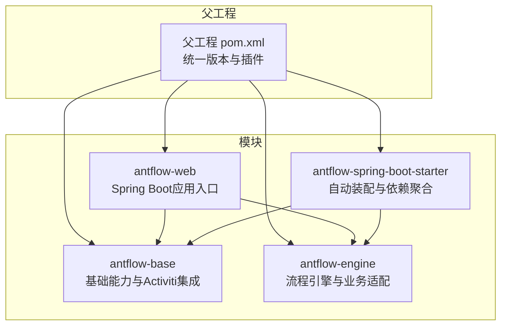
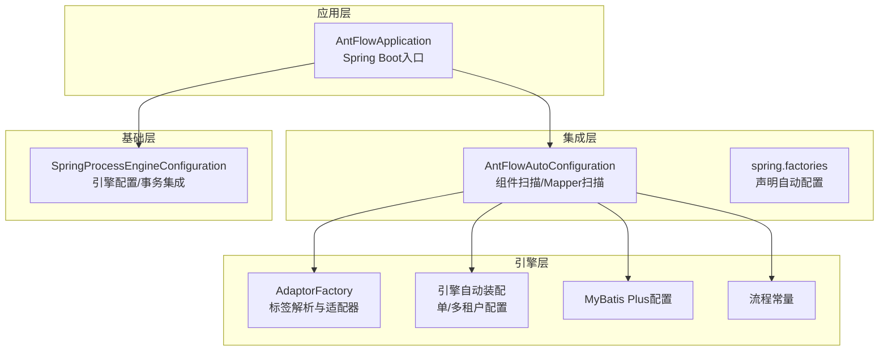
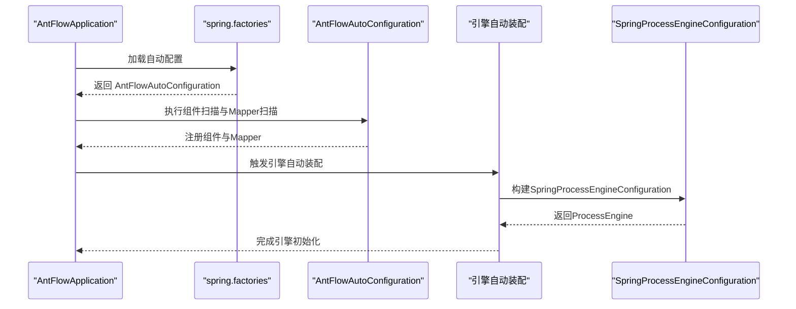
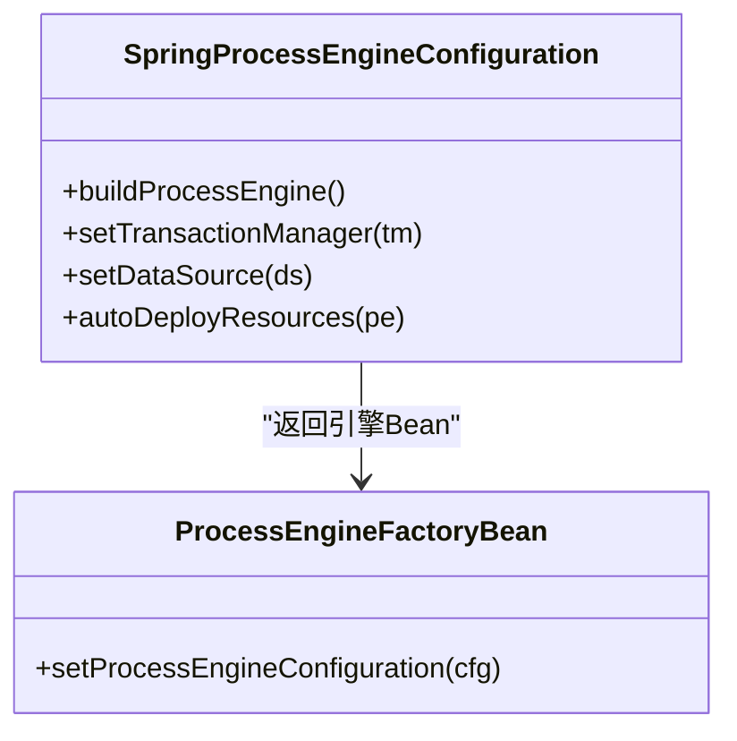
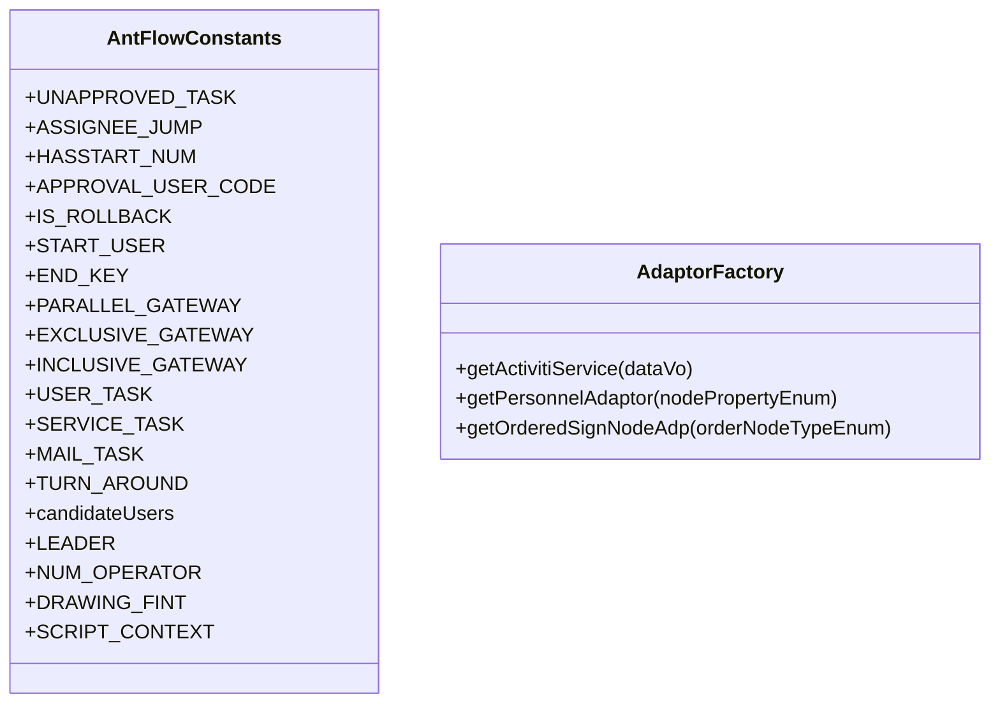
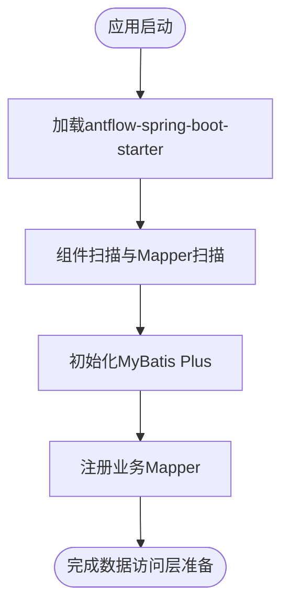
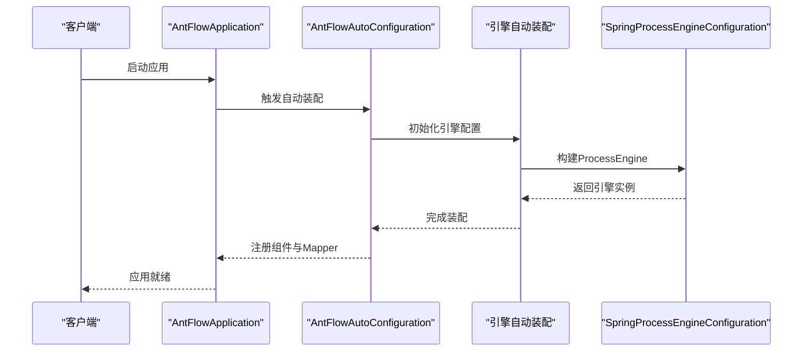
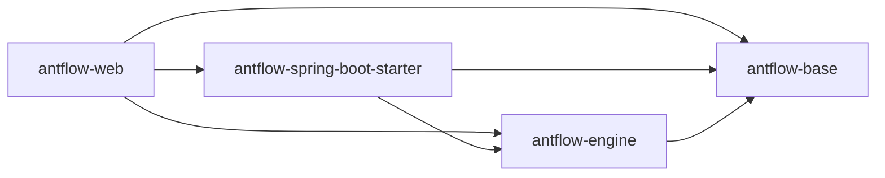

# 后端系统架构

<cite>
**本文引用的文件**   
- [pom.xml](file://pom.xml)
- [antflow-base/pom.xml](file://antflow-base/pom.xml)
- [antflow-engine/pom.xml](file://antflow-engine/pom.xml)
- [antflow-web/pom.xml](file://antflow-web/pom.xml)
- [antflow-spring-boot-starter/pom.xml](file://antflow-spring-boot-starter/pom.xml)
- [antflow-spring-boot-starter/src/main/java/org/openoa/starter/config/AntFlowAutoConfiguration.java](file://antflow-spring-boot-starter/src/main/java/org/openoa/starter/config/AntFlowAutoConfiguration.java)
- [antflow-spring-boot-starter/src/main/resources/META-INF/spring.factories](file://antflow-spring-boot-starter/src/main/resources/META-INF/spring.factories)
- [antflow-web/src/main/java/org/antflow/AntFlowApplication.java](file://antflow-web/src/main/java/org/antflow/AntFlowApplication.java)
- [antflow-base/src/main/java/org/activiti/spring/SpringProcessEngineConfiguration.java](file://antflow-base/src/main/java/org/activiti/spring/SpringProcessEngineConfiguration.java)
- [antflow-engine/src/main/java/org/openoa/engine/bpmnconf/constant/AntFlowConstants.java](file://antflow-engine/src/main/java/org/openoa/engine/bpmnconf/constant/AntFlowConstants.java)
- [antflow-engine/src/main/java/org/openoa/engine/factory/AdaptorFactory.java](file://antflow-engine/src/main/java/org/openoa/engine/factory/AdaptorFactory.java)
- [antflow-engine/src/main/java/org/openoa/engine/conf/engineconfig/DataSourceProcessEngineAutoConfiguration.java](file://antflow-engine/src/main/java/org/openoa/engine/conf/engineconfig/DataSourceProcessEngineAutoConfiguration.java)
- [antflow-engine/src/main/java/org/openoa/engine/conf/engineconfig/AbstractProcessEngineConfiguration.java](file://antflow-engine/src/main/java/org/openoa/engine/conf/engineconfig/AbstractProcessEngineConfiguration.java)
- [antflow-engine/src/main/java/org/openoa/engine/conf/mybatis/MybatisPlusConfig.java](file://antflow-engine/src/main/java/org/openoa/engine/conf/mybatis/MybatisPlusConfig.java)
</cite>

## 目录
1. [简介](#简介)
2. [项目结构](#项目结构)
3. [核心组件](#核心组件)
4. [架构总览](#架构总览)
5. [详细组件分析](#详细组件分析)
6. [依赖分析](#依赖分析)
7. [性能考虑](#性能考虑)
8. [故障排查指南](#故障排查指南)
9. [结论](#结论)
10. [附录](#附录)

## 简介
本文件面向 AntFlow 后端系统，系统以模块化为核心设计思想，围绕四大模块展开：antflow-base（基础能力与 Activiti 集成）、antflow-engine（流程引擎与业务适配）、antflow-web（Spring Boot 可执行应用入口）、antflow-spring-boot-starter（自动装配与依赖聚合）。文档从系统边界、组件交互、数据流向、依赖注入与自动配置原理等维度，系统性阐述 AntFlow 的后端架构与实现要点。

## 项目结构
AntFlow 采用 Maven 多模块聚合结构，父工程统一管理版本与插件，子模块按职责拆分：
- antflow-base：封装 Activiti 引擎、Spring 集成、基础实体与常量、BPMN 解析与校验等基础能力。
- antflow-engine：业务流程适配器工厂、流程常量、MyBatis Plus 配置、流程引擎自动装配等。
- antflow-web：Spring Boot 应用入口，聚合其他模块并打包为可执行应用。
- antflow-spring-boot-starter：对外提供的自动装配模块，简化集成方引入与配置。

图表来源
- [pom.xml:1-236](file://pom.xml#L1-L236)
- [antflow-web/pom.xml:1-66](file://antflow-web/pom.xml#L1-L66)
- [antflow-spring-boot-starter/pom.xml:1-321](file://antflow-spring-boot-starter/pom.xml#L1-L321)

章节来源
- [pom.xml:1-236](file://pom.xml#L1-L236)

## 核心组件
- antflow-base
  - 职责：提供 Activiti 引擎的 Spring 集成配置、事务上下文、数据源代理、自动部署策略等；承载 BPMN 基础模型与工具集。
  - 关键点：SpringProcessEngineConfiguration 对外暴露引擎构建与事务集成能力。
- antflow-engine
  - 职责：流程常量定义、适配器工厂、MyBatis Plus 配置、流程引擎自动装配（含单租户与多租户场景）。
  - 关键点：AdaptorFactory 提供标签解析与适配器的注册与获取；AbstractProcessEngineConfiguration 抽象出引擎 Bean 的标准装配。
- antflow-web
  - 职责：Spring Boot 应用入口，启用事务管理与自动扫描，作为最终可执行应用。
  - 关键点：AntFlowApplication 作为启动类，聚合模块并暴露 Web 能力。
- antflow-spring-boot-starter
  - 职责：对外提供自动装配，声明组件扫描与 Mapper 扫描范围，简化集成方引入成本。
  - 关键点：spring.factories 声明自动配置类，AntFlowAutoConfiguration 定义扫描与 Mapper 扫描范围。

章节来源
- [antflow-base/pom.xml:1-250](file://antflow-base/pom.xml#L1-L250)
- [antflow-engine/pom.xml:1-324](file://antflow-engine/pom.xml#L1-L324)
- [antflow-web/pom.xml:1-66](file://antflow-web/pom.xml#L1-L66)
- [antflow-spring-boot-starter/pom.xml:1-321](file://antflow-spring-boot-starter/pom.xml#L1-L321)
- [antflow-spring-boot-starter/src/main/java/org/openoa/starter/config/AntFlowAutoConfiguration.java:1-19](file://antflow-spring-boot-starter/src/main/java/org/openoa/starter/config/AntFlowAutoConfiguration.java#L1-L19)
- [antflow-spring-boot-starter/src/main/resources/META-INF/spring.factories:1-2](file://antflow-spring-boot-starter/src/main/resources/META-INF/spring.factories#L1-L2)
- [antflow-web/src/main/java/org/antflow/AntFlowApplication.java:1-17](file://antflow-web/src/main/java/org/antflow/AntFlowApplication.java#L1-L17)

## 架构总览
AntFlow 后端采用“基础能力 + 引擎扩展 + 自动装配 + 应用入口”的分层架构：
- 基础层（antflow-base）：封装 Activiti 引擎与 Spring 的桥接，提供事务、数据源、表达式、监听器等基础设施。
- 引擎层（antflow-engine）：提供流程常量、适配器工厂、MyBatis Plus 配置、引擎自动装配（单租户/多租户）。
- 集成层（antflow-spring-boot-starter）：对外提供自动装配，声明组件扫描与 Mapper 扫描，屏蔽内部细节。
- 应用层（antflow-web）：Spring Boot 应用入口，聚合模块并打包为可执行应用。

图表来源
- [antflow-web/src/main/java/org/antflow/AntFlowApplication.java:1-17](file://antflow-web/src/main/java/org/antflow/AntFlowApplication.java#L1-L17)
- [antflow-spring-boot-starter/src/main/java/org/openoa/starter/config/AntFlowAutoConfiguration.java:1-19](file://antflow-spring-boot-starter/src/main/java/org/openoa/starter/config/AntFlowAutoConfiguration.java#L1-L19)
- [antflow-spring-boot-starter/src/main/resources/META-INF/spring.factories:1-2](file://antflow-spring-boot-starter/src/main/resources/META-INF/spring.factories#L1-L2)
- [antflow-engine/src/main/java/org/openoa/engine/factory/AdaptorFactory.java:1-34](file://antflow-engine/src/main/java/org/openoa/engine/factory/AdaptorFactory.java#L1-L34)
- [antflow-engine/src/main/java/org/openoa/engine/conf/engineconfig/DataSourceProcessEngineAutoConfiguration.java:29-61](file://antflow-engine/src/main/java/org/openoa/engine/conf/engineconfig/DataSourceProcessEngineAutoConfiguration.java#L29-L61)
- [antflow-engine/src/main/java/org/openoa/engine/conf/mybatis/MybatisPlusConfig.java:22-65](file://antflow-engine/src/main/java/org/openoa/engine/conf/mybatis/MybatisPlusConfig.java#L22-L65)
- [antflow-engine/src/main/java/org/openoa/engine/bpmnconf/constant/AntFlowConstants.java:1-92](file://antflow-engine/src/main/java/org/openoa/engine/bpmnconf/constant/AntFlowConstants.java#L1-L92)
- [antflow-base/src/main/java/org/activiti/spring/SpringProcessEngineConfiguration.java:1-202](file://antflow-base/src/main/java/org/activiti/spring/SpringProcessEngineConfiguration.java#L1-L202)

## 详细组件分析

### 组件一：Spring Boot 自动装配与依赖注入
- 自动装配入口
  - spring.factories 声明 EnableAutoConfiguration 为 AntFlowAutoConfiguration。
  - AntFlowAutoConfiguration 使用 @ComponentScan 与 @MapperScans 指定扫描范围，确保模块内组件与 Mapper 被正确发现与注册。
- 依赖注入机制
  - Starter 模块将 antflow-base、antflow-engine 作为依赖引入，结合 spring.factories 实现自动装配。
  - antflow-web 作为应用入口，直接依赖 Starter 与 Engine，形成“入口 -> Starter -> Engine -> Base”的调用链。
- 自动配置原理
  - Starter 将组件扫描与 Mapper 扫描前置，避免业务侧重复配置；同时通过 Maven 依赖传递，保证运行时 Bean 注册与加载顺序。

图表来源
- [antflow-spring-boot-starter/src/main/resources/META-INF/spring.factories:1-2](file://antflow-spring-boot-starter/src/main/resources/META-INF/spring.factories#L1-L2)
- [antflow-spring-boot-starter/src/main/java/org/openoa/starter/config/AntFlowAutoConfiguration.java:1-19](file://antflow-spring-boot-starter/src/main/java/org/openoa/starter/config/AntFlowAutoConfiguration.java#L1-L19)
- [antflow-engine/src/main/java/org/openoa/engine/conf/engineconfig/DataSourceProcessEngineAutoConfiguration.java:29-61](file://antflow-engine/src/main/java/org/openoa/engine/conf/engineconfig/DataSourceProcessEngineAutoConfiguration.java#L29-L61)
- [antflow-base/src/main/java/org/activiti/spring/SpringProcessEngineConfiguration.java:1-202](file://antflow-base/src/main/java/org/activiti/spring/SpringProcessEngineConfiguration.java#L1-L202)

章节来源
- [antflow-spring-boot-starter/src/main/resources/META-INF/spring.factories:1-2](file://antflow-spring-boot-starter/src/main/resources/META-INF/spring.factories#L1-L2)
- [antflow-spring-boot-starter/src/main/java/org/openoa/starter/config/AntFlowAutoConfiguration.java:1-19](file://antflow-spring-boot-starter/src/main/java/org/openoa/starter/config/AntFlowAutoConfiguration.java#L1-L19)
- [antflow-web/src/main/java/org/antflow/AntFlowApplication.java:1-17](file://antflow-web/src/main/java/org/antflow/AntFlowApplication.java#L1-L17)

### 组件二：Activiti 引擎集成与事务管理
- 引擎配置
  - SpringProcessEngineConfiguration 继承自 Activiti 的 ProcessEngineConfigurationImpl，负责构建 ProcessEngine、设置事务拦截器与事务上下文工厂、包装数据源为事务感知代理。
- 事务集成
  - 通过 setTransactionManager 设置 PlatformTransactionManager，创建 SpringTransactionInterceptor 与 SpringTransactionContextFactory，确保引擎命令在 Spring 事务上下文中执行。
- 自动部署
  - 支持多种 AutoDeploymentStrategy，根据 deploymentMode 选择部署策略，自动部署 BPMN 资源。

图表来源
- [antflow-base/src/main/java/org/activiti/spring/SpringProcessEngineConfiguration.java:1-202](file://antflow-base/src/main/java/org/activiti/spring/SpringProcessEngineConfiguration.java#L1-L202)
- [antflow-engine/src/main/java/org/openoa/engine/conf/engineconfig/AbstractProcessEngineConfiguration.java:32-60](file://antflow-engine/src/main/java/org/openoa/engine/conf/engineconfig/AbstractProcessEngineConfiguration.java#L32-L60)

章节来源
- [antflow-base/src/main/java/org/activiti/spring/SpringProcessEngineConfiguration.java:1-202](file://antflow-base/src/main/java/org/activiti/spring/SpringProcessEngineConfiguration.java#L1-L202)
- [antflow-engine/src/main/java/org/openoa/engine/conf/engineconfig/AbstractProcessEngineConfiguration.java:32-60](file://antflow-engine/src/main/java/org/openoa/engine/conf/engineconfig/AbstractProcessEngineConfiguration.java#L32-L60)

### 组件三：流程常量与适配器工厂
- 流程常量
  - AntFlowConstants 定义流程节点类型、网关类型、任务类型、系统变量键等，作为流程配置与运行时判断的依据。
- 适配器工厂
  - AdaptorFactory 通过注解标记不同类型的标签解析器（如 PersonnelTagParser、OrderedSignTagParser、ActivitiTagParser），并提供对应适配器的获取方法，支撑低代码与业务适配。

图表来源
- [antflow-engine/src/main/java/org/openoa/engine/bpmnconf/constant/AntFlowConstants.java:1-92](file://antflow-engine/src/main/java/org/openoa/engine/bpmnconf/constant/AntFlowConstants.java#L1-L92)
- [antflow-engine/src/main/java/org/openoa/engine/factory/AdaptorFactory.java:1-34](file://antflow-engine/src/main/java/org/openoa/engine/factory/AdaptorFactory.java#L1-L34)

章节来源
- [antflow-engine/src/main/java/org/openoa/engine/bpmnconf/constant/AntFlowConstants.java:1-92](file://antflow-engine/src/main/java/org/openoa/engine/bpmnconf/constant/AntFlowConstants.java#L1-L92)
- [antflow-engine/src/main/java/org/openoa/engine/factory/AdaptorFactory.java:1-34](file://antflow-engine/src/main/java/org/openoa/engine/factory/AdaptorFactory.java#L1-L34)

### 组件四：MyBatis Plus 数据访问层设计
- 配置定位
  - MybatisPlusConfig 中包含 MyBatis Plus 相关配置片段（注释形式），体现对 SqlSessionFactory、分页插件、性能监控等的预留与扩展思路。
- 作用与意义
  - 通过 Starter 与 Engine 模块引入 mybatis-plus-boot-starter，结合 Mapper 扫描，实现业务 Mapper 的零样板代码开发与统一 CRUD 能力。

图表来源
- [antflow-spring-boot-starter/pom.xml:1-321](file://antflow-spring-boot-starter/pom.xml#L1-L321)
- [antflow-engine/pom.xml:1-324](file://antflow-engine/pom.xml#L1-L324)
- [antflow-engine/src/main/java/org/openoa/engine/conf/mybatis/MybatisPlusConfig.java:22-65](file://antflow-engine/src/main/java/org/openoa/engine/conf/mybatis/MybatisPlusConfig.java#L22-L65)

章节来源
- [antflow-engine/src/main/java/org/openoa/engine/conf/mybatis/MybatisPlusConfig.java:22-65](file://antflow-engine/src/main/java/org/openoa/engine/conf/mybatis/MybatisPlusConfig.java#L22-L65)

### 组件五：系统边界与组件交互流程
- 系统边界
  - antflow-web：对外提供 HTTP 接口与应用打包，不承载业务逻辑，仅负责聚合与启动。
  - antflow-spring-boot-starter：面向集成方的“黑盒”，屏蔽内部实现细节。
  - antflow-engine：业务适配与引擎自动装配的核心实现。
  - antflow-base：Activiti 引擎与 Spring 集成的基础设施。
- 交互流程
  - 启动阶段：AntFlowApplication -> spring.factories -> AntFlowAutoConfiguration -> 引擎自动装配 -> SpringProcessEngineConfiguration -> ProcessEngine。
  - 运行阶段：业务请求经 Controller -> Service -> Mapper -> MyBatis Plus -> 数据库；流程事件由 Activiti 引擎驱动。

图表来源
- [antflow-web/src/main/java/org/antflow/AntFlowApplication.java:1-17](file://antflow-web/src/main/java/org/antflow/AntFlowApplication.java#L1-L17)
- [antflow-spring-boot-starter/src/main/java/org/openoa/starter/config/AntFlowAutoConfiguration.java:1-19](file://antflow-spring-boot-starter/src/main/java/org/openoa/starter/config/AntFlowAutoConfiguration.java#L1-L19)
- [antflow-engine/src/main/java/org/openoa/engine/conf/engineconfig/DataSourceProcessEngineAutoConfiguration.java:29-61](file://antflow-engine/src/main/java/org/openoa/engine/conf/engineconfig/DataSourceProcessEngineAutoConfiguration.java#L29-L61)
- [antflow-base/src/main/java/org/activiti/spring/SpringProcessEngineConfiguration.java:1-202](file://antflow-base/src/main/java/org/activiti/spring/SpringProcessEngineConfiguration.java#L1-L202)

## 依赖分析
- 模块间依赖
  - antflow-web 依赖 antflow-base 与 antflow-engine，以及 Starter。
  - antflow-spring-boot-starter 依赖 antflow-base 与 antflow-engine，并引入 MyBatis Plus 与 Druid 等生态依赖。
  - antflow-engine 依赖 antflow-base，并引入 MyBatis Plus 与相关工具库。
- 外部依赖
  - Spring Boot 2.7.x 生态、MyBatis Plus 3.5.1、Activiti（通过 antflow-base）、Fastjson2、Guava、Jackson、HttpComponents 等。

图表来源
- [antflow-web/pom.xml:1-66](file://antflow-web/pom.xml#L1-L66)
- [antflow-spring-boot-starter/pom.xml:1-321](file://antflow-spring-boot-starter/pom.xml#L1-L321)
- [antflow-engine/pom.xml:1-324](file://antflow-engine/pom.xml#L1-L324)
- [antflow-base/pom.xml:1-250](file://antflow-base/pom.xml#L1-L250)

章节来源
- [antflow-web/pom.xml:1-66](file://antflow-web/pom.xml#L1-L66)
- [antflow-spring-boot-starter/pom.xml:1-321](file://antflow-spring-boot-starter/pom.xml#L1-L321)
- [antflow-engine/pom.xml:1-324](file://antflow-engine/pom.xml#L1-L324)
- [antflow-base/pom.xml:1-250](file://antflow-base/pom.xml#L1-L250)

## 性能考虑
- 事务与数据源
  - SpringProcessEngineConfiguration 将数据源包装为事务感知代理，减少跨事务边界的数据一致性问题，降低回滚与并发异常风险。
- 自动装配与扫描
  - Starter 通过集中扫描与 Mapper 扫描，避免业务侧重复配置，提升启动效率与可维护性。
- MyBatis Plus
  - 通过 Starter 与 Engine 模块引入 MyBatis Plus，结合分页与 SQL 监控，有助于在大数据量场景下优化查询性能与可观测性。

## 故障排查指南
- 启动失败（找不到引擎或事务管理器）
  - 检查 spring.factories 是否正确声明自动配置；确认 AntFlowAutoConfiguration 的扫描范围是否覆盖目标包。
  - 核查 DataSource 与 PlatformTransactionManager 是否正确注入至 SpringProcessEngineConfiguration。
- Mapper 未注册
  - 确认 @MapperScans 是否包含业务 Mapper 包；检查 Starter 与 Engine 的 MyBatis Plus 依赖是否一致。
- 流程资源未部署
  - 检查 deploymentMode 与 AutoDeploymentStrategy 配置；确认 BPMN 资源路径与命名符合默认策略要求。

章节来源
- [antflow-spring-boot-starter/src/main/resources/META-INF/spring.factories:1-2](file://antflow-spring-boot-starter/src/main/resources/META-INF/spring.factories#L1-L2)
- [antflow-spring-boot-starter/src/main/java/org/openoa/starter/config/AntFlowAutoConfiguration.java:1-19](file://antflow-spring-boot-starter/src/main/java/org/openoa/starter/config/AntFlowAutoConfiguration.java#L1-L19)
- [antflow-base/src/main/java/org/activiti/spring/SpringProcessEngineConfiguration.java:1-202](file://antflow-base/src/main/java/org/activiti/spring/SpringProcessEngineConfiguration.java#L1-L202)

## 结论
AntFlow 后端通过“基础能力 + 引擎扩展 + 自动装配 + 应用入口”的模块化设计，实现了 Activiti 引擎与 Spring Boot 的深度集成。Starter 以自动装配屏蔽复杂配置，Engine 层提供流程常量与适配器工厂，Base 层保障引擎与事务的稳定运行。该架构既满足企业级扩展需求，又便于集成方快速落地。

## 附录
- 开发者建议
  - 在集成 Starter 时，优先使用其提供的自动装配，避免手动重复配置。
  - 业务 Mapper 放置于 Starter 指定的扫描范围内，确保零样板代码与统一治理。
  - 流程常量与适配器工厂遵循 AntFlowConstants 与 AdaptorFactory 的约定，保持扩展一致性。