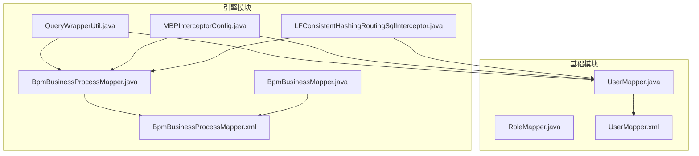
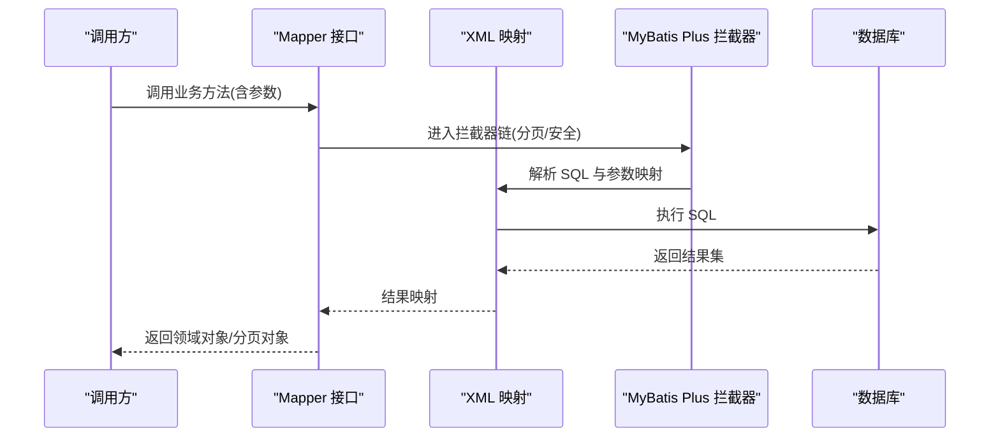
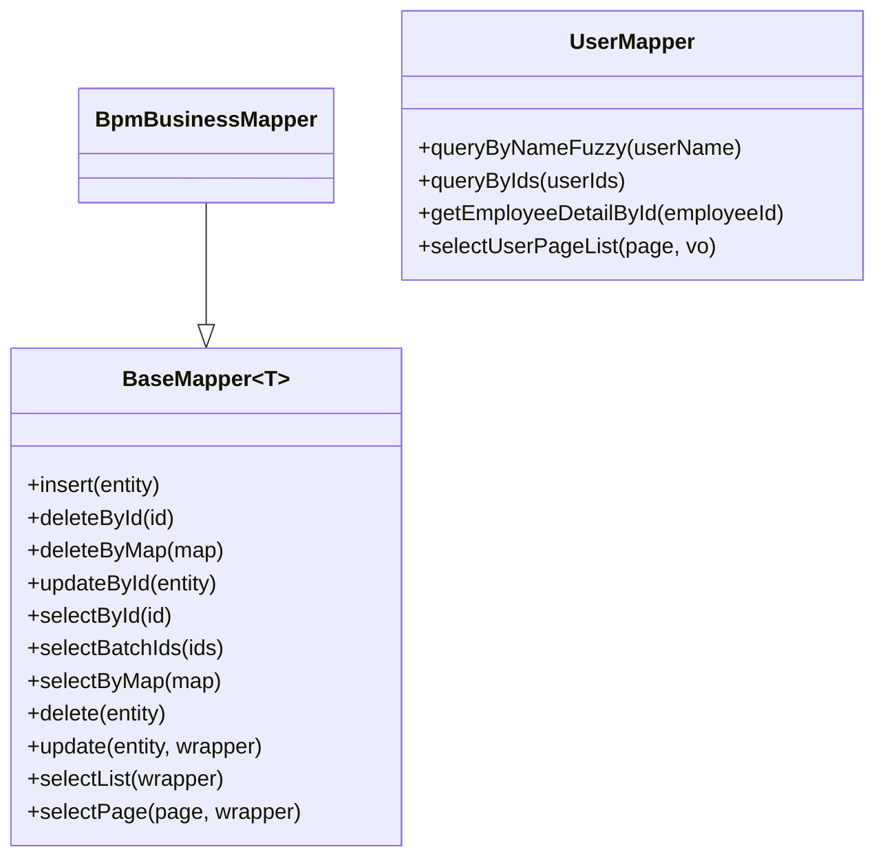
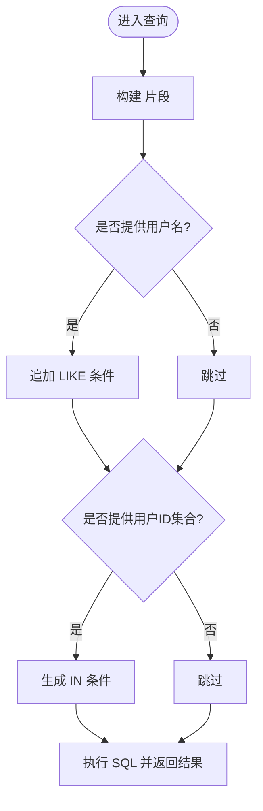
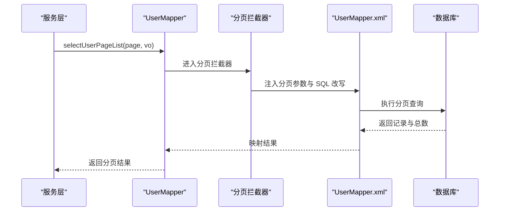
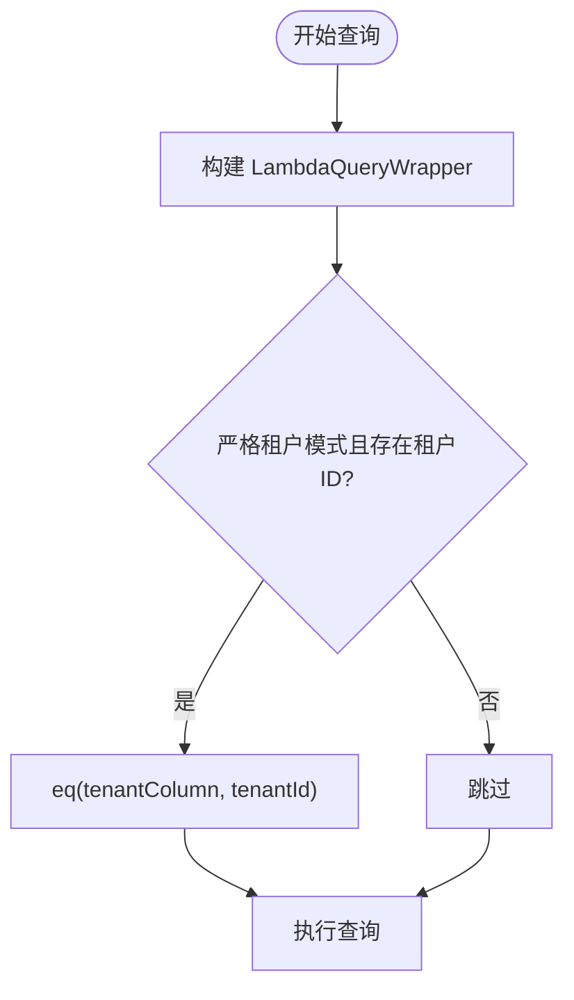

# Mapper 接口模式

<cite>
**本文引用的文件**
- [BpmBusinessProcessMapper.java](file://antflow-engine/src/main/java/org/openoa/engine/bpmnconf/mapper/BpmBusinessProcessMapper.java)
- [BpmBusinessProcessMapper.xml](file://antflow-engine/src/main/resources/mapper/BpmBusinessProcessMapper.xml)
- [UserMapper.java](file://antflow-base/src/main/java/org/openoa/base/mapper/UserMapper.java)
- [UserMapper.xml](file://antflow-engine/src/main/resources/mapper/UserMapper.xml)
- [RoleMapper.java](file://antflow-base/src/main/java/org/openoa/base/mapper/RoleMapper.java)
- [QueryWrapperUtil.java](file://antflow-engine/src/main/java/org/openoa/engine/utils/QueryWrapperUtil.java)
- [MBPInterceptorConfig.java](file://antflow-engine/src/main/java/org/openoa/engine/conf/mybatis/MBPInterceptorConfig.java)
- [LFConsistentHashingRoutingSqlInterceptor.java](file://antflow-engine/src/main/java/org/openoa/engine/conf/mybatis/interceptor/LFConsistentHashingRoutingSqlInterceptor.java)
- [BpmBusinessMapper.java](file://antflow-engine/src/main/java/org/openoa/engine/bpmnconf/mapper/BpmBusinessMapper.java)
</cite>

## 目录
1. [简介](#简介)
2. [项目结构](#项目结构)
3. [核心组件](#核心组件)
4. [架构总览](#架构总览)
5. [详细组件分析](#详细组件分析)
6. [依赖分析](#依赖分析)
7. [性能考虑](#性能考虑)
8. [故障排查指南](#故障排查指南)
9. [结论](#结论)
10. [附录](#附录)

## 简介
本文件系统性梳理 AntFlow 中基于 MyBatis Plus 的 Mapper 接口模式，覆盖通用 Mapper 设计、自定义 SQL 与动态 SQL 构建、命名规范与方法设计原则、参数传递模式、分页查询、条件查询、联表查询优化、以及自定义 Mapper 开发的最佳实践与性能调优策略。内容以工程中真实存在的 Mapper 接口与 XML 映射为依据，辅以架构与流程图帮助理解。

## 项目结构
AntFlow 将数据访问层划分为“接口 + XML 映射”的两部分：
- 接口层：位于模块的 mapper 包，声明 CRUD 与业务查询方法，继承 MyBatis Plus 的 BaseMapper 或自定义接口。
- XML 层：位于 resources/mapper 下，定义 SQL、动态片段、结果映射等。

图表来源
- [UserMapper.java](file://antflow-base/src/main/java/org/openoa/base/mapper/UserMapper.java)
- [UserMapper.xml](file://antflow-engine/src/main/resources/mapper/UserMapper.xml)
- [RoleMapper.java](file://antflow-base/src/main/java/org/openoa/base/mapper/RoleMapper.java)
- [BpmBusinessProcessMapper.java](file://antflow-engine/src/main/java/org/openoa/engine/bpmnconf/mapper/BpmBusinessProcessMapper.java)
- [BpmBusinessProcessMapper.xml](file://antflow-engine/src/main/resources/mapper/BpmBusinessProcessMapper.xml)
- [BpmBusinessMapper.java](file://antflow-engine/src/main/java/org/openoa/engine/bpmnconf/mapper/BpmBusinessMapper.java)
- [QueryWrapperUtil.java](file://antflow-engine/src/main/java/org/openoa/engine/utils/QueryWrapperUtil.java)
- [MBPInterceptorConfig.java](file://antflow-engine/src/main/java/org/openoa/engine/conf/mybatis/MBPInterceptorConfig.java)
- [LFConsistentHashingRoutingSqlInterceptor.java](file://antflow-engine/src/main/java/org/openoa/engine/conf/mybatis/interceptor/LFConsistentHashingRoutingSqlInterceptor.java)

章节来源
- [UserMapper.java](file://antflow-base/src/main/java/org/openoa/base/mapper/UserMapper.java)
- [UserMapper.xml](file://antflow-engine/src/main/resources/mapper/UserMapper.xml)
- [RoleMapper.java](file://antflow-base/src/main/java/org/openoa/base/mapper/RoleMapper.java)
- [BpmBusinessProcessMapper.java](file://antflow-engine/src/main/java/org/openoa/engine/bpmnconf/mapper/BpmBusinessProcessMapper.java)
- [BpmBusinessProcessMapper.xml](file://antflow-engine/src/main/resources/mapper/BpmBusinessProcessMapper.xml)
- [BpmBusinessMapper.java](file://antflow-engine/src/main/java/org/openoa/engine/bpmnconf/mapper/BpmBusinessMapper.java)
- [QueryWrapperUtil.java](file://antflow-engine/src/main/java/org/openoa/engine/utils/QueryWrapperUtil.java)
- [MBPInterceptorConfig.java](file://antflow-engine/src/main/java/org/openoa/engine/conf/mybatis/MBPInterceptorConfig.java)
- [LFConsistentHashingRoutingSqlInterceptor.java](file://antflow-engine/src/main/java/org/openoa/engine/conf/mybatis/interceptor/LFConsistentHashingRoutingSqlInterceptor.java)

## 核心组件
- 通用 Mapper 接口：继承 MyBatis Plus 的 BaseMapper，获得标准 CRUD 能力，减少重复 SQL。
- 自定义 Mapper 接口：在接口中声明业务方法，配合 XML 实现复杂查询或批量操作。
- 动态 SQL：通过 XML 的 <where/>、<if/>、<foreach/> 等标签构建条件查询与批量处理。
- 分页插件：通过 MyBatis Plus Interceptor 注入分页能力，统一处理分页逻辑。
- 租户过滤工具：QueryWrapperUtil 提供统一的租户条件注入，保障多租户安全。

章节来源
- [BpmBusinessMapper.java](file://antflow-engine/src/main/java/org/openoa/engine/bpmnconf/mapper/BpmBusinessMapper.java)
- [UserMapper.java](file://antflow-base/src/main/java/org/openoa/base/mapper/UserMapper.java)
- [QueryWrapperUtil.java](file://antflow-engine/src/main/java/org/openoa/engine/utils/QueryWrapperUtil.java)
- [MBPInterceptorConfig.java](file://antflow-engine/src/main/java/org/openoa/engine/conf/mybatis/MBPInterceptorConfig.java)

## 架构总览
Mapper 层与 MyBatis Plus 的交互路径如下：

图表来源
- [MBPInterceptorConfig.java](file://antflow-engine/src/main/java/org/openoa/engine/conf/mybatis/MBPInterceptorConfig.java)
- [UserMapper.java](file://antflow-base/src/main/java/org/openoa/base/mapper/UserMapper.java)
- [UserMapper.xml](file://antflow-engine/src/main/resources/mapper/UserMapper.xml)
- [BpmBusinessProcessMapper.java](file://antflow-engine/src/main/java/org/openoa/engine/bpmnconf/mapper/BpmBusinessProcessMapper.java)
- [BpmBusinessProcessMapper.xml](file://antflow-engine/src/main/resources/mapper/BpmBusinessProcessMapper.xml)

## 详细组件分析

### 通用 Mapper 接口设计
- 继承 BaseMapper：BpmBusinessMapper 直接继承 BaseMapper，获得标准增删改查与条件构造器能力，无需编写 XML。
- 接口职责单一：仅声明业务所需的额外方法，避免过度封装。

图表来源
- [BpmBusinessMapper.java](file://antflow-engine/src/main/java/org/openoa/engine/bpmnconf/mapper/BpmBusinessMapper.java)
- [UserMapper.java](file://antflow-base/src/main/java/org/openoa/base/mapper/UserMapper.java)

章节来源
- [BpmBusinessMapper.java](file://antflow-engine/src/main/java/org/openoa/engine/bpmnconf/mapper/BpmBusinessMapper.java)
- [UserMapper.java](file://antflow-base/src/main/java/org/openoa/base/mapper/UserMapper.java)

### 自定义 SQL 与动态 SQL 构建
- 条件查询：UserMapper.xml 使用 <where/> 与 <if/> 组合实现可选条件拼接；支持模糊匹配与 IN 批量查询。
- 批量处理：通过 <foreach/> 遍历集合，生成 IN 子句，避免硬编码字符串。
- 复杂联表：UserMapper.xml 中包含部门与用户联表查询，以及路径字段的层级查询示例。
- 更新与删除：BpmBusinessProcessMapper.xml 提供按条件更新与删除，结合动态片段减少冗余。

图表来源
- [UserMapper.xml](file://antflow-engine/src/main/resources/mapper/UserMapper.xml)

章节来源
- [UserMapper.xml](file://antflow-engine/src/main/resources/mapper/UserMapper.xml)
- [BpmBusinessProcessMapper.xml](file://antflow-engine/src/main/resources/mapper/BpmBusinessProcessMapper.xml)

### 分页查询实现
- 分页拦截器：MBPInterceptorConfig 注册 PaginationInnerInterceptor，支持 MySQL 数据库的分页。
- 接口约定：UserMapper 中 selectUserPageList 方法接收 Page 对象与 VO 参数，由拦截器自动注入分页上下文。
- 性能建议：避免 N+1 查询，尽量一次性拉取所需字段；对高频分页查询建立合适索引。

图表来源
- [MBPInterceptorConfig.java](file://antflow-engine/src/main/java/org/openoa/engine/conf/mybatis/MBPInterceptorConfig.java)
- [UserMapper.java](file://antflow-base/src/main/java/org/openoa/base/mapper/UserMapper.java)
- [UserMapper.xml](file://antflow-engine/src/main/resources/mapper/UserMapper.xml)

章节来源
- [MBPInterceptorConfig.java](file://antflow-engine/src/main/java/org/openoa/engine/conf/mybatis/MBPInterceptorConfig.java)
- [UserMapper.java](file://antflow-base/src/main/java/org/openoa/base/mapper/UserMapper.java)
- [UserMapper.xml](file://antflow-engine/src/main/resources/mapper/UserMapper.xml)

### 条件查询构建与租户过滤
- 动态条件：QueryWrapperUtil 提供 addTenantCondition 与 buildWithTenant 工具，统一注入租户 ID 条件，支持严格模式下的多租户隔离。
- 使用方式：在业务层构建 LambdaQueryWrapper 后，调用工具方法附加租户过滤，确保所有查询均受租户约束。

图表来源
- [QueryWrapperUtil.java](file://antflow-engine/src/main/java/org/openoa/engine/utils/QueryWrapperUtil.java)

章节来源
- [QueryWrapperUtil.java](file://antflow-engine/src/main/java/org/openoa/engine/utils/QueryWrapperUtil.java)

### 联表查询优化
- 字段选择：优先只查询必要列，减少网络与反序列化开销。
- 索引与连接键：确保联表字段具备索引，避免隐式转换导致的全表扫描。
- 路径与层级查询：UserMapper.xml 中的路径字段层级查询示例展示了复杂 SQL 的可维护性，建议拆分子查询并配合 LIMIT 控制结果规模。
- 结果映射：通过 resultMap 明确映射关系，避免 N+1 问题。

章节来源
- [UserMapper.xml](file://antflow-engine/src/main/resources/mapper/UserMapper.xml)

### 自定义 Mapper 的开发指南与最佳实践
- 接口命名规范
  - 采用“业务实体名 + Mapper”命名，如 BpmBusinessProcessMapper、UserMapper。
  - 接口文件与 XML 文件同名并置于同一包结构下，便于 MyBatis 扫描与绑定。
- 方法设计原则
  - 单一职责：每个方法聚焦一类查询或操作。
  - 参数最小化：优先使用 VO/DTO 封装多个条件，减少重载。
  - 返回值明确：分页场景返回 Page<T>；批量查询返回 List<T>。
- 参数传递模式
  - 使用 @Param 注解标注参数名，避免按位置传参带来的维护成本。
  - 对集合参数使用 Collection/List，配合 XML 的 <foreach/>。
- 动态 SQL 最佳实践
  - 使用 <where/> 包裹条件，自动处理第一个 AND/OR。
  - 对字符串参数使用 bind 或 CONCAT 实现模糊匹配，避免 SQL 注入。
  - 对批量 IN 查询，注意参数数量限制与性能阈值。
- 安全与防护
  - 启用 MyBatis Plus 分页拦截器，避免全表扫描。
  - 可选启用 BlockAttackInnerInterceptor 防止误删全表（按需开启）。
- 多租户与权限
  - 使用 QueryWrapperUtil 统一注入租户条件，保证数据隔离。
- XML 维护
  - 将公共列与片段抽取到 <sql/> 中复用，保持 XML 清晰。
  - 为复杂 SQL 添加注释，说明业务背景与边界条件。

章节来源
- [BpmBusinessProcessMapper.java](file://antflow-engine/src/main/java/org/openoa/engine/bpmnconf/mapper/BpmBusinessProcessMapper.java)
- [BpmBusinessProcessMapper.xml](file://antflow-engine/src/main/resources/mapper/BpmBusinessProcessMapper.xml)
- [UserMapper.java](file://antflow-base/src/main/java/org/openoa/base/mapper/UserMapper.java)
- [UserMapper.xml](file://antflow-engine/src/main/resources/mapper/UserMapper.xml)
- [QueryWrapperUtil.java](file://antflow-engine/src/main/java/org/openoa/engine/utils/QueryWrapperUtil.java)
- [MBPInterceptorConfig.java](file://antflow-engine/src/main/java/org/openoa/engine/conf/mybatis/MBPInterceptorConfig.java)

## 依赖分析
- Mapper 接口与 XML 的绑定：MyBatis 通过命名空间与接口全限定名关联，XML 中的 id 与接口方法名一致。
- 插件依赖：分页拦截器依赖数据库类型配置；SQL 拦截器用于路由或改写（如一致性哈希路由）。
- 工具类依赖：QueryWrapperUtil 依赖多租户工具类与 LambdaQueryWrapper。

图表来源
- [UserMapper.java](file://antflow-base/src/main/java/org/openoa/base/mapper/UserMapper.java)
- [UserMapper.xml](file://antflow-engine/src/main/resources/mapper/UserMapper.xml)
- [MBPInterceptorConfig.java](file://antflow-engine/src/main/java/org/openoa/engine/conf/mybatis/MBPInterceptorConfig.java)
- [QueryWrapperUtil.java](file://antflow-engine/src/main/java/org/openoa/engine/utils/QueryWrapperUtil.java)

章节来源
- [UserMapper.java](file://antflow-base/src/main/java/org/openoa/base/mapper/UserMapper.java)
- [UserMapper.xml](file://antflow-engine/src/main/resources/mapper/UserMapper.xml)
- [MBPInterceptorConfig.java](file://antflow-engine/src/main/java/org/openoa/engine/conf/mybatis/MBPInterceptorConfig.java)
- [QueryWrapperUtil.java](file://antflow-engine/src/main/java/org/openoa/engine/utils/QueryWrapperUtil.java)

## 性能考虑
- 分页与排序
  - 使用分页拦截器，避免一次性拉取大量数据。
  - 对排序字段建立索引，避免文件排序。
- 动态 SQL
  - 减少 OR 条件与函数运算，优先使用等值匹配与范围查询。
  - 对 LIKE '%keyword%' 进行全文检索或前缀索引改造。
- 批量操作
  - 使用批处理或 JDBC 批执行，降低往返次数。
  - 控制单次批量大小，避免内存压力。
- 缓存与连接池
  - 合理配置连接池与查询缓存，避免连接泄漏。
- SQL 拦截与改写
  - 在拦截器中进行必要的 SQL 改写或路由，避免在业务层重复判断。

## 故障排查指南
- 分页不生效
  - 检查是否正确注入分页拦截器与传入 Page 对象。
  - 确认 XML 中未手动改写分页 SQL。
- 动态条件无效
  - 确认参数名与 XML 中占位符一致，使用 @Param 注解。
  - 检查 <where/> 与 <if/> 标签包裹是否正确。
- 多租户数据越权
  - 确认 QueryWrapperUtil 是否被调用并处于严格模式。
  - 检查租户 ID 获取逻辑与数据库字段映射。
- SQL 注入与性能问题
  - 避免直接拼接 SQL；使用参数化与预编译。
  - 对复杂 SQL 进行 Explain 分析，优化索引与执行计划。

章节来源
- [MBPInterceptorConfig.java](file://antflow-engine/src/main/java/org/openoa/engine/conf/mybatis/MBPInterceptorConfig.java)
- [QueryWrapperUtil.java](file://antflow-engine/src/main/java/org/openoa/engine/utils/QueryWrapperUtil.java)
- [UserMapper.xml](file://antflow-engine/src/main/resources/mapper/UserMapper.xml)

## 结论
AntFlow 的 Mapper 接口模式以 MyBatis Plus 为核心，结合通用 Mapper 与自定义 XML 映射，实现了清晰的职责分离与高效的动态 SQL 构建。通过统一的租户过滤工具、分页拦截器与良好的命名规范，既保证了开发效率，也兼顾了安全性与性能。遵循本文的最佳实践与排错指南，可在复杂业务场景中稳定地扩展自定义 Mapper 并持续优化查询性能。

## 附录
- 示例参考
  - [BpmBusinessProcessMapper.java](file://antflow-engine/src/main/java/org/openoa/engine/bpmnconf/mapper/BpmBusinessProcessMapper.java)
  - [BpmBusinessProcessMapper.xml](file://antflow-engine/src/main/resources/mapper/BpmBusinessProcessMapper.xml)
  - [UserMapper.java](file://antflow-base/src/main/java/org/openoa/base/mapper/UserMapper.java)
  - [UserMapper.xml](file://antflow-engine/src/main/resources/mapper/UserMapper.xml)
  - [RoleMapper.java](file://antflow-base/src/main/java/org/openoa/base/mapper/RoleMapper.java)
  - [QueryWrapperUtil.java](file://antflow-engine/src/main/java/org/openoa/engine/utils/QueryWrapperUtil.java)
  - [MBPInterceptorConfig.java](file://antflow-engine/src/main/java/org/openoa/engine/conf/mybatis/MBPInterceptorConfig.java)
  - [LFConsistentHashingRoutingSqlInterceptor.java](file://antflow-engine/src/main/java/org/openoa/engine/conf/mybatis/interceptor/LFConsistentHashingRoutingSqlInterceptor.java)