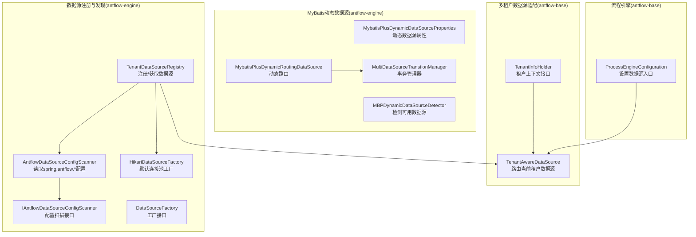
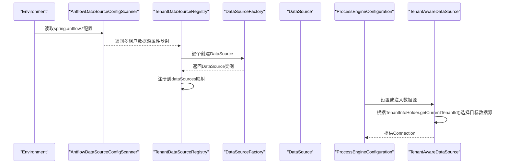
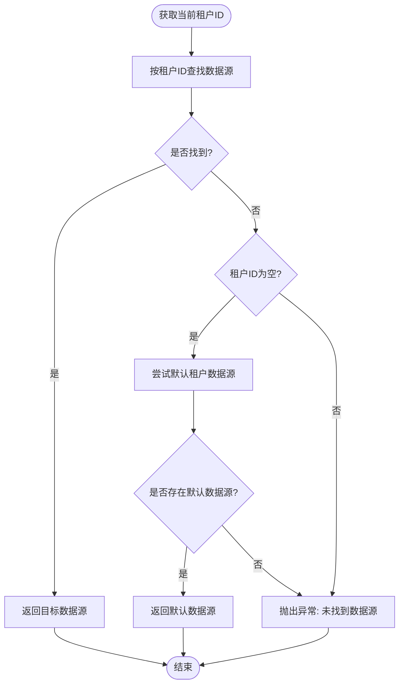
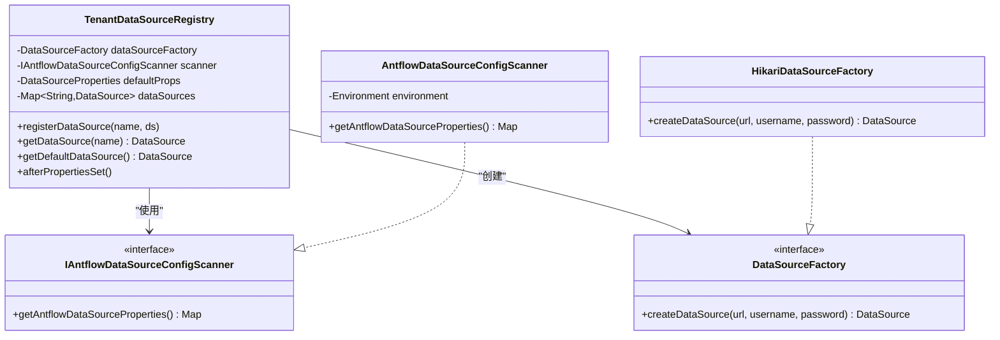
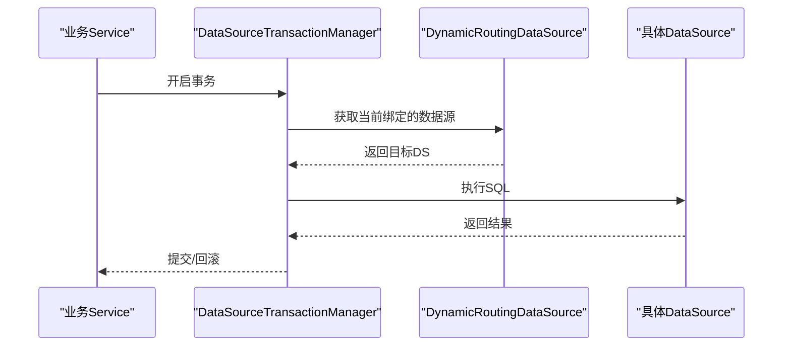
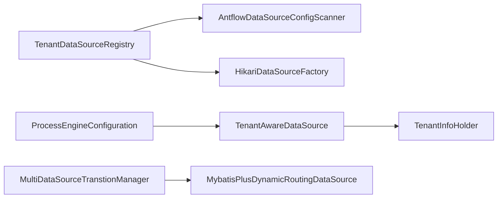

# 多数据源支持

<cite>
**本文引用的文件**
- [TenantAwareDataSource.java](file://antflow-base/src/main/java/org/activiti/engine/impl/cfg/multitenant/TenantAwareDataSource.java)
- [TenantInfoHolder.java](file://antflow-base/src/main/java/org/activiti/engine/impl/cfg/multitenant/TenantInfoHolder.java)
- [TenantDataSourceRegistry.java](file://antflow-engine/src/main/java/org/openoa/engine/conf/engineconfig/TenantDataSourceRegistry.java)
- [AntflowDataSourceConfigScanner.java](file://antflow-engine/src/main/java/org/openoa/engine/conf/engineconfig/AntflowDataSourceConfigScanner.java)
- [IAntflowDataSourceConfigScanner.java](file://antflow-engine/src/main/java/org/openoa/engine/conf/engineconfig/IAntflowDataSourceConfigScanner.java)
- [HikariDataSourceFactory.java](file://antflow-engine/src/main/java/org/openoa/engine/conf/engineconfig/HikariDataSourceFactory.java)
- [DataSourceFactory.java](file://antflow-engine/src/main/java/org/openoa/engine/conf/engineconfig/DataSourceFactory.java)
- [MultiSchemaMultiTenantDataSourceProcessEngineAutoConfiguration.java](file://antflow-engine/src/main/java/org/openoa/engine/conf/engineconfig/MultiSchemaMultiTenantDataSourceProcessEngineAutoConfiguration.java)
- [MultiDataSourceTranstionManager.java](file://antflow-engine/src/main/java/org/openoa/engine/conf/mybatis/MultiDataSourceTranstionManager.java)
- [MybatisPlusDynamicDataSourceProperties.java](file://antflow-engine/src/main/java/org/openoa/engine/conf/mybatis/MybatisPlusDynamicDataSourceProperties.java)
- [MybatisPlusDynamicRoutingDataSource.java](file://antflow-engine/src/main/java/org/openoa/engine/conf/mybatis/MybatisPlusDynamicRoutingDataSource.java)
- [MBPDynamicDataSourceDetector.java](file://antflow-engine/src/main/java/org/openoa/engine/conf/engineconfig/MBPDynamicDataSourceDetector.java)
- [ProcessEngineConfiguration.java](file://antflow-base/src/main/java/org/activiti/engine/ProcessEngineConfiguration.java)
</cite>

## 目录
1. [简介](#简介)
2. [项目结构](#项目结构)
3. [核心组件](#核心组件)
4. [架构总览](#架构总览)
5. [组件详解](#组件详解)
6. [依赖关系分析](#依赖关系分析)
7. [性能考量](#性能考量)
8. [故障排查指南](#故障排查指南)
9. [结论](#结论)
10. [附录：配置与使用示例](#附录配置与使用示例)

## 简介
本文件系统性阐述 AntFlow 在多数据源与多租户场景下的实现架构与最佳实践，重点覆盖以下方面：
- 动态数据源路由机制与租户上下文绑定
- 数据源注册与发现流程
- 事务管理器配置与多数据源事务一致性
- 多数据源切换策略、连接池管理与性能优化
- 多租户下的数据隔离与扩展点
- 配置示例、使用场景分析、故障排查与开发调试技巧

## 项目结构
围绕多数据源与多租户能力，相关代码主要分布在如下模块与包中：
- 多租户数据源适配：antflow-base 的多租户数据源路由实现
- 租户数据源注册与发现：antflow-engine 的配置扫描与工厂创建
- MyBatis 动态数据源与事务管理：antflow-engine 的动态数据源与事务配置
- 流程引擎数据源注入：antflow-base 的流程引擎配置入口

图表来源
- [TenantAwareDataSource.java:39-78](file://antflow-base/src/main/java/org/activiti/engine/impl/cfg/multitenant/TenantAwareDataSource.java#L39-L78)
- [TenantInfoHolder.java:28-50](file://antflow-base/src/main/java/org/activiti/engine/impl/cfg/multitenant/TenantInfoHolder.java#L28-L50)
- [TenantDataSourceRegistry.java:13-64](file://antflow-engine/src/main/java/org/openoa/engine/conf/engineconfig/TenantDataSourceRegistry.java#L13-L64)
- [AntflowDataSourceConfigScanner.java:14-30](file://antflow-engine/src/main/java/org/openoa/engine/conf/engineconfig/AntflowDataSourceConfigScanner.java#L14-L30)
- [IAntflowDataSourceConfigScanner.java:7-9](file://antflow-engine/src/main/java/org/openoa/engine/conf/engineconfig/IAntflowDataSourceConfigScanner.java#L7-L9)
- [HikariDataSourceFactory.java:14-26](file://antflow-engine/src/main/java/org/openoa/engine/conf/engineconfig/HikariDataSourceFactory.java#L14-L26)
- [DataSourceFactory.java:5-7](file://antflow-engine/src/main/java/org/openoa/engine/conf/engineconfig/DataSourceFactory.java#L5-L7)
- [MybatisPlusDynamicDataSourceProperties.java:27-60](file://antflow-engine/src/main/java/org/openoa/engine/conf/mybatis/MybatisPlusDynamicDataSourceProperties.java#L27-L60)
- [MybatisPlusDynamicRoutingDataSource.java](file://antflow-engine/src/main/java/org/openoa/engine/conf/mybatis/MybatisPlusDynamicRoutingDataSource.java)
- [MultiDataSourceTranstionManager.java:21-28](file://antflow-engine/src/main/java/org/openoa/engine/conf/mybatis/MultiDataSourceTranstionManager.java#L21-L28)
- [MBPDynamicDataSourceDetector.java:30-57](file://antflow-engine/src/main/java/org/openoa/engine/conf/engineconfig/MBPDynamicDataSourceDetector.java#L30-L57)
- [ProcessEngineConfiguration.java:407-417](file://antflow-base/src/main/java/org/activiti/engine/ProcessEngineConfiguration.java#L407-L417)

章节来源
- [TenantAwareDataSource.java:39-78](file://antflow-base/src/main/java/org/activiti/engine/impl/cfg/multitenant/TenantAwareDataSource.java#L39-L78)
- [TenantDataSourceRegistry.java:13-64](file://antflow-engine/src/main/java/org/openoa/engine/conf/engineconfig/TenantDataSourceRegistry.java#L13-L64)
- [AntflowDataSourceConfigScanner.java:14-30](file://antflow-engine/src/main/java/org/openoa/engine/conf/engineconfig/AntflowDataSourceConfigScanner.java#L14-L30)

## 核心组件
- 租户感知数据源 TenantAwareDataSource：根据当前租户 ID 动态选择对应数据源，支持默认租户回退与异常提示。
- 租户上下文 TenantInfoHolder：提供获取/设置/清理当前租户 ID 的能力，驱动数据源路由。
- 数据源注册中心 TenantDataSourceRegistry：从配置扫描器读取多租户数据源配置，通过工厂创建并注册；若无配置则回退到默认数据源。
- 配置扫描器 AntflowDataSourceConfigScanner：基于 spring.antflow.* 前缀绑定多组数据源属性。
- 连接池工厂 HikariDataSourceFactory：默认实现，可被用户自定义工厂覆盖。
- MyBatis 动态数据源与事务：动态数据源属性、路由 Bean、事务管理器 Bean，以及数据源检测工具。

章节来源
- [TenantAwareDataSource.java:39-78](file://antflow-base/src/main/java/org/activiti/engine/impl/cfg/multitenant/TenantAwareDataSource.java#L39-L78)
- [TenantInfoHolder.java:28-50](file://antflow-base/src/main/java/org/activiti/engine/impl/cfg/multitenant/TenantInfoHolder.java#L28-L50)
- [TenantDataSourceRegistry.java:13-64](file://antflow-engine/src/main/java/org/openoa/engine/conf/engineconfig/TenantDataSourceRegistry.java#L13-L64)
- [AntflowDataSourceConfigScanner.java:14-30](file://antflow-engine/src/main/java/org/openoa/engine/conf/engineconfig/AntflowDataSourceConfigScanner.java#L14-L30)
- [HikariDataSourceFactory.java:14-26](file://antflow-engine/src/main/java/org/openoa/engine/conf/engineconfig/HikariDataSourceFactory.java#L14-L26)

## 架构总览
下图展示从配置到运行时数据源路由的关键路径，以及与流程引擎的集成点：

图表来源
- [AntflowDataSourceConfigScanner.java:20-29](file://antflow-engine/src/main/java/org/openoa/engine/conf/engineconfig/AntflowDataSourceConfigScanner.java#L20-L29)
- [TenantDataSourceRegistry.java:40-63](file://antflow-engine/src/main/java/org/openoa/engine/conf/engineconfig/TenantDataSourceRegistry.java#L40-L63)
- [HikariDataSourceFactory.java:16-25](file://antflow-engine/src/main/java/org/openoa/engine/conf/engineconfig/HikariDataSourceFactory.java#L16-L25)
- [ProcessEngineConfiguration.java:407-417](file://antflow-base/src/main/java/org/activiti/engine/ProcessEngineConfiguration.java#L407-L417)
- [TenantAwareDataSource.java:64-78](file://antflow-base/src/main/java/org/activiti/engine/impl/cfg/multitenant/TenantAwareDataSource.java#L64-L78)

## 组件详解

### 租户感知数据源路由
- 路由逻辑：从租户上下文获取当前租户 ID，按该 ID 从已注册的数据源集合中查找；若为空且存在默认租户键，则回退至默认数据源；否则抛出异常。
- 默认回退策略：当未显式设置租户且未找到目标数据源时，尝试使用默认租户键进行回退。
- 异常处理：找不到对应租户数据源时抛出异常，便于快速定位配置缺失问题。

图表来源
- [TenantAwareDataSource.java:64-78](file://antflow-base/src/main/java/org/activiti/engine/impl/cfg/multitenant/TenantAwareDataSource.java#L64-L78)

章节来源
- [TenantAwareDataSource.java:39-78](file://antflow-base/src/main/java/org/activiti/engine/impl/cfg/multitenant/TenantAwareDataSource.java#L39-L78)

### 数据源注册与发现
- 配置扫描：以 spring.antflow 为前缀绑定多组数据源属性，键即为租户标识。
- 工厂创建：遍历扫描结果，调用工厂创建 DataSource 并注册到内存映射。
- 回退策略：若扫描结果为空，使用默认数据源属性构建单一数据源。
- 获取策略：优先按名称精确匹配，其次回退到空键或 default 键。

图表来源
- [TenantDataSourceRegistry.java:13-64](file://antflow-engine/src/main/java/org/openoa/engine/conf/engineconfig/TenantDataSourceRegistry.java#L13-L64)
- [IAntflowDataSourceConfigScanner.java:7-9](file://antflow-engine/src/main/java/org/openoa/engine/conf/engineconfig/IAntflowDataSourceConfigScanner.java#L7-L9)
- [AntflowDataSourceConfigScanner.java:14-30](file://antflow-engine/src/main/java/org/openoa/engine/conf/engineconfig/AntflowDataSourceConfigScanner.java#L14-L30)
- [DataSourceFactory.java:5-7](file://antflow-engine/src/main/java/org/openoa/engine/conf/engineconfig/DataSourceFactory.java#L5-L7)
- [HikariDataSourceFactory.java:14-26](file://antflow-engine/src/main/java/org/openoa/engine/conf/engineconfig/HikariDataSourceFactory.java#L14-L26)

章节来源
- [TenantDataSourceRegistry.java:13-64](file://antflow-engine/src/main/java/org/openoa/engine/conf/engineconfig/TenantDataSourceRegistry.java#L13-L64)
- [AntflowDataSourceConfigScanner.java:14-30](file://antflow-engine/src/main/java/org/openoa/engine/conf/engineconfig/AntflowDataSourceConfigScanner.java#L14-L30)
- [HikariDataSourceFactory.java:14-26](file://antflow-engine/src/main/java/org/openoa/engine/conf/engineconfig/HikariDataSourceFactory.java#L14-L26)

### 事务管理器与一致性
- MyBatis 动态数据源事务：通过注入动态路由数据源，创建数据源级事务管理器，确保同一事务内的所有数据访问落到同一数据源。
- 事务边界：建议在业务层以方法为单位开启事务，避免跨数据源的长事务导致锁竞争与资源占用。
- 事务传播：结合 Spring 事务传播语义，确保跨服务调用时的事务一致性。

图表来源
- [MultiDataSourceTranstionManager.java:21-28](file://antflow-engine/src/main/java/org/openoa/engine/conf/mybatis/MultiDataSourceTranstionManager.java#L21-L28)
- [MybatisPlusDynamicRoutingDataSource.java](file://antflow-engine/src/main/java/org/openoa/engine/conf/mybatis/MybatisPlusDynamicRoutingDataSource.java)

章节来源
- [MultiDataSourceTranstionManager.java:21-28](file://antflow-engine/src/main/java/org/openoa/engine/conf/mybatis/MultiDataSourceTranstionManager.java#L21-L28)

### 多数据源切换策略
- 切换触发点：通常在进入业务方法或请求入口处设置租户上下文；随后数据源路由生效。
- 切换时机：建议在拦截器或网关层统一设置当前租户 ID，避免在业务内部分散设置。
- 切换粒度：按租户维度切换；如需按业务域细分，可在租户 ID 中编码域信息，再由路由层解析。

章节来源
- [TenantInfoHolder.java:28-50](file://antflow-base/src/main/java/org/activiti/engine/impl/cfg/multitenant/TenantInfoHolder.java#L28-L50)
- [TenantAwareDataSource.java:64-78](file://antflow-base/src/main/java/org/activiti/engine/impl/cfg/multitenant/TenantAwareDataSource.java#L64-L78)

### 连接池管理
- 默认工厂：HikariDataSourceFactory 提供最小连接数与最大连接数等基础参数，满足一般场景。
- 自定义覆盖：可通过实现 DataSourceFactory 接口并标注为 @Primary 覆盖默认工厂。
- 连接池优化：针对不同租户/业务域的并发特征，可分别配置连接池大小、空闲超时、连接生命周期等参数。

章节来源
- [HikariDataSourceFactory.java:14-26](file://antflow-engine/src/main/java/org/openoa/engine/conf/engineconfig/HikariDataSourceFactory.java#L14-L26)
- [DataSourceFactory.java:5-7](file://antflow-engine/src/main/java/org/openoa/engine/conf/engineconfig/DataSourceFactory.java#L5-L7)

### 多租户下的数据隔离与扩展
- 数据隔离：通过租户 ID 与数据源映射实现天然隔离；建议在表设计层面保留租户字段，并在查询层强制带租户过滤。
- 扩展点：可替换租户上下文实现、自定义路由策略、扩展默认数据源回退逻辑。
- 流程引擎集成：流程引擎配置可直接注入租户感知数据源，确保流程表与业务表在同一数据源内保持一致。

章节来源
- [TenantAwareDataSource.java:39-78](file://antflow-base/src/main/java/org/activiti/engine/impl/cfg/multitenant/TenantAwareDataSource.java#L39-L78)
- [ProcessEngineConfiguration.java:407-417](file://antflow-base/src/main/java/org/activiti/engine/ProcessEngineConfiguration.java#L407-L417)

## 依赖关系分析
- 组件耦合
  - TenantDataSourceRegistry 依赖 IAntflowDataSourceConfigScanner 与 DataSourceFactory，职责清晰、耦合度低。
  - TenantAwareDataSource 依赖 TenantInfoHolder，路由行为与上下文解耦。
  - MyBatis 动态数据源与事务管理器通过 Spring 容器装配，形成松耦合。
- 外部依赖
  - Spring Boot 配置绑定与环境抽象
  - MyBatis 动态数据源（注释中可见相关配置类）
  - Hikari/Druid 连接池（默认采用 Hikari）

图表来源
- [TenantDataSourceRegistry.java:13-64](file://antflow-engine/src/main/java/org/openoa/engine/conf/engineconfig/TenantDataSourceRegistry.java#L13-L64)
- [AntflowDataSourceConfigScanner.java:14-30](file://antflow-engine/src/main/java/org/openoa/engine/conf/engineconfig/AntflowDataSourceConfigScanner.java#L14-L30)
- [HikariDataSourceFactory.java:14-26](file://antflow-engine/src/main/java/org/openoa/engine/conf/engineconfig/HikariDataSourceFactory.java#L14-L26)
- [TenantAwareDataSource.java:39-78](file://antflow-base/src/main/java/org/activiti/engine/impl/cfg/multitenant/TenantAwareDataSource.java#L39-L78)
- [ProcessEngineConfiguration.java:407-417](file://antflow-base/src/main/java/org/activiti/engine/ProcessEngineConfiguration.java#L407-L417)
- [MultiDataSourceTranstionManager.java:21-28](file://antflow-engine/src/main/java/org/openoa/engine/conf/mybatis/MultiDataSourceTranstionManager.java#L21-L28)
- [MybatisPlusDynamicRoutingDataSource.java](file://antflow-engine/src/main/java/org/openoa/engine/conf/mybatis/MybatisPlusDynamicRoutingDataSource.java)

## 性能考量
- 连接池参数：根据租户并发与业务峰值调整最大连接数、最小空闲、连接超时等参数。
- 路由开销：路由查找为 O(1) 映射查找，开销极低；避免在热路径频繁切换租户上下文。
- 事务粒度：尽量缩短事务时间，减少跨数据源的长事务，降低锁竞争。
- 缓存与批处理：对热点查询与批量写入进行缓存与批处理优化。
- 监控与告警：对连接池活跃数、等待时间、超时次数进行监控，及时发现瓶颈。

## 故障排查指南
- 现象：找不到数据源
  - 检查 spring.antflow.* 配置键是否正确，租户 ID 是否与配置键一致。
  - 若未配置任何租户数据源，确认是否期望回退到默认数据源。
- 现象：切换无效或路由错误
  - 确认租户上下文设置是否在进入业务方法前完成。
  - 检查租户 ID 是否为空或拼写错误。
- 现象：事务异常或跨数据源失败
  - 确保事务边界仅覆盖同一数据源内的操作。
  - 检查动态数据源事务管理器是否正确装配。
- 现象：连接池耗尽或超时
  - 调整最大连接数、空闲超时、连接生命周期等参数。
  - 分析慢查询与长事务，优化 SQL 与事务时长。

章节来源
- [TenantAwareDataSource.java:64-78](file://antflow-base/src/main/java/org/activiti/engine/impl/cfg/multitenant/TenantAwareDataSource.java#L64-L78)
- [TenantDataSourceRegistry.java:40-63](file://antflow-engine/src/main/java/org/openoa/engine/conf/engineconfig/TenantDataSourceRegistry.java#L40-L63)
- [MultiDataSourceTranstionManager.java:21-28](file://antflow-engine/src/main/java/org/openoa/engine/conf/mybatis/MultiDataSourceTranstionManager.java#L21-L28)

## 结论
AntFlow 的多数据源与多租户能力通过“配置扫描 + 工厂创建 + 路由选择”的分层设计实现，具备良好的可扩展性与可维护性。结合合理的连接池参数、事务边界与监控告警，可在多租户场景下实现稳定、高效、可扩展的数据访问体系。

## 附录：配置与使用示例

### 配置示例（YAML）
- 多租户数据源配置
  - spring:
    - antflow:
      - tenantA:
        - url: jdbc:h2:mem:tenantA
        - username: sa
        - password: sa
      - tenantB:
        - url: jdbc:h2:mem:tenantB
        - username: sa
        - password: sa
- 默认数据源（当未扫描到租户数据源时使用）
  - spring:
    - datasource:
      - url: jdbc:h2:mem:default
      - username: sa
      - password: sa

说明
- 上述配置键 tenantA、tenantB 即为租户标识，用于与租户上下文绑定。
- 当未配置任何租户数据源时，将回退到默认数据源。

章节来源
- [AntflowDataSourceConfigScanner.java:20-29](file://antflow-engine/src/main/java/org/openoa/engine/conf/engineconfig/AntflowDataSourceConfigScanner.java#L20-L29)
- [TenantDataSourceRegistry.java:56-58](file://antflow-engine/src/main/java/org/openoa/engine/conf/engineconfig/TenantDataSourceRegistry.java#L56-L58)

### 使用场景分析
- 多租户 SaaS：每个租户独立数据源，天然隔离；通过租户 ID 路由到对应数据源。
- 多业务域：在租户 ID 中编码域信息，路由层解析后选择对应数据源。
- 混合部署：部分租户走主库，部分走从库，通过路由策略实现读写分离与负载均衡。

### 开发与调试技巧
- 在拦截器或网关层统一设置租户上下文，避免分散设置。
- 为每个租户准备独立的测试数据源，便于单元测试与集成测试。
- 使用数据源检测工具输出当前可用数据源列表，辅助定位路由问题。
- 对关键 SQL 加入慢查询与行数统计，持续优化热点路径。

章节来源
- [MBPDynamicDataSourceDetector.java:30-57](file://antflow-engine/src/main/java/org/openoa/engine/conf/engineconfig/MBPDynamicDataSourceDetector.java#L30-L57)