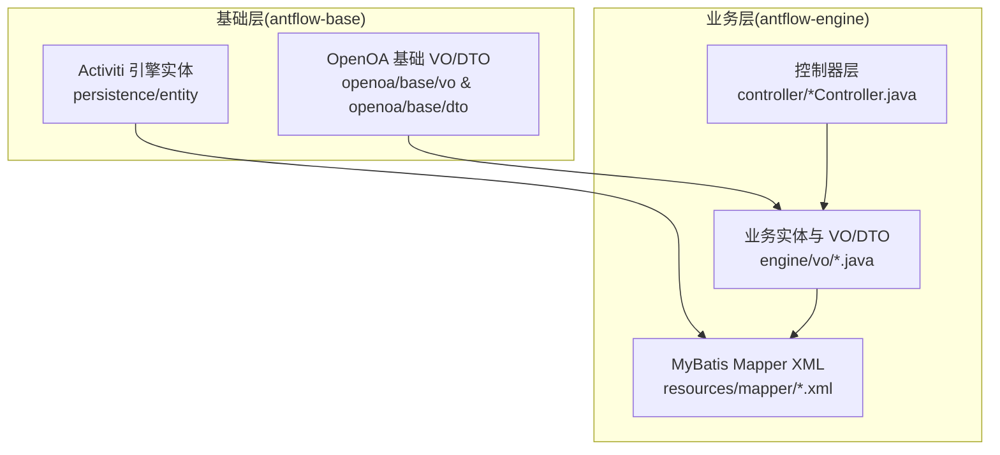
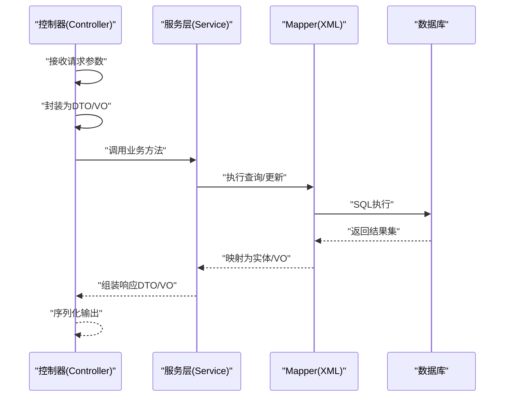
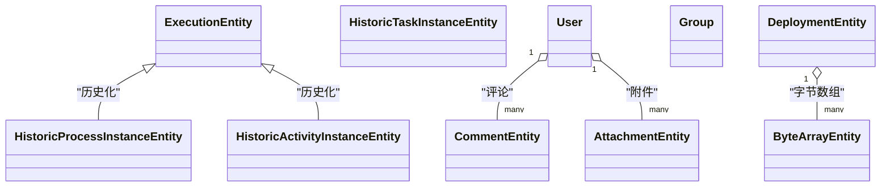
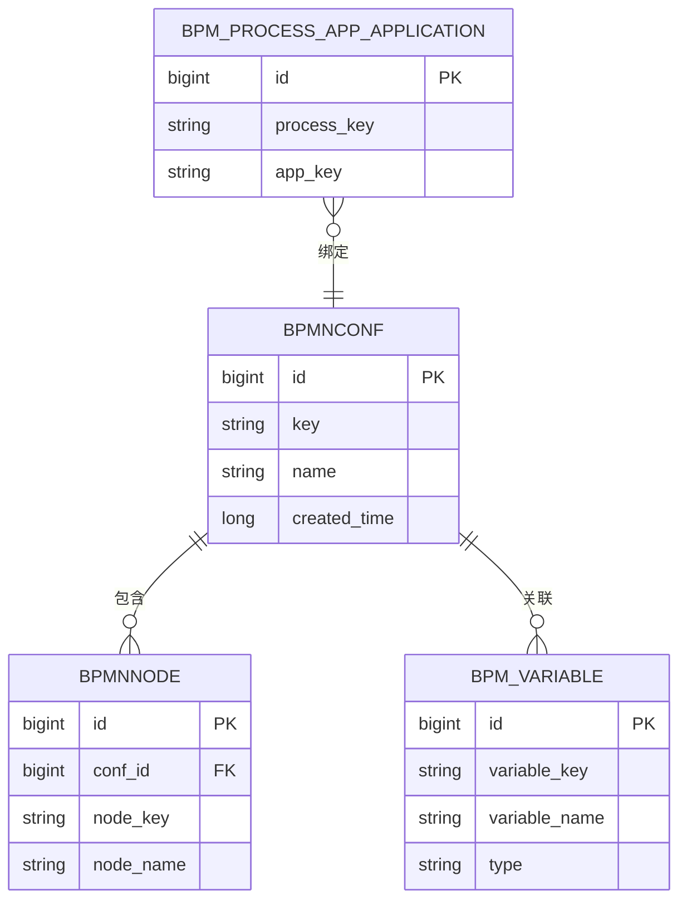
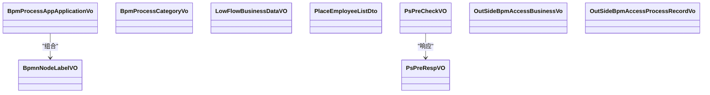
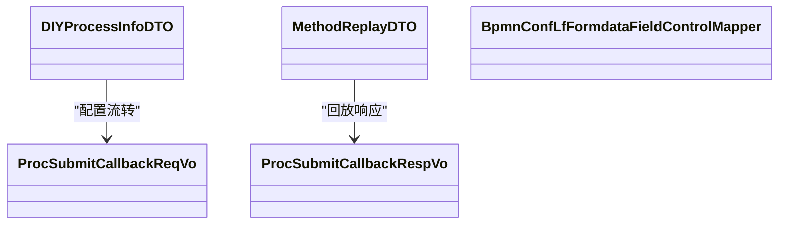
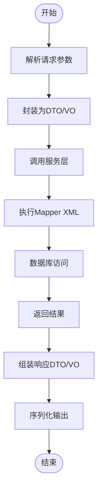
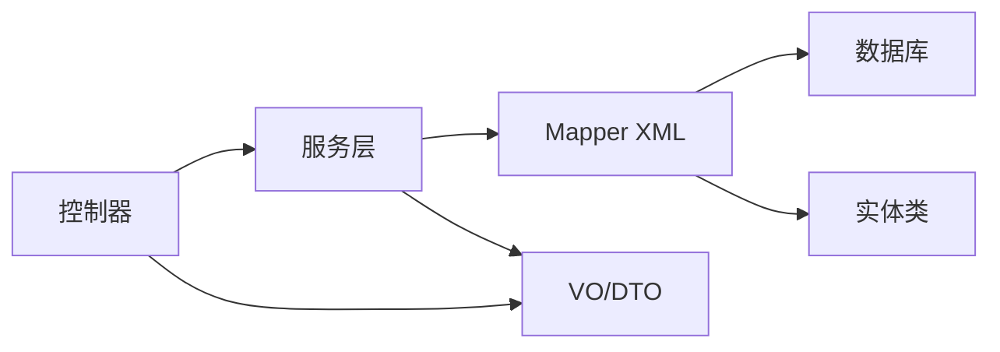

# 实体模型设计

<cite>
**本文引用的文件**
- [BpmProcessNodeRecord.java](file://antflow-base/src/main/java/org/activiti/engine/impl/persistence/entity/BpmProcessNodeRecord.java)
- [AttachmentEntity.java](file://antflow-base/src/main/java/org/activiti/engine/impl/persistence/entity/AttachmentEntity.java)
- [ByteArrayEntity.java](file://antflow-base/src/main/java/org/activiti/engine/impl/persistence/entity/ByteArrayEntity.java)
- [CommentEntity.java](file://antflow-base/src/main/java/org/activiti/engine/impl/persistence/entity/CommentEntity.java)
- [DeploymentEntity.java](file://antflow-base/src/main/java/org/activiti/engine/impl/persistence/entity/DeploymentEntity.java)
- [HistoricActivityInstanceEntity.java](file://antflow-base/src/main/java/org/activiti/engine/impl/persistence/entity/HistoricActivityInstanceEntity.java)
- [HistoricProcessInstanceEntity.java](file://antflow-base/src/main/java/org/activiti/engine/impl/persistence/entity/HistoricProcessInstanceEntity.java)
- [HistoricTaskInstanceEntity.java](file://antflow-base/src/main/java/org/activiti/engine/impl/persistence/entity/HistoricTaskInstanceEntity.java)
- [ExecutionEntity.java](file://antflow-base/src/main/java/org/activiti/engine/impl/persistence/entity/ExecutionEntity.java)
- [GroupEntity.java](file://antflow-base/src/main/java/org/activiti/engine/impl/persistence/entity/GroupEntity.java)
- [User.java](file://antflow-base/src/main/java/org/activiti/engine/impl/persistence/entity/User.java)
- [BpmnNodeLabelVO.java](file://antflow-base/src/main/java/org/openoa/base/vo/BpmnNodeLabelVO.java)
- [FieldAttributeInfoVO.java](file://antflow-base/src/main/java/org/openoa/base/vo/FieldAttributeInfoVO.java)
- [LFFieldControlVO.java](file://antflow-base/src/main/java/org/openoa/base/vo/LFFieldControlVO.java)
- [DIYProcessInfoDTO.java](file://antflow-base/src/main/java/org/openoa/base/dto/DIYProcessInfoDTO.java)
- [MethodReplayDTO.java](file://antflow-base/src/main/java/org/openoa/base/vo/MethodReplayDTO.java)
- [PsPreCheckVO.java](file://antflow-engine/src/main/java/org/openoa/engine/vo/PsPreCheckVO.java)
- [PsPreRespVO.java](file://antflow-engine/src/main/java/org/openoa/engine/vo/PsPreRespVO.java)
- [BpmBusinessDraftMapper.java](file://antflow-engine/src/main/resources/mapper/BpmBusinessDraftMapper.xml)
- [BpmProcessAppApplicationMapper.xml](file://antflow-engine/src/main/resources/mapper/BpmProcessAppApplicationMapper.xml)
- [BpmProcessCategoryMapper.xml](file://antflow-engine/src/main/resources/mapper/BpmProcessCategoryMapper.xml)
- [BpmProcessDeptMapper.xml](file://antflow-engine/src/main/resources/mapper/BpmProcessDeptMapper.xml)
- [BpmProcessNameMapper.xml](file://antflow-engine/src/main/resources/mapper/BpmProcessNameMapper.xml)
- [BpmProcessNodeOvertimeMapper.xml](file://antflow-engine/src/main/resources/mapper/BpmProcessNodeOvertimeMapper.xml)
- [BpmTaskconfigMapper.xml](file://antflow-engine/src/main/resources/mapper/BpmTaskconfigMapper.xml)
- [BpmVariableMapper.xml](file://antflow-engine/src/main/resources/mapper/BpmVariableMapper.xml)
- [BpmVariableMultiplayerMapper.xml](file://antflow-engine/src/main/resources/mapper/BpmVariableMultiplayerMapper.xml)
- [BpmVariableMultiplayerPersonnelMapper.xml](file://antflow-engine/src/main/resources/mapper/BpmVariableMultiplayerPersonnelMapper.xml)
- [BpmVariableSignUpMapper.xml](file://antflow-engine/src/main/resources/mapper/BpmVariableSignUpMapper.xml)
- [BpmVariableSignUpPersonnelMapper.xml](file://antflow-engine/src/main/resources/mapper/BpmVariableSignUpPersonnelMapper.xml)
- [BpmVariableViewPageButtonMapper.xml](file://antflow-engine/src/main/resources/mapper/BpmVariableViewPageButtonMapper.xml)
- [BpmVerifyAttachmentMapper.xml](file://antflow-engine/src/main/resources/mapper/BpmVerifyAttachmentMapper.xml)
- [BpmVerifyInfoMapper.xml](file://antflow-engine/src/main/resources/mapper/BpmVerifyInfoMapper.xml)
- [BpmnConfLfFormdataFieldMapper.xml](file://antflow-engine/src/main/resources/mapper/BpmnConfLfFormdataFieldMapper.xml)
- [BpmnConfLfFormdataMapper.xml](file://antflow-engine/src/main/resources/mapper/BpmnConfLfFormdataMapper.xml)
- [BpmnConfMapper.xml](file://antflow-engine/src/main/resources/mapper/BpmnConfMapper.xml)
- [BpmnNodeButtonConfMapper.xml](file://antflow-engine/src/main/resources/mapper/BpmnNodeButtonConfMapper.xml)
- [BpmnNodeConditionsConfMapper.xml](file://antflow-engine/src/main/resources/mapper/BpmnNodeConditionsConfMapper.xml)
- [BpmnNodeConditionsParamConfMapper.xml](file://antflow-engine/src/main/resources/mapper/BpmnNodeConditionsParamConfMapper.xml)
- [BpmnNodeFormRelatedUserConfMapper.xml](file://antflow-engine/src/main/resources/mapper/BpmnNodeFormRelatedUserConfMapper.xml)
- [BpmnNodeLfFormdataFieldControlMapper.xml](file://antflow-engine/src/main/resources/mapper/BpmnNodeLfFormdataFieldControlMapper.xml)
- [BpmnNodeMapper.xml](file://antflow-engine/src/main/resources/mapper/BpmnNodeMapper.xml)
- [BsMapper.xml](file://antflow-engine/src/main/resources/mapper/BsMapper.xml)
- [DepartmentMapper.xml](file://antflow-engine/src/main/resources/mapper/DepartmentMapper.xml)
- [DicDataMapper.xml](file://antflow-engine/src/main/resources/mapper/DicDataMapper.xml)
- [InformationTemplateMapper.xml](file://antflow-engine/src/main/resources/mapper/InformationTemplateMapper.xml)
- [MethodReplayMapper.xml](file://antflow-engine/src/main/resources/mapper/MethodReplayMapper.xml)
- [OutSideBpmAdminPersonnelMapper.xml](file://antflow-engine/src/main/resources/mapper/OutSideBpmAdminPersonnelMapper.xml)
- [OutSideBpmApproveTemplateMapper.xml](file://antflow-engine/src/main/resources/mapper/OutSideBpmApproveTemplateMapper.xml)
- [OutSideBpmBusinessPartyMapper.xml](file://antflow-engine/src/main/resources/mapper/OutSideBpmBusinessPartyMapper.xml)
- [OutSideBpmCallbackUrlConfMapper.xml](file://antflow-engine/src/main/resources/mapper/OutSideBpmCallbackUrlConfMapper.xml)
- [OutSideBpmConditionsTemplateMapper.xml](file://antflow-engine/src/main/resources/mapper/OutSideBpmConditionsTemplateMapper.xml)
- [ProcessApprovalMapper.xml](file://antflow-engine/src/main/resources/mapper/ProcessApprovalMapper.xml)
- [QuickEntryMapper.xml](file://antflow-engine/src/main/resources/mapper/QuickEntryMapper.xml)
- [RoleMapper.xml](file://antflow-engine/src/main/resources/mapper/RoleMapper.xml)
- [SysVersionMapper.xml](file://antflow-engine/src/main/resources/mapper/SysVersionMapper.xml)
- [TaskMgmtMapper.xml](file://antflow-engine/src/main/resources/mapper/TaskMgmtMapper.xml)
- [UserEntrustMapper.xml](file://antflow-engine/src/main/resources/mapper/UserEntrustMapper.xml)
- [UserMapper.xml](file://antflow-engine/src/main/resources/mapper/UserMapper.xml)
- [UserMessageMapper.xml](file://antflow-engine/src/main/resources/mapper/UserMessageMapper.xml)
- [BpmBusinessDraftController.java](file://antflow-engine/src/main/java/org/openoa/engine/controller/BpmBusinessDraftController.java)
- [BpmProcessControlController.java](file://antflow-engine/src/main/java/org/openoa/engine/controller/BpmProcessControlController.java)
- [BpmnBusinessController.java](file://antflow-engine/src/main/java/org/openoa/engine/controller/BpmnBusinessController.java)
- [LowFlowBusinessController.java](file://antflow-engine/src/main/java/org/openoa/engine/controller/LowFlowBusinessController.java)
- [OutSideBpmBusinessController.java](file://antflow-engine/src/main/java/org/openoa/engine/controller/OutSideBpmBusinessController.java)
- [SysVersionController.java](file://antflow-engine/src/main/java/org/openoa/engine/controller/SysVersionController.java)
- [UserController.java](file://antflow-engine/src/main/java/org/openoa/engine/controller/UserController.java)
</cite>

## 目录
1. [简介](#简介)
2. [项目结构](#项目结构)
3. [核心组件](#核心组件)
4. [架构总览](#架构总览)
5. [详细组件分析](#详细组件分析)
6. [依赖分析](#依赖分析)
7. [性能考虑](#性能考虑)
8. [故障排查指南](#故障排查指南)
9. [结论](#结论)
10. [附录](#附录)

## 简介
本文件系统性梳理 AntFlow 的实体模型设计，覆盖基础实体类、业务实体类、视图对象（VO）与数据传输对象（DTO）的设计模式与命名规范；阐述实体类之间的继承、组合与依赖关系；明确字段定义、注解使用与序列化规则；并给出实体模型演进策略、版本兼容性处理与数据库映射配置建议。内容以仓库中已存在的实体、VO、DTO 及其 Mapper XML 为依据，结合控制器层的使用场景进行归纳总结。

## 项目结构
AntFlow 后端采用分层架构：基础能力在 antflow-base 提供（Activiti 引擎实体与 OpenOA 基础 VO/DTO），核心业务逻辑在 antflow-engine 实现（控制器、服务、Mapper XML）。实体模型主要分布在以下位置：
- 基础实体：Activiti 引擎持久化实体位于 antflow-base 的 persistence/entity 包中
- 业务实体与 VO/DTO：OpenOA 在 antflow-base 的 base 子包下提供 VO/DTO，在 antflow-engine 的 engine 子包下提供 VO/DTO
- 数据库映射：MyBatis Mapper XML 位于 antflow-engine/resources/mapper 下

**图表来源**
- [BpmProcessNodeRecord.java](file://antflow-base/src/main/java/org/activiti/engine/impl/persistence/entity/BpmProcessNodeRecord.java)
- [BpmnNodeLabelVO.java](file://antflow-base/src/main/java/org/openoa/base/vo/BpmnNodeLabelVO.java)
- [PsPreCheckVO.java](file://antflow-engine/src/main/java/org/openoa/engine/vo/PsPreCheckVO.java)
- [BpmBusinessDraftMapper.xml](file://antflow-engine/src/main/resources/mapper/BpmBusinessDraftMapper.xml)

**章节来源**
- [BpmProcessNodeRecord.java](file://antflow-base/src/main/java/org/activiti/engine/impl/persistence/entity/BpmProcessNodeRecord.java)
- [BpmnNodeLabelVO.java](file://antflow-base/src/main/java/org/openoa/base/vo/BpmnNodeLabelVO.java)
- [PsPreCheckVO.java](file://antflow-engine/src/main/java/org/openoa/engine/vo/PsPreCheckVO.java)

## 核心组件
本节从设计原则、命名规范、注解与序列化规则、继承与组合关系、演进与兼容性等方面，对实体模型进行系统化说明。

- 设计原则
  - 单一职责：实体类聚焦单一业务领域或数据表映射，避免“上帝类”
  - 明确边界：基础实体（如 Activiti 引擎实体）与业务实体清晰分离
  - 可扩展性：通过 VO/DTO 解耦接口层与持久层，便于演进
  - 可维护性：统一的命名规范与注解风格，降低认知成本

- 命名规范
  - 基础实体：遵循 Activiti 约定，如 Historic*、ExecutionEntity 等
  - 业务实体：以业务域命名，如 Bpm*、Process*、Variable* 等
  - 视图对象（VO）：以 *Vo 结尾，如 BpmProcessAppApplicationVo、PsPreCheckVO
  - 数据传输对象（DTO）：以 *DTO 或 *Vo 结尾，如 DIYProcessInfoDTO、MethodReplayDTO
  - 控制器：以 *Controller 结尾，如 BpmBusinessDraftController

- 注解与序列化规则
  - 字段命名：优先使用驼峰命名，与数据库列名映射时采用 MyBatis 的映射策略
  - 序列化：前后端交互通过 VO/DTO 进行序列化，避免直接暴露持久化实体
  - 可空性：明确标注可空字段，避免 NPE；复杂对象建议提供默认值或空对象
  - 枚举与字典：通过字典表或枚举常量统一管理状态与类型

- 继承、组合与依赖
  - 继承：基础实体多为 Activiti 内置实体，业务实体通常不直接继承基础实体
  - 组合：业务实体通过 VO/DTO 组合多个基础实体或跨表数据
  - 依赖：控制器依赖服务层，服务层依赖 Mapper XML 完成数据库访问

- 演进策略与版本兼容
  - 向后兼容：新增字段建议保留默认值，避免破坏旧版本解析
  - 版本化：通过系统版本控制接口与版本号字段区分不同版本的数据结构
  - 渐进迁移：先在 VO/DTO 层引入新字段，再逐步下沉至持久层

**章节来源**
- [BpmProcessNodeRecord.java](file://antflow-base/src/main/java/org/activiti/engine/impl/persistence/entity/BpmProcessNodeRecord.java)
- [BpmnNodeLabelVO.java](file://antflow-base/src/main/java/org/openoa/base/vo/BpmnNodeLabelVO.java)
- [DIYProcessInfoDTO.java](file://antflow-base/src/main/java/org/openoa/base/dto/DIYProcessInfoDTO.java)
- [PsPreCheckVO.java](file://antflow-engine/src/main/java/org/openoa/engine/vo/PsPreCheckVO.java)

## 架构总览
下图展示实体模型在系统中的位置与交互：控制器接收请求，封装为 DTO/VO，调用服务层，服务层通过 Mapper XML 访问数据库，返回结果再次封装为 DTO/VO 返回给前端。

**图表来源**
- [BpmBusinessDraftController.java](file://antflow-engine/src/main/java/org/openoa/engine/controller/BpmBusinessDraftController.java)
- [BpmBusinessDraftMapper.xml](file://antflow-engine/src/main/resources/mapper/BpmBusinessDraftMapper.xml)

## 详细组件分析

### 基础实体类（Activiti 引擎）
基础实体由 Activiti 引擎提供，用于流程运行时与历史数据的持久化存储。典型实体包括：
- 历史实例类：HistoricProcessInstanceEntity、HistoricActivityInstanceEntity、HistoricTaskInstanceEntity
- 运行时实例类：ExecutionEntity、Task、Comment、Attachment
- 用户与组织类：User、Group、Membership
- 部署与资源类：DeploymentEntity、ByteArrayEntity

这些实体承担了流程生命周期内的状态记录与运行支撑，是业务实体的底层数据基础。

**图表来源**
- [ExecutionEntity.java](file://antflow-base/src/main/java/org/activiti/engine/impl/persistence/entity/ExecutionEntity.java)
- [HistoricProcessInstanceEntity.java](file://antflow-base/src/main/java/org/activiti/engine/impl/persistence/entity/HistoricProcessInstanceEntity.java)
- [HistoricActivityInstanceEntity.java](file://antflow-base/src/main/java/org/activiti/engine/impl/persistence/entity/HistoricActivityInstanceEntity.java)
- [HistoricTaskInstanceEntity.java](file://antflow-base/src/main/java/org/activiti/engine/impl/persistence/entity/HistoricTaskInstanceEntity.java)
- [User.java](file://antflow-base/src/main/java/org/activiti/engine/impl/persistence/entity/User.java)
- [GroupEntity.java](file://antflow-base/src/main/java/org/activiti/engine/impl/persistence/entity/GroupEntity.java)
- [DeploymentEntity.java](file://antflow-base/src/main/java/org/activiti/engine/impl/persistence/entity/DeploymentEntity.java)
- [ByteArrayEntity.java](file://antflow-base/src/main/java/org/activiti/engine/impl/persistence/entity/ByteArrayEntity.java)
- [CommentEntity.java](file://antflow-base/src/main/java/org/activiti/engine/impl/persistence/entity/CommentEntity.java)
- [AttachmentEntity.java](file://antflow-base/src/main/java/org/activiti/engine/impl/persistence/entity/AttachmentEntity.java)

**章节来源**
- [ExecutionEntity.java](file://antflow-base/src/main/java/org/activiti/engine/impl/persistence/entity/ExecutionEntity.java)
- [HistoricProcessInstanceEntity.java](file://antflow-base/src/main/java/org/activiti/engine/impl/persistence/entity/HistoricProcessInstanceEntity.java)
- [HistoricActivityInstanceEntity.java](file://antflow-base/src/main/java/org/activiti/engine/impl/persistence/entity/HistoricActivityInstanceEntity.java)
- [HistoricTaskInstanceEntity.java](file://antflow-base/src/main/java/org/activiti/engine/impl/persistence/entity/HistoricTaskInstanceEntity.java)
- [User.java](file://antflow-base/src/main/java/org/activiti/engine/impl/persistence/entity/User.java)
- [GroupEntity.java](file://antflow-base/src/main/java/org/activiti/engine/impl/persistence/entity/GroupEntity.java)
- [DeploymentEntity.java](file://antflow-base/src/main/java/org/activiti/engine/impl/persistence/entity/DeploymentEntity.java)
- [ByteArrayEntity.java](file://antflow-base/src/main/java/org/activiti/engine/impl/persistence/entity/ByteArrayEntity.java)
- [CommentEntity.java](file://antflow-base/src/main/java/org/activiti/engine/impl/persistence/entity/CommentEntity.java)
- [AttachmentEntity.java](file://antflow-base/src/main/java/org/activiti/engine/impl/persistence/entity/AttachmentEntity.java)

### 业务实体类（OpenOA）
OpenOA 在基础实体之上构建业务实体，覆盖流程配置、变量、节点、审批等业务域。例如：
- 流程配置与节点：BpmnConf、BpmnNode、BpmProcess*
- 变量与表单：BpmVariable*、BpmnConfLfFormdata*
- 审核与附件：BpmVerify*、BpmFlowrun*
- 人员与组织：User、Department、Role、UserEntrust、OutSideBpm*

这些实体通过 MyBatis Mapper XML 映射到数据库表，服务于流程引擎与业务系统。

**图表来源**
- [BpmnConfMapper.xml](file://antflow-engine/src/main/resources/mapper/BpmnConfMapper.xml)
- [BpmnNodeMapper.xml](file://antflow-engine/src/main/resources/mapper/BpmnNodeMapper.xml)
- [BpmVariableMapper.xml](file://antflow-engine/src/main/resources/mapper/BpmVariableMapper.xml)
- [BpmProcessAppApplicationMapper.xml](file://antflow-engine/src/main/resources/mapper/BpmProcessAppApplicationMapper.xml)

**章节来源**
- [BpmnConfMapper.xml](file://antflow-engine/src/main/resources/mapper/BpmnConfMapper.xml)
- [BpmnNodeMapper.xml](file://antflow-engine/src/main/resources/mapper/BpmnNodeMapper.xml)
- [BpmVariableMapper.xml](file://antflow-engine/src/main/resources/mapper/BpmVariableMapper.xml)
- [BpmProcessAppApplicationMapper.xml](file://antflow-engine/src/main/resources/mapper/BpmProcessAppApplicationMapper.xml)

### 视图对象（VO）
VO 用于接口层的数据展示与交互，典型包括：
- 流程与节点：BpmProcessAppApplicationVo、BpmProcessCategoryVo、BpmnNodeLabelVO
- 业务数据：LowFlowBusinessDataVO、PlaceEmployeeListDto
- 审批与预检：PsPreCheckVO、PsPreRespVO
- 外部接入：OutSideBpm*Vo

VO 的设计强调与前端契约一致，字段命名与类型需与接口文档保持一致，避免直接暴露持久化实体。

**图表来源**
- [BpmProcessAppApplicationVo.java](file://antflow-engine/src/main/java/org/openoa/engine/vo/BpmProcessAppApplicationVo.java)
- [BpmProcessCategoryVo.java](file://antflow-engine/src/main/java/org/openoa/engine/vo/BpmProcessCategoryVo.java)
- [BpmnNodeLabelVO.java](file://antflow-base/src/main/java/org/openoa/base/vo/BpmnNodeLabelVO.java)
- [LowFlowBusinessDataVO.java](file://antflow-base/src/main/java/org/openoa/base/vo/LowFlowBusinessDataVO.java)
- [PlaceEmployeeListDto.java](file://antflow-engine/src/main/java/org/openoa/engine/vo/PlaceEmployeeListDto.java)
- [PsPreCheckVO.java](file://antflow-engine/src/main/java/org/openoa/engine/vo/PsPreCheckVO.java)
- [PsPreRespVO.java](file://antflow-engine/src/main/java/org/openoa/engine/vo/PsPreRespVO.java)

**章节来源**
- [BpmnNodeLabelVO.java](file://antflow-base/src/main/java/org/openoa/base/vo/BpmnNodeLabelVO.java)
- [LowFlowBusinessDataVO.java](file://antflow-base/src/main/java/org/openoa/base/vo/LowFlowBusinessDataVO.java)
- [PlaceEmployeeListDto.java](file://antflow-engine/src/main/java/org/openoa/engine/vo/PlaceEmployeeListDto.java)
- [PsPreCheckVO.java](file://antflow-engine/src/main/java/org/openoa/engine/vo/PsPreCheckVO.java)
- [PsPreRespVO.java](file://antflow-engine/src/main/java/org/openoa/engine/vo/PsPreRespVO.java)

### 数据传输对象（DTO）
DTO 用于跨模块或跨系统的数据传递，典型包括：
- 流程配置：DIYProcessInfoDTO
- 方法回放：MethodReplayDTO
- 外部回调：ProcSubmitCallbackReqVo、ProcSubmitCallbackRespVo
- 低代码表单：BpmnConfLfFormdataFieldControlMapper 对应的字段控制 DTO

DTO 的设计强调最小化传输，字段按需裁剪，避免泄露内部实现细节。

**图表来源**
- [DIYProcessInfoDTO.java](file://antflow-base/src/main/java/org/openoa/base/dto/DIYProcessInfoDTO.java)
- [MethodReplayDTO.java](file://antflow-base/src/main/java/org/openoa/base/vo/MethodReplayDTO.java)
- [ProcSubmitCallbackReqVo.java](file://antflow-engine/src/main/java/org/openoa/engine/vo/ProcSubmitCallbackReqVo.java)
- [ProcSubmitCallbackRespVo.java](file://antflow-engine/src/main/java/org/openoa/engine/vo/ProcSubmitCallbackRespVo.java)
- [BpmnConfLfFormdataFieldControlMapper.xml](file://antflow-engine/src/main/resources/mapper/BpmnNodeLfFormdataFieldControlMapper.xml)

**章节来源**
- [DIYProcessInfoDTO.java](file://antflow-base/src/main/java/org/openoa/base/dto/DIYProcessInfoDTO.java)
- [MethodReplayDTO.java](file://antflow-base/src/main/java/org/openoa/base/vo/MethodReplayDTO.java)
- [ProcSubmitCallbackReqVo.java](file://antflow-engine/src/main/java/org/openoa/engine/vo/ProcSubmitCallbackReqVo.java)
- [ProcSubmitCallbackRespVo.java](file://antflow-engine/src/main/java/org/openoa/engine/vo/ProcSubmitCallbackRespVo.java)
- [BpmnConfLfFormdataFieldControlMapper.xml](file://antflow-engine/src/main/resources/mapper/BpmnNodeLfFormdataFieldControlMapper.xml)

### 字段定义、注解与序列化规则
- 字段命名：采用驼峰命名，与数据库列映射时通过 MyBatis XML 或注解完成
- 注解使用：在实体类中可使用 Lombok 等简化 getter/setter/toString；在 VO/DTO 中可使用 JSON 序列化注解控制字段输出
- 序列化规则：前后端交互统一通过 VO/DTO，避免直接序列化持久化实体；复杂对象建议提供默认值或空对象，防止前端解析异常
- 可空性：明确标注可空字段，避免 NPE；枚举与字典统一管理，保证一致性

**章节来源**
- [BpmBusinessDraftMapper.xml](file://antflow-engine/src/main/resources/mapper/BpmBusinessDraftMapper.xml)
- [BpmVariableMapper.xml](file://antflow-engine/src/main/resources/mapper/BpmVariableMapper.xml)

### 实体类之间的继承、组合与依赖关系
- 继承：基础实体多为 Activiti 内置实体，业务实体通常不直接继承基础实体
- 组合：业务实体通过 VO/DTO 组合多个基础实体或跨表数据，形成复合视图
- 依赖：控制器依赖服务层，服务层依赖 Mapper XML 完成数据库访问；VO/DTO 作为中间层解耦接口与持久化

**图表来源**
- [BpmBusinessDraftController.java](file://antflow-engine/src/main/java/org/openoa/engine/controller/BpmBusinessDraftController.java)
- [BpmBusinessDraftMapper.xml](file://antflow-engine/src/main/resources/mapper/BpmBusinessDraftMapper.xml)

**章节来源**
- [BpmBusinessDraftController.java](file://antflow-engine/src/main/java/org/openoa/engine/controller/BpmBusinessDraftController.java)
- [BpmBusinessDraftMapper.xml](file://antflow-engine/src/main/resources/mapper/BpmBusinessDraftMapper.xml)

## 依赖分析
实体模型的依赖关系主要体现在控制器、服务层与 Mapper XML 之间。控制器负责参数接收与响应封装；服务层负责业务编排；Mapper XML 负责 SQL 执行与结果映射。

**图表来源**
- [BpmProcessControlController.java](file://antflow-engine/src/main/java/org/openoa/engine/controller/BpmProcessControlController.java)
- [BpmnBusinessController.java](file://antflow-engine/src/main/java/org/openoa/engine/controller/BpmnBusinessController.java)
- [LowFlowBusinessController.java](file://antflow-engine/src/main/java/org/openoa/engine/controller/LowFlowBusinessController.java)
- [OutSideBpmBusinessController.java](file://antflow-engine/src/main/java/org/openoa/engine/controller/OutSideBpmBusinessController.java)
- [SysVersionController.java](file://antflow-engine/src/main/java/org/openoa/engine/controller/SysVersionController.java)
- [UserController.java](file://antflow-engine/src/main/java/org/openoa/engine/controller/UserController.java)

**章节来源**
- [BpmProcessControlController.java](file://antflow-engine/src/main/java/org/openoa/engine/controller/BpmProcessControlController.java)
- [BpmnBusinessController.java](file://antflow-engine/src/main/java/org/openoa/engine/controller/BpmnBusinessController.java)
- [LowFlowBusinessController.java](file://antflow-engine/src/main/java/org/openoa/engine/controller/LowFlowBusinessController.java)
- [OutSideBpmBusinessController.java](file://antflow-engine/src/main/java/org/openoa/engine/controller/OutSideBpmBusinessController.java)
- [SysVersionController.java](file://antflow-engine/src/main/java/org/openoa/engine/controller/SysVersionController.java)
- [UserController.java](file://antflow-engine/src/main/java/org/openoa/engine/controller/UserController.java)

## 性能考虑
- 查询优化：合理使用索引字段，避免全表扫描；对高频查询建立复合索引
- 分页与批量：对大数据量查询采用分页；批量插入/更新减少往返次数
- 缓存策略：对只读数据与热点数据引入缓存，降低数据库压力
- 序列化开销：尽量减少 VO/DTO 的嵌套层级，避免深度递归序列化
- 连接池与超时：合理配置数据库连接池与 SQL 超时时间，避免长事务阻塞

## 故障排查指南
- 参数校验失败：检查控制器入参是否正确封装为 DTO/VO，字段类型与长度是否匹配
- 数据库映射异常：核对 Mapper XML 中的列名与实体字段是否一致，注意大小写与特殊字符
- 响应序列化异常：确认 VO/DTO 字段是否可序列化，避免循环引用与不可序列化对象
- 版本不兼容：通过系统版本控制接口确认当前版本，确保前后端字段一致

**章节来源**
- [SysVersionController.java](file://antflow-engine/src/main/java/org/openoa/engine/controller/SysVersionController.java)

## 结论
AntFlow 的实体模型设计遵循“基础实体 + 业务实体 + VO/DTO”的分层思路，通过清晰的命名规范、严格的注解与序列化规则、以及完善的数据库映射配置，实现了流程引擎与业务系统的高效协同。建议在后续演进中持续完善字段约束、版本兼容与性能优化，确保系统长期稳定运行。

## 附录
- 实体模型演进策略
  - 新增字段：先在 VO/DTO 层引入，再逐步下沉至持久层，保证向后兼容
  - 删除字段：保留字段并在 VO/DTO 中标记为废弃，逐步清理
  - 类型变更：通过版本号或开关控制，避免破坏现有功能
- 数据库映射配置建议
  - 使用 MyBatis XML 明确列名映射，避免隐式转换
  - 对复杂对象使用联合查询或延迟加载，减少 N+1 查询
  - 对历史数据表启用分区或归档策略，提升查询性能