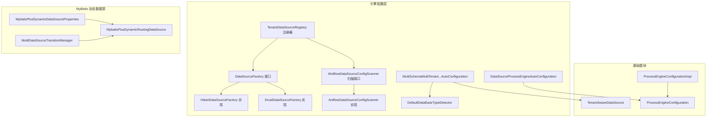
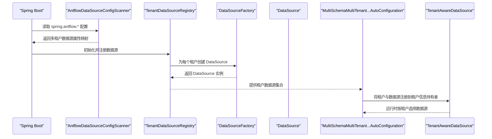
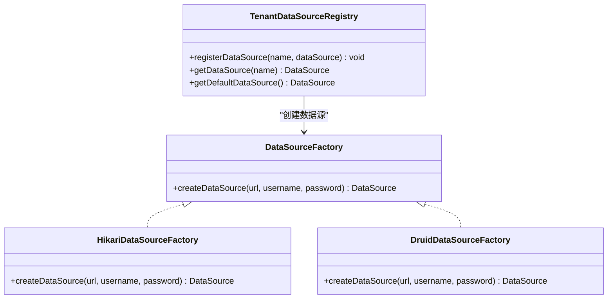
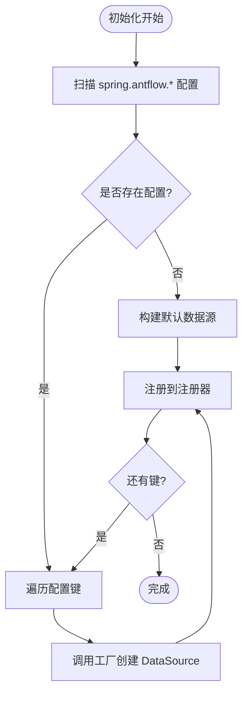
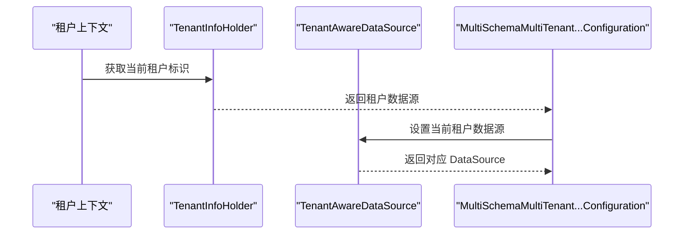
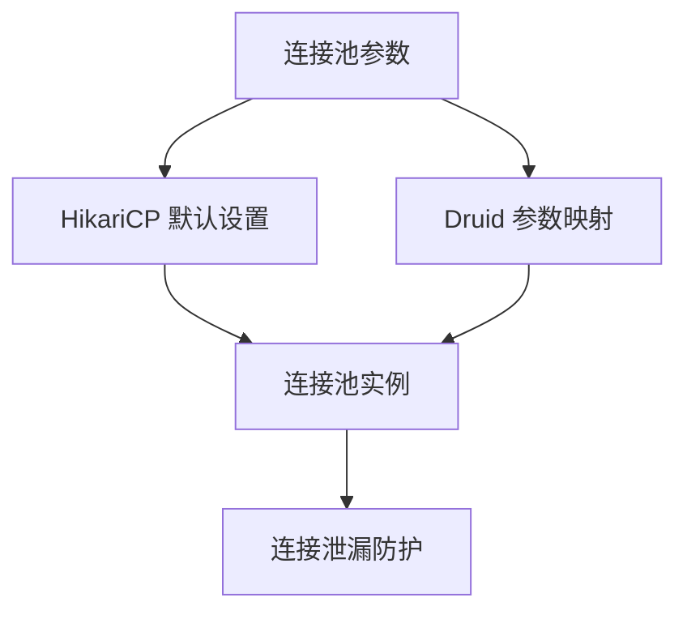
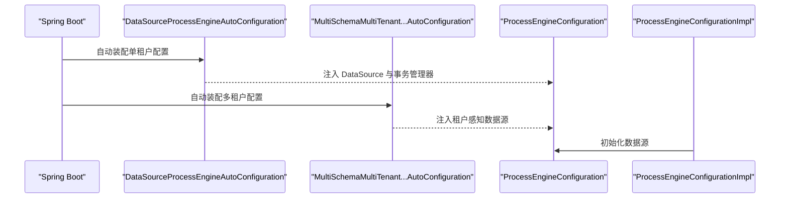
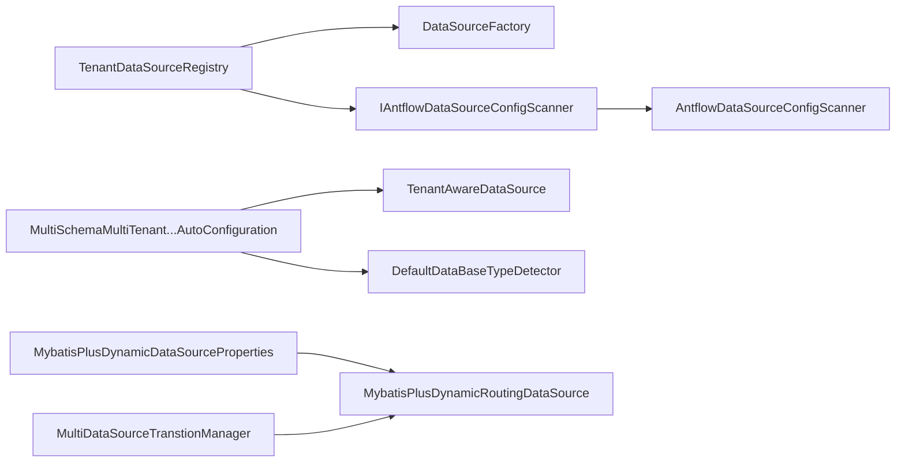

# 数据库配置与连接

<cite>
**本文引用的文件**
- [DataSourceFactory.java](file://antflow-engine/src/main/java/org/openoa/engine/conf/engineconfig/DataSourceFactory.java)
- [HikariDataSourceFactory.java](file://antflow-engine/src/main/java/org/openoa/engine/conf/engineconfig/HikariDataSourceFactory.java)
- [DruidDataSourceFactory.java](file://antflow-engine/src/main/java/org/openoa/engine/conf/engineconfig/DruidDataSourceFactory.java)
- [TenantDataSourceRegistry.java](file://antflow-engine/src/main/java/org/openoa/engine/conf/engineconfig/TenantDataSourceRegistry.java)
- [IAntflowDataSourceConfigScanner.java](file://antflow-engine/src/main/java/org/openoa/engine/conf/engineconfig/IAntflowDataSourceConfigScanner.java)
- [AntflowDataSourceConfigScanner.java](file://antflow-engine/src/main/java/org/openoa/engine/conf/engineconfig/AntflowDataSourceConfigScanner.java)
- [DataSourceProcessEngineAutoConfiguration.java](file://antflow-engine/src/main/java/org/openoa/engine/conf/engineconfig/DataSourceProcessEngineAutoConfiguration.java)
- [MultiSchemaMultiTenantDataSourceProcessEngineAutoConfiguration.java](file://antflow-engine/src/main/java/org/openoa/engine/conf/engineconfig/MultiSchemaMultiTenantDataSourceProcessEngineAutoConfiguration.java)
- [MybatisPlusDynamicDataSourceProperties.java](file://antflow-engine/src/main/java/org/openoa/engine/conf/mybatis/MybatisPlusDynamicDataSourceProperties.java)
- [MybatisPlusDynamicRoutingDataSource.java](file://antflow-engine/src/main/java/org/openoa/engine/conf/mybatis/MybatisPlusDynamicRoutingDataSource.java)
- [DataSourceConfVal.java](file://antflow-engine/src/main/java/org/openoa/engine/conf/confval/DataSourceConfVal.java)
- [BizDataSourceConfVal.java](file://antflow-engine/src/main/java/org/openoa/engine/conf/confval/BizDataSourceConfVal.java)
- [StringConstants.java](file://antflow-base/src/main/java/org/openoa/base/constant/StringConstants.java)
- [TenantAwareDataSource.java](file://antflow-base/src/main/java/org/activiti/engine/impl/cfg/multitenant/TenantAwareDataSource.java)
- [ProcessEngineConfiguration.java](file://antflow-base/src/main/java/org/activiti/engine/ProcessEngineConfiguration.java)
- [ProcessEngineConfigurationImpl.java](file://antflow-base/src/main/java/org/activiti/engine/impl/cfg/ProcessEngineConfigurationImpl.java)
- [MultiDataSourceTranstionManager.java](file://antflow-engine/src/main/java/org/openoa/engine/conf/mybatis/MultiDataSourceTranstionManager.java)
- [MBPDynamicDataSourceDetector.java](file://antflow-engine/src/main/java/org/openoa/engine/conf/engineconfig/MBPDynamicDataSourceDetector.java)
- [DefaultDataBaseTypeDetector.java](file://antflow-engine/src/main/java/org/openoa/engine/conf/engineconfig/DefaultDataBaseTypeDetector.java)
</cite>

## 目录
1. [简介](#简介)
2. [项目结构](#项目结构)
3. [核心组件](#核心组件)
4. [架构总览](#架构总览)
5. [详细组件分析](#详细组件分析)
6. [依赖关系分析](#依赖关系分析)
7. [性能考虑](#性能考虑)
8. [故障排查指南](#故障排查指南)
9. [结论](#结论)
10. [附录](#附录)

## 简介
本文件面向 AntFlow 的数据库配置与连接机制，系统性阐述其多数据库支持、连接池配置、数据源工厂模式、多租户数据源注册与动态切换策略，并提供针对 MySQL、Oracle、PostgreSQL 等主流数据库的适配建议与最佳实践。内容基于仓库中的实际实现文件整理而成，确保可追溯至具体源码位置。

## 项目结构
AntFlow 的数据库相关能力主要集中在 engine 模块的配置与工厂层，以及基础模块对 Activiti 的数据源集成。关键目录与职责如下：
- engine 配置层：负责数据源工厂、扫描器、注册器、自动配置等
- engine mybatis 层：负责动态数据源属性与路由数据源装配
- base 模块：提供多租户数据源适配与 Activiti 数据源集成点
- 配置值对象：封装连接参数与 Druid 参数

**图表来源**
- [DataSourceFactory.java:1-8](file://antflow-engine/src/main/java/org/openoa/engine/conf/engineconfig/DataSourceFactory.java#L1-L8)
- [HikariDataSourceFactory.java:1-27](file://antflow-engine/src/main/java/org/openoa/engine/conf/engineconfig/HikariDataSourceFactory.java#L1-L27)
- [DruidDataSourceFactory.java:1-28](file://antflow-engine/src/main/java/org/openoa/engine/conf/engineconfig/DruidDataSourceFactory.java#L1-L28)
- [TenantDataSourceRegistry.java:1-64](file://antflow-engine/src/main/java/org/openoa/engine/conf/engineconfig/TenantDataSourceRegistry.java#L1-L64)
- [IAntflowDataSourceConfigScanner.java:1-10](file://antflow-engine/src/main/java/org/openoa/engine/conf/engineconfig/IAntflowDataSourceConfigScanner.java#L1-L10)
- [AntflowDataSourceConfigScanner.java:1-31](file://antflow-engine/src/main/java/org/openoa/engine/conf/engineconfig/AntflowDataSourceConfigScanner.java#L1-L31)
- [DataSourceProcessEngineAutoConfiguration.java:1-71](file://antflow-engine/src/main/java/org/openoa/engine/conf/engineconfig/DataSourceProcessEngineAutoConfiguration.java#L1-L71)
- [MultiSchemaMultiTenantDataSourceProcessEngineAutoConfiguration.java:1-113](file://antflow-engine/src/main/java/org/openoa/engine/conf/engineconfig/MultiSchemaMultiTenantDataSourceProcessEngineAutoConfiguration.java#L1-L113)
- [MybatisPlusDynamicDataSourceProperties.java:1-61](file://antflow-engine/src/main/java/org/openoa/engine/conf/mybatis/MybatisPlusDynamicDataSourceProperties.java#L1-L61)
- [MybatisPlusDynamicRoutingDataSource.java:1-29](file://antflow-engine/src/main/java/org/openoa/engine/conf/mybatis/MybatisPlusDynamicRoutingDataSource.java#L1-L29)
- [TenantAwareDataSource.java](file://antflow-base/src/main/java/org/activiti/engine/impl/cfg/multitenant/TenantAwareDataSource.java)
- [ProcessEngineConfiguration.java:126-138](file://antflow-base/src/main/java/org/activiti/engine/ProcessEngineConfiguration.java#L126-L138)
- [ProcessEngineConfigurationImpl.java:719-738](file://antflow-base/src/main/java/org/activiti/engine/impl/cfg/ProcessEngineConfigurationImpl.java#L719-L738)

**章节来源**
- [DataSourceFactory.java:1-8](file://antflow-engine/src/main/java/org/openoa/engine/conf/engineconfig/DataSourceFactory.java#L1-L8)
- [TenantDataSourceRegistry.java:1-64](file://antflow-engine/src/main/java/org/openoa/engine/conf/engineconfig/TenantDataSourceRegistry.java#L1-L64)
- [AntflowDataSourceConfigScanner.java:1-31](file://antflow-engine/src/main/java/org/openoa/engine/conf/engineconfig/AntflowDataSourceConfigScanner.java#L1-L31)

## 核心组件
- 数据源工厂接口与实现
  - DataSourceFactory：统一的数据源创建接口，屏蔽底层连接池差异
  - HikariDataSourceFactory：基于 HikariCP 的默认实现，设置最大池大小与最小空闲数
  - DruidDataSourceFactory：预留基于 Druid 的实现路径（注释状态），通过克隆基础实例并覆盖连接参数
- 多租户数据源注册器
  - TenantDataSourceRegistry：负责从配置扫描器获取多租户数据源配置，调用工厂创建数据源并注册；若无配置则回退到默认数据源
- 配置扫描器
  - IAntflowDataSourceConfigScanner：定义扫描接口
  - AntflowDataSourceConfigScanner：基于 Spring Binder 绑定前缀 spring.antflow 下的多数据源配置
- Activiti 集成与自动配置
  - DataSourceProcessEngineAutoConfiguration：为单租户场景提供事务管理器与 ProcessEngine 配置
  - MultiSchemaMultiTenantDataSourceProcessEngineAutoConfiguration：为多租户场景提供多 Schema 的 ProcessEngine 配置，集成租户感知数据源
- MyBatis 动态数据源
  - MybatisPlusDynamicDataSourceProperties：构建动态数据源属性，支持主从与严格模式
  - MybatisPlusDynamicRoutingDataSource：装配动态路由数据源 Bean
  - MultiDataSourceTranstionManager：多数据源事务管理器
- 基础模块集成点
  - TenantAwareDataSource：Activiti 多租户数据源适配
  - ProcessEngineConfiguration/ProcessEngineConfigurationImpl：Activiti 数据源初始化与 JNDI 查找

**章节来源**
- [DataSourceFactory.java:1-8](file://antflow-engine/src/main/java/org/openoa/engine/conf/engineconfig/DataSourceFactory.java#L1-L8)
- [HikariDataSourceFactory.java:1-27](file://antflow-engine/src/main/java/org/openoa/engine/conf/engineconfig/HikariDataSourceFactory.java#L1-L27)
- [DruidDataSourceFactory.java:1-28](file://antflow-engine/src/main/java/org/openoa/engine/conf/engineconfig/DruidDataSourceFactory.java#L1-L28)
- [TenantDataSourceRegistry.java:1-64](file://antflow-engine/src/main/java/org/openoa/engine/conf/engineconfig/TenantDataSourceRegistry.java#L1-L64)
- [IAntflowDataSourceConfigScanner.java:1-10](file://antflow-engine/src/main/java/org/openoa/engine/conf/engineconfig/IAntflowDataSourceConfigScanner.java#L1-L10)
- [AntflowDataSourceConfigScanner.java:1-31](file://antflow-engine/src/main/java/org/openoa/engine/conf/engineconfig/AntflowDataSourceConfigScanner.java#L1-L31)
- [DataSourceProcessEngineAutoConfiguration.java:1-71](file://antflow-engine/src/main/java/org/openoa/engine/conf/engineconfig/DataSourceProcessEngineAutoConfiguration.java#L1-L71)
- [MultiSchemaMultiTenantDataSourceProcessEngineAutoConfiguration.java:1-113](file://antflow-engine/src/main/java/org/openoa/engine/conf/engineconfig/MultiSchemaMultiTenantDataSourceProcessEngineAutoConfiguration.java#L1-L113)
- [MybatisPlusDynamicDataSourceProperties.java:1-61](file://antflow-engine/src/main/java/org/openoa/engine/conf/mybatis/MybatisPlusDynamicDataSourceProperties.java#L1-L61)
- [MybatisPlusDynamicRoutingDataSource.java:1-29](file://antflow-engine/src/main/java/org/openoa/engine/conf/mybatis/MybatisPlusDynamicRoutingDataSource.java#L1-L29)
- [MultiDataSourceTranstionManager.java](file://antflow-engine/src/main/java/org/openoa/engine/conf/mybatis/MultiDataSourceTranstionManager.java)
- [TenantAwareDataSource.java](file://antflow-base/src/main/java/org/activiti/engine/impl/cfg/multitenant/TenantAwareDataSource.java)
- [ProcessEngineConfiguration.java:126-138](file://antflow-base/src/main/java/org/activiti/engine/ProcessEngineConfiguration.java#L126-L138)
- [ProcessEngineConfigurationImpl.java:719-738](file://antflow-base/src/main/java/org/activiti/engine/impl/cfg/ProcessEngineConfigurationImpl.java#L719-L738)

## 架构总览
下图展示 AntFlow 在多租户场景下的数据源装配与运行时选择流程：

**图表来源**
- [AntflowDataSourceConfigScanner.java:20-29](file://antflow-engine/src/main/java/org/openoa/engine/conf/engineconfig/AntflowDataSourceConfigScanner.java#L20-L29)
- [TenantDataSourceRegistry.java:40-63](file://antflow-engine/src/main/java/org/openoa/engine/conf/engineconfig/TenantDataSourceRegistry.java#L40-L63)
- [DataSourceFactory.java:5-7](file://antflow-engine/src/main/java/org/openoa/engine/conf/engineconfig/DataSourceFactory.java#L5-L7)
- [MultiSchemaMultiTenantDataSourceProcessEngineAutoConfiguration.java:40-88](file://antflow-engine/src/main/java/org/openoa/engine/conf/engineconfig/MultiSchemaMultiTenantDataSourceProcessEngineAutoConfiguration.java#L40-L88)
- [TenantAwareDataSource.java](file://antflow-base/src/main/java/org/activiti/engine/impl/cfg/multitenant/TenantAwareDataSource.java)

## 详细组件分析

### 数据源工厂模式
- 设计要点
  - 通过 DataSourceFactory 抽象出数据源创建过程，便于替换不同连接池实现
  - 默认实现采用 HikariCP，具备较小的启动开销与较好的并发性能
  - Druid 实现以注释形式保留，便于后续启用
- 关键行为
  - HikariDataSourceFactory 设置最大池大小与最小空闲，满足一般业务并发需求
  - TenantDataSourceRegistry 通过工厂批量创建并注册多租户数据源

**图表来源**
- [DataSourceFactory.java:5-7](file://antflow-engine/src/main/java/org/openoa/engine/conf/engineconfig/DataSourceFactory.java#L5-L7)
- [HikariDataSourceFactory.java:14-26](file://antflow-engine/src/main/java/org/openoa/engine/conf/engineconfig/HikariDataSourceFactory.java#L14-L26)
- [DruidDataSourceFactory.java:14-26](file://antflow-engine/src/main/java/org/openoa/engine/conf/engineconfig/DruidDataSourceFactory.java#L14-L26)
- [TenantDataSourceRegistry.java:22-38](file://antflow-engine/src/main/java/org/openoa/engine/conf/engineconfig/TenantDataSourceRegistry.java#L22-L38)

**章节来源**
- [HikariDataSourceFactory.java:1-27](file://antflow-engine/src/main/java/org/openoa/engine/conf/engineconfig/HikariDataSourceFactory.java#L1-L27)
- [DruidDataSourceFactory.java:1-28](file://antflow-engine/src/main/java/org/openoa/engine/conf/engineconfig/DruidDataSourceFactory.java#L1-L28)
- [TenantDataSourceRegistry.java:1-64](file://antflow-engine/src/main/java/org/openoa/engine/conf/engineconfig/TenantDataSourceRegistry.java#L1-L64)

### 多租户数据源注册机制
- 配置扫描
  - AntflowDataSourceConfigScanner 使用 Binder 从 Environment 中绑定前缀 spring.antflow 的数据源配置，返回 Map<String, DataSourceProperties>
- 注册流程
  - TenantDataSourceRegistry 在初始化阶段遍历配置，调用 DataSourceFactory 创建 DataSource 并注册
  - 若无配置，则回退到默认数据源（来自 DataSourceProperties.initializeDataSourceBuilder().build()）
  - 支持默认数据源名为空字符串或 "default" 的回退逻辑

**图表来源**
- [AntflowDataSourceConfigScanner.java:20-29](file://antflow-engine/src/main/java/org/openoa/engine/conf/engineconfig/AntflowDataSourceConfigScanner.java#L20-L29)
- [TenantDataSourceRegistry.java:40-63](file://antflow-engine/src/main/java/org/openoa/engine/conf/engineconfig/TenantDataSourceRegistry.java#L40-L63)

**章节来源**
- [IAntflowDataSourceConfigScanner.java:1-10](file://antflow-engine/src/main/java/org/openoa/engine/conf/engineconfig/IAntflowDataSourceConfigScanner.java#L1-L10)
- [AntflowDataSourceConfigScanner.java:1-31](file://antflow-engine/src/main/java/org/openoa/engine/conf/engineconfig/AntflowDataSourceConfigScanner.java#L1-L31)
- [TenantDataSourceRegistry.java:1-64](file://antflow-engine/src/main/java/org/openoa/engine/conf/engineconfig/TenantDataSourceRegistry.java#L1-L64)

### 动态数据源切换策略
- 租户维度切换
  - MultiSchemaMultiTenantDataSourceProcessEngineAutoConfiguration 将租户信息持有者提供的数据源注册到 MultiSchemaMultiTenantProcessEngineConfiguration
  - TenantAwareDataSource 在运行时根据当前租户选择对应数据源
- MyBatis 动态数据源
  - MybatisPlusDynamicDataSourceProperties 定义主从数据源与严格模式
  - MybatisPlusDynamicRoutingDataSource 装配 DynamicRoutingDataSource，结合策略进行数据源路由
- 类型检测
  - DefaultDataBaseTypeDetector 用于识别默认数据源类型，辅助配置数据库方言与特性

**图表来源**
- [MultiSchemaMultiTenantDataSourceProcessEngineAutoConfiguration.java:40-88](file://antflow-engine/src/main/java/org/openoa/engine/conf/engineconfig/MultiSchemaMultiTenantDataSourceProcessEngineAutoConfiguration.java#L40-L88)
- [TenantAwareDataSource.java](file://antflow-base/src/main/java/org/activiti/engine/impl/cfg/multitenant/TenantAwareDataSource.java)
- [DefaultDataBaseTypeDetector.java](file://antflow-engine/src/main/java/org/openoa/engine/conf/engineconfig/DefaultDataBaseTypeDetector.java)

**章节来源**
- [MultiSchemaMultiTenantDataSourceProcessEngineAutoConfiguration.java:1-113](file://antflow-engine/src/main/java/org/openoa/engine/conf/engineconfig/MultiSchemaMultiTenantDataSourceProcessEngineAutoConfiguration.java#L1-L113)
- [TenantAwareDataSource.java](file://antflow-base/src/main/java/org/activiti/engine/impl/cfg/multitenant/TenantAwareDataSource.java)
- [MybatisPlusDynamicDataSourceProperties.java:1-61](file://antflow-engine/src/main/java/org/openoa/engine/conf/mybatis/MybatisPlusDynamicDataSourceProperties.java#L1-L61)
- [MybatisPlusDynamicRoutingDataSource.java:1-29](file://antflow-engine/src/main/java/org/openoa/engine/conf/mybatis/MybatisPlusDynamicRoutingDataSource.java#L1-L29)
- [DefaultDataBaseTypeDetector.java](file://antflow-engine/src/main/java/org/openoa/engine/conf/engineconfig/DefaultDataBaseTypeDetector.java)

### 连接池配置与参数优化
- HikariCP 默认配置
  - 最大池大小与最小空闲数在 HikariDataSourceFactory 中设定，适用于一般业务并发
- Druid 参数（预留）
  - DataSourceConfVal 定义了初始连接数、最小空闲、最大活跃、最大等待、驱逐检测间隔、空闲最小生存时间、移除长时间未使用连接等参数
  - BizDataSourceConfVal 提供业务库参数扩展
  - MybatisPlusDynamicDataSourceProperties 可将这些参数映射到 DynamicDataSourceProperties 的 DruidConfig
- 连接泄漏防护
  - 通过移除长时间未使用连接相关参数与超时配置，降低连接泄漏风险
  - 建议结合连接池监控与慢查询日志进行持续观测

**图表来源**
- [HikariDataSourceFactory.java:17-24](file://antflow-engine/src/main/java/org/openoa/engine/conf/engineconfig/HikariDataSourceFactory.java#L17-L24)
- [DataSourceConfVal.java:22-49](file://antflow-engine/src/main/java/org/openoa/engine/conf/confval/DataSourceConfVal.java#L22-L49)
- [BizDataSourceConfVal.java:13-20](file://antflow-engine/src/main/java/org/openoa/engine/conf/confval/BizDataSourceConfVal.java#L13-L20)
- [MybatisPlusDynamicDataSourceProperties.java:40-57](file://antflow-engine/src/main/java/org/openoa/engine/conf/mybatis/MybatisPlusDynamicDataSourceProperties.java#L40-L57)

**章节来源**
- [HikariDataSourceFactory.java:1-27](file://antflow-engine/src/main/java/org/openoa/engine/conf/engineconfig/HikariDataSourceFactory.java#L1-L27)
- [DataSourceConfVal.java:1-51](file://antflow-engine/src/main/java/org/openoa/engine/conf/confval/DataSourceConfVal.java#L1-L51)
- [BizDataSourceConfVal.java:1-24](file://antflow-engine/src/main/java/org/openoa/engine/conf/confval/BizDataSourceConfVal.java#L1-L24)
- [MybatisPlusDynamicDataSourceProperties.java:1-61](file://antflow-engine/src/main/java/org/openoa/engine/conf/mybatis/MybatisPlusDynamicDataSourceProperties.java#L1-L61)

### Activiti 数据源集成
- 单租户集成
  - DataSourceProcessEngineAutoConfiguration 提供事务管理器与 ProcessEngine 配置，直接使用 Spring Boot 自动装配的数据源
- 多租户集成
  - MultiSchemaMultiTenantDataSourceProcessEngineAutoConfiguration 将租户感知数据源注入到 MultiSchemaMultiTenantProcessEngineConfiguration，并设置外部事务管理
- 基础模块支持
  - ProcessEngineConfiguration/ProcessEngineConfigurationImpl 支持 JNDI 查找数据源，便于在容器环境中部署

**图表来源**
- [DataSourceProcessEngineAutoConfiguration.java:46-68](file://antflow-engine/src/main/java/org/openoa/engine/conf/engineconfig/DataSourceProcessEngineAutoConfiguration.java#L46-L68)
- [MultiSchemaMultiTenantDataSourceProcessEngineAutoConfiguration.java:40-88](file://antflow-engine/src/main/java/org/openoa/engine/conf/engineconfig/MultiSchemaMultiTenantDataSourceProcessEngineAutoConfiguration.java#L40-L88)
- [ProcessEngineConfiguration.java:407-412](file://antflow-base/src/main/java/org/activiti/engine/ProcessEngineConfiguration.java#L407-L412)
- [ProcessEngineConfigurationImpl.java:719-738](file://antflow-base/src/main/java/org/activiti/engine/impl/cfg/ProcessEngineConfigurationImpl.java#L719-L738)

**章节来源**
- [DataSourceProcessEngineAutoConfiguration.java:1-71](file://antflow-engine/src/main/java/org/openoa/engine/conf/engineconfig/DataSourceProcessEngineAutoConfiguration.java#L1-L71)
- [MultiSchemaMultiTenantDataSourceProcessEngineAutoConfiguration.java:1-113](file://antflow-engine/src/main/java/org/openoa/engine/conf/engineconfig/MultiSchemaMultiTenantDataSourceProcessEngineAutoConfiguration.java#L1-L113)
- [ProcessEngineConfiguration.java:126-138](file://antflow-base/src/main/java/org/activiti/engine/ProcessEngineConfiguration.java#L126-L138)
- [ProcessEngineConfigurationImpl.java:719-738](file://antflow-base/src/main/java/org/activiti/engine/impl/cfg/ProcessEngineConfigurationImpl.java#L719-L738)

## 依赖关系分析
- 组件耦合
  - TenantDataSourceRegistry 对 DataSourceFactory 与 IAntflowDataSourceConfigScanner 具有直接依赖，体现良好的可替换性
  - MultiSchemaMultiTenantDataSourceProcessEngineAutoConfiguration 依赖租户信息持有者与租户感知数据源，实现多租户隔离
- 外部依赖
  - HikariCP 作为默认连接池
  - MyBatis Dynamic Datasource 用于动态数据源路由
  - Activiti 多租户配置用于流程引擎的数据源管理

**图表来源**
- [TenantDataSourceRegistry.java:14-21](file://antflow-engine/src/main/java/org/openoa/engine/conf/engineconfig/TenantDataSourceRegistry.java#L14-L21)
- [IAntflowDataSourceConfigScanner.java:3-8](file://antflow-engine/src/main/java/org/openoa/engine/conf/engineconfig/IAntflowDataSourceConfigScanner.java#L3-L8)
- [AntflowDataSourceConfigScanner.java:15-29](file://antflow-engine/src/main/java/org/openoa/engine/conf/engineconfig/AntflowDataSourceConfigScanner.java#L15-L29)
- [MultiSchemaMultiTenantDataSourceProcessEngineAutoConfiguration.java:40-88](file://antflow-engine/src/main/java/org/openoa/engine/conf/engineconfig/MultiSchemaMultiTenantDataSourceProcessEngineAutoConfiguration.java#L40-L88)
- [MybatisPlusDynamicDataSourceProperties.java:28-39](file://antflow-engine/src/main/java/org/openoa/engine/conf/mybatis/MybatisPlusDynamicDataSourceProperties.java#L28-L39)
- [MybatisPlusDynamicRoutingDataSource.java:16-27](file://antflow-engine/src/main/java/org/openoa/engine/conf/mybatis/MybatisPlusDynamicRoutingDataSource.java#L16-L27)
- [MultiDataSourceTranstionManager.java](file://antflow-engine/src/main/java/org/openoa/engine/conf/mybatis/MultiDataSourceTranstionManager.java)

**章节来源**
- [TenantDataSourceRegistry.java:1-64](file://antflow-engine/src/main/java/org/openoa/engine/conf/engineconfig/TenantDataSourceRegistry.java#L1-L64)
- [MultiSchemaMultiTenantDataSourceProcessEngineAutoConfiguration.java:1-113](file://antflow-engine/src/main/java/org/openoa/engine/conf/engineconfig/MultiSchemaMultiTenantDataSourceProcessEngineAutoConfiguration.java#L1-L113)
- [MybatisPlusDynamicDataSourceProperties.java:1-61](file://antflow-engine/src/main/java/org/openoa/engine/conf/mybatis/MybatisPlusDynamicDataSourceProperties.java#L1-L61)
- [MybatisPlusDynamicRoutingDataSource.java:1-29](file://antflow-engine/src/main/java/org/openoa/engine/conf/mybatis/MybatisPlusDynamicRoutingDataSource.java#L1-L29)

## 性能考虑
- 连接池选择
  - 默认采用 HikariCP，具备较低延迟与较好吞吐表现；如需更丰富的监控与统计，可启用 Druid 并参考 DataSourceConfVal 中的参数进行精细化调优
- 并发与资源
  - 合理设置最大池大小与最小空闲，避免过度占用内存或频繁创建销毁连接
  - 结合业务峰值与慢查询情况，定期评估连接池参数
- 连接泄漏防护
  - 启用移除长时间未使用连接与超时配置，配合连接池监控工具进行告警与根因分析
- 多租户隔离
  - 为不同租户配置独立数据源，避免跨租户竞争导致的性能抖动

## 故障排查指南
- 数据源无法创建
  - 检查 spring.antflow.* 配置是否正确绑定，确认用户名、密码、URL 是否有效
  - 若无配置，确认默认数据源回退逻辑是否生效
- 租户切换异常
  - 核查租户信息持有者是否正确注册各租户数据源
  - 确认 TenantAwareDataSource 在运行时能根据当前租户返回正确的数据源
- 连接池问题
  - 观察连接池指标（活跃连接数、等待时间、拒绝次数），结合参数调整
  - 如启用 Druid，检查慢查询日志与 SQL 监控
- Activiti 集成问题
  - 确认 ProcessEngine 配置已注入正确的数据源与事务管理器
  - 若使用 JNDI，请检查 JNDI 名称与容器配置

**章节来源**
- [AntflowDataSourceConfigScanner.java:20-29](file://antflow-engine/src/main/java/org/openoa/engine/conf/engineconfig/AntflowDataSourceConfigScanner.java#L20-L29)
- [TenantDataSourceRegistry.java:40-63](file://antflow-engine/src/main/java/org/openoa/engine/conf/engineconfig/TenantDataSourceRegistry.java#L40-L63)
- [MultiSchemaMultiTenantDataSourceProcessEngineAutoConfiguration.java:40-88](file://antflow-engine/src/main/java/org/openoa/engine/conf/engineconfig/MultiSchemaMultiTenantDataSourceProcessEngineAutoConfiguration.java#L40-L88)
- [ProcessEngineConfigurationImpl.java:719-738](file://antflow-base/src/main/java/org/activiti/engine/impl/cfg/ProcessEngineConfigurationImpl.java#L719-L738)

## 结论
AntFlow 的数据库配置与连接体系通过工厂模式抽象连接池差异、通过扫描器与注册器实现多租户数据源的集中管理，并在 Activiti 与 MyBatis 层面提供了完善的集成与动态切换能力。默认采用 HikariCP，具备良好的性能与稳定性；同时预留 Druid 的参数配置路径，便于进一步优化与监控。结合合理的参数调优与监控告警，可满足多租户场景下的高性能与高可用要求。

## 附录
- 配置示例与最佳实践（基于现有实现的适配建议）
  - MySQL
    - 使用 HikariCP 时，设置最大池大小与最小空闲以匹配业务并发
    - 如启用 Druid，参考 DataSourceConfVal 中的参数进行精细化配置
  - Oracle
    - 确保驱动类名与 URL 正确，结合连接池参数控制连接生命周期
    - 建议开启连接泄漏防护参数，配合慢查询日志定位热点 SQL
  - PostgreSQL
    - 与 Oracle 类似，注意驱动与 URL 配置
    - 结合连接池监控观察连接争用与等待情况
- 开发与运维建议
  - 建议为不同租户配置独立数据源，避免共享带来的性能影响
  - 定期评估连接池参数，结合业务增长趋势进行容量规划
  - 启用连接池监控与慢查询日志，建立告警机制