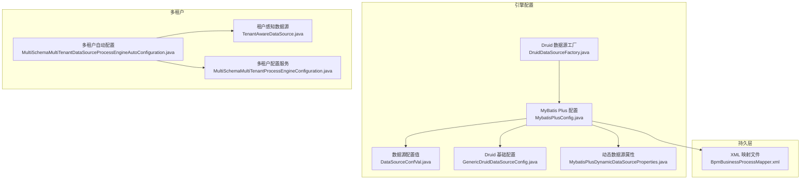
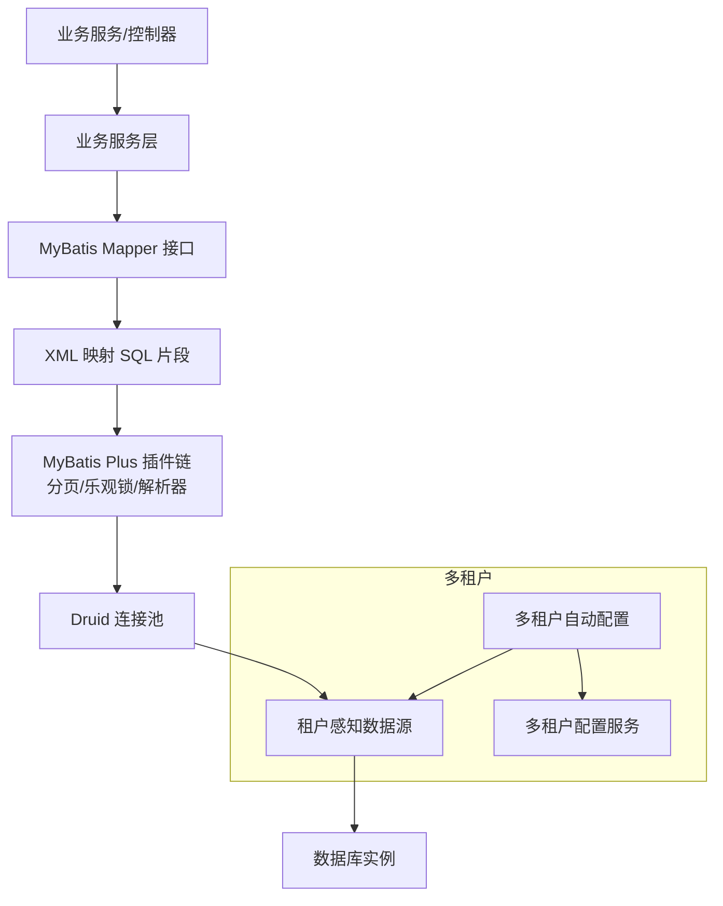
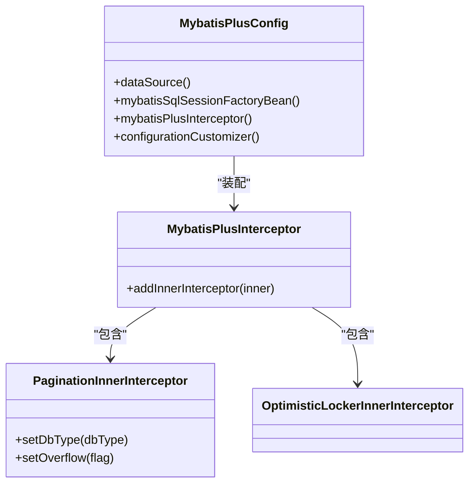
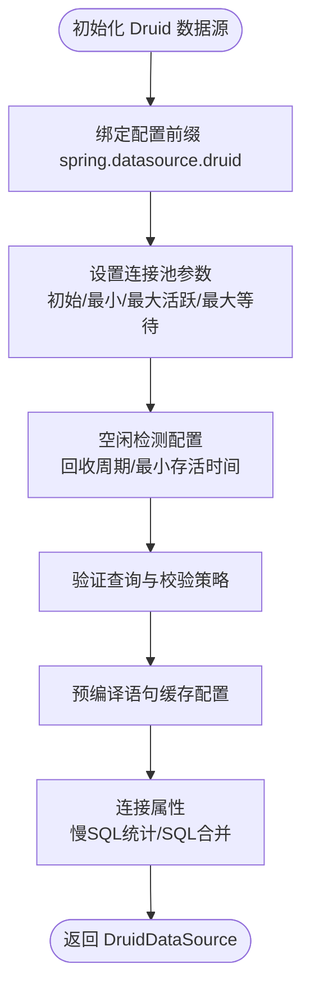
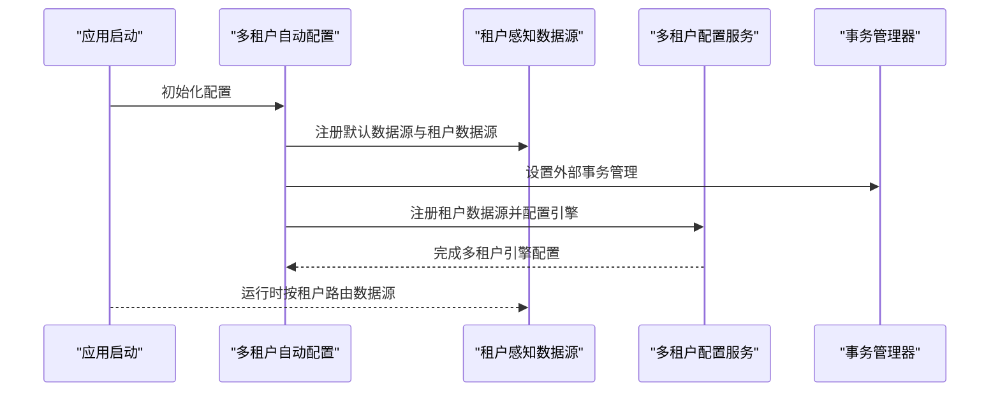
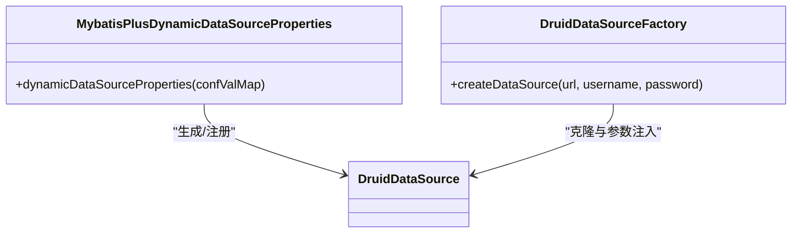
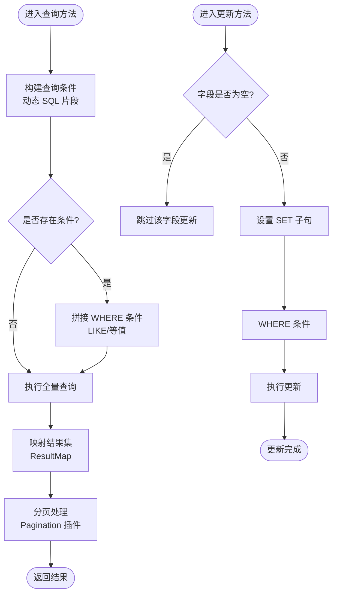
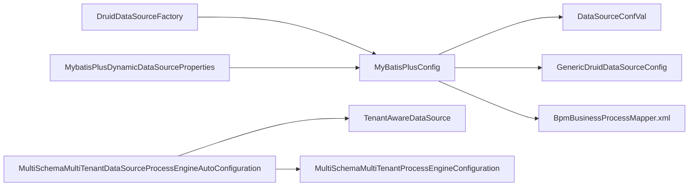

# 数据访问层设计

<cite>
**本文引用的文件**
- [MybatisPlusConfig.java](file://antflow-engine/src/main/java/org/antflow/engine/conf/mybatis/MybatisPlusConfig.java)
- [MultiSchemaMultiTenantDataSourceProcessEngineAutoConfiguration.java](file://antflow-engine/src/main/java/org/antflow/engine/conf/engineconfig/MultiSchemaMultiTenantDataSourceProcessEngineAutoConfiguration.java)
- [TenantAwareDataSource.java](file://antflow-base/src/main/java/org/activiti/engine/impl/cfg/multitenant/TenantAwareDataSource.java)
- [MultiSchemaMultiTenantProcessEngineConfiguration.java](file://antflow-base/src/main/java/org/activiti/engine/impl/cfg/multitenant/MultiSchemaMultiTenantProcessEngineConfiguration.java)
- [BpmBusinessProcessMapper.xml](file://antflow-engine/src/main/resources/mapper/BpmBusinessProcessMapper.xml)
- [DataSourceConfVal.java](file://antflow-engine/src/main/java/org/antflow/engine/conf/confval/DataSourceConfVal.java)
- [GenericDruidDataSourceConfig.java](file://antflow-engine/src/main/java/org/antflow/engine/conf/engineconfig/GenericDruidDataSourceConfig.java)
- [DruidDataSourceFactory.java](file://antflow-engine/src/main/java/org/antflow/engine/conf/engineconfig/DruidDataSourceFactory.java)
- [MybatisPlusDynamicDataSourceProperties.java](file://antflow-engine/src/main/java/org/antflow/engine/conf/mybatis/MybatisPlusDynamicDataSourceProperties.java)
</cite>

## 目录
1. [简介](#简介)
2. [项目结构](#项目结构)
3. [核心组件](#核心组件)
4. [架构总览](#架构总览)
5. [详细组件分析](#详细组件分析)
6. [依赖关系分析](#依赖关系分析)
7. [性能考量](#性能考量)
8. [故障排查指南](#故障排查指南)
9. [结论](#结论)
10. [附录](#附录)

## 简介
本设计文档聚焦 AntFlow 的数据访问层，系统性阐述 MyBatis Plus 在项目中的应用方式、实体模型设计与数据访问模式，详解数据库连接配置、Druid 连接池参数、MyBatis 配置参数，以及多租户数据源支持与动态数据源切换机制。同时提供最佳实践、性能优化策略与安全注意事项，并通过图示与路径引用展示关键实现。

## 项目结构
数据访问层主要分布在以下模块与包中：
- 配置与自动装配：engine 模块下的 conf 包，包含 MyBatis Plus 与 Druid 的配置类、多租户数据源自动装配等。
- 实体与映射：base 模块的 entity 包存放业务实体，engine 模块的 resources/mapper 下存放 XML 映射文件。
- 流程引擎集成：base 模块的 Activiti 多租户数据源实现，与 engine 模块的自动配置共同完成多租户数据源注册与切换。

图表来源
- [MybatisPlusConfig.java:1-141](file://antflow-engine/src/main/java/org/antflow/engine/conf/mybatis/MybatisPlusConfig.java#L1-L141)
- [DataSourceConfVal.java:1-50](file://antflow-engine/src/main/java/org/antflow/engine/conf/confval/DataSourceConfVal.java#L1-L50)
- [GenericDruidDataSourceConfig.java:1-17](file://antflow-engine/src/main/java/org/antflow/engine/conf/engineconfig/GenericDruidDataSourceConfig.java#L1-L17)
- [DruidDataSourceFactory.java:1-27](file://antflow-engine/src/main/java/org/antflow/engine/conf/engineconfig/DruidDataSourceFactory.java#L1-L27)
- [MybatisPlusDynamicDataSourceProperties.java:1-33](file://antflow-engine/src/main/java/org/antflow/engine/conf/mybatis/MybatisPlusDynamicDataSourceProperties.java#L1-L33)
- [MultiSchemaMultiTenantDataSourceProcessEngineAutoConfiguration.java:1-113](file://antflow-engine/src/main/java/org/antflow/engine/conf/engineconfig/MultiSchemaMultiTenantDataSourceProcessEngineAutoConfiguration.java#L1-L113)
- [TenantAwareDataSource.java:1-36](file://antflow-base/src/main/java/org/activiti/engine/impl/cfg/multitenant/TenantAwareDataSource.java#L1-L36)
- [MultiSchemaMultiTenantProcessEngineConfiguration.java:76-114](file://antflow-base/src/main/java/org/activiti/engine/impl/cfg/multitenant/MultiSchemaMultiTenantProcessEngineConfiguration.java#L76-L114)
- [BpmBusinessProcessMapper.xml:1-67](file://antflow-engine/src/main/resources/mapper/BpmBusinessProcessMapper.xml#L1-L67)

章节来源
- [MybatisPlusConfig.java:1-141](file://antflow-engine/src/main/java/org/antflow/engine/conf/mybatis/MybatisPlusConfig.java#L1-L141)
- [MultiSchemaMultiTenantDataSourceProcessEngineAutoConfiguration.java:1-113](file://antflow-engine/src/main/java/org/antflow/engine/conf/engineconfig/MultiSchemaMultiTenantDataSourceProcessEngineAutoConfiguration.java#L1-L113)

## 核心组件
- MyBatis Plus 配置：负责拦截器、分页插件、乐观锁插件、SQL 解析器等的装配，以及 SqlSessionFactory 的构建与 Mapper 扫描路径。
- Druid 连接池配置：提供基础 Druid 数据源 Bean 与参数绑定，支持初始大小、最大活跃数、最大等待时间、空闲检测等参数。
- 多租户数据源：通过租户感知数据源在运行时根据当前租户选择对应数据源，结合流程引擎配置完成租户隔离与动态注册。
- 实体与映射：以 XML 映射为主，定义结果映射、公共列集与条件查询片段，支撑复杂查询与更新场景。

章节来源
- [MybatisPlusConfig.java:66-100](file://antflow-engine/src/main/java/org/antflow/engine/conf/mybatis/MybatisPlusConfig.java#L66-L100)
- [GenericDruidDataSourceConfig.java:10-17](file://antflow-engine/src/main/java/org/antflow/engine/conf/engineconfig/GenericDruidDataSourceConfig.java#L10-L17)
- [MultiSchemaMultiTenantDataSourceProcessEngineAutoConfiguration.java:40-88](file://antflow-engine/src/main/java/org/antflow/engine/conf/engineconfig/MultiSchemaMultiTenantDataSourceProcessEngineAutoConfiguration.java#L40-L88)
- [BpmBusinessProcessMapper.xml:5-26](file://antflow-engine/src/main/resources/mapper/BpmBusinessProcessMapper.xml#L5-L26)

## 架构总览
下图展示了数据访问层的整体架构：MyBatis Plus 作为 ORM 框架，Druid 作为连接池，多租户数据源在运行时按租户切换，流程引擎通过外部事务管理器与租户数据源协同工作。

图表来源
- [MybatisPlusConfig.java:86-95](file://antflow-engine/src/main/java/org/antflow/engine/conf/mybatis/MybatisPlusConfig.java#L86-L95)
- [GenericDruidDataSourceConfig.java:12-16](file://antflow-engine/src/main/java/org/antflow/engine/conf/engineconfig/GenericDruidDataSourceConfig.java#L12-L16)
- [TenantAwareDataSource.java:28-36](file://antflow-base/src/main/java/org/activiti/engine/impl/cfg/multitenant/TenantAwareDataSource.java#L28-L36)
- [MultiSchemaMultiTenantProcessEngineConfiguration.java:82-102](file://antflow-base/src/main/java/org/activiti/engine/impl/cfg/multitenant/MultiSchemaMultiTenantProcessEngineConfiguration.java#L82-L102)

## 详细组件分析

### MyBatis Plus 配置与插件
- 分页与乐观锁：配置分页内核与乐观锁内核，适配 MySQL 数据库类型，溢出分页策略可按需开启。
- 插件链：拦截器链路包含分页与乐观锁，用于统一处理分页查询与并发写入保护。
- SqlSessionFactory：设置 VFS、Mapper XML 路径与插件集合，确保映射文件被正确加载。
- 配置定制：可通过 ConfigurationCustomizer 关闭短键生成等特性，满足特定兼容需求。

图表来源
- [MybatisPlusConfig.java:86-100](file://antflow-engine/src/main/java/org/antflow/engine/conf/mybatis/MybatisPlusConfig.java#L86-L100)

章节来源
- [MybatisPlusConfig.java:86-100](file://antflow-engine/src/main/java/org/antflow/engine/conf/mybatis/MybatisPlusConfig.java#L86-L100)

### Druid 连接池配置
- 基础 Bean：从配置前缀 spring.datasource.druid 绑定参数，创建 DruidDataSource 实例。
- 参数覆盖：初始大小、最小空闲、最大活跃、最大等待、空闲回收周期、空闲最小存活时间、验证查询、借用/归还校验、预编译语句缓存等。
- 连接属性：慢 SQL 记录与 SQL 合并统计开关，便于性能诊断与 SQL 规范化。

图表来源
- [GenericDruidDataSourceConfig.java:12-16](file://antflow-engine/src/main/java/org/antflow/engine/conf/engineconfig/GenericDruidDataSourceConfig.java#L12-L16)
- [MybatisPlusConfig.java:117-136](file://antflow-engine/src/main/java/org/antflow/engine/conf/mybatis/MybatisPlusConfig.java#L117-L136)

章节来源
- [GenericDruidDataSourceConfig.java:10-17](file://antflow-engine/src/main/java/org/antflow/engine/conf/engineconfig/GenericDruidDataSourceConfig.java#L10-L17)
- [MybatisPlusConfig.java:110-139](file://antflow-engine/src/main/java/org/antflow/engine/conf/mybatis/MybatisPlusConfig.java#L110-L139)

### 多租户数据源支持与动态切换
- 租户感知数据源：根据当前租户信息路由到对应数据源，实现多租户隔离。
- 自动配置：在流程引擎启动时注册默认数据源与各租户数据源，启用外部事务管理，避免重复建模。
- 动态注册：支持运行时为新租户注册数据源并创建对应模式或异步执行器。

图表来源
- [MultiSchemaMultiTenantDataSourceProcessEngineAutoConfiguration.java:40-88](file://antflow-engine/src/main/java/org/antflow/engine/conf/engineconfig/MultiSchemaMultiTenantDataSourceProcessEngineAutoConfiguration.java#L40-L88)
- [TenantAwareDataSource.java:28-36](file://antflow-base/src/main/java/org/activiti/engine/impl/cfg/multitenant/TenantAwareDataSource.java#L28-L36)
- [MultiSchemaMultiTenantProcessEngineConfiguration.java:82-102](file://antflow-base/src/main/java/org/activiti/engine/impl/cfg/multitenant/MultiSchemaMultiTenantProcessEngineConfiguration.java#L82-L102)

章节来源
- [MultiSchemaMultiTenantDataSourceProcessEngineAutoConfiguration.java:29-88](file://antflow-engine/src/main/java/org/antflow/engine/conf/engineconfig/MultiSchemaMultiTenantDataSourceProcessEngineAutoConfiguration.java#L29-L88)
- [TenantAwareDataSource.java:28-36](file://antflow-base/src/main/java/org/activiti/engine/impl/cfg/multitenant/TenantAwareDataSource.java#L28-L36)
- [MultiSchemaMultiTenantProcessEngineConfiguration.java:76-114](file://antflow-base/src/main/java/org/activiti/engine/impl/cfg/multitenant/MultiSchemaMultiTenantProcessEngineConfiguration.java#L76-L114)

### 动态数据源属性与工厂
- 动态数据源属性：通过配置类聚合多个数据源配置，支持基于租户或业务维度的动态切换。
- 数据源工厂：基于基础 Druid 数据源克隆并注入目标租户的连接参数，保证连接池参数一致性与可扩展性。

图表来源
- [MybatisPlusDynamicDataSourceProperties.java:27-33](file://antflow-engine/src/main/java/org/antflow/engine/conf/mybatis/MybatisPlusDynamicDataSourceProperties.java#L27-L33)
- [DruidDataSourceFactory.java:14-27](file://antflow-engine/src/main/java/org/antflow/engine/conf/engineconfig/DruidDataSourceFactory.java#L14-L27)

章节来源
- [MybatisPlusDynamicDataSourceProperties.java:1-33](file://antflow-engine/src/main/java/org/antflow/engine/conf/mybatis/MybatisPlusDynamicDataSourceProperties.java#L1-L33)
- [DruidDataSourceFactory.java:14-27](file://antflow-engine/src/main/java/org/antflow/engine/conf/engineconfig/DruidDataSourceFactory.java#L14-L27)

### 实体模型与数据访问模式
- 结果映射：在 XML 中定义实体字段与数据库列的映射关系，支持复用与扩展。
- 公共列集：抽取常用列集合，减少重复书写，提升维护性。
- 条件查询：通过动态 SQL 片段拼接查询条件，支持模糊匹配与精确过滤。
- 更新与删除：针对不同字段进行条件更新，删除操作按业务键进行清理。

图表来源
- [BpmBusinessProcessMapper.xml:23-50](file://antflow-engine/src/main/resources/mapper/BpmBusinessProcessMapper.xml#L23-L50)
- [BpmBusinessProcessMapper.xml:51-65](file://antflow-engine/src/main/resources/mapper/BpmBusinessProcessMapper.xml#L51-L65)

章节来源
- [BpmBusinessProcessMapper.xml:5-26](file://antflow-engine/src/main/resources/mapper/BpmBusinessProcessMapper.xml#L5-L26)
- [BpmBusinessProcessMapper.xml:28-65](file://antflow-engine/src/main/resources/mapper/BpmBusinessProcessMapper.xml#L28-L65)

## 依赖关系分析
- 组件耦合：MyBatis Plus 配置依赖 Druid 数据源与配置值对象；多租户自动配置依赖租户感知数据源与流程引擎配置。
- 外部依赖：Druid 连接池、MyBatis Plus 插件链、Activiti 多租户实现。
- 可能的循环依赖：当前配置采用条件装配与外部事务管理，避免直接循环依赖；动态数据源注册通过租户信息持有者间接完成。

图表来源
- [MybatisPlusConfig.java:66-100](file://antflow-engine/src/main/java/org/antflow/engine/conf/mybatis/MybatisPlusConfig.java#L66-L100)
- [DataSourceConfVal.java:9-50](file://antflow-engine/src/main/java/org/antflow/engine/conf/confval/DataSourceConfVal.java#L9-L50)
- [GenericDruidDataSourceConfig.java:12-16](file://antflow-engine/src/main/java/org/antflow/engine/conf/engineconfig/GenericDruidDataSourceConfig.java#L12-L16)
- [DruidDataSourceFactory.java:16-26](file://antflow-engine/src/main/java/org/antflow/engine/conf/engineconfig/DruidDataSourceFactory.java#L16-L26)
- [MybatisPlusDynamicDataSourceProperties.java:27-33](file://antflow-engine/src/main/java/org/antflow/engine/conf/mybatis/MybatisPlusDynamicDataSourceProperties.java#L27-L33)
- [MultiSchemaMultiTenantDataSourceProcessEngineAutoConfiguration.java:40-88](file://antflow-engine/src/main/java/org/antflow/engine/conf/engineconfig/MultiSchemaMultiTenantDataSourceProcessEngineAutoConfiguration.java#L40-L88)
- [TenantAwareDataSource.java:28-36](file://antflow-base/src/main/java/org/activiti/engine/impl/cfg/multitenant/TenantAwareDataSource.java#L28-L36)
- [MultiSchemaMultiTenantProcessEngineConfiguration.java:82-102](file://antflow-base/src/main/java/org/activiti/engine/impl/cfg/multitenant/MultiSchemaMultiTenantProcessEngineConfiguration.java#L82-L102)
- [BpmBusinessProcessMapper.xml:3-21](file://antflow-engine/src/main/resources/mapper/BpmBusinessProcessMapper.xml#L3-L21)

章节来源
- [MybatisPlusConfig.java:66-100](file://antflow-engine/src/main/java/org/antflow/engine/conf/mybatis/MybatisPlusConfig.java#L66-L100)
- [MultiSchemaMultiTenantDataSourceProcessEngineAutoConfiguration.java:40-88](file://antflow-engine/src/main/java/org/antflow/engine/conf/engineconfig/MultiSchemaMultiTenantDataSourceProcessEngineAutoConfiguration.java#L40-L88)

## 性能考量
- 连接池参数：合理设置初始大小、最大活跃与最大等待，避免连接争用与超时；空闲回收周期与最小存活时间应结合业务峰值与空闲率调优。
- SQL 优化：优先使用条件片段与公共列集，减少重复 SQL；对高频查询建立合适索引，避免全表扫描。
- 分页策略：启用分页插件并限制每页数量，避免一次性加载大量数据；对排序字段建立索引。
- 缓存与统计：利用 Druid 的慢 SQL 统计与 SQL 合并功能定位热点 SQL；结合业务场景评估二级缓存与查询缓存。
- 并发控制：乐观锁适用于低冲突场景；高并发写入建议引入队列或批量提交降低数据库压力。

## 故障排查指南
- 连接池问题：检查连接池参数与验证查询配置，确认连接泄漏与超时原因；关注慢 SQL 日志与回收策略。
- 多租户切换异常：核对租户信息持有者与租户数据源注册流程，确认默认数据源与各租户数据源是否正确注册。
- MyBatis 映射错误：核对 XML 结果映射与列名一致性，检查动态 SQL 片段拼接逻辑与条件分支。
- 插件冲突：若启用多个拦截器，注意执行顺序与覆盖关系，必要时调整插件链配置。

章节来源
- [GenericDruidDataSourceConfig.java:12-16](file://antflow-engine/src/main/java/org/antflow/engine/conf/engineconfig/GenericDruidDataSourceConfig.java#L12-L16)
- [MultiSchemaMultiTenantDataSourceProcessEngineAutoConfiguration.java:40-88](file://antflow-engine/src/main/java/org/antflow/engine/conf/engineconfig/MultiSchemaMultiTenantDataSourceProcessEngineAutoConfiguration.java#L40-L88)
- [BpmBusinessProcessMapper.xml:23-50](file://antflow-engine/src/main/resources/mapper/BpmBusinessProcessMapper.xml#L23-L50)

## 结论
AntFlow 的数据访问层以 MyBatis Plus 为核心，配合 Druid 连接池与多租户数据源实现高可用、可扩展与可维护的数据访问能力。通过插件化配置、动态数据源与清晰的实体映射，系统在保证性能的同时兼顾了多租户隔离与运维便利性。建议在生产环境中持续监控连接池健康度与 SQL 性能，结合业务增长趋势迭代优化参数与索引策略。

## 附录
- 最佳实践清单
  - 明确分页边界与默认每页条数，避免内存压力。
  - 对高频查询建立复合索引，覆盖 WHERE 与 JOIN 字段。
  - 使用乐观锁保护关键写入路径，降低冲突概率。
  - 定期清理慢 SQL 与无用索引，保持查询计划最优。
  - 多租户场景下，确保租户标识在请求入口即确定并贯穿事务生命周期。
- 查询优化技巧
  - 使用条件片段与公共列集，减少重复 SQL。
  - 对 LIKE 查询使用前缀匹配或全文检索替代模糊匹配。
  - 将复杂查询拆分为多次简单查询，结合应用层聚合。
  - 利用分页插件与 LIMIT 控制结果集规模。
- 安全注意事项
  - 严格控制 SQL 注入风险，优先使用参数化查询与条件片段。
  - 对敏感字段进行脱敏与权限控制，避免越权访问。
  - 定期审计慢 SQL 与异常访问日志，及时发现潜在风险。