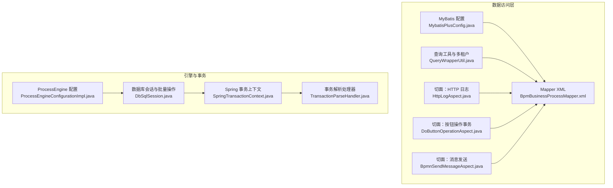
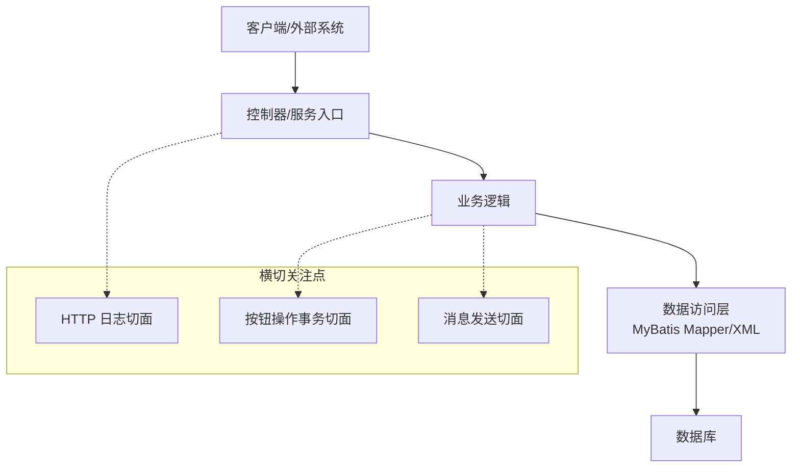
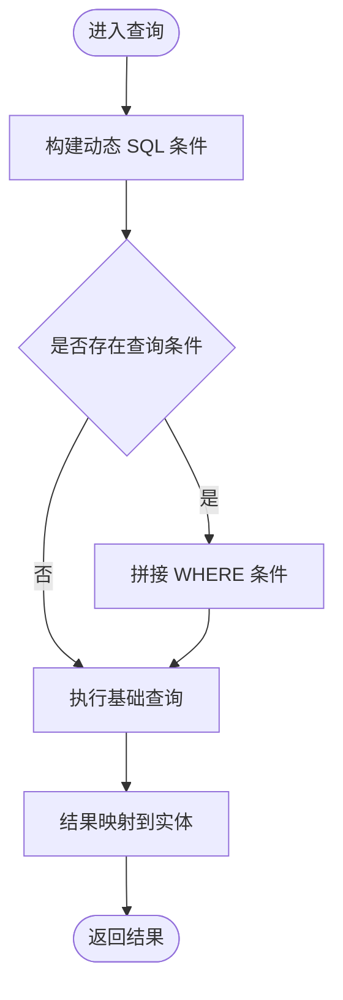
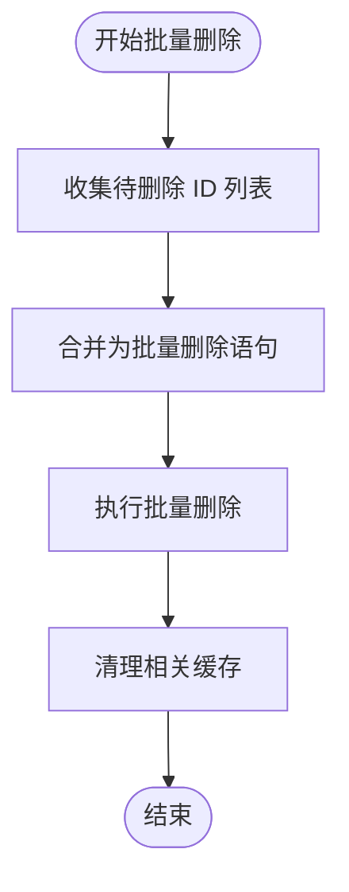
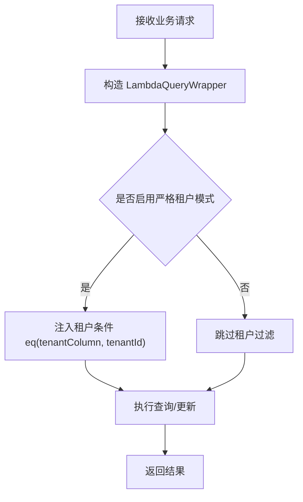
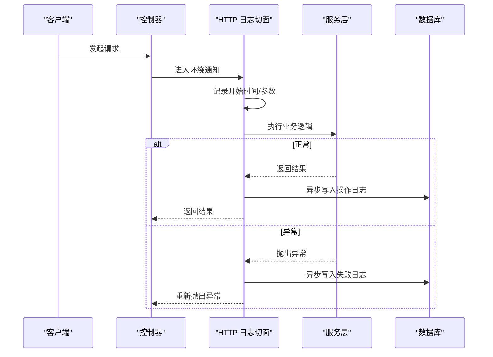
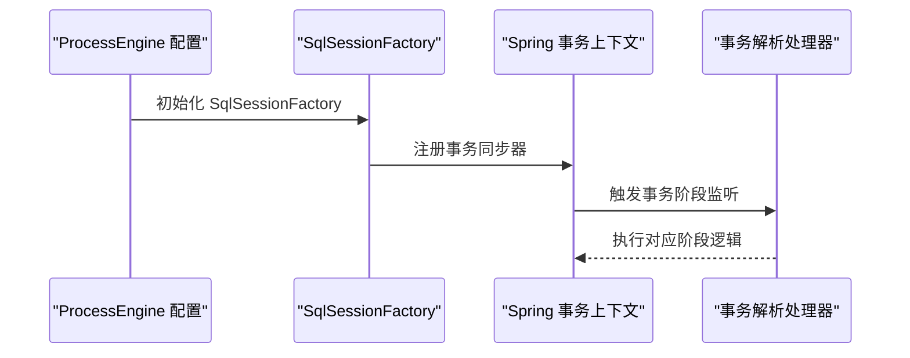
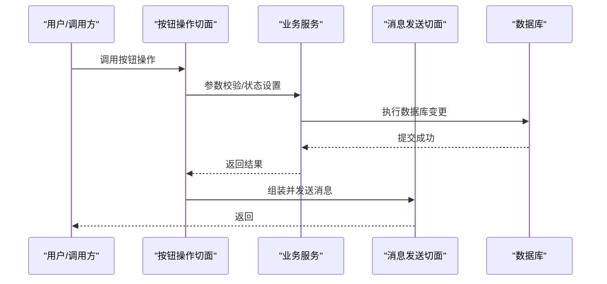
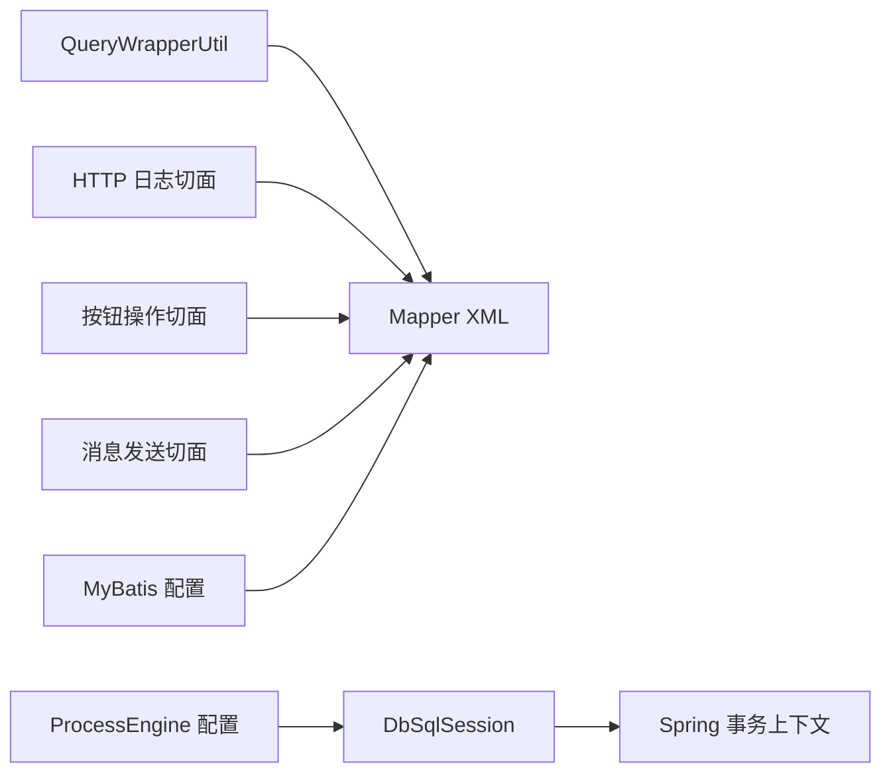

# 数据访问最佳实践

<cite>
**本文引用的文件**
- [BpmBusinessProcessMapper.xml](file://antflow-engine/src/main/resources/mapper/BpmBusinessProcessMapper.xml)
- [QueryWrapperUtil.java](file://antflow-engine/src/main/java/org/openoa/engine/utils/QueryWrapperUtil.java)
- [HttpLogAspect.java](file://antflow-engine/src/main/java/org/openoa/engine/conf/aspect/HttpLogAspect.java)
- [DoButtonOperationAspect.java](file://antflow-engine/src/main/java/org/openoa/engine/conf/aspect/DoButtonOperationAspect.java)
- [BpmnSendMessageAspect.java](file://antflow-engine/src/main/java/org/openoa/engine/conf/aspect/BpmnSendMessageAspect.java)
- [MybatisPlusConfig.java](file://antflow-engine/src/main/java/org/openoa/engine/conf/mybatis/MybatisPlusConfig.java)
- [MultiDataSourceTranstionManager.java](file://antflow-engine/src/main/java/org/openoa/engine/conf/mybatis/MultiDataSourceTranstionManager.java)
- [ProcessEngineConfigurationImpl.java](file://antflow-base/src/main/java/org/activiti/engine/impl/cfg/ProcessEngineConfigurationImpl.java)
- [DbSqlSession.java](file://antflow-base/src/main/java/org/activiti/engine/impl/db/DbSqlSession.java)
- [SpringTransactionContext.java](file://antflow-base/src/main/java/org/activiti/spring/SpringTransactionContext.java)
- [TransactionParseHandler.java](file://antflow-base/src/main/java/org/activiti/engine/impl/bpmn/parser/handler/TransactionParseHandler.java)
</cite>

## 目录
1. [简介](#简介)
2. [项目结构](#项目结构)
3. [核心组件](#核心组件)
4. [架构总览](#架构总览)
5. [详细组件分析](#详细组件分析)
6. [依赖分析](#依赖分析)
7. [性能考量](#性能考量)
8. [故障排查指南](#故障排查指南)
9. [结论](#结论)
10. [附录](#附录)

## 简介
本指南聚焦于 AntFlow 的数据访问层设计与编码规范，系统梳理查询优化策略、批量操作处理、缓存使用原则、安全与权限控制、异常处理与事务管理、性能监控与度量等主题。文档以实际代码为依据，提供可落地的最佳实践建议与可视化图示，帮助开发者在保持高性能与高可靠性的前提下，提升数据访问层的质量与可维护性。

## 项目结构
AntFlow 的数据访问层主要由以下部分构成：
- MyBatis 映射与配置：Mapper XML 文件定义 SQL 与结果映射；MyBatis 配置类负责分页、乐观锁、插件等全局能力。
- 查询工具与多租户：封装 LambdaQueryWrapper，统一注入多租户条件，避免重复判断。
- 切面与日志：围绕数据访问的关键路径织入日志、异常、事务与外部回调等横切关注点。
- Activiti 引擎的数据库会话与事务：底层基于 MyBatis SqlSession，提供批量删除、缓存清理、事务上下文等能力。

**图表来源**
- [MybatisPlusConfig.java:1-141](file://antflow-engine/src/main/java/org/openoa/engine/conf/mybatis/MybatisPlusConfig.java#L1-L141)
- [BpmBusinessProcessMapper.xml:1-67](file://antflow-engine/src/main/resources/mapper/BpmBusinessProcessMapper.xml#L1-L67)
- [QueryWrapperUtil.java:1-25](file://antflow-engine/src/main/java/org/openoa/engine/utils/QueryWrapperUtil.java#L1-L25)
- [HttpLogAspect.java:1-129](file://antflow-engine/src/main/java/org/openoa/engine/conf/aspect/HttpLogAspect.java#L1-L129)
- [DoButtonOperationAspect.java:1-68](file://antflow-engine/src/main/java/org/openoa/engine/conf/aspect/DoButtonOperationAspect.java#L1-L68)
- [BpmnSendMessageAspect.java:1-220](file://antflow-engine/src/main/java/org/openoa/engine/conf/aspect/BpmnSendMessageAspect.java#L1-L220)
- [ProcessEngineConfigurationImpl.java:835-872](file://antflow-base/src/main/java/org/activiti/engine/impl/cfg/ProcessEngineConfigurationImpl.java#L835-L872)
- [DbSqlSession.java:218-692](file://antflow-base/src/main/java/org/activiti/engine/impl/db/DbSqlSession.java#L218-L692)
- [SpringTransactionContext.java:84-152](file://antflow-base/src/main/java/org/activiti/spring/SpringTransactionContext.java#L84-L152)
- [TransactionParseHandler.java:1-35](file://antflow-base/src/main/java/org/activiti/engine/impl/bpmn/parser/handler/TransactionParseHandler.java#L1-L35)

**章节来源**
- [MybatisPlusConfig.java:1-141](file://antflow-engine/src/main/java/org/openoa/engine/conf/mybatis/MybatisPlusConfig.java#L1-L141)
- [BpmBusinessProcessMapper.xml:1-67](file://antflow-engine/src/main/resources/mapper/BpmBusinessProcessMapper.xml#L1-L67)
- [QueryWrapperUtil.java:1-25](file://antflow-engine/src/main/java/org/openoa/engine/utils/QueryWrapperUtil.java#L1-L25)
- [HttpLogAspect.java:1-129](file://antflow-engine/src/main/java/org/openoa/engine/conf/aspect/HttpLogAspect.java#L1-L129)
- [DoButtonOperationAspect.java:1-68](file://antflow-engine/src/main/java/org/openoa/engine/conf/aspect/DoButtonOperationAspect.java#L1-L68)
- [BpmnSendMessageAspect.java:1-220](file://antflow-engine/src/main/java/org/openoa/engine/conf/aspect/BpmnSendMessageAspect.java#L1-L220)
- [ProcessEngineConfigurationImpl.java:835-872](file://antflow-base/src/main/java/org/activiti/engine/impl/cfg/ProcessEngineConfigurationImpl.java#L835-L872)
- [DbSqlSession.java:218-692](file://antflow-base/src/main/java/org/activiti/engine/impl/db/DbSqlSession.java#L218-L692)
- [SpringTransactionContext.java:84-152](file://antflow-base/src/main/java/org/activiti/spring/SpringTransactionContext.java#L84-L152)
- [TransactionParseHandler.java:1-35](file://antflow-base/src/main/java/org/activiti/engine/impl/bpmn/parser/handler/TransactionParseHandler.java#L1-L35)

## 核心组件
- MyBatis 配置与插件
  - 分页与乐观锁：通过 MyBatis Plus 插件实现分页与乐观锁内核拦截，减少重复 SQL 编写与并发冲突风险。
  - 全局配置：设置短键生成策略、Mapper 扫描路径、插件注册等，确保一致性与可维护性。
- Mapper XML
  - 结果映射与列清单：统一定义实体映射与常用列集合，便于复用与重构。
  - 动态 SQL：条件拼接、模糊匹配、按需更新，降低全量更新风险。
- 查询工具与多租户
  - 统一注入租户过滤条件，严格模式下强制校验，避免越权访问。
- 切面与日志
  - HTTP 请求日志：环绕通知记录请求参数、响应结果、耗时与错误类型，异步落库，降低对主流程影响。
  - 按钮操作事务：在业务入口处进行参数校验、状态设置与事务包装，保障原子性。
  - 消息发送：在提交与运行时场景下，统一组装变量消息并异步发送，支持外部回调。
- 引擎事务与会话
  - ProcessEngine 配置：初始化 SqlSessionFactory、事务工厂与数据源，确保数据库连接与事务一致性。
  - DbSqlSession：批量删除、缓存清理与删除优化，减少 N+1 删除与缓存不一致问题。
  - Spring 事务上下文：在不同事务阶段执行监听器，保证生命周期事件的正确触发。

**章节来源**
- [MybatisPlusConfig.java:85-100](file://antflow-engine/src/main/java/org/openoa/engine/conf/mybatis/MybatisPlusConfig.java#L85-L100)
- [BpmBusinessProcessMapper.xml:23-67](file://antflow-engine/src/main/resources/mapper/BpmBusinessProcessMapper.xml#L23-L67)
- [QueryWrapperUtil.java:8-24](file://antflow-engine/src/main/java/org/openoa/engine/utils/QueryWrapperUtil.java#L8-L24)
- [HttpLogAspect.java:40-85](file://antflow-engine/src/main/java/org/openoa/engine/conf/aspect/HttpLogAspect.java#L40-L85)
- [DoButtonOperationAspect.java:35-66](file://antflow-engine/src/main/java/org/openoa/engine/conf/aspect/DoButtonOperationAspect.java#L35-L66)
- [BpmnSendMessageAspect.java:56-162](file://antflow-engine/src/main/java/org/openoa/engine/conf/aspect/BpmnSendMessageAspect.java#L56-L162)
- [ProcessEngineConfigurationImpl.java:848-872](file://antflow-base/src/main/java/org/activiti/engine/impl/cfg/ProcessEngineConfigurationImpl.java#L848-L872)
- [DbSqlSession.java:222-256](file://antflow-base/src/main/java/org/activiti/engine/impl/db/DbSqlSession.java#L222-L256)
- [SpringTransactionContext.java:84-152](file://antflow-base/src/main/java/org/activiti/spring/SpringTransactionContext.java#L84-L152)

## 架构总览
数据访问层整体采用“配置驱动 + 插件增强 + 切面织入”的架构，既保证了 SQL 的灵活性与可维护性，又通过统一的日志、事务与安全策略提升了可观测性与可靠性。

**图表来源**
- [HttpLogAspect.java:36-85](file://antflow-engine/src/main/java/org/openoa/engine/conf/aspect/HttpLogAspect.java#L36-L85)
- [DoButtonOperationAspect.java:35-66](file://antflow-engine/src/main/java/org/openoa/engine/conf/aspect/DoButtonOperationAspect.java#L35-L66)
- [BpmnSendMessageAspect.java:56-162](file://antflow-engine/src/main/java/org/openoa/engine/conf/aspect/BpmnSendMessageAspect.java#L56-L162)

## 详细组件分析

### 组件一：查询优化与动态 SQL
- 关键点
  - 使用 <sql> 定义列清单，避免重复书写列名，降低维护成本。
  - 动态条件：根据入参存在性拼接 WHERE 条件，支持模糊查询与精确匹配。
  - 更新策略：仅更新非空字段，避免覆盖有效值。
- 最佳实践
  - 对高频查询建立合适的索引，避免全表扫描。
  - 控制返回字段数量，优先使用列清单映射。
  - 对 LIKE '%key%' 进行长度限制与前缀索引优化。
  - 合理使用分页，避免一次性拉取大量数据。

**图表来源**
- [BpmBusinessProcessMapper.xml:23-67](file://antflow-engine/src/main/resources/mapper/BpmBusinessProcessMapper.xml#L23-L67)

**章节来源**
- [BpmBusinessProcessMapper.xml:23-67](file://antflow-engine/src/main/resources/mapper/BpmBusinessProcessMapper.xml#L23-L67)

### 组件二：批量操作与缓存清理
- 关键点
  - 批量删除操作：通过 BulkDeleteOperation 将多个删除合并为一次批量执行，减少往返次数。
  - 缓存清理：在插入/删除后主动清理缓存，避免脏读。
  - 删除优化：保留删除优化开关，便于在特定场景启用。
- 最佳实践
  - 批量操作应配合事务使用，失败回滚。
  - 对大批量删除设置分批阈值，避免长时间锁表。
  - 在高并发场景下，优先使用带版本号的乐观锁更新。

**图表来源**
- [DbSqlSession.java:222-256](file://antflow-base/src/main/java/org/activiti/engine/impl/db/DbSqlSession.java#L222-L256)
- [DbSqlSession.java:654-667](file://antflow-base/src/main/java/org/activiti/engine/impl/db/DbSqlSession.java#L654-L667)

**章节来源**
- [DbSqlSession.java:222-256](file://antflow-base/src/main/java/org/activiti/engine/impl/db/DbSqlSession.java#L222-L256)
- [DbSqlSession.java:654-667](file://antflow-base/src/main/java/org/activiti/engine/impl/db/DbSqlSession.java#L654-L667)

### 组件三：多租户与权限控制
- 关键点
  - 通过 QueryWrapperUtil 统一注入租户过滤条件，严格模式下强制校验。
  - 租户 ID 来源于上下文工具，确保全局一致性。
- 最佳实践
  - 在所有读写操作中默认注入租户条件，避免遗漏。
  - 对敏感字段与跨租户数据访问进行显式校验与审计。
  - 在接口层与业务层均进行权限校验，形成双重保障。

**图表来源**
- [QueryWrapperUtil.java:8-24](file://antflow-engine/src/main/java/org/openoa/engine/utils/QueryWrapperUtil.java#L8-L24)

**章节来源**
- [QueryWrapperUtil.java:8-24](file://antflow-engine/src/main/java/org/openoa/engine/utils/QueryWrapperUtil.java#L8-L24)

### 组件四：异常处理与日志监控
- 关键点
  - HTTP 日志切面：环绕通知记录请求/响应、耗时与错误类型，异步入库，不影响主流程。
  - 错误分类：区分业务异常与系统异常，便于后续告警与定位。
- 最佳实践
  - 对敏感参数进行脱敏处理，避免日志泄露。
  - 异步落库采用队列或线程池，防止阻塞。
  - 对关键路径增加 MDC 标识，便于链路追踪。

**图表来源**
- [HttpLogAspect.java:40-85](file://antflow-engine/src/main/java/org/openoa/engine/conf/aspect/HttpLogAspect.java#L40-L85)

**章节来源**
- [HttpLogAspect.java:40-85](file://antflow-engine/src/main/java/org/openoa/engine/conf/aspect/HttpLogAspect.java#L40-L85)

### 组件五：事务管理与生命周期
- 关键点
  - ProcessEngine 配置：初始化 SqlSessionFactory、事务工厂与数据源，确保连接与事务一致性。
  - Spring 事务上下文：在不同事务阶段（开始、提交、回滚）执行监听器，保证生命周期事件。
  - 事务解析：BPMN 事务活动解析，支撑复杂流程中的子事务管理。
- 最佳实践
  - 将长事务拆分为多个短事务，减少锁持有时间。
  - 对幂等性操作进行补偿与重试策略设计。
  - 在分布式场景下使用分布式事务或最终一致性方案。

**图表来源**
- [ProcessEngineConfigurationImpl.java:848-872](file://antflow-base/src/main/java/org/activiti/engine/impl/cfg/ProcessEngineConfigurationImpl.java#L848-L872)
- [SpringTransactionContext.java:84-152](file://antflow-base/src/main/java/org/activiti/spring/SpringTransactionContext.java#L84-L152)
- [TransactionParseHandler.java:32-35](file://antflow-base/src/main/java/org/activiti/engine/impl/bpmn/parser/handler/TransactionParseHandler.java#L32-L35)

**章节来源**
- [ProcessEngineConfigurationImpl.java:848-872](file://antflow-base/src/main/java/org/activiti/engine/impl/cfg/ProcessEngineConfigurationImpl.java#L848-L872)
- [SpringTransactionContext.java:84-152](file://antflow-base/src/main/java/org/activiti/spring/SpringTransactionContext.java#L84-L152)
- [TransactionParseHandler.java:32-35](file://antflow-base/src/main/java/org/activiti/engine/impl/bpmn/parser/handler/TransactionParseHandler.java#L32-L35)

### 组件六：按钮操作与消息发送的事务边界
- 关键点
  - 按钮操作切面：在业务入口处进行参数校验、状态设置与事务包装，保障原子性。
  - 消息发送切面：在提交与运行时场景下，统一组装变量消息并异步发送，支持外部回调。
- 最佳实践
  - 将不可回滚的副作用（如外部回调）放在事务提交后执行。
  - 对外部回调进行幂等与超时控制，避免悬挂调用。

**图表来源**
- [DoButtonOperationAspect.java:35-66](file://antflow-engine/src/main/java/org/openoa/engine/conf/aspect/DoButtonOperationAspect.java#L35-L66)
- [BpmnSendMessageAspect.java:118-162](file://antflow-engine/src/main/java/org/openoa/engine/conf/aspect/BpmnSendMessageAspect.java#L118-L162)

**章节来源**
- [DoButtonOperationAspect.java:35-66](file://antflow-engine/src/main/java/org/openoa/engine/conf/aspect/DoButtonOperationAspect.java#L35-L66)
- [BpmnSendMessageAspect.java:118-162](file://antflow-engine/src/main/java/org/openoa/engine/conf/aspect/BpmnSendMessageAspect.java#L118-L162)

## 依赖分析
- 组件耦合
  - Mapper XML 与实体强绑定，通过命名空间与结果映射保持稳定契约。
  - 查询工具与多租户解耦，通过函数式接口注入租户列，便于扩展。
  - 切面与业务逻辑松耦合，通过注解与表达式定义切入点，易于维护。
- 外部依赖
  - MyBatis/MyBatis Plus：提供 ORM 能力与插件生态。
  - Spring 事务：提供声明式与编程式事务管理。
  - Activiti 引擎：提供流程引擎的数据库会话与事务上下文。

**图表来源**
- [QueryWrapperUtil.java:8-24](file://antflow-engine/src/main/java/org/openoa/engine/utils/QueryWrapperUtil.java#L8-L24)
- [BpmBusinessProcessMapper.xml:1-67](file://antflow-engine/src/main/resources/mapper/BpmBusinessProcessMapper.xml#L1-L67)
- [HttpLogAspect.java:36-85](file://antflow-engine/src/main/java/org/openoa/engine/conf/aspect/HttpLogAspect.java#L36-L85)
- [DoButtonOperationAspect.java:35-66](file://antflow-engine/src/main/java/org/openoa/engine/conf/aspect/DoButtonOperationAspect.java#L35-L66)
- [BpmnSendMessageAspect.java:56-162](file://antflow-engine/src/main/java/org/openoa/engine/conf/aspect/BpmnSendMessageAspect.java#L56-L162)
- [MybatisPlusConfig.java:85-100](file://antflow-engine/src/main/java/org/openoa/engine/conf/mybatis/MybatisPlusConfig.java#L85-L100)
- [ProcessEngineConfigurationImpl.java:848-872](file://antflow-base/src/main/java/org/activiti/engine/impl/cfg/ProcessEngineConfigurationImpl.java#L848-L872)
- [DbSqlSession.java:222-256](file://antflow-base/src/main/java/org/activiti/engine/impl/db/DbSqlSession.java#L222-L256)
- [SpringTransactionContext.java:84-152](file://antflow-base/src/main/java/org/activiti/spring/SpringTransactionContext.java#L84-L152)

**章节来源**
- [MybatisPlusConfig.java:85-100](file://antflow-engine/src/main/java/org/openoa/engine/conf/mybatis/MybatisPlusConfig.java#L85-L100)
- [BpmBusinessProcessMapper.xml:1-67](file://antflow-engine/src/main/resources/mapper/BpmBusinessProcessMapper.xml#L1-L67)
- [QueryWrapperUtil.java:8-24](file://antflow-engine/src/main/java/org/openoa/engine/utils/QueryWrapperUtil.java#L8-L24)
- [HttpLogAspect.java:36-85](file://antflow-engine/src/main/java/org/openoa/engine/conf/aspect/HttpLogAspect.java#L36-L85)
- [DoButtonOperationAspect.java:35-66](file://antflow-engine/src/main/java/org/openoa/engine/conf/aspect/DoButtonOperationAspect.java#L35-L66)
- [BpmnSendMessageAspect.java:56-162](file://antflow-engine/src/main/java/org/openoa/engine/conf/aspect/BpmnSendMessageAspect.java#L56-L162)
- [ProcessEngineConfigurationImpl.java:848-872](file://antflow-base/src/main/java/org/activiti/engine/impl/cfg/ProcessEngineConfigurationImpl.java#L848-L872)
- [DbSqlSession.java:222-256](file://antflow-base/src/main/java/org/activiti/engine/impl/db/DbSqlSession.java#L222-L256)
- [SpringTransactionContext.java:84-152](file://antflow-base/src/main/java/org/activiti/spring/SpringTransactionContext.java#L84-L152)

## 性能考量
- 查询优化
  - 使用列清单与条件拼接，避免 SELECT *。
  - 对高频字段建立索引，必要时使用复合索引。
  - 控制 LIKE 前缀，避免全表扫描。
- 批量操作
  - 合理使用批量删除与更新，减少往返次数。
  - 对大批量操作设置分批阈值，避免长时间锁表。
- 缓存与一致性
  - 在插入/删除后主动清理缓存，避免脏读。
  - 对热点数据使用本地缓存与分布式缓存双写策略。
- 事务与锁
  - 将长事务拆分为多个短事务，减少锁持有时间。
  - 使用乐观锁与版本号控制并发更新。
- 监控与度量
  - 通过 HTTP 日志切面记录耗时与错误，辅助性能分析。
  - 对关键 SQL 增加慢查询日志与采样监控。

[本节为通用指导，无需具体文件引用]

## 故障排查指南
- SQL 注入与安全
  - 严禁拼接用户输入到 SQL 字符串，统一使用参数化查询与动态 SQL 片段。
  - 对 LIKE 查询进行长度限制与特殊字符转义。
- 权限与租户
  - 确保所有查询默认注入租户条件，严格模式下必须校验。
  - 对跨租户访问进行显式校验与审计。
- 事务与回滚
  - 区分业务异常与系统异常，避免误回滚。
  - 对外部回调等副作用在事务提交后执行，确保一致性。
- 日志与可观测性
  - 对敏感参数进行脱敏，避免日志泄露。
  - 异步落库采用队列或线程池，防止阻塞主流程。

**章节来源**
- [BpmBusinessProcessMapper.xml:23-67](file://antflow-engine/src/main/resources/mapper/BpmBusinessProcessMapper.xml#L23-L67)
- [QueryWrapperUtil.java:8-24](file://antflow-engine/src/main/java/org/openoa/engine/utils/QueryWrapperUtil.java#L8-L24)
- [HttpLogAspect.java:40-85](file://antflow-engine/src/main/java/org/openoa/engine/conf/aspect/HttpLogAspect.java#L40-L85)
- [DoButtonOperationAspect.java:35-66](file://antflow-engine/src/main/java/org/openoa/engine/conf/aspect/DoButtonOperationAspect.java#L35-L66)
- [BpmnSendMessageAspect.java:118-162](file://antflow-engine/src/main/java/org/openoa/engine/conf/aspect/BpmnSendMessageAspect.java#L118-L162)

## 结论
AntFlow 的数据访问层通过“配置驱动 + 插件增强 + 切面织入”的方式，在保证灵活性的同时提升了可观测性与安全性。遵循本文的查询优化、批量处理、缓存策略、安全与权限控制、异常与事务管理以及性能监控建议，可在复杂业务场景下持续提升系统的稳定性与可维护性。

[本节为总结，无需具体文件引用]

## 附录

### 代码审查清单（数据访问层）
- SQL 设计
  - 是否使用参数化查询与动态 SQL 片段？
  - 是否避免 SELECT *，仅选择必要列？
  - 是否对高频字段建立索引？LIKE 查询是否受控？
- 批量与缓存
  - 是否使用批量操作减少往返？
  - 是否在插入/删除后清理缓存？
- 多租户与权限
  - 是否默认注入租户条件？
  - 是否在严格模式下强制校验？
- 事务与异常
  - 是否将长事务拆分为短事务？
  - 是否区分业务异常与系统异常？
- 日志与监控
  - 是否对敏感参数脱敏？
  - 是否异步记录操作日志？

[本节为通用清单，无需具体文件引用]