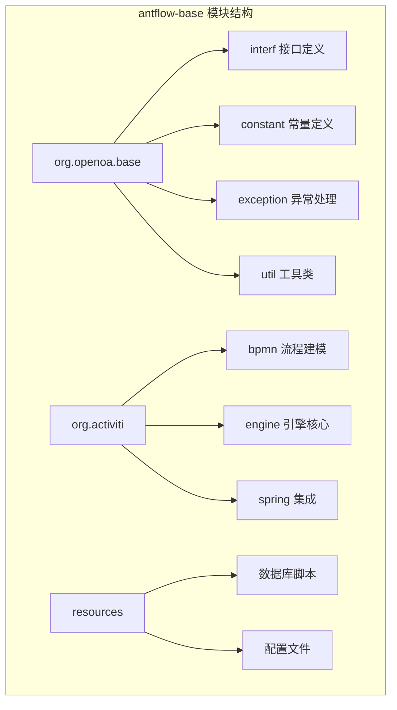
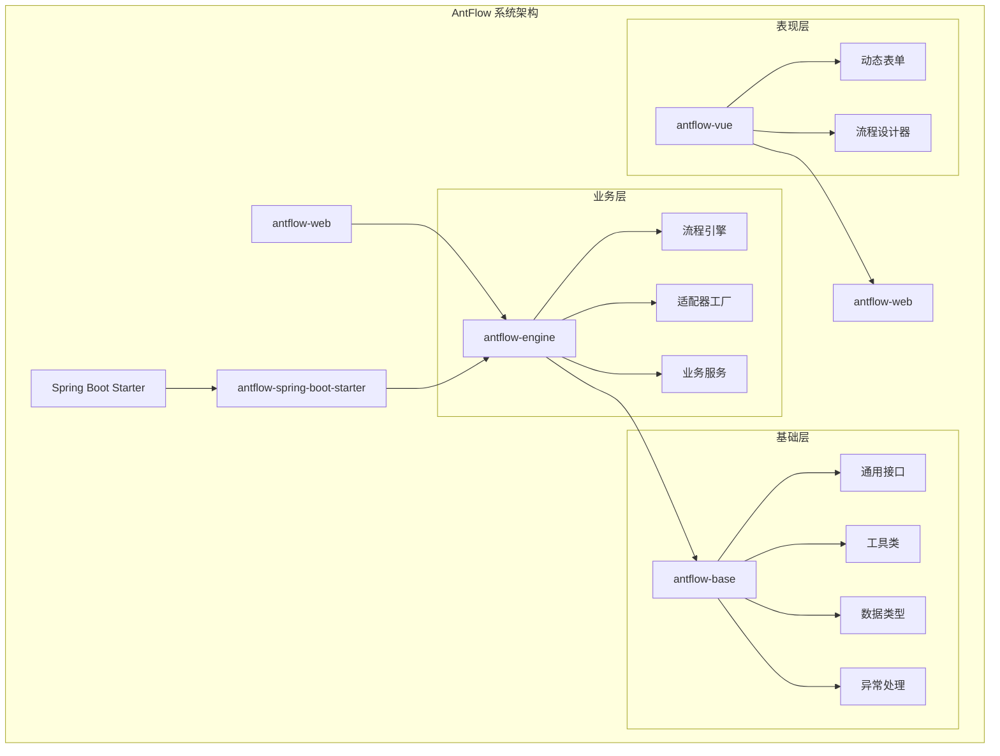
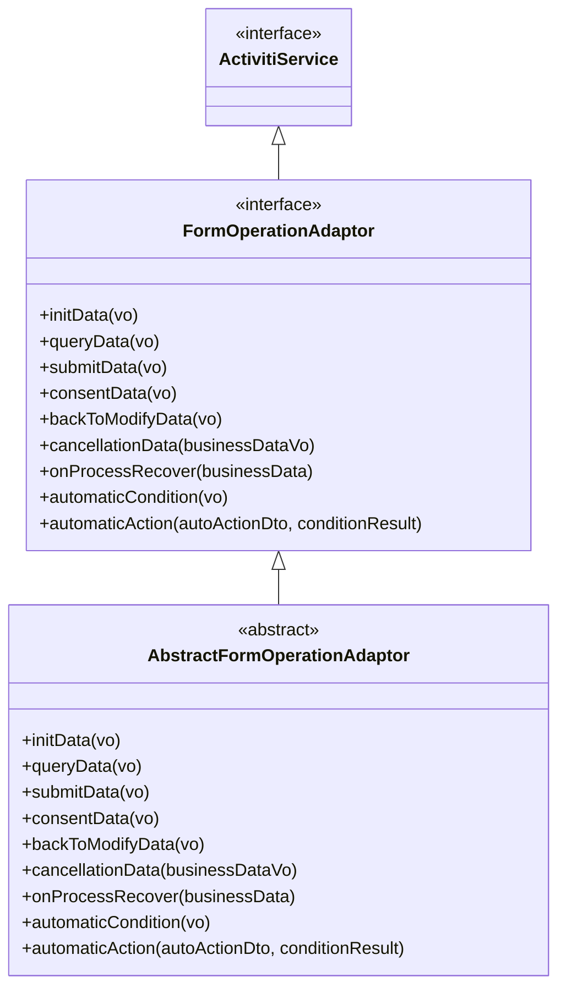
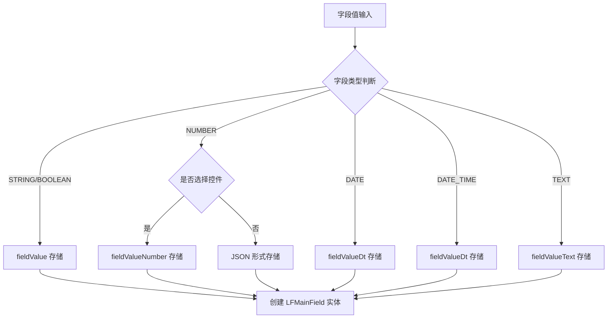
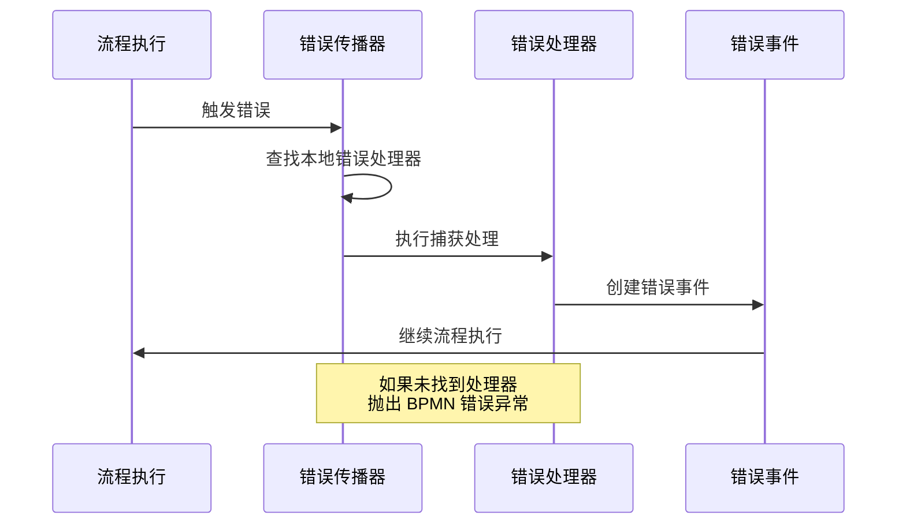
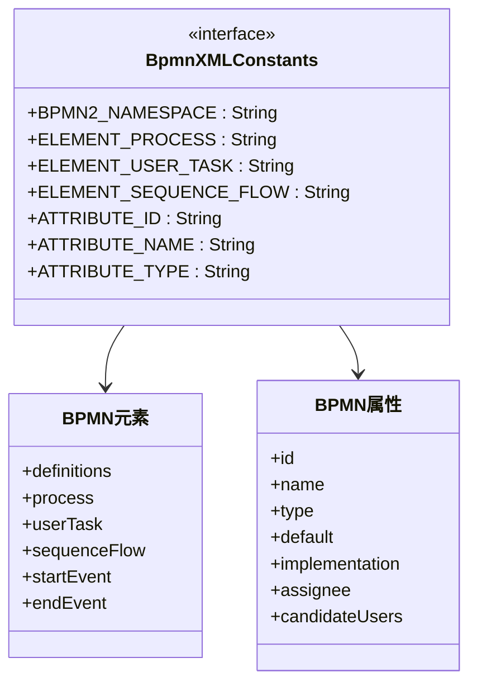
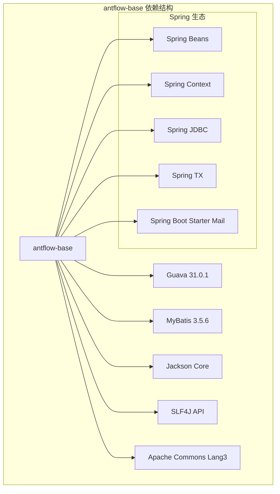

# antflow-base 基础模块

<cite>
**本文档引用的文件**
- [pom.xml](file://antflow-base/pom.xml)
- [ActivitiService.java](file://antflow-base/src/main/java/org/openoa/base/interf/ActivitiService.java)
- [AbstractFormOperationAdaptor.java](file://antflow-engine/src/main/java/org/openoa/engine/bpmnconf/adp/processoperation/AbstractFormOperationAdaptor.java)
- [LFFieldTypeEnum.java](file://antflow-base/src/main/java/org/openoa/base/constant/enums/LFFieldTypeEnum.java)
- [FieldValueTypeEnum.java](file://antflow-base/src/main/java/org/openoa/base/constant/enums/FieldValueTypeEnum.java)
- [BpmnXMLConstants.java](file://antflow-base/src/main/java/org/activiti/bpmn/constants/BpmnXMLConstants.java)
- [ProcessEngine.java](file://antflow-base/src/main/java/org/activiti/engine/ProcessEngine.java)
- [ErrorPropagation.java](file://antflow-base/src/main/java/org/activiti/engine/impl/bpmn/helper/ErrorPropagation.java)
</cite>

## 目录
1. [简介](#简介)
2. [项目结构](#项目结构)
3. [核心组件](#核心组件)
4. [架构概览](#架构概览)
5. [详细组件分析](#详细组件分析)
6. [依赖分析](#依赖分析)
7. [性能考虑](#性能考虑)
8. [故障排除指南](#故障排除指南)
9. [结论](#结论)

## 简介

antflow-base 是 AntFlow 工作流引擎的基础设施模块，作为整个系统的基础支撑层，为上层业务模块提供通用的接口定义、工具类组件、数据类型定义和异常处理机制。该模块采用最小依赖设计原则，通过清晰的接口契约和组件复用策略，为其他模块提供稳定可靠的基础设施支持。

该模块的核心设计理念包括：
- **最小依赖原则**：仅引入必要的第三方依赖，避免过度耦合
- **接口契约定义**：通过清晰的接口定义规范模块间的交互
- **组件复用策略**：提供可复用的工具类和数据类型
- **异常处理机制**：建立统一的异常处理体系

## 项目结构

antflow-base 模块采用分层架构设计，主要包含以下核心包结构：

**图表来源**
- [pom.xml:1-250](file://antflow-base/pom.xml#L1-L250)

**章节来源**
- [pom.xml:1-250](file://antflow-base/pom.xml#L1-L250)

## 核心组件

### 通用接口定义

antflow-base 模块提供了系统级的通用接口定义，主要包括：

#### ActivitiService 接口
作为 AntFlow 核心接口，定义了业务流程服务的标准契约：
- 统一的业务逻辑定义接口
- 作为 FormOperationAdaptor 的父接口
- 提供业务流程的标准化入口点

#### FormOperationAdaptor 接口族
提供表单操作的适配器模式实现，支持多种业务场景：
- 表单数据初始化
- 数据查询和提交
- 审批流程处理
- 自动化条件判断

**章节来源**
- [ActivitiService.java:1-11](file://antflow-base/src/main/java/org/openoa/base/interf/ActivitiService.java#L1-L11)
- [AbstractFormOperationAdaptor.java:1-62](file://antflow-engine/src/main/java/org/openoa/engine/bpmnconf/adp/processoperation/AbstractFormOperationAdaptor.java#L1-L62)

### 工具类组件

#### SnowFlake ID 生成器
提供分布式唯一 ID 生成能力，确保系统中数据标识的唯一性。

#### 日期处理工具
封装常用的日期时间处理功能，包括格式化、计算和转换等操作。

### 数据类型定义

#### LFFieldTypeEnum 枚举
定义低代码流程引擎支持的字段类型系统：

| 类型 | 代码 | 描述 | 存储方式 |
|------|------|------|----------|
| STRING | 1 | 基本文本字段 | fieldValue |
| NUMBER | 2 | 数值 | fieldValueNumber 或 fieldValue（用于选择） |
| DATE | 3 | 仅日期 | fieldValueDt |
| DATE_TIME | 4 | 日期和时间 | fieldValueDt |
| TEXT | 5 | 长文本内容 | fieldValueText |
| BOOLEAN | 6 | 布尔值 | fieldValue（作为字符串） |
| BLOB | 7 | 二进制数据 | 未实现 |

#### FieldValueTypeEnum 枚举
定义字段值类型的分类体系，支持字符串、数值、选择框等多种类型。

**章节来源**
- [LFFieldTypeEnum.java:1-47](file://antflow-base/src/main/java/org/openoa/base/constant/enums/LFFieldTypeEnum.java#L1-L47)
- [FieldValueTypeEnum.java:1-26](file://antflow-base/src/main/java/org/openoa/base/constant/enums/FieldValueTypeEnum.java#L1-L26)

### 异常处理机制

#### 错误传播机制
实现 BPMN 错误的传播和处理逻辑，包括：
- 错误事件的查找和执行
- 错误处理器的定位和调用
- 异常类型的匹配和处理

#### 统一异常接口
提供标准的异常处理接口，确保系统中异常处理的一致性和可维护性。

**章节来源**
- [ErrorPropagation.java:29-252](file://antflow-base/src/main/java/org/activiti/engine/impl/bpmn/helper/ErrorPropagation.java#L29-L252)

## 架构概览

antflow-base 模块在整个 AntFlow 系统中的架构位置如下：

**图表来源**
- [pom.xml:1-250](file://antflow-base/pom.xml#L1-L250)
- [ProcessEngine.java:1-61](file://antflow-base/src/main/java/org/activiti/engine/ProcessEngine.java#L1-L61)

## 详细组件分析

### 接口契约设计

#### ActivitiService 接口分析

**图表来源**
- [ActivitiService.java:1-11](file://antflow-base/src/main/java/org/openoa/base/interf/ActivitiService.java#L1-L11)
- [AbstractFormOperationAdaptor.java:1-62](file://antflow-engine/src/main/java/org/openoa/engine/bpmnconf/adp/processoperation/AbstractFormOperationAdaptor.java#L1-L62)

#### 字段类型处理流程

**图表来源**
- [LFFieldTypeEnum.java:1-47](file://antflow-base/src/main/java/org/openoa/base/constant/enums/LFFieldTypeEnum.java#L1-L47)

**章节来源**
- [AbstractFormOperationAdaptor.java:1-62](file://antflow-engine/src/main/java/org/openoa/engine/bpmnconf/adp/processoperation/AbstractFormOperationAdaptor.java#L1-L62)
- [LFFieldTypeEnum.java:1-47](file://antflow-base/src/main/java/org/openoa/base/constant/enums/LFFieldTypeEnum.java#L1-L47)

### 错误处理机制

#### 错误传播序列图

**图表来源**
- [ErrorPropagation.java:59-85](file://antflow-base/src/main/java/org/activiti/engine/impl/bpmn/helper/ErrorPropagation.java#L59-L85)

**章节来源**
- [ErrorPropagation.java:29-252](file://antflow-base/src/main/java/org/activiti/engine/impl/bpmn/helper/ErrorPropagation.java#L29-L252)

### BPMN 常量定义

#### XML 常量映射

**图表来源**
- [BpmnXMLConstants.java:1-302](file://antflow-base/src/main/java/org/activiti/bpmn/constants/BpmnXMLConstants.java#L1-L302)

**章节来源**
- [BpmnXMLConstants.java:1-302](file://antflow-base/src/main/java/org/activiti/bpmn/constants/BpmnXMLConstants.java#L1-L302)

## 依赖分析

### 依赖关系图

**图表来源**
- [pom.xml:43-143](file://antflow-base/pom.xml#L43-L143)

### 最小依赖设计原则

antflow-base 模块严格遵循最小依赖原则：

1. **核心依赖**：仅包含系统运行必需的依赖项
2. **作用域控制**：使用 `provided` 作用域避免传递依赖
3. **版本管理**：通过 Spring Boot 依赖管理统一版本控制
4. **可选集成**：提供可选的 Spring Boot Starter 集成

**章节来源**
- [pom.xml:1-250](file://antflow-base/pom.xml#L1-L250)

## 性能考虑

### 设计优化策略

#### 缓存机制
- LFFieldTypeEnum 中实现了静态缓存机制，避免重复创建枚举实例
- 使用 `allInstances` 缓存所有枚举值，提升类型查找性能

#### 内存优化
- 采用枚举替代传统常量定义，减少内存占用
- 提供高效的类型转换和存储方案

#### 并发安全
- 所有公共接口设计为线程安全
- 使用不可变数据结构确保并发访问的安全性

## 故障排除指南

### 常见问题及解决方案

#### 接口实现问题
- **问题**：实现 ActivitiService 接口时缺少必要方法
- **解决方案**：确保正确实现所有必需的业务方法

#### 字段类型处理异常
- **问题**：字段值存储不符合预期
- **解决方案**：检查 LFFieldTypeEnum 的类型判断逻辑

#### 错误传播失败
- **问题**：BPMN 错误无法正确传播
- **解决方案**：验证错误处理器的配置和定位逻辑

**章节来源**
- [ErrorPropagation.java:82-85](file://antflow-base/src/main/java/org/activiti/engine/impl/bpmn/helper/ErrorPropagation.java#L82-L85)

## 结论

antflow-base 基础模块通过精心设计的接口契约、完善的工具类组件、标准化的数据类型定义和健壮的异常处理机制，为 AntFlow 工作流引擎提供了坚实的基础设施支撑。其最小依赖设计原则确保了模块的轻量化和可维护性，而清晰的接口定义则促进了模块间的松耦合和高内聚。

该模块的成功实施体现了以下关键价值：
- **可扩展性**：通过接口契约支持灵活的功能扩展
- **可维护性**：标准化的设计降低了维护成本
- **可复用性**：通用组件支持跨项目的重复利用
- **稳定性**：完善的异常处理机制确保系统可靠性

未来的发展方向包括进一步优化性能、增强监控能力以及扩展更多的工具类组件，以更好地服务于 AntFlow 生态系统的持续发展。