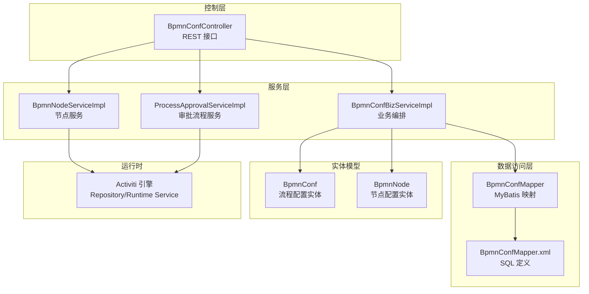
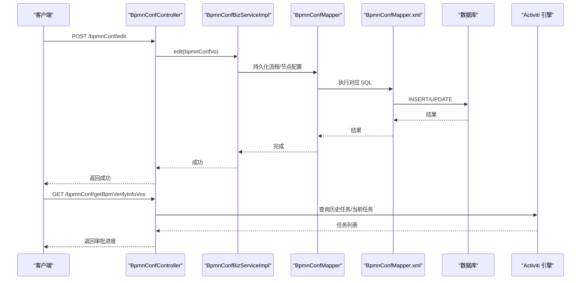
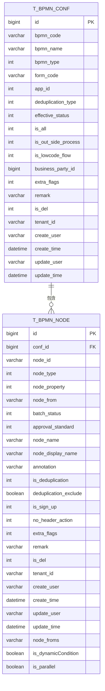
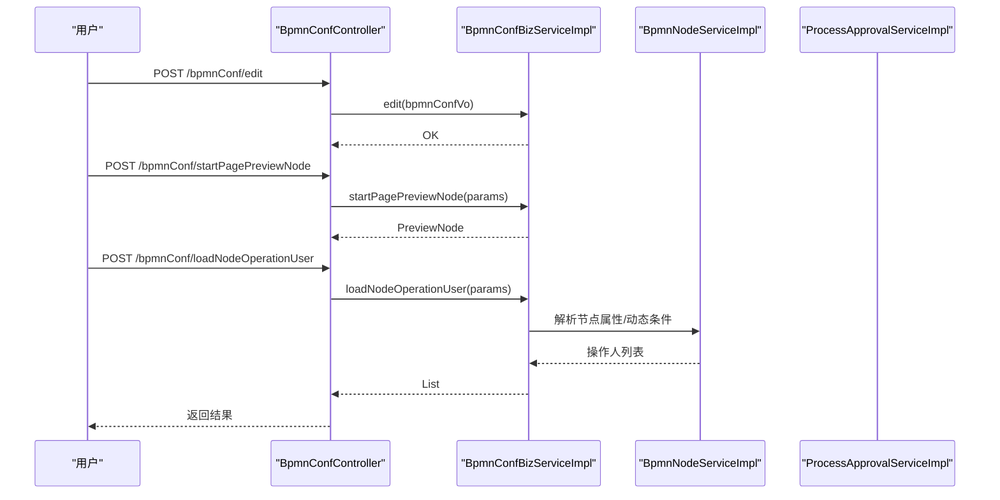
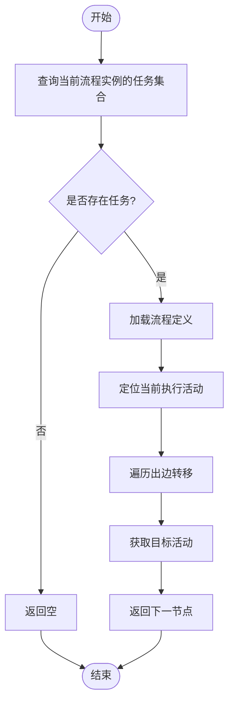
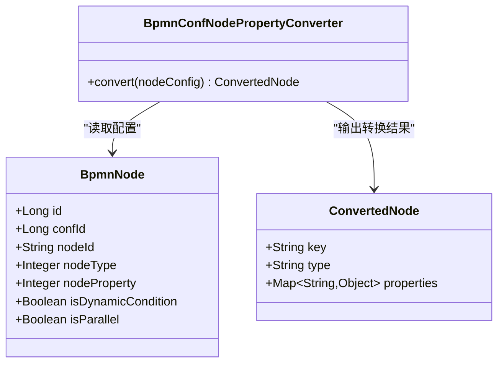
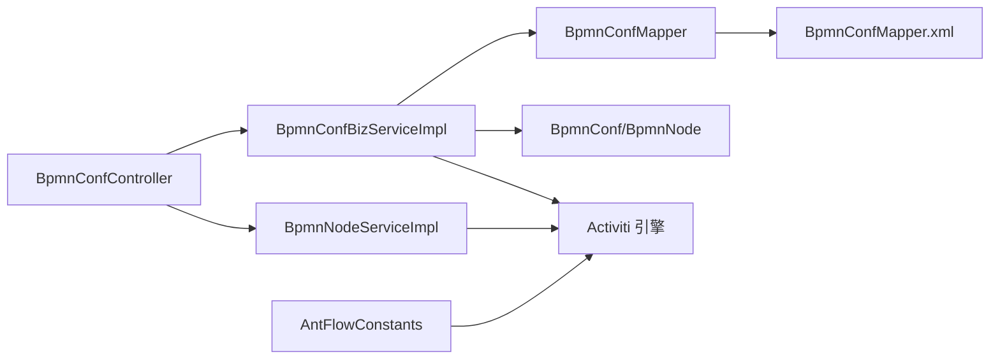

# BPMN 配置系统

<cite>
**本文引用的文件**
- [BpmnConfController.java](file://antflow-engine/src/main/java/org/openoa/engine/bpmnconf/controller/BpmnConfController.java)
- [BpmnConfMapper.java](file://antflow-engine/src/main/java/org/openoa/engine/bpmnconf/mapper/BpmnConfMapper.java)
- [BpmnConfServiceImpl.java](file://antflow-engine/src/main/java/org/openoa/engine/bpmnconf/service/impl/BpmnConfServiceImpl.java)
- [BpmnConfService.java](file://antflow-engine/src/main/java/org/openoa/engine/bpmnconf/service/interf/repository/BpmnConfService.java)
- [BpmnConfMapper.xml](file://antflow-engine/src/main/resources/mapper/BpmnConfMapper.xml)
- [BpmnConf.java](file://antflow-base/src/main/java/org/openoa/base/entity/BpmnConf.java)
- [BpmnNode.java](file://antflow-base/src/main/java/org/openoa/base/entity/BpmnNode.java)
- [ProcessConstants.java](file://antflow-engine/src/main/java/org/openoa/engine/bpmnconf/common/ProcessConstants.java)
- [AntFlowConstants.java](file://antflow-engine/src/main/java/org/openoa/engine/bpmnconf/constant/AntFlowConstants.java)
- [BpmnConfNodePropertyConverter.java](file://antflow-engine/src/main/java/org/openoa/engine/utils/BpmnConfNodePropertyConverter.java)
</cite>

## 目录
1. [简介](#简介)
2. [项目结构](#项目结构)
3. [核心组件](#核心组件)
4. [架构总览](#架构总览)
5. [详细组件分析](#详细组件分析)
6. [依赖关系分析](#依赖关系分析)
7. [性能考虑](#性能考虑)
8. [故障排查指南](#故障排查指南)
9. [结论](#结论)
10. [附录](#附录)

## 简介
本文件面向 BPMN 配置系统，系统以 Activiti 引擎为核心，提供流程定义的配置、存储、序列化与运行时动态节点生成能力。系统围绕“流程配置”和“节点配置”两大实体展开，通过 MyBatis 进行持久化，结合 Activiti 的 RepositoryService/RuntimeService 提供流程部署与运行时查询能力。本文档从架构、数据模型、处理逻辑、集成方式等维度进行深入解析，并给出可视化图示与实践指引。

## 项目结构
- 后端采用分层结构：Controller → Service → Mapper/XML → Entity/VO
- BPMN 配置相关位于 antflow-engine 模块的 bpmnconf 包下，基础实体位于 antflow-base 模块
- 控制器对外暴露 REST 接口，服务层负责业务编排，Mapper/XML 负责数据访问，实体类映射数据库表

图表来源
- [BpmnConfController.java:32-191](file://antflow-engine/src/main/java/org/openoa/engine/bpmnconf/controller/BpmnConfController.java#L32-L191)
- [BpmnConfMapper.java:18-30](file://antflow-engine/src/main/java/org/openoa/engine/bpmnconf/mapper/BpmnConfMapper.java#L18-L30)
- [BpmnConfMapper.xml:5-139](file://antflow-engine/src/main/resources/mapper/BpmnConfMapper.xml#L5-L139)
- [BpmnConf.java:31-158](file://antflow-base/src/main/java/org/openoa/base/entity/BpmnConf.java#L31-L158)
- [BpmnNode.java:28-154](file://antflow-base/src/main/java/org/openoa/base/entity/BpmnNode.java#L28-L154)

章节来源
- [BpmnConfController.java:32-191](file://antflow-engine/src/main/java/org/openoa/engine/bpmnconf/controller/BpmnConfController.java#L32-L191)
- [BpmnConfMapper.java:18-30](file://antflow-engine/src/main/java/org/openoa/engine/bpmnconf/mapper/BpmnConfMapper.java#L18-L30)
- [BpmnConfMapper.xml:5-139](file://antflow-engine/src/main/resources/mapper/BpmnConfMapper.xml#L5-L139)
- [BpmnConf.java:31-158](file://antflow-base/src/main/java/org/openoa/base/entity/BpmnConf.java#L31-L158)
- [BpmnNode.java:28-154](file://antflow-base/src/main/java/org/openoa/base/entity/BpmnNode.java#L28-L154)

## 核心组件
- 控制器层：统一暴露流程配置的编辑、分页查询、预览、节点操作、审批进度等接口
- 服务层：封装业务编排、节点动态生成、运行时查询等逻辑
- 数据访问层：基于 MyBatis 的 Mapper 与 XML，提供分页查询、第三方流程查询、外部表单关联等 SQL
- 实体层：BpmnConf、BpmnNode 映射 t_bpmn_conf、t_bpmn_node 表，承载流程配置与节点配置的元数据
- 运行时集成：通过 Activiti 的 RepositoryService/RuntimeService 查询当前任务、下一节点、历史任务等

章节来源
- [BpmnConfController.java:32-191](file://antflow-engine/src/main/java/org/openoa/engine/bpmnconf/controller/BpmnConfController.java#L32-L191)
- [BpmnConfMapper.java:18-30](file://antflow-engine/src/main/java/org/openoa/engine/bpmnconf/mapper/BpmnConfMapper.java#L18-L30)
- [BpmnConfMapper.xml:5-139](file://antflow-engine/src/main/resources/mapper/BpmnConfMapper.xml#L5-L139)
- [BpmnConf.java:31-158](file://antflow-base/src/main/java/org/openoa/base/entity/BpmnConf.java#L31-L158)
- [BpmnNode.java:28-154](file://antflow-base/src/main/java/org/openoa/base/entity/BpmnNode.java#L28-L154)
- [ProcessConstants.java:39-158](file://antflow-engine/src/main/java/org/openoa/engine/bpmnconf/common/ProcessConstants.java#L39-L158)

## 架构总览
系统围绕“流程配置”和“节点配置”两条主线展开：
- 流程配置（BpmnConf）：标识流程编码、名称、表单绑定、生效状态、是否低代码/外部流程等
- 节点配置（BpmnNode）：标识节点类型、属性、前置节点、并行/动态条件标记、显示名等
- 运行时：通过 Activiti 引擎读取流程定义，结合系统内部节点配置生成动态节点与路由条件

图表来源
- [BpmnConfController.java:65-125](file://antflow-engine/src/main/java/org/openoa/engine/bpmnconf/controller/BpmnConfController.java#L65-L125)
- [BpmnConfMapper.java:18-30](file://antflow-engine/src/main/java/org/openoa/engine/bpmnconf/mapper/BpmnConfMapper.java#L18-L30)
- [BpmnConfMapper.xml:5-139](file://antflow-engine/src/main/resources/mapper/BpmnConfMapper.xml#L5-L139)
- [ProcessConstants.java:49-83](file://antflow-engine/src/main/java/org/openoa/engine/bpmnconf/common/ProcessConstants.java#L49-L83)

## 详细组件分析

### 组件一：流程配置实体与持久化
- 实体映射
  - BpmnConf 对应 t_bpmn_conf，包含流程编码、名称、表单编码、生效状态、是否低代码/外部流程、业务方标识、租户字段等
  - BpmnNode 对应 t_bpmn_node，包含节点类型、节点属性、前置节点、并行/动态条件标记、显示名等
- 关键字段与约束
  - 流程名称校验：长度、空格、特殊字符、格式等
  - 流程编码格式：固定位数后缀，支持按前缀查询最大编号
- 持久化策略
  - 使用 MyBatis Plus IService 实现类，Mapper 接口继承 BaseMapper
  - XML 中定义分页查询、第三方流程查询、外部表单关联查询、按业务号反查流程配置等 SQL

图表来源
- [BpmnConf.java:31-158](file://antflow-base/src/main/java/org/openoa/base/entity/BpmnConf.java#L31-L158)
- [BpmnNode.java:28-154](file://antflow-base/src/main/java/org/openoa/base/entity/BpmnNode.java#L28-L154)

章节来源
- [BpmnConf.java:31-158](file://antflow-base/src/main/java/org/openoa/base/entity/BpmnConf.java#L31-L158)
- [BpmnNode.java:28-154](file://antflow-base/src/main/java/org/openoa/base/entity/BpmnNode.java#L28-L154)
- [BpmnConfMapper.java:18-30](file://antflow-engine/src/main/java/org/openoa/engine/bpmnconf/mapper/BpmnConfMapper.java#L18-L30)
- [BpmnConfMapper.xml:5-139](file://antflow-engine/src/main/resources/mapper/BpmnConfMapper.xml#L5-L139)

### 组件二：流程配置控制器与业务接口
- 主要接口
  - 编辑流程配置：POST /bpmnConf/edit
  - 分页查询：POST /bpmnConf/listPage
  - 预览节点：POST /bpmnConf/preview
  - 启动页/任务页预览：POST /bpmnConf/startPagePreviewNode
  - 加载节点操作人：POST /bpmnConf/loadNodeOperationUser
  - 审批进度：GET /bpmnConf/getBpmVerifyInfoVos
  - 业务查看/按钮操作：POST /bpmnConf/process/*
  - 生效流程：GET /bpmnConf/effectiveBpmn/{id}
  - 详情：GET /bpmnConf/detail/{id}
  - 流程列表：GET /bpmnConf/process/listPage/{type}

图表来源
- [BpmnConfController.java:65-114](file://antflow-engine/src/main/java/org/openoa/engine/bpmnconf/controller/BpmnConfController.java#L65-L114)
- [BpmnConfController.java:146-150](file://antflow-engine/src/main/java/org/openoa/engine/bpmnconf/controller/BpmnConfController.java#L146-L150)

章节来源
- [BpmnConfController.java:32-191](file://antflow-engine/src/main/java/org/openoa/engine/bpmnconf/controller/BpmnConfController.java#L32-L191)

### 组件三：运行时节点查询与下一节点定位
- 功能要点
  - 通过当前任务集合定位当前执行活动
  - 读取流程定义中的活动与出边转移，计算下一节点
  - 支持根据业务号/流程号查询历史任务、当前任务，过滤抄送节点等
- 关键常量
  - 任务类型、网关类型、结束事件、服务任务等常量定义，用于识别节点类型与行为

图表来源
- [ProcessConstants.java:49-83](file://antflow-engine/src/main/java/org/openoa/engine/bpmnconf/common/ProcessConstants.java#L49-L83)
- [AntFlowConstants.java:3-92](file://antflow-engine/src/main/java/org/openoa/engine/bpmnconf/constant/AntFlowConstants.java#L3-L92)

章节来源
- [ProcessConstants.java:39-158](file://antflow-engine/src/main/java/org/openoa/engine/bpmnconf/common/ProcessConstants.java#L39-L158)
- [AntFlowConstants.java:3-92](file://antflow-engine/src/main/java/org/openoa/engine/bpmnconf/constant/AntFlowConstants.java#L3-L92)

### 组件四：节点属性转换与动态节点生成
- 节点属性转换器
  - BpmnConfNodePropertyConverter 负责将配置中的节点属性进行转换，支持不同节点类型的差异化处理
- 动态节点生成
  - 结合 is_dynamicCondition/is_parallel 等标记，运行时动态生成节点与路由条件
  - 与表单相关用户配置、按钮权限、变量等联动，形成完整的运行时节点树

图表来源
- [BpmnConfNodePropertyConverter.java](file://antflow-engine/src/main/java/org/openoa/engine/utils/BpmnConfNodePropertyConverter.java)
- [BpmnNode.java:28-154](file://antflow-base/src/main/java/org/openoa/base/entity/BpmnNode.java#L28-L154)

章节来源
- [BpmnConfNodePropertyConverter.java](file://antflow-engine/src/main/java/org/openoa/engine/utils/BpmnConfNodePropertyConverter.java)
- [BpmnNode.java:28-154](file://antflow-base/src/main/java/org/openoa/base/entity/BpmnNode.java#L28-L154)

## 依赖关系分析
- 控制器依赖服务接口，服务层依赖 Mapper 与 XML，Mapper 依赖实体类
- 运行时依赖 Activiti 引擎的服务接口，如 RepositoryService/RuntimeService
- 常量类集中定义节点类型与流程关键字，便于跨模块复用

图表来源
- [BpmnConfController.java:32-191](file://antflow-engine/src/main/java/org/openoa/engine/bpmnconf/controller/BpmnConfController.java#L32-L191)
- [BpmnConfMapper.java:18-30](file://antflow-engine/src/main/java/org/openoa/engine/bpmnconf/mapper/BpmnConfMapper.java#L18-L30)
- [BpmnConfMapper.xml:5-139](file://antflow-engine/src/main/resources/mapper/BpmnConfMapper.xml#L5-L139)
- [AntFlowConstants.java:3-92](file://antflow-engine/src/main/java/org/openoa/engine/bpmnconf/constant/AntFlowConstants.java#L3-L92)

章节来源
- [BpmnConfController.java:32-191](file://antflow-engine/src/main/java/org/openoa/engine/bpmnconf/controller/BpmnConfController.java#L32-L191)
- [BpmnConfMapper.java:18-30](file://antflow-engine/src/main/java/org/openoa/engine/bpmnconf/mapper/BpmnConfMapper.java#L18-L30)
- [BpmnConfMapper.xml:5-139](file://antflow-engine/src/main/resources/mapper/BpmnConfMapper.xml#L5-L139)
- [AntFlowConstants.java:3-92](file://antflow-engine/src/main/java/org/openoa/engine/bpmnconf/constant/AntFlowConstants.java#L3-L92)

## 性能考虑
- 分页查询优化：在 BpmnConfMapper.xml 中对常用筛选字段建立索引，避免全表扫描
- 动态条件与并行标记：在节点配置中合理使用 is_dynamicCondition/is_parallel，减少运行时复杂度
- 运行时查询：优先使用任务定义键或流程实例 ID 进行查询，避免跨表全量扫描
- 序列化与转换：节点属性转换器应尽量缓存常用配置，降低重复转换开销

## 故障排查指南
- 流程名称校验失败：检查名称是否包含空格、特殊字符或超过长度限制
- 无法查询下一节点：确认当前流程实例是否存在未完成任务，且流程定义已正确部署
- 审批进度为空：确认历史任务表中是否存在对应记录，且未被过滤掉（如抄送节点）
- 第三方流程查询异常：核对 is_out_side_process 与业务方标识是否匹配

章节来源
- [BpmnConf.java:128-150](file://antflow-base/src/main/java/org/openoa/base/entity/BpmnConf.java#L128-L150)
- [ProcessConstants.java:137-156](file://antflow-engine/src/main/java/org/openoa/engine/bpmnconf/common/ProcessConstants.java#L137-L156)

## 结论
BPMN 配置系统以清晰的分层架构与实体模型为基础，结合 Activiti 引擎实现了流程配置、节点配置、运行时查询与动态节点生成的完整闭环。通过 MyBatis 的灵活 SQL 与节点属性转换器，系统在保证可扩展性的同时，提供了良好的运行时性能与可维护性。

## 附录
- 典型操作路径
  - 创建流程配置：调用 [BpmnConfController.java:65-69](file://antflow-engine/src/main/java/org/openoa/engine/bpmnconf/controller/BpmnConfController.java#L65-L69)
  - 修改流程配置：调用 [BpmnConfController.java:65-69](file://antflow-engine/src/main/java/org/openoa/engine/bpmnconf/controller/BpmnConfController.java#L65-L69)
  - 查询流程列表：调用 [BpmnConfController.java:77-82](file://antflow-engine/src/main/java/org/openoa/engine/bpmnconf/controller/BpmnConfController.java#L77-L82)
  - 预览节点：调用 [BpmnConfController.java:87-90](file://antflow-engine/src/main/java/org/openoa/engine/bpmnconf/controller/BpmnConfController.java#L87-L90)
  - 加载节点操作人：调用 [BpmnConfController.java:111-114](file://antflow-engine/src/main/java/org/openoa/engine/bpmnconf/controller/BpmnConfController.java#L111-L114)
  - 审批进度查询：调用 [BpmnConfController.java:122-125](file://antflow-engine/src/main/java/org/openoa/engine/bpmnconf/controller/BpmnConfController.java#L122-L125)
  - 运行时下一节点定位：参考 [ProcessConstants.java:49-83](file://antflow-engine/src/main/java/org/openoa/engine/bpmnconf/common/ProcessConstants.java#L49-L83)