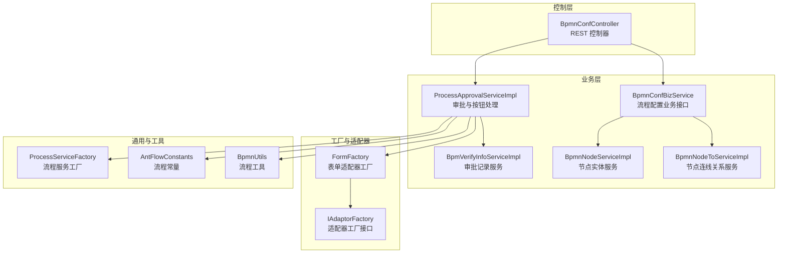
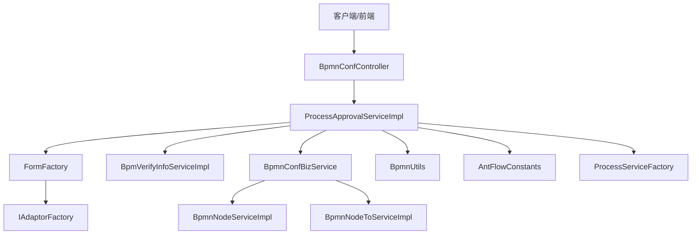
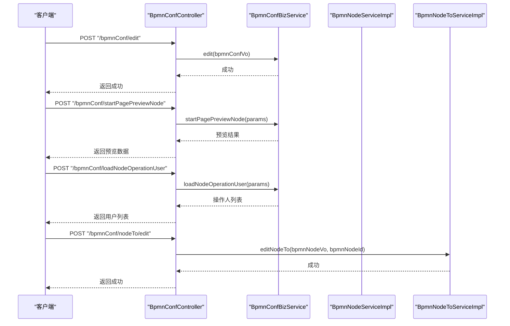
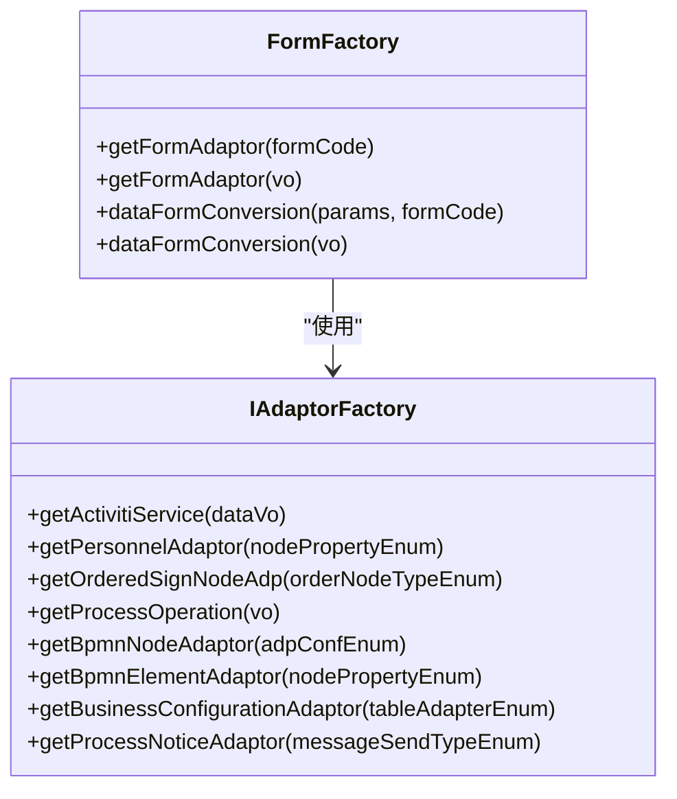
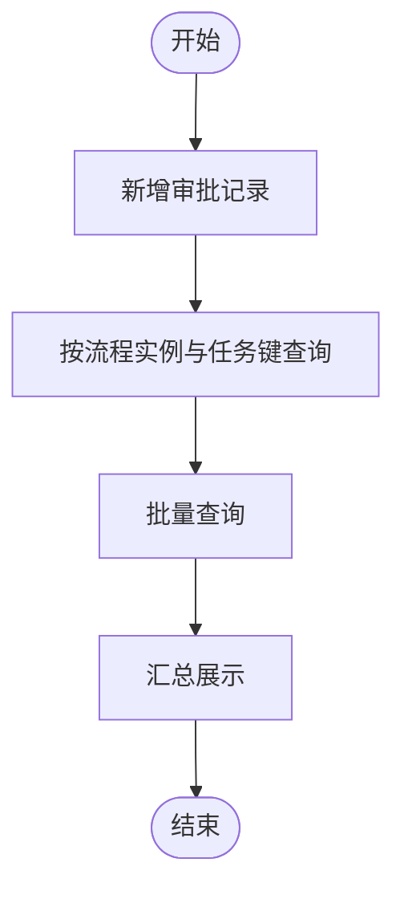
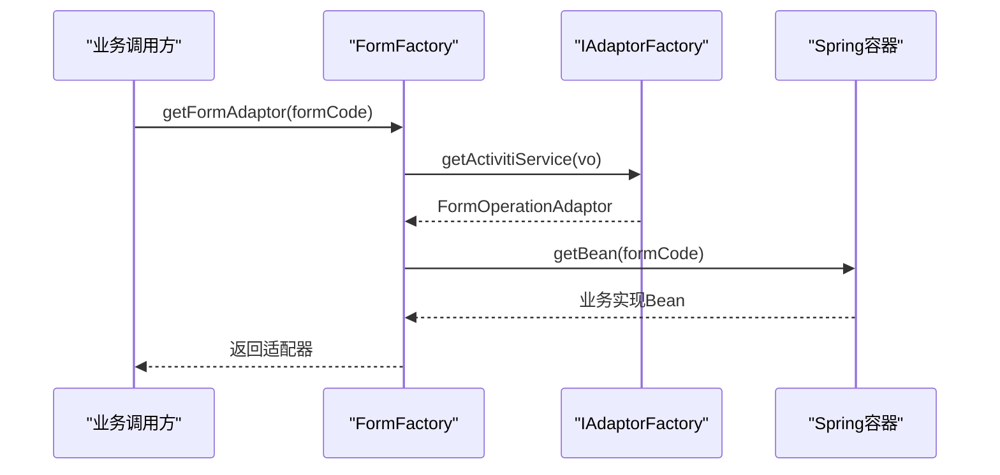
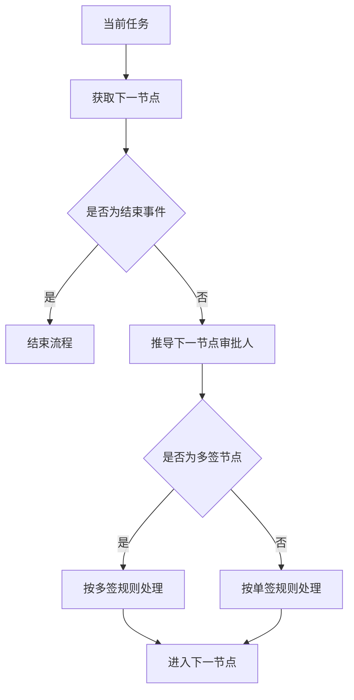
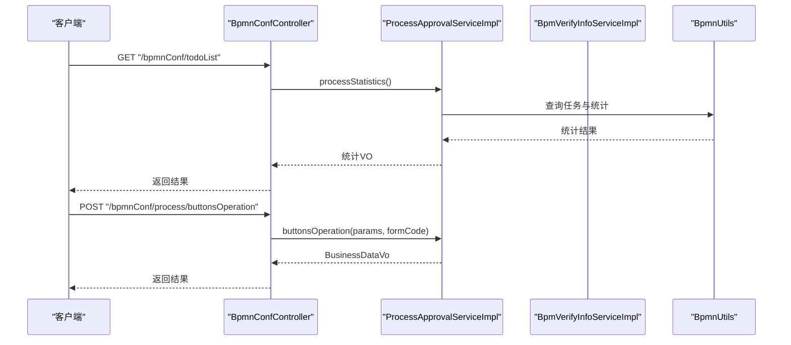
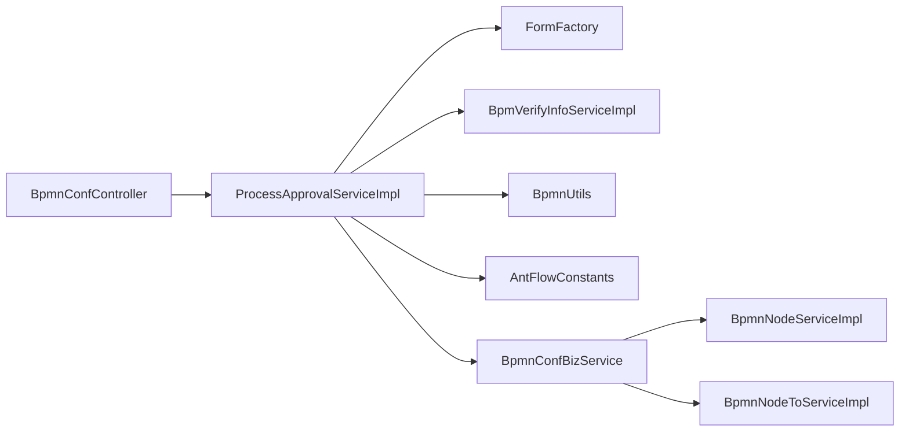

# antflow-engine 核心引擎模块

<cite>
**本文档引用的文件**
- [BpmnConfController.java](file://antflow-engine/src/main/java/org/openoa/engine/bpmnconf/controller/BpmnConfController.java)
- [FormFactory.java](file://antflow-engine/src/main/java/org/openoa/engine/factory/FormFactory.java)
- [IAdaptorFactory.java](file://antflow-engine/src/main/java/org/openoa/engine/factory/IAdaptorFactory.java)
- [ProcessServiceFactory.java](file://antflow-engine/src/main/java/org/openoa/engine/bpmnconf/common/ProcessServiceFactory.java)
- [AntFlowConstants.java](file://antflow-engine/src/main/java/org/openoa/engine/bpmnconf/constant/AntFlowConstants.java)
- [BpmnConfBizService.java](file://antflow-engine/src/main/java/org/openoa/engine/bpmnconf/service/interf/biz/BpmnConfBizService.java)
- [ProcessApprovalServiceImpl.java](file://antflow-engine/src/main/java/org/openoa/engine/bpmnconf/service/biz/ProcessApprovalServiceImpl.java)
- [BpmVerifyInfoServiceImpl.java](file://antflow-engine/src/main/java/org/openoa/engine/bpmnconf/service/impl/BpmVerifyInfoServiceImpl.java)
- [BpmnNodeServiceImpl.java](file://antflow-engine/src/main/java/org/openoa/engine/bpmnconf/service/impl/BpmnNodeServiceImpl.java)
- [BpmnNodeToServiceImpl.java](file://antflow-engine/src/main/java/org/openoa/engine/bpmnconf/service/impl/BpmnNodeToServiceImpl.java)
- [BpmnUtils.java](file://antflow-engine/src/main/java/org/openoa/engine/utils/BpmnUtils.java)
</cite>

## 目录
1. [简介](#简介)
2. [项目结构](#项目结构)
3. [核心组件](#核心组件)
4. [架构总览](#架构总览)
5. [详细组件分析](#详细组件分析)
6. [依赖关系分析](#依赖关系分析)
7. [性能考虑](#性能考虑)
8. [故障排除指南](#故障排除指南)
9. [结论](#结论)
10. [附录](#附录)

## 简介
本文件面向 antflow-engine 核心引擎模块，系统性阐述其作为工作流系统核心业务逻辑的实现架构。重点覆盖以下方面：
- BPMN 配置系统（bpmnconf 包）：流程配置、节点关系、流程发布与预览、审批记录与按钮控制等。
- 低代码表单引擎（lowflow 包）：通过表单适配器与工厂模式对接低代码流程，实现动态表单数据转换与业务适配。
- 服务实现（service.impl 包）：围绕流程运行时、审批记录、节点关系等的仓储与业务实现。
- 工厂模式（factory 包）：统一获取表单适配器、人员适配器、流程通知适配器等，支撑可插拔扩展。
- 虚拟节点系统：基于流程变量与节点属性的动态决策与路由。
- 流程验证机制：流程状态、按钮权限、节点可操作性检查。
- 任务流控制逻辑：按钮前置处理、任务查询与统计、流程状态流转。
- 数据持久化策略：MyBatis-Plus 仓储层、多租户与安全上下文注入。

## 项目结构
antflow-engine 采用分层+功能域混合组织方式：
- 控制层：bpmnconf.controller 提供 REST 接口，承载流程配置、审批列表、按钮操作等入口。
- 业务层：bpmnconf.service.biz 与 bpmnconf.service.impl 实现流程审批、配置编辑、节点关系维护、审批记录等。
- 配置与常量：bpmnconf.common、bpmnconf.constant 提供流程工厂、常量定义与通用配置。
- 工厂与适配器：factory 包提供表单、人员、流程通知等适配器工厂，支持注解驱动的自动解析与代理。
- 工具与辅助：utils 提供流程工具方法，如下一节点计算、多签判断、外部流程识别等。
- Mapper/XML：resources/mapper 提供 SQL 映射，支撑分页查询、审批记录、流程变量等。

图表来源
- [BpmnConfController.java:1-191](file://antflow-engine/src/main/java/org/openoa/engine/bpmnconf/controller/BpmnConfController.java#L1-L191)
- [ProcessApprovalServiceImpl.java:1-342](file://antflow-engine/src/main/java/org/openoa/engine/bpmnconf/service/biz/ProcessApprovalServiceImpl.java#L1-L342)
- [FormFactory.java:1-159](file://antflow-engine/src/main/java/org/openoa/engine/factory/FormFactory.java#L1-L159)
- [IAdaptorFactory.java:1-53](file://antflow-engine/src/main/java/org/openoa/engine/factory/IAdaptorFactory.java#L1-L53)
- [ProcessServiceFactory.java:1-67](file://antflow-engine/src/main/java/org/openoa/engine/bpmnconf/common/ProcessServiceFactory.java#L1-L67)
- [AntFlowConstants.java:1-92](file://antflow-engine/src/main/java/org/openoa/engine/bpmnconf/constant/AntFlowConstants.java#L1-L92)
- [BpmnUtils.java:1-235](file://antflow-engine/src/main/java/org/openoa/engine/utils/BpmnUtils.java#L1-L235)

章节来源
- [BpmnConfController.java:1-191](file://antflow-engine/src/main/java/org/openoa/engine/bpmnconf/controller/BpmnConfController.java#L1-L191)
- [ProcessServiceFactory.java:1-67](file://antflow-engine/src/main/java/org/openoa/engine/bpmnconf/common/ProcessServiceFactory.java#L1-L67)
- [AntFlowConstants.java:1-92](file://antflow-engine/src/main/java/org/openoa/engine/bpmnconf/constant/AntFlowConstants.java#L1-L92)

## 核心组件
- 控制器层：BpmnConfController 提供流程配置编辑、列表分页、预览、审批按钮操作、流程列表查询等接口，统一返回 Result 包装结果。
- 业务服务层：
  - ProcessApprovalServiceImpl：负责按钮前置处理、PC 端流程列表分页查询、业务数据加载、按钮权限与状态设置、统计信息等。
  - BpmVerifyInfoServiceImpl：负责审批记录的新增、按流程实例与任务键查询、批量查询与汇总展示。
  - BpmnConfBizService：流程配置业务接口，定义流程编辑、预览、生效、分页查询、节点用户加载等契约。
  - BpmnNodeServiceImpl / BpmnNodeToServiceImpl：节点实体与节点连线关系的仓储实现。
- 工厂与适配器：
  - FormFactory：根据表单编码获取对应表单适配器，支持外部访问与低代码流程标识的数据转换。
  - IAdaptorFactory：统一声明各类适配器获取方法，结合注解实现自动解析与代理。
- 通用与工具：
  - ProcessServiceFactory：聚合 Activiti 引擎服务与自研仓储服务，作为流程相关服务的工厂基类。
  - AntFlowConstants：集中定义流程节点类型、任务类型、系统变量键等常量。
  - BpmnUtils：提供下一节点计算、审批人推导、多签判断、外部流程识别、环境变量读取等工具方法。

章节来源
- [BpmnConfController.java:1-191](file://antflow-engine/src/main/java/org/openoa/engine/bpmnconf/controller/BpmnConfController.java#L1-L191)
- [ProcessApprovalServiceImpl.java:1-342](file://antflow-engine/src/main/java/org/openoa/engine/bpmnconf/service/biz/ProcessApprovalServiceImpl.java#L1-L342)
- [BpmVerifyInfoServiceImpl.java:1-106](file://antflow-engine/src/main/java/org/openoa/engine/bpmnconf/service/impl/BpmVerifyInfoServiceImpl.java#L1-L106)
- [BpmnConfBizService.java:1-52](file://antflow-engine/src/main/java/org/openoa/engine/bpmnconf/service/interf/biz/BpmnConfBizService.java#L1-L52)
- [BpmnNodeServiceImpl.java:1-13](file://antflow-engine/src/main/java/org/openoa/engine/bpmnconf/service/impl/BpmnNodeServiceImpl.java#L1-L13)
- [BpmnNodeToServiceImpl.java:1-48](file://antflow-engine/src/main/java/org/openoa/engine/bpmnconf/service/impl/BpmnNodeToServiceImpl.java#L1-L48)
- [FormFactory.java:1-159](file://antflow-engine/src/main/java/org/openoa/engine/factory/FormFactory.java#L1-L159)
- [IAdaptorFactory.java:1-53](file://antflow-engine/src/main/java/org/openoa/engine/factory/IAdaptorFactory.java#L1-L53)
- [ProcessServiceFactory.java:1-67](file://antflow-engine/src/main/java/org/openoa/engine/bpmnconf/common/ProcessServiceFactory.java#L1-L67)
- [AntFlowConstants.java:1-92](file://antflow-engine/src/main/java/org/openoa/engine/bpmnconf/constant/AntFlowConstants.java#L1-L92)
- [BpmnUtils.java:1-235](file://antflow-engine/src/main/java/org/openoa/engine/utils/BpmnUtils.java#L1-L235)

## 架构总览
核心引擎以“控制器-业务-工厂-工具-仓储”分层组织，配合注解驱动的适配器工厂实现低耦合扩展；流程运行时通过 ProcessServiceFactory 聚合 Activiti 服务与自研仓储，保证跨模块协作的一致性。

图表来源
- [BpmnConfController.java:1-191](file://antflow-engine/src/main/java/org/openoa/engine/bpmnconf/controller/BpmnConfController.java#L1-L191)
- [ProcessApprovalServiceImpl.java:1-342](file://antflow-engine/src/main/java/org/openoa/engine/bpmnconf/service/biz/ProcessApprovalServiceImpl.java#L1-L342)
- [FormFactory.java:1-159](file://antflow-engine/src/main/java/org/openoa/engine/factory/FormFactory.java#L1-L159)
- [IAdaptorFactory.java:1-53](file://antflow-engine/src/main/java/org/openoa/engine/factory/IAdaptorFactory.java#L1-L53)
- [BpmVerifyInfoServiceImpl.java:1-106](file://antflow-engine/src/main/java/org/openoa/engine/bpmnconf/service/impl/BpmVerifyInfoServiceImpl.java#L1-L106)
- [BpmnConfBizService.java:1-52](file://antflow-engine/src/main/java/org/openoa/engine/bpmnconf/service/interf/biz/BpmnConfBizService.java#L1-L52)
- [BpmnNodeServiceImpl.java:1-13](file://antflow-engine/src/main/java/org/openoa/engine/bpmnconf/service/impl/BpmnNodeServiceImpl.java#L1-L13)
- [BpmnNodeToServiceImpl.java:1-48](file://antflow-engine/src/main/java/org/openoa/engine/bpmnconf/service/impl/BpmnNodeToServiceImpl.java#L1-L48)
- [BpmnUtils.java:1-235](file://antflow-engine/src/main/java/org/openoa/engine/utils/BpmnUtils.java#L1-L235)
- [ProcessServiceFactory.java:1-67](file://antflow-engine/src/main/java/org/openoa/engine/bpmnconf/common/ProcessServiceFactory.java#L1-L67)
- [AntFlowConstants.java:1-92](file://antflow-engine/src/main/java/org/openoa/engine/bpmnconf/constant/AntFlowConstants.java#L1-L92)

## 详细组件分析

### BPMN 配置系统（bpmnconf 包）
- 流程配置编辑与发布：BpmnConfController 提供编辑接口，调用 BpmnConfBizService 完成配置保存与生效。
- 预览与详情：支持流程设计预览、启动页与任务页预览、节点当前操作人加载。
- 审批记录与按钮权限：通过 ProcessApprovalServiceImpl 加载业务数据，结合按钮权限常量与流程状态生成按钮集合。
- 节点关系维护：BpmnNodeToServiceImpl 负责节点连线关系的批量写入与清理。

图表来源
- [BpmnConfController.java:1-191](file://antflow-engine/src/main/java/org/openoa/engine/bpmnconf/controller/BpmnConfController.java#L1-L191)
- [BpmnConfBizService.java:1-52](file://antflow-engine/src/main/java/org/openoa/engine/bpmnconf/service/interf/biz/BpmnConfBizService.java#L1-L52)
- [BpmnNodeToServiceImpl.java:1-48](file://antflow-engine/src/main/java/org/openoa/engine/bpmnconf/service/impl/BpmnNodeToServiceImpl.java#L1-L48)

章节来源
- [BpmnConfController.java:1-191](file://antflow-engine/src/main/java/org/openoa/engine/bpmnconf/controller/BpmnConfController.java#L1-L191)
- [BpmnConfBizService.java:1-52](file://antflow-engine/src/main/java/org/openoa/engine/bpmnconf/service/interf/biz/BpmnConfBizService.java#L1-L52)
- [BpmnNodeToServiceImpl.java:1-48](file://antflow-engine/src/main/java/org/openoa/engine/bpmnconf/service/impl/BpmnNodeToServiceImpl.java#L1-L48)

### 低代码表单引擎（lowflow 包）
- 表单适配器工厂：FormFactory 根据表单编码获取 FormOperationAdaptor，支持外部访问流程与低代码流程标识的数据转换，并通过反射与泛型解析目标业务对象类型。
- 适配器工厂接口：IAdaptorFactory 统一声明各类适配器获取方法，结合注解实现自动解析与代理，便于扩展新的表单或流程适配器。

图表来源
- [FormFactory.java:1-159](file://antflow-engine/src/main/java/org/openoa/engine/factory/FormFactory.java#L1-L159)
- [IAdaptorFactory.java:1-53](file://antflow-engine/src/main/java/org/openoa/engine/factory/IAdaptorFactory.java#L1-L53)

章节来源
- [FormFactory.java:1-159](file://antflow-engine/src/main/java/org/openoa/engine/factory/FormFactory.java#L1-L159)
- [IAdaptorFactory.java:1-53](file://antflow-engine/src/main/java/org/openoa/engine/factory/IAdaptorFactory.java#L1-L53)

### 服务实现（service.impl 包）
- 审批记录服务：BpmVerifyInfoServiceImpl 提供审批记录的新增、按流程实例与任务键查询、批量查询与汇总展示，支持多租户与安全上下文注入。
- 节点与连线服务：BpmnNodeServiceImpl 与 BpmnNodeToServiceImpl 分别负责节点实体与节点连线关系的仓储操作，支持批量写入与清理。

图表来源
- [BpmVerifyInfoServiceImpl.java:1-106](file://antflow-engine/src/main/java/org/openoa/engine/bpmnconf/service/impl/BpmVerifyInfoServiceImpl.java#L1-L106)

章节来源
- [BpmVerifyInfoServiceImpl.java:1-106](file://antflow-engine/src/main/java/org/openoa/engine/bpmnconf/service/impl/BpmVerifyInfoServiceImpl.java#L1-L106)
- [BpmnNodeServiceImpl.java:1-13](file://antflow-engine/src/main/java/org/openoa/engine/bpmnconf/service/impl/BpmnNodeServiceImpl.java#L1-L13)
- [BpmnNodeToServiceImpl.java:1-48](file://antflow-engine/src/main/java/org/openoa/engine/bpmnconf/service/impl/BpmnNodeToServiceImpl.java#L1-L48)

### 工厂模式（factory 包）
- 适配器工厂：IAdaptorFactory 统一声明各类适配器获取方法，结合注解实现自动解析与代理。
- 表单工厂：FormFactory 根据表单编码获取 FormOperationAdaptor，支持外部访问流程与低代码流程标识的数据转换，并通过反射与泛型解析目标业务对象类型。

图表来源
- [FormFactory.java:1-159](file://antflow-engine/src/main/java/org/openoa/engine/factory/FormFactory.java#L1-L159)
- [IAdaptorFactory.java:1-53](file://antflow-engine/src/main/java/org/openoa/engine/factory/IAdaptorFactory.java#L1-L53)

章节来源
- [FormFactory.java:1-159](file://antflow-engine/src/main/java/org/openoa/engine/factory/FormFactory.java#L1-L159)
- [IAdaptorFactory.java:1-53](file://antflow-engine/src/main/java/org/openoa/engine/factory/IAdaptorFactory.java#L1-L53)

### 虚拟节点系统与流程验证机制
- 虚拟节点：AntFlowConstants 定义了多种节点类型与系统变量键，用于流程中的动态路由与状态标记。
- 流程验证：BpmnUtils 提供下一节点计算、审批人推导、多签判断、外部流程识别等功能，支撑流程验证与控制逻辑。

图表来源
- [AntFlowConstants.java:1-92](file://antflow-engine/src/main/java/org/openoa/engine/bpmnconf/constant/AntFlowConstants.java#L1-L92)
- [BpmnUtils.java:1-235](file://antflow-engine/src/main/java/org/openoa/engine/utils/BpmnUtils.java#L1-L235)

章节来源
- [AntFlowConstants.java:1-92](file://antflow-engine/src/main/java/org/openoa/engine/bpmnconf/constant/AntFlowConstants.java#L1-L92)
- [BpmnUtils.java:1-235](file://antflow-engine/src/main/java/org/openoa/engine/utils/BpmnUtils.java#L1-L235)

### 任务流控制逻辑与数据持久化策略
- 任务流控制：ProcessApprovalServiceImpl 负责按钮前置处理、PC 端流程列表分页查询、业务数据加载、按钮权限与状态设置、统计信息等。
- 数据持久化：MyBatis-Plus 仓储层（ServiceImpl）统一处理增删改查，结合多租户与安全上下文注入，确保数据隔离与安全性。

图表来源
- [BpmnConfController.java:1-191](file://antflow-engine/src/main/java/org/openoa/engine/bpmnconf/controller/BpmnConfController.java#L1-L191)
- [ProcessApprovalServiceImpl.java:1-342](file://antflow-engine/src/main/java/org/openoa/engine/bpmnconf/service/biz/ProcessApprovalServiceImpl.java#L1-L342)
- [BpmnUtils.java:1-235](file://antflow-engine/src/main/java/org/openoa/engine/utils/BpmnUtils.java#L1-L235)

章节来源
- [BpmnConfController.java:1-191](file://antflow-engine/src/main/java/org/openoa/engine/bpmnconf/controller/BpmnConfController.java#L1-L191)
- [ProcessApprovalServiceImpl.java:1-342](file://antflow-engine/src/main/java/org/openoa/engine/bpmnconf/service/biz/ProcessApprovalServiceImpl.java#L1-L342)
- [BpmnUtils.java:1-235](file://antflow-engine/src/main/java/org/openoa/engine/utils/BpmnUtils.java#L1-L235)

## 依赖关系分析
- 控制器依赖业务服务：BpmnConfController 注入 ProcessApprovalServiceImpl、BpmnConfBizService 等，形成清晰的调用链。
- 业务服务依赖工厂与工具：ProcessApprovalServiceImpl 依赖 FormFactory、BpmnUtils、AntFlowConstants 等，实现表单数据转换、流程工具与常量使用。
- 仓储服务依赖 MyBatis-Plus：BpmVerifyInfoServiceImpl、BpmnNodeServiceImpl、BpmnNodeToServiceImpl 均继承自 ServiceImpl，统一使用条件构造器与批量操作。

图表来源
- [BpmnConfController.java:1-191](file://antflow-engine/src/main/java/org/openoa/engine/bpmnconf/controller/BpmnConfController.java#L1-L191)
- [ProcessApprovalServiceImpl.java:1-342](file://antflow-engine/src/main/java/org/openoa/engine/bpmnconf/service/biz/ProcessApprovalServiceImpl.java#L1-L342)
- [FormFactory.java:1-159](file://antflow-engine/src/main/java/org/openoa/engine/factory/FormFactory.java#L1-L159)
- [BpmVerifyInfoServiceImpl.java:1-106](file://antflow-engine/src/main/java/org/openoa/engine/bpmnconf/service/impl/BpmVerifyInfoServiceImpl.java#L1-L106)
- [BpmnConfBizService.java:1-52](file://antflow-engine/src/main/java/org/openoa/engine/bpmnconf/service/interf/biz/BpmnConfBizService.java#L1-L52)
- [BpmnNodeServiceImpl.java:1-13](file://antflow-engine/src/main/java/org/openoa/engine/bpmnconf/service/impl/BpmnNodeServiceImpl.java#L1-L13)
- [BpmnNodeToServiceImpl.java:1-48](file://antflow-engine/src/main/java/org/openoa/engine/bpmnconf/service/impl/BpmnNodeToServiceImpl.java#L1-L48)
- [BpmnUtils.java:1-235](file://antflow-engine/src/main/java/org/openoa/engine/utils/BpmnUtils.java#L1-L235)
- [AntFlowConstants.java:1-92](file://antflow-engine/src/main/java/org/openoa/engine/bpmnconf/constant/AntFlowConstants.java#L1-L92)

章节来源
- [BpmnConfController.java:1-191](file://antflow-engine/src/main/java/org/openoa/engine/bpmnconf/controller/BpmnConfController.java#L1-L191)
- [ProcessApprovalServiceImpl.java:1-342](file://antflow-engine/src/main/java/org/openoa/engine/bpmnconf/service/biz/ProcessApprovalServiceImpl.java#L1-L342)
- [FormFactory.java:1-159](file://antflow-engine/src/main/java/org/openoa/engine/factory/FormFactory.java#L1-L159)
- [BpmnConfBizService.java:1-52](file://antflow-engine/src/main/java/org/openoa/engine/bpmnconf/service/interf/biz/BpmnConfBizService.java#L1-L52)
- [BpmnNodeServiceImpl.java:1-13](file://antflow-engine/src/main/java/org/openoa/engine/bpmnconf/service/impl/BpmnNodeServiceImpl.java#L1-L13)
- [BpmnNodeToServiceImpl.java:1-48](file://antflow-engine/src/main/java/org/openoa/engine/bpmnconf/service/impl/BpmnNodeToServiceImpl.java#L1-L48)
- [BpmnUtils.java:1-235](file://antflow-engine/src/main/java/org/openoa/engine/utils/BpmnUtils.java#L1-L235)
- [AntFlowConstants.java:1-92](file://antflow-engine/src/main/java/org/openoa/engine/bpmnconf/constant/AntFlowConstants.java#L1-L92)

## 性能考虑
- 分页查询：ProcessApprovalServiceImpl 使用 MyBatis-Plus 分页插件，结合排序字段映射，减少一次性加载大量数据。
- 批量操作：BpmnNodeToServiceImpl 使用批量保存，降低数据库往返次数。
- 缓存与延迟：FormFactory 对部分服务使用延迟加载，避免循环依赖与初始化开销。
- 多租户与安全上下文：通过工具类注入当前租户与登录用户信息，避免重复查询与线程安全问题。

## 故障排除指南
- 表单适配器缺失：当表单编码未关联处理 Bean 或未关联实现类泛型时，FormFactory 抛出异常，需检查表单编码与适配器注册。
- 审批记录查询异常：当流程编号为空或任务键为空时，BpmVerifyInfoServiceImpl 抛出异常，需确认传参与流程实例状态。
- 按钮权限异常：ProcessApprovalServiceImpl 在加载业务数据时若找不到流程记录，抛出异常，需确认流程编号与业务数据一致性。
- 外部流程与低代码流程：FormFactory 支持外部访问与低代码标识的数据转换，若出现字段丢失或隐藏，需检查低代码字段权限配置。

章节来源
- [FormFactory.java:1-159](file://antflow-engine/src/main/java/org/openoa/engine/factory/FormFactory.java#L1-L159)
- [BpmVerifyInfoServiceImpl.java:1-106](file://antflow-engine/src/main/java/org/openoa/engine/bpmnconf/service/impl/BpmVerifyInfoServiceImpl.java#L1-L106)
- [ProcessApprovalServiceImpl.java:1-342](file://antflow-engine/src/main/java/org/openoa/engine/bpmnconf/service/biz/ProcessApprovalServiceImpl.java#L1-L342)

## 结论
antflow-engine 核心引擎模块通过清晰的分层与工厂化设计，实现了 BPMN 配置、低代码表单、流程审批与工具方法的有机整合。其以注解驱动的适配器工厂为核心扩展点，结合 MyBatis-Plus 的仓储层与多租户安全上下文，提供了稳定、可扩展且易于维护的工作流核心能力。

## 附录
- 关键接口与实现路径参考：
  - [BpmnConfController.java](file://antflow-engine/src/main/java/org/openoa/engine/bpmnconf/controller/BpmnConfController.java)
  - [ProcessApprovalServiceImpl.java](file://antflow-engine/src/main/java/org/openoa/engine/bpmnconf/service/biz/ProcessApprovalServiceImpl.java)
  - [FormFactory.java](file://antflow-engine/src/main/java/org/openoa/engine/factory/FormFactory.java)
  - [IAdaptorFactory.java](file://antflow-engine/src/main/java/org/openoa/engine/factory/IAdaptorFactory.java)
  - [BpmVerifyInfoServiceImpl.java](file://antflow-engine/src/main/java/org/openoa/engine/bpmnconf/service/impl/BpmVerifyInfoServiceImpl.java)
  - [BpmnConfBizService.java](file://antflow-engine/src/main/java/org/openoa/engine/bpmnconf/service/interf/biz/BpmnConfBizService.java)
  - [BpmnNodeServiceImpl.java](file://antflow-engine/src/main/java/org/openoa/engine/bpmnconf/service/impl/BpmnNodeServiceImpl.java)
  - [BpmnNodeToServiceImpl.java](file://antflow-engine/src/main/java/org/openoa/engine/bpmnconf/service/impl/BpmnNodeToServiceImpl.java)
  - [BpmnUtils.java](file://antflow-engine/src/main/java/org/openoa/engine/utils/BpmnUtils.java)
  - [ProcessServiceFactory.java](file://antflow-engine/src/main/java/org/openoa/engine/bpmnconf/common/ProcessServiceFactory.java)
  - [AntFlowConstants.java](file://antflow-engine/src/main/java/org/openoa/engine/bpmnconf/constant/AntFlowConstants.java)