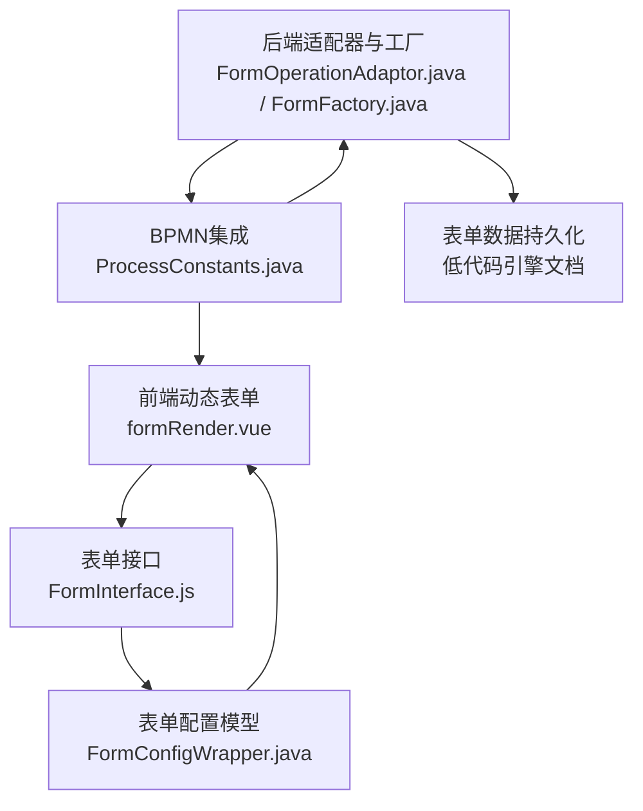
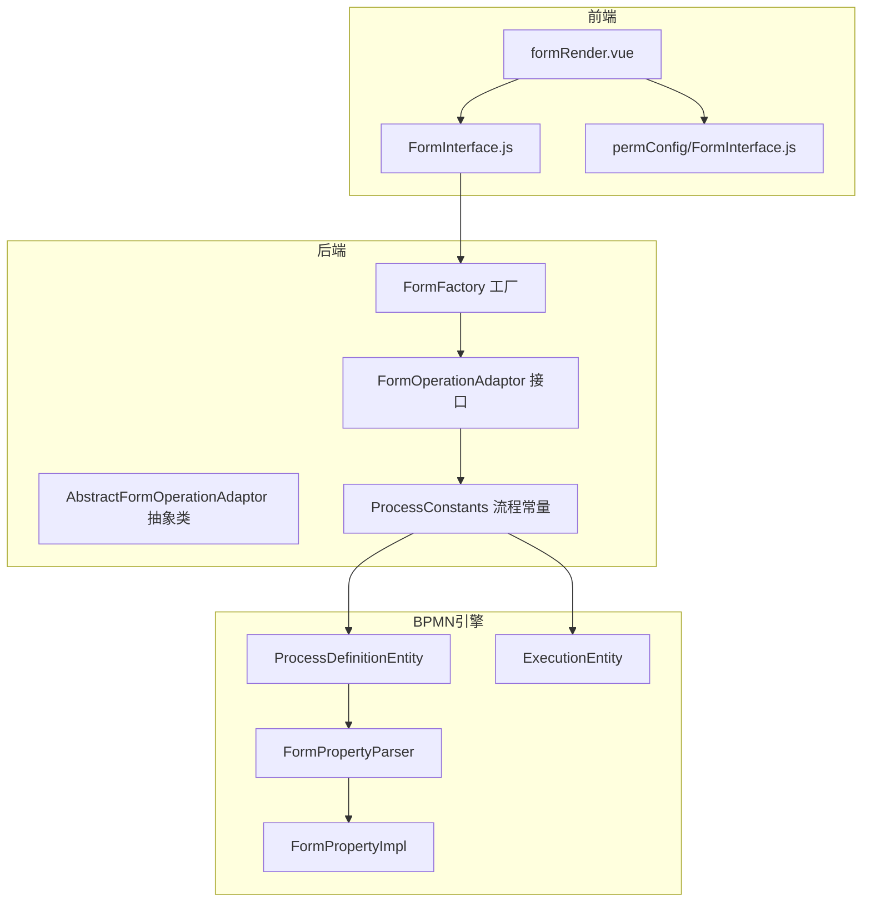
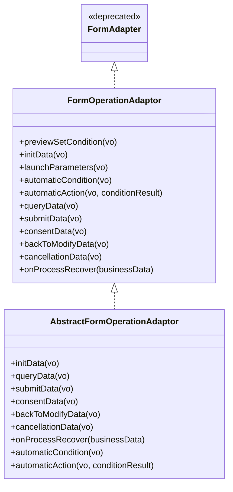
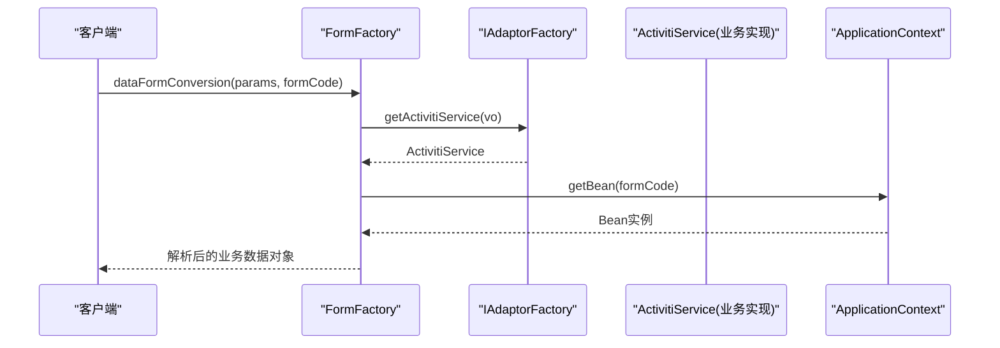
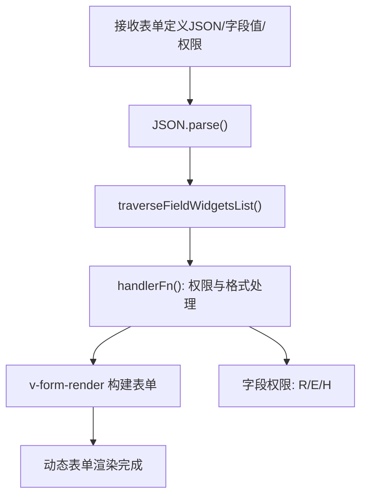
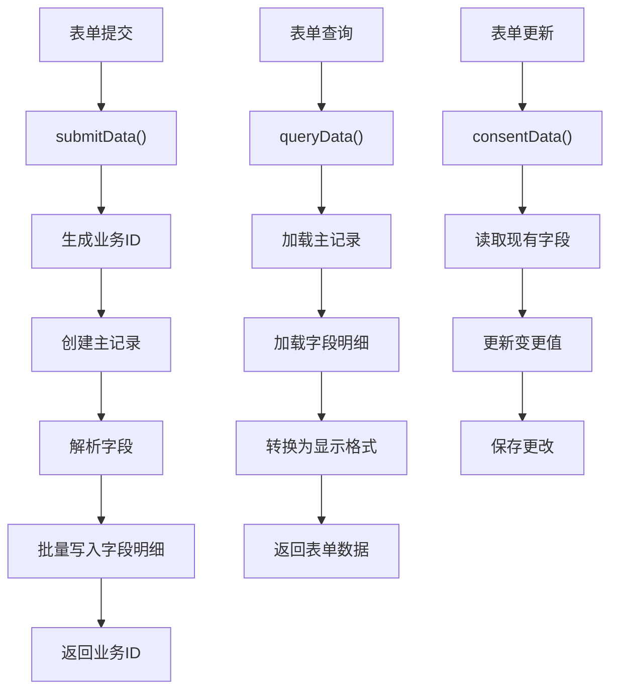
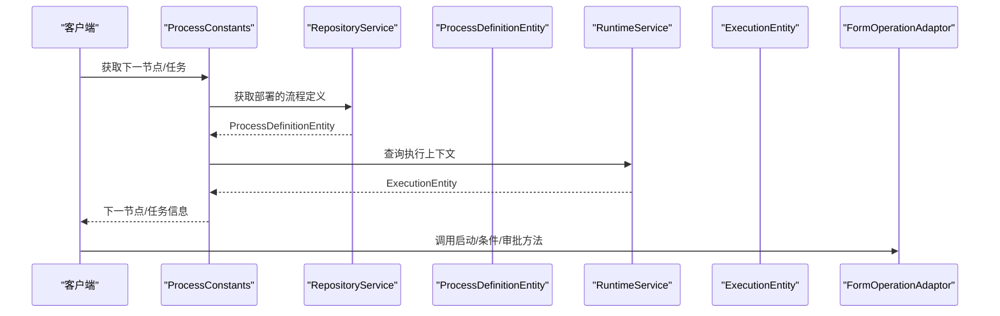
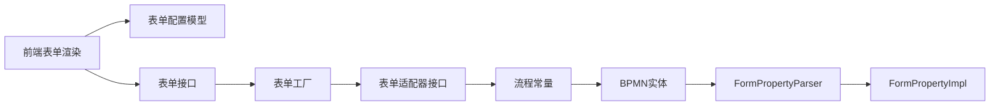

# 低代码表单引擎

<cite>
**本文引用的文件**   
- [FormFactory.java](file://antflow-engine/src/main/java/org/openoa/engine/factory/FormFactory.java)
- [FormAdapter.java](file://antflow-engine/src/main/java/org/openoa/engine/bpmnconf/adp/FormAdapter.java)
- [AbstractFormOperationAdaptor.java](file://antflow-engine/src/main/java/org/openoa/engine/bpmnconf/adp/processoperation/AbstractFormOperationAdaptor.java)
- [FormOperationAdaptor.java](file://antflow-base/src/main/java/org/openoa/base/interf/FormOperationAdaptor.java)
- [FormConfigWrapper.java](file://antflow-base/src/main/java/org/openoa/base/vo/FormConfigWrapper.java)
- [formRender.vue](file://antflow-vue/src/components/Workflow/DynamicForm/formRender.vue)
- [FormInterface.js](file://antflow-vue/src/components/Workflow/config/FormInterface.js)
- [permConfig/FormInterface.js](file://antflow-vue/src/components/Workflow/drawer/permConfig/FormInterface.js)
- [ProcessConstants.java](file://antflow-engine/src/main/java/org/openoa/engine/bpmnconf/common/ProcessConstants.java)
- [12.Rest控制器.md](file://doc/系统介绍篇/12.Rest控制器.md)
- [9.低代码引擎.md](file://doc/系统介绍篇/9.低代码引擎.md)
- [4.后端系统.md](file://doc/系统介绍篇/4.后端系统.md)
- [16.dashboard和任务管理.md](file://doc/系统介绍篇/16.dashboard和任务管理.md)
- [FormPropertyParser.java](file://antflow-base/src/main/java/org/activiti/bpmn/converter/child/FormPropertyParser.java)
- [FormPropertyImpl.java](file://antflow-base/src/main/java/org/activiti/engine/impl/form/FormPropertyImpl.java)
- [ProcessDefinitionEntity.java](file://antflow-base/src/main/java/org/activiti/engine/impl/persistence/entity/ProcessDefinitionEntity.java)
- [ExecutionEntity.java](file://antflow-base/src/main/java/org/activiti/engine/impl/persistence/entity/ExecutionEntity.java)
</cite>

## 目录
1. [简介](#简介)
2. [项目结构](#项目结构)
3. [核心组件](#核心组件)
4. [架构总览](#架构总览)
5. [详细组件分析](#详细组件分析)
6. [依赖分析](#依赖分析)
7. [性能考虑](#性能考虑)
8. [故障排查指南](#故障排查指南)
9. [结论](#结论)
10. [附录](#附录)

## 简介
本技术文档面向低代码表单引擎，系统性阐述其设计理念与实现架构，覆盖表单代码管理系统、动态表单字段处理机制、表单数据持久化策略、与BPMN配置的集成方式、动态渲染逻辑、验证规则实现、表单适配器模式、字段控制处理器以及表单生命周期管理。文档同时提供关键流程的序列图与类图，帮助读者快速理解并落地实践。

## 项目结构
低代码表单引擎由“前端动态表单渲染”、“后端表单适配器与工厂”、“BPMN集成与流程控制”、“表单配置与字段模型”四大层面构成，前后端协同完成从表单设计、运行时渲染、数据持久化到流程编排的全链路能力。

**图表来源**
- [formRender.vue:62-98](file://antflow-vue/src/components/Workflow/DynamicForm/formRender.vue#L62-L98)
- [FormInterface.js:1-55](file://antflow-vue/src/components/Workflow/config/FormInterface.js#L1-L55)
- [permConfig/FormInterface.js:1-55](file://antflow-vue/src/components/Workflow/drawer/permConfig/FormInterface.js#L1-L55)
- [FormConfigWrapper.java:1-94](file://antflow-base/src/main/java/org/openoa/base/vo/FormConfigWrapper.java#L1-L94)
- [FormOperationAdaptor.java:1-106](file://antflow-base/src/main/java/org/openoa/base/interf/FormOperationAdaptor.java#L1-L106)
- [FormFactory.java:1-159](file://antflow-engine/src/main/java/org/openoa/engine/factory/FormFactory.java#L1-L159)
- [ProcessConstants.java:1-158](file://antflow-engine/src/main/java/org/openoa/engine/bpmnconf/common/ProcessConstants.java#L1-L158)

**章节来源**
- [12.Rest控制器.md:103-173](file://doc/系统介绍篇/12.Rest控制器.md#L103-L173)
- [9.低代码引擎.md:175-229](file://doc/系统介绍篇/9.低代码引擎.md#L175-L229)

## 核心组件
- 表单适配器接口：统一抽象业务表单与流程引擎的交互契约，定义生命周期方法与启动参数、条件评估、自动条件与动作等扩展点。
- 表单工厂：负责根据表单代码解析请求参数、定位业务实现类、装配具体业务数据对象。
- 动态表单渲染：前端基于表单配置与字段权限，动态生成可交互的表单UI。
- BPMN集成：通过流程常量工具与BPMN实体，打通流程启动、路由条件、任务处理与流程恢复等环节。
- 表单配置模型：封装字段类型、布局、校验规则、事件回调等元数据，支撑低代码表单的可视化与可编程。

**章节来源**
- [FormOperationAdaptor.java:1-106](file://antflow-base/src/main/java/org/openoa/base/interf/FormOperationAdaptor.java#L1-L106)
- [FormFactory.java:1-159](file://antflow-engine/src/main/java/org/openoa/engine/factory/FormFactory.java#L1-L159)
- [FormConfigWrapper.java:1-94](file://antflow-base/src/main/java/org/openoa/base/vo/FormConfigWrapper.java#L1-L94)
- [ProcessConstants.java:1-158](file://antflow-engine/src/main/java/org/openoa/engine/bpmnconf/common/ProcessConstants.java#L1-L158)

## 架构总览
低代码表单引擎采用“适配器+工厂+前端渲染+BPMN集成”的分层架构。前端负责表单的动态渲染与交互；后端通过适配器对接不同业务流程，工厂负责参数解析与Bean装配；BPMN集成层提供流程启动、路由与状态管理；配置模型贯穿设计期与运行期，确保表单的可扩展与可演进。

**图表来源**
- [formRender.vue:62-98](file://antflow-vue/src/components/Workflow/DynamicForm/formRender.vue#L62-L98)
- [FormInterface.js:1-55](file://antflow-vue/src/components/Workflow/config/FormInterface.js#L1-L55)
- [permConfig/FormInterface.js:1-55](file://antflow-vue/src/components/Workflow/drawer/permConfig/FormInterface.js#L1-L55)
- [FormOperationAdaptor.java:1-106](file://antflow-base/src/main/java/org/openoa/base/interf/FormOperationAdaptor.java#L1-L106)
- [AbstractFormOperationAdaptor.java:1-62](file://antflow-engine/src/main/java/org/openoa/engine/bpmnconf/adp/processoperation/AbstractFormOperationAdaptor.java#L1-L62)
- [FormFactory.java:1-159](file://antflow-engine/src/main/java/org/openoa/engine/factory/FormFactory.java#L1-L159)
- [ProcessConstants.java:1-158](file://antflow-engine/src/main/java/org/openoa/engine/bpmnconf/common/ProcessConstants.java#L1-L158)
- [ProcessDefinitionEntity.java:258-313](file://antflow-base/src/main/java/org/activiti/engine/impl/persistence/entity/ProcessDefinitionEntity.java#L258-L313)
- [ExecutionEntity.java:150-1470](file://antflow-base/src/main/java/org/activiti/engine/impl/persistence/entity/ExecutionEntity.java#L150-L1470)
- [FormPropertyParser.java:1-84](file://antflow-base/src/main/java/org/activiti/bpmn/converter/child/FormPropertyParser.java#L1-L84)
- [FormPropertyImpl.java:39-74](file://antflow-base/src/main/java/org/activiti/engine/impl/form/FormPropertyImpl.java#L39-L74)

## 详细组件分析

### 组件A：表单适配器模式与生命周期
- 设计要点
  - 通过FormOperationAdaptor定义统一的生命周期方法：初始化、提交、查询、审批、退回修改、取消、流程恢复、自动条件与动作等。
  - AbstractFormOperationAdaptor提供默认空实现，便于快速扩展。
  - FormAdapter为历史接口，已标记弃用，建议直接实现FormOperationAdaptor。
- 生命周期管理
  - 启动阶段：launchParameters提供启动参数；previewSetCondition设置路由条件。
  - 运行阶段：initData初始化数据；submitData提交业务数据；consentData处理审批结果。
  - 终止阶段：backToModifyData退回修改；cancellationData取消流程；onProcessRecover流程恢复后的钩子。

**图表来源**
- [FormOperationAdaptor.java:1-106](file://antflow-base/src/main/java/org/openoa/base/interf/FormOperationAdaptor.java#L1-L106)
- [AbstractFormOperationAdaptor.java:1-62](file://antflow-engine/src/main/java/org/openoa/engine/bpmnconf/adp/processoperation/AbstractFormOperationAdaptor.java#L1-L62)
- [FormAdapter.java:1-81](file://antflow-engine/src/main/java/org/openoa/engine/bpmnconf/adp/FormAdapter.java#L1-L81)

**章节来源**
- [FormOperationAdaptor.java:1-106](file://antflow-base/src/main/java/org/openoa/base/interf/FormOperationAdaptor.java#L1-L106)
- [AbstractFormOperationAdaptor.java:1-62](file://antflow-engine/src/main/java/org/openoa/engine/bpmnconf/adp/processoperation/AbstractFormOperationAdaptor.java#L1-L62)
- [FormAdapter.java:1-81](file://antflow-engine/src/main/java/org/openoa/engine/bpmnconf/adp/FormAdapter.java#L1-L81)

### 组件B：表单工厂与参数解析
- 设计要点
  - FormFactory根据表单代码获取对应的ActivitiService实现（即FormOperationAdaptor），并进行参数类型转换与Bean装配。
  - 支持低代码流程标识、外部访问流程的特殊处理，确保请求参数能正确映射到目标业务数据对象。
- 关键流程
  - dataFormConversion：将请求参数解析为目标业务数据对象，必要时替换表单数据。
  - getFormAdaptor：通过适配器工厂定位业务实现Bean。

**图表来源**
- [FormFactory.java:70-123](file://antflow-engine/src/main/java/org/openoa/engine/factory/FormFactory.java#L70-L123)

**章节来源**
- [FormFactory.java:1-159](file://antflow-engine/src/main/java/org/openoa/engine/factory/FormFactory.java#L1-L159)

### 组件C：动态表单字段处理与渲染
- 设计要点
  - 前端formRender.vue接收表单定义JSON、字段值与字段权限，通过遍历与处理器函数动态调整字段可见性、只读状态与格式。
  - FormConfigWrapper定义字段配置结构，包含字段类型、布局、校验规则、事件回调等。
  - 字段权限控制：R（只读）、E（可编辑）、H（隐藏，以掩码显示）。
- 渲染流程
  - 解析JSON → 遍历字段 → 应用权限与格式 → 交由v-form-render构建表单。

**图表来源**
- [formRender.vue:62-98](file://antflow-vue/src/components/Workflow/DynamicForm/formRender.vue#L62-L98)
- [FormConfigWrapper.java:1-94](file://antflow-base/src/main/java/org/openoa/base/vo/FormConfigWrapper.java#L1-L94)
- [FormInterface.js:1-55](file://antflow-vue/src/components/Workflow/config/FormInterface.js#L1-L55)
- [permConfig/FormInterface.js:1-55](file://antflow-vue/src/components/Workflow/drawer/permConfig/FormInterface.js#L1-L55)

**章节来源**
- [formRender.vue:62-98](file://antflow-vue/src/components/Workflow/DynamicForm/formRender.vue#L62-L98)
- [FormConfigWrapper.java:1-94](file://antflow-base/src/main/java/org/openoa/base/vo/FormConfigWrapper.java#L1-L94)
- [16.dashboard和任务管理.md:143-191](file://doc/系统介绍篇/16.dashboard和任务管理.md#L143-L191)

### 组件D：表单数据持久化策略
- 设计要点
  - 低代码引擎将表单数据拆分为“主记录”和“字段明细”，分别存储于主表与字段表，支持多字段类型与复杂布局。
  - 字段类型系统涵盖字符串、数值、日期、长文本、布尔等，不同类型映射到不同的存储列。
- 数据流转
  - 提交流程：生成业务ID → 创建主记录 → 解析字段 → 批量写入字段明细 → 返回业务ID。
  - 查询流程：按业务ID加载主记录与字段明细 → 转换为显示格式 → 返回表单数据。
  - 更新流程：读取现有字段 → 更新变更值 → 保存更改。

**图表来源**
- [4.后端系统.md:447-491](file://doc/系统介绍篇/4.后端系统.md#L447-L491)
- [9.低代码引擎.md:84-131](file://doc/系统介绍篇/9.低代码引擎.md#L84-L131)

**章节来源**
- [4.后端系统.md](file://doc/系统介绍篇/4.447-L491)
- [9.低代码引擎.md:84-131](file://doc/系统介绍篇/9.低代码引擎.md#L84-L131)

### 组件E：与BPMN配置的集成
- 设计要点
  - 通过ProcessConstants获取下一节点、任务查询、历史任务回溯等，支撑流程推进与状态管理。
  - BPMN实体ProcessDefinitionEntity与ExecutionEntity承载流程定义与执行上下文，配合FormPropertyParser与FormPropertyImpl实现表单属性的解析与封装。
- 集成点
  - 流程启动：launchParameters提供启动条件。
  - 条件评估：previewSetCondition设置路由条件。
  - 任务处理：consentData处理审批/拒绝。
  - 流程完成：finishData执行完成钩子。

**图表来源**
- [ProcessConstants.java:49-83](file://antflow-engine/src/main/java/org/openoa/engine/bpmnconf/common/ProcessConstants.java#L49-L83)
- [ProcessDefinitionEntity.java:258-313](file://antflow-base/src/main/java/org/activiti/engine/impl/persistence/entity/ProcessDefinitionEntity.java#L258-L313)
- [ExecutionEntity.java:150-1470](file://antflow-base/src/main/java/org/activiti/engine/impl/persistence/entity/ExecutionEntity.java#L150-L1470)
- [FormPropertyParser.java:36-83](file://antflow-base/src/main/java/org/activiti/bpmn/converter/child/FormPropertyParser.java#L36-L83)
- [FormPropertyImpl.java:39-74](file://antflow-base/src/main/java/org/activiti/engine/impl/form/FormPropertyImpl.java#L39-L74)

**章节来源**
- [ProcessConstants.java:1-158](file://antflow-engine/src/main/java/org/openoa/engine/bpmnconf/common/ProcessConstants.java#L1-L158)
- [9.低代码引擎.md:294-314](file://doc/系统介绍篇/9.低代码引擎.md#L294-L314)

## 依赖分析
- 组件耦合
  - 前端表单渲染依赖表单配置模型与接口；后端适配器依赖工厂与流程常量；BPMN实体为流程推进提供基础。
- 外部依赖
  - 使用Activiti BPMN引擎的表单属性解析与实体模型，确保与标准BPMN规范兼容。
- 循环依赖
  - 通过接口与工厂解耦，避免直接循环依赖；适配器抽象类提供默认实现，降低侵入性。

**图表来源**
- [FormConfigWrapper.java:1-94](file://antflow-base/src/main/java/org/openoa/base/vo/FormConfigWrapper.java#L1-L94)
- [FormInterface.js:1-55](file://antflow-vue/src/components/Workflow/config/FormInterface.js#L1-L55)
- [FormFactory.java:1-159](file://antflow-engine/src/main/java/org/openoa/engine/factory/FormFactory.java#L1-L159)
- [FormOperationAdaptor.java:1-106](file://antflow-base/src/main/java/org/openoa/base/interf/FormOperationAdaptor.java#L1-L106)
- [ProcessConstants.java:1-158](file://antflow-engine/src/main/java/org/openoa/engine/bpmnconf/common/ProcessConstants.java#L1-L158)
- [ProcessDefinitionEntity.java:258-313](file://antflow-base/src/main/java/org/activiti/engine/impl/persistence/entity/ProcessDefinitionEntity.java#L258-L313)
- [FormPropertyParser.java:36-83](file://antflow-base/src/main/java/org/activiti/bpmn/converter/child/FormPropertyParser.java#L36-L83)
- [FormPropertyImpl.java:39-74](file://antflow-base/src/main/java/org/activiti/engine/impl/form/FormPropertyImpl.java#L39-L74)

**章节来源**
- [FormFactory.java:1-159](file://antflow-engine/src/main/java/org/openoa/engine/factory/FormFactory.java#L1-L159)
- [FormOperationAdaptor.java:1-106](file://antflow-base/src/main/java/org/openoa/base/interf/FormOperationAdaptor.java#L1-L106)
- [ProcessConstants.java:1-158](file://antflow-engine/src/main/java/org/openoa/engine/bpmnconf/common/ProcessConstants.java#L1-L158)

## 性能考虑
- 缓存策略：条件字段过滤与字段配置应引入缓存（如conditionFieldNameMap、allFieldConfMap），减少重复查询与计算。
- 批量写入：字段明细采用批量插入，降低数据库往返开销。
- 渲染优化：前端遍历与权限处理尽量在一次遍历中完成，避免多次DOM操作。
- 泛型解析：工厂解析参数时优先复用已知类型，减少反射开销。

## 故障排查指南
- 表单代码未找到或未关联实现类
  - 现象：无法获取处理Bean或提示未关联实现类泛型。
  - 排查：确认表单代码是否正确、是否存在对应Bean、泛型是否声明清晰。
- 参数解析失败
  - 现象：dataFormConversion抛出异常。
  - 排查：检查请求参数结构、是否为低代码流程或外部访问流程、是否正确设置表单数据。
- 流程启动/路由异常
  - 现象：流程无法推进或路由条件不生效。
  - 排查：核对launchParameters与previewSetCondition实现、BPMN实体中的表单属性解析是否正确。
- 字段权限与格式问题
  - 现象：字段显示不符合预期。
  - 排查：检查权限映射（R/E/H）与字段格式配置，确认前端handlerFn逻辑是否正确应用。

**章节来源**
- [FormFactory.java:70-123](file://antflow-engine/src/main/java/org/openoa/engine/factory/FormFactory.java#L70-L123)
- [ProcessConstants.java:137-156](file://antflow-engine/src/main/java/org/openoa/engine/bpmnconf/common/ProcessConstants.java#L137-L156)
- [formRender.vue:62-98](file://antflow-vue/src/components/Workflow/DynamicForm/formRender.vue#L62-L98)

## 结论
低代码表单引擎通过“适配器+工厂+前端渲染+BPMN集成”的架构，实现了表单设计与流程编排的解耦与扩展。借助统一的生命周期接口、灵活的表单配置模型与完善的持久化策略，系统能够高效支撑多业务场景下的表单与流程需求。建议在实际落地中重点关注参数解析、字段权限与流程路由的单元测试与集成测试，确保稳定性与可维护性。

## 附录
- 代码示例路径（不含具体代码内容）
  - 表单适配器接口定义：[FormOperationAdaptor.java:1-106](file://antflow-base/src/main/java/org/openoa/base/interf/FormOperationAdaptor.java#L1-L106)
  - 抽象适配器默认实现：[AbstractFormOperationAdaptor.java:1-62](file://antflow-engine/src/main/java/org/openoa/engine/bpmnconf/adp/processoperation/AbstractFormOperationAdaptor.java#L1-L62)
  - 表单工厂参数解析与Bean装配：[FormFactory.java:70-123](file://antflow-engine/src/main/java/org/openoa/engine/factory/FormFactory.java#L70-L123)
  - 前端动态表单渲染与权限处理：[formRender.vue:62-98](file://antflow-vue/src/components/Workflow/DynamicForm/formRender.vue#L62-L98)
  - 表单配置模型（字段与布局）：[FormConfigWrapper.java:1-94](file://antflow-base/src/main/java/org/openoa/base/vo/FormConfigWrapper.java#L1-L94)
  - BPMN集成与流程常量：[ProcessConstants.java:49-83](file://antflow-engine/src/main/java/org/openoa/engine/bpmnconf/common/ProcessConstants.java#L49-L83)
  - REST控制器与表单代码管理：[12.Rest控制器.md:103-173](file://doc/系统介绍篇/12.Rest控制器.md#L103-L173)
  - 低代码引擎数据处理流程：[9.低代码引擎.md:133-229](file://doc/系统介绍篇/9.低代码引擎.md#L133-L229)
  - 后端表单数据处理流程：[4.后端系统.md:447-491](file://doc/系统介绍篇/4.后端系统.md#L447-L491)