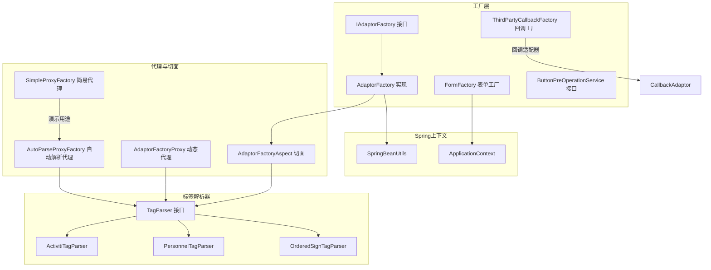
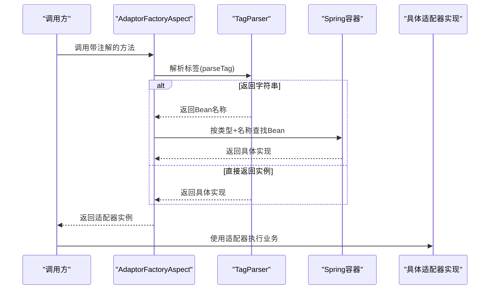
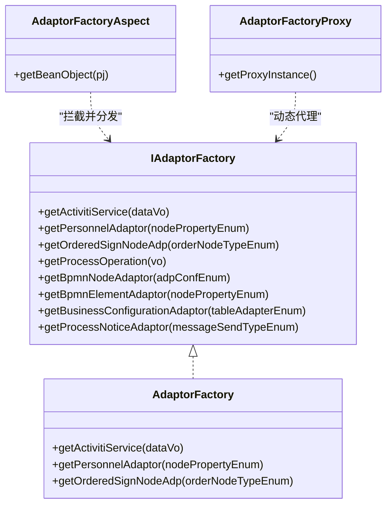
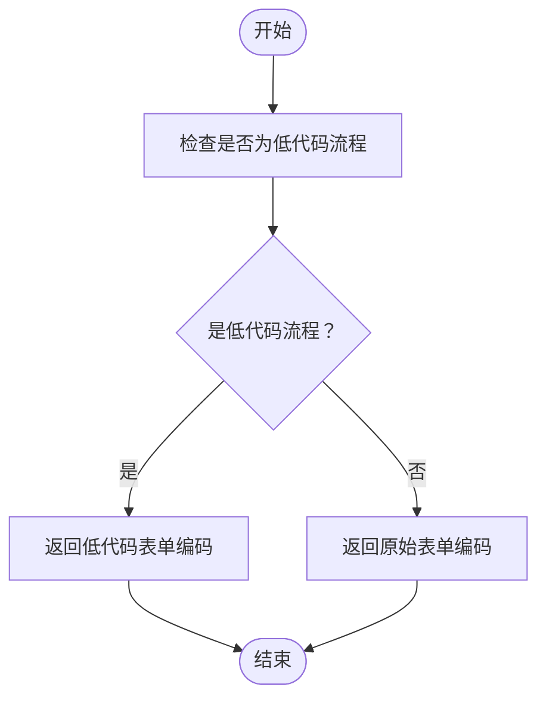
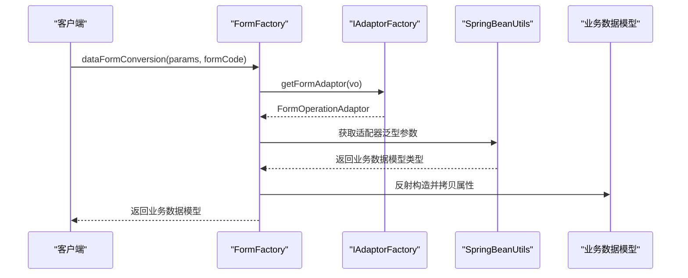
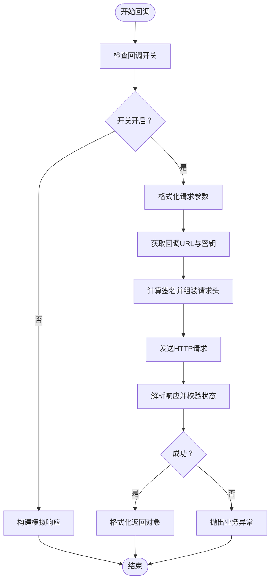
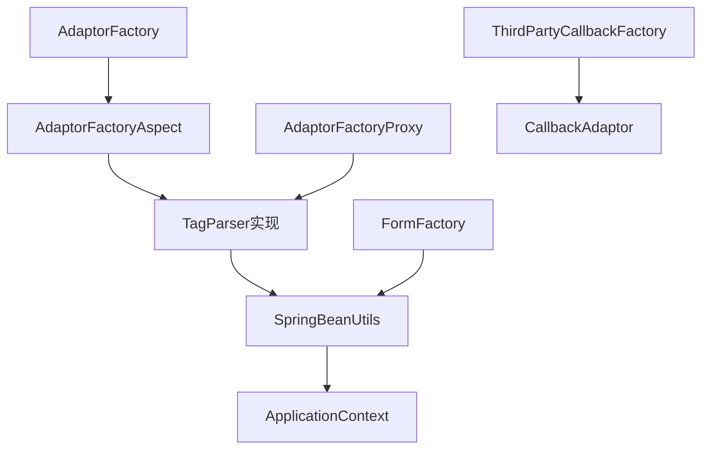

# 工厂模式系统

<cite>
**本文引用的文件**
- [AdaptorFactory.java](file://antflow-engine/src/main/java/org/openoa/engine/factory/AdaptorFactory.java)
- [IAdaptorFactory.java](file://antflow-engine/src/main/java/org/openoa/engine/factory/IAdaptorFactory.java)
- [AdaptorFactoryAspect.java](file://antflow-engine/src/main/java/org/openoa/engine/factory/AdaptorFactoryAspect.java)
- [AdaptorFactoryProxy.java](file://antflow-engine/src/main/java/org/openoa/engine/factory/AdaptorFactoryProxy.java)
- [FormFactory.java](file://antflow-engine/src/main/java/org/openoa/engine/factory/FormFactory.java)
- [TagParser.java](file://antflow-engine/src/main/java/org/openoa/engine/factory/TagParser.java)
- [AutoParseProxyFactory.java](file://antflow-engine/src/main/java/org/openoa/engine/factory/AutoParseProxyFactory.java)
- [SimpleProxyFactory.java](file://antflow-engine/src/main/java/org/openoa/engine/factory/SimpleProxyFactory.java)
- [ButtonPreOperationService.java](file://antflow-engine/src/main/java/org/openoa/engine/factory/ButtonPreOperationService.java)
- [ThirdPartyCallbackFactory.java](file://antflow-engine/src/main/java/org/openoa/engine/factory/ThirdPartyCallbackFactory.java)
- [ActivitiTagParser.java](file://antflow-engine/src/main/java/org/openoa/engine/bpmnconf/service/tagparser/ActivitiTagParser.java)
- [PersonnelTagParser.java](file://antflow-engine/src/main/java/org/openoa/engine/bpmnconf/service/tagparser/PersonnelTagParser.java)
- [OrderedSignTagParser.java](file://antflow-engine/src/main/java/org/openoa/engine/bpmnconf/service/tagparser/OrderedSignTagParser.java)
- [SpfService.java](file://antflow-engine/src/main/java/org/openoa/engine/factory/SpfService.java)
- [CallbackAdaptor.java](file://antflow-engine/src/main/java/org/openoa/engine/factory/CallbackAdaptor.java)
</cite>

## 目录
1. [简介](#简介)
2. [项目结构](#项目结构)
3. [核心组件](#核心组件)
4. [架构总览](#架构总览)
5. [详细组件分析](#详细组件分析)
6. [依赖分析](#依赖分析)
7. [性能考虑](#性能考虑)
8. [故障排查指南](#故障排查指南)
9. [结论](#结论)
10. [附录](#附录)

## 简介
本文件系统性阐述工作流引擎中的工厂模式体系，重点覆盖以下方面：
- 适配器工厂：通过注解与标签解析器实现运行时类型分发与动态选择
- 表单工厂：基于表单编码与业务数据进行表单组件与数据模型的动态转换
- 标签解析器：为不同类型的适配器提供统一的“标签”解析策略
- 按钮预处理服务：对流程按钮进行统一预处理
- 动态代理工厂：通过Javassist生成运行时代理以实现类型分发与扩展
- 第三方回调工厂：封装外部系统回调的统一入口与签名、鉴权、序列化等机制

工厂模式在此系统中的核心价值在于：将“对象创建”与“类型分发”解耦，使系统具备良好的可扩展性与可维护性。

## 项目结构
工厂模式相关代码主要集中在后端工程的工厂包与标签解析包中，配合Spring容器与AOP实现运行时装配与类型分发。



图示来源
- [IAdaptorFactory.java:28-52](file://antflow-engine/src/main/java/org/openoa/engine/factory/IAdaptorFactory.java#L28-L52)
- [AdaptorFactory.java:14-33](file://antflow-engine/src/main/java/org/openoa/engine/factory/AdaptorFactory.java#L14-L33)
- [AdaptorFactoryAspect.java:27-44](file://antflow-engine/src/main/java/org/openoa/engine/factory/AdaptorFactoryAspect.java#L27-L44)
- [AdaptorFactoryProxy.java:64-104](file://antflow-engine/src/main/java/org/openoa/engine/factory/AdaptorFactoryProxy.java#L64-L104)
- [FormFactory.java:42-62](file://antflow-engine/src/main/java/org/openoa/engine/factory/FormFactory.java#L42-L62)
- [TagParser.java:10-12](file://antflow-engine/src/main/java/org/openoa/engine/factory/TagParser.java#L10-L12)
- [ActivitiTagParser.java:7-15](file://antflow-engine/src/main/java/org/openoa/engine/bpmnconf/service/tagparser/ActivitiTagParser.java#L7-L15)
- [PersonnelTagParser.java:19-33](file://antflow-engine/src/main/java/org/openoa/engine/bpmnconf/service/tagparser/PersonnelTagParser.java#L19-L33)
- [OrderedSignTagParser.java:11-25](file://antflow-engine/src/main/java/org/openoa/engine/bpmnconf/service/tagparser/OrderedSignTagParser.java#L11-L25)

章节来源
- [IAdaptorFactory.java:28-52](file://antflow-engine/src/main/java/org/openoa/engine/factory/IAdaptorFactory.java#L28-L52)
- [AdaptorFactory.java:14-33](file://antflow-engine/src/main/java/org/openoa/engine/factory/AdaptorFactory.java#L14-L33)
- [FormFactory.java:42-62](file://antflow-engine/src/main/java/org/openoa/engine/factory/FormFactory.java#L42-L62)

## 核心组件
- 适配器工厂接口与实现：定义统一的适配器获取入口，结合注解与标签解析器完成类型分发
- 表单工厂：负责表单编码到具体实现类的映射与数据转换
- 标签解析器：为不同适配器提供统一的“标签”解析策略
- 动态代理工厂：通过Javassist生成代理类，实现运行时类型分发
- AOP切面：拦截带注解的方法，委托标签解析器与Spring容器完成对象选择
- 第三方回调工厂：封装外部系统回调的统一入口与签名、鉴权、序列化等机制

章节来源
- [IAdaptorFactory.java:28-52](file://antflow-engine/src/main/java/org/openoa/engine/factory/IAdaptorFactory.java#L28-L52)
- [AdaptorFactory.java:14-33](file://antflow-engine/src/main/java/org/openoa/engine/factory/AdaptorFactory.java#L14-L33)
- [FormFactory.java:42-62](file://antflow-engine/src/main/java/org/openoa/engine/factory/FormFactory.java#L42-L62)
- [TagParser.java:10-12](file://antflow-engine/src/main/java/org/openoa/engine/factory/TagParser.java#L10-L12)
- [AdaptorFactoryAspect.java:27-44](file://antflow-engine/src/main/java/org/openoa/engine/factory/AdaptorFactoryAspect.java#L27-L44)
- [AdaptorFactoryProxy.java:64-104](file://antflow-engine/src/main/java/org/openoa/engine/factory/AdaptorFactoryProxy.java#L64-L104)
- [ThirdPartyCallbackFactory.java:54-253](file://antflow-engine/src/main/java/org/openoa/engine/factory/ThirdPartyCallbackFactory.java#L54-L253)

## 架构总览
工厂模式在系统中的运行链路如下：
- 方法调用经由AOP切面拦截
- 切面根据方法上的注解选择对应的标签解析器
- 标签解析器依据输入参数解析出目标Bean名称或直接返回Bean实例
- 若返回字符串，则由Spring容器按类型与名称查找具体Bean
- 对于未标注注解但带有自动解析注解的方法，通过动态代理工厂生成代理，代理内部再通过标签解析器进行分发



图示来源
- [AdaptorFactoryAspect.java:27-44](file://antflow-engine/src/main/java/org/openoa/engine/factory/AdaptorFactoryAspect.java#L27-L44)
- [AdaptorFactoryProxy.java:88-99](file://antflow-engine/src/main/java/org/openoa/engine/factory/AdaptorFactoryProxy.java#L88-L99)
- [TagParser.java:10-12](file://antflow-engine/src/main/java/org/openoa/engine/factory/TagParser.java#L10-L12)

## 详细组件分析

### 适配器工厂与AOP分发
- IAdaptorFactory定义了多种适配器的获取方法，并通过注解声明对应的标签解析器
- AdaptorFactory是具体实现，方法体通常返回null，实际行为由AOP切面接管
- AdaptorFactoryAspect拦截带注解的方法，实例化对应标签解析器，解析参数后从Spring容器获取Bean
- AdaptorFactoryProxy通过Javassist生成IAdaptorFactory的代理，动态注入方法体，实现与切面一致的分发逻辑



图示来源
- [IAdaptorFactory.java:28-52](file://antflow-engine/src/main/java/org/openoa/engine/factory/IAdaptorFactory.java#L28-L52)
- [AdaptorFactory.java:14-33](file://antflow-engine/src/main/java/org/openoa/engine/factory/AdaptorFactory.java#L14-L33)
- [AdaptorFactoryAspect.java:27-44](file://antflow-engine/src/main/java/org/openoa/engine/factory/AdaptorFactoryAspect.java#L27-L44)
- [AdaptorFactoryProxy.java:64-104](file://antflow-engine/src/main/java/org/openoa/engine/factory/AdaptorFactoryProxy.java#L64-L104)

章节来源
- [IAdaptorFactory.java:28-52](file://antflow-engine/src/main/java/org/openoa/engine/factory/IAdaptorFactory.java#L28-L52)
- [AdaptorFactory.java:14-33](file://antflow-engine/src/main/java/org/openoa/engine/factory/AdaptorFactory.java#L14-L33)
- [AdaptorFactoryAspect.java:27-44](file://antflow-engine/src/main/java/org/openoa/engine/factory/AdaptorFactoryAspect.java#L27-L44)
- [AdaptorFactoryProxy.java:64-104](file://antflow-engine/src/main/java/org/openoa/engine/factory/AdaptorFactoryProxy.java#L64-L104)

### 标签解析器与类型分发
- TagParser定义了统一的parseTag接口，用于将输入参数转换为Bean名称或直接返回实例
- ActivitiTagParser：根据业务数据判断是否为低代码流程，决定返回固定表单编码或原始表单编码
- PersonnelTagParser：遍历所有人员适配器Bean，依据枚举值选择匹配的实现
- OrderedSignTagParser：遍历有序签字节点适配器Bean，依据枚举值选择匹配的实现



图示来源
- [ActivitiTagParser.java:7-15](file://antflow-engine/src/main/java/org/openoa/engine/bpmnconf/service/tagparser/ActivitiTagParser.java#L7-L15)

章节来源
- [TagParser.java:10-12](file://antflow-engine/src/main/java/org/openoa/engine/factory/TagParser.java#L10-L12)
- [ActivitiTagParser.java:7-15](file://antflow-engine/src/main/java/org/openoa/engine/bpmnconf/service/tagparser/ActivitiTagParser.java#L7-L15)
- [PersonnelTagParser.java:19-33](file://antflow-engine/src/main/java/org/openoa/engine/bpmnconf/service/tagparser/PersonnelTagParser.java#L19-L33)
- [OrderedSignTagParser.java:11-25](file://antflow-engine/src/main/java/org/openoa/engine/bpmnconf/service/tagparser/OrderedSignTagParser.java#L11-L25)

### 表单工厂与数据转换
- FormFactory负责根据表单编码获取对应的表单适配器，并支持将请求参数转换为指定的业务数据模型
- 支持外部访问流程的数据回填与低代码流程的特殊处理
- 通过反射解析适配器的泛型参数，确定业务数据模型类型，确保后续数据绑定正确



图示来源
- [FormFactory.java:50-123](file://antflow-engine/src/main/java/org/openoa/engine/factory/FormFactory.java#L50-L123)
- [FormFactory.java:124-152](file://antflow-engine/src/main/java/org/openoa/engine/factory/FormFactory.java#L124-L152)

章节来源
- [FormFactory.java:42-62](file://antflow-engine/src/main/java/org/openoa/engine/factory/FormFactory.java#L42-L62)
- [FormFactory.java:70-123](file://antflow-engine/src/main/java/org/openoa/engine/factory/FormFactory.java#L70-L123)
- [FormFactory.java:124-152](file://antflow-engine/src/main/java/org/openoa/engine/factory/FormFactory.java#L124-L152)

### 动态代理工厂与扩展机制
- SimpleProxyFactory：为指定接口生成简单代理，便于演示与测试
- AutoParseProxyFactory：生成符合TagParser接口的动态代理，内部通过SpringBeanUtils扫描实现类并按枚举匹配
- AdaptorFactoryProxy：生成IAdaptorFactory的完整代理，将每个方法体替换为基于标签解析器的分发逻辑

```mermaid
classDiagram
class TagParser {
+parseTag(data)
}
class AutoParseProxyFactory {
+getProxyInstance(objToProxy, paramTypeName, returnTypeName)
}
class AdaptorFactoryProxy {
+getProxyInstance()
}
class SimpleProxyFactory {
+getProxyInstance(objToProxy)
}
AutoParseProxyFactory --> TagParser : "实现接口"
AdaptorFactoryProxy --> TagParser : "注入并使用"
SimpleProxyFactory -->|"演示用途"| AutoParseProxyFactory
```

图示来源
- [TagParser.java:10-12](file://antflow-engine/src/main/java/org/openoa/engine/factory/TagParser.java#L10-L12)
- [AutoParseProxyFactory.java:29-105](file://antflow-engine/src/main/java/org/openoa/engine/factory/AutoParseProxyFactory.java#L29-L105)
- [AdaptorFactoryProxy.java:64-104](file://antflow-engine/src/main/java/org/openoa/engine/factory/AdaptorFactoryProxy.java#L64-L104)
- [SimpleProxyFactory.java:29-95](file://antflow-engine/src/main/java/org/openoa/engine/factory/SimpleProxyFactory.java#L29-L95)

章节来源
- [AutoParseProxyFactory.java:29-105](file://antflow-engine/src/main/java/org/openoa/engine/factory/AutoParseProxyFactory.java#L29-L105)
- [AdaptorFactoryProxy.java:64-104](file://antflow-engine/src/main/java/org/openoa/engine/factory/AdaptorFactoryProxy.java#L64-L104)
- [SimpleProxyFactory.java:29-95](file://antflow-engine/src/main/java/org/openoa/engine/factory/SimpleProxyFactory.java#L29-L95)

### 第三方回调工厂与流程控制
- ThirdPartyCallbackFactory：封装对外部系统的回调调用，支持开关控制、签名计算、请求头组装、响应解析与异常处理
- 通过回调适配器按事件类型获取具体实现，支持流程完成、任务状态变更等场景
- 提供统一的错误日志记录与降级处理（当回调关闭时返回模拟响应）



图示来源
- [ThirdPartyCallbackFactory.java:89-253](file://antflow-engine/src/main/java/org/openoa/engine/factory/ThirdPartyCallbackFactory.java#L89-L253)

章节来源
- [ThirdPartyCallbackFactory.java:54-253](file://antflow-engine/src/main/java/org/openoa/engine/factory/ThirdPartyCallbackFactory.java#L54-L253)
- [CallbackAdaptor.java](file://antflow-engine/src/main/java/org/openoa/engine/factory/CallbackAdaptor.java)

### 按钮预处理服务
- ButtonPreOperationService定义了按钮预处理的统一入口，接收参数与表单编码，返回处理后的业务数据
- 具体实现可按流程节点与按钮类型进行差异化处理，保证按钮行为的一致性与可扩展性

章节来源
- [ButtonPreOperationService.java:10-12](file://antflow-engine/src/main/java/org/openoa/engine/factory/ButtonPreOperationService.java#L10-L12)

## 依赖分析
- 组件内聚与耦合
  - 适配器工厂与AOP切面高度解耦：通过注解与标签解析器实现运行时分发
  - 标签解析器与具体实现解耦：解析逻辑独立于业务实现
  - 动态代理工厂与Spring容器解耦：通过工具类与反射实现运行时装配
- 外部依赖
  - Spring容器：Bean管理、类型与名称查找
  - Javassist：动态字节码生成
  - Fastjson：JSON序列化与反序列化
  - Apache HttpClient：HTTP回调调用



图示来源
- [AdaptorFactoryAspect.java:27-44](file://antflow-engine/src/main/java/org/openoa/engine/factory/AdaptorFactoryAspect.java#L27-L44)
- [AdaptorFactoryProxy.java:88-99](file://antflow-engine/src/main/java/org/openoa/engine/factory/AdaptorFactoryProxy.java#L88-L99)
- [FormFactory.java:42-62](file://antflow-engine/src/main/java/org/openoa/engine/factory/FormFactory.java#L42-L62)
- [ThirdPartyCallbackFactory.java:114-118](file://antflow-engine/src/main/java/org/openoa/engine/factory/ThirdPartyCallbackFactory.java#L114-L118)

章节来源
- [AdaptorFactoryAspect.java:27-44](file://antflow-engine/src/main/java/org/openoa/engine/factory/AdaptorFactoryAspect.java#L27-L44)
- [AdaptorFactoryProxy.java:88-99](file://antflow-engine/src/main/java/org/openoa/engine/factory/AdaptorFactoryProxy.java#L88-L99)
- [FormFactory.java:42-62](file://antflow-engine/src/main/java/org/openoa/engine/factory/FormFactory.java#L42-L62)
- [ThirdPartyCallbackFactory.java:114-118](file://antflow-engine/src/main/java/org/openoa/engine/factory/ThirdPartyCallbackFactory.java#L114-L118)

## 性能考虑
- 动态代理缓存：代理对象与已加载实例采用缓存机制，避免重复生成与反射开销
- Spring容器查找优化：按类型+名称精确查找，减少遍历成本
- 标签解析器选择：优先返回实例而非字符串可减少一次容器查找
- JSON处理：使用高性能序列化库，避免不必要的对象转换
- 回调调用：合理设置超时与重试策略，避免阻塞主线程

## 故障排查指南
- 适配器未找到
  - 检查标签解析器是否正确返回Bean名称或实例
  - 确认Spring容器中存在对应Bean且名称匹配
- 类型分发失败
  - 核对枚举值与isSupportBusinessObject实现是否一致
  - 确认自动解析代理生成的签名与泛型参数正确
- 表单转换异常
  - 检查表单编码与适配器泛型参数是否匹配
  - 确认业务数据模型属性与请求参数一致
- 回调失败
  - 校验回调开关、URL、签名与请求头
  - 查看日志中的请求与响应内容定位问题

章节来源
- [AdaptorFactoryAspect.java:27-44](file://antflow-engine/src/main/java/org/openoa/engine/factory/AdaptorFactoryAspect.java#L27-L44)
- [AdaptorFactoryProxy.java:78-85](file://antflow-engine/src/main/java/org/openoa/engine/factory/AdaptorFactoryProxy.java#L78-L85)
- [FormFactory.java:70-123](file://antflow-engine/src/main/java/org/openoa/engine/factory/FormFactory.java#L70-L123)
- [ThirdPartyCallbackFactory.java:176-190](file://antflow-engine/src/main/java/org/openoa/engine/factory/ThirdPartyCallbackFactory.java#L176-L190)

## 结论
本工厂模式系统通过注解、AOP切面与标签解析器实现了运行时的类型分发与对象创建，结合动态代理与Spring容器，提供了高扩展性的适配器体系。表单工厂与第三方回调工厂进一步完善了流程引擎在数据转换与外部集成方面的能力。整体设计遵循开闭原则，易于新增适配器与扩展新功能。

## 附录
- 关键注解
  - SpfService：声明方法的标签解析器与类型分发策略
  - AutoParse：声明自动解析代理的参数与返回类型
- 示例路径
  - 适配器工厂接口定义：[IAdaptorFactory.java:28-52](file://antflow-engine/src/main/java/org/openoa/engine/factory/IAdaptorFactory.java#L28-L52)
  - 适配器工厂实现与AOP切面：[AdaptorFactory.java:14-33](file://antflow-engine/src/main/java/org/openoa/engine/factory/AdaptorFactory.java#L14-L33)、[AdaptorFactoryAspect.java:27-44](file://antflow-engine/src/main/java/org/openoa/engine/factory/AdaptorFactoryAspect.java#L27-L44)
  - 标签解析器实现：[ActivitiTagParser.java:7-15](file://antflow-engine/src/main/java/org/openoa/engine/bpmnconf/service/tagparser/ActivitiTagParser.java#L7-L15)、[PersonnelTagParser.java:19-33](file://antflow-engine/src/main/java/org/openoa/engine/bpmnconf/service/tagparser/PersonnelTagParser.java#L19-L33)、[OrderedSignTagParser.java:11-25](file://antflow-engine/src/main/java/org/openoa/engine/bpmnconf/service/tagparser/OrderedSignTagParser.java#L11-L25)
  - 表单工厂与数据转换：[FormFactory.java:50-123](file://antflow-engine/src/main/java/org/openoa/engine/factory/FormFactory.java#L50-L123)
  - 动态代理工厂：[AdaptorFactoryProxy.java:64-104](file://antflow-engine/src/main/java/org/openoa/engine/factory/AdaptorFactoryProxy.java#L64-L104)、[AutoParseProxyFactory.java:29-105](file://antflow-engine/src/main/java/org/openoa/engine/factory/AutoParseProxyFactory.java#L29-L105)
  - 第三方回调工厂：[ThirdPartyCallbackFactory.java:89-253](file://antflow-engine/src/main/java/org/openoa/engine/factory/ThirdPartyCallbackFactory.java#L89-L253)