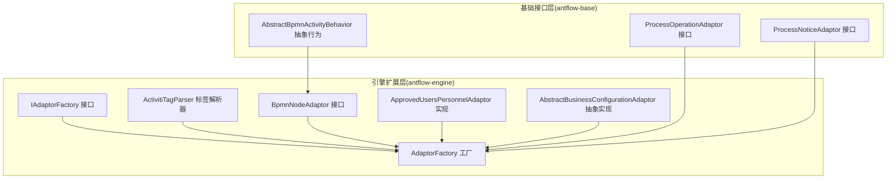
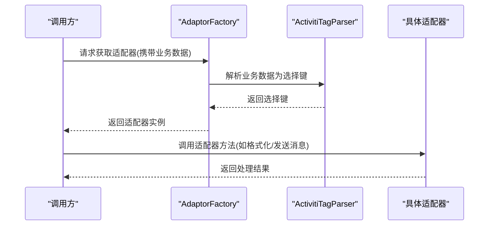
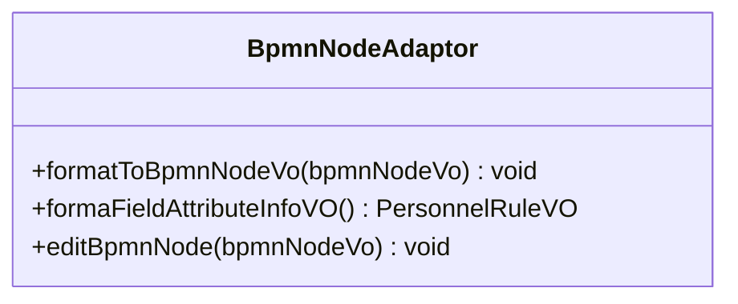
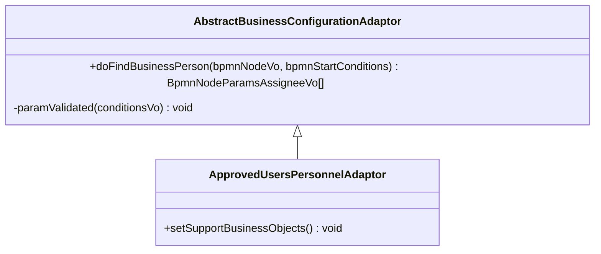
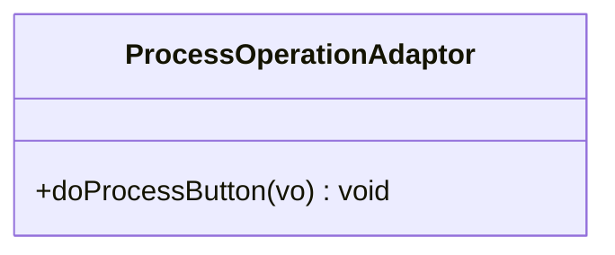
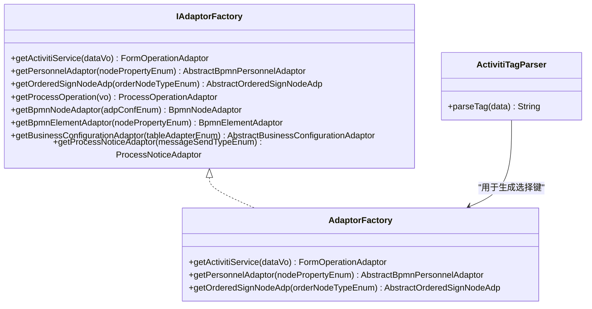
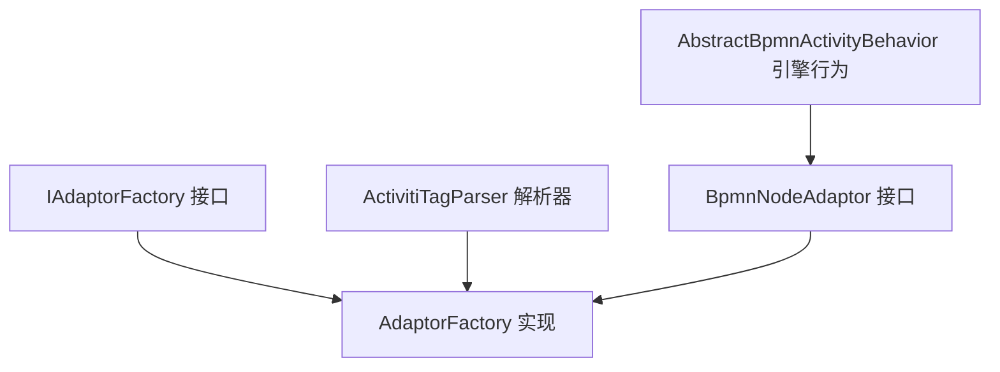

# 流程适配器系统

<cite>
**本文档引用的文件**
- [AdaptorFactory.java](file://antflow-engine/src/main/java/org/openoa/engine/factory/AdaptorFactory.java)
- [IAdaptorFactory.java](file://antflow-engine/src/main/java/org/openoa/engine/factory/IAdaptorFactory.java)
- [ActivitiTagParser.java](file://antflow-engine/src/main/java/org/openoa/engine/bpmnconf/service/tagparser/ActivitiTagParser.java)
- [AbstractBusinessConfigurationAdaptor.java](file://antflow-engine/src/main/java/org/openoa/engine/bpmnconf/adp/personneladp/AbstractBusinessConfigurationAdaptor.java)
- [BpmnNodeAdaptor.java](file://antflow-engine/src/main/java/org/openoa/engine/bpmnconf/adp/bpmnnodeadp/BpmnNodeAdaptor.java)
- [ApprovedUsersPersonnelAdaptor.java](file://antflow-engine/src/main/java/org/openoa/engine/bpmnconf/adp/personneladp/ApprovedUsersPersonnelAdaptor.java)
- [ProcessOperationAdaptor.java](file://antflow-base/src/main/java/org/openoa/base/interf/ProcessOperationAdaptor.java)
- [ProcessNoticeAdaptor.java](file://antflow-base/src/main/java/org/openoa/base/interf/ProcessNoticeAdaptor.java)
- [AbstractBpmnActivityBehavior.java](file://antflow-base/src/main/java/org/activiti/engine/impl/bpmn/behavior/AbstractBpmnActivityBehavior.java)
</cite>

## 目录
1. [简介](#简介)
2. [项目结构](#项目结构)
3. [核心组件](#核心组件)
4. [架构总览](#架构总览)
5. [详细组件分析](#详细组件分析)
6. [依赖分析](#依赖分析)
7. [性能考虑](#性能考虑)
8. [故障排查指南](#故障排查指南)
9. [结论](#结论)
10. [附录](#附录)

## 简介
本文件面向流程适配器系统，系统性阐述其设计架构与扩展机制，重点覆盖以下适配器类型：
- BPMN 节点适配器：负责节点属性格式化、编辑与字段属性信息处理
- 人员适配器：负责根据业务规则解析审批人或候选人员
- 流程操作适配器：负责流程按钮操作的统一处理
- 流程通知适配器：负责按消息类型批量发送流程消息

通过适配器模式，系统实现了引擎与业务逻辑的解耦、动态扩展与灵活配置，便于在不修改核心引擎的前提下，按需扩展新的业务规则与交互方式。

## 项目结构
流程适配器系统主要分布在两个模块中：
- 基础接口与抽象层（antflow-base）：定义通用适配器接口、基础行为与常量
- 引擎扩展与实现（antflow-engine）：提供具体适配器实现、工厂与标签解析器

**图表来源**
- [IAdaptorFactory.java:28-52](file://antflow-engine/src/main/java/org/openoa/engine/factory/IAdaptorFactory.java#L28-L52)
- [AdaptorFactory.java:14-33](file://antflow-engine/src/main/java/org/openoa/engine/factory/AdaptorFactory.java#L14-L33)
- [ActivitiTagParser.java:7-15](file://antflow-engine/src/main/java/org/openoa/engine/bpmnconf/service/tagparser/ActivitiTagParser.java#L7-L15)
- [BpmnNodeAdaptor.java:12-30](file://antflow-engine/src/main/java/org/openoa/engine/bpmnconf/adp/bpmnnodeadp/BpmnNodeAdaptor.java#L12-L30)
- [ApprovedUsersPersonnelAdaptor.java:9-18](file://antflow-engine/src/main/java/org/openoa/engine/bpmnconf/adp/personneladp/ApprovedUsersPersonnelAdaptor.java#L9-L18)
- [AbstractBusinessConfigurationAdaptor.java:11-26](file://antflow-engine/src/main/java/org/openoa/engine/bpmnconf/adp/personneladp/AbstractBusinessConfigurationAdaptor.java#L11-L26)
- [ProcessOperationAdaptor.java:8-12](file://antflow-base/src/main/java/org/openoa/base/interf/ProcessOperationAdaptor.java#L8-L12)
- [ProcessNoticeAdaptor.java:7-9](file://antflow-base/src/main/java/org/openoa/base/interf/ProcessNoticeAdaptor.java#L7-L9)
- [AbstractBpmnActivityBehavior.java:32-111](file://antflow-base/src/main/java/org/activiti/engine/impl/bpmn/behavior/AbstractBpmnActivityBehavior.java#L32-L111)

**章节来源**
- [IAdaptorFactory.java:21-52](file://antflow-engine/src/main/java/org/openoa/engine/factory/IAdaptorFactory.java#L21-L52)
- [AdaptorFactory.java:14-33](file://antflow-engine/src/main/java/org/openoa/engine/factory/AdaptorFactory.java#L14-L33)

## 核心组件
- 适配器工厂与接口
  - IAdaptorFactory：定义各类适配器的获取入口，包含注解驱动的标签解析器绑定
  - AdaptorFactory：具体工厂实现，提供基于标签解析结果的适配器实例化
- 标签解析器
  - ActivitiTagParser：根据业务数据决定表单编码或低代码标识，作为工厂选择适配器的依据
- BPMN 节点适配器
  - BpmnNodeAdaptor：定义节点格式化、字段属性信息与节点编辑能力
- 人员适配器
  - ApprovedUsersPersonnelAdaptor：示例实现，声明支持“已批准人员”类型的人员规则
  - AbstractBusinessConfigurationAdaptor：抽象基类，封装业务表字段与人员查找的通用逻辑
- 流程操作与通知适配器
  - ProcessOperationAdaptor：流程按钮操作的统一接口
  - ProcessNoticeAdaptor：按消息类型批量发送消息的接口

**章节来源**
- [IAdaptorFactory.java:28-52](file://antflow-engine/src/main/java/org/openoa/engine/factory/IAdaptorFactory.java#L28-L52)
- [AdaptorFactory.java:17-31](file://antflow-engine/src/main/java/org/openoa/engine/factory/AdaptorFactory.java#L17-L31)
- [ActivitiTagParser.java:7-15](file://antflow-engine/src/main/java/org/openoa/engine/bpmnconf/service/tagparser/ActivitiTagParser.java#L7-L15)
- [BpmnNodeAdaptor.java:12-30](file://antflow-engine/src/main/java/org/openoa/engine/bpmnconf/adp/bpmnnodeadp/BpmnNodeAdaptor.java#L12-L30)
- [ApprovedUsersPersonnelAdaptor.java:9-18](file://antflow-engine/src/main/java/org/openoa/engine/bpmnconf/adp/personneladp/ApprovedUsersPersonnelAdaptor.java#L9-L18)
- [AbstractBusinessConfigurationAdaptor.java:11-26](file://antflow-engine/src/main/java/org/openoa/engine/bpmnconf/adp/personneladp/AbstractBusinessConfigurationAdaptor.java#L11-L26)
- [ProcessOperationAdaptor.java:8-12](file://antflow-base/src/main/java/org/openoa/base/interf/ProcessOperationAdaptor.java#L8-L12)
- [ProcessNoticeAdaptor.java:7-9](file://antflow-base/src/main/java/org/openoa/base/interf/ProcessNoticeAdaptor.java#L7-L9)

## 架构总览
适配器系统采用“工厂+标签解析器+接口契约”的组合架构：
- 标签解析器根据业务上下文生成选择键
- 工厂依据注解绑定与选择键返回具体适配器实例
- 各类适配器遵循统一接口，实现对引擎的非侵入式扩展

**图表来源**
- [AdaptorFactory.java:17-20](file://antflow-engine/src/main/java/org/openoa/engine/factory/AdaptorFactory.java#L17-L20)
- [ActivitiTagParser.java:9-14](file://antflow-engine/src/main/java/org/openoa/engine/bpmnconf/service/tagparser/ActivitiTagParser.java#L9-L14)
- [IAdaptorFactory.java:29-36](file://antflow-engine/src/main/java/org/openoa/engine/factory/IAdaptorFactory.java#L29-L36)

## 详细组件分析

### BPMN 节点适配器
职责与接口规范
- 格式化节点：将内部节点模型格式化为对外展示或后续处理所需的结构
- 字段属性信息：提供节点字段属性的格式化信息（可为空实现）
- 编辑节点：允许在流程设计器或运行期对节点进行编辑

**图表来源**
- [BpmnNodeAdaptor.java:12-30](file://antflow-engine/src/main/java/org/openoa/engine/bpmnconf/adp/bpmnnodeadp/BpmnNodeAdaptor.java#L12-L30)

实现策略
- 通过工厂接口统一注册与获取
- 与 BPMN 引擎行为类协同，确保节点执行前后的格式化一致性

**章节来源**
- [BpmnNodeAdaptor.java:12-30](file://antflow-engine/src/main/java/org/openoa/engine/bpmnconf/adp/bpmnnodeadp/BpmnNodeAdaptor.java#L12-L30)
- [AbstractBpmnActivityBehavior.java:32-111](file://antflow-base/src/main/java/org/activiti/engine/impl/bpmn/behavior/AbstractBpmnActivityBehavior.java#L32-L111)

### 人员适配器
职责与接口规范
- 支持多种人员规则类型（如直接主管、部门领导、HRBP、表单关联人员等）
- 通过抽象基类封装参数校验与业务条件解析

**图表来源**
- [AbstractBusinessConfigurationAdaptor.java:11-26](file://antflow-engine/src/main/java/org/openoa/engine/bpmnconf/adp/personneladp/AbstractBusinessConfigurationAdaptor.java#L11-L26)
- [ApprovedUsersPersonnelAdaptor.java:9-18](file://antflow-engine/src/main/java/org/openoa/engine/bpmnconf/adp/personneladp/ApprovedUsersPersonnelAdaptor.java#L9-L18)

实现策略
- 使用注解声明支持的业务对象类型
- 结合员工信息服务与人员提供服务，完成人员解析

**章节来源**
- [ApprovedUsersPersonnelAdaptor.java:9-18](file://antflow-engine/src/main/java/org/openoa/engine/bpmnconf/adp/personneladp/ApprovedUsersPersonnelAdaptor.java#L9-L18)
- [AbstractBusinessConfigurationAdaptor.java:11-26](file://antflow-engine/src/main/java/org/openoa/engine/bpmnconf/adp/personneladp/AbstractBusinessConfigurationAdaptor.java#L11-L26)

### 流程操作适配器
职责与接口规范
- 统一处理流程按钮操作，屏蔽不同业务场景差异
- 输入为业务数据载体，输出为操作执行结果

**图表来源**
- [ProcessOperationAdaptor.java:8-12](file://antflow-base/src/main/java/org/openoa/base/interf/ProcessOperationAdaptor.java#L8-L12)

实现策略
- 由工厂接口暴露获取入口，结合业务数据进行差异化处理

**章节来源**
- [IAdaptorFactory.java:38-42](file://antflow-engine/src/main/java/org/openoa/engine/factory/IAdaptorFactory.java#L38-L42)
- [ProcessOperationAdaptor.java:8-12](file://antflow-base/src/main/java/org/openoa/base/interf/ProcessOperationAdaptor.java#L8-L12)

### 流程通知适配器
职责与接口规范
- 按消息类型批量发送流程消息，支持多接收人聚合发送

**图表来源**
- [ProcessNoticeAdaptor.java:7-9](file://antflow-base/src/main/java/org/openoa/base/interf/ProcessNoticeAdaptor.java#L7-L9)

实现策略
- 由工厂接口暴露获取入口，结合消息类型与接收人列表进行发送

**章节来源**
- [IAdaptorFactory.java:48-51](file://antflow-engine/src/main/java/org/openoa/engine/factory/IAdaptorFactory.java#L48-L51)
- [ProcessNoticeAdaptor.java:7-9](file://antflow-base/src/main/java/org/openoa/base/interf/ProcessNoticeAdaptor.java#L7-L9)

### 适配器工厂与标签解析器
职责与接口规范
- 工厂接口：定义各类适配器的获取方法，使用注解绑定标签解析器
- 工厂实现：根据解析结果返回具体适配器实例
- 标签解析器：根据业务数据生成选择键，驱动工厂决策

**图表来源**
- [IAdaptorFactory.java:28-52](file://antflow-engine/src/main/java/org/openoa/engine/factory/IAdaptorFactory.java#L28-L52)
- [AdaptorFactory.java:14-33](file://antflow-engine/src/main/java/org/openoa/engine/factory/AdaptorFactory.java#L14-L33)
- [ActivitiTagParser.java:7-15](file://antflow-engine/src/main/java/org/openoa/engine/bpmnconf/service/tagparser/ActivitiTagParser.java#L7-L15)

实现策略
- 注解驱动的标签解析器与工厂方法绑定，实现“按需选择”
- 通过接口契约约束，保证扩展点的一致性与可替换性

**章节来源**
- [IAdaptorFactory.java:28-52](file://antflow-engine/src/main/java/org/openoa/engine/factory/IAdaptorFactory.java#L28-L52)
- [AdaptorFactory.java:17-31](file://antflow-engine/src/main/java/org/openoa/engine/factory/AdaptorFactory.java#L17-L31)
- [ActivitiTagParser.java:7-15](file://antflow-engine/src/main/java/org/openoa/engine/bpmnconf/service/tagparser/ActivitiTagParser.java#L7-L15)

## 依赖分析
- 工厂与解析器
  - 工厂方法通过注解绑定标签解析器，形成“输入业务数据 → 选择键 → 适配器实例”的链路
- 接口与实现
  - 所有适配器均实现统一的适配器服务接口，确保调用一致性
- 引擎行为协同
  - BPMN 节点适配器与引擎活动行为类协同，保障节点生命周期内的格式化与执行一致性

**图表来源**
- [IAdaptorFactory.java:28-52](file://antflow-engine/src/main/java/org/openoa/engine/factory/IAdaptorFactory.java#L28-L52)
- [AdaptorFactory.java:14-33](file://antflow-engine/src/main/java/org/openoa/engine/factory/AdaptorFactory.java#L14-L33)
- [ActivitiTagParser.java:7-15](file://antflow-engine/src/main/java/org/openoa/engine/bpmnconf/service/tagparser/ActivitiTagParser.java#L7-L15)
- [BpmnNodeAdaptor.java:12-30](file://antflow-engine/src/main/java/org/openoa/engine/bpmnconf/adp/bpmnnodeadp/BpmnNodeAdaptor.java#L12-L30)
- [AbstractBpmnActivityBehavior.java:32-111](file://antflow-base/src/main/java/org/activiti/engine/impl/bpmn/behavior/AbstractBpmnActivityBehavior.java#L32-L111)

**章节来源**
- [IAdaptorFactory.java:28-52](file://antflow-engine/src/main/java/org/openoa/engine/factory/IAdaptorFactory.java#L28-L52)
- [AdaptorFactory.java:14-33](file://antflow-engine/src/main/java/org/openoa/engine/factory/AdaptorFactory.java#L14-L33)
- [BpmnNodeAdaptor.java:12-30](file://antflow-engine/src/main/java/org/openoa/engine/bpmnconf/adp/bpmnnodeadp/BpmnNodeAdaptor.java#L12-L30)
- [AbstractBpmnActivityBehavior.java:32-111](file://antflow-base/src/main/java/org/activiti/engine/impl/bpmn/behavior/AbstractBpmnActivityBehavior.java#L32-L111)

## 性能考虑
- 解析与实例化开销
  - 标签解析器应保持轻量，避免复杂计算；工厂实例化应尽量复用或延迟初始化
- 批量处理
  - 流程通知适配器建议采用批量发送策略，减少网络往返与系统调用次数
- 缓存策略
  - 对于频繁查询的人员规则与节点配置，可引入缓存以降低重复解析成本
- 并发安全
  - 工厂与适配器实现需保证线程安全，避免共享状态引发竞态

## 故障排查指南
- 适配器未生效
  - 检查标签解析器是否正确生成选择键，确认工厂方法绑定的解析器与实际业务数据匹配
  - 核对注解绑定是否正确，确保工厂能根据选择键返回期望适配器
- 人员解析异常
  - 核查业务条件参数是否为空，必要时参考抽象基类的参数校验逻辑
  - 确认人员提供服务与员工信息服务的可用性
- 节点格式化错误
  - 检查节点格式化与编辑方法的实现，确保与引擎行为类的生命周期一致
- 消息发送失败
  - 核对消息类型与接收人列表，检查批量发送策略与重试机制

**章节来源**
- [AbstractBusinessConfigurationAdaptor.java:20-25](file://antflow-engine/src/main/java/org/openoa/engine/bpmnconf/adp/personneladp/AbstractBusinessConfigurationAdaptor.java#L20-L25)
- [ActivitiTagParser.java:9-14](file://antflow-engine/src/main/java/org/openoa/engine/bpmnconf/service/tagparser/ActivitiTagParser.java#L9-L14)

## 结论
流程适配器系统通过清晰的接口契约、注解驱动的工厂与标签解析器，实现了引擎与业务逻辑的松耦合与可扩展性。BPMN 节点、人员、流程操作与流程通知四大适配器各司其职，配合抽象基类与引擎行为类协同，既保证了灵活性，又确保了稳定性。开发者可据此快速扩展新规则与交互方式，满足多样化的业务需求。

## 附录
- 开发自定义适配器步骤
  - 定义适配器接口或继承抽象基类，实现核心处理逻辑
  - 在工厂接口中增加获取方法，并通过注解绑定合适的标签解析器
  - 在工厂实现中根据解析结果返回具体适配器实例
  - 在业务流程中调用工厂获取适配器并执行相应操作