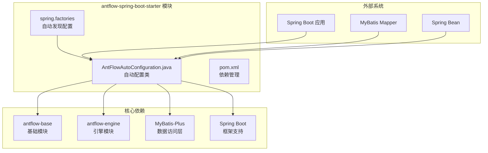
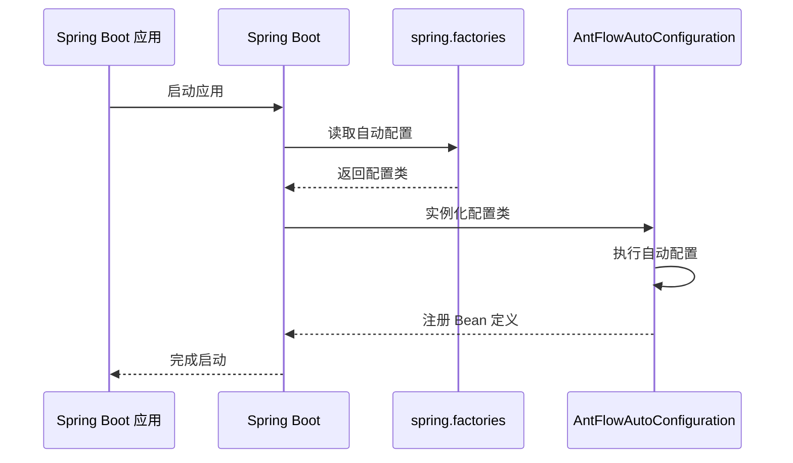
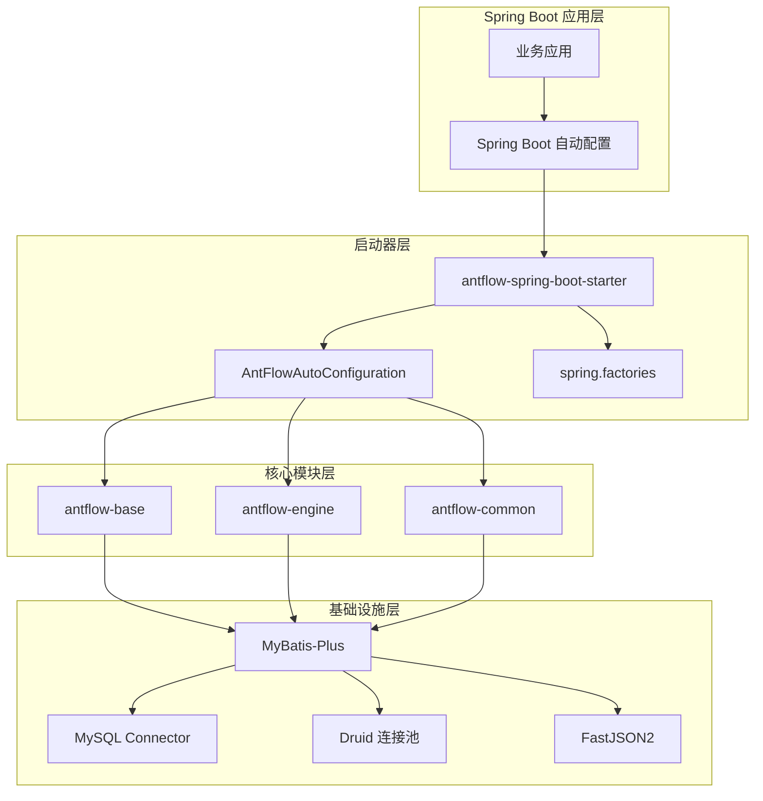
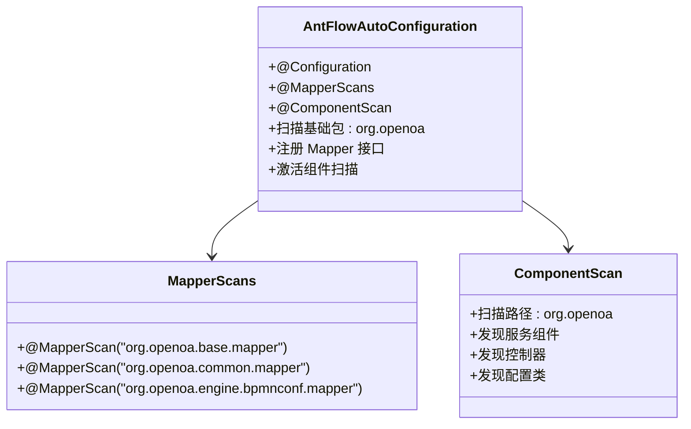
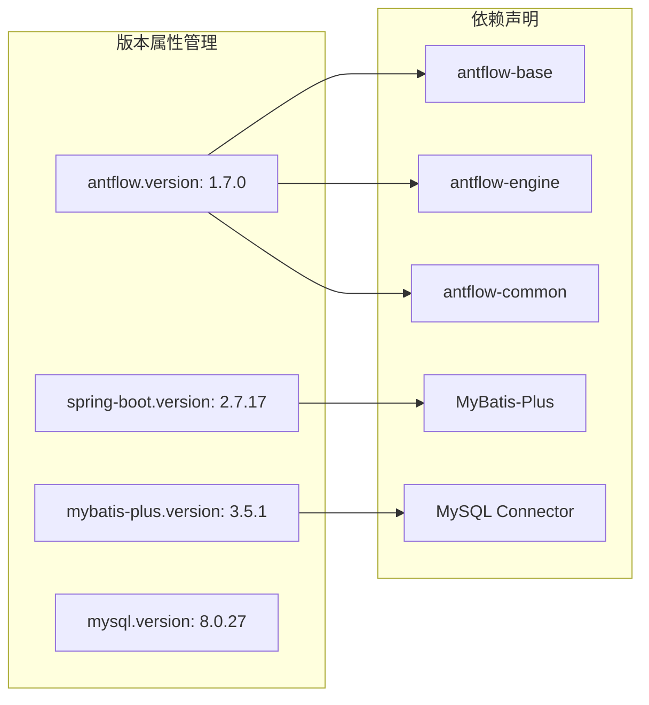
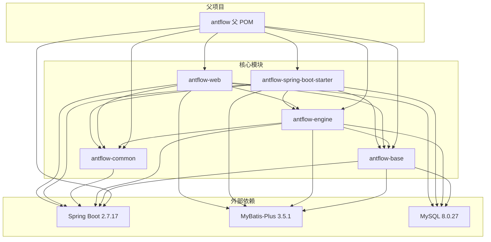
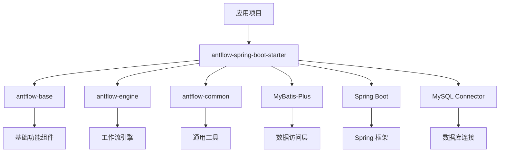

# antflow-spring-boot-starter 启动器模块

<cite>
**本文档引用的文件**
- [AntFlowAutoConfiguration.java](file://antflow-spring-boot-starter/src/main/java/org/openoa/starter/config/AntFlowAutoConfiguration.java)
- [spring.factories](file://antflow-spring-boot-starter/src/main/resources/META-INF/spring.factories)
- [pom.xml](file://antflow-spring-boot-starter/pom.xml)
- [pom.xml](file://antflow-base/pom.xml)
- [pom.xml](file://antflow-engine/pom.xml)
- [pom.xml](file://antflow-web/pom.xml)
- [AntFlowApplication.java](file://antflow-web/src/main/java/org/antflow-web/AntFlowApplication.java)
- [系统介绍篇-模块系统和自动装配.md](file://doc/系统介绍篇/5.模块系统和自动装配.md)
- [系统介绍篇-后端系统.md](file://doc/系统介绍篇/4.后端系统.md)
- [集成到已有系统-one-starter篇.md](file://doc/系统集成与扩展开发篇/AntFlow快速集成到已有系统之一starter篇.md)
</cite>

## 目录
1. [简介](#简介)
2. [项目结构](#项目结构)
3. [核心组件](#核心组件)
4. [架构概览](#架构概览)
5. [详细组件分析](#详细组件分析)
6. [依赖分析](#依赖分析)
7. [性能考虑](#性能考虑)
8. [故障排除指南](#故障排除指南)
9. [结论](#结论)
10. [附录](#附录)

## 简介

antflow-spring-boot-starter 是 AntFlow 工作流平台的核心启动器模块，专门设计用于简化 AntFlow 与其他 Spring Boot 应用的集成过程。该启动器模块通过提供完整的自动配置功能，将 AntFlow 的所有必要依赖项打包在一起，开发者只需添加一个 Maven 依赖即可获得完整的 AntFlow 功能。

该启动器模块的主要目标是：
- 提供 Spring Boot 自动配置支持
- 整合所有必要的 AntFlow 依赖项
- 简化 MyBatis Mapper 扫描配置
- 通过 META-INF/spring.factories 实现自动发现机制
- 支持版本管理和依赖冲突解决

## 项目结构

antflow-spring-boot-starter 模块采用标准的 Spring Boot 启动器结构，包含自动配置类和 Spring Boot 发现机制：



**图表来源**
- [AntFlowAutoConfiguration.java:1-19](file://antflow-spring-boot-starter/src/main/java/org/openoa/starter/config/AntFlowAutoConfiguration.java#L1-L19)
- [spring.factories:1-2](file://antflow-spring-boot-starter/src/main/resources/META-INF/spring.factories#L1-L2)

**章节来源**
- [pom.xml:1-321](file://antflow-spring-boot-starter/pom.xml#L1-L321)
- [系统介绍篇-模块系统和自动装配.md:10-40](file://doc/系统介绍篇/5.模块系统和自动装配.md#L10-L40)

## 核心组件

### AntFlowAutoConfiguration 自动配置类

AntFlowAutoConfiguration 是启动器模块的核心组件，负责配置整个 AntFlow 系统的自动装配。该类通过注解驱动的方式实现了以下关键功能：

#### 组件扫描配置
- 使用 `@ComponentScan({"org.openoa"})` 指定扫描基础包路径
- 自动注册 org.openoa 包下的所有 Spring 组件
- 支持服务、控制器、配置类等各类组件的自动发现

#### MyBatis Mapper 扫描配置
- 通过 `@MapperScans` 注解配置多个 Mapper 扫描路径
- 支持基础模块、通用模块和引擎模块的 Mapper 接口扫描
- 确保所有数据访问层接口能够被正确识别和代理

**章节来源**
- [AntFlowAutoConfiguration.java:8-18](file://antflow-spring-boot-starter/src/main/java/org/openoa/starter/config/AntFlowAutoConfiguration.java#L8-L18)

### Spring Boot 自动发现机制

启动器模块通过 META-INF/spring.factories 文件实现 Spring Boot 的自动发现功能：



**图表来源**
- [spring.factories:1-2](file://antflow-spring-boot-starter/src/main/resources/META-INF/spring.factories#L1-L2)
- [AntFlowAutoConfiguration.java:1-19](file://antflow-spring-boot-starter/src/main/java/org/openoa/starter/config/AntFlowAutoConfiguration.java#L1-L19)

**章节来源**
- [spring.factories:1-2](file://antflow-spring-boot-starter/src/main/resources/META-INF/spring.factories#L1-L2)

## 架构概览

antflow-spring-boot-starter 启动器模块在整个 AntFlow 架构中扮演着关键的集成角色：



**图表来源**
- [pom.xml:35-182](file://antflow-spring-boot-starter/pom.xml#L35-L182)
- [系统介绍篇-模块系统和自动装配.md:12-40](file://doc/系统介绍篇/5.模块系统和自动装配.md#L12-L40)

## 详细组件分析

### 自动配置机制分析

#### 组件扫描机制
AntFlowAutoConfiguration 通过 `@ComponentScan` 注解实现了智能的组件发现：



**图表来源**
- [AntFlowAutoConfiguration.java:8-18](file://antflow-spring-boot-starter/src/main/java/org/openoa/starter/config/AntFlowAutoConfiguration.java#L8-L18)

#### MyBatis Mapper 扫描策略

启动器模块配置了三个关键的 Mapper 扫描路径：

1. **基础模块 Mapper**: `org.openoa.base.mapper`
   - 包含系统基础功能的数据访问接口
   - 用户管理、权限控制等相关 Mapper

2. **通用模块 Mapper**: `org.openoa.common.mapper`
   - 包含通用业务逻辑的数据访问接口
   - 公共配置、字典数据等相关 Mapper

3. **引擎模块 Mapper**: `org.openoa.engine.bpmnconf.mapper`
   - 包含工作流引擎配置的数据访问接口
   - 流程定义、节点配置等相关 Mapper

**章节来源**
- [AntFlowAutoConfiguration.java:9-14](file://antflow-spring-boot-starter/src/main/java/org/openoa/starter/config/AntFlowAutoConfiguration.java#L9-L14)

### 依赖管理策略

#### 版本统一管理
启动器模块通过 Maven 属性实现了统一的版本管理：



**图表来源**
- [pom.xml:10-34](file://antflow-spring-boot-starter/pom.xml#L10-L34)

#### 核心依赖分析

启动器模块整合了以下关键依赖项：

1. **Spring Boot 生态系统**
   - spring-boot-autoconfigure: 2.7.17
   - spring-boot-starter: 2.7.17
   - spring-boot-configuration-processor: 2.7.17

2. **数据访问层**
   - mybatis-spring-boot-starter: 2.2.0
   - mybatis-plus-boot-starter: 3.5.1
   - mysql-connector-java: 8.0.27
   - druid: 1.1.17

3. **工具库**
   - fastjson2: 2.0.53
   - guava: 31.0.1-jre
   - pinyin4j: 2.5.0

**章节来源**
- [pom.xml:35-182](file://antflow-spring-boot-starter/pom.xml#L35-L182)

## 依赖分析

### 模块间依赖关系



**图表来源**
- [系统介绍篇-模块系统和自动装配.md:12-40](file://doc/系统介绍篇/5.模块系统和自动装配.md#L12-L40)
- [pom.xml:22-33](file://antflow-engine/pom.xml#L22-L33)

### 依赖传递分析

启动器模块通过传递依赖的方式为应用提供完整的 AntFlow 功能栈：



**图表来源**
- [pom.xml:44-58](file://antflow-spring-boot-starter/pom.xml#L44-L58)

**章节来源**
- [pom.xml:44-58](file://antflow-spring-boot-starter/pom.xml#L44-L58)
- [pom.xml:22-33](file://antflow-engine/pom.xml#L22-L33)

## 性能考虑

### 启动性能优化

1. **延迟加载策略**
   - 通过合理的组件扫描范围避免不必要的 Bean 创建
   - 仅扫描必要的包路径减少启动时间

2. **内存使用优化**
   - 合理配置 Druid 连接池参数
   - 优化 MyBatis Plus 的缓存策略

3. **数据库连接优化**
   - 配置合适的连接池大小
   - 启用连接池监控和健康检查

### 运行时性能

1. **Mapper 接口优化**
   - 使用 MyBatis Plus 提供的通用 CRUD 方法
   - 合理使用分页查询避免全量数据加载

2. **事务管理**
   - 启用 @Transactional 注解进行事务控制
   - 合理配置事务传播行为

## 故障排除指南

### 常见问题及解决方案

#### 自动配置不生效
**问题症状**: 启动时没有看到 AntFlow 相关的 Bean 被注册

**可能原因**:
1. 启动器依赖未正确添加到项目中
2. spring.factories 文件未被正确打包
3. 包扫描路径配置错误

**解决方案**:
1. 确认 Maven 依赖已正确添加
2. 检查启动器 JAR 包中是否包含 spring.factories 文件
3. 验证 @ComponentScan 的包路径配置

#### Mapper 接口无法注入
**问题症状**: 在应用中无法注入 AntFlow 的 Mapper 接口

**可能原因**:
1. Mapper 扫描路径配置错误
2. Mapper 接口未正确标注 @Mapper 注解
3. 数据库连接配置不正确

**解决方案**:
1. 检查 AntFlowAutoConfiguration 中的 @MapperScan 配置
2. 确认 Mapper 接口使用正确的注解
3. 验证数据库连接参数配置

#### 依赖冲突问题
**问题症状**: 启动时报各种依赖冲突或版本不兼容错误

**可能原因**:
1. 项目中存在与启动器版本冲突的依赖
2. Spring Boot 版本不兼容
3. MyBatis Plus 版本不匹配

**解决方案**:
1. 使用 Maven dependency:tree 分析依赖树
2. 调整项目的 Spring Boot 版本到兼容范围
3. 确保 MyBatis Plus 版本与启动器一致

**章节来源**
- [系统介绍篇-后端系统.md:122-151](file://doc/系统介绍篇/4.后端系统.md#L122-L151)

## 结论

antflow-spring-boot-starter 启动器模块通过精心设计的自动配置机制，成功地将复杂的 AntFlow 工作流平台简化为一个易于集成的 Spring Boot 启动器。该模块的主要优势包括：

1. **简化集成**: 开发者只需添加一个 Maven 依赖即可获得完整的 AntFlow 功能
2. **智能配置**: 通过自动配置类和 spring.factories 实现零配置启动
3. **版本统一**: 通过属性管理确保所有依赖版本的一致性
4. **模块化设计**: 清晰的模块边界和依赖关系便于维护和扩展

该启动器模块为 AntFlow 平台的成功推广和应用提供了强有力的技术支撑，使得企业能够快速地将工作流能力集成到现有的业务系统中。

## 附录

### 集成示例

#### Maven 依赖配置
```xml
<dependency>
    <groupId>io.github.mrtylerzhou</groupId>
    <artifactId>antflow-spring-boot-starter</artifactId>
    <version>2.0.0-m1</version>
</dependency>
```

#### Spring Boot 应用启动
```java
@SpringBootApplication
@EnableTransactionManagement
public class AntFlowApplication {
    public static void main(String[] args) {
        SpringApplication.run(AntFlowApplication.class, args);
    }
}
```

#### 配置文件示例
```yaml
# application.yml
spring:
  datasource:
    url: jdbc:mysql://localhost:3306/antflow?useUnicode=true&characterEncoding=utf8
    username: root
    password: password
    driver-class-name: com.mysql.cj.jdbc.Driver
  jpa:
    hibernate:
      ddl-auto: update
    show-sql: true
```

**章节来源**
- [集成到已有系统-one-starter篇.md:5-25](file://doc/系统集成与扩展开发篇/AntFlow快速集成到已有系统之一starter篇.md#L5-L25)
- [AntFlowApplication.java:1-17](file://antflow-web/src/main/java/org/antflow-web/AntFlowApplication.java#L1-L17)