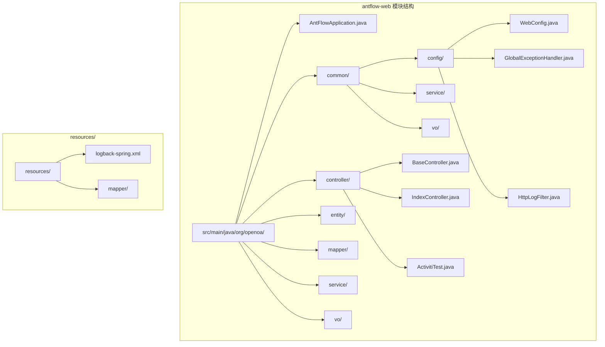
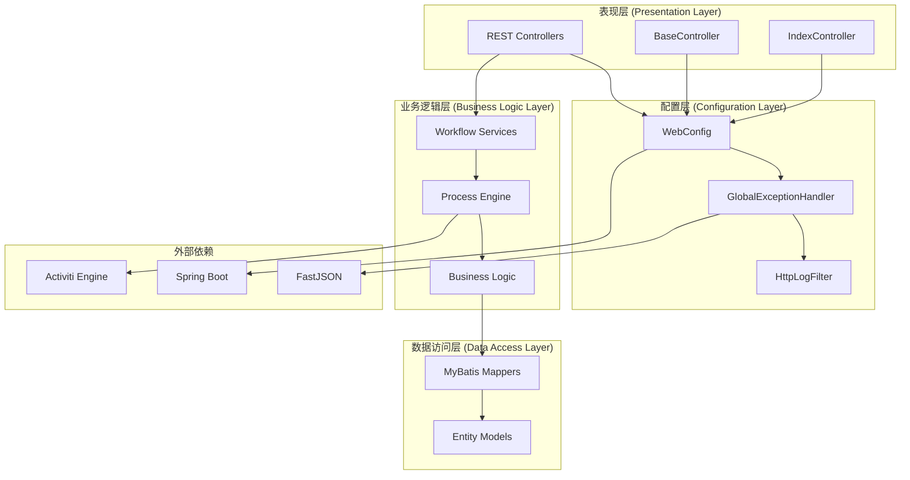
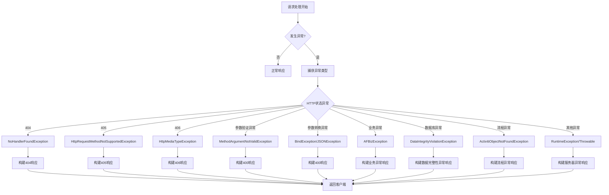
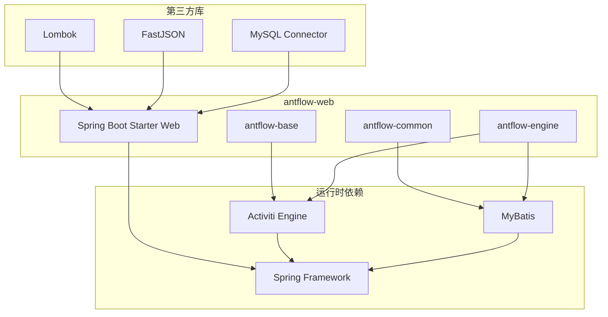

# antflow-web Web 应用模块

<cite>
**本文档引用的文件**
- [AntFlowApplication.java](file://antflow-web/src/main/java/org/openoa/AntFlowApplication.java)
- [WebConfig.java](file://antflow-web/src/main/java/org/openoa/common/config/WebConfig.java)
- [GlobalExceptionHandler.java](file://antflow-web/src/main/java/org/openoa/common/config/mvc/GlobalExceptionHandler.java)
- [BaseController.java](file://antflow-web/src/main/java/org/openoa/controller/BaseController.java)
- [IndexController.java](file://antflow-web/src/main/java/org/openoa/controller/IndexController.java)
- [pom.xml](file://antflow-web/pom.xml)
</cite>

## 目录
1. [简介](#简介)
2. [项目结构](#项目结构)
3. [核心组件](#核心组件)
4. [架构概览](#架构概览)
5. [详细组件分析](#详细组件分析)
6. [依赖分析](#依赖分析)
7. [性能考虑](#性能考虑)
8. [故障排除指南](#故障排除指南)
9. [结论](#结论)

## 简介

antflow-web 是 AntFlow 工作流引擎框架的 Web 应用模块，作为 REST API 提供层，为前端应用和外部系统提供统一的工作流访问接口。该模块基于 Spring Boot 构建，集成了 FastJSON 序列化、全局异常处理、HTTP 日志过滤等功能，为工作流引擎提供了完整的 Web 层支撑。

## 项目结构

antflow-web 模块采用标准的 Spring Boot 项目结构，主要包含以下核心目录：

**图表来源**
- [AntFlowApplication.java:1-17](file://antflow-web/src/main/java/org/openoa/AntFlowApplication.java#L1-L17)
- [WebConfig.java:1-124](file://antflow-web/src/main/java/org/openoa/common/config/WebConfig.java#L1-L124)

**章节来源**
- [pom.xml:1-66](file://antflow-web/pom.xml#L1-L66)

## 核心组件

### 应用程序入口点

AntFlowApplication 作为 Spring Boot 应用的主入口，采用了最小化的配置设计：

- **注解配置**：使用 `@SpringBootApplication` 启用自动配置和组件扫描
- **事务管理**：通过 `@EnableTransactionManagement` 启用声明式事务管理
- **启动方法**：提供静态 main 方法，使用 SpringApplication.run() 启动应用

### Web 配置管理

WebConfig 类负责整个 Web 层的配置管理，包含以下关键配置：

- **消息转换器**：配置 FastJSON 作为主要的消息转换器，支持 JSON 序列化和反序列化
- **日期格式化**：统一 LocalDateTime 类型的序列化和反序列化格式
- **资源处理器**：配置 knife4j 和 Swagger 文档的静态资源映射
- **HTTP 过滤器**：集成 HTTP 请求日志过滤器，便于调试和监控

**章节来源**
- [AntFlowApplication.java:1-17](file://antflow-web/src/main/java/org/openoa/AntFlowApplication.java#L1-L17)
- [WebConfig.java:1-124](file://antflow-web/src/main/java/org/openoa/common/config/WebConfig.java#L1-L124)

## 架构概览

antflow-web 采用分层架构设计，各层职责清晰分离：

**图表来源**
- [WebConfig.java:36-124](file://antflow-web/src/main/java/org/openoa/common/config/WebConfig.java#L36-L124)
- [GlobalExceptionHandler.java:35-144](file://antflow-web/src/main/java/org/openoa/common/config/mvc/GlobalExceptionHandler.java#L35-L144)

## 详细组件分析

### REST 控制器组织结构

#### BaseController 抽象基类

BaseController 提供了统一的请求绑定和数据转换功能：

- **XSS 防护**：对所有 String 类型参数进行 HTML 编码，防止跨站脚本攻击
- **日期解析**：支持多种日期格式的自动解析和转换
- **自定义编辑器**：通过 PropertyEditorSupport 实现类型安全的数据绑定

#### IndexController 首页控制器

提供简单的健康检查和版本信息接口：

- **根路径映射**：处理 "/" 路径的 GET 请求
- **HTML 内容**：返回友好的欢迎信息和版本提示
- **字符编码**：确保 UTF-8 字符集支持

**章节来源**
- [BaseController.java:1-53](file://antflow-web/src/main/java/org/openoa/controller/BaseController.java#L1-L53)
- [IndexController.java:1-23](file://antflow-web/src/main/java/org/openoa/controller/IndexController.java#L1-L23)

### 全局异常处理机制

GlobalExceptionHandler 提供了全面的异常处理策略：

**图表来源**
- [GlobalExceptionHandler.java:41-132](file://antflow-web/src/main/java/org/openoa/common/config/mvc/GlobalExceptionHandler.java#L41-L132)

**章节来源**
- [GlobalExceptionHandler.java:1-144](file://antflow-web/src/main/java/org/openoa/common/config/mvc/GlobalExceptionHandler.java#L1-L144)

### Web 应用程序配置

WebConfig 类实现了 WebMvcConfigurer 接口，提供以下配置：

#### 消息转换器配置

- **FastJSON 优先**：将 FastJsonHttpMessageConverter 放置在转换器列表首位
- **媒体类型支持**：支持 APPLICATION_JSON、APPLICATION_JSON_UTF8、TEXT_PLAIN
- **日期格式统一**：设置默认日期格式为 "yyyy-MM-dd HH:mm:ss"

#### 时间序列化配置

- **LocalDateTime 序列化**：使用 LocalDateTimeSerializer 统一输出格式
- **LocalDateTime 反序列化**：使用 LocalDateTimeDeserializer 支持多种输入格式
- **时区处理**：默认使用系统时区

#### 资源处理配置

- **knife4j 文档**：配置 doc.html 路径映射
- **Swagger 文档**：配置 swagger-ui.html 路径映射
- **静态资源**：配置 /webjars/** 路径映射

**章节来源**
- [WebConfig.java:36-124](file://antflow-web/src/main/java/org/openoa/common/config/WebConfig.java#L36-L124)

## 依赖分析

### 外部依赖关系

**图表来源**
- [pom.xml:20-47](file://antflow-web/pom.xml#L20-L47)

### 模块间耦合关系

- **低耦合设计**：antflow-web 通过接口和抽象类与业务模块解耦
- **依赖注入**：通过 Spring 容器管理依赖关系
- **版本统一**：所有依赖使用相同的版本号 1.7.0

**章节来源**
- [pom.xml:1-66](file://antflow-web/pom.xml#L1-L66)

## 性能考虑

### 序列化性能优化

- **FastJSON 选择**：相比 Jackson，FastJSON 在大数据量场景下具有更好的性能表现
- **消息转换器缓存**：避免重复创建转换器实例
- **日期格式优化**：统一的日期格式减少格式转换开销

### 异常处理性能

- **异常分类处理**：针对不同类型的异常采用不同的处理策略
- **日志级别控制**：通过 trace 级别日志避免不必要的日志输出
- **响应格式统一**：标准化的响应格式减少客户端解析开销

## 故障排除指南

### 常见异常类型及处理

#### HTTP 状态异常

| 异常类型 | 状态码 | 处理方式 |
|---------|--------|----------|
| NoHandlerFoundException | 404 | 返回请求地址不存在 |
| HttpRequestMethodNotSupportedException | 405 | 返回请求方法不支持 |
| HttpMediaTypeException | 406 | 返回支持的 Content-Type |

#### 参数验证异常

- **MethodArgumentNotValidException**：收集所有验证错误信息
- **BindException**：返回参数绑定失败信息
- **MethodArgumentTypeMismatchException**：返回参数类型不匹配信息

#### 业务异常处理

- **AFBizException**：使用业务异常的自定义状态码和消息
- **DataIntegrityViolationException**：捕获 MySQL 数据截断异常，返回字段长度警告

**章节来源**
- [GlobalExceptionHandler.java:51-132](file://antflow-web/src/main/java/org/openoa/common/config/mvc/GlobalExceptionHandler.java#L51-L132)

### 调试和监控

#### HTTP 日志过滤器

- **请求拦截**：记录所有 HTTP 请求的详细信息
- **响应追踪**：跟踪请求处理过程中的异常情况
- **性能监控**：可扩展用于监控请求处理时间

#### 日志配置

- **Logback 集成**：使用 logback-spring.xml 进行日志配置
- **级别控制**：支持不同级别的日志输出控制
- **格式化输出**：统一的日志格式便于问题排查

## 结论

antflow-web Web 应用模块通过精心设计的架构和完善的配置，为 AntFlow 工作流引擎提供了稳定可靠的 Web 层支撑。模块采用分层架构设计，实现了表现层、配置层、业务逻辑层和数据访问层的有效分离。通过全局异常处理机制和统一的响应格式，确保了系统的健壮性和一致性。

该模块的主要优势包括：

1. **简洁的启动配置**：最小化的注解配置，易于理解和维护
2. **强大的异常处理**：全面的异常分类和处理策略
3. **高性能的序列化**：基于 FastJSON 的高效数据序列化
4. **完善的安全防护**：内置 XSS 防护和参数验证
5. **灵活的扩展性**：清晰的接口设计便于功能扩展

通过遵循本文档的指导，开发者可以有效地使用和扩展 antflow-web 模块，为 AntFlow 工作流引擎构建更加丰富的 Web 应用。