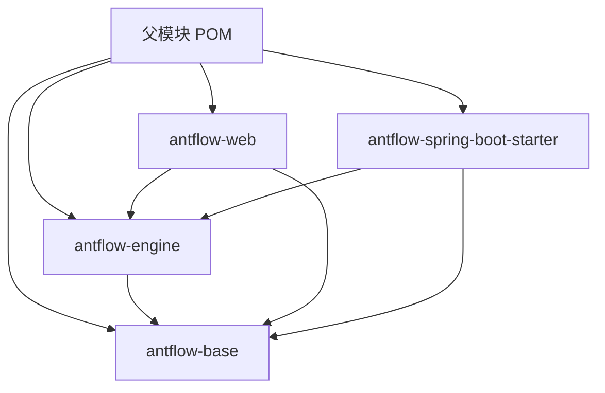
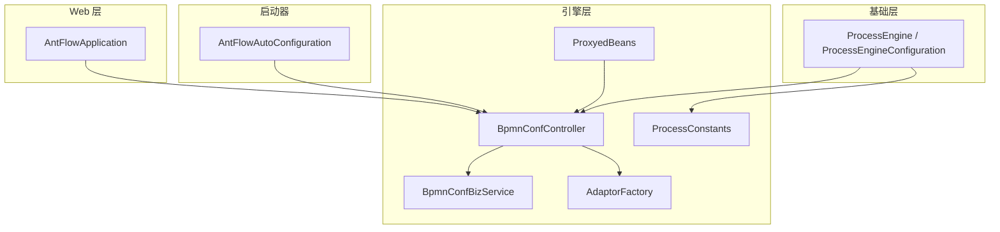
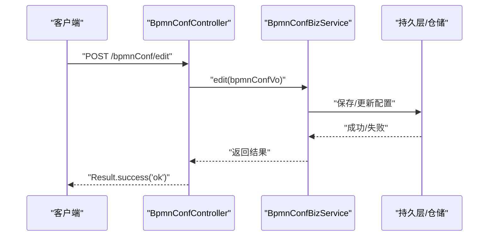
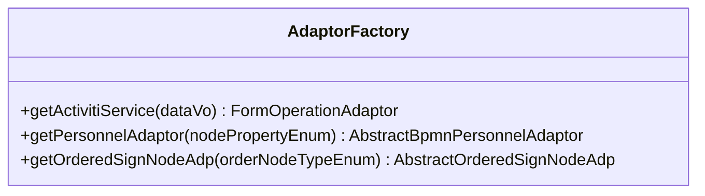
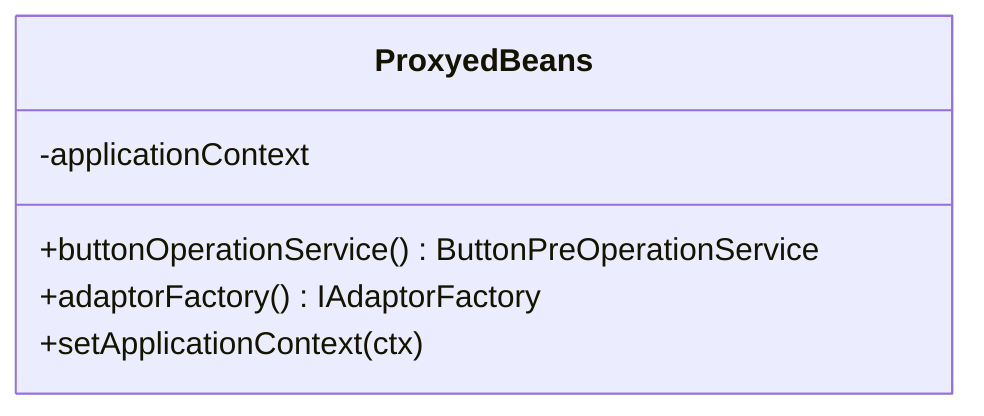
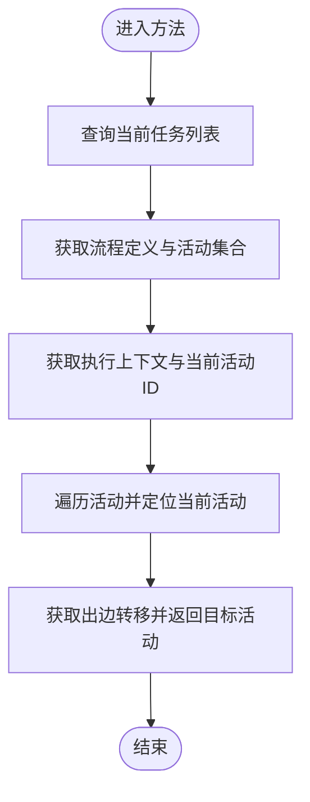
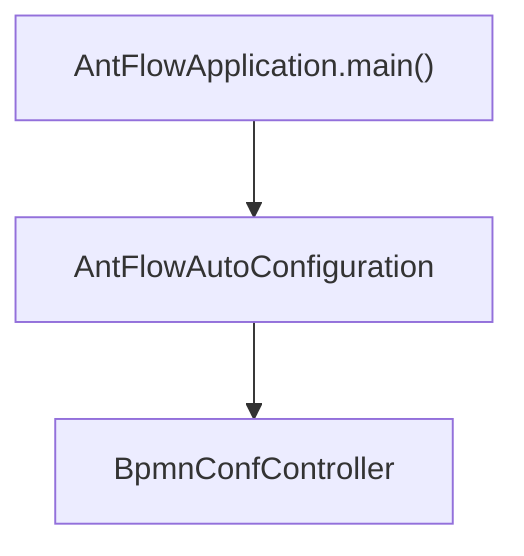
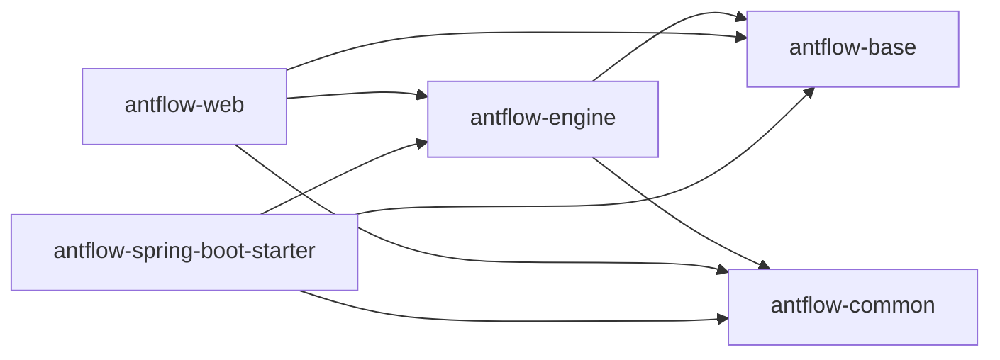

# 模块架构设计

<cite>
**本文引用的文件**
- [antflow-base/pom.xml](file://antflow-base/pom.xml)
- [antflow-engine/pom.xml](file://antflow-engine/pom.xml)
- [antflow-web/pom.xml](file://antflow-web/pom.xml)
- [antflow-spring-boot-starter/pom.xml](file://antflow-spring-boot-starter/pom.xml)
- [antflow-base/src/main/java/org/activiti/engine/ProcessEngine.java](file://antflow-base/src/main/java/org/activiti/engine/ProcessEngine.java)
- [antflow-base/src/main/java/org/activiti/engine/ProcessEngineConfiguration.java](file://antflow-base/src/main/java/org/activiti/engine/ProcessEngineConfiguration.java)
- [antflow-engine/src/main/java/org/openoa/engine/bpmnconf/controller/BpmnConfController.java](file://antflow-engine/src/main/java/org/openoa/engine/bpmnconf/controller/BpmnConfController.java)
- [antflow-engine/src/main/java/org/openoa/engine/bpmnconf/service/interf/biz/BpmnConfBizService.java](file://antflow-engine/src/main/java/org/openoa/engine/bpmnconf/service/interf/biz/BpmnConfBizService.java)
- [antflow-engine/src/main/java/org/openoa/engine/bpmnconf/common/ProcessConstants.java](file://antflow-engine/src/main/java/org/openoa/engine/bpmnconf/common/ProcessConstants.java)
- [antflow-engine/src/main/java/org/openoa/engine/factory/AdaptorFactory.java](file://antflow-engine/src/main/java/org/openoa/engine/factory/AdaptorFactory.java)
- [antflow-engine/src/main/java/org/openoa/engine/common/ProxyedBeans.java](file://antflow-engine/src/main/java/org/openoa/engine/common/ProxyedBeans.java)
- [antflow-web/src/main/java/org/openoa/AntFlowApplication.java](file://antflow-web/src/main/java/org/openoa/AntFlowApplication.java)
- [antflow-spring-boot-starter/src/main/java/org/openoa/starter/config/AntFlowAutoConfiguration.java](file://antflow-spring-boot-starter/src/main/java/org/openoa/starter/config/AntFlowAutoConfiguration.java)
- [doc/系统介绍篇/2.AntFlow_系统架构.md](file://doc/系统介绍篇/2.AntFlow_系统架构.md)
- [doc/系统介绍篇/4.后端系统.md](file://doc/系统介绍篇/4.后端系统.md)
- [doc/系统介绍篇/5.模块系统和自动装配.md](file://doc/系统介绍篇/5.模块系统和自动装配.md)
</cite>

## 目录
1. [简介](#简介)
2. [项目结构](#项目结构)
3. [核心组件](#核心组件)
4. [架构总览](#架构总览)
5. [详细组件分析](#详细组件分析)
6. [依赖分析](#依赖分析)
7. [性能考量](#性能考量)
8. [故障排查指南](#故障排查指南)
9. [结论](#结论)
10. [附录](#附录)

## 简介
本文件面向开发者与架构师，系统阐述 AntFlow 的模块化架构设计，聚焦四大核心模块：antflow-base、antflow-engine、antflow-web、antflow-spring-boot-starter。文档从职责分工、依赖关系、设计原则出发，深入解析模块间的交互流程、数据流向与接口契约；并结合实际代码路径，给出可操作的协作示例与最佳实践，帮助读者快速理解并高效扩展系统。

## 项目结构
AntFlow 采用多模块 Maven 架构，四大模块职责清晰、边界明确：
- antflow-base：基础能力与公共抽象，提供通用工具、接口与最小依赖集合，避免版本冲突。
- antflow-engine：核心引擎与业务逻辑，承载流程引擎、BPMN 执行、适配器工厂、服务编排等。
- antflow-web：Web 层入口，提供 REST 控制器与 Spring Boot 应用主类，暴露业务 API。
- antflow-spring-boot-starter：自动配置与依赖聚合，便于第三方项目快速集成。

图表来源
- [doc/系统介绍篇/2.AntFlow_系统架构.md](file://doc/系统介绍篇/2.AntFlow_系统架构.md)
- [doc/系统介绍篇/5.模块系统和自动装配.md](file://doc/系统介绍篇/5.模块系统和自动装配.md)

章节来源
- [doc/系统介绍篇/2.AntFlow_系统架构.md](file://doc/系统介绍篇/2.AntFlow_系统架构.md)
- [doc/系统介绍篇/4.后端系统.md](file://doc/系统介绍篇/4.后端系统.md)
- [doc/系统介绍篇/5.模块系统和自动装配.md](file://doc/系统介绍篇/5.模块系统和自动装配.md)

## 核心组件
- 基础层（antflow-base）
  - 提供公共接口与抽象，如流程引擎接口、配置抽象、通用常量与工具。
  - 代表文件：[ProcessEngine.java](file://antflow-base/src/main/java/org/activiti/engine/ProcessEngine.java)，[ProcessEngineConfiguration.java](file://antflow-base/src/main/java/org/activiti/engine/ProcessEngineConfiguration.java)

- 引擎层（antflow-engine）
  - 核心业务与流程执行，包含控制器、服务接口、适配器工厂、代理与 Bean 注册等。
  - 代表文件：[BpmnConfController.java](file://antflow-engine/src/main/java/org/openoa/engine/bpmnconf/controller/BpmnConfController.java)，[BpmnConfBizService.java](file://antflow-engine/src/main/java/org/openoa/engine/bpmnconf/service/interf/biz/BpmnConfBizService.java)，[ProcessConstants.java](file://antflow-engine/src/main/java/org/openoa/engine/bpmnconf/common/ProcessConstants.java)，[AdaptorFactory.java](file://antflow-engine/src/main/java/org/openoa/engine/factory/AdaptorFactory.java)，[ProxyedBeans.java](file://antflow-engine/src/main/java/org/openoa/engine/common/ProxyedBeans.java)

- Web 层（antflow-web）
  - Spring Boot 应用入口与 REST 控制器，负责对外暴露 API。
  - 代表文件：[AntFlowApplication.java](file://antflow-web/src/main/java/org/openoa/AntFlowApplication.java)

- 启动器（antflow-spring-boot-starter）
  - 自动配置与组件扫描、Mapper 扫描，统一依赖管理。
  - 代表文件：[AntFlowAutoConfiguration.java](file://antflow-spring-boot-starter/src/main/java/org/openoa/starter/config/AntFlowAutoConfiguration.java)

章节来源
- [antflow-base/src/main/java/org/activiti/engine/ProcessEngine.java](file://antflow-base/src/main/java/org/activiti/engine/ProcessEngine.java)
- [antflow-base/src/main/java/org/activiti/engine/ProcessEngineConfiguration.java](file://antflow-base/src/main/java/org/activiti/engine/ProcessEngineConfiguration.java)
- [antflow-engine/src/main/java/org/openoa/engine/bpmnconf/controller/BpmnConfController.java](file://antflow-engine/src/main/java/org/openoa/engine/bpmnconf/controller/BpmnConfController.java)
- [antflow-engine/src/main/java/org/openoa/engine/bpmnconf/service/interf/biz/BpmnConfBizService.java](file://antflow-engine/src/main/java/org/openoa/engine/bpmnconf/service/interf/biz/BpmnConfBizService.java)
- [antflow-engine/src/main/java/org/openoa/engine/bpmnconf/common/ProcessConstants.java](file://antflow-engine/src/main/java/org/openoa/engine/bpmnconf/common/ProcessConstants.java)
- [antflow-engine/src/main/java/org/openoa/engine/factory/AdaptorFactory.java](file://antflow-engine/src/main/java/org/openoa/engine/factory/AdaptorFactory.java)
- [antflow-engine/src/main/java/org/openoa/engine/common/ProxyedBeans.java](file://antflow-engine/src/main/java/org/openoa/engine/common/ProxyedBeans.java)
- [antflow-web/src/main/java/org/openoa/AntFlowApplication.java](file://antflow-web/src/main/java/org/openoa/AntFlowApplication.java)
- [antflow-spring-boot-starter/src/main/java/org/openoa/starter/config/AntFlowAutoConfiguration.java](file://antflow-spring-boot-starter/src/main/java/org/openoa/starter/config/AntFlowAutoConfiguration.java)

## 架构总览
AntFlow 的模块化架构以“分层解耦、按需组合”为核心设计原则：
- 依赖方向：engine → base；web → engine, base；starter → engine, base。
- 运行形态：starter 聚合依赖并自动装配；web 作为可独立运行的应用入口；engine 提供业务能力；base 提供通用抽象与工具。
- 扩展性：通过接口与适配器（如 FormOperationAdaptor、ActivitiService）实现业务扩展；通过 Spring Bean 代理与工厂模式实现运行期动态选择。

图表来源
- [antflow-base/src/main/java/org/activiti/engine/ProcessEngine.java](file://antflow-base/src/main/java/org/activiti/engine/ProcessEngine.java)
- [antflow-base/src/main/java/org/activiti/engine/ProcessEngineConfiguration.java](file://antflow-base/src/main/java/org/activiti/engine/ProcessEngineConfiguration.java)
- [antflow-engine/src/main/java/org/openoa/engine/bpmnconf/controller/BpmnConfController.java](file://antflow-engine/src/main/java/org/openoa/engine/bpmnconf/controller/BpmnConfController.java)
- [antflow-engine/src/main/java/org/openoa/engine/bpmnconf/service/interf/biz/BpmnConfBizService.java](file://antflow-engine/src/main/java/org/openoa/engine/bpmnconf/service/interf/biz/BpmnConfBizService.java)
- [antflow-engine/src/main/java/org/openoa/engine/factory/AdaptorFactory.java](file://antflow-engine/src/main/java/org/openoa/engine/factory/AdaptorFactory.java)
- [antflow-engine/src/main/java/org/openoa/engine/common/ProxyedBeans.java](file://antflow-engine/src/main/java/org/openoa/engine/common/ProxyedBeans.java)
- [antflow-engine/src/main/java/org/openoa/engine/bpmnconf/common/ProcessConstants.java](file://antflow-engine/src/main/java/org/openoa/engine/bpmnconf/common/ProcessConstants.java)
- [antflow-web/src/main/java/org/openoa/AntFlowApplication.java](file://antflow-web/src/main/java/org/openoa/AntFlowApplication.java)
- [antflow-spring-boot-starter/src/main/java/org/openoa/starter/config/AntFlowAutoConfiguration.java](file://antflow-spring-boot-starter/src/main/java/org/openoa/starter/config/AntFlowAutoConfiguration.java)

## 详细组件分析

### 控制器与业务契约（BpmnConfController 与 BpmnConfBizService）
- 控制器职责：接收请求参数，调用业务服务，返回统一结果封装。
- 业务契约：BpmnConfBizService 定义流程配置编辑、分页查询、预览、按钮操作、生效状态切换等接口。
- 交互流程：控制器注入业务服务接口，按需调用事务方法，完成流程配置的增删改查与运行期操作。

图表来源
- [antflow-engine/src/main/java/org/openoa/engine/bpmnconf/controller/BpmnConfController.java](file://antflow-engine/src/main/java/org/openoa/engine/bpmnconf/controller/BpmnConfController.java)
- [antflow-engine/src/main/java/org/openoa/engine/bpmnconf/service/interf/biz/BpmnConfBizService.java](file://antflow-engine/src/main/java/org/openoa/engine/bpmnconf/service/interf/biz/BpmnConfBizService.java)

章节来源
- [antflow-engine/src/main/java/org/openoa/engine/bpmnconf/controller/BpmnConfController.java](file://antflow-engine/src/main/java/org/openoa/engine/bpmnconf/controller/BpmnConfController.java)
- [antflow-engine/src/main/java/org/openoa/engine/bpmnconf/service/interf/biz/BpmnConfBizService.java](file://antflow-engine/src/main/java/org/openoa/engine/bpmnconf/service/interf/biz/BpmnConfBizService.java)

### 适配器工厂与动态选择（AdaptorFactory）
- 设计目标：根据节点类型或标签解析器，动态选择合适的表单操作适配器或人员适配器。
- 使用场景：流程节点的人员分配、有序会签、Activiti 节点适配等。
- 关键注解：通过自定义注解标记不同适配器的解析器类型，工厂方法按入参枚举返回对应适配器实例。

图表来源
- [antflow-engine/src/main/java/org/openoa/engine/factory/AdaptorFactory.java](file://antflow-engine/src/main/java/org/openoa/engine/factory/AdaptorFactory.java)

章节来源
- [antflow-engine/src/main/java/org/openoa/engine/factory/AdaptorFactory.java](file://antflow-engine/src/main/java/org/openoa/engine/factory/AdaptorFactory.java)

### Bean 代理与工厂注册（ProxyedBeans）
- 设计目标：通过代理工厂创建业务前置操作服务代理，同时确保适配器工厂 Bean 的优先加载与可用。
- 关键点：实现 ApplicationContextAware，在容器初始化阶段完成代理 Bean 的注册与适配器工厂的获取。

图表来源
- [antflow-engine/src/main/java/org/openoa/engine/common/ProxyedBeans.java](file://antflow-engine/src/main/java/org/openoa/engine/common/ProxyedBeans.java)

章节来源
- [antflow-engine/src/main/java/org/openoa/engine/common/ProxyedBeans.java](file://antflow-engine/src/main/java/org/openoa/engine/common/ProxyedBeans.java)

### 流程常量与引擎交互（ProcessConstants）
- 设计目标：封装流程运行期常用操作，如获取下一节点活动、按业务标识查询任务、历史任务查询等。
- 交互要点：通过流程引擎的服务接口（TaskService、RuntimeService、RepositoryService）读取流程状态与定义，结合业务实体与 VO 完成数据流转。

图表来源
- [antflow-engine/src/main/java/org/openoa/engine/bpmnconf/common/ProcessConstants.java](file://antflow-engine/src/main/java/org/openoa/engine/bpmnconf/common/ProcessConstants.java)

章节来源
- [antflow-engine/src/main/java/org/openoa/engine/bpmnconf/common/ProcessConstants.java](file://antflow-engine/src/main/java/org/openoa/engine/bpmnconf/common/ProcessConstants.java)

### Web 应用入口与启动器配置
- Web 应用入口：AntFlowApplication 作为 Spring Boot 启动类，开启事务管理与自动装配。
- 启动器配置：AntFlowAutoConfiguration 定义组件扫描与 Mapper 扫描范围，确保引擎与基础模块的 Bean 可被发现与装配。

图表来源
- [antflow-web/src/main/java/org/openoa/AntFlowApplication.java](file://antflow-web/src/main/java/org/openoa/AntFlowApplication.java)
- [antflow-spring-boot-starter/src/main/java/org/openoa/starter/config/AntFlowAutoConfiguration.java](file://antflow-spring-boot-starter/src/main/java/org/openoa/starter/config/AntFlowAutoConfiguration.java)

章节来源
- [antflow-web/src/main/java/org/openoa/AntFlowApplication.java](file://antflow-web/src/main/java/org/openoa/AntFlowApplication.java)
- [antflow-spring-boot-starter/src/main/java/org/openoa/starter/config/AntFlowAutoConfiguration.java](file://antflow-spring-boot-starter/src/main/java/org/openoa/starter/config/AntFlowAutoConfiguration.java)

## 依赖分析
- Maven 依赖矩阵（节选）
  - antflow-base：无直接依赖，提供最小依赖集合（provided），避免版本冲突。
  - antflow-engine：依赖 antflow-base、antflow-common，引入 MyBatis-Plus、Spring AutoConfigure、AspectJ 等。
  - antflow-web：依赖 antflow-base、antflow-common、antflow-engine，引入 Spring Boot Web。
  - antflow-spring-boot-starter：依赖 antflow-base、antflow-common、antflow-engine，聚合数据库、ORM、工具库等。

图表来源
- [antflow-base/pom.xml](file://antflow-base/pom.xml)
- [antflow-engine/pom.xml](file://antflow-engine/pom.xml)
- [antflow-web/pom.xml](file://antflow-web/pom.xml)
- [antflow-spring-boot-starter/pom.xml](file://antflow-spring-boot-starter/pom.xml)

章节来源
- [antflow-base/pom.xml](file://antflow-base/pom.xml)
- [antflow-engine/pom.xml](file://antflow-engine/pom.xml)
- [antflow-web/pom.xml](file://antflow-web/pom.xml)
- [antflow-spring-boot-starter/pom.xml](file://antflow-spring-boot-starter/pom.xml)

## 性能考量
- 依赖范围控制：基础模块使用 provided 降低传递依赖与版本冲突风险，提升构建稳定性。
- ORM 与缓存：引擎层使用 MyBatis-Plus 与 Druid 连接池，建议结合合理的 SQL 缓存策略与分页查询，避免全表扫描。
- 异步与作业：流程引擎配置支持异步执行器与作业执行器，建议根据业务并发与资源情况合理配置锁时间与重试等待。
- 代理与 AOP：通过代理工厂与切面实现横切逻辑，注意避免过度嵌套导致的性能损耗。

## 故障排查指南
- 控制器返回统一结果封装：若出现接口异常，优先检查控制器对业务服务的调用链与异常捕获。
- 业务服务接口契约：确认 edit、startProcess、effectiveBpmnConf 等方法是否正确传入参数与事务边界。
- 适配器工厂选择：若节点人员或表单操作行为异常，检查工厂方法的入参枚举与注解标记是否匹配。
- Bean 生命周期：若代理或工厂 Bean 初始化失败，检查 ProxyedBeans 的 ApplicationContextAware 实现与 Bean 名称一致性。
- 启动器装配：若组件未被扫描或 Mapper 未生效，核对 AntFlowAutoConfiguration 的组件扫描与 Mapper 扫描范围。

章节来源
- [antflow-engine/src/main/java/org/openoa/engine/bpmnconf/controller/BpmnConfController.java](file://antflow-engine/src/main/java/org/openoa/engine/bpmnconf/controller/BpmnConfController.java)
- [antflow-engine/src/main/java/org/openoa/engine/bpmnconf/service/interf/biz/BpmnConfBizService.java](file://antflow-engine/src/main/java/org/openoa/engine/bpmnconf/service/interf/biz/BpmnConfBizService.java)
- [antflow-engine/src/main/java/org/openoa/engine/factory/AdaptorFactory.java](file://antflow-engine/src/main/java/org/openoa/engine/factory/AdaptorFactory.java)
- [antflow-engine/src/main/java/org/openoa/engine/common/ProxyedBeans.java](file://antflow-engine/src/main/java/org/openoa/engine/common/ProxyedBeans.java)
- [antflow-spring-boot-starter/src/main/java/org/openoa/starter/config/AntFlowAutoConfiguration.java](file://antflow-spring-boot-starter/src/main/java/org/openoa/starter/config/AntFlowAutoConfiguration.java)

## 结论
AntFlow 的模块化架构以“基础能力沉淀、引擎能力内聚、Web 层解耦、启动器聚合”为设计主线，通过清晰的依赖方向与接口契约，实现了高内聚、低耦合与强扩展性。开发者可在保持模块边界的前提下，通过适配器、代理与自动配置机制快速扩展业务能力，并借助统一的结果封装与控制器契约，保障系统的一致性与可维护性。

## 附录
- 代码示例路径（不含具体代码内容，仅供定位参考）
  - 控制器编辑流程：[BpmnConfController.java](file://antflow-engine/src/main/java/org/openoa/engine/bpmnconf/controller/BpmnConfController.java)
  - 业务服务接口定义：[BpmnConfBizService.java](file://antflow-engine/src/main/java/org/openoa/engine/bpmnconf/service/interf/biz/BpmnConfBizService.java)
  - 适配器工厂方法：[AdaptorFactory.java](file://antflow-engine/src/main/java/org/openoa/engine/factory/AdaptorFactory.java)
  - Bean 代理注册：[ProxyedBeans.java](file://antflow-engine/src/main/java/org/openoa/engine/common/ProxyedBeans.java)
  - 流程常量与引擎交互：[ProcessConstants.java](file://antflow-engine/src/main/java/org/openoa/engine/bpmnconf/common/ProcessConstants.java)
  - Web 应用入口：[AntFlowApplication.java](file://antflow-web/src/main/java/org/openoa/AntFlowApplication.java)
  - 启动器自动配置：[AntFlowAutoConfiguration.java](file://antflow-spring-boot-starter/src/main/java/org/openoa/starter/config/AntFlowAutoConfiguration.java)
  - 基础引擎接口与配置：[ProcessEngine.java](file://antflow-base/src/main/java/org/activiti/engine/ProcessEngine.java)，[ProcessEngineConfiguration.java](file://antflow-base/src/main/java/org/activiti/engine/ProcessEngineConfiguration.java)