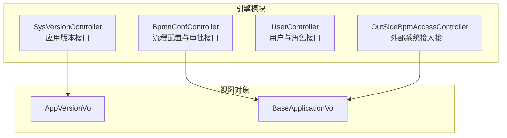
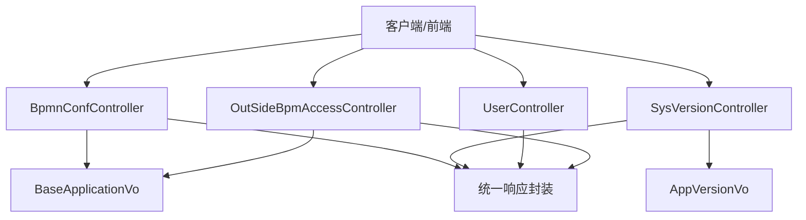
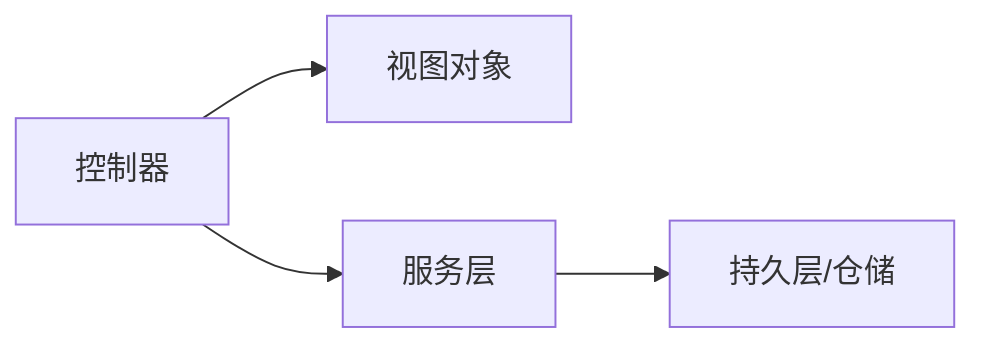

# API 设计原则

<cite>
**本文引用的文件**
- [BpmnConfController.java](file://antflow-engine/src/main/java/org/openoa/engine/bpmnconf/controller/BpmnConfController.java)
- [SysVersionController.java](file://antflow-engine/src/main/java/org/openoa/engine/bpmnconf/controller/SysVersionController.java)
- [UserController.java](file://antflow-engine/src/main/java/org/openoa/engine/bpmnconf/controller/UserController.java)
- [OutSideBpmAccessController.java](file://antflow-engine/src/main/java/org/openoa/engine/bpmnconf/controller/OutSideBpmAccessController.java)
- [AppVersionVo.java](file://antflow-engine/src/main/java/org/openoa/engine/vo/AppVersionVo.java)
- [BaseApplicationVo.java](file://antflow-engine/src/main/java/org/openoa/engine/vo/BaseApplicationVo.java)
- [banner.txt](file://antflow-engine/src/main/resources/banner.txt)
</cite>

## 目录
1. [简介](#简介)
2. [项目结构](#项目结构)
3. [核心组件](#核心组件)
4. [架构总览](#架构总览)
5. [详细组件分析](#详细组件分析)
6. [依赖分析](#依赖分析)
7. [性能考量](#性能考量)
8. [故障排查指南](#故障排查指南)
9. [结论](#结论)
10. [附录](#附录)

## 简介
本文件系统化总结本仓库中 REST API 的设计原则与实践，覆盖以下主题：
- 设计哲学与 URL 命名规范
- HTTP 方法使用原则
- 统一响应格式与错误处理
- 参数验证与输入规范
- API 版本管理策略与向后兼容
- 废弃 API 的迁移路径
- 典型 API 设计示例与最佳实践
- 性能优化与质量保障措施

## 项目结构
后端采用 Spring MVC 控制器层集中暴露 REST 接口，控制器按功能域划分在不同包下，统一通过注解声明请求方法与路径，并以统一响应包装返回。

图表来源
- [BpmnConfController.java:30-190](file://antflow-engine/src/main/java/org/openoa/engine/bpmnconf/controller/BpmnConfController.java#L30-L190)
- [SysVersionController.java:21-82](file://antflow-engine/src/main/java/org/openoa/engine/bpmnconf/controller/SysVersionController.java#L21-L82)
- [UserController.java:25-107](file://antflow-engine/src/main/java/org/openoa/engine/bpmnconf/controller/UserController.java#L25-L107)
- [OutSideBpmAccessController.java:20-90](file://antflow-engine/src/main/java/org/openoa/engine/bpmnconf/controller/OutSideBpmAccessController.java#L20-L90)
- [AppVersionVo.java:13-40](file://antflow-engine/src/main/java/org/openoa/engine/vo/AppVersionVo.java#L13-L40)
- [BaseApplicationVo.java:15-43](file://antflow-engine/src/main/java/org/openoa/engine/vo/BaseApplicationVo.java#L15-L43)

章节来源
- [BpmnConfController.java:30-190](file://antflow-engine/src/main/java/org/openoa/engine/bpmnconf/controller/BpmnConfController.java#L30-L190)
- [SysVersionController.java:21-82](file://antflow-engine/src/main/java/org/openoa/engine/bpmnconf/controller/SysVersionController.java#L21-L82)
- [UserController.java:25-107](file://antflow-engine/src/main/java/org/openoa/engine/bpmnconf/controller/UserController.java#L25-L107)
- [OutSideBpmAccessController.java:20-90](file://antflow-engine/src/main/java/org/openoa/engine/bpmnconf/controller/OutSideBpmAccessController.java#L20-L90)
- [AppVersionVo.java:13-40](file://antflow-engine/src/main/java/org/openoa/engine/vo/AppVersionVo.java#L13-L40)
- [BaseApplicationVo.java:15-43](file://antflow-engine/src/main/java/org/openoa/engine/vo/BaseApplicationVo.java#L15-L43)

## 核心组件
- 控制器层：以@RestController 注解暴露 REST 接口，统一使用@RequestMapping 或具体 HTTP 方法注解声明路径。
- 统一响应：返回值封装在统一结果对象中，前端可据此判断成功/失败与分页数据。
- 视图对象：VO 类用于承载接口入参与出参，部分字段带有序列化策略，避免空字段污染响应体。
- 外部接入：提供外部系统对接的流程发起、预览、断流等能力，便于第三方系统集成。

章节来源
- [BpmnConfController.java:30-190](file://antflow-engine/src/main/java/org/openoa/engine/bpmnconf/controller/BpmnConfController.java#L30-L190)
- [SysVersionController.java:21-82](file://antflow-engine/src/main/java/org/openoa/engine/bpmnconf/controller/SysVersionController.java#L21-L82)
- [UserController.java:25-107](file://antflow-engine/src/main/java/org/openoa/engine/bpmnconf/controller/UserController.java#L25-L107)
- [OutSideBpmAccessController.java:20-90](file://antflow-engine/src/main/java/org/openoa/engine/bpmnconf/controller/OutSideBpmAccessController.java#L20-L90)
- [AppVersionVo.java:13-40](file://antflow-engine/src/main/java/org/openoa/engine/vo/AppVersionVo.java#L13-L40)
- [BaseApplicationVo.java:15-43](file://antflow-engine/src/main/java/org/openoa/engine/vo/BaseApplicationVo.java#L15-L43)

## 架构总览
下图展示控制器与视图对象之间的交互关系，体现典型的“控制器-服务-持久层”分层与统一响应封装。

图表来源
- [BpmnConfController.java:30-190](file://antflow-engine/src/main/java/org/openoa/engine/bpmnconf/controller/BpmnConfController.java#L30-L190)
- [SysVersionController.java:21-82](file://antflow-engine/src/main/java/org/openoa/engine/bpmnconf/controller/SysVersionController.java#L21-L82)
- [UserController.java:25-107](file://antflow-engine/src/main/java/org/openoa/engine/bpmnconf/controller/UserController.java#L25-L107)
- [OutSideBpmAccessController.java:20-90](file://antflow-engine/src/main/java/org/openoa/engine/bpmnconf/controller/OutSideBpmAccessController.java#L20-L90)
- [AppVersionVo.java:13-40](file://antflow-engine/src/main/java/org/openoa/engine/vo/AppVersionVo.java#L13-L40)
- [BaseApplicationVo.java:15-43](file://antflow-engine/src/main/java/org/openoa/engine/vo/BaseApplicationVo.java#L15-L43)

## 详细组件分析

### 控制器层设计原则
- 统一前缀与命名：控制器路径以领域命名，如“/bpmnConf”“/appVersion”“/user”“/outSide”，清晰表达资源域。
- HTTP 方法选择：
  - GET：查询、读取、无副作用操作（如分页列表、详情、二维码获取）。
  - POST：提交、创建、变更状态或触发流程（如编辑、保存、断流）。
  - 路径变量：对唯一标识使用路径变量，提升语义与性能。
- 参数传递：
  - 路径参数：使用@RequestParam。
  - 请求体：使用@RequestBody，便于复杂对象与分页参数传递。
  - 统一分页：结合分页 DTO 与结果封装，返回带分页信息的结果对象。

章节来源
- [BpmnConfController.java:53-190](file://antflow-engine/src/main/java/org/openoa/engine/bpmnconf/controller/BpmnConfController.java#L53-L190)
- [SysVersionController.java:29-81](file://antflow-engine/src/main/java/org/openoa/engine/bpmnconf/controller/SysVersionController.java#L29-L81)
- [UserController.java:42-106](file://antflow-engine/src/main/java/org/openoa/engine/bpmnconf/controller/UserController.java#L42-L106)
- [OutSideBpmAccessController.java:38-88](file://antflow-engine/src/main/java/org/openoa/engine/bpmnconf/controller/OutSideBpmAccessController.java#L38-L88)

### 统一响应与错误处理
- 统一响应：控制器返回值统一被封装为“成功/失败+数据/错误信息”的结构，便于前端一致处理。
- 错误处理：当业务异常发生时，抛出业务异常，由全局异常机制转换为统一错误响应；对于参数缺失等场景，直接抛出业务异常并携带错误码与描述。
- 分页返回：提供带分页信息的结果对象，前端可直接消费。

章节来源
- [SysVersionController.java:52-81](file://antflow-engine/src/main/java/org/openoa/engine/bpmnconf/controller/SysVersionController.java#L52-L81)
- [BpmnConfController.java:77-82](file://antflow-engine/src/main/java/org/openoa/engine/bpmnconf/controller/BpmnConfController.java#L77-L82)

### 视图对象与序列化策略
- VO 类作为接口契约，承载请求与响应数据。
- 字段序列化策略：仅输出非空字段，减少冗余，提升传输效率与可读性。
- 字段含义明确：如下载地址、是否强制更新、描述等，便于前端渲染与提示。

章节来源
- [AppVersionVo.java:13-40](file://antflow-engine/src/main/java/org/openoa/engine/vo/AppVersionVo.java#L13-L40)
- [BaseApplicationVo.java:15-43](file://antflow-engine/src/main/java/org/openoa/engine/vo/BaseApplicationVo.java#L15-L43)

### 外部系统接入流程
- 支持外部系统发起流程、预览、断流与查询流程记录。
- 通过统一的业务 VO 与响应 VO 进行数据交换，降低耦合度。

章节来源
- [OutSideBpmAccessController.java:38-88](file://antflow-engine/src/main/java/org/openoa/engine/bpmnconf/controller/OutSideBpmAccessController.java#L38-L88)

### 用户与角色接口
- 提供模糊搜索、分页查询、角色信息获取等常用能力。
- 使用路径变量与查询参数相结合的方式，满足不同查询场景。

章节来源
- [UserController.java:42-106](file://antflow-engine/src/main/java/org/openoa/engine/bpmnconf/controller/UserController.java#L42-L106)

### 版本与发布信息接口
- 应用版本查询、二维码获取、版本列表与更新/保存等能力。
- 通过参数校验与业务异常处理，确保接口健壮性。

章节来源
- [SysVersionController.java:29-81](file://antflow-engine/src/main/java/org/openoa/engine/bpmnconf/controller/SysVersionController.java#L29-L81)

## 依赖分析
- 控制器依赖服务层与 VO 对象，不直接依赖持久层，遵循分层职责。
- 统一响应封装在控制器层完成，避免重复逻辑。
- 外部接入控制器复用流程配置 VO，形成跨域接口契约。

图表来源
- [BpmnConfController.java:30-190](file://antflow-engine/src/main/java/org/openoa/engine/bpmnconf/controller/BpmnConfController.java#L30-L190)
- [SysVersionController.java:21-82](file://antflow-engine/src/main/java/org/openoa/engine/bpmnconf/controller/SysVersionController.java#L21-L82)
- [UserController.java:25-107](file://antflow-engine/src/main/java/org/openoa/engine/bpmnconf/controller/UserController.java#L25-L107)
- [OutSideBpmAccessController.java:20-90](file://antflow-engine/src/main/java/org/openoa/engine/bpmnconf/controller/OutSideBpmAccessController.java#L20-L90)
- [AppVersionVo.java:13-40](file://antflow-engine/src/main/java/org/openoa/engine/vo/AppVersionVo.java#L13-L40)
- [BaseApplicationVo.java:15-43](file://antflow-engine/src/main/java/org/openoa/engine/vo/BaseApplicationVo.java#L15-L43)

## 性能考量
- 响应体精简：VO 使用非空序列化策略，减少网络传输体积。
- 分页查询：统一分页 DTO 与结果封装，避免一次性拉取大量数据。
- 路径参数优先：对唯一标识使用路径变量，减少解析成本。
- 批量查询：提供批量获取用户、角色等接口，降低调用次数。

章节来源
- [AppVersionVo.java:13-40](file://antflow-engine/src/main/java/org/openoa/engine/vo/AppVersionVo.java#L13-L40)
- [UserController.java:76-84](file://antflow-engine/src/main/java/org/openoa/engine/bpmnconf/controller/UserController.java#L76-L84)

## 故障排查指南
- 统一错误响应：当出现业务异常时，控制器层抛出业务异常，由全局异常机制转换为统一错误响应，便于定位问题。
- 参数校验：对外部接入与版本管理等接口，需确保必填参数存在且类型正确。
- 日志与忽略：部分控制器标注忽略日志注解，避免敏感信息泄露与日志噪声。

章节来源
- [SysVersionController.java:52-81](file://antflow-engine/src/main/java/org/openoa/engine/bpmnconf/controller/SysVersionController.java#L52-L81)
- [OutSideBpmAccessController.java:38-88](file://antflow-engine/src/main/java/org/openoa/engine/bpmnconf/controller/OutSideBpmAccessController.java#L38-L88)

## 结论
本仓库的 REST API 设计遵循“领域命名、统一响应、参数清晰、分层解耦”的原则，通过 VO 明确接口契约，借助非空序列化策略提升传输效率，并提供外部系统接入与版本管理等关键能力。建议在后续演进中进一步完善版本化策略与废弃迁移路径，以增强长期可维护性。

## 附录

### API 设计评审清单
- 资源命名与路径：是否使用名词复数、层级清晰、前缀明确？
- HTTP 方法：是否与语义匹配（GET/POST/PUT/DELETE）？
- 参数传递：是否区分路径参数、查询参数与请求体？是否提供默认值与校验？
- 统一响应：是否包含成功/失败标记、数据主体与错误信息？
- 错误处理：是否抛出业务异常并转换为统一错误响应？
- 分页与排序：是否提供标准分页参数与排序字段？
- 版本管理：是否具备版本号与兼容策略？
- 文档与示例：是否提供接口说明与调用示例？

### API 设计最佳实践
- 使用领域驱动的资源命名，避免动词化路径。
- 将幂等操作映射到 GET，非幂等操作映射到 POST/PUT/DELETE。
- 对于复杂查询，优先使用请求体传递分页与过滤条件。
- 对外暴露的接口尽量保持稳定，新增字段采用非空序列化策略。
- 对外部系统提供明确的接入文档与示例。

### 性能优化建议
- 启用非空序列化策略，减少响应体大小。
- 对高频查询使用分页与缓存。
- 减少不必要的字段传输，按需返回。
- 对批量操作合并请求，降低网络往返。

### 版本管理与兼容策略
- 当前仓库未显式实现基于 URL 或头字段的版本化方案，建议引入版本前缀或媒体类型版本控制，以保证向后兼容。
- 对于废弃接口，提供迁移指引与过渡期支持，逐步引导调用方升级。

### 废弃 API 的迁移路径
- 提前公告：在新版本中保留旧接口并标注废弃，同时提供替代方案。
- 过渡期：设置合理的过渡时间窗口，期间同时支持新旧接口。
- 引导升级：提供迁移工具与示例，帮助调用方平滑切换。
- 最终移除：过渡期结束后彻底移除旧接口。