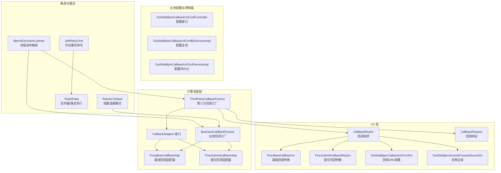
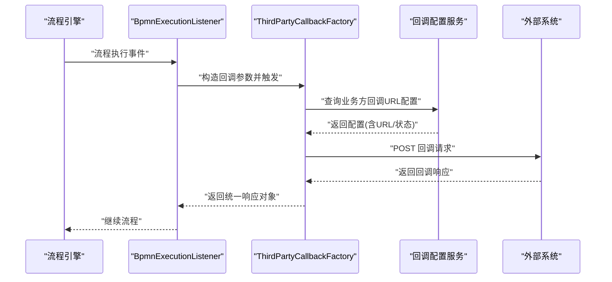
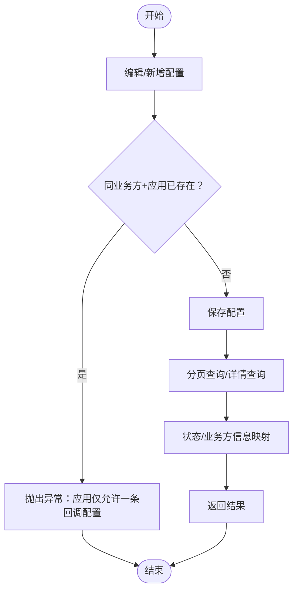
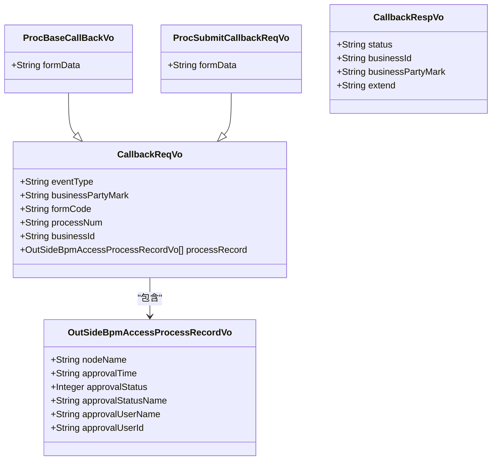
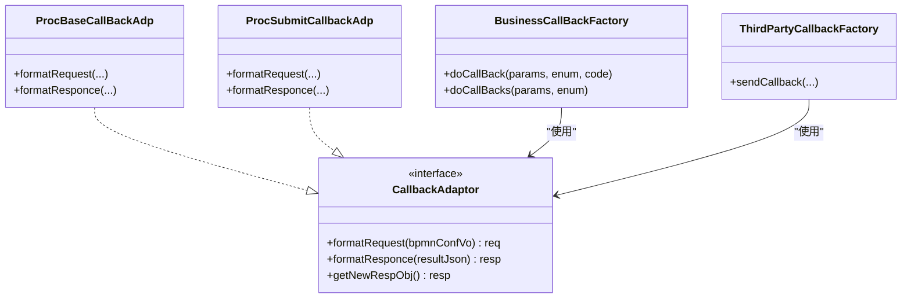
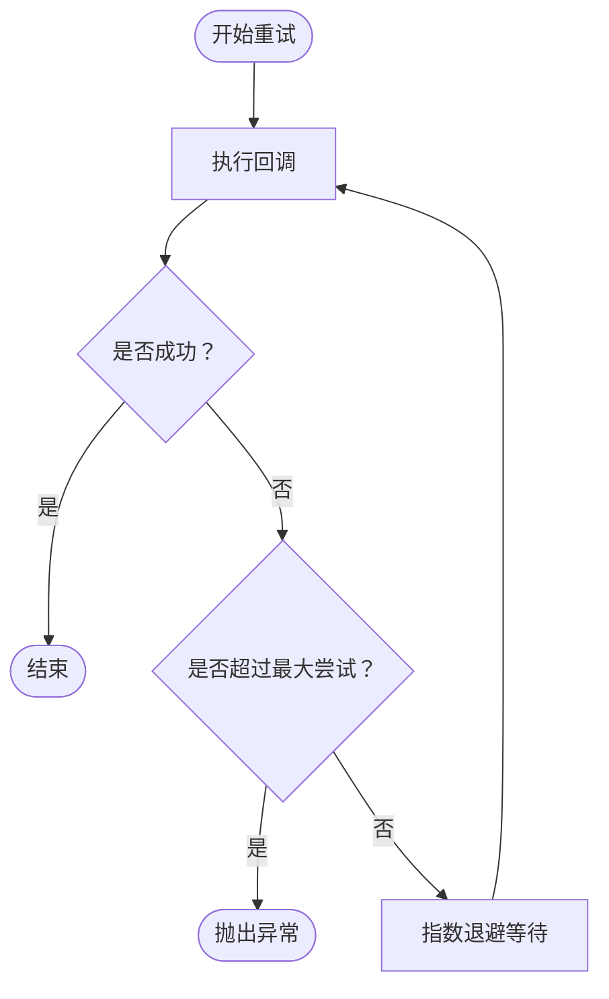
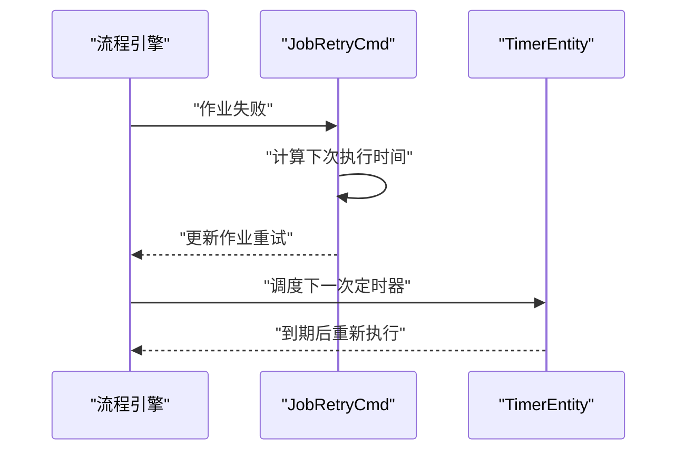
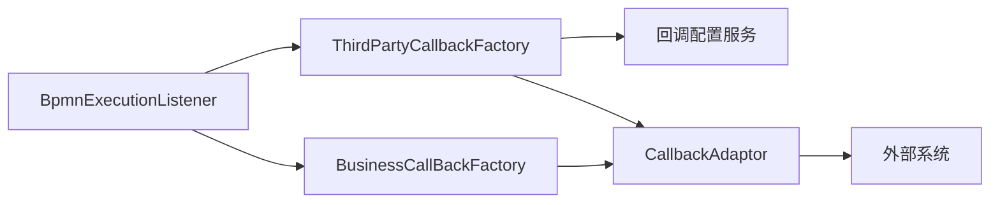

# 回调通知机制

<cite>
**本文引用的文件**
- [ProcBaseCallBackAdp.java](file://antflow-engine/src/main/java/org/openoa/engine/bpmnconf/adp/processcallback/ProcBaseCallBackAdp.java)
- [ProcSubmitCallbackAdp.java](file://antflow-engine/src/main/java/org/openoa/engine/bpmnconf/adp/processcallback/ProcSubmitCallbackAdp.java)
- [CallbackAdaptor.java](file://antflow-engine/src/main/java/org/openoa/engine/factory/CallbackAdaptor.java)
- [BusinessCallBackFactory.java](file://antflow-engine/src/main/java/org/openoa/engine/bpmnconf/service/biz/callback/BusinessCallBackFactory.java)
- [CallbackReqVo.java](file://antflow-engine/src/main/java/org/openoa/engine/vo/CallbackReqVo.java)
- [CallbackRespVo.java](file://antflow-engine/src/main/java/org/openoa/engine/vo/CallbackRespVo.java)
- [ProcBaseCallBackVo.java](file://antflow-engine/src/main/java/org/openoa/engine/vo/ProcBaseCallBackVo.java)
- [ProcSubmitCallbackReqVo.java](file://antflow-engine/src/main/java/org/openoa/engine/vo/ProcSubmitCallbackReqVo.java)
- [OutSideBpmCallbackUrlConfVo.java](file://antflow-engine/src/main/java/org/openoa/engine/vo/OutSideBpmCallbackUrlConfVo.java)
- [OutSideBpmAccessProcessRecordVo.java](file://antflow-engine/src/main/java/org/openoa/engine/vo/OutSideBpmAccessProcessRecordVo.java)
- [OutSideBpmCallbackUrlConfController.java](file://antflow-engine/src/main/java/org/openoa/engine/bpmnconf/controller/OutSideBpmCallbackUrlConfController.java)
- [OutSideBpmCallbackUrlConfBizServiceImpl.java](file://antflow-engine/src/main/java/org/openoa/engine/bpmnconf/service/biz/OutSideBpmCallbackUrlConfBizServiceImpl.java)
- [OutSideBpmCallbackUrlConfServiceImpl.java](file://antflow-engine/src/main/java/org/openoa/engine/bpmnconf/service/impl/OutSideBpmCallbackUrlConfServiceImpl.java)
- [ThirdPartyCallbackFactory.java](file://antflow-engine/src/main/java/org/openoa/engine/factory/ThirdPartyCallbackFactory.java)
- [BpmnExecutionListener.java](file://antflow-engine/src/main/java/org/openoa/engine/bpmnconf/activitilistener/BpmnExecutionListener.java)
- [Retryer.java](file://antflow-base/src/main/java/org/openoa/base/util/Retryer.java)
- [JobRetryCmd.java](file://antflow-base/src/main/java/org/activiti/engine/impl/cmd/JobRetryCmd.java)
- [TimerEntity.java](file://antflow-base/src/main/java/org/activiti/engine/impl/persistence/entity/TimerEntity.java)
</cite>

## 目录
1. [简介](#简介)
2. [项目结构](#项目结构)
3. [核心组件](#核心组件)
4. [架构总览](#架构总览)
5. [详细组件分析](#详细组件分析)
6. [依赖关系分析](#依赖关系分析)
7. [性能考量](#性能考量)
8. [故障排查指南](#故障排查指南)
9. [结论](#结论)
10. [附录](#附录)

## 简介
本文件系统化梳理了工作流系统中的“回调通知机制”，覆盖回调 URL 配置、通知触发时机、消息格式规范、流程状态变更与任务完成通知、异常情况通知、回调重试与超时处理、幂等性保障、测试方法、监控指标与故障排查，以及与外部系统的集成最佳实践。目标是帮助开发者与运维人员在不深入源码的前提下，也能正确理解并高效落地该机制。

## 项目结构
回调通知机制主要分布在以下模块与包中：
- 引擎适配层：回调适配器与工厂
  - org.openoa.engine.bpmnconf.adp.processcallback（流程提交/基础回调适配器）
  - org.openoa.engine.factory（回调适配器接口与第三方回调工厂）
- VO 层：回调请求/响应与业务扩展
  - org.openoa.engine.vo（回调请求/响应、流程记录、回调配置等）
- 业务配置与控制器
  - org.openoa.engine.bpmnconf.controller（回调 URL 配置的增删改查）
  - org.openoa.engine.bpmnconf.service.biz/impl（配置查询与重建）
- 监听与触发
  - org.openoa.engine.bpmnconf.activitilistener（流程执行监听器触发回调）
- 重试与定时器
  - org.openoa.base.util.Retryer（重试策略）
  - org.activiti.engine.impl.cmd.JobRetryCmd（作业重试命令）
  - org.activiti.engine.impl.persistence.entity.TimerEntity（定时器与重复执行）

图表来源
- [CallbackAdaptor.java:11-36](file://antflow-engine/src/main/java/org/openoa/engine/factory/CallbackAdaptor.java#L11-L36)
- [ProcBaseCallBackAdp.java:10-21](file://antflow-engine/src/main/java/org/openoa/engine/bpmnconf/adp/processcallback/ProcBaseCallBackAdp.java#L10-L21)
- [ProcSubmitCallbackAdp.java:10-24](file://antflow-engine/src/main/java/org/openoa/engine/bpmnconf/adp/processcallback/ProcSubmitCallbackAdp.java#L10-L24)
- [BusinessCallBackFactory.java:17-89](file://antflow-engine/src/main/java/org/openoa/engine/bpmnconf/service/biz/callback/BusinessCallBackFactory.java#L17-L89)
- [ThirdPartyCallbackFactory.java:104-139](file://antflow-engine/src/main/java/org/openoa/engine/factory/ThirdPartyCallbackFactory.java#L104-L139)
- [CallbackReqVo.java:9-40](file://antflow-engine/src/main/java/org/openoa/engine/vo/CallbackReqVo.java#L9-L40)
- [CallbackRespVo.java:8-30](file://antflow-engine/src/main/java/org/openoa/engine/vo/CallbackRespVo.java#L8-L30)
- [ProcBaseCallBackVo.java:6-20](file://antflow-engine/src/main/java/org/openoa/engine/vo/ProcBaseCallBackVo.java#L6-L20)
- [ProcSubmitCallbackReqVo.java:6-20](file://antflow-engine/src/main/java/org/openoa/engine/vo/ProcSubmitCallbackReqVo.java#L6-L20)
- [OutSideBpmCallbackUrlConfVo.java:26-139](file://antflow-engine/src/main/java/org/openoa/engine/vo/OutSideBpmCallbackUrlConfVo.java#L26-L139)
- [OutSideBpmAccessProcessRecordVo.java:14-46](file://antflow-engine/src/main/java/org/openoa/engine/vo/OutSideBpmAccessProcessRecordVo.java#L14-L46)
- [OutSideBpmCallbackUrlConfController.java:40-66](file://antflow-engine/src/main/java/org/openoa/engine/bpmnconf/controller/OutSideBpmCallbackUrlConfController.java#L40-L66)
- [OutSideBpmCallbackUrlConfBizServiceImpl.java:100-158](file://antflow-engine/src/main/java/org/openoa/engine/bpmnconf/service/biz/OutSideBpmCallbackUrlConfBizServiceImpl.java#L100-L158)
- [OutSideBpmCallbackUrlConfServiceImpl.java:32-99](file://antflow-engine/src/main/java/org/openoa/engine/bpmnconf/service/impl/OutSideBpmCallbackUrlConfServiceImpl.java#L32-L99)
- [BpmnExecutionListener.java:74-95](file://antflow-engine/src/main/java/org/openoa/engine/bpmnconf/activitilistener/BpmnExecutionListener.java#L74-L95)
- [Retryer.java:9-50](file://antflow-base/src/main/java/org/openoa/base/util/Retryer.java#L9-L50)
- [JobRetryCmd.java:51-143](file://antflow-base/src/main/java/org/activiti/engine/impl/cmd/JobRetryCmd.java#L51-L143)
- [TimerEntity.java:108-283](file://antflow-base/src/main/java/org/activiti/engine/impl/persistence/entity/TimerEntity.java#L108-L283)

章节来源
- [ProcBaseCallBackAdp.java:10-21](file://antflow-engine/src/main/java/org/openoa/engine/bpmnconf/adp/processcallback/ProcBaseCallBackAdp.java#L10-L21)
- [ProcSubmitCallbackAdp.java:10-24](file://antflow-engine/src/main/java/org/openoa/engine/bpmnconf/adp/processcallback/ProcSubmitCallbackAdp.java#L10-L24)
- [CallbackAdaptor.java:11-36](file://antflow-engine/src/main/java/org/openoa/engine/factory/CallbackAdaptor.java#L11-L36)
- [BusinessCallBackFactory.java:17-89](file://antflow-engine/src/main/java/org/openoa/engine/bpmnconf/service/biz/callback/BusinessCallBackFactory.java#L17-L89)
- [CallbackReqVo.java:9-40](file://antflow-engine/src/main/java/org/openoa/engine/vo/CallbackReqVo.java#L9-L40)
- [CallbackRespVo.java:8-30](file://antflow-engine/src/main/java/org/openoa/engine/vo/CallbackRespVo.java#L8-L30)
- [ProcBaseCallBackVo.java:6-20](file://antflow-engine/src/main/java/org/openoa/engine/vo/ProcBaseCallBackVo.java#L6-L20)
- [ProcSubmitCallbackReqVo.java:6-20](file://antflow-engine/src/main/java/org/openoa/engine/vo/ProcSubmitCallbackReqVo.java#L6-L20)
- [OutSideBpmCallbackUrlConfVo.java:26-139](file://antflow-engine/src/main/java/org/openoa/engine/vo/OutSideBpmCallbackUrlConfVo.java#L26-L139)
- [OutSideBpmAccessProcessRecordVo.java:14-46](file://antflow-engine/src/main/java/org/openoa/engine/vo/OutSideBpmAccessProcessRecordVo.java#L14-L46)
- [OutSideBpmCallbackUrlConfController.java:40-66](file://antflow-engine/src/main/java/org/openoa/engine/bpmnconf/controller/OutSideBpmCallbackUrlConfController.java#L40-L66)
- [OutSideBpmCallbackUrlConfBizServiceImpl.java:100-158](file://antflow-engine/src/main/java/org/openoa/engine/bpmnconf/service/biz/OutSideBpmCallbackUrlConfBizServiceImpl.java#L100-L158)
- [OutSideBpmCallbackUrlConfServiceImpl.java:32-99](file://antflow-engine/src/main/java/org/openoa/engine/bpmnconf/service/impl/OutSideBpmCallbackUrlConfServiceImpl.java#L32-L99)
- [BpmnExecutionListener.java:74-95](file://antflow-engine/src/main/java/org/openoa/engine/bpmnconf/activitilistener/BpmnExecutionListener.java#L74-L95)
- [Retryer.java:9-50](file://antflow-base/src/main/java/org/openoa/base/util/Retryer.java#L9-L50)
- [JobRetryCmd.java:51-143](file://antflow-base/src/main/java/org/activiti/engine/impl/cmd/JobRetryCmd.java#L51-L143)
- [TimerEntity.java:108-283](file://antflow-base/src/main/java/org/activiti/engine/impl/persistence/entity/TimerEntity.java#L108-L283)

## 核心组件
- 回调适配器接口与实现
  - CallbackAdaptor：定义格式化请求与响应的方法，并提供生成空响应对象的能力。
  - ProcBaseCallBackAdp：面向“基础流程”场景的适配器，将流程表单数据封装为基础回调参数。
  - ProcSubmitCallbackAdp：面向“流程提交”场景的适配器，将表单数据封装为提交回调参数。
- 回调工厂
  - BusinessCallBackFactory：根据业务回调枚举选择适配器并执行回调；内置默认重试器进行指数退避重试。
  - ThirdPartyCallbackFactory：负责从配置中获取回调 URL、组装请求参数、构造请求体、发送回调并解析响应。
- VO 与配置
  - CallbackReqVo/CallbackRespVo：统一的回调请求/响应模型。
  - ProcBaseCallBackVo/ProcSubmitCallbackReqVo：扩展请求体，承载表单数据。
  - OutSideBpmCallbackUrlConfVo：外部业务方回调 URL 配置，包含业务方 ID、应用 ID、配置 URL、状态等。
  - OutSideBpmAccessProcessRecordVo：流程节点审批记录，用于在回调中携带审批轨迹。
- 触发与配置
  - BpmnExecutionListener：在流程执行阶段提取上下文变量，触发回调工厂或第三方回调工厂。
  - OutSideBpmCallbackUrlConfController/BizServiceImpl/ServiceImpl：提供回调 URL 配置的分页查询、详情、编辑等能力。

章节来源
- [CallbackAdaptor.java:11-36](file://antflow-engine/src/main/java/org/openoa/engine/factory/CallbackAdaptor.java#L11-L36)
- [ProcBaseCallBackAdp.java:10-21](file://antflow-engine/src/main/java/org/openoa/engine/bpmnconf/adp/processcallback/ProcBaseCallBackAdp.java#L10-L21)
- [ProcSubmitCallbackAdp.java:10-24](file://antflow-engine/src/main/java/org/openoa/engine/bpmnconf/adp/processcallback/ProcSubmitCallbackAdp.java#L10-L24)
- [BusinessCallBackFactory.java:17-89](file://antflow-engine/src/main/java/org/openoa/engine/bpmnconf/service/biz/callback/BusinessCallBackFactory.java#L17-L89)
- [ThirdPartyCallbackFactory.java:104-139](file://antflow-engine/src/main/java/org/openoa/engine/factory/ThirdPartyCallbackFactory.java#L104-L139)
- [CallbackReqVo.java:9-40](file://antflow-engine/src/main/java/org/openoa/engine/vo/CallbackReqVo.java#L9-L40)
- [CallbackRespVo.java:8-30](file://antflow-engine/src/main/java/org/openoa/engine/vo/CallbackRespVo.java#L8-L30)
- [ProcBaseCallBackVo.java:6-20](file://antflow-engine/src/main/java/org/openoa/engine/vo/ProcBaseCallBackVo.java#L6-L20)
- [ProcSubmitCallbackReqVo.java:6-20](file://antflow-engine/src/main/java/org/openoa/engine/vo/ProcSubmitCallbackReqVo.java#L6-L20)
- [OutSideBpmCallbackUrlConfVo.java:26-139](file://antflow-engine/src/main/java/org/openoa/engine/vo/OutSideBpmCallbackUrlConfVo.java#L26-L139)
- [OutSideBpmAccessProcessRecordVo.java:14-46](file://antflow-engine/src/main/java/org/openoa/engine/vo/OutSideBpmAccessProcessRecordVo.java#L14-L46)
- [BpmnExecutionListener.java:74-95](file://antflow-engine/src/main/java/org/openoa/engine/bpmnconf/activitilistener/BpmnExecutionListener.java#L74-L95)
- [OutSideBpmCallbackUrlConfController.java:40-66](file://antflow-engine/src/main/java/org/openoa/engine/bpmnconf/controller/OutSideBpmCallbackUrlConfController.java#L40-L66)
- [OutSideBpmCallbackUrlConfBizServiceImpl.java:100-158](file://antflow-engine/src/main/java/org/openoa/engine/bpmnconf/service/biz/OutSideBpmCallbackUrlConfBizServiceImpl.java#L100-L158)
- [OutSideBpmCallbackUrlConfServiceImpl.java:32-99](file://antflow-engine/src/main/java/org/openoa/engine/bpmnconf/service/impl/OutSideBpmCallbackUrlConfServiceImpl.java#L32-L99)

## 架构总览
回调通知的整体流程如下：
- 配置阶段：通过控制器与业务服务维护回调 URL 配置（业务方、应用、URL、状态）。
- 触发阶段：流程监听器从执行上下文中提取流程相关信息，构造回调请求体。
- 发送阶段：第三方回调工厂根据配置选择回调 URL，封装请求并发送；若关闭回调开关，则直接返回模拟响应。
- 响应阶段：解析响应为统一回调响应对象；业务回调工厂对适配器执行回调并进行重试。
- 异常与重试：当回调失败时，采用指数退避重试；同时工作流内部的作业重试命令与定时器可确保流程任务按周期重试。

图表来源
- [BpmnExecutionListener.java:74-95](file://antflow-engine/src/main/java/org/openoa/engine/bpmnconf/activitilistener/BpmnExecutionListener.java#L74-L95)
- [ThirdPartyCallbackFactory.java:104-139](file://antflow-engine/src/main/java/org/openoa/engine/factory/ThirdPartyCallbackFactory.java#L104-L139)
- [OutSideBpmCallbackUrlConfBizServiceImpl.java:100-158](file://antflow-engine/src/main/java/org/openoa/engine/bpmnconf/service/biz/OutSideBpmCallbackUrlConfBizServiceImpl.java#L100-L158)
- [OutSideBpmCallbackUrlConfServiceImpl.java:32-99](file://antflow-engine/src/main/java/org/openoa/engine/bpmnconf/service/impl/OutSideBpmCallbackUrlConfServiceImpl.java#L32-L99)

## 详细组件分析

### 组件一：回调 URL 配置
- 配置项
  - 业务方标识、应用标识、配置 URL（流程配置/流程实例）、状态（启用/封存）、创建/更新信息等。
- 查询与编辑
  - 控制器提供分页查询、详情查询、编辑接口。
  - 业务服务负责状态映射、业务方信息拼装、管理员列表装配。
  - 实现服务负责唯一性校验（同一业务方+应用仅允许一条配置），并维护创建/更新用户与时间。
- 使用建议
  - 启用前校验 URL 可达性与鉴权参数；封存时避免发送新回调。

图表来源
- [OutSideBpmCallbackUrlConfServiceImpl.java:32-72](file://antflow-engine/src/main/java/org/openoa/engine/bpmnconf/service/impl/OutSideBpmCallbackUrlConfServiceImpl.java#L32-L72)
- [OutSideBpmCallbackUrlConfBizServiceImpl.java:100-158](file://antflow-engine/src/main/java/org/openoa/engine/bpmnconf/service/biz/OutSideBpmCallbackUrlConfBizServiceImpl.java#L100-L158)
- [OutSideBpmCallbackUrlConfController.java:40-66](file://antflow-engine/src/main/java/org/openoa/engine/bpmnconf/controller/OutSideBpmCallbackUrlConfController.java#L40-L66)

章节来源
- [OutSideBpmCallbackUrlConfVo.java:26-139](file://antflow-engine/src/main/java/org/openoa/engine/vo/OutSideBpmCallbackUrlConfVo.java#L26-L139)
- [OutSideBpmCallbackUrlConfServiceImpl.java:32-99](file://antflow-engine/src/main/java/org/openoa/engine/bpmnconf/service/impl/OutSideBpmCallbackUrlConfServiceImpl.java#L32-L99)
- [OutSideBpmCallbackUrlConfBizServiceImpl.java:100-158](file://antflow-engine/src/main/java/org/openoa/engine/bpmnconf/service/biz/OutSideBpmCallbackUrlConfBizServiceImpl.java#L100-L158)
- [OutSideBpmCallbackUrlConfController.java:40-66](file://antflow-engine/src/main/java/org/openoa/engine/bpmnconf/controller/OutSideBpmCallbackUrlConfController.java#L40-L66)

### 组件二：回调触发时机与消息格式
- 触发时机
  - 在流程执行监听器中提取 bpmnCode、processNumber、formCode、businessId、startUser 等变量，作为回调参数的一部分。
- 请求消息格式
  - 通用字段：eventType（事件类型）、businessPartyMark（业务方标识）、formCode（表单编号）、processNum（流程编号）、businessId（对接方业务编号）、processRecord（流程记录列表）。
  - 扩展字段：formData（表单数据 JSON 字符串），分别由基础回调与提交回调适配器注入。
- 响应消息格式
  - 通用字段：status（返回状态）、businessId（对接方返回业务编号）、businessPartyMark（业务方标识）、extend（业务扩展信息）。

图表来源
- [CallbackReqVo.java:9-40](file://antflow-engine/src/main/java/org/openoa/engine/vo/CallbackReqVo.java#L9-L40)
- [ProcBaseCallBackVo.java:6-20](file://antflow-engine/src/main/java/org/openoa/engine/vo/ProcBaseCallBackVo.java#L6-L20)
- [ProcSubmitCallbackReqVo.java:6-20](file://antflow-engine/src/main/java/org/openoa/engine/vo/ProcSubmitCallbackReqVo.java#L6-L20)
- [CallbackRespVo.java:8-30](file://antflow-engine/src/main/java/org/openoa/engine/vo/CallbackRespVo.java#L8-L30)
- [OutSideBpmAccessProcessRecordVo.java:14-46](file://antflow-engine/src/main/java/org/openoa/engine/vo/OutSideBpmAccessProcessRecordVo.java#L14-L46)

章节来源
- [BpmnExecutionListener.java:74-95](file://antflow-engine/src/main/java/org/openoa/engine/bpmnconf/activitilistener/BpmnExecutionListener.java#L74-L95)
- [CallbackReqVo.java:9-40](file://antflow-engine/src/main/java/org/openoa/engine/vo/CallbackReqVo.java#L9-L40)
- [CallbackRespVo.java:8-30](file://antflow-engine/src/main/java/org/openoa/engine/vo/CallbackRespVo.java#L8-L30)
- [ProcBaseCallBackVo.java:6-20](file://antflow-engine/src/main/java/org/openoa/engine/vo/ProcBaseCallBackVo.java#L6-L20)
- [ProcSubmitCallbackReqVo.java:6-20](file://antflow-engine/src/main/java/org/openoa/engine/vo/ProcSubmitCallbackReqVo.java#L6-L20)
- [OutSideBpmAccessProcessRecordVo.java:14-46](file://antflow-engine/src/main/java/org/openoa/engine/vo/OutSideBpmAccessProcessRecordVo.java#L14-L46)

### 组件三：回调适配器与工厂
- 适配器
  - CallbackAdaptor：定义 formatRequest/formatResponce，并提供 getNewRespObj 以反射生成空响应对象。
  - ProcBaseCallBackAdp：将 BpmnConfVo 的表单数据封装为基础回调参数。
  - ProcSubmitCallbackAdp：将表单数据封装为提交回调参数。
- 工厂
  - BusinessCallBackFactory：按业务回调枚举选择适配器集合，逐个执行回调；对单个适配器使用 Retryer.Default 进行重试。
  - ThirdPartyCallbackFactory：在回调开关开启时，根据配置构造请求并发送；关闭时返回模拟响应（若存在 businessId 则生成随机业务编号）。

图表来源
- [CallbackAdaptor.java:11-36](file://antflow-engine/src/main/java/org/openoa/engine/factory/CallbackAdaptor.java#L11-L36)
- [ProcBaseCallBackAdp.java:10-21](file://antflow-engine/src/main/java/org/openoa/engine/bpmnconf/adp/processcallback/ProcBaseCallBackAdp.java#L10-L21)
- [ProcSubmitCallbackAdp.java:10-24](file://antflow-engine/src/main/java/org/openoa/engine/bpmnconf/adp/processcallback/ProcSubmitCallbackAdp.java#L10-L24)
- [BusinessCallBackFactory.java:17-89](file://antflow-engine/src/main/java/org/openoa/engine/bpmnconf/service/biz/callback/BusinessCallBackFactory.java#L17-L89)
- [ThirdPartyCallbackFactory.java:104-139](file://antflow-engine/src/main/java/org/openoa/engine/factory/ThirdPartyCallbackFactory.java#L104-L139)

章节来源
- [CallbackAdaptor.java:11-36](file://antflow-engine/src/main/java/org/openoa/engine/factory/CallbackAdaptor.java#L11-L36)
- [ProcBaseCallBackAdp.java:10-21](file://antflow-engine/src/main/java/org/openoa/engine/bpmnconf/adp/processcallback/ProcBaseCallBackAdp.java#L10-L21)
- [ProcSubmitCallbackAdp.java:10-24](file://antflow-engine/src/main/java/org/openoa/engine/bpmnconf/adp/processcallback/ProcSubmitCallbackAdp.java#L10-L24)
- [BusinessCallBackFactory.java:17-89](file://antflow-engine/src/main/java/org/openoa/engine/bpmnconf/service/biz/callback/BusinessCallBackFactory.java#L17-L89)
- [ThirdPartyCallbackFactory.java:104-139](file://antflow-engine/src/main/java/org/openoa/engine/factory/ThirdPartyCallbackFactory.java#L104-L139)

### 组件四：重试机制、超时处理与幂等性
- 重试机制
  - 默认重试器 Retryer.Default：指数退避（初始间隔、最大间隔、最大尝试次数），每次失败等待 nextMaxInterval 后重试。
  - 业务回调工厂对单个适配器循环调用，直到成功或达到最大尝试次数。
- 超时处理
  - 第三方回调工厂在发送回调时应结合 HTTP 客户端的连接/读取超时配置；如未显式设置，需在基础设施层统一配置。
- 幂等性
  - 建议外部系统基于 businessId 做幂等校验；若回调开关关闭，工厂会为响应填充随机 businessId，便于外部系统识别重复请求。

图表来源
- [Retryer.java:9-50](file://antflow-base/src/main/java/org/openoa/base/util/Retryer.java#L9-L50)
- [BusinessCallBackFactory.java:42-66](file://antflow-engine/src/main/java/org/openoa/engine/bpmnconf/service/biz/callback/BusinessCallBackFactory.java#L42-L66)
- [ThirdPartyCallbackFactory.java:104-139](file://antflow-engine/src/main/java/org/openoa/engine/factory/ThirdPartyCallbackFactory.java#L104-L139)

章节来源
- [Retryer.java:9-50](file://antflow-base/src/main/java/org/openoa/base/util/Retryer.java#L9-L50)
- [BusinessCallBackFactory.java:42-66](file://antflow-engine/src/main/java/org/openoa/engine/bpmnconf/service/biz/callback/BusinessCallBackFactory.java#L42-L66)
- [ThirdPartyCallbackFactory.java:104-139](file://antflow-engine/src/main/java/org/openoa/engine/factory/ThirdPartyCallbackFactory.java#L104-L139)

### 组件五：流程状态变更与任务完成通知
- 触发点：流程监听器在执行阶段提取流程上下文变量，构造回调请求并发送。
- 通知内容：包含事件类型、业务方标识、表单编号、流程编号、业务编号、流程记录列表等。
- 任务完成通知：可在流程结束或节点完成时触发相应事件类型，由适配器封装对应参数并发送。

章节来源
- [BpmnExecutionListener.java:74-95](file://antflow-engine/src/main/java/org/openoa/engine/bpmnconf/activitilistener/BpmnExecutionListener.java#L74-L95)
- [CallbackReqVo.java:9-40](file://antflow-engine/src/main/java/org/openoa/engine/vo/CallbackReqVo.java#L9-L40)
- [OutSideBpmAccessProcessRecordVo.java:14-46](file://antflow-engine/src/main/java/org/openoa/engine/vo/OutSideBpmAccessProcessRecordVo.java#L14-L46)

### 组件六：异常情况通知与工作流重试
- 异常通知：回调失败时，业务回调工厂记录日志；第三方回调工厂可根据需要扩展异常上报。
- 工作流重试：作业重试命令根据活动配置的失败重试周期计算下次执行时间；定时器实体支持重复执行表达式，确保任务按周期重试。

图表来源
- [JobRetryCmd.java:51-143](file://antflow-base/src/main/java/org/activiti/engine/impl/cmd/JobRetryCmd.java#L51-L143)
- [TimerEntity.java:108-283](file://antflow-base/src/main/java/org/activiti/engine/impl/persistence/entity/TimerEntity.java#L108-L283)

章节来源
- [JobRetryCmd.java:51-143](file://antflow-base/src/main/java/org/activiti/engine/impl/cmd/JobRetryCmd.java#L51-L143)
- [TimerEntity.java:108-283](file://antflow-base/src/main/java/org/activiti/engine/impl/persistence/entity/TimerEntity.java#L108-L283)

## 依赖关系分析
- 低耦合高内聚
  - 适配器通过接口与工厂解耦；工厂仅依赖回调枚举与适配器集合。
  - 第三方回调工厂依赖配置服务与适配器，职责清晰。
- 关键依赖链
  - BpmnExecutionListener → ThirdPartyCallbackFactory → CallbackAdaptor → 外部系统
  - BusinessCallBackFactory → CallbackAdaptor → 外部系统
- 循环依赖风险
  - 当前结构未见循环依赖；若后续扩展，需避免工厂与适配器互相持有引用。

图表来源
- [BpmnExecutionListener.java:74-95](file://antflow-engine/src/main/java/org/openoa/engine/bpmnconf/activitilistener/BpmnExecutionListener.java#L74-L95)
- [ThirdPartyCallbackFactory.java:104-139](file://antflow-engine/src/main/java/org/openoa/engine/factory/ThirdPartyCallbackFactory.java#L104-L139)
- [BusinessCallBackFactory.java:17-89](file://antflow-engine/src/main/java/org/openoa/engine/bpmnconf/service/biz/callback/BusinessCallBackFactory.java#L17-L89)
- [CallbackAdaptor.java:11-36](file://antflow-engine/src/main/java/org/openoa/engine/factory/CallbackAdaptor.java#L11-L36)

章节来源
- [BpmnExecutionListener.java:74-95](file://antflow-engine/src/main/java/org/openoa/engine/bpmnconf/activitilistener/BpmnExecutionListener.java#L74-L95)
- [ThirdPartyCallbackFactory.java:104-139](file://antflow-engine/src/main/java/org/openoa/engine/factory/ThirdPartyCallbackFactory.java#L104-L139)
- [BusinessCallBackFactory.java:17-89](file://antflow-engine/src/main/java/org/openoa/engine/bpmnconf/service/biz/callback/BusinessCallBackFactory.java#L17-L89)
- [CallbackAdaptor.java:11-36](file://antflow-engine/src/main/java/org/openoa/engine/factory/CallbackAdaptor.java#L11-L36)

## 性能考量
- 异步回调：建议外部系统异步处理回调请求，避免阻塞回调发送线程。
- 超时与并发：合理设置 HTTP 客户端超时与并发数，防止回调风暴影响主流程。
- 日志与监控：对回调耗时、成功率、失败原因进行埋点，便于容量规划与问题定位。
- 缓存与降级：在外部系统不可用时，可考虑本地缓存或降级策略，待恢复后再回放。

## 故障排查指南
- 常见问题
  - 回调 URL 未配置或状态为封存：检查配置服务返回值与状态。
  - 回调失败重试多次仍失败：查看业务回调工厂日志与重试器配置。
  - 响应格式不符：核对回调响应模型字段与外部系统实现。
- 排查步骤
  - 确认流程监听器是否正确提取上下文变量并触发回调。
  - 检查第三方回调工厂是否读取到正确的业务方标识与回调 URL。
  - 验证外部系统是否返回标准响应；必要时在工厂侧增加响应解析日志。
  - 若出现作业重试频繁，检查工作流作业重试命令与定时器配置。
- 监控指标建议
  - 回调成功率、平均耗时、失败率、重试次数、外部系统可用性。

章节来源
- [OutSideBpmCallbackUrlConfBizServiceImpl.java:100-158](file://antflow-engine/src/main/java/org/openoa/engine/bpmnconf/service/biz/OutSideBpmCallbackUrlConfBizServiceImpl.java#L100-L158)
- [BusinessCallBackFactory.java:42-83](file://antflow-engine/src/main/java/org/openoa/engine/bpmnconf/service/biz/callback/BusinessCallBackFactory.java#L42-L83)
- [JobRetryCmd.java:51-143](file://antflow-base/src/main/java/org/activiti/engine/impl/cmd/JobRetryCmd.java#L51-L143)

## 结论
该回调通知机制通过“配置驱动 + 适配器 + 工厂 + 重试”的架构，实现了对流程状态变更、任务完成、异常情况的灵活通知。结合合理的超时与幂等设计，可在保证可靠性的同时提升系统整体吞吐。建议在生产环境中完善监控与告警，并持续优化外部系统的异步处理能力。

## 附录

### 回调配置示例（字段说明）
- 业务方标识：用于区分不同外部系统。
- 应用标识：用于区分同一业务方下的不同应用。
- 配置 URL：流程配置回调 URL 或流程实例回调 URL。
- 状态：启用/封存。
- 其他：创建人、创建时间、更新人、更新时间、备注等。

章节来源
- [OutSideBpmCallbackUrlConfVo.java:26-139](file://antflow-engine/src/main/java/org/openoa/engine/vo/OutSideBpmCallbackUrlConfVo.java#L26-L139)

### 消息格式定义（请求/响应）
- 请求
  - 事件类型、业务方标识、表单编号、流程编号、业务编号、流程记录列表、表单数据(JSON 字符串)。
- 响应
  - 返回状态、业务编号、业务方标识、扩展信息。

章节来源
- [CallbackReqVo.java:9-40](file://antflow-engine/src/main/java/org/openoa/engine/vo/CallbackReqVo.java#L9-L40)
- [CallbackRespVo.java:8-30](file://antflow-engine/src/main/java/org/openoa/engine/vo/CallbackRespVo.java#L8-L30)
- [ProcBaseCallBackVo.java:6-20](file://antflow-engine/src/main/java/org/openoa/engine/vo/ProcBaseCallBackVo.java#L6-L20)
- [ProcSubmitCallbackReqVo.java:6-20](file://antflow-engine/src/main/java/org/openoa/engine/vo/ProcSubmitCallbackReqVo.java#L6-L20)

### 错误处理策略
- 业务回调工厂：捕获运行时异常，使用重试器继续或抛出。
- 第三方回调工厂：在回调开关关闭时返回模拟响应；开启时对异常进行记录与重试。
- 工作流层面：作业重试命令与定时器确保任务按周期重试。

章节来源
- [BusinessCallBackFactory.java:42-83](file://antflow-engine/src/main/java/org/openoa/engine/bpmnconf/service/biz/callback/BusinessCallBackFactory.java#L42-L83)
- [ThirdPartyCallbackFactory.java:104-139](file://antflow-engine/src/main/java/org/openoa/engine/factory/ThirdPartyCallbackFactory.java#L104-L139)
- [JobRetryCmd.java:51-143](file://antflow-base/src/main/java/org/activiti/engine/impl/cmd/JobRetryCmd.java#L51-L143)

### 回调测试方法
- 单元测试
  - Mock 外部系统响应，验证回调请求体构造与响应解析。
  - 验证重试器在多次失败后的行为。
- 集成测试
  - 搭建最小化外部系统，验证回调 URL 可达性与鉴权。
  - 模拟网络抖动与超时，验证重试与超时处理。
- 压力测试
  - 评估回调并发量与外部系统处理能力，调整超时与并发参数。

### 监控指标
- 回调成功率、平均耗时、失败率、重试次数、外部系统可用性、错误分布。

### 故障排查清单
- 检查配置状态与 URL 是否正确。
- 核对业务方标识与应用标识。
- 查看回调工厂日志与重试器配置。
- 检查工作流作业重试与定时器配置。