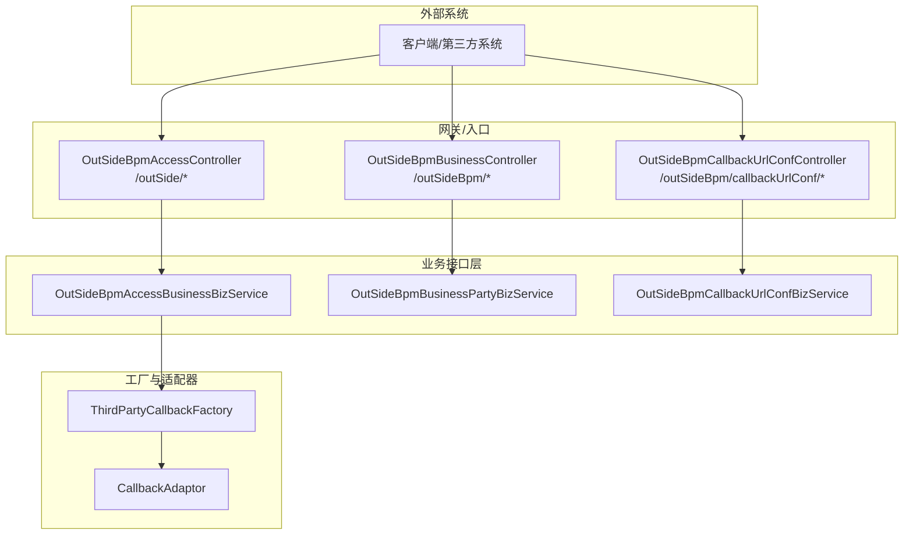
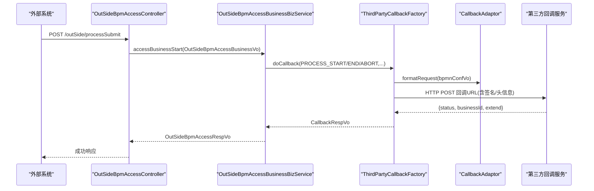
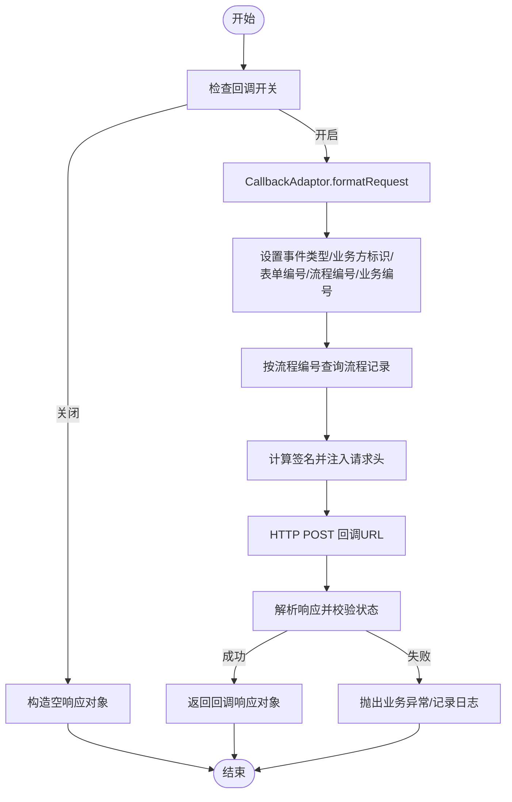
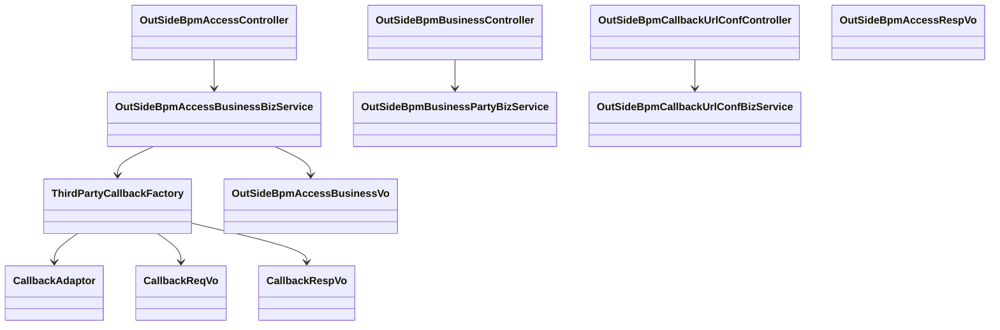

# 外部系统集成

<cite>
**本文引用的文件**
- [OutSideBpmAccessController.java](file://antflow-engine/src/main/java/org/openoa/engine/bpmnconf/controller/OutSideBpmAccessController.java)
- [OutSideBpmBusinessController.java](file://antflow-engine/src/main/java/org/openoa/engine/bpmnconf/controller/OutSideBpmBusinessController.java)
- [OutSideBpmCallbackUrlConfController.java](file://antflow-engine/src/main/java/org/openoa/engine/bpmnconf/controller/OutSideBpmCallbackUrlConfController.java)
- [ThirdPartyCallbackFactory.java](file://antflow-engine/src/main/java/org/openoa/engine/factory/ThirdPartyCallbackFactory.java)
- [CallbackAdaptor.java](file://antflow-engine/src/main/java/org/openoa/engine/factory/CallbackAdaptor.java)
- [OutSideBpmAccessBusinessBizService.java](file://antflow-engine/src/main/java/org/openoa/engine/bpmnconf/service/interf/biz/OutSideBpmAccessBusinessBizService.java)
- [OutSideBpmBusinessPartyBizService.java](file://antflow-engine/src/main/java/org/openoa/engine/bpmnconf/service/interf/biz/OutSideBpmBusinessPartyBizService.java)
- [OutSideBpmCallbackUrlConfBizService.java](file://antflow-engine/src/main/java/org/openoa/engine/bpmnconf/service/interf/biz/OutSideBpmCallbackUrlConfBizService.java)
- [OutSideBpmAccessBusinessVo.java](file://antflow-engine/src/main/java/org/openoa/engine/vo/OutSideBpmAccessBusinessVo.java)
- [OutSideBpmAccessRespVo.java](file://antflow-engine/src/main/java/org/openoa/engine/vo/OutSideBpmAccessRespVo.java)
- [CallbackReqVo.java](file://antflow-engine/src/main/java/org/openoa/engine/vo/CallbackReqVo.java)
- [CallbackRespVo.java](file://antflow-engine/src/main/java/org/openoa/engine/vo/CallbackRespVo.java)
- [AntFlowConstants.java](file://antflow-engine/src/main/java/org/openoa/engine/bpmnconf/constant/AntFlowConstants.java)
</cite>

## 目录
1. [简介](#简介)
2. [项目结构](#项目结构)
3. [核心组件](#核心组件)
4. [架构总览](#架构总览)
5. [详细组件分析](#详细组件分析)
6. [依赖关系分析](#依赖关系分析)
7. [性能考虑](#性能考虑)
8. [故障排查指南](#故障排查指南)
9. [结论](#结论)
10. [附录](#附录)

## 简介
本指南面向需要将外部系统接入本工作流引擎的开发者，系统性阐述 REST API 设计原则、认证与授权机制、数据转换与回调通知流程、多租户与权限控制模型，并提供集成步骤、示例与测试方法，帮助快速完成对接。

## 项目结构
围绕“外部系统集成”的关键模块主要分布在以下位置：
- 控制器层：负责对外暴露 REST 接口，统一入口为 `/outSide` 与 `/outSideBpm`
- 工厂与适配器：负责回调通知的统一调度与适配
- VO/DTO：定义请求与响应的数据结构
- 业务接口：封装业务能力，如流程发起、模板管理、回调配置等

图表来源
- [OutSideBpmAccessController.java:20-91](file://antflow-engine/src/main/java/org/openoa/engine/bpmnconf/controller/OutSideBpmAccessController.java#L20-L91)
- [OutSideBpmBusinessController.java:18-196](file://antflow-engine/src/main/java/org/openoa/engine/bpmnconf/controller/OutSideBpmBusinessController.java#L18-L196)
- [OutSideBpmCallbackUrlConfController.java:14-69](file://antflow-engine/src/main/java/org/openoa/engine/bpmnconf/controller/OutSideBpmCallbackUrlConfController.java#L14-L69)
- [ThirdPartyCallbackFactory.java:52-359](file://antflow-engine/src/main/java/org/openoa/engine/factory/ThirdPartyCallbackFactory.java#L52-L359)
- [CallbackAdaptor.java:11-37](file://antflow-engine/src/main/java/org/openoa/engine/factory/CallbackAdaptor.java#L11-L37)

章节来源
- [OutSideBpmAccessController.java:20-91](file://antflow-engine/src/main/java/org/openoa/engine/bpmnconf/controller/OutSideBpmAccessController.java#L20-L91)
- [OutSideBpmBusinessController.java:18-196](file://antflow-engine/src/main/java/org/openoa/engine/bpmnconf/controller/OutSideBpmBusinessController.java#L18-L196)
- [OutSideBpmCallbackUrlConfController.java:14-69](file://antflow-engine/src/main/java/org/openoa/engine/bpmnconf/controller/OutSideBpmCallbackUrlConfController.java#L14-L69)

## 核心组件
- REST 控制器
  - 流程接入与查询：/outSide/processSubmit、/outSide/processPreview、/outSide/processBreak、/outSide/outSideProcessRecord
  - 业务方与应用管理：/outSideBpm/businessParty/*
  - 条件模板与审批模板：/outSideBpm/conditionTemplate/*、/outSideBpm/approveTemplate/*
  - 回调地址配置：/outSideBpm/callbackUrlConf/*

- 工厂与适配器
  - ThirdPartyCallbackFactory：统一回调调度、签名、请求头注入、HTTP 调用、响应解析
  - CallbackAdaptor：回调请求/响应格式化接口，按事件类型注入具体实现

- 数据模型
  - OutSideBpmAccessBusinessVo：外部系统提交的流程请求体
  - OutSideBpmAccessRespVo：流程返回的响应体
  - CallbackReqVo/CallbackRespVo：回调通知的请求/响应体

章节来源
- [OutSideBpmAccessController.java:32-91](file://antflow-engine/src/main/java/org/openoa/engine/bpmnconf/controller/OutSideBpmAccessController.java#L32-L91)
- [OutSideBpmBusinessController.java:35-196](file://antflow-engine/src/main/java/org/openoa/engine/bpmnconf/controller/OutSideBpmBusinessController.java#L35-L196)
- [OutSideBpmCallbackUrlConfController.java:23-67](file://antflow-engine/src/main/java/org/openoa/engine/bpmnconf/controller/OutSideBpmCallbackUrlConfController.java#L23-L67)
- [ThirdPartyCallbackFactory.java:89-253](file://antflow-engine/src/main/java/org/openoa/engine/factory/ThirdPartyCallbackFactory.java#L89-L253)
- [CallbackAdaptor.java:11-37](file://antflow-engine/src/main/java/org/openoa/engine/factory/CallbackAdaptor.java#L11-L37)
- [OutSideBpmAccessBusinessVo.java:21-139](file://antflow-engine/src/main/java/org/openoa/engine/vo/OutSideBpmAccessBusinessVo.java#L21-L139)
- [OutSideBpmAccessRespVo.java:12-34](file://antflow-engine/src/main/java/org/openoa/engine/vo/OutSideBpmAccessRespVo.java#L12-L34)
- [CallbackReqVo.java:8-41](file://antflow-engine/src/main/java/org/openoa/engine/vo/CallbackReqVo.java#L8-L41)
- [CallbackRespVo.java:7-31](file://antflow-engine/src/main/java/org/openoa/engine/vo/CallbackRespVo.java#L7-L31)

## 架构总览
外部系统通过 REST API 发起流程、查询模板、配置回调；引擎在流程关键节点触发回调通知，携带签名与上下文信息，第三方系统据此进行业务处理与回传。

图表来源
- [OutSideBpmAccessController.java:38-41](file://antflow-engine/src/main/java/org/openoa/engine/bpmnconf/controller/OutSideBpmAccessController.java#L38-L41)
- [ThirdPartyCallbackFactory.java:89-253](file://antflow-engine/src/main/java/org/openoa/engine/factory/ThirdPartyCallbackFactory.java#L89-L253)
- [CallbackAdaptor.java:11-37](file://antflow-engine/src/main/java/org/openoa/engine/factory/CallbackAdaptor.java#L11-L37)

## 详细组件分析

### REST API 设计原则
- 统一前缀与命名
  - 外部接入：/outSide/*（流程发起、预览、中断、查询）
  - 业务与模板：/outSideBpm/*（业务方、应用、条件模板、审批模板）
  - 回调配置：/outSideBpm/callbackUrlConf/*（分页、详情、编辑）

- 请求/响应规范
  - 请求体统一使用 JSON，响应体遵循统一包装结构（成功/失败、数据、分页）
  - 分页查询统一使用 PageDto 参数

- 方法语义
  - POST /processSubmit：提交流程
  - GET /outSideProcessRecord：按流程号查询流程记录
  - POST /processBreak：中断流程
  - GET/POST 回调配置与模板管理接口：分页、详情、编辑、删除

章节来源
- [OutSideBpmAccessController.java:32-91](file://antflow-engine/src/main/java/org/openoa/engine/bpmnconf/controller/OutSideBpmAccessController.java#L32-L91)
- [OutSideBpmBusinessController.java:35-196](file://antflow-engine/src/main/java/org/openoa/engine/bpmnconf/controller/OutSideBpmBusinessController.java#L35-L196)
- [OutSideBpmCallbackUrlConfController.java:23-67](file://antflow-engine/src/main/java/org/openoa/engine/bpmnconf/controller/OutSideBpmCallbackUrlConfController.java#L23-L67)

### 认证与授权机制
- 回调签名与身份
  - 请求头注入
    - api-client-id：客户端标识
    - api-workflow-sign：基于请求体+密钥的 MD5 后 Base64 的签名
    - sso-uid、sso-name：当前登录人标识
    - central-service：当前系统域名
  - 签名生成与校验
    - 使用请求体 JSON 字符串拼接密钥后做 MD5，再 Base64 编码作为签名
    - 第三方需对称校验签名，确保请求未被篡改
  - 开关控制
    - 通过配置 outside.callback.switch 控制是否启用回调

- 登录态与上下文
  - 从安全工具获取当前登录员工信息，写入回调头
  - 通过请求上下文获取当前系统域名，便于第三方定位

章节来源
- [ThirdPartyCallbackFactory.java:175-200](file://antflow-engine/src/main/java/org/openoa/engine/factory/ThirdPartyCallbackFactory.java#L175-L200)
- [ThirdPartyCallbackFactory.java:312-356](file://antflow-engine/src/main/java/org/openoa/engine/factory/ThirdPartyCallbackFactory.java#L312-L356)

### 数据转换与回调流程
- 请求格式化
  - CallbackAdaptor.formatRequest 将流程配置转换为回调请求体
  - 设置事件类型、业务方标识、表单编号、流程编号、业务编号、流程记录等
- 流程记录
  - 若存在流程编号，查询流程节点记录并映射为 OutSideBpmAccessProcessRecordVo 列表
- 响应解析
  - 校验返回状态码（约定成功标记），解析 businessId 与扩展信息
  - 异常时抛出业务异常或记录日志并返回空结果

图表来源
- [ThirdPartyCallbackFactory.java:89-253](file://antflow-engine/src/main/java/org/openoa/engine/factory/ThirdPartyCallbackFactory.java#L89-L253)
- [CallbackAdaptor.java:11-37](file://antflow-engine/src/main/java/org/openoa/engine/factory/CallbackAdaptor.java#L11-L37)

### 外部系统接入流程
- 步骤
  1) 在后台配置业务方与应用、回调地址与密钥
  2) 外部系统调用 /outSide/processSubmit 提交流程
  3) 引擎在流程关键节点触发回调通知（启动、完成、中断等）
  4) 外部系统处理并返回约定格式的响应
  5) 引擎记录流程记录并返回结果

- 关键接口
  - /outSide/processSubmit：提交流程
  - /outSide/processBreak：中断流程
  - /outSide/outSideProcessRecord：查询流程记录
  - /outSideBpm/businessParty/*：业务方与应用管理
  - /outSideBpm/callbackUrlConf/*：回调地址配置

章节来源
- [OutSideBpmAccessController.java:38-91](file://antflow-engine/src/main/java/org/openoa/engine/bpmnconf/controller/OutSideBpmAccessController.java#L38-L91)
- [OutSideBpmBusinessController.java:35-196](file://antflow-engine/src/main/java/org/openoa/engine/bpmnconf/controller/OutSideBpmBusinessController.java#L35-L196)
- [OutSideBpmCallbackUrlConfController.java:23-67](file://antflow-engine/src/main/java/org/openoa/engine/bpmnconf/controller/OutSideBpmCallbackUrlConfController.java#L23-L67)

### 错误处理策略
- 回调失败
  - 空响应：直接返回空结果
  - 状态不为成功：抛出业务异常，记录请求头、入参、出参
  - 网络异常：捕获异常并记录日志
- 业务异常
  - 业务方缺失、回调开关关闭等场景，构造空响应或抛出明确异常

章节来源
- [ThirdPartyCallbackFactory.java:235-250](file://antflow-engine/src/main/java/org/openoa/engine/factory/ThirdPartyCallbackFactory.java#L235-L250)

### 多租户支持与权限控制
- 多租户标识
  - 业务方标识 businessPartyMark：用于区分不同租户的表单编号前缀与回调配置
  - 表单编号格式化：formatFormCode 自动补全业务方前缀
- 权限控制
  - 回调开关：outside.callback.switch 控制是否发送回调
  - 登录态：sso-uid/sso-name 传递当前操作人信息
  - 回调地址与密钥：按业务方维度配置，避免跨租户泄露

章节来源
- [ThirdPartyCallbackFactory.java:262-267](file://antflow-engine/src/main/java/org/openoa/engine/factory/ThirdPartyCallbackFactory.java#L262-L267)
- [ThirdPartyCallbackFactory.java:94-98](file://antflow-engine/src/main/java/org/openoa/engine/factory/ThirdPartyCallbackFactory.java#L94-L98)
- [ThirdPartyCallbackFactory.java:175-192](file://antflow-engine/src/main/java/org/openoa/engine/factory/ThirdPartyCallbackFactory.java#L175-L192)

### 数据模型与字段说明
- 外部流程接入请求体
  - 包含业务方 ID、流程配置 ID、表单编号、PC/App 表单数据、模板标记、发起用户、审批人员、扩展字段等
- 外部流程接入响应体
  - 返回流程编号、业务编号、流程记录列表
- 回调请求/响应体
  - 事件类型、业务方标识、表单编号、流程编号、业务编号、流程记录、状态码与扩展信息

章节来源
- [OutSideBpmAccessBusinessVo.java:21-139](file://antflow-engine/src/main/java/org/openoa/engine/vo/OutSideBpmAccessBusinessVo.java#L21-L139)
- [OutSideBpmAccessRespVo.java:12-34](file://antflow-engine/src/main/java/org/openoa/engine/vo/OutSideBpmAccessRespVo.java#L12-L34)
- [CallbackReqVo.java:8-41](file://antflow-engine/src/main/java/org/openoa/engine/vo/CallbackReqVo.java#L8-L41)
- [CallbackRespVo.java:7-31](file://antflow-engine/src/main/java/org/openoa/engine/vo/CallbackRespVo.java#L7-L31)

## 依赖关系分析
- 控制器依赖业务接口，业务接口依赖工厂与适配器
- 工厂通过 Spring Bean 获取回调适配器与配置服务
- 适配器负责请求/响应格式化，保证不同事件类型的可扩展性

图表来源
- [OutSideBpmAccessController.java:24-30](file://antflow-engine/src/main/java/org/openoa/engine/bpmnconf/controller/OutSideBpmAccessController.java#L24-L30)
- [OutSideBpmBusinessController.java:24-33](file://antflow-engine/src/main/java/org/openoa/engine/bpmnconf/controller/OutSideBpmBusinessController.java#L24-L33)
- [OutSideBpmCallbackUrlConfController.java:21-22](file://antflow-engine/src/main/java/org/openoa/engine/bpmnconf/controller/OutSideBpmCallbackUrlConfController.java#L21-L22)
- [ThirdPartyCallbackFactory.java:114-118](file://antflow-engine/src/main/java/org/openoa/engine/factory/ThirdPartyCallbackFactory.java#L114-L118)
- [CallbackAdaptor.java:11-37](file://antflow-engine/src/main/java/org/openoa/engine/factory/CallbackAdaptor.java#L11-L37)
- [OutSideBpmAccessBusinessVo.java:21-139](file://antflow-engine/src/main/java/org/openoa/engine/vo/OutSideBpmAccessBusinessVo.java#L21-L139)
- [OutSideBpmAccessRespVo.java:12-34](file://antflow-engine/src/main/java/org/openoa/engine/vo/OutSideBpmAccessRespVo.java#L12-L34)
- [CallbackReqVo.java:8-41](file://antflow-engine/src/main/java/org/openoa/engine/vo/CallbackReqVo.java#L8-L41)
- [CallbackRespVo.java:7-31](file://antflow-engine/src/main/java/org/openoa/engine/vo/CallbackRespVo.java#L7-L31)

## 性能考虑
- 回调开关
  - outside.callback.switch 可在调试阶段关闭回调，减少网络开销
- 连接与超时
  - 当前实现使用 Apache HttpClient，默认连接池与超时未显式配置，建议在生产环境增加连接池与超时设置
- 日志与监控
  - 回调请求与响应均记录日志，建议结合链路追踪与指标监控，定位慢调用

## 故障排查指南
- 回调失败
  - 检查回调开关是否开启
  - 核对签名算法：请求体 JSON + 密钥 MD5 后 Base64
  - 确认回调 URL、api-client-id、api-workflow-sign 是否正确
- 状态不为成功
  - 核对第三方返回的状态码与消息
- 空响应
  - 检查第三方服务是否正常返回
- 登录态问题
  - 确认 sso-uid、sso-name 是否正确传递

章节来源
- [ThirdPartyCallbackFactory.java:94-98](file://antflow-engine/src/main/java/org/openoa/engine/factory/ThirdPartyCallbackFactory.java#L94-L98)
- [ThirdPartyCallbackFactory.java:175-192](file://antflow-engine/src/main/java/org/openoa/engine/factory/ThirdPartyCallbackFactory.java#L175-L192)
- [ThirdPartyCallbackFactory.java:235-250](file://antflow-engine/src/main/java/org/openoa/engine/factory/ThirdPartyCallbackFactory.java#L235-L250)

## 结论
本集成方案以清晰的 REST 接口、可插拔的回调适配器与严格的签名机制为核心，支持多租户与权限控制，满足外部系统对接工作流的需求。建议在生产环境完善连接池、超时与监控配置，并严格校验回调签名与状态码，确保系统稳定与安全。

## 附录

### API 文档与集成示例
- 流程发起
  - 方法：POST
  - 路径：/outSide/processSubmit
  - 请求体：OutSideBpmAccessBusinessVo
  - 响应体：OutSideBpmAccessRespVo
  - 参考路径：[OutSideBpmAccessController.java:38-41](file://antflow-engine/src/main/java/org/openoa/engine/bpmnconf/controller/OutSideBpmAccessController.java#L38-L41)，[OutSideBpmAccessBusinessVo.java:21-139](file://antflow-engine/src/main/java/org/openoa/engine/vo/OutSideBpmAccessBusinessVo.java#L21-L139)，[OutSideBpmAccessRespVo.java:12-34](file://antflow-engine/src/main/java/org/openoa/engine/vo/OutSideBpmAccessRespVo.java#L12-L34)

- 流程预览
  - 方法：POST
  - 路径：/outSide/processPreview
  - 请求体：OutSideBpmAccessBusinessVo
  - 响应体：Result
  - 参考路径：[OutSideBpmAccessController.java:62-65](file://antflow-engine/src/main/java/org/openoa/engine/bpmnconf/controller/OutSideBpmAccessController.java#L62-L65)

- 中断流程
  - 方法：POST
  - 路径：/outSide/processBreak
  - 请求体：OutSideBpmAccessBusinessVo
  - 响应体：Result
  - 参考路径：[OutSideBpmAccessController.java:73-77](file://antflow-engine/src/main/java/org/openoa/engine/bpmnconf/controller/OutSideBpmAccessController.java#L73-L77)

- 查询流程记录
  - 方法：GET
  - 路径：/outSide/outSideProcessRecord
  - 参数：processNumber
  - 响应体：Result
  - 参考路径：[OutSideBpmAccessController.java:85-88](file://antflow-engine/src/main/java/org/openoa/engine/bpmnconf/controller/OutSideBpmAccessController.java#L85-L88)

- 回调配置管理
  - 查询列表：GET /outSideBpm/callbackUrlConf/listPage
  - 查询详情：GET /outSideBpm/callbackUrlConf/detail/{id}
  - 编辑配置：POST /outSideBpm/callbackUrlConf/edit
  - 参考路径：[OutSideBpmCallbackUrlConfController.java:29-66](file://antflow-engine/src/main/java/org/openoa/engine/bpmnconf/controller/OutSideBpmCallbackUrlConfController.java#L29-L66)

- 业务方与应用管理
  - 业务方分页：POST /outSideBpm/businessParty/listPage
  - 应用分页：POST /outSideBpm/businessParty/applicationsPageList
  - 编辑业务方：POST /outSideBpm/businessParty/edit
  - 参考路径：[OutSideBpmBusinessController.java:38-100](file://antflow-engine/src/main/java/org/openoa/engine/bpmnconf/controller/OutSideBpmBusinessController.java#L38-L100)

### 集成测试方法
- 单元测试
  - 针对控制器层：构造 OutSideBpmAccessBusinessVo，调用 /outSide/processSubmit 并断言响应
  - 针对工厂层：Mock CallbackAdaptor，验证签名与请求头注入
- 回调测试
  - 搭建本地回调服务，接收请求并返回约定状态码与业务编号
  - 配置回调地址与密钥，开启回调开关，观察日志与响应
- 多租户测试
  - 使用不同业务方标识，验证表单编号前缀与回调配置隔离

章节来源
- [OutSideBpmAccessController.java:38-91](file://antflow-engine/src/main/java/org/openoa/engine/bpmnconf/controller/OutSideBpmAccessController.java#L38-L91)
- [OutSideBpmBusinessController.java:38-100](file://antflow-engine/src/main/java/org/openoa/engine/bpmnconf/controller/OutSideBpmBusinessController.java#L38-L100)
- [OutSideBpmCallbackUrlConfController.java:29-66](file://antflow-engine/src/main/java/org/openoa/engine/bpmnconf/controller/OutSideBpmCallbackUrlConfController.java#L29-L66)
- [ThirdPartyCallbackFactory.java:175-200](file://antflow-engine/src/main/java/org/openoa/engine/factory/ThirdPartyCallbackFactory.java#L175-L200)