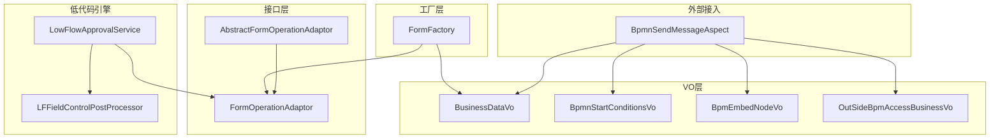
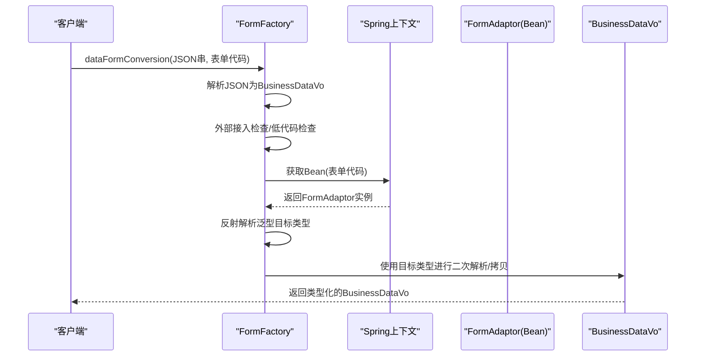
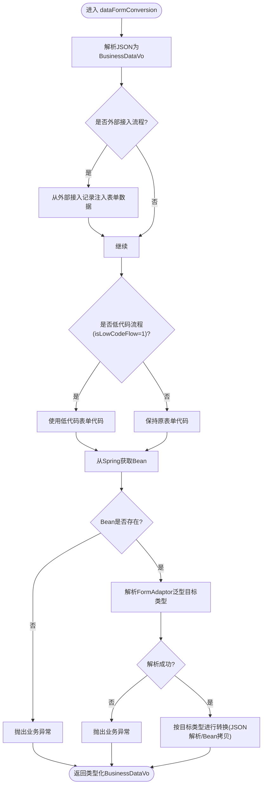
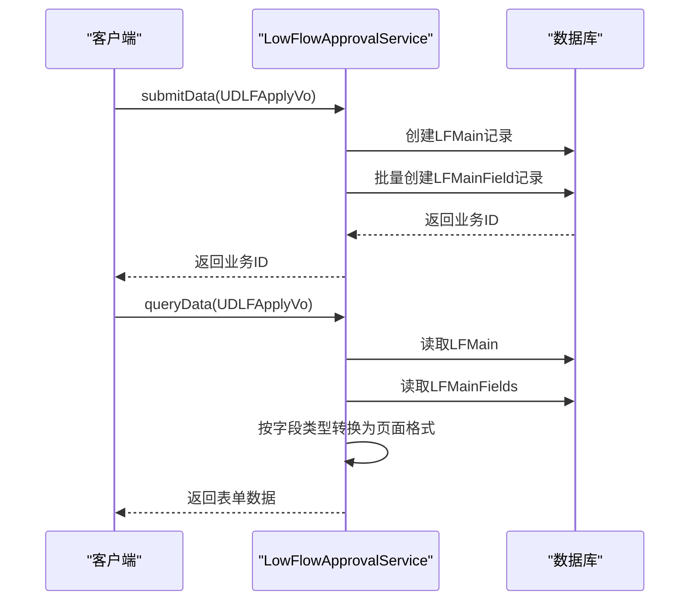
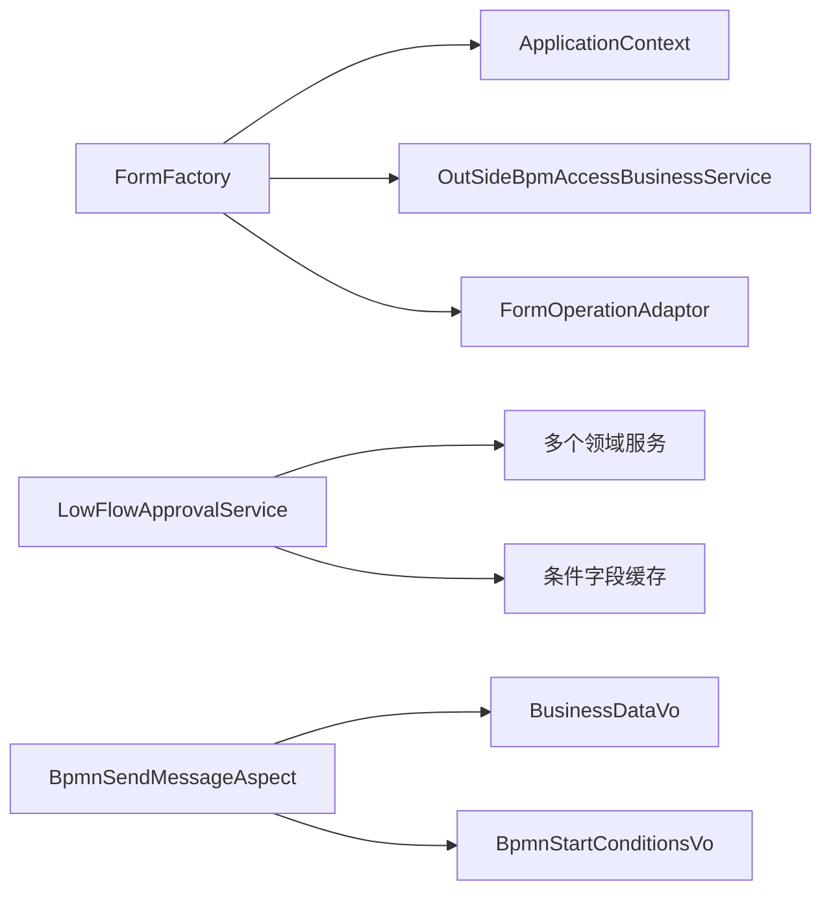

# 数据转换处理

<cite>
**本文引用的文件**
- [FormFactory.java](file://antflow-engine/src/main/java/org/openoa/engine/factory/FormFactory.java)
- [BusinessDataVo.java](file://antflow-base/src/main/java/org/openoa/base/vo/BusinessDataVo.java)
- [FormOperationAdaptor.java](file://antflow-base/src/main/java/org/openoa/base/interf/FormOperationAdaptor.java)
- [AbstractFormOperationAdaptor.java](file://antflow-engine/src/main/java/org/openoa/engine/bpmnconf/adp/processoperation/AbstractFormOperationAdaptor.java)
- [LowFlowApprovalService.java](file://antflow-engine/src/main/java/org/openoa/engine/lowflow/service/LowFlowApprovalService.java)
- [BpmnSendMessageAspect.java](file://antflow-engine/src/main/java/org/openoa/engine/conf/aspect/BpmnSendMessageAspect.java)
- [BpmnStartConditionsVo.java](file://antflow-base/src/main/java/org/openoa/base/vo/BpmnStartConditionsVo.java)
- [BpmEmbedNodeVo.java](file://antflow-base/src/main/java/org/openoa/base/vo/BpmEmbedNodeVo.java)
- [OutSideBpmAccessBusinessVo.java](file://antflow-engine/src/main/java/org/openoa/engine/vo/OutSideBpmAccessBusinessVo.java)
- [LFFieldControlPostProcessor.java](file://antflow-engine/src/main/java/org/openoa/engine/lowflow/service/LFFieldControlPostProcessor.java)
- [10.外部系统集成.md](file://doc/系统介绍篇/10.外部系统集成.md)
- [9.低代码引擎.md](file://doc/系统介绍篇/9.低代码引擎.md)
- [4.后端系统.md](file://doc/系统介绍篇/4.后端系统.md)
</cite>

## 目录
1. [简介](#简介)
2. [项目结构](#项目结构)
3. [核心组件](#核心组件)
4. [架构总览](#架构总览)
5. [详细组件分析](#详细组件分析)
6. [依赖关系分析](#依赖关系分析)
7. [性能考虑](#性能考虑)
8. [故障排查指南](#故障排查指南)
9. [结论](#结论)
10. [附录](#附录)

## 简介
本文件聚焦于系统中的“数据转换处理”能力，围绕 FormFactory 的数据转换机制、JSON 到 BusinessDataVo 的转换流程、类型转换规则展开，同时覆盖外部数据格式验证、数据清洗、字段映射策略，以及低代码流程的特殊处理、嵌入式节点的数据注入、表单代码验证机制。文档还提供数据转换示例、错误处理策略、性能优化技巧、测试方法与调试工具使用指南。

## 项目结构
- 后端核心位于 antflow-engine 与 antflow-base 模块，数据转换主要涉及：
  - 工厂层：FormFactory 负责根据表单代码选择适配器并进行类型化转换
  - 接口层：FormOperationAdaptor 定义表单生命周期与数据处理契约
  - VO 层：BusinessDataVo 作为统一的业务数据载体
  - 低代码引擎：LowFlowApprovalService 实现低代码表单的提交、查询与字段类型转换
  - 嵌入式与外部接入：BpmnSendMessageAspect、BpmnStartConditionsVo、BpmEmbedNodeVo、OutSideBpmAccessBusinessVo 等支撑外部与嵌入式场景

**图表来源**
- [FormFactory.java:1-159](file://antflow-engine/src/main/java/org/openoa/engine/factory/FormFactory.java#L1-L159)
- [FormOperationAdaptor.java:1-106](file://antflow-base/src/main/java/org/openoa/base/interf/FormOperationAdaptor.java#L1-L106)
- [AbstractFormOperationAdaptor.java:1-62](file://antflow-engine/src/main/java/org/openoa/engine/bpmnconf/adp/processoperation/AbstractFormOperationAdaptor.java#L1-L62)
- [BusinessDataVo.java:1-257](file://antflow-base/src/main/java/org/openoa/base/vo/BusinessDataVo.java#L1-L257)
- [BpmnStartConditionsVo.java:118-158](file://antflow-base/src/main/java/org/openoa/base/vo/BpmnStartConditionsVo.java#L118-L158)
- [BpmEmbedNodeVo.java:1-34](file://antflow-base/src/main/java/org/openoa/base/vo/BpmEmbedNodeVo.java#L1-L34)
- [OutSideBpmAccessBusinessVo.java:114-138](file://antflow-engine/src/main/java/org/openoa/engine/vo/OutSideBpmAccessBusinessVo.java#L114-L138)
- [LowFlowApprovalService.java:1-200](file://antflow-engine/src/main/java/org/openoa/engine/lowflow/service/LowFlowApprovalService.java#L1-L200)
- [LFFieldControlPostProcessor.java:1-38](file://antflow-engine/src/main/java/org/openoa/engine/lowflow/service/LFFieldControlPostProcessor.java#L1-L38)
- [BpmnSendMessageAspect.java:70-102](file://antflow-engine/src/main/java/org/openoa/engine/conf/aspect/BpmnSendMessageAspect.java#L70-L102)

**章节来源**
- [FormFactory.java:1-159](file://antflow-engine/src/main/java/org/openoa/engine/factory/FormFactory.java#L1-L159)
- [BusinessDataVo.java:1-257](file://antflow-base/src/main/java/org/openoa/base/vo/BusinessDataVo.java#L1-L257)

## 核心组件
- FormFactory：负责将外部 JSON 或已有的 BusinessDataVo 对象转换为具体表单类型的 BusinessDataVo 实例，支持外部接入与低代码流程的特殊处理。
- FormOperationAdaptor：表单适配器接口，定义表单生命周期方法（初始化、启动参数、查询、提交、同意、退回修改、取消、流程恢复、自动条件与动作等）。
- BusinessDataVo：统一业务数据载体，承载流程号、业务ID、表单代码、外部接入标记、低代码标记、嵌入式节点、条件字段等。
- LowFlowApprovalService：低代码表单生命周期实现，负责字段类型转换、条件字段缓存、字段控制后置处理等。
- BpmnSendMessageAspect：在发送消息前对业务数据进行外部接入检测、业务方信息注入、BpmnConf 映射、表单数据注入等。
- BpmnStartConditionsVo：流程启动条件载体，包含低代码标记、外部类型、嵌入式节点、条件字段等。
- BpmEmbedNodeVo：嵌入式节点描述，用于外部接入式流程的节点注入。
- OutSideBpmAccessBusinessVo：外部接入业务记录，存储 PC/App 端表单数据，供外部接入流程回填。

**章节来源**
- [FormFactory.java:70-123](file://antflow-engine/src/main/java/org/openoa/engine/factory/FormFactory.java#L70-L123)
- [FormOperationAdaptor.java:14-106](file://antflow-base/src/main/java/org/openoa/base/interf/FormOperationAdaptor.java#L14-L106)
- [BusinessDataVo.java:174-256](file://antflow-base/src/main/java/org/openoa/base/vo/BusinessDataVo.java#L174-L256)
- [LowFlowApprovalService.java:42-200](file://antflow-engine/src/main/java/org/openoa/engine/lowflow/service/LowFlowApprovalService.java#L42-L200)
- [BpmnSendMessageAspect.java:70-102](file://antflow-engine/src/main/java/org/openoa/engine/conf/aspect/BpmnSendMessageAspect.java#L70-L102)
- [BpmnStartConditionsVo.java:118-158](file://antflow-base/src/main/java/org/openoa/base/vo/BpmnStartConditionsVo.java#L118-L158)
- [BpmEmbedNodeVo.java:16-34](file://antflow-base/src/main/java/org/openoa/base/vo/BpmEmbedNodeVo.java#L16-L34)
- [OutSideBpmAccessBusinessVo.java:114-138](file://antflow-engine/src/main/java/org/openoa/engine/vo/OutSideBpmAccessBusinessVo.java#L114-L138)

## 架构总览
下图展示从外部 JSON 到类型化 BusinessDataVo 的转换路径，以及低代码流程与嵌入式节点的特殊处理。

**图表来源**
- [FormFactory.java:70-123](file://antflow-engine/src/main/java/org/openoa/engine/factory/FormFactory.java#L70-L123)
- [10.外部系统集成.md:159-191](file://doc/系统介绍篇/10.外部系统集成.md#L159-L191)

## 详细组件分析

### FormFactory 数据转换机制
- 输入支持两种形态：
  - 字符串 JSON：先解析为 BusinessDataVo，再按表单代码与低代码标记选择目标类型
  - 已有 BusinessDataVo：直接按上述规则进行类型化转换
- 关键步骤：
  - 外部接入检测：若为外部接入流程，则从 OutSideBpmAccessBusiness 记录中回填表单数据
  - 低代码流程标记：当 isLowCodeFlow=1 时，强制使用低代码表单代码
  - Bean 获取：通过 Spring 上下文按表单代码获取 FormAdaptor Bean
  - 类型解析：反射解析 FormAdaptor 泛型参数，定位目标 BusinessDataVo 子类
  - 类型化转换：使用目标类型进行 JSON 解析或通过 BeanUtils 进行属性拷贝
- 错误处理：
  - 无法获取 Bean：抛出业务异常
  - 未找到泛型目标类型：抛出业务异常

**图表来源**
- [FormFactory.java:70-123](file://antflow-engine/src/main/java/org/openoa/engine/factory/FormFactory.java#L70-L123)
- [FormFactory.java:124-152](file://antflow-engine/src/main/java/org/openoa/engine/factory/FormFactory.java#L124-L152)

**章节来源**
- [FormFactory.java:70-123](file://antflow-engine/src/main/java/org/openoa/engine/factory/FormFactory.java#L70-L123)
- [FormFactory.java:124-152](file://antflow-engine/src/main/java/org/openoa/engine/factory/FormFactory.java#L124-L152)
- [10.外部系统集成.md:159-191](file://doc/系统介绍篇/10.外部系统集成.md#L159-L191)

### JSON 到 BusinessDataVo 的转换流程
- 入参为 JSON 字符串与可选表单代码：
  - 若未提供表单代码，从解析后的 BusinessDataVo 中读取
  - 外部接入流程：根据 processNumber 查询外部接入记录，回填 formDataPc 至 formData
  - 低代码流程：强制使用低代码表单代码
  - Bean 获取：通过 Spring 上下文按表单代码获取对应适配器 Bean
  - 类型解析：解析 FormAdaptor 泛型参数，得到目标 BusinessDataVo 子类
  - 最终转换：使用目标类型进行 JSON 解析，得到强类型 BusinessDataVo

**章节来源**
- [FormFactory.java:70-123](file://antflow-engine/src/main/java/org/openoa/engine/factory/FormFactory.java#L70-L123)

### 类型转换规则
- 目标类型解析：
  - 通过反射遍历 FormAdaptor 的所有泛型类型，筛选出泛型参数中继承自 BusinessDataVo 的具体类型
  - 将该类型作为后续 JSON 解析的目标类
- 转换方式：
  - JSON 解析：适用于字符串 JSON 场景
  - BeanUtils 拷贝：适用于已有 BusinessDataVo 对象场景，新建目标类型实例并拷贝属性

**章节来源**
- [FormFactory.java:124-152](file://antflow-engine/src/main/java/org/openoa/engine/factory/FormFactory.java#L124-L152)

### 外部数据格式验证与数据清洗
- 外部接入检测：
  - 在发送消息前，根据表单编号匹配流程配置，设置 isOutSideAccessProc 标记
  - 读取业务方信息并注入 outSideType
- 外部接入数据注入：
  - 根据 processNumber 查询 OutSideBpmAccessBusiness 记录，将 formDataPc 注入到 BusinessDataVo.formData
- 数据清洗：
  - 低代码流程中对 select 字段的数值解析进行容错处理，无法解析时保留原始字符串
  - 日期字段统一格式化输出，布尔字段进行显式转换

**章节来源**
- [BpmnSendMessageAspect.java:70-102](file://antflow-engine/src/main/java/org/openoa/engine/conf/aspect/BpmnSendMessageAspect.java#L70-L102)
- [OutSideBpmAccessBusinessVo.java:114-138](file://antflow-engine/src/main/java/org/openoa/engine/vo/OutSideBpmAccessBusinessVo.java#L114-L138)
- [LowFlowApprovalService.java:146-190](file://antflow-engine/src/main/java/org/openoa/engine/lowflow/service/LowFlowApprovalService.java#L146-L190)

### 字段映射策略
- 低代码字段映射：
  - 查询字段配置缓存（按 confId），将数据库字段值转换为页面展示所需的类型
  - 支持字符串、数字、日期时间、日期、文本、布尔等类型
  - 多值字段聚合为列表
- 条件字段处理：
  - 缓存条件字段名与字段配置，避免重复查询
  - 校验条件字段数量，防止多于一个条件字段导致路由歧义

**章节来源**
- [LowFlowApprovalService.java:108-200](file://antflow-engine/src/main/java/org/openoa/engine/lowflow/service/LowFlowApprovalService.java#L108-L200)
- [LFFieldControlPostProcessor.java:28-38](file://antflow-engine/src/main/java/org/openoa/engine/lowflow/service/LFFieldControlPostProcessor.java#L28-L38)
- [9.低代码引擎.md:256-286](file://doc/系统介绍篇/9.低代码引擎.md#L256-L286)

### 低代码流程的特殊处理
- 服务注册：
  - LowFlowApprovalService 通过注解注册为低代码表单服务（svcName=LOWFLOW_FORM_CODE）
- 生命周期方法：
  - previewSetCondition/launchParameters：设置 isLowCodeFlow 标记与条件字段
  - queryData：按 confId 加载字段配置，读取主表与字段表，按字段类型转换为页面可用格式
  - submitData：生成业务ID，持久化主表与字段表
- 条件字段缓存：
  - conditionFieldNameMap：按 confId 缓存条件字段名
  - allFieldConfMap：按 confId 缓存字段配置映射

**图表来源**
- [LowFlowApprovalService.java:42-200](file://antflow-engine/src/main/java/org/openoa/engine/lowflow/service/LowFlowApprovalService.java#L42-L200)
- [9.低代码引擎.md:139-163](file://doc/系统介绍篇/9.低代码引擎.md#L139-L163)
- [4.后端系统.md:451-490](file://doc/系统介绍篇/4.后端系统.md#L451-L490)

**章节来源**
- [LowFlowApprovalService.java:42-200](file://antflow-engine/src/main/java/org/openoa/engine/lowflow/service/LowFlowApprovalService.java#L42-L200)
- [9.低代码引擎.md:133-164](file://doc/系统介绍篇/9.低代码引擎.md#L133-L164)
- [4.后端系统.md:447-491](file://doc/系统介绍篇/4.后端系统.md#L447-L491)

### 嵌入式节点的数据注入
- 嵌入式节点描述：
  - BpmEmbedNodeVo 包含节点名称与经办人列表
- 外部接入流程中的注入：
  - BpmnSendMessageAspect 将业务方类型、嵌入式节点、外部层级节点等注入到 BpmnStartConditionsVo 与 BusinessDataVo
- 作用：
  - 为外部接入式流程提供节点级别的人员与权限注入，确保流程正确路由

**章节来源**
- [BpmEmbedNodeVo.java:16-34](file://antflow-base/src/main/java/org/openoa/base/vo/BpmEmbedNodeVo.java#L16-L34)
- [BpmnSendMessageAspect.java:70-102](file://antflow-engine/src/main/java/org/openoa/engine/conf/aspect/BpmnSendMessageAspect.java#L70-L102)
- [BpmnStartConditionsVo.java:146-150](file://antflow-base/src/main/java/org/openoa/base/vo/BpmnStartConditionsVo.java#L146-L150)

### 表单代码验证机制
- 表单代码有效性：
  - FormFactory 在获取 FormAdaptor Bean 时进行非空校验，不存在则抛出业务异常
- 泛型目标类型解析：
  - 通过反射解析 FormAdaptor 泛型参数，若未找到继承自 BusinessDataVo 的具体类型，抛出业务异常
- 低代码流程标识：
  - 当 isLowCodeFlow=1 时，强制使用低代码表单代码，确保流程走低代码分支

**章节来源**
- [FormFactory.java:88-112](file://antflow-engine/src/main/java/org/openoa/engine/factory/FormFactory.java#L88-L112)
- [FormFactory.java:124-152](file://antflow-engine/src/main/java/org/openoa/engine/factory/FormFactory.java#L124-L152)

## 依赖关系分析
- 组件耦合：
  - FormFactory 依赖 Spring 上下文与 OutSideBpmAccessBusinessService，耦合度适中
  - LowFlowApprovalService 依赖多个服务与缓存，职责清晰但依赖较多
- 外部依赖：
  - JSON 解析使用 fastjson2
  - BeanUtils 用于属性拷贝
  - MyBatis-Plus 用于数据库访问
- 循环依赖风险：
  - 未见明显循环依赖迹象；各组件通过接口与 Spring 容器解耦

**图表来源**
- [FormFactory.java:1-159](file://antflow-engine/src/main/java/org/openoa/engine/factory/FormFactory.java#L1-L159)
- [LowFlowApprovalService.java:1-200](file://antflow-engine/src/main/java/org/openoa/engine/lowflow/service/LowFlowApprovalService.java#L1-L200)
- [BpmnSendMessageAspect.java:70-102](file://antflow-engine/src/main/java/org/openoa/engine/conf/aspect/BpmnSendMessageAspect.java#L70-L102)

**章节来源**
- [FormFactory.java:1-159](file://antflow-engine/src/main/java/org/openoa/engine/factory/FormFactory.java#L1-L159)
- [LowFlowApprovalService.java:1-200](file://antflow-engine/src/main/java/org/openoa/engine/lowflow/service/LowFlowApprovalService.java#L1-L200)

## 性能考虑
- 条件字段缓存：
  - LowFlowApprovalService 内部维护 conditionFieldNameMap 与 allFieldConfMap，按 confId 缓存，避免重复查询
- 字段类型转换：
  - 对日期、布尔等类型进行统一转换，减少前端处理负担
- BeanUtils 拷贝：
  - 在已有 BusinessDataVo 场景下优先使用拷贝，避免重复 JSON 解析
- 建议优化：
  - 对高频查询的字段配置增加本地缓存与过期策略
  - 对外部接入数据注入增加批量查询与缓存

**章节来源**
- [LowFlowApprovalService.java:45-48](file://antflow-engine/src/main/java/org/openoa/engine/lowflow/service/LowFlowApprovalService.java#L45-L48)
- [LowFlowApprovalService.java:108-200](file://antflow-engine/src/main/java/org/openoa/engine/lowflow/service/LowFlowApprovalService.java#L108-L200)

## 故障排查指南
- 常见异常与定位：
  - “无法通过表单代码获取处理Bean”：检查表单代码是否正确、对应 Bean 是否注册
  - “未关联业务实现类或未关联实现类泛型”：确认 FormAdaptor 实现类的泛型参数继承自 BusinessDataVo
  - “外部接入流程未匹配到工作流配置”：检查表单编号与流程配置是否一致
  - “低代码表单字段无属性”：检查字段配置表与 confId 是否匹配
- 调试建议：
  - 开启低代码服务切面日志，观察生命周期方法调用链
  - 在 FormFactory 中增加日志，记录表单代码、Bean 获取结果、泛型解析结果
  - 使用单元测试覆盖不同字段类型与边界情况（空值、非法格式、多值）

**章节来源**
- [FormFactory.java:88-112](file://antflow-engine/src/main/java/org/openoa/engine/factory/FormFactory.java#L88-L112)
- [FormFactory.java:124-152](file://antflow-engine/src/main/java/org/openoa/engine/factory/FormFactory.java#L124-L152)
- [BpmnSendMessageAspect.java:70-102](file://antflow-engine/src/main/java/org/openoa/engine/conf/aspect/BpmnSendMessageAspect.java#L70-L102)
- [LowFlowApprovalService.java:108-200](file://antflow-engine/src/main/java/org/openoa/engine/lowflow/service/LowFlowApprovalService.java#L108-L200)

## 结论
FormFactory 通过表单代码与低代码标记选择适配器 Bean，并利用泛型解析实现强类型转换，配合外部接入与嵌入式节点注入，形成完整的数据转换闭环。低代码引擎在字段类型转换与条件字段缓存方面提供了良好的扩展性与性能保障。建议在生产环境中加强缓存与异常监控，确保数据转换的稳定性与可观测性。

## 附录
- 数据转换示例（路径参考）
  - JSON 到 BusinessDataVo：[FormFactory.java:70-93](file://antflow-engine/src/main/java/org/openoa/engine/factory/FormFactory.java#L70-L93)
  - BeanUtils 拷贝到目标类型：[FormFactory.java:94-123](file://antflow-engine/src/main/java/org/openoa/engine/factory/FormFactory.java#L94-L123)
  - 低代码字段类型转换：[LowFlowApprovalService.java:108-200](file://antflow-engine/src/main/java/org/openoa/engine/lowflow/service/LowFlowApprovalService.java#L108-L200)
  - 条件字段缓存与校验：[9.低代码引擎.md:256-286](file://doc/系统介绍篇/9.低代码引擎.md#L256-L286)
- 测试方法与调试工具
  - 单元测试：针对不同字段类型与边界值编写测试用例，覆盖 JSON 解析、BeanUtils 拷贝、异常分支
  - 日志与监控：开启低代码服务切面日志，结合 APM 工具追踪转换耗时与异常
  - Mock 外部接入数据：通过 OutSideBpmAccessBusinessVo 提供的字段构造测试数据