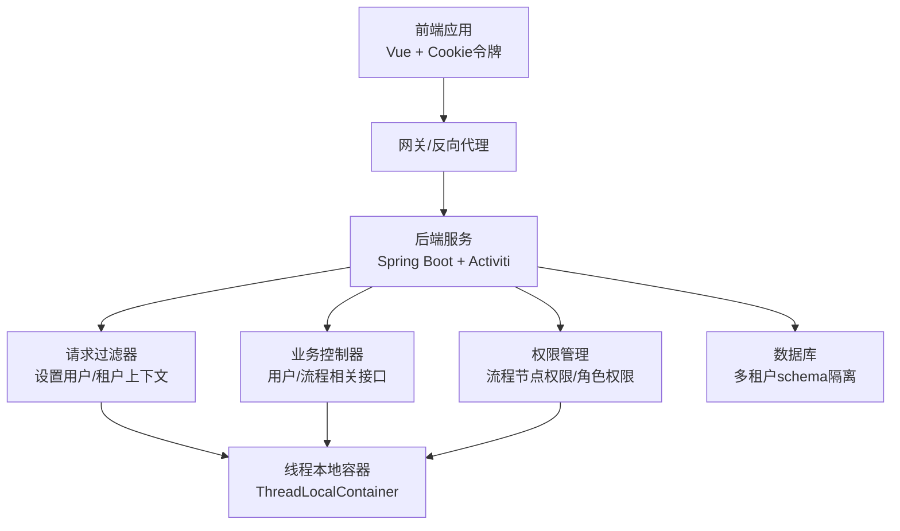
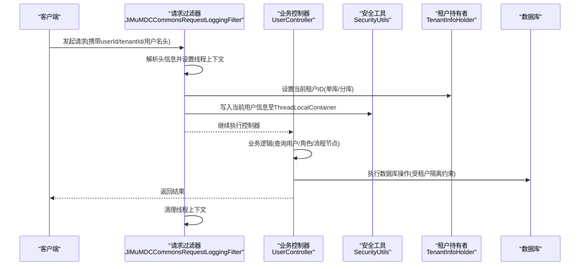
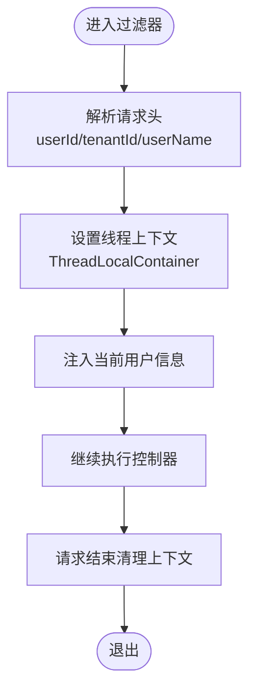
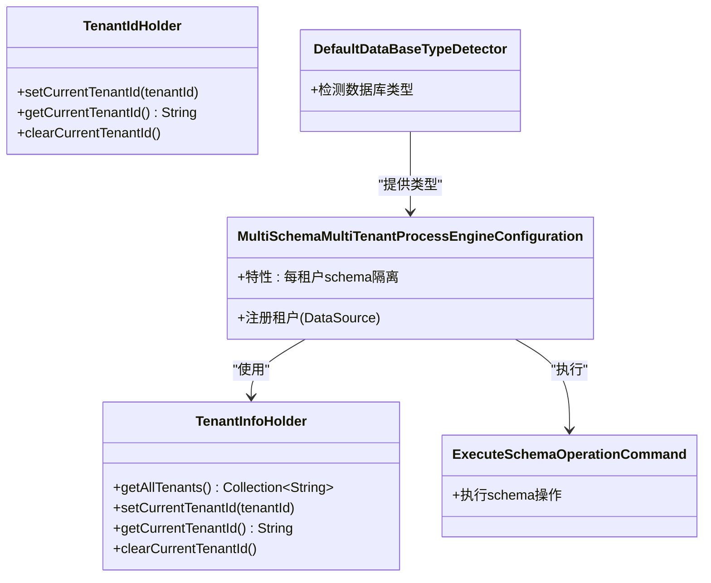
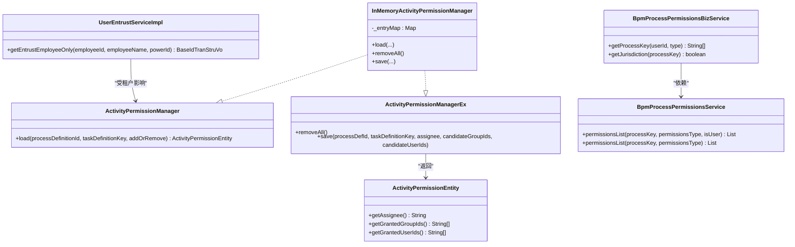
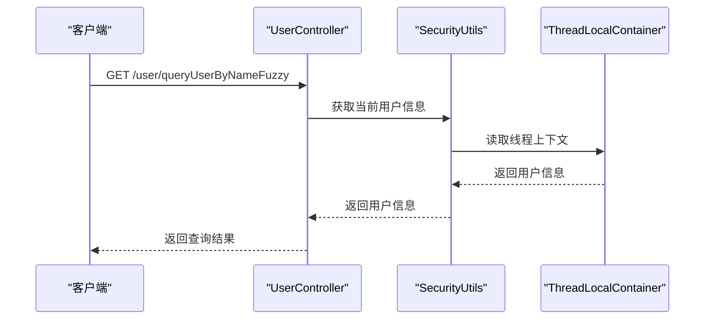
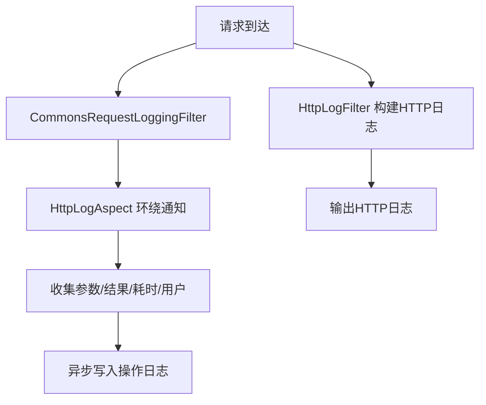
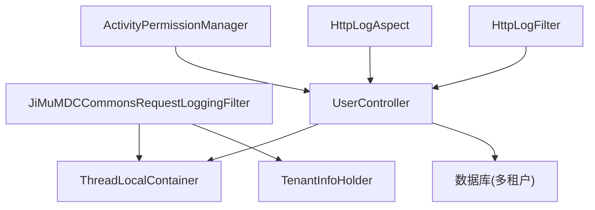

# 认证与授权机制

<cite>
**本文档引用的文件**
- [Authentication.java](file://antflow-base/src/main/java/org/activiti/engine/impl/identity/Authentication.java)
- [SecurityUtils.java](file://antflow-base/src/main/java/org/openoa/base/util/SecurityUtils.java)
- [ThreadLocalContainer.java](file://antflow-base/src/main/java/org/openoa/base/util/ThreadLocalContainer.java)
- [auth.js](file://antflow-vue/src/utils/auth.js)
- [login.json](file://antflow-vue/public/mock/login.json)
- [JiMuMDCCommonsRequestLoggingFilter.java](file://antflow-engine/src/main/java/org/openoa/engine/conf/mvc/JiMuMDCCommonsRequestLoggingFilter.java)
- [HttpLogAspect.java](file://antflow-engine/src/main/java/org/openoa/engine/conf/aspect/HttpLogAspect.java)
- [MVCConf.java](file://antflow-engine/src/main/java/org/openoa/engine/conf/mvc/MVCConf.java)
- [HttpLogFilter.java](file://antflow-web/src/main/java/org/openoa/common/config/HttpLogFilter.java)
- [UserController.java](file://antflow-engine/src/main/java/org/openoa/engine/bpmnconf/controller/UserController.java)
- [TenantInfoHolder.java](file://antflow-base/src/main/java/org/activiti/engine/impl/cfg/multitenant/TenantInfoHolder.java)
- [TenantIdHolder.java](file://antflow-base/src/main/java/org/activiti/engine/impl/cfg/multitenant/TenantIdHolder.java)
- [MultiSchemaMultiTenantProcessEngineConfiguration.java](file://antflow-base/src/main/java/org/activiti/engine/impl/cfg/multitenant/MultiSchemaMultiTenantProcessEngineConfiguration.java)
- [ExecuteSchemaOperationCommand.java](file://antflow-base/src/main/java/org/activiti/engine/impl/cfg/multitenant/ExecuteSchemaOperationCommand.java)
- [DefaultDataBaseTypeDetector.java](file://antflow-engine/src/main/java/org/openoa/engine/conf/engineconfig/DefaultDataBaseTypeDetector.java)
- [UserEntrustServiceImpl.java](file://antflow-engine/src/main/java/org/openoa/engine/bpmnconf/service/impl/UserEntrustServiceImpl.java)
- [ActivityPermissionManager.java](file://antflow-engine/src/main/java/org/openoa/engine/bpmnconf/service/flowcontrol/ActivityPermissionManager.java)
- [ActivityPermissionManagerEx.java](file://antflow-engine/src/main/java/org/openoa/engine/bpmnconf/service/flowcontrol/ActivityPermissionManagerEx.java)
- [InMemoryActivityPermissionManager.java](file://antflow-engine/src/main/java/org/openoa/engine/bpmnconf/service/flowcontrol/ext/InMemoryActivityPermissionManager.java)
- [ActivityPermissionEntity.java](file://antflow-base/src/main/java/org/openoa/base/entity/ActivityPermissionEntity.java)
- [BpmProcessPermissionsService.java](file://antflow-engine/src/main/java/org/openoa/engine/bpmnconf/service/interf/repository/BpmProcessPermissionsService.java)
- [BpmProcessPermissionsBizService.java](file://antflow-engine/src/main/java/org/openoa/engine/bpmnconf/service/interf/biz/BpmProcessPermissionsBizService.java)
- [SecurityAccountDeviceFilterDataAdp.java](file://antflow-base/src/main/java/org/openoa/base/adp/SecurityAccountDeviceFilterDataAdp.java)
- [AFBizException.java](file://antflow-base/src/main/java/org/openoa/base/exception/AFBizException.java)
- [BusinessErrorEnum.java](file://antflow-base/src/main/java/org/openoa/base/exception/BusinessErrorEnum.java)
</cite>

## 目录
1. [简介](#简介)
2. [项目结构](#项目结构)
3. [核心组件](#核心组件)
4. [架构总览](#架构总览)
5. [详细组件分析](#详细组件分析)
6. [依赖关系分析](#依赖关系分析)
7. [性能考虑](#性能考虑)
8. [故障排查指南](#故障排查指南)
9. [结论](#结论)
10. [附录](#附录)

## 简介
本文件面向认证与授权机制的技术文档，覆盖业务方注册流程、凭证管理、访问令牌机制、用户身份验证、权限验证、会话管理、多租户安全控制、数据隔离策略、权限继承模型，并提供安全配置示例、常见安全问题与解决方案、安全审计与监控措施，以及安全测试方法与漏洞防护建议。

## 项目结构
系统采用前后端分离架构，后端基于Spring Boot与Activiti工作流引擎，前端基于Vue。认证与授权相关的关键模块分布如下：
- 前端：通过Cookie存储访问令牌，发起请求时携带令牌或自定义头标识用户与租户上下文
- 后端：通过过滤器与切面在请求生命周期内解析用户与租户信息，写入线程本地容器；基于Activiti的多租户接口实现数据库schema隔离；通过权限管理服务实现流程节点级别的权限控制

图表来源
- [auth.js:1-16](file://antflow-vue/src/utils/auth.js#L1-L16)
- [JiMuMDCCommonsRequestLoggingFilter.java:28-122](file://antflow-engine/src/main/java/org/openoa/engine/conf/mvc/JiMuMDCCommonsRequestLoggingFilter.java#L28-L122)
- [UserController.java:25-108](file://antflow-engine/src/main/java/org/openoa/engine/bpmnconf/controller/UserController.java#L25-L108)
- [TenantInfoHolder.java:28-50](file://antflow-base/src/main/java/org/activiti/engine/impl/cfg/multitenant/TenantInfoHolder.java#L28-L50)

章节来源
- [auth.js:1-16](file://antflow-vue/src/utils/auth.js#L1-L16)
- [JiMuMDCCommonsRequestLoggingFilter.java:28-122](file://antflow-engine/src/main/java/org/openoa/engine/conf/mvc/JiMuMDCCommonsRequestLoggingFilter.java#L28-L122)
- [UserController.java:25-108](file://antflow-engine/src/main/java/org/openoa/engine/bpmnconf/controller/UserController.java#L25-L108)

## 核心组件
- 用户身份与上下文
  - 前端通过Cookie存储令牌键值，后端过滤器读取userId、userName、tenantId等头信息，写入线程本地容器，供后续服务层使用
  - 安全工具类提供统一获取当前登录用户信息的方法，未登录时抛出业务异常
- 认证与会话
  - 前端Cookie令牌作为会话凭证；后端通过过滤器解析并注入用户上下文，避免在每个接口重复传参
- 多租户与数据隔离
  - 基于Activiti多租户接口，支持单库多租户（tenantId字段）与分库多租户（不同schema）
  - 租户信息持有者接口定义了获取/设置/清理当前租户ID的能力
- 权限控制
  - 流程节点权限管理器提供按流程定义与任务定义键加载权限的能力
  - 角色与流程权限服务提供按用户与流程Key查询权限列表的能力

章节来源
- [SecurityUtils.java:16-57](file://antflow-base/src/main/java/org/openoa/base/util/SecurityUtils.java#L16-L57)
- [ThreadLocalContainer.java:7-37](file://antflow-base/src/main/java/org/openoa/base/util/ThreadLocalContainer.java#L7-L37)
- [JiMuMDCCommonsRequestLoggingFilter.java:28-122](file://antflow-engine/src/main/java/org/openoa/engine/conf/mvc/JiMuMDCCommonsRequestLoggingFilter.java#L28-L122)
- [TenantInfoHolder.java:28-50](file://antflow-base/src/main/java/org/activiti/engine/impl/cfg/multitenant/TenantInfoHolder.java#L28-L50)
- [ActivityPermissionManager.java:1-12](file://antflow-engine/src/main/java/org/openoa/engine/bpmnconf/service/flowcontrol/ActivityPermissionManager.java#L1-L12)
- [BpmProcessPermissionsService.java:1-12](file://antflow-engine/src/main/java/org/openoa/engine/bpmnconf/service/interf/repository/BpmProcessPermissionsService.java#L1-L12)

## 架构总览
下图展示认证与授权在请求生命周期中的关键交互：

图表来源
- [JiMuMDCCommonsRequestLoggingFilter.java:42-101](file://antflow-engine/src/main/java/org/openoa/engine/conf/mvc/JiMuMDCCommonsRequestLoggingFilter.java#L42-L101)
- [UserController.java:64-100](file://antflow-engine/src/main/java/org/openoa/engine/bpmnconf/controller/UserController.java#L64-L100)
- [SecurityUtils.java:16-57](file://antflow-base/src/main/java/org/openoa/base/util/SecurityUtils.java#L16-L57)
- [TenantInfoHolder.java:28-50](file://antflow-base/src/main/java/org/activiti/engine/impl/cfg/multitenant/TenantInfoHolder.java#L28-L50)

## 详细组件分析

### 前端令牌与会话管理
- 令牌存储：前端使用Cookie存储令牌键值，提供获取、设置、移除方法
- 登录响应：Mock数据包含令牌字段，用于演示前端如何接收并存储令牌
- 使用建议：生产环境应启用HttpOnly与Secure标志，限制SameSite策略，防止XSS与CSRF

章节来源
- [auth.js:1-16](file://antflow-vue/src/utils/auth.js#L1-L16)
- [login.json:1-5](file://antflow-vue/public/mock/login.json#L1-L5)

### 后端用户上下文注入与安全工具
- 请求过滤器：解析请求头中的用户ID、用户名、租户ID，注入线程本地容器；同时支持URL解码用户名
- 安全工具：提供获取当前登录用户信息、ID、名称等方法；若未登录则抛出业务异常
- 线程本地容器：基于ThreadLocal的键值存储，确保请求作用域内的上下文一致

图表来源
- [JiMuMDCCommonsRequestLoggingFilter.java:42-101](file://antflow-engine/src/main/java/org/openoa/engine/conf/mvc/JiMuMDCCommonsRequestLoggingFilter.java#L42-L101)
- [ThreadLocalContainer.java:7-37](file://antflow-base/src/main/java/org/openoa/base/util/ThreadLocalContainer.java#L7-L37)

章节来源
- [JiMuMDCCommonsRequestLoggingFilter.java:28-122](file://antflow-engine/src/main/java/org/openoa/engine/conf/mvc/JiMuMDCCommonsRequestLoggingFilter.java#L28-L122)
- [SecurityUtils.java:16-57](file://antflow-base/src/main/java/org/openoa/base/util/SecurityUtils.java#L16-L57)
- [ThreadLocalContainer.java:7-37](file://antflow-base/src/main/java/org/openoa/base/util/ThreadLocalContainer.java#L7-L37)

### 多租户与数据隔离
- 接口定义：TenantInfoHolder与TenantIdHolder分别提供获取/设置/清理当前租户ID的能力
- 配置实现：MultiSchemaMultiTenantProcessEngineConfiguration支持每租户独立schema，配合ExecuteSchemaOperationCommand执行schema操作
- 数据库类型检测：根据驱动类型映射到具体数据库类型，支撑多租户schema管理

图表来源
- [TenantInfoHolder.java:28-50](file://antflow-base/src/main/java/org/activiti/engine/impl/cfg/multitenant/TenantInfoHolder.java#L28-L50)
- [TenantIdHolder.java:3-19](file://antflow-base/src/main/java/org/activiti/engine/impl/cfg/multitenant/TenantIdHolder.java#L3-L19)
- [MultiSchemaMultiTenantProcessEngineConfiguration.java:40-54](file://antflow-base/src/main/java/org/activiti/engine/impl/cfg/multitenant/MultiSchemaMultiTenantProcessEngineConfiguration.java#L40-L54)
- [ExecuteSchemaOperationCommand.java:27-36](file://antflow-base/src/main/java/org/activiti/engine/impl/cfg/multitenant/ExecuteSchemaOperationCommand.java#L27-L36)
- [DefaultDataBaseTypeDetector.java:31-47](file://antflow-engine/src/main/java/org/openoa/engine/conf/engineconfig/DefaultDataBaseTypeDetector.java#L31-L47)

章节来源
- [TenantInfoHolder.java:28-50](file://antflow-base/src/main/java/org/activiti/engine/impl/cfg/multitenant/TenantInfoHolder.java#L28-L50)
- [TenantIdHolder.java:3-19](file://antflow-base/src/main/java/org/activiti/engine/impl/cfg/multitenant/TenantIdHolder.java#L3-L19)
- [MultiSchemaMultiTenantProcessEngineConfiguration.java:40-54](file://antflow-base/src/main/java/org/activiti/engine/impl/cfg/multitenant/MultiSchemaMultiTenantProcessEngineConfiguration.java#L40-L54)
- [ExecuteSchemaOperationCommand.java:27-36](file://antflow-base/src/main/java/org/activiti/engine/impl/cfg/multitenant/ExecuteSchemaOperationCommand.java#L27-L36)
- [DefaultDataBaseTypeDetector.java:31-47](file://antflow-engine/src/main/java/org/openoa/engine/conf/engineconfig/DefaultDataBaseTypeDetector.java#L31-L47)

### 权限验证与继承模型
- 流程节点权限：ActivityPermissionManager提供按流程定义ID与任务定义键加载权限的能力；InMemoryActivityPermissionManager提供内存级缓存与保存接口
- 角色与流程权限：BpmProcessPermissionsService与BpmProcessPermissionsBizService提供按用户与流程Key查询权限列表的能力
- 用户委托与租户优先级：UserEntrustServiceImpl在多租户场景下优先匹配当前租户的委托规则，若未严格模式且无匹配，则回退到全局规则

图表来源
- [ActivityPermissionManager.java:1-12](file://antflow-engine/src/main/java/org/openoa/engine/bpmnconf/service/flowcontrol/ActivityPermissionManager.java#L1-L12)
- [ActivityPermissionManagerEx.java:1-15](file://antflow-engine/src/main/java/org/openoa/engine/bpmnconf/service/flowcontrol/ActivityPermissionManagerEx.java#L1-L15)
- [InMemoryActivityPermissionManager.java:13-48](file://antflow-engine/src/main/java/org/openoa/engine/bpmnconf/service/flowcontrol/ext/InMemoryActivityPermissionManager.java#L13-L48)
- [ActivityPermissionEntity.java:1-19](file://antflow-base/src/main/java/org/openoa/base/entity/ActivityPermissionEntity.java#L1-L19)
- [BpmProcessPermissionsService.java:1-12](file://antflow-engine/src/main/java/org/openoa/engine/bpmnconf/service/interf/repository/BpmProcessPermissionsService.java#L1-L12)
- [BpmProcessPermissionsBizService.java:1-13](file://antflow-engine/src/main/java/org/openoa/engine/bpmnconf/service/interf/biz/BpmProcessPermissionsBizService.java#L1-L13)
- [UserEntrustServiceImpl.java:115-136](file://antflow-engine/src/main/java/org/openoa/engine/bpmnconf/service/impl/UserEntrustServiceImpl.java#L115-L136)

章节来源
- [ActivityPermissionManager.java:1-12](file://antflow-engine/src/main/java/org/openoa/engine/bpmnconf/service/flowcontrol/ActivityPermissionManager.java#L1-L12)
- [ActivityPermissionManagerEx.java:1-15](file://antflow-engine/src/main/java/org/openoa/engine/bpmnconf/service/flowcontrol/ActivityPermissionManagerEx.java#L1-L15)
- [InMemoryActivityPermissionManager.java:13-48](file://antflow-engine/src/main/java/org/openoa/engine/bpmnconf/service/flowcontrol/ext/InMemoryActivityPermissionManager.java#L13-L48)
- [ActivityPermissionEntity.java:1-19](file://antflow-base/src/main/java/org/openoa/base/entity/ActivityPermissionEntity.java#L1-L19)
- [BpmProcessPermissionsService.java:1-12](file://antflow-engine/src/main/java/org/openoa/engine/bpmnconf/service/interf/repository/BpmProcessPermissionsService.java#L1-L12)
- [BpmProcessPermissionsBizService.java:1-13](file://antflow-engine/src/main/java/org/openoa/engine/bpmnconf/service/interf/biz/BpmProcessPermissionsBizService.java#L1-L13)
- [UserEntrustServiceImpl.java:115-136](file://antflow-engine/src/main/java/org/openoa/engine/bpmnconf/service/impl/UserEntrustServiceImpl.java#L115-L136)

### 业务方注册与凭证管理
- 注册入口：UserController提供用户模糊查询、公司模糊查询、角色信息查询、分页查询等接口，支撑业务方注册后的用户与角色管理
- 凭证管理：前端通过Cookie存储令牌；后端通过过滤器解析并注入用户上下文，避免在接口层重复传递凭证
- 会话管理：线程本地容器在请求开始时写入上下文，在请求结束时清理，确保线程安全与内存释放

图表来源
- [UserController.java:42-49](file://antflow-engine/src/main/java/org/openoa/engine/bpmnconf/controller/UserController.java#L42-L49)
- [SecurityUtils.java:16-57](file://antflow-base/src/main/java/org/openoa/base/util/SecurityUtils.java#L16-L57)
- [ThreadLocalContainer.java:7-37](file://antflow-base/src/main/java/org/openoa/base/util/ThreadLocalContainer.java#L7-L37)

章节来源
- [UserController.java:25-108](file://antflow-engine/src/main/java/org/openoa/engine/bpmnconf/controller/UserController.java#L25-L108)
- [SecurityUtils.java:16-57](file://antflow-base/src/main/java/org/openoa/base/util/SecurityUtils.java#L16-L57)
- [ThreadLocalContainer.java:7-37](file://antflow-base/src/main/java/org/openoa/base/util/ThreadLocalContainer.java#L7-L37)

### 安全审计与监控
- 请求日志：MVCConf注册CommonsRequestLoggingFilter，打印请求与响应摘要；HttpLogFilter提供更详细的HTTP日志实体构建与输出
- 操作日志：HttpLogAspect通过环绕通知收集请求参数、响应结果、耗时、用户信息等，异步落库
- 异常处理：AFBizException封装业务异常，BusinessErrorEnum提供统一错误码与消息

图表来源
- [MVCConf.java:12-25](file://antflow-engine/src/main/java/org/openoa/engine/conf/mvc/MVCConf.java#L12-L25)
- [HttpLogAspect.java:40-85](file://antflow-engine/src/main/java/org/openoa/engine/conf/aspect/HttpLogAspect.java#L40-L85)
- [HttpLogFilter.java:25-35](file://antflow-web/src/main/java/org/openoa/common/config/HttpLogFilter.java#L25-L35)

章节来源
- [MVCConf.java:12-25](file://antflow-engine/src/main/java/org/openoa/engine/conf/mvc/MVCConf.java#L12-L25)
- [HttpLogAspect.java:1-129](file://antflow-engine/src/main/java/org/openoa/engine/conf/aspect/HttpLogAspect.java#L1-L129)
- [HttpLogFilter.java:1-35](file://antflow-web/src/main/java/org/openoa/common/config/HttpLogFilter.java#L1-L35)
- [AFBizException.java:12-79](file://antflow-base/src/main/java/org/openoa/base/exception/AFBizException.java#L12-L79)
- [BusinessErrorEnum.java:10-38](file://antflow-base/src/main/java/org/openoa/base/exception/BusinessErrorEnum.java#L10-L38)

## 依赖关系分析
- 组件耦合
  - 过滤器与线程本地容器强耦合，保证请求上下文一致性
  - 权限管理器与业务服务弱耦合，通过接口抽象降低变更成本
  - 多租户配置与数据库类型检测解耦，便于扩展新数据库类型
- 外部依赖
  - Activiti多租户接口与命令执行器
  - Spring MVC过滤器与AOP切面框架
  - 前端Cookie与HTTP请求头

图表来源
- [JiMuMDCCommonsRequestLoggingFilter.java:28-122](file://antflow-engine/src/main/java/org/openoa/engine/conf/mvc/JiMuMDCCommonsRequestLoggingFilter.java#L28-L122)
- [UserController.java:25-108](file://antflow-engine/src/main/java/org/openoa/engine/bpmnconf/controller/UserController.java#L25-L108)
- [ActivityPermissionManager.java:1-12](file://antflow-engine/src/main/java/org/openoa/engine/bpmnconf/service/flowcontrol/ActivityPermissionManager.java#L1-L12)
- [HttpLogAspect.java:36-85](file://antflow-engine/src/main/java/org/openoa/engine/conf/aspect/HttpLogAspect.java#L36-L85)
- [HttpLogFilter.java:25-35](file://antflow-web/src/main/java/org/openoa/common/config/HttpLogFilter.java#L25-L35)

## 性能考虑
- 线程本地容器避免跨线程传递上下文，减少参数传递开销
- 权限管理器采用内存缓存，降低频繁查询数据库的开销
- 日志过滤器与AOP仅在调试级别开启详细日志，避免生产环境性能损耗
- 多租户schema隔离建议预热连接池与索引，减少首次查询延迟

## 故障排查指南
- 未登录异常
  - 现象：调用安全工具类获取当前用户ID时报“当前用户未登录”
  - 排查：确认请求头是否包含userId/tenantId，过滤器是否正确注入线程上下文
- 租户隔离异常
  - 现象：查询不到期望的数据
  - 排查：检查租户ID头是否正确传递，多租户模式是否严格模式，委托规则是否匹配当前租户
- 权限不足
  - 现象：流程节点无法查看或操作
  - 排查：确认流程定义ID与任务定义键是否正确，候选用户/组是否包含当前用户
- 日志缺失
  - 现象：请求日志或操作日志未输出
  - 排查：检查过滤器注册顺序与级别，AOP是否生效，异步落库是否异常

章节来源
- [SecurityUtils.java:20-41](file://antflow-base/src/main/java/org/openoa/base/util/SecurityUtils.java#L20-L41)
- [JiMuMDCCommonsRequestLoggingFilter.java:42-101](file://antflow-engine/src/main/java/org/openoa/engine/conf/mvc/JiMuMDCCommonsRequestLoggingFilter.java#L42-L101)
- [UserEntrustServiceImpl.java:115-136](file://antflow-engine/src/main/java/org/openoa/engine/bpmnconf/service/impl/UserEntrustServiceImpl.java#L115-L136)
- [ActivityPermissionManager.java:1-12](file://antflow-engine/src/main/java/org/openoa/engine/bpmnconf/service/flowcontrol/ActivityPermissionManager.java#L1-L12)
- [HttpLogAspect.java:40-85](file://antflow-engine/src/main/java/org/openoa/engine/conf/aspect/HttpLogAspect.java#L40-L85)

## 结论
本系统通过“请求过滤器+线程本地容器+多租户接口+权限管理器”的组合，实现了从用户身份识别、上下文注入、数据隔离到流程权限控制的完整闭环。建议在生产环境中强化前端Cookie安全属性、完善异常监控与告警、定期审计权限配置与日志记录，以持续提升安全性与可维护性。

## 附录

### 安全配置示例
- 前端Cookie安全
  - 启用HttpOnly、Secure、SameSite=Lax|Strict
  - 令牌有效期与刷新策略
- 后端过滤器与日志
  - 仅在调试级别输出详细日志
  - 异步落库操作日志，避免阻塞主请求链路
- 多租户配置
  - 明确单库/分库模式，正确设置租户ID头
  - schema初始化与升级策略

### 常见安全问题与解决方案
- XSS
  - 输入校验与输出编码；对日志内容进行脱敏
- CSRF
  - 启用SameSite Cookie；关键接口增加Token校验
- 权限越权
  - 严格基于租户隔离与流程节点权限校验；审计权限变更
- 会话劫持
  - 令牌轮换与失效机制；IP/设备白名单适配

### 安全测试方法与漏洞防护建议
- 渗透测试
  - 模拟越权访问、暴力破解、参数篡改
- 自动化扫描
  - 静态分析与依赖漏洞扫描
- 防护建议
  - 最小权限原则；权限继承模型清晰化；定期权限复核