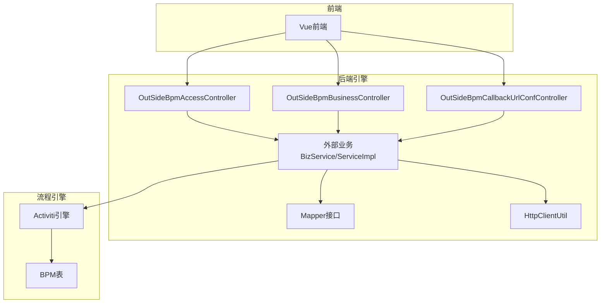
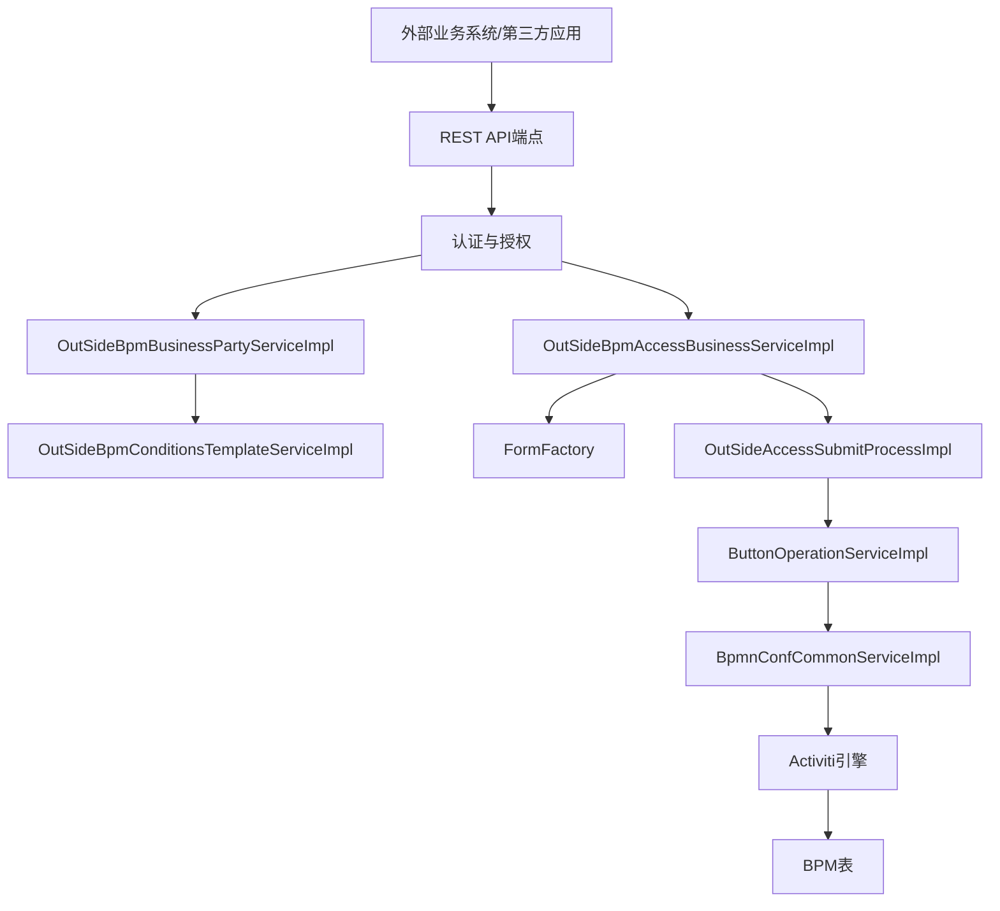
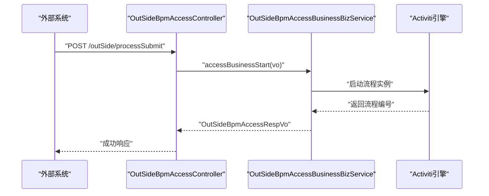
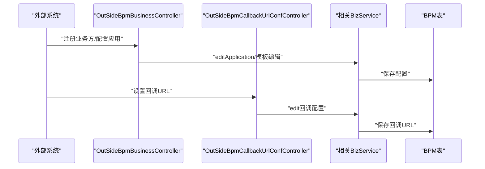
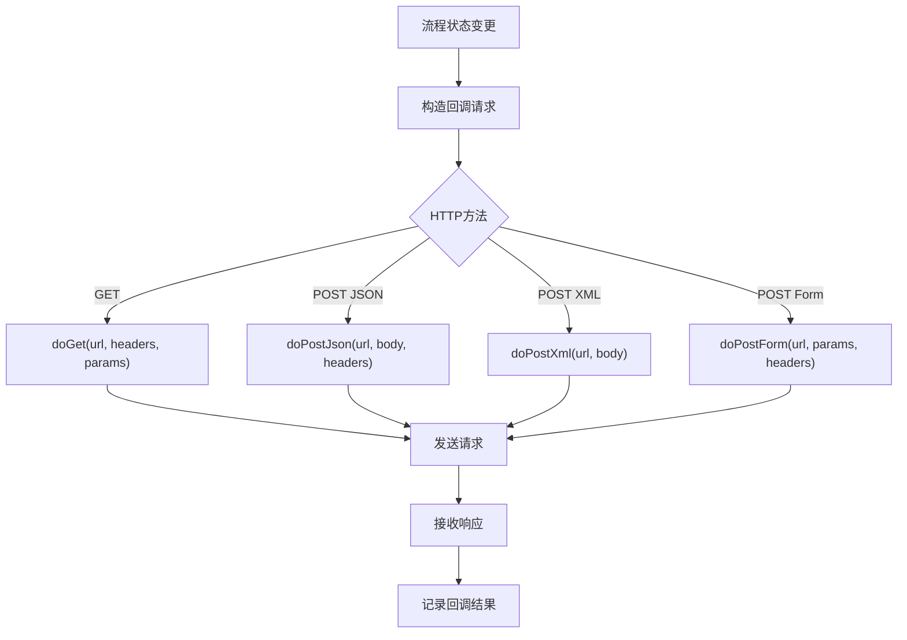
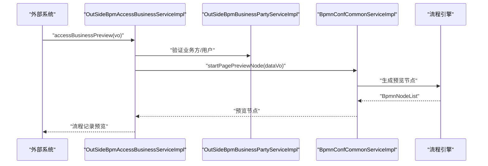
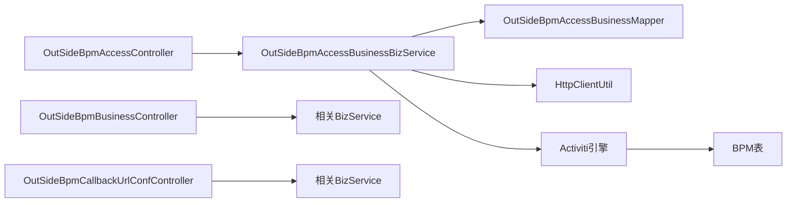

# 集成示例与最佳实践

<cite>
**本文引用的文件**
- [AntFlow业务集成之三API接入(SAAS模式)流程实战.md](file://doc/系统集成与扩展开发篇/AntFlow业务集成之三API接入(SAAS模式)流程实战.md)
- [AntFlow业务集成之二API接入模式(SAAS模式)介绍.md](file://doc/系统集成与扩展开发篇/AntFlow业务集成之二API接入模式(SAAS模式)介绍.md)
- [外部系统集成.md](file://doc/系统介绍篇/10.外部系统集成.md)
- [快速集成到企业现有系统之四用户角色集成.md](file://doc/系统集成与扩展开发篇/快速集成到企业现有系统之四用户角色集成.md)
- [OutSideBpmAccessController.java](file://antflow-engine/src/main/java/org/openoa/engine/bpmnconf/controller/OutSideBpmAccessController.java)
- [OutSideBpmBusinessController.java](file://antflow-engine/src/main/java/org/openoa/engine/bpmnconf/controller/OutSideBpmBusinessController.java)
- [OutSideBpmCallbackUrlConfController.java](file://antflow-engine/src/main/java/org/openoa/engine/bpmnconf/controller/OutSideBpmCallbackUrlConfController.java)
- [OutSideBpmAccessBusinessBizService.java](file://antflow-engine/src/main/java/org/openoa/engine/bpmnconf/service/interf/biz/OutSideBpmAccessBusinessBizService.java)
- [OutSideBpmAccessBusinessServiceImpl.java](file://antflow-engine/src/main/java/org/openoa/engine/bpmnconf/service/impl/OutSideBpmAccessBusinessServiceImpl.java)
- [OutSideBpmAccessBusinessMapper.java](file://antflow-engine/src/main/java/org/openoa/engine/bpmnconf/mapper/OutSideBpmAccessBusinessMapper.java)
- [HttpClientUtil.java](file://antflow-engine/src/main/java/org/openoa/engine/utils/HttpClientUtil.java)
</cite>

## 目录
1. [简介](#简介)
2. [项目结构](#项目结构)
3. [核心组件](#核心组件)
4. [架构总览](#架构总览)
5. [详细组件分析](#详细组件分析)
6. [依赖分析](#依赖分析)
7. [性能考虑](#性能考虑)
8. [故障排除指南](#故障排除指南)
9. [结论](#结论)
10. [附录](#附录)

## 简介
本指南面向需要将外部系统与AntFlow工作流引擎集成的工程团队，提供从API接入、用户角色集成、业务流程集成到数据同步、错误恢复、性能优化、监控告警、集成测试与部署运维的完整实践路径。文档以仓库中的官方集成文档与核心代码为依据，结合系统架构图与序列图，帮助读者快速落地可运维、可观测、可扩展的集成方案。

## 项目结构
AntFlow采用前后端分离与模块化架构，集成能力主要集中在后端引擎模块的“外部系统接入”相关控制器、服务与工具类中。前端Vue模块提供外部接入配置与流程预览的可视化界面；文档模块提供集成流程与最佳实践说明。

- 后端引擎模块（antflow-engine）
  - 控制器：对外提供REST API，包括流程发起、业务方管理、回调配置等
  - 服务与映射：封装业务逻辑与数据访问，支撑外部流程生命周期管理
  - 工具类：提供HTTP客户端能力，用于回调通知与外部系统对接
- 文档模块（doc）
  - 系统集成与扩展开发篇：API接入实战、用户角色集成、Starter集成等
  - 系统介绍篇：外部系统集成架构、流程生命周期、模板管理等

图表来源
- [OutSideBpmAccessController.java:1-91](file://antflow-engine/src/main/java/org/openoa/engine/bpmnconf/controller/OutSideBpmAccessController.java#L1-L91)
- [OutSideBpmBusinessController.java:1-196](file://antflow-engine/src/main/java/org/openoa/engine/bpmnconf/controller/OutSideBpmBusinessController.java#L1-L196)
- [OutSideBpmCallbackUrlConfController.java:1-69](file://antflow-engine/src/main/java/org/openoa/engine/bpmnconf/controller/OutSideBpmCallbackUrlConfController.java#L1-L69)
- [HttpClientUtil.java:1-101](file://antflow-engine/src/main/java/org/openoa/engine/utils/HttpClientUtil.java#L1-L101)

章节来源
- [外部系统集成.md:1-310](file://doc/系统介绍篇/10.外部系统集成.md#L1-L310)

## 核心组件
- 外部流程接入控制器
  - 提供流程发起、预览、终止、流程记录查询等REST接口
  - 典型端点：/outSide/processSubmit、/outSide/processPreview、/outSide/processBreak、/outSide/outSideProcessRecord
- 业务方与模板控制器
  - 提供业务方注册、应用管理、条件模板与审批模板的CRUD接口
  - 典型端点：/outSideBpm/businessParty/*、/outSideBpm/conditionTemplate/*、/outSideBpm/approveTemplate/*
- 回调配置控制器
  - 提供回调URL的查询、分页、详情、编辑接口
  - 典型端点：/outSideBpm/callbackUrlConf/*
- 业务服务与映射
  - BizService接口定义外部流程生命周期方法
  - ServiceImpl与Mapper支撑数据持久化与查询
- HTTP客户端工具
  - 封装GET/POST(JSON/XML/Form)等常用HTTP调用，便于向外部系统回调通知

章节来源
- [OutSideBpmAccessController.java:1-91](file://antflow-engine/src/main/java/org/openoa/engine/bpmnconf/controller/OutSideBpmAccessController.java#L1-L91)
- [OutSideBpmBusinessController.java:1-196](file://antflow-engine/src/main/java/org/openoa/engine/bpmnconf/controller/OutSideBpmBusinessController.java#L1-L196)
- [OutSideBpmCallbackUrlConfController.java:1-69](file://antflow-engine/src/main/java/org/openoa/engine/bpmnconf/controller/OutSideBpmCallbackUrlConfController.java#L1-L69)
- [OutSideBpmAccessBusinessBizService.java:1-26](file://antflow-engine/src/main/java/org/openoa/engine/bpmnconf/service/interf/biz/OutSideBpmAccessBusinessBizService.java#L1-L26)
- [OutSideBpmAccessBusinessServiceImpl.java:1-18](file://antflow-engine/src/main/java/org/openoa/engine/bpmnconf/service/impl/OutSideBpmAccessBusinessServiceImpl.java#L1-L18)
- [OutSideBpmAccessBusinessMapper.java:1-11](file://antflow-engine/src/main/java/org/openoa/engine/bpmnconf/mapper/OutSideBpmAccessBusinessMapper.java#L1-L11)
- [HttpClientUtil.java:1-101](file://antflow-engine/src/main/java/org/openoa/engine/utils/HttpClientUtil.java#L1-L101)

## 架构总览
外部系统通过REST API与AntFlow交互，实现流程发起、预览、终止与查询；流程引擎内部通过服务层与映射层协调Activiti引擎与BPM表，确保流程实例的创建、执行与状态变更。回调配置用于将流程状态变化通知外部系统。

图表来源
- [外部系统集成.md:9-59](file://doc/系统介绍篇/10.外部系统集成.md#L9-L59)

章节来源
- [外部系统集成.md:1-310](file://doc/系统介绍篇/10.外部系统集成.md#L1-L310)

## 详细组件分析

### 组件A：外部流程接入控制器（OutSideBpmAccessController）
- 职责
  - 对外暴露流程生命周期相关接口，包括流程发起、预览、终止与流程记录查询
  - 作为外部系统与内部流程引擎的桥接层
- 关键端点
  - POST /outSide/processSubmit：流程发起
  - POST /outSide/processPreview：流程预览
  - POST /outSide/processBreak：流程终止
  - GET /outSide/outSideProcessRecord：查询流程记录
- 数据契约
  - 请求参数包含formCode、operationType、isLowCodeFlow、lfFields、userId等
  - 响应包含流程编号与初始状态等信息

图表来源
- [OutSideBpmAccessController.java:38-41](file://antflow-engine/src/main/java/org/openoa/engine/bpmnconf/controller/OutSideBpmAccessController.java#L38-L41)
- [外部系统集成.md:100-143](file://doc/系统介绍篇/10.外部系统集成.md#L100-L143)

章节来源
- [OutSideBpmAccessController.java:1-91](file://antflow-engine/src/main/java/org/openoa/engine/bpmnconf/controller/OutSideBpmAccessController.java#L1-L91)
- [AntFlow业务集成之三API接入(SAAS模式)流程实战.md](file://doc/系统集成与扩展开发篇/AntFlow业务集成之三API接入(SAAS模式)流程实战.md#L83-L121)

### 组件B：业务方与模板控制器（OutSideBpmBusinessController、OutSideBpmCallbackUrlConfController）
- 职责
  - 管理业务方注册、应用配置、条件模板与审批模板
  - 管理回调URL配置，支撑流程状态回调
- 关键端点
  - 业务方：/outSideBpm/businessParty/*
  - 条件模板：/outSideBpm/conditionTemplate/*
  - 审批模板：/outSideBpm/approveTemplate/*
  - 回调配置：/outSideBpm/callbackUrlConf/*

图表来源
- [OutSideBpmBusinessController.java:35-194](file://antflow-engine/src/main/java/org/openoa/engine/bpmnconf/controller/OutSideBpmBusinessController.java#L35-L194)
- [OutSideBpmCallbackUrlConfController.java:21-66](file://antflow-engine/src/main/java/org/openoa/engine/bpmnconf/controller/OutSideBpmCallbackUrlConfController.java#L21-L66)
- [外部系统集成.md:61-98](file://doc/系统介绍篇/10.外部系统集成.md#L61-L98)

章节来源
- [OutSideBpmBusinessController.java:1-196](file://antflow-engine/src/main/java/org/openoa/engine/bpmnconf/controller/OutSideBpmBusinessController.java#L1-L196)
- [OutSideBpmCallbackUrlConfController.java:1-69](file://antflow-engine/src/main/java/org/openoa/engine/bpmnconf/controller/OutSideBpmCallbackUrlConfController.java#L1-L69)
- [AntFlow业务集成之三API接入(SAAS模式)流程实战.md](file://doc/系统集成与扩展开发篇/AntFlow业务集成之三API接入(SAAS模式)流程实战.md#L41-L61)

### 组件C：HTTP客户端工具（HttpClientUtil）
- 职责
  - 提供GET/POST JSON/XML/Form等多种HTTP调用封装
  - 用于向外部系统回调通知流程状态变化
- 使用场景
  - 在流程状态变更时，调用外部系统回调URL
  - 与回调配置控制器配合，实现流程事件通知

图表来源
- [HttpClientUtil.java:29-95](file://antflow-engine/src/main/java/org/openoa/engine/utils/HttpClientUtil.java#L29-L95)

章节来源
- [HttpClientUtil.java:1-101](file://antflow-engine/src/main/java/org/openoa/engine/utils/HttpClientUtil.java#L1-L101)

### 组件D：流程预览与监控（预览流程节点）
- 职责
  - 在不启动流程的情况下，生成并返回流程节点预览，辅助外部系统理解流程路由
- 关键流程
  - 外部系统调用预览接口
  - 服务层调用公共组件生成预览节点
  - 返回预览节点列表供外部系统展示

图表来源
- [外部系统集成.md:259-282](file://doc/系统介绍篇/10.外部系统集成.md#L259-L282)

章节来源
- [外部系统集成.md:259-282](file://doc/系统介绍篇/10.外部系统集成.md#L259-L282)

## 依赖分析
- 控制器依赖服务接口与实现，服务层依赖Mapper与工具类
- 服务层通过公共组件与流程引擎交互，最终落库至BPM表
- HTTP客户端工具为回调通知提供统一HTTP调用能力

图表来源
- [OutSideBpmAccessController.java:1-91](file://antflow-engine/src/main/java/org/openoa/engine/bpmnconf/controller/OutSideBpmAccessController.java#L1-L91)
- [OutSideBpmBusinessController.java:1-196](file://antflow-engine/src/main/java/org/openoa/engine/bpmnconf/controller/OutSideBpmBusinessController.java#L1-L196)
- [OutSideBpmCallbackUrlConfController.java:1-69](file://antflow-engine/src/main/java/org/openoa/engine/bpmnconf/controller/OutSideBpmCallbackUrlConfController.java#L1-L69)
- [OutSideBpmAccessBusinessBizService.java:1-26](file://antflow-engine/src/main/java/org/openoa/engine/bpmnconf/service/interf/biz/OutSideBpmAccessBusinessBizService.java#L1-L26)
- [OutSideBpmAccessBusinessServiceImpl.java:1-18](file://antflow-engine/src/main/java/org/openoa/engine/bpmnconf/service/impl/OutSideBpmAccessBusinessServiceImpl.java#L1-L18)
- [OutSideBpmAccessBusinessMapper.java:1-11](file://antflow-engine/src/main/java/org/openoa/engine/bpmnconf/mapper/OutSideBpmAccessBusinessMapper.java#L1-L11)
- [HttpClientUtil.java:1-101](file://antflow-engine/src/main/java/org/openoa/engine/utils/HttpClientUtil.java#L1-L101)

章节来源
- [外部系统集成.md:1-310](file://doc/系统介绍篇/10.外部系统集成.md#L1-L310)

## 性能考虑
- API模式的优势
  - 低侵入、多语言支持、流程能力平台化，适合跨系统编排
- 性能优化建议
  - 合理使用流程预览接口，减少不必要的流程启动
  - 对回调URL进行幂等设计，避免重复处理
  - 在HTTP客户端中启用连接池与超时控制，提升回调稳定性
  - 对流程模板与条件模板进行缓存，减少重复解析
  - 对高频查询使用分页与索引优化，避免全表扫描

章节来源
- [AntFlow业务集成之二API接入模式(SAAS模式)介绍.md](file://doc/系统集成与扩展开发篇/AntFlow业务集成之二API接入模式(SAAS模式)介绍.md#L26-L182)
- [外部系统集成.md:1-310](file://doc/系统介绍篇/10.外部系统集成.md#L1-L310)

## 故障排除指南
- 常见问题与定位
  - 流程发起失败：检查formCode是否正确、operationType是否符合策略、userId是否有效
  - 回调未到达：确认回调URL配置是否正确、网络连通性、回调接口幂等性与重试策略
  - 用户/角色集成异常：核对用户与角色服务实现是否返回标准字段（id/name）、SQL映射是否正确
- 排障步骤
  - 使用流程预览接口验证流程路由与节点配置
  - 查看流程记录接口，确认流程编号与状态
  - 检查回调配置与HTTP客户端日志，定位回调失败原因
  - 对用户/角色接口进行单元测试，确保返回数据格式符合预期

章节来源
- [AntFlow业务集成之三API接入(SAAS模式)流程实战.md](file://doc/系统集成与扩展开发篇/AntFlow业务集成之三API接入(SAAS模式)流程实战.md#L71-L121)
- [快速集成到企业现有系统之四用户角色集成.md:1-35](file://doc/系统集成与扩展开发篇/快速集成到企业现有系统之四用户角色集成.md#L1-L35)
- [外部系统集成.md:259-282](file://doc/系统介绍篇/10.外部系统集成.md#L259-L282)

## 结论
通过REST API模式，AntFlow实现了与外部系统的低耦合集成，具备良好的扩展性与可观测性。结合流程预览、模板管理与回调通知机制，企业可在不侵入既有系统架构的前提下，快速构建跨系统的流程编排平台。建议在生产环境中完善安全认证、数据一致性、性能优化与监控告警体系，确保集成方案稳定可靠。

## 附录

### A. API接入与业务流程集成步骤
- 步骤概览
  - 创建租户与应用
  - 配置回调URL与审批人选择API
  - 设计流程并启动
  - 外部系统通过REST API发起流程
- 关键接口
  - 流程发起：POST /outSide/processSubmit
  - 流程预览：POST /outSide/processPreview
  - 流程终止：POST /outSide/processBreak
  - 查询流程记录：GET /outSide/outSideProcessRecord

章节来源
- [AntFlow业务集成之三API接入(SAAS模式)流程实战.md](file://doc/系统集成与扩展开发篇/AntFlow业务集成之三API接入(SAAS模式)流程实战.md#L9-L82)

### B. 用户与角色集成最佳实践
- 方式一：改写Mapper SQL
  - 重点方法：按名称模糊查询、按ID集合查询、层级领导查询、员工详情查询、HRBP与直属领导查询等
- 方式二：自定义服务实现
  - 通过@Primary覆盖默认实现，支持从外部系统API获取用户与角色信息
- 数据格式要求
  - 返回必须包含id与name字段，其他字段按通知需求补充

章节来源
- [快速集成到企业现有系统之四用户角色集成.md:1-35](file://doc/系统集成与扩展开发篇/快速集成到企业现有系统之四用户角色集成.md#L1-L35)

### C. 数据同步策略与错误恢复
- 数据同步
  - 流程状态通过回调通知外部系统，建议采用幂等处理与本地队列补偿
- 错误恢复
  - 回调失败重试与退避策略
  - 对流程记录进行审计，便于人工干预与对账

章节来源
- [外部系统集成.md:284-294](file://doc/系统介绍篇/10.外部系统集成.md#L284-L294)

### D. 监控告警配置建议
- 指标建议
  - API调用成功率与延迟、流程启动/完成耗时、回调失败率
- 告警策略
  - 回调连续失败阈值、流程长时间挂起、用户/角色接口异常
- 工具建议
  - 结合HTTP客户端日志与流程引擎日志，建立统一链路追踪

章节来源
- [AntFlow业务集成之二API接入模式(SAAS模式)介绍.md](file://doc/系统集成与扩展开发篇/AntFlow业务集成之二API接入模式(SAAS模式)介绍.md#L114-L131)

### E. 集成测试方法
- 单元测试
  - 对用户/角色服务方法进行Mock测试，验证返回格式
- 接口测试
  - 使用流程预览接口验证流程路由
  - 使用流程记录接口验证状态一致性
- 回调测试
  - 搭建回调接收服务，验证回调参数与事件类型

章节来源
- [外部系统集成.md:259-282](file://doc/系统介绍篇/10.外部系统集成.md#L259-L282)

### F. 部署与运维管理
- 部署要点
  - API模式下，AntFlow与业务系统独立部署，注意网络连通与安全策略
- 运维建议
  - 回调URL健康检查与灰度发布
  - 流程模板与条件模板的版本管理与回滚策略

章节来源
- [AntFlow业务集成之二API接入模式(SAAS模式)介绍.md](file://doc/系统集成与扩展开发篇/AntFlow业务集成之二API接入模式(SAAS模式)介绍.md#L141-L168)