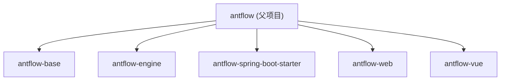
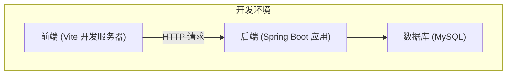
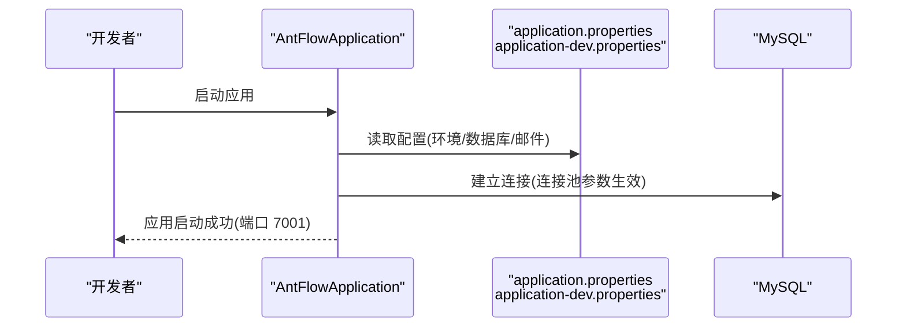
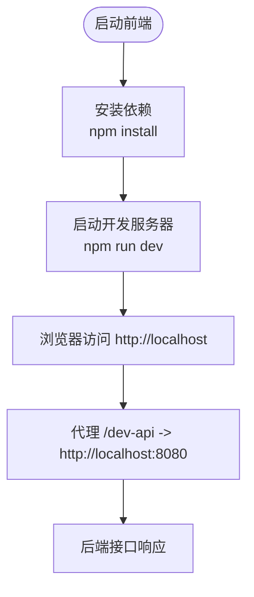
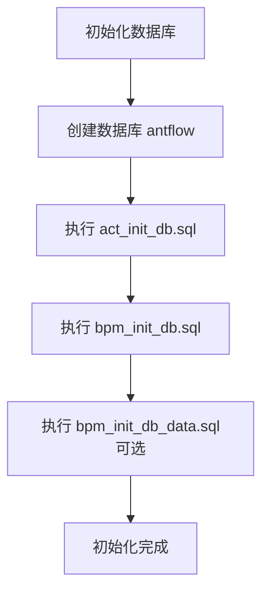
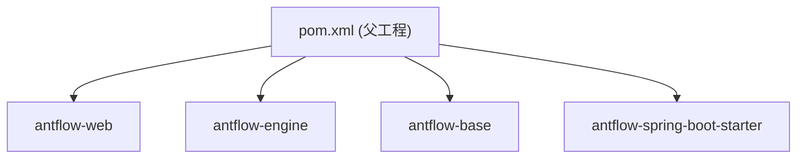

# 快速开始

<cite>
**本文引用的文件**
- [pom.xml](file://pom.xml)
- [README.zh_CN.md](file://README.zh_CN.md)
- [antflow-web/src/main/java/org/openoa/AntFlowApplication.java](file://antflow-web/src/main/java/org/openoa/AntFlowApplication.java)
- [antflow-web/src/main/resources/application.properties](file://antflow-web/src/main/resources/application.properties)
- [antflow-web/src/main/resources/application-dev.properties](file://antflow-web/src/main/resources/application-dev.properties)
- [antflow-vue/package.json](file://antflow-vue/package.json)
- [antflow-vue/vite.config.js](file://antflow-vue/vite.config.js)
- [script/act_init_db.sql](file://script/act_init_db.sql)
- [script/bpm_init_db.sql](file://script/bpm_init_db.sql)
- [script/bpm_init_db_data.sql](file://script/bpm_init_db_data.sql)
- [doc/系统介绍篇/21.开发环境搭建.md](file://doc/系统介绍篇/21.开发环境搭建.md)
- [antflow-spring-boot-starter/src/main/java/org/openoa/starter/config/AntFlowAutoConfiguration.java](file://antflow-spring-boot-starter/src/main/java/org/openoa/starter/config/AntFlowAutoConfiguration.java)
</cite>

## 目录
1. [简介](#简介)
2. [项目结构](#项目结构)
3. [核心组件](#核心组件)
4. [架构概览](#架构概览)
5. [详细组件分析](#详细组件分析)
6. [依赖分析](#依赖分析)
7. [性能考虑](#性能考虑)
8. [故障排除指南](#故障排除指南)
9. [结论](#结论)
10. [附录](#附录)

## 简介
本指南面向首次接触 AntFlow 的开发者，目标是在最短时间内完成开发环境搭建、数据库初始化与前后端联调，快速体验系统核心功能。内容涵盖：
- 开发环境要求（Java、Node.js、MySQL）
- 依赖安装与配置
- 数据库初始化步骤
- 后端与前端分别的启动命令与访问方式
- 常见问题排查与故障排除
- 配置文件修改要点与最佳实践

## 项目结构
AntFlow 采用多模块 Maven 工程组织，核心模块包括：
- antflow-base：基础逻辑与工具
- antflow-engine：基于 Activiti 的核心工作流引擎实现
- antflow-spring-boot-starter：Spring Boot 自动装配与组件扫描
- antflow-web：后端 Web 应用与启动入口
- antflow-vue：前端 Vue 应用

**图表来源**
- [pom.xml:6-11](file://pom.xml#L6-L11)

**章节来源**
- [pom.xml:6-11](file://pom.xml#L6-L11)
- [doc/系统介绍篇/21.开发环境搭建.md:33-59](file://doc/系统介绍篇/21.开发环境搭建.md#L33-L59)

## 核心组件
- 后端启动类：AntFlowApplication，负责 Spring Boot 应用启动
- 配置文件：
  - application.properties：全局配置（激活环境、JSON 时间格式、MyBatis 配置、SaaS 模式、邮件通知等）
  - application-dev.properties：开发环境数据库连接与 Druid/Hikari 参数
- 前端配置：
  - package.json：脚本命令（dev、build:prod、build:stage、preview）
  - vite.config.js：开发服务器端口、代理、构建产物等

**章节来源**
- [antflow-web/src/main/java/org/openoa/AntFlowApplication.java:1-17](file://antflow-web/src/main/java/org/openoa/AntFlowApplication.java#L1-L17)
- [antflow-web/src/main/resources/application.properties:1-36](file://antflow-web/src/main/resources/application.properties#L1-L36)
- [antflow-web/src/main/resources/application-dev.properties:1-44](file://antflow-web/src/main/resources/application-dev.properties#L1-L44)
- [antflow-vue/package.json:8-12](file://antflow-vue/package.json#L8-L12)
- [antflow-vue/vite.config.js:64-81](file://antflow-vue/vite.config.js#L64-L81)

## 架构概览
开发环境由前端、后端与数据库三部分组成，前端通过代理访问后端接口，后端连接 MySQL。

**图表来源**
- [antflow-vue/vite.config.js:64-81](file://antflow-vue/vite.config.js#L64-L81)
- [antflow-web/src/main/resources/application-dev.properties:1-1](file://antflow-web/src/main/resources/application-dev.properties#L1-L1)

## 详细组件分析

### 后端启动与配置
- 启动类：AntFlowApplication
- 环境配置：
  - application.properties：激活环境、JSON 时区与日期格式、MyBatis 配置、SaaS 模式开关、邮件通知参数
  - application-dev.properties：开发环境数据库连接、Druid/Hikari 连接池参数、Activiti 表结构更新策略
- 自动装配：AntFlowAutoConfiguration 扫描 Mapper 与组件包，简化集成

**图表来源**
- [antflow-web/src/main/java/org/openoa/AntFlowApplication.java:11-13](file://antflow-web/src/main/java/org/openoa/AntFlowApplication.java#L11-L13)
- [antflow-web/src/main/resources/application.properties:1-11](file://antflow-web/src/main/resources/application.properties#L1-L11)
- [antflow-web/src/main/resources/application-dev.properties:1-21](file://antflow-web/src/main/resources/application-dev.properties#L1-L21)
- [antflow-spring-boot-starter/src/main/java/org/openoa/starter/config/AntFlowAutoConfiguration.java:8-16](file://antflow-spring-boot-starter/src/main/java/org/openoa/starter/config/AntFlowAutoConfiguration.java#L8-L16)

**章节来源**
- [antflow-web/src/main/java/org/openoa/AntFlowApplication.java:1-17](file://antflow-web/src/main/java/org/openoa/AntFlowApplication.java#L1-L17)
- [antflow-web/src/main/resources/application.properties:1-36](file://antflow-web/src/main/resources/application.properties#L1-L36)
- [antflow-web/src/main/resources/application-dev.properties:1-44](file://antflow-web/src/main/resources/application-dev.properties#L1-L44)
- [antflow-spring-boot-starter/src/main/java/org/openoa/starter/config/AntFlowAutoConfiguration.java:1-19](file://antflow-spring-boot-starter/src/main/java/org/openoa/starter/config/AntFlowAutoConfiguration.java#L1-L19)

### 前端启动与代理
- 启动命令：npm run dev
- 开发服务器：端口 80，启用自动打开浏览器
- 代理配置：将 /dev-api 前缀请求转发至后端接口（默认 http://localhost:8080）

**图表来源**
- [antflow-vue/package.json:8-12](file://antflow-vue/package.json#L8-L12)
- [antflow-vue/vite.config.js:64-81](file://antflow-vue/vite.config.js#L64-L81)

**章节来源**
- [antflow-vue/package.json:8-12](file://antflow-vue/package.json#L8-L12)
- [antflow-vue/vite.config.js:1-100](file://antflow-vue/vite.config.js#L1-L100)

### 数据库初始化流程
- 创建数据库：antflow
- 执行初始化 SQL：
  - act_init_db.sql：Activiti 核心表结构
  - bpm_init_db.sql：业务流程配置表结构
  - bpm_init_db_data.sql：演示数据（用户、角色、部门等）
- 注意：生产环境通常不执行演示数据脚本

**图表来源**
- [script/act_init_db.sql:1-470](file://script/act_init_db.sql#L1-L470)
- [script/bpm_init_db.sql:1-200](file://script/bpm_init_db.sql#L1-L200)
- [script/bpm_init_db_data.sql:1-104](file://script/bpm_init_db_data.sql#L1-L104)

**章节来源**
- [script/act_init_db.sql:1-470](file://script/act_init_db.sql#L1-L470)
- [script/bpm_init_db.sql:1-200](file://script/bpm_init_db.sql#L1-L200)
- [script/bpm_init_db_data.sql:1-104](file://script/bpm_init_db_data.sql#L1-L104)

## 依赖分析
- Maven 父工程定义模块与构建资源过滤，激活 dev 环境 profile
- 后端依赖：Spring Boot、MyBatis/Plus、MySQL 驱动、Druid 连接池、Fastjson2、HttpComponents 等
- 前端依赖：Vue 3、Element Plus、Axios、Pinia、Vue Router 等

**图表来源**
- [pom.xml:6-11](file://pom.xml#L6-L11)

**章节来源**
- [pom.xml:30-141](file://pom.xml#L30-L141)
- [antflow-vue/package.json:18-52](file://antflow-vue/package.json#L18-L52)

## 性能考虑
- 连接池参数：application-dev.properties 中的 Druid/Hikari 参数可按并发与资源情况调整
- 日志级别：开发环境可开启调试日志以便定位问题
- 前端构建：生产构建建议开启压缩与分包策略，减少体积

[本节为通用建议，无需特定文件引用]

## 故障排除指南
- 数据库连接错误
  - 检查 MySQL 是否运行、网络连通性
  - 校验 application-dev.properties 中的数据库 URL、用户名、密码
- Maven 构建失败
  - 确认已安装并配置正确的 JDK 版本
- 前端 npm install 失败
  - 更换 npm registry 或检查 Node.js 版本是否满足要求
- 应用启动错误
  - 查看控制台日志，常见原因包括数据库配置或端口冲突
- 循环依赖
  - 如遇循环依赖，可在 application.properties 中启用允许循环引用（开发环境）

**章节来源**
- [doc/系统介绍篇/21.开发环境搭建.md:243-256](file://doc/系统介绍篇/21.开发环境搭建.md#L243-L256)
- [antflow-web/src/main/resources/application.properties:10-11](file://antflow-web/src/main/resources/application.properties#L10-L11)

## 结论
按照本指南完成环境准备、数据库初始化与前后端启动，即可在本地快速运行 AntFlow 并体验核心功能。如需进一步集成到现有系统，可参考项目文档与 Starter 自动装配机制。

[本节为总结，无需特定文件引用]

## 附录

### 环境要求与安装步骤
- Java：JDK 8-21（master 分支为 Java 8；如使用较新版本请切换到 java17_support 分支）
- Maven：3.6+
- MySQL：5.7+
- Node.js：16.20.0+
- Git：任意近期版本

**章节来源**
- [doc/系统介绍篇/21.开发环境搭建.md:18-31](file://doc/系统介绍篇/21.开发环境搭建.md#L18-L31)
- [README.zh_CN.md:64-68](file://README.zh_CN.md#L64-L68)

### 后端启动命令与访问
- 后端启动
  - 构建：mvn clean install
  - 运行：cd antflow-web && mvn spring-boot:run
  - 默认端口：7001
- 访问后端健康状态或接口（示例）：http://localhost:7001

**章节来源**
- [doc/系统介绍篇/21.开发环境搭建.md:90-101](file://doc/系统介绍篇/21.开发环境搭建.md#L90-L101)
- [antflow-web/src/main/resources/application-dev.properties:1-1](file://antflow-web/src/main/resources/application-dev.properties#L1-L1)

### 前端启动命令与访问
- 安装依赖：npm install --registry=https://registry.npmmirror.com
- 启动开发服务器：npm run dev
- 访问地址：http://localhost
- 代理说明：/dev-api 前缀请求转发至 http://localhost:8080

**章节来源**
- [doc/系统介绍篇/21.开发环境搭建.md:105-133](file://doc/系统介绍篇/21.开发环境搭建.md#L105-L133)
- [antflow-vue/package.json:8-12](file://antflow-vue/package.json#L8-L12)
- [antflow-vue/vite.config.js:64-81](file://antflow-vue/vite.config.js#L64-L81)

### 数据库初始化步骤
- 创建数据库：antflow
- 执行 SQL：
  - act_init_db.sql
  - bpm_init_db.sql
  - bpm_init_db_data.sql（可选，演示数据）
- 初始化完成后，后端可正常连接并启动

**章节来源**
- [script/act_init_db.sql:1-470](file://script/act_init_db.sql#L1-L470)
- [script/bpm_init_db.sql:1-200](file://script/bpm_init_db.sql#L1-L200)
- [script/bpm_init_db_data.sql:1-104](file://script/bpm_init_db_data.sql#L1-L104)

### 配置文件修改说明
- application.properties
  - 修改 spring.profiles.active 激活环境
  - 配置 JSON 日期格式与时区
  - 指定 MyBatis 配置文件路径
  - 可选：开启 full-sass-mode
  - 邮件通知参数（如需）
- application-dev.properties
  - 修改数据库连接 URL、用户名、密码
  - 调整 Druid/Hikari 连接池参数
  - 设置 Activiti 表结构更新策略为 none（避免自动建表）
  - 可选：多租户数据源配置

**章节来源**
- [antflow-web/src/main/resources/application.properties:1-36](file://antflow-web/src/main/resources/application.properties#L1-L36)
- [antflow-web/src/main/resources/application-dev.properties:1-44](file://antflow-web/src/main/resources/application-dev.properties#L1-L44)