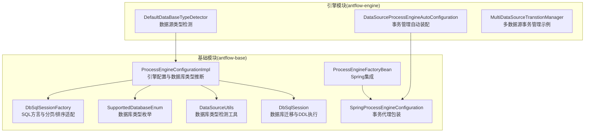
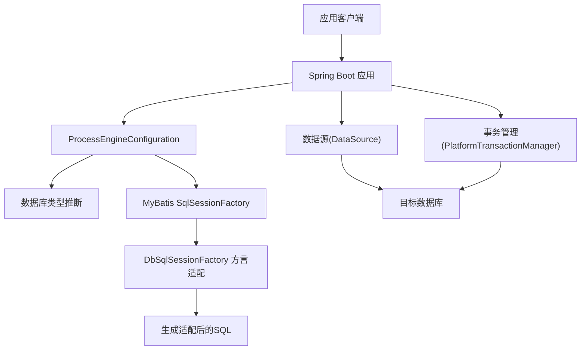
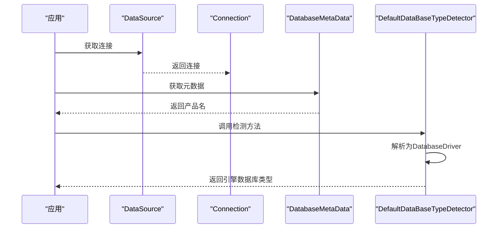
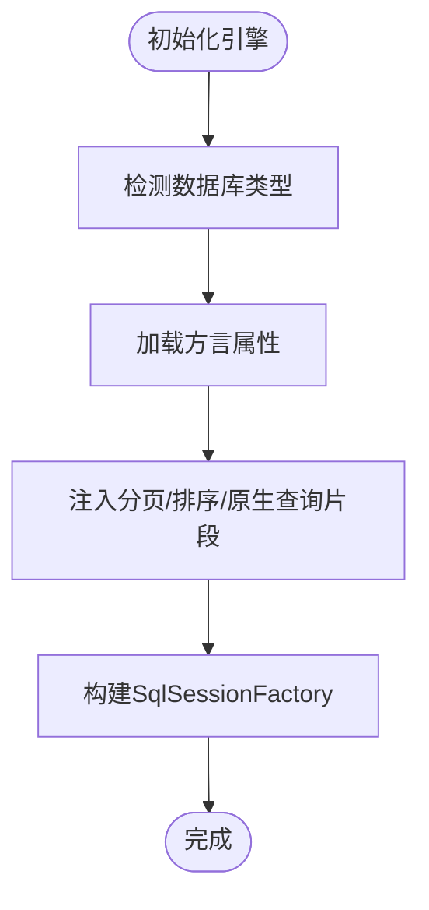
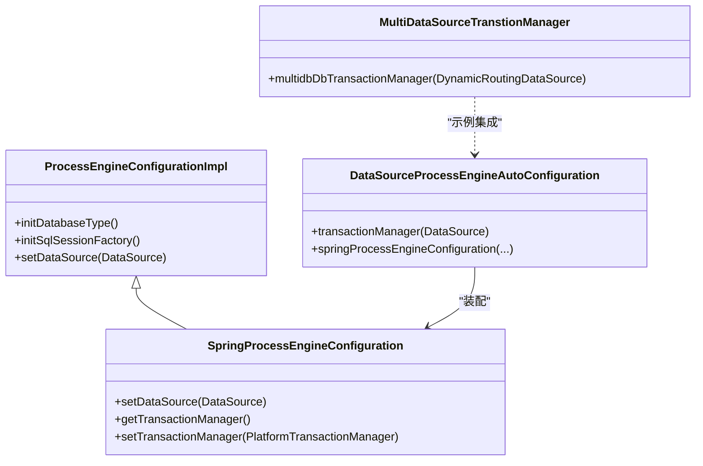
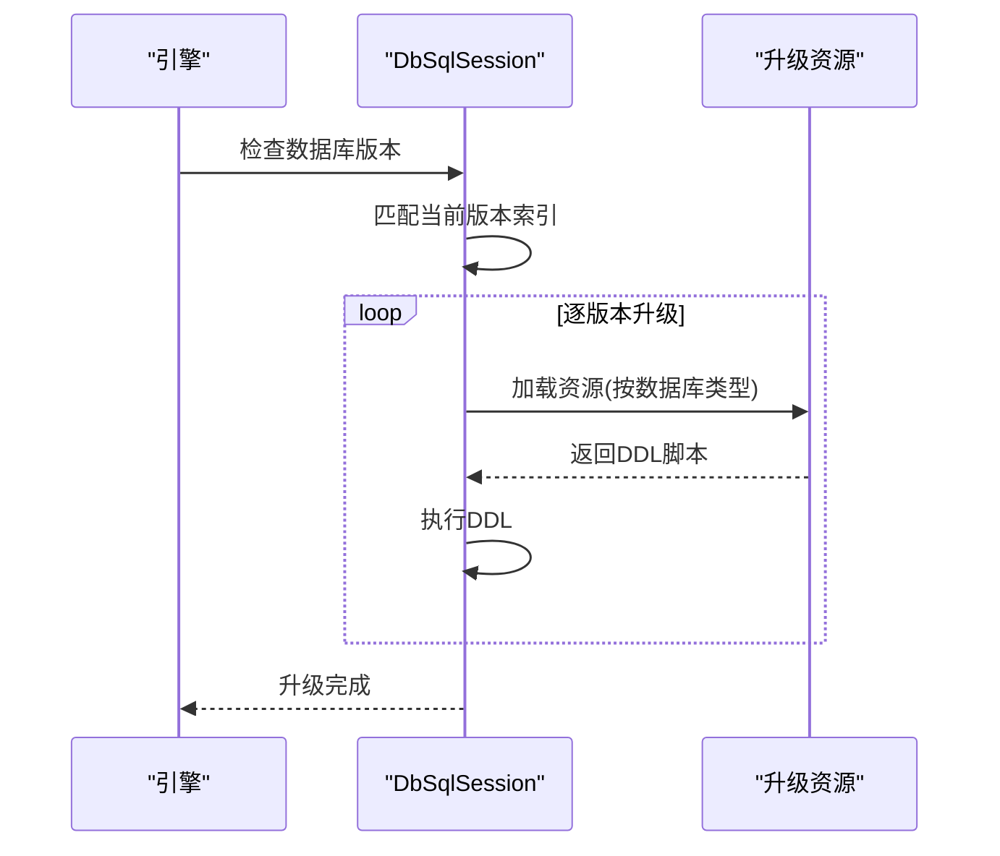
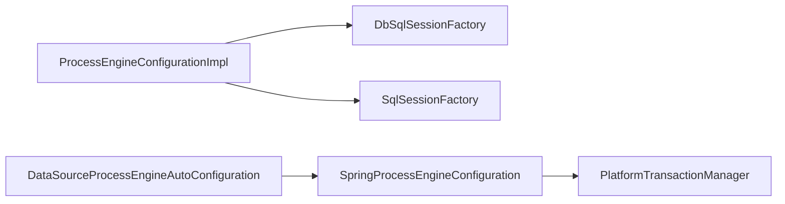

# 多数据库适配开发

<cite>
**本文引用的文件**
- [DefaultDataBaseTypeDetector.java](file://antflow-engine/src/main/java/org/openoa/engine/conf/engineconfig/DefaultDataBaseTypeDetector.java)
- [SupporttedDatabaseEnum.java](file://antflow-base/src/main/java/org/openoa/base/constant/enums/SupporttedDatabaseEnum.java)
- [DataSourceUtils.java](file://antflow-base/src/main/java/org/openoa/base/util/DataSourceUtils.java)
- [ProcessEngineConfigurationImpl.java](file://antflow-base/src/main/java/org/activiti/engine/impl/cfg/ProcessEngineConfigurationImpl.java)
- [DbSqlSessionFactory.java](file://antflow-base/src/main/java/org/activiti/engine/impl/db/DbSqlSessionFactory.java)
- [DbSqlSession.java](file://antflow-base/src/main/java/org/activiti/engine/impl/db/DbSqlSession.java)
- [ProcessEngineFactoryBean.java](file://antflow-base/src/main/java/org/activiti/spring/ProcessEngineFactoryBean.java)
- [SpringProcessEngineConfiguration.java](file://antflow-base/src/main/java/org/activiti/spring/SpringProcessEngineConfiguration.java)
- [DataSourceProcessEngineAutoConfiguration.java](file://antflow-engine/src/main/java/org/openoa/engine/conf/engineconfig/DataSourceProcessEngineAutoConfiguration.java)
- [MultiDataSourceTranstionManager.java](file://antflow-engine/src/main/java/org/openoa/engine/conf/mybatis/MultiDataSourceTranstionManager.java)
- [User.xml](file://antflow-base/src/main/resources/org/activiti/db/mapping/entity/User.xml)
- [1.antflow oracle支持.md](file://doc/多数据库支持/1.antflow oracle支持.md)
- [2.antflow postgresql支持.md](file://doc/多数据库支持/2.antflow postgresql支持.md)
- [4.antflow 达梦dm8 oracle支持.md](file://doc/多数据库支持/4.antflow 达梦dm8 oracle支持.md)
</cite>

## 目录
1. [简介](#简介)
2. [项目结构](#项目结构)
3. [核心组件](#核心组件)
4. [架构总览](#架构总览)
5. [详细组件分析](#详细组件分析)
6. [依赖分析](#依赖分析)
7. [性能考虑](#性能考虑)
8. [故障排查指南](#故障排查指南)
9. [结论](#结论)
10. [附录](#附录)

## 简介
本技术文档面向多数据库适配开发，围绕数据库适配器设计模式与实现方法，系统阐述不同数据库的连接配置、SQL 语句适配策略、连接池优化方案，并给出 MySQL、Oracle、PostgreSQL、达梦等主流数据库的适配实现细节（含方言配置、驱动加载、事务管理）。文档同时提供数据库迁移策略、版本兼容性处理、故障切换机制的实践建议，以及性能优化与安全配置的最佳实践。

## 项目结构
项目采用分层与模块化组织，核心数据库适配能力集中在基础模块与引擎模块：
- 基础模块（antflow-base）：封装 Activiti 引擎配置、数据库方言映射、SQL 适配工厂、数据库类型枚举与检测工具。
- 引擎模块（antflow-engine）：提供 Spring Boot 自动装配、数据源与事务管理集成、多数据源事务管理示例与数据库类型自动检测。

**图表来源**
- [ProcessEngineConfigurationImpl.java:770-844](file://antflow-base/src/main/java/org/activiti/engine/impl/cfg/ProcessEngineConfigurationImpl.java#L770-L844)
- [DbSqlSessionFactory.java:33-232](file://antflow-base/src/main/java/org/activiti/engine/impl/db/DbSqlSessionFactory.java#L33-L232)
- [SupporttedDatabaseEnum.java:1-62](file://antflow-base/src/main/java/org/openoa/base/constant/enums/SupporttedDatabaseEnum.java#L1-L62)
- [DataSourceUtils.java:1-28](file://antflow-base/src/main/java/org/openoa/base/util/DataSourceUtils.java#L1-L28)
- [DbSqlSession.java:1014-1241](file://antflow-base/src/main/java/org/activiti/engine/impl/db/DbSqlSession.java#L1014-L1241)
- [ProcessEngineFactoryBean.java:68-95](file://antflow-base/src/main/java/org/activiti/spring/ProcessEngineFactoryBean.java#L68-L95)
- [SpringProcessEngineConfiguration.java:115-152](file://antflow-base/src/main/java/org/activiti/spring/SpringProcessEngineConfiguration.java#L115-L152)
- [DefaultDataBaseTypeDetector.java:1-48](file://antflow-engine/src/main/java/org/openoa/engine/conf/engineconfig/DefaultDataBaseTypeDetector.java#L1-L48)
- [DataSourceProcessEngineAutoConfiguration.java:29-61](file://antflow-engine/src/main/java/org/openoa/engine/conf/engineconfig/DataSourceProcessEngineAutoConfiguration.java#L29-L61)
- [MultiDataSourceTranstionManager.java:1-28](file://antflow-engine/src/main/java/org/openoa/engine/conf/mybatis/MultiDataSourceTranstionManager.java#L1-L28)

**章节来源**
- [ProcessEngineConfigurationImpl.java:770-844](file://antflow-base/src/main/java/org/activiti/engine/impl/cfg/ProcessEngineConfigurationImpl.java#L770-L844)
- [DbSqlSessionFactory.java:33-232](file://antflow-base/src/main/java/org/activiti/engine/impl/db/DbSqlSessionFactory.java#L33-L232)
- [SupporttedDatabaseEnum.java:1-62](file://antflow-base/src/main/java/org/openoa/base/constant/enums/SupporttedDatabaseEnum.java#L1-L62)
- [DataSourceUtils.java:1-28](file://antflow-base/src/main/java/org/openoa/base/util/DataSourceUtils.java#L1-L28)
- [DefaultDataBaseTypeDetector.java:1-48](file://antflow-engine/src/main/java/org/openoa/engine/conf/engineconfig/DefaultDataBaseTypeDetector.java#L1-L48)
- [DataSourceProcessEngineAutoConfiguration.java:29-61](file://antflow-engine/src/main/java/org/openoa/engine/conf/engineconfig/DataSourceProcessEngineAutoConfiguration.java#L29-L61)
- [MultiDataSourceTranstionManager.java:1-28](file://antflow-engine/src/main/java/org/openoa/engine/conf/mybatis/MultiDataSourceTranstionManager.java#L1-L28)

## 核心组件
- 数据库类型检测与映射
  - 通过数据源连接元数据识别数据库产品名，并映射到引擎期望的数据库类型常量，确保方言与 SQL 适配正确。
- 方言与 SQL 适配
  - 基于数据库类型，注入分页、排序、原生查询限制等方言片段，保证跨数据库的查询一致性。
- 连接池与事务管理
  - 通过引擎配置初始化连接池参数，启用事务代理包装，支持外部事务管理与 Spring 事务集成。
- 数据库迁移与版本兼容
  - 基于版本匹配与资源路径约定，自动执行升级脚本，兼容多版本演进。

**章节来源**
- [DefaultDataBaseTypeDetector.java:14-46](file://antflow-engine/src/main/java/org/openoa/engine/conf/engineconfig/DefaultDataBaseTypeDetector.java#L14-L46)
- [ProcessEngineConfigurationImpl.java:733-763](file://antflow-base/src/main/java/org/activiti/engine/impl/cfg/ProcessEngineConfigurationImpl.java#L733-L763)
- [DbSqlSessionFactory.java:33-232](file://antflow-base/src/main/java/org/activiti/engine/impl/db/DbSqlSessionFactory.java#L33-L232)
- [DbSqlSession.java:1014-1241](file://antflow-base/src/main/java/org/activiti/engine/impl/db/DbSqlSession.java#L1014-L1241)
- [SpringProcessEngineConfiguration.java:115-152](file://antflow-base/src/main/java/org/activiti/spring/SpringProcessEngineConfiguration.java#L115-L152)

## 架构总览
整体架构围绕 Activiti 引擎配置与方言适配展开，配合 Spring Boot 自动装配与事务管理，形成可扩展的多数据库适配体系。

**图表来源**
- [ProcessEngineConfigurationImpl.java:846-892](file://antflow-base/src/main/java/org/activiti/engine/impl/cfg/ProcessEngineConfigurationImpl.java#L846-L892)
- [DbSqlSessionFactory.java:33-232](file://antflow-base/src/main/java/org/activiti/engine/impl/db/DbSqlSessionFactory.java#L33-L232)
- [DataSourceProcessEngineAutoConfiguration.java:46-61](file://antflow-engine/src/main/java/org/openoa/engine/conf/engineconfig/DataSourceProcessEngineAutoConfiguration.java#L46-L61)
- [SpringProcessEngineConfiguration.java:115-152](file://antflow-base/src/main/java/org/activiti/spring/SpringProcessEngineConfiguration.java#L115-L152)

## 详细组件分析

### 数据库类型检测与映射
- 功能概述
  - 通过数据源连接获取数据库产品名，借助 Spring 的 DatabaseDriver 解析器映射为引擎内部数据库类型常量，覆盖 MySQL、PostgreSQL、Oracle、H2、DB2 等。
- 关键实现
  - 数据源连接与元数据读取
  - DatabaseDriver 解析与自定义映射
  - 异常处理与错误提示
- 适用场景
  - 启动阶段自动识别数据库类型，避免手工配置错误
  - 与方言工厂协同，确保 SQL 适配正确

**图表来源**
- [DefaultDataBaseTypeDetector.java:14-46](file://antflow-engine/src/main/java/org/openoa/engine/conf/engineconfig/DefaultDataBaseTypeDetector.java#L14-L46)

**章节来源**
- [DefaultDataBaseTypeDetector.java:1-48](file://antflow-engine/src/main/java/org/openoa/engine/conf/engineconfig/DefaultDataBaseTypeDetector.java#L1-L48)

### 方言与 SQL 适配
- 功能概述
  - 基于数据库类型注入分页、排序、原生查询限制等方言片段，支持不同数据库的 LIMIT/OFFSET、ROW_NUMBER 等差异。
- 关键实现
  - DbSqlSessionFactory 中静态注册各数据库的 limitBefore/After、orderBy、nativeQuery 前置片段
  - ProcessEngineConfigurationImpl 初始化 MyBatis 时读取方言属性并注入
  - Mapper XML 中通过 ${limitBefore}/${limitAfter} 等占位符拼接适配 SQL
- 适用场景
  - 分页查询、原生查询、排序统一处理
  - 避免手写数据库特定 SQL，提升可移植性

**图表来源**
- [DbSqlSessionFactory.java:33-232](file://antflow-base/src/main/java/org/activiti/engine/impl/db/DbSqlSessionFactory.java#L33-L232)
- [ProcessEngineConfigurationImpl.java:858-892](file://antflow-base/src/main/java/org/activiti/engine/impl/cfg/ProcessEngineConfigurationImpl.java#L858-L892)
- [User.xml:139-157](file://antflow-base/src/main/resources/org/activiti/db/mapping/entity/User.xml#L139-L157)

**章节来源**
- [DbSqlSessionFactory.java:33-232](file://antflow-base/src/main/java/org/activiti/engine/impl/db/DbSqlSessionFactory.java#L33-L232)
- [ProcessEngineConfigurationImpl.java:858-892](file://antflow-base/src/main/java/org/activiti/engine/impl/cfg/ProcessEngineConfigurationImpl.java#L858-L892)
- [User.xml:139-157](file://antflow-base/src/main/resources/org/activiti/db/mapping/entity/User.xml#L139-L157)

### 连接池与事务管理
- 功能概述
  - 通过引擎配置初始化连接池参数（最大活跃、空闲、checkout 超时、等待时间、心跳检测、隔离级别等），并启用事务代理包装，支持外部事务管理。
- 关键实现
  - 连接池参数设置与 Ping 配置
  - SpringProcessEngineConfiguration 对数据源进行事务代理包装
  - DataSourceProcessEngineAutoConfiguration 自动装配事务管理器
  - MultiDataSourceTranstionManager 提供多数据源事务管理示例
- 适用场景
  - 生产环境连接池调优与稳定性保障
  - Spring 事务与外部事务的无缝集成

**图表来源**
- [ProcessEngineConfigurationImpl.java:733-763](file://antflow-base/src/main/java/org/activiti/engine/impl/cfg/ProcessEngineConfigurationImpl.java#L733-L763)
- [SpringProcessEngineConfiguration.java:115-152](file://antflow-base/src/main/java/org/activiti/spring/SpringProcessEngineConfiguration.java#L115-L152)
- [DataSourceProcessEngineAutoConfiguration.java:46-61](file://antflow-engine/src/main/java/org/openoa/engine/conf/engineconfig/DataSourceProcessEngineAutoConfiguration.java#L46-L61)
- [MultiDataSourceTranstionManager.java:19-28](file://antflow-engine/src/main/java/org/openoa/engine/conf/mybatis/MultiDataSourceTranstionManager.java#L19-L28)

**章节来源**
- [ProcessEngineConfigurationImpl.java:733-763](file://antflow-base/src/main/java/org/activiti/engine/impl/cfg/ProcessEngineConfigurationImpl.java#L733-L763)
- [SpringProcessEngineConfiguration.java:115-152](file://antflow-base/src/main/java/org/activiti/spring/SpringProcessEngineConfiguration.java#L115-L152)
- [DataSourceProcessEngineAutoConfiguration.java:46-61](file://antflow-engine/src/main/java/org/openoa/engine/conf/engineconfig/DataSourceProcessEngineAutoConfiguration.java#L46-L61)
- [MultiDataSourceTranstionManager.java:19-28](file://antflow-engine/src/main/java/org/openoa/engine/conf/mybatis/MultiDataSourceTranstionManager.java#L19-L28)

### 数据库迁移与版本兼容
- 功能概述
  - 基于数据库版本属性与资源路径约定，自动执行 schema 升级脚本，支持多版本演进与兼容。
- 关键实现
  - DbSqlSession 中解析当前版本、匹配目标版本、按顺序执行升级资源
  - 资源命名规范：activiti.{databaseType}.upgrade.{from}.to.{to}.{component}.sql
- 适用场景
  - 系统升级时自动迁移数据库结构
  - 保证不同版本间的兼容性

**图表来源**
- [DbSqlSession.java:1014-1241](file://antflow-base/src/main/java/org/activiti/engine/impl/db/DbSqlSession.java#L1014-L1241)

**章节来源**
- [DbSqlSession.java:1014-1241](file://antflow-base/src/main/java/org/activiti/engine/impl/db/DbSqlSession.java#L1014-L1241)

### MySQL、Oracle、PostgreSQL、达梦适配要点
- MySQL
  - 方言：LIMIT 分页与排序适配已内置
  - 驱动：使用 MySQL/ mariadb 对应驱动类名
  - 连接池：合理设置最大活跃、空闲、checkout 超时与等待时间
- Oracle
  - 方言：ROWNUM/RANGE 限制与 Oracle 特定语句映射
  - 驱动：使用 Oracle Thin 驱动类名
  - 迁移：按资源命名规范执行升级脚本
- PostgreSQL
  - 方言：LIMIT 分页与 PostgreSQL 特定语句映射
  - 驱动：使用 PostgreSQL 驱动类名
  - Schema：可通过连接串指定 currentSchema
- 达梦
  - 兼容模式：支持 Oracle/MySQL/PG 等模式，需在初始化时设置
  - 驱动：使用达梦 JDBC 驱动类名
  - 连接串：按达梦兼容模式调整

**章节来源**
- [DbSqlSessionFactory.java:60-154](file://antflow-base/src/main/java/org/activiti/engine/impl/db/DbSqlSessionFactory.java#L60-L154)
- [1.antflow oracle支持.md:313-326](file://doc/多数据库支持/1.antflow oracle支持.md#L313-L326)
- [2.antflow postgresql支持.md:64-83](file://doc/多数据库支持/2.antflow postgresql支持.md#L64-L83)
- [4.antflow 达梦dm8 oracle支持.md:178-224](file://doc/多数据库支持/4.antflow 达梦dm8 oracle支持.md#L178-L224)

## 依赖分析
- 组件耦合
  - ProcessEngineConfigurationImpl 与 DbSqlSessionFactory 强耦合，前者负责类型推断与 MyBatis 构建，后者提供方言映射。
  - SpringProcessEngineConfiguration 与 DataSourceProcessEngineAutoConfiguration 协作，实现事务代理与自动装配。
- 外部依赖
  - Spring Boot Starter、MyBatis、Activiti 引擎、数据库驱动与连接池组件。
- 循环依赖
  - 当前结构未见循环依赖，配置与工厂职责清晰分离。

**图表来源**
- [ProcessEngineConfigurationImpl.java:846-892](file://antflow-base/src/main/java/org/activiti/engine/impl/cfg/ProcessEngineConfigurationImpl.java#L846-L892)
- [SpringProcessEngineConfiguration.java:115-152](file://antflow-base/src/main/java/org/activiti/spring/SpringProcessEngineConfiguration.java#L115-L152)
- [DataSourceProcessEngineAutoConfiguration.java:46-61](file://antflow-engine/src/main/java/org/openoa/engine/conf/engineconfig/DataSourceProcessEngineAutoConfiguration.java#L46-L61)

**章节来源**
- [ProcessEngineConfigurationImpl.java:846-892](file://antflow-base/src/main/java/org/activiti/engine/impl/cfg/ProcessEngineConfigurationImpl.java#L846-L892)
- [SpringProcessEngineConfiguration.java:115-152](file://antflow-base/src/main/java/org/activiti/spring/SpringProcessEngineConfiguration.java#L115-L152)
- [DataSourceProcessEngineAutoConfiguration.java:46-61](file://antflow-engine/src/main/java/org/openoa/engine/conf/engineconfig/DataSourceProcessEngineAutoConfiguration.java#L46-L61)

## 性能考虑
- 连接池参数调优
  - 最大活跃连接数、空闲连接数、checkout 超时、等待时间、心跳检测与 Ping 查询间隔应结合业务并发与数据库性能评估设置。
- SQL 适配与分页
  - 使用方言工厂提供的 limitBefore/After 片段，避免手写特定 SQL，减少跨库差异带来的性能波动。
- 事务隔离与超时
  - 合理设置事务隔离级别与超时时间，避免长事务占用连接资源。
- 监控指标
  - 连接池活跃数、空闲数、等待队列长度、checkout 耗时、Ping 成功率、慢查询统计等。

[本节为通用指导，无需具体文件引用]

## 故障排查指南
- 数据库类型识别失败
  - 检查数据源连接是否可用、数据库产品名是否被正确识别，确认映射逻辑覆盖目标数据库类型。
- 方言片段缺失
  - 确认数据库类型与方言映射一致，检查 MyBatis 属性注入是否生效。
- 迁移失败
  - 核查资源路径与命名规范，确认当前版本与目标版本匹配，逐版本执行升级脚本。
- 事务异常
  - 检查事务代理包装与外部事务管理配置，确认 PlatformTransactionManager 正确装配。

**章节来源**
- [DefaultDataBaseTypeDetector.java:14-26](file://antflow-engine/src/main/java/org/openoa/engine/conf/engineconfig/DefaultDataBaseTypeDetector.java#L14-L26)
- [DbSqlSession.java:1014-1241](file://antflow-base/src/main/java/org/activiti/engine/impl/db/DbSqlSession.java#L1014-L1241)
- [ProcessEngineConfigurationImpl.java:858-892](file://antflow-base/src/main/java/org/activiti/engine/impl/cfg/ProcessEngineConfigurationImpl.java#L858-L892)

## 结论
本项目通过“类型检测 + 方言适配 + 连接池与事务管理 + 迁移兼容”的整体设计，实现了对 MySQL、Oracle、PostgreSQL、达梦等主流数据库的多数据库适配。借助方言工厂与资源化的升级脚本，系统在保证可移植性的同时，兼顾了性能与稳定性。建议在生产环境中结合业务负载与数据库特性，持续优化连接池参数与 SQL 适配策略，并建立完善的监控与故障排查机制。

[本节为总结，无需具体文件引用]

## 附录
- 数据库类型枚举与共享关系
  - 支持 MySQL、Oracle、PostgreSQL、SQLServer、OceanBase、openGauss、达梦、PolarDB、金仓、南大通用、MongoDB、TiDB 等，部分数据库通过 share 字段指向共享类型，便于统一处理。
- 示例与参考文档
  - Oracle、PostgreSQL、达梦的安装与连接配置示例详见对应文档。

**章节来源**
- [SupporttedDatabaseEnum.java:1-62](file://antflow-base/src/main/java/org/openoa/base/constant/enums/SupporttedDatabaseEnum.java#L1-L62)
- [1.antflow oracle支持.md:1-332](file://doc/多数据库支持/1.antflow oracle支持.md#L1-L332)
- [2.antflow postgresql支持.md:1-94](file://doc/多数据库支持/2.antflow postgresql支持.md#L1-L94)
- [4.antflow 达梦dm8 oracle支持.md:1-245](file://doc/多数据库支持/4.antflow 达梦dm8 oracle支持.md#L1-L245)