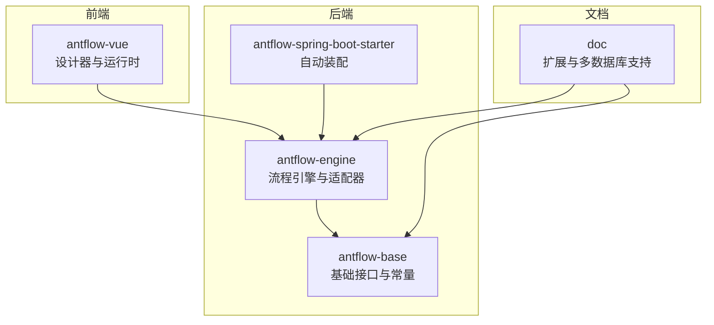
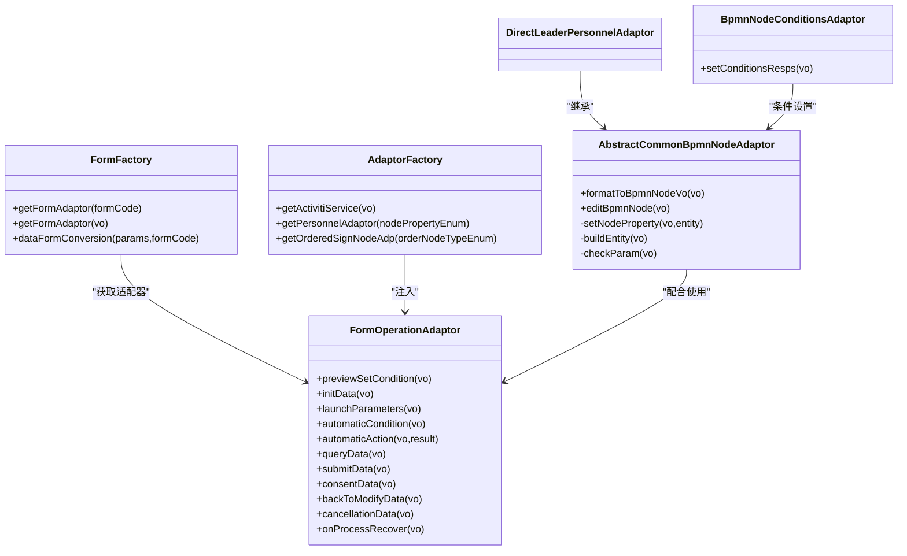
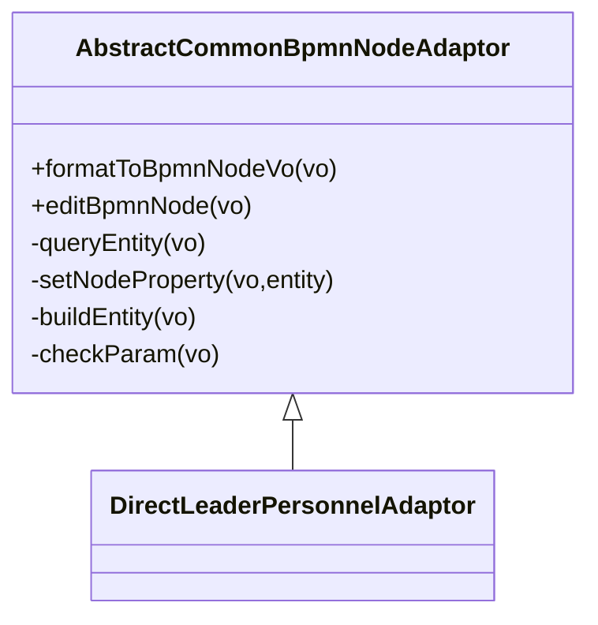
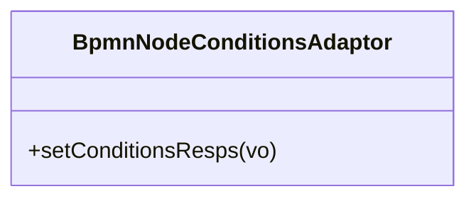
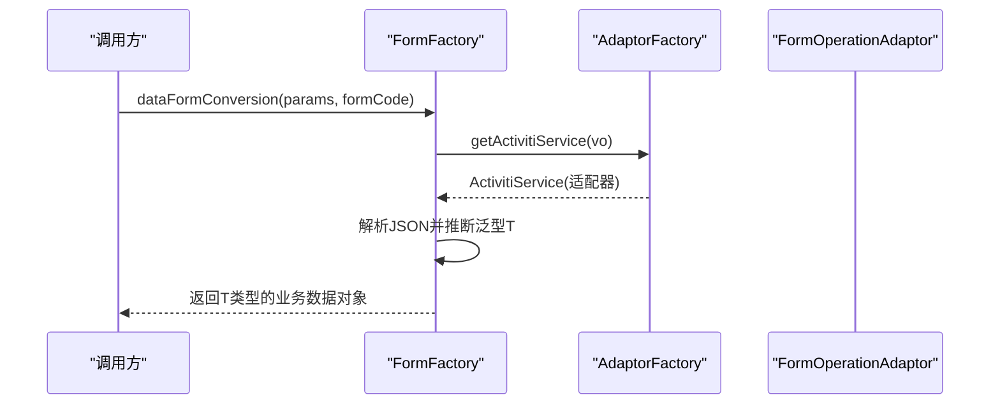
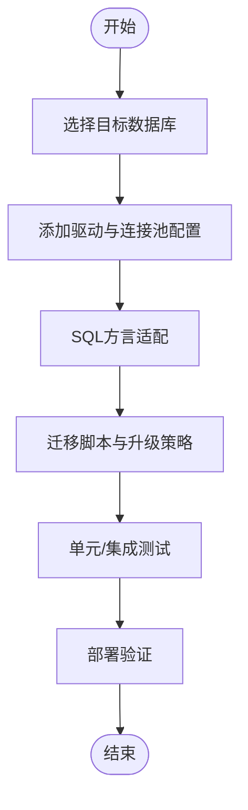
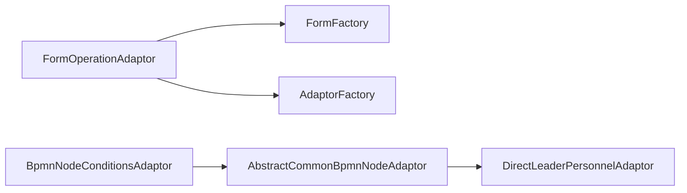

# 扩展开发指南

<cite>
**本文引用的文件**
- [FormAdapter.java](file://antflow-engine/src/main/java/org/openoa/engine/bpmnconf/adp/FormAdapter.java)
- [FormOperationAdaptor.java](file://antflow-base/src/main/java/org/openoa/base/interf/FormOperationAdaptor.java)
- [AdaptorFactory.java](file://antflow-engine/src/main/java/org/openoa/engine/factory/AdaptorFactory.java)
- [FormFactory.java](file://antflow-engine/src/main/java/org/openoa/engine/factory/FormFactory.java)
- [AbstractCommonBpmnNodeAdaptor.java](file://antflow-engine/src/main/java/org/openoa/engine/bpmnconf/adp/bpmnnodeadp/AbstractCommonBpmnNodeAdaptor.java)
- [BpmnNodeConditionsAdaptor.java](file://antflow-engine/src/main/java/org/openoa/engine/bpmnconf/adp/conditionfilter/nodetypeconditions/BpmnNodeConditionsAdaptor.java)
- [DirectLeaderPersonnelAdaptor.java](file://antflow-engine/src/main/java/org/openoa/engine/bpmnconf/adp/personneladp/DirectLeaderPersonnelAdaptor.java)
- [ProcessConstants.java](file://antflow-engine/src/main/java/org/openoa/engine/bpmnconf/common/ProcessConstants.java)
- [AntFlowConstants.java](file://antflow-engine/src/main/java/org/openoa/engine/bpmnconf/constant/AntFlowConstants.java)
- [BpmnModel.java](file://antflow-base/src/main/java/org/activiti/bpmn/model/BpmnModel.java)
- [AntFlowAutoConfiguration.java](file://antflow-spring-boot-starter/src/main/java/org/openoa/starter/config/AntFlowAutoConfiguration.java)
- [README.zh_CN.md](file://README.zh_CN.md)
- [系统介绍篇/23.系统扩展.md](file://doc/系统介绍篇/23.系统扩展.md)
- [系统集成与扩展开发篇/AntFlow快速集成到企业现有系统二之源码集成篇.md](file://doc/系统集成与扩展开发篇/AntFlow快速集成到企业现有系统二之源码集成篇.md)
- [系统集成与扩展开发篇/AntFlow快速集成到已有系统之一starter篇.md](file://doc/系统集成与扩展开发篇/AntFlow快速集成到已有系统之一starter篇.md)
- [多数据库支持/1.antflow oracle支持.md](file://doc/多数据库支持/1.antflow oracle支持.md)
- [多数据库支持/2.antflow postgresql支持.md](file://doc/多数据库支持/2.antflow postgresql支持.md)
- [多数据库支持/4.antflow 达梦dm8 oracle支持.md](file://doc/多数据库支持/4.antflow 达梦dm8 oracle支持.md)
- [多数据库支持/11.antflow 南大通用gbase支持.md](file://doc/多数据库支持/11.antflow 南大通用gbase支持.md)
- [多数据库支持/16.antflow mongodb支持.md](file://doc/多数据库支持/16.antflow mongodb支持.md)
</cite>

## 目录
1. [简介](#简介)
2. [项目结构](#项目结构)
3. [核心组件](#核心组件)
4. [架构总览](#架构总览)
5. [详细组件分析](#详细组件分析)
6. [依赖关系分析](#依赖关系分析)
7. [性能考虑](#性能考虑)
8. [故障排查指南](#故障排查指南)
9. [结论](#结论)
10. [附录](#附录)

## 简介
本指南面向希望在 AntFlow 工作流平台基础上进行扩展开发的工程师，覆盖以下主题：
- 自定义节点开发：节点适配器的实现模式与生命周期
- 条件评估器：如何为节点配置与运行期条件评估编写扩展
- 自定义表单开发：表单适配器的实现方式与数据转换机制
- 字段验证器：基于表单适配器的字段校验扩展点
- 多数据库适配：不同数据库驱动与连接池配置策略
- 插件化架构：扩展点识别、自动装配与向后兼容
- 性能调优与最佳实践：连接池、查询优化与缓存策略
- 开发示例与测试方法：从接口到实现的完整流程

## 项目结构
AntFlow 采用分层与模块化组织，核心模块包括：
- antflow-base：基础接口、常量与通用工具
- antflow-engine：流程引擎、适配器工厂、业务服务
- antflow-spring-boot-starter：自动装配与启动配置
- antflow-vue：前端设计器与运行时界面
- doc：官方文档与多数据库支持说明

**图表来源**
- [AntFlowAutoConfiguration.java](file://antflow-spring-boot-starter/src/main/java/org/openoa/starter/config/AntFlowAutoConfiguration.java)
- [FormFactory.java](file://antflow-engine/src/main/java/org/openoa/engine/factory/FormFactory.java)

**章节来源**
- [README.zh_CN.md](file://README.zh_CN.md)

## 核心组件
本节聚焦扩展开发的关键接口与工厂类，帮助你快速定位扩展点。

- 表单适配器接口：FormOperationAdaptor
  - 定义了流程启动前预览、初始化、启动参数、自动条件与动作、数据查询/提交、同意/退回/取消/恢复等全生命周期方法
  - 支持区分普通表单与低代码表单的适配器集合筛选

- 表单工厂：FormFactory
  - 依据 formCode 获取对应适配器，并进行请求体到业务数据对象的转换
  - 支持外部访问流程与低代码流程的特殊处理

- 适配器工厂：AdaptorFactory
  - 提供基于注解的适配器获取入口，支持人员选择、有序会签、Activiti 服务等

- 节点适配器基类：AbstractCommonBpmnNodeAdaptor
  - 统一节点格式化、编辑与持久化逻辑，子类只需关注实体构建与参数校验

- 条件评估器基类：BpmnNodeConditionsAdaptor
  - 为节点设置响应条件，便于设计器与运行时展示

- 人员适配器示例：DirectLeaderPersonnelAdaptor
  - 展示如何声明支持的业务对象类型

- 流程常量与工具：AntFlowConstants、ProcessConstants
  - 提供流程节点键、网关类型、任务标识等常量与常用查询工具

**章节来源**
- [FormOperationAdaptor.java](file://antflow-base/src/main/java/org/openoa/base/interf/FormOperationAdaptor.java)
- [FormFactory.java](file://antflow-engine/src/main/java/org/openoa/engine/factory/FormFactory.java)
- [AdaptorFactory.java](file://antflow-engine/src/main/java/org/openoa/engine/factory/AdaptorFactory.java)
- [AbstractCommonBpmnNodeAdaptor.java](file://antflow-engine/src/main/java/org/openoa/engine/bpmnconf/adp/bpmnnodeadp/AbstractCommonBpmnNodeAdaptor.java)
- [BpmnNodeConditionsAdaptor.java](file://antflow-engine/src/main/java/org/openoa/engine/bpmnconf/adp/conditionfilter/nodetypeconditions/BpmnNodeConditionsAdaptor.java)
- [DirectLeaderPersonnelAdaptor.java](file://antflow-engine/src/main/java/org/openoa/engine/bpmnconf/adp/personneladp/DirectLeaderPersonnelAdaptor.java)
- [AntFlowConstants.java](file://antflow-engine/src/main/java/org/openoa/engine/bpmnconf/constant/AntFlowConstants.java)
- [ProcessConstants.java](file://antflow-engine/src/main/java/org/openoa/engine/bpmnconf/common/ProcessConstants.java)

## 架构总览
AntFlow 的扩展架构以“接口 + 工厂 + 注解 + Spring 容器”为核心，形成可插拔的适配器体系。

**图表来源**
- [FormOperationAdaptor.java](file://antflow-base/src/main/java/org/openoa/base/interf/FormOperationAdaptor.java)
- [FormFactory.java](file://antflow-engine/src/main/java/org/openoa/engine/factory/FormFactory.java)
- [AdaptorFactory.java](file://antflow-engine/src/main/java/org/openoa/engine/factory/AdaptorFactory.java)
- [AbstractCommonBpmnNodeAdaptor.java](file://antflow-engine/src/main/java/org/openoa/engine/bpmnconf/adp/bpmnnodeadp/AbstractCommonBpmnNodeAdaptor.java)
- [BpmnNodeConditionsAdaptor.java](file://antflow-engine/src/main/java/org/openoa/engine/bpmnconf/adp/conditionfilter/nodetypeconditions/BpmnNodeConditionsAdaptor.java)
- [DirectLeaderPersonnelAdaptor.java](file://antflow-engine/src/main/java/org/openoa/engine/bpmnconf/adp/personneladp/DirectLeaderPersonnelAdaptor.java)

## 详细组件分析

### 自定义节点开发：节点适配器实现模式
- 继承 AbstractCommonBpmnNodeAdaptor
  - 在 formatToBpmnNodeVo 中读取持久化实体并填充节点属性
  - 在 editBpmnNode 中校验参数、构建实体并批量保存
  - 子类需实现 setNodeProperty、buildEntity、checkParam 三个抽象方法

**图表来源**
- [AbstractCommonBpmnNodeAdaptor.java](file://antflow-engine/src/main/java/org/openoa/engine/bpmnconf/adp/bpmnnodeadp/AbstractCommonBpmnNodeAdaptor.java)
- [DirectLeaderPersonnelAdaptor.java](file://antflow-engine/src/main/java/org/openoa/engine/bpmnconf/adp/personneladp/DirectLeaderPersonnelAdaptor.java)

**章节来源**
- [AbstractCommonBpmnNodeAdaptor.java](file://antflow-engine/src/main/java/org/openoa/engine/bpmnconf/adp/bpmnnodeadp/AbstractCommonBpmnNodeAdaptor.java)
- [DirectLeaderPersonnelAdaptor.java](file://antflow-engine/src/main/java/org/openoa/engine/bpmnconf/adp/personneladp/DirectLeaderPersonnelAdaptor.java)

### 条件评估器开发流程
- 继承 BpmnNodeConditionsAdaptor
  - 实现 setConditionsResps 方法，用于在节点层面设置响应条件，影响设计器与运行时行为

**图表来源**
- [BpmnNodeConditionsAdaptor.java](file://antflow-engine/src/main/java/org/openoa/engine/bpmnconf/adp/conditionfilter/nodetypeconditions/BpmnNodeConditionsAdaptor.java)

**章节来源**
- [BpmnNodeConditionsAdaptor.java](file://antflow-engine/src/main/java/org/openoa/engine/bpmnconf/adp/conditionfilter/nodetypeconditions/BpmnNodeConditionsAdaptor.java)

### 自定义表单开发：表单适配器与工厂
- 表单适配器接口：FormOperationAdaptor
  - 定义流程生命周期方法：预览条件、初始化、启动参数、自动条件/动作、查询/提交、同意/退回/取消/恢复
  - 提供非低代码表单适配器集合的筛选方法

- 表单工厂：FormFactory
  - 通过 formCode 获取适配器；若为外部访问或低代码流程，进行特殊数据映射
  - 将请求体转换为具体业务数据对象（泛型推断）

**图表来源**
- [FormFactory.java](file://antflow-engine/src/main/java/org/openoa/engine/factory/FormFactory.java)
- [AdaptorFactory.java](file://antflow-engine/src/main/java/org/openoa/engine/factory/AdaptorFactory.java)
- [FormOperationAdaptor.java](file://antflow-base/src/main/java/org/openoa/base/interf/FormOperationAdaptor.java)

**章节来源**
- [FormOperationAdaptor.java](file://antflow-base/src/main/java/org/openoa/base/interf/FormOperationAdaptor.java)
- [FormFactory.java](file://antflow-engine/src/main/java/org/openoa/engine/factory/FormFactory.java)
- [AdaptorFactory.java](file://antflow-engine/src/main/java/org/openoa/engine/factory/AdaptorFactory.java)

### 字段验证器开发方法
- 建议在表单适配器的相应生命周期中进行字段校验：
  - 初始化阶段：校验必填字段与默认值
  - 启动参数阶段：校验流程启动条件
  - 提交阶段：对业务数据进行完整性与一致性校验
  - 同意/退回阶段：根据审批结果进行后续校验
- 可结合 ProcessConstants 提供的工具方法进行流程状态判断与历史任务查询，确保校验上下文正确

**章节来源**
- [FormOperationAdaptor.java](file://antflow-base/src/main/java/org/openoa/base/interf/FormOperationAdaptor.java)
- [ProcessConstants.java](file://antflow-engine/src/main/java/org/openoa/engine/bpmnconf/common/ProcessConstants.java)

### 多数据库适配开发模式
- 支持 Oracle、PostgreSQL、达梦、南大通用、MongoDB、PolarDB 等数据库
- 开发步骤建议：
  - 在配置层引入目标数据库驱动与连接池（如 HikariCP）
  - 配置数据源与 MyBatis Plus 分页、类型处理器
  - 针对 SQL 方言差异，补充方言适配与 DDL/升级脚本
  - 编写单元测试与集成测试，覆盖跨库迁移与查询路径

**章节来源**
- [多数据库支持/1.antflow oracle支持.md](file://doc/多数据库支持/1.antflow oracle支持.md)
- [多数据库支持/2.antflow postgresql支持.md](file://doc/多数据库支持/2.antflow postgresql支持.md)
- [多数据库支持/4.antflow 达梦dm8 oracle支持.md](file://doc/多数据库支持/4.antflow 达梦dm8 oracle支持.md)
- [多数据库支持/11.antflow 南大通用gbase支持.md](file://doc/多数据库支持/11.antflow 南大通用gbase支持.md)
- [多数据库支持/16.antflow mongodb支持.md](file://doc/多数据库支持/16.antflow mongodb支持.md)

### 连接池配置优化策略
- HikariCP 推荐参数
  - 最小空闲连接数：根据并发峰值与事务持续时间估算
  - 最大连接数：不超过数据库最大连接限制
  - 连接超时：合理设置获取连接超时与空闲回收周期
  - 查询超时：针对长查询设置超时，避免连接占用
- 监控与告警
  - 连接池指标：活跃连接、空闲连接、等待时间、拒绝次数
  - 数据库指标：慢查询、锁等待、缓冲池命中率

### 性能调优最佳实践
- 查询优化
  - 使用合适的索引覆盖高频查询字段
  - 避免 N+1 查询，优先批量加载
- 缓存策略
  - 对只读配置与字典数据进行本地缓存
  - 对热点流程定义与节点配置进行缓存
- 异步处理
  - 审批通知、日志落库等异步化
- 并发控制
  - 对关键业务操作加分布式锁或乐观锁

## 依赖关系分析
- 接口与实现
  - FormOperationAdaptor 为表单适配器核心接口，由具体业务实现类实现
  - AbstractCommonBpmnNodeAdaptor 为节点适配器基类，统一节点持久化与编辑流程
  - BpmnNodeConditionsAdaptor 为条件评估器基类，统一节点条件设置

**图表来源**
- [FormOperationAdaptor.java](file://antflow-base/src/main/java/org/openoa/base/interf/FormOperationAdaptor.java)
- [FormFactory.java](file://antflow-engine/src/main/java/org/openoa/engine/factory/FormFactory.java)
- [AdaptorFactory.java](file://antflow-engine/src/main/java/org/openoa/engine/factory/AdaptorFactory.java)
- [AbstractCommonBpmnNodeAdaptor.java](file://antflow-engine/src/main/java/org/openoa/engine/bpmnconf/adp/bpmnnodeadp/AbstractCommonBpmnNodeAdaptor.java)
- [BpmnNodeConditionsAdaptor.java](file://antflow-engine/src/main/java/org/openoa/engine/bpmnconf/adp/conditionfilter/nodetypeconditions/BpmnNodeConditionsAdaptor.java)
- [DirectLeaderPersonnelAdaptor.java](file://antflow-engine/src/main/java/org/openoa/engine/bpmnconf/adp/personneladp/DirectLeaderPersonnelAdaptor.java)

**章节来源**
- [FormOperationAdaptor.java](file://antflow-base/src/main/java/org/openoa/base/interf/FormOperationAdaptor.java)
- [FormFactory.java](file://antflow-engine/src/main/java/org/openoa/engine/factory/FormFactory.java)
- [AdaptorFactory.java](file://antflow-engine/src/main/java/org/openoa/engine/factory/AdaptorFactory.java)
- [AbstractCommonBpmnNodeAdaptor.java](file://antflow-engine/src/main/java/org/openoa/engine/bpmnconf/adp/bpmnnodeadp/AbstractCommonBpmnNodeAdaptor.java)
- [BpmnNodeConditionsAdaptor.java](file://antflow-engine/src/main/java/org/openoa/engine/bpmnconf/adp/conditionfilter/nodetypeconditions/BpmnNodeConditionsAdaptor.java)
- [DirectLeaderPersonnelAdaptor.java](file://antflow-engine/src/main/java/org/openoa/engine/bpmnconf/adp/personneladp/DirectLeaderPersonnelAdaptor.java)

## 性能考虑
- 数据访问层
  - 使用分页查询与延迟加载，避免一次性加载大量数据
  - 对高频查询建立复合索引，减少全表扫描
- 缓存与异步
  - 对只读数据与配置信息进行本地缓存
  - 审批通知、日志等异步处理，降低主流程阻塞
- 连接池
  - 合理设置连接池大小与超时，监控连接池健康度
- 监控与诊断
  - 记录慢查询与异常堆栈，定期分析瓶颈

## 故障排查指南
- 表单适配器未找到
  - 检查 formCode 是否正确注册为 Spring Bean
  - 确认泛型 T 是否正确声明，以便 FormFactory 正确解析

- 流程启动失败
  - 核对启动参数与自动条件是否满足
  - 检查流程定义与节点配置是否正确

- 多数据库连接问题
  - 确认驱动版本与连接串配置
  - 检查方言与 DDL/升级脚本是否匹配

**章节来源**
- [FormFactory.java](file://antflow-engine/src/main/java/org/openoa/engine/factory/FormFactory.java)
- [ProcessConstants.java](file://antflow-engine/src/main/java/org/openoa/engine/bpmnconf/common/ProcessConstants.java)

## 结论
AntFlow 的扩展开发围绕“接口 + 工厂 + 注解 + Spring”的插件化架构展开。通过实现 FormOperationAdaptor、AbstractCommonBpmnNodeAdaptor、BpmnNodeConditionsAdaptor 等核心接口，结合 AdaptorFactory 与 FormFactory 的自动装配能力，可快速实现自定义节点、条件评估、表单适配与字段校验。同时，平台提供了完善的多数据库支持与性能优化建议，便于在生产环境中稳定运行。

## 附录
- 开发示例与测试方法
  - 示例：实现一个简单的人员节点适配器，继承 AbstractCommonBpmnNodeAdaptor，实现 setNodeProperty/buildEntity/checkParam
  - 测试：编写单元测试覆盖 editBpmnNode 的参数校验与持久化逻辑；编写集成测试验证流程启动与审批链路
- 向后兼容性保证
  - 保持接口签名稳定，新增方法提供默认实现
  - 逐步替换已废弃接口（如 FormAdapter），迁移到 FormOperationAdaptor

**章节来源**
- [AbstractCommonBpmnNodeAdaptor.java](file://antflow-engine/src/main/java/org/openoa/engine/bpmnconf/adp/bpmnnodeadp/AbstractCommonBpmnNodeAdaptor.java)
- [FormOperationAdaptor.java](file://antflow-base/src/main/java/org/openoa/base/interf/FormOperationAdaptor.java)
- [系统介绍篇/23.系统扩展.md](file://doc/系统介绍篇/23.系统扩展.md)
- [系统集成与扩展开发篇/AntFlow快速集成到企业现有系统二之源码集成篇.md](file://doc/系统集成与扩展开发篇/AntFlow快速集成到企业现有系统二之源码集成篇.md)
- [系统集成与扩展开发篇/AntFlow快速集成到已有系统之一starter篇.md](file://doc/系统集成与扩展开发篇/AntFlow快速集成到已有系统之一starter篇.md)