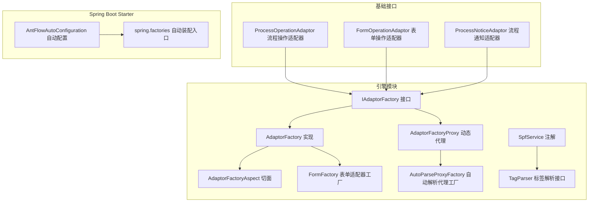
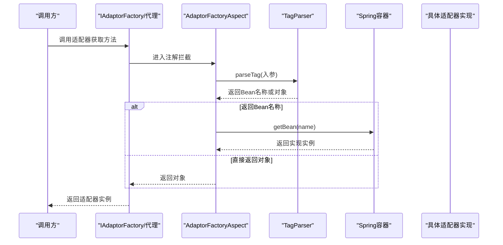
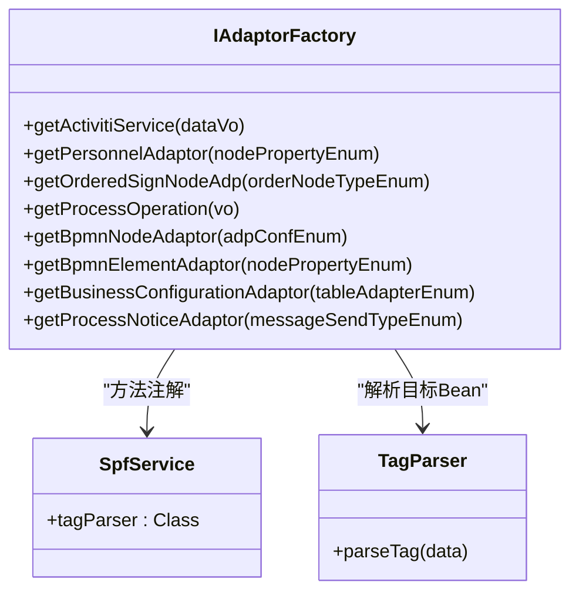
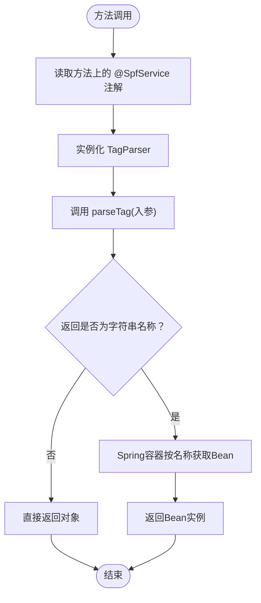
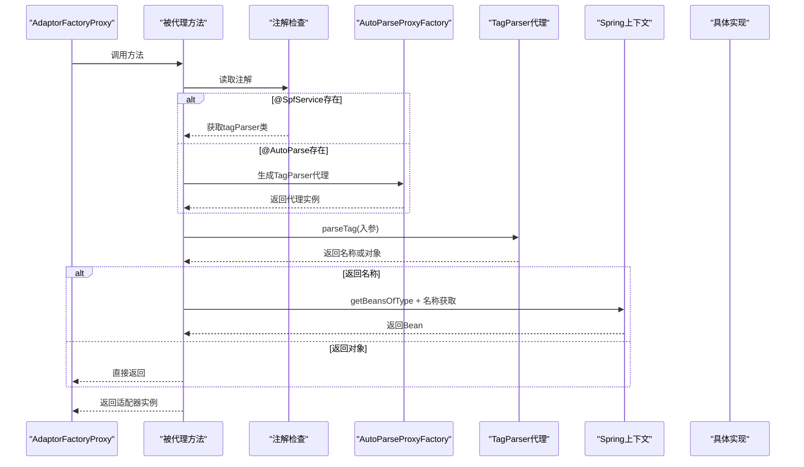
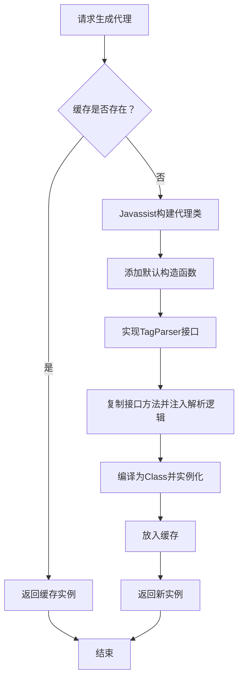
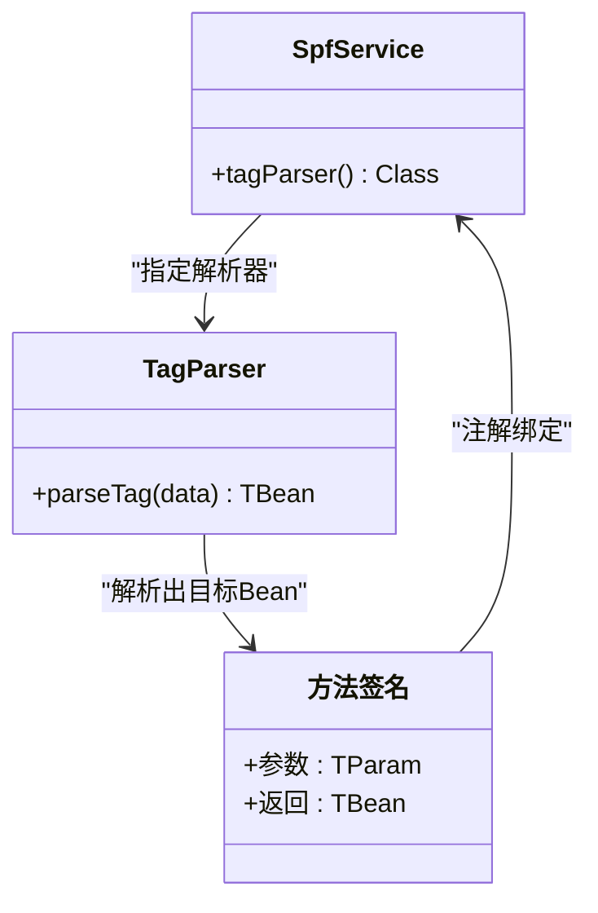
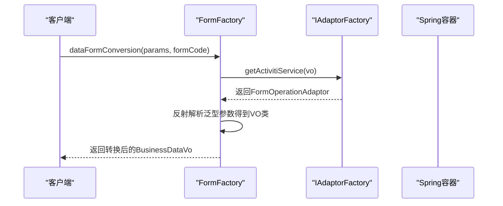
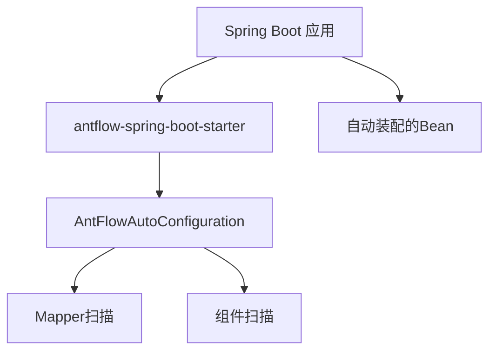
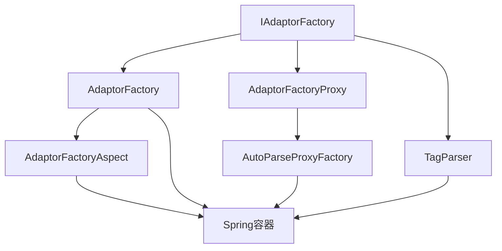

# 插件化架构设计

<cite>
**本文引用的文件**
- [AdaptorFactory.java](file://antflow-engine/src/main/java/org/openoa/engine/factory/AdaptorFactory.java)
- [IAdaptorFactory.java](file://antflow-engine/src/main/java/org/openoa/engine/factory/IAdaptorFactory.java)
- [AdaptorFactoryProxy.java](file://antflow-engine/src/main/java/org/openoa/engine/factory/AdaptorFactoryProxy.java)
- [AdaptorFactoryAspect.java](file://antflow-engine/src/main/java/org/openoa/engine/factory/AdaptorFactoryAspect.java)
- [AutoParseProxyFactory.java](file://antflow-engine/src/main/java/org/openoa/engine/factory/AutoParseProxyFactory.java)
- [SimpleProxyFactory.java](file://antflow-engine/src/main/java/org/openoa/engine/factory/SimpleProxyFactory.java)
- [SpfService.java](file://antflow-engine/src/main/java/org/openoa/engine/factory/SpfService.java)
- [TagParser.java](file://antflow-engine/src/main/java/org/openoa/engine/factory/TagParser.java)
- [FormFactory.java](file://antflow-engine/src/main/java/org/openoa/engine/factory/FormFactory.java)
- [AntFlowAutoConfiguration.java](file://antflow-spring-boot-starter/src/main/java/org/openoa/starter/config/AntFlowAutoConfiguration.java)
- [spring.factories](file://antflow-spring-boot-starter/src/main/resources/META-INF/spring.factories)
- [ProcessOperationAdaptor.java](file://antflow-base/src/main/java/org/openoa/base/interf/ProcessOperationAdaptor.java)
- [FormOperationAdaptor.java](file://antflow-base/src/main/java/org/openoa/base/interf/FormOperationAdaptor.java)
- [ProcessNoticeAdaptor.java](file://antflow-base/src/main/java/org/openoa/base/interf/ProcessNoticeAdaptor.java)
- [BpmnNodeAdaptor.java](file://antflow-engine/src/main/java/org/openoa/engine/bpmnconf/adp/bpmnnodeadp/BpmnNodeAdaptor.java)
- [AbstractBusinessConfigurationAdaptor.java](file://antflow-engine/src/main/java/org/openoa/engine/bpmnconf/adp/personneladp/AbstractBusinessConfigurationAdaptor.java)
- [ApprovedUsersPersonnelAdaptor.java](file://antflow-engine/src/main/java/org/openoa/engine/bpmnconf/adp/personneladp/ApprovedUsersPersonnelAdaptor.java)
- [DeppartmentLeaderPersonnelAdaptor.java](file://antflow-engine/src/main/java/org/openoa/engine/bpmnconf/adp/personneladp/DeppartmentLeaderPersonnelAdaptor.java)
- [DirectLeaderPersonnelAdaptor.java](file://antflow-engine/src/main/java/org/openoa/engine/bpmnconf/adp/personneladp/DirectLeaderPersonnelAdaptor.java)
- [FormRelatedPersonnelAdaptor.java](file://antflow-engine/src/main/java/org/openoa/engine/bpmnconf/adp/personneladp/FormRelatedPersonnelAdaptor.java)
- [HrbpPersonnelAdaptor.java](file://antflow-engine/src/main/java/org/openoa/engine/bpmnconf/adp/personneladp/HrbpPersonnelAdaptor.java)
- [LevelPersonnelAdaptor.java](file://antflow-engine/src/main/java/org/openoa/engine/bpmnconf/adp/personneladp/LevelPersonnelAdaptor.java)
- [LoopPersonnelAdaptor.java](file://antflow-engine/src/main/java/org/openoa/engine/bpmnconf/adp/personneladp/LoopPersonnelAdaptor.java)
</cite>

## 目录
1. [简介](#简介)
2. [项目结构](#项目结构)
3. [核心组件](#核心组件)
4. [架构总览](#架构总览)
5. [详细组件分析](#详细组件分析)
6. [依赖关系分析](#依赖关系分析)
7. [性能考虑](#性能考虑)
8. [故障排查指南](#故障排查指南)
9. [结论](#结论)
10. [附录](#附录)

## 简介
本指南围绕插件化架构设计，系统阐述适配器工厂的设计原理与实现模式，涵盖以下主题：
- 适配器工厂接口 IAdaptorFactory 的职责边界与扩展机制
- AdaptorFactory 的具体实现与注解驱动的自动装配
- 自动解析代理工厂 AutoParseProxyFactory 的工作原理
- 插件注册机制、基于注解的标签解析与 Spring Bean 容器集成
- Spring Boot Starter 的开发方法与自动装配配置
- 完整的插件化开发示例：自定义适配器实现、插件注册流程、配置管理策略
- 插件生命周期管理、依赖注入机制、版本兼容性处理
- 插件测试方法、性能监控与故障排查技巧

## 项目结构
该项目采用多模块结构，核心插件化能力集中在 antflow-engine 模块的 factory 包中，基础接口与适配器在 antflow-base 与 engine 子模块中定义，Spring Boot Starter 在 antflow-spring-boot-starter 中提供自动装配。

**图表来源**
- [IAdaptorFactory.java:28-52](file://antflow-engine/src/main/java/org/openoa/engine/factory/IAdaptorFactory.java#L28-L52)
- [AdaptorFactory.java:14-33](file://antflow-engine/src/main/java/org/openoa/engine/factory/AdaptorFactory.java#L14-L33)
- [AdaptorFactoryProxy.java:14-120](file://antflow-engine/src/main/java/org/openoa/engine/factory/AdaptorFactoryProxy.java#L14-L120)
- [AdaptorFactoryAspect.java:21-50](file://antflow-engine/src/main/java/org/openoa/engine/factory/AdaptorFactoryAspect.java#L21-L50)
- [AutoParseProxyFactory.java:19-111](file://antflow-engine/src/main/java/org/openoa/engine/factory/AutoParseProxyFactory.java#L19-L111)
- [SpfService.java:6-14](file://antflow-engine/src/main/java/org/openoa/engine/factory/SpfService.java#L6-L14)
- [TagParser.java:3-12](file://antflow-engine/src/main/java/org/openoa/engine/factory/TagParser.java#L3-L12)
- [FormFactory.java:42-62](file://antflow-engine/src/main/java/org/openoa/engine/factory/FormFactory.java#L42-L62)
- [AntFlowAutoConfiguration.java:8-18](file://antflow-spring-boot-starter/src/main/java/org/openoa/starter/config/AntFlowAutoConfiguration.java#L8-L18)
- [spring.factories:1-2](file://antflow-spring-boot-starter/src/main/resources/META-INF/spring.factories#L1-L2)

**章节来源**
- [IAdaptorFactory.java:21-52](file://antflow-engine/src/main/java/org/openoa/engine/factory/IAdaptorFactory.java#L21-L52)
- [AdaptorFactory.java:14-33](file://antflow-engine/src/main/java/org/openoa/engine/factory/AdaptorFactory.java#L14-L33)
- [AntFlowAutoConfiguration.java:8-18](file://antflow-spring-boot-starter/src/main/java/org/openoa/starter/config/AntFlowAutoConfiguration.java#L8-L18)

## 核心组件
- IAdaptorFactory：定义插件化适配器的统一工厂接口，声明各类适配器的获取方法，并通过注解指定标签解析器类型。
- AdaptorFactory：具体实现类，使用注解驱动的方式委托给 Spring 容器按标签解析结果选择合适的 Bean。
- AdaptorFactoryProxy：为 IAdaptorFactory 生成动态代理，结合 TagParser 与 Spring Bean 容器实现运行时解析与装配。
- AdaptorFactoryAspect：AOP 切面，拦截带有特定注解的方法调用，执行标签解析与 Bean 选择逻辑。
- AutoParseProxyFactory：用于生成“自动解析”类型的代理实例，按参数枚举值动态匹配实现 Bean。
- SpfService：标记注解，指示方法使用特定的 TagParser 进行标签解析。
- TagParser：标签解析接口，定义 parseTag 方法以从入参中提取目标 Bean 名称或直接返回目标对象。
- FormFactory：面向表单场景的适配器工厂，负责根据表单编码解析并返回对应的表单操作适配器。

**章节来源**
- [IAdaptorFactory.java:28-52](file://antflow-engine/src/main/java/org/openoa/engine/factory/IAdaptorFactory.java#L28-L52)
- [AdaptorFactory.java:14-33](file://antflow-engine/src/main/java/org/openoa/engine/factory/AdaptorFactory.java#L14-L33)
- [AdaptorFactoryProxy.java:14-120](file://antflow-engine/src/main/java/org/openoa/engine/factory/AdaptorFactoryProxy.java#L14-L120)
- [AdaptorFactoryAspect.java:21-50](file://antflow-engine/src/main/java/org/openoa/engine/factory/AdaptorFactoryAspect.java#L21-L50)
- [AutoParseProxyFactory.java:19-111](file://antflow-engine/src/main/java/org/openoa/engine/factory/AutoParseProxyFactory.java#L19-L111)
- [SpfService.java:6-14](file://antflow-engine/src/main/java/org/openoa/engine/factory/SpfService.java#L6-L14)
- [TagParser.java:3-12](file://antflow-engine/src/main/java/org/openoa/engine/factory/TagParser.java#L3-L12)
- [FormFactory.java:42-62](file://antflow-engine/src/main/java/org/openoa/engine/factory/FormFactory.java#L42-L62)

## 架构总览
下图展示了从调用方到适配器实例的完整链路：调用方通过 IAdaptorFactory 或其动态代理发起请求；切面根据注解解析标签；TagParser 将入参转换为目标 Bean 名称或直接返回对象；最终由 Spring 容器返回具体实现。

**图表来源**
- [AdaptorFactoryAspect.java:27-44](file://antflow-engine/src/main/java/org/openoa/engine/factory/AdaptorFactoryAspect.java#L27-L44)
- [AdaptorFactoryProxy.java:72-99](file://antflow-engine/src/main/java/org/openoa/engine/factory/AdaptorFactoryProxy.java#L72-L99)
- [TagParser.java:10-12](file://antflow-engine/src/main/java/org/openoa/engine/factory/TagParser.java#L10-L12)

## 详细组件分析

### 适配器工厂接口 IAdaptorFactory
- 职责：统一声明各类适配器的获取方法，包括流程操作、表单操作、人员配置、流程节点适配器等。
- 扩展机制：通过注解指定 TagParser 类型，实现“按标签选择实现”的插件化策略。
- 关键点：
  - 使用 @SpfService 标记方法，绑定特定 TagParser。
  - 提供 AutoParse 兼容方法，用于无需显式注解的自动解析场景。

**图表来源**
- [IAdaptorFactory.java:28-52](file://antflow-engine/src/main/java/org/openoa/engine/factory/IAdaptorFactory.java#L28-L52)
- [SpfService.java:12-14](file://antflow-engine/src/main/java/org/openoa/engine/factory/SpfService.java#L12-L14)
- [TagParser.java:10-12](file://antflow-engine/src/main/java/org/openoa/engine/factory/TagParser.java#L10-L12)

**章节来源**
- [IAdaptorFactory.java:28-52](file://antflow-engine/src/main/java/org/openoa/engine/factory/IAdaptorFactory.java#L28-L52)

### AdaptorFactory 实现与注解驱动装配
- 设计要点：
  - 通过 @SpfService 指定 TagParser，实现“按标签选择 Bean”的装配。
  - 方法参数作为 TagParser 的输入，返回值类型决定从容器中查找的 Bean 类型。
- 适用场景：当标签解析直接返回 Bean 名称时，由容器按名称获取；若解析直接返回对象，则直接返回。

**图表来源**
- [AdaptorFactory.java:17-31](file://antflow-engine/src/main/java/org/openoa/engine/factory/AdaptorFactory.java#L17-L31)
- [AdaptorFactoryAspect.java:27-44](file://antflow-engine/src/main/java/org/openoa/engine/factory/AdaptorFactoryAspect.java#L27-L44)

**章节来源**
- [AdaptorFactory.java:14-33](file://antflow-engine/src/main/java/org/openoa/engine/factory/AdaptorFactory.java#L14-L33)
- [AdaptorFactoryAspect.java:21-50](file://antflow-engine/src/main/java/org/openoa/engine/factory/AdaptorFactoryAspect.java#L21-L50)

### AdaptorFactoryProxy 动态代理
- 目标：为 IAdaptorFactory 生成运行时代理，使所有方法在调用时才进行标签解析与 Bean 选择。
- 工作流程：
  - 对每个方法检查注解：优先 @SpfService，否则回退到 @AutoParse。
  - 若为 @AutoParse，使用 AutoParseProxyFactory 生成 TagParser 代理。
  - 将 TagParser 注册到 Spring 上下文，再执行解析与 Bean 获取。
- 优势：延迟解析、统一入口、便于扩展新的解析策略。

**图表来源**
- [AdaptorFactoryProxy.java:64-104](file://antflow-engine/src/main/java/org/openoa/engine/factory/AdaptorFactoryProxy.java#L64-L104)
- [AutoParseProxyFactory.java:29-41](file://antflow-engine/src/main/java/org/openoa/engine/factory/AutoParseProxyFactory.java#L29-L41)

**章节来源**
- [AdaptorFactoryProxy.java:14-120](file://antflow-engine/src/main/java/org/openoa/engine/factory/AdaptorFactoryProxy.java#L14-L120)
- [AutoParseProxyFactory.java:19-111](file://antflow-engine/src/main/java/org/openoa/engine/factory/AutoParseProxyFactory.java#L19-L111)

### AutoParseProxyFactory 自动解析代理工厂
- 目标：为“无 @SpfService 标记但带 @AutoParse”的方法生成 TagParser 代理。
- 实现方式：Javassist 动态生成实现 TagParser 接口的类，方法体内部遍历 Spring 容器中的实现，依据 isSupportBusinessObject 判断匹配。
- 关键点：缓存已生成实例，避免重复字节码生成；签名保留泛型信息。

**图表来源**
- [AutoParseProxyFactory.java:29-105](file://antflow-engine/src/main/java/org/openoa/engine/factory/AutoParseProxyFactory.java#L29-L105)

**章节来源**
- [AutoParseProxyFactory.java:19-111](file://antflow-engine/src/main/java/org/openoa/engine/factory/AutoParseProxyFactory.java#L19-L111)

### TagParser 与 SpfService 注解
- TagParser：定义 parseTag 方法，输入为方法参数类型，输出可为 Bean 名称或直接对象。
- SpfService：标记方法使用特定 TagParser，简化工厂方法的解析策略配置。

**图表来源**
- [SpfService.java:12-14](file://antflow-engine/src/main/java/org/openoa/engine/factory/SpfService.java#L12-L14)
- [TagParser.java:10-12](file://antflow-engine/src/main/java/org/openoa/engine/factory/TagParser.java#L10-L12)

**章节来源**
- [SpfService.java:6-14](file://antflow-engine/src/main/java/org/openoa/engine/factory/SpfService.java#L6-L14)
- [TagParser.java:3-12](file://antflow-engine/src/main/java/org/openoa/engine/factory/TagParser.java#L3-L12)

### FormFactory 表单适配器工厂
- 职责：根据表单编码解析并返回对应的表单操作适配器；支持外部访问流程与低代码流程的数据转换。
- 关键流程：
  - 通过 IAdaptorFactory 获取表单适配器。
  - 从适配器反射获取其泛型参数中的业务数据 VO 类型。
  - 将请求参数转换为对应 VO 并返回。

**图表来源**
- [FormFactory.java:50-123](file://antflow-engine/src/main/java/org/openoa/engine/factory/FormFactory.java#L50-L123)

**章节来源**
- [FormFactory.java:42-158](file://antflow-engine/src/main/java/org/openoa/engine/factory/FormFactory.java#L42-L158)

### Spring Boot Starter 开发方法
- 自动配置：AntFlowAutoConfiguration 使用 @MapperScans 与 @ComponentScan 扫描 Mapper 与业务组件。
- 自动装配入口：spring.factories 指定 EnableAutoConfiguration 为 AntFlowAutoConfiguration。
- 使用方式：在应用中引入 starter 依赖后，即可启用自动扫描与装配。

**图表来源**
- [AntFlowAutoConfiguration.java:8-18](file://antflow-spring-boot-starter/src/main/java/org/openoa/starter/config/AntFlowAutoConfiguration.java#L8-L18)
- [spring.factories:1-2](file://antflow-spring-boot-starter/src/main/resources/META-INF/spring.factories#L1-L2)

**章节来源**
- [AntFlowAutoConfiguration.java:8-18](file://antflow-spring-boot-starter/src/main/java/org/openoa/starter/config/AntFlowAutoConfiguration.java#L8-L18)
- [spring.factories:1-2](file://antflow-spring-boot-starter/src/main/resources/META-INF/spring.factories#L1-L2)

### 插件注册机制与生命周期
- 注册方式：
  - 通过 Spring 容器注册具体适配器实现为 Bean。
  - 对于需要自动解析的方法，确保实现类实现相应的接口（如 AdaptorService）以便匹配。
- 生命周期：
  - 适配器实现由 Spring 管理，默认单例。
  - 动态代理与字节码生成仅在首次调用时发生，后续复用缓存实例。
- 版本兼容性：
  - 通过接口契约与注解驱动，降低实现变更对调用方的影响。
  - 泛型与反射解析增强扩展灵活性。

**章节来源**
- [AdaptorFactoryProxy.java:89-99](file://antflow-engine/src/main/java/org/openoa/engine/factory/AdaptorFactoryProxy.java#L89-L99)
- [AutoParseProxyFactory.java:80-93](file://antflow-engine/src/main/java/org/openoa/engine/factory/AutoParseProxyFactory.java#L80-L93)

### 插件开发示例（步骤）
- 步骤一：定义适配器接口
  - 参考基础接口：流程操作适配器、表单操作适配器、流程通知适配器等。
- 步骤二：实现适配器
  - 示例实现：部门领导人员适配器、直接上级人员适配器、HRBP人员适配器、级别人员适配器等。
- 步骤三：在 IAdaptorFactory 中声明方法
  - 使用 @SpfService 指定 TagParser，或使用 @AutoParse 支持自动解析。
- 步骤四：注册到 Spring 容器
  - 通过 @Component 或其他方式让 Spring 管理实现 Bean。
- 步骤五：配置与测试
  - 启动应用，验证自动装配与适配器解析是否正常。

**章节来源**
- [ProcessOperationAdaptor.java](file://antflow-base/src/main/java/org/openoa/base/interf/ProcessOperationAdaptor.java)
- [FormOperationAdaptor.java](file://antflow-base/src/main/java/org/openoa/base/interf/FormOperationAdaptor.java)
- [ProcessNoticeAdaptor.java](file://antflow-base/src/main/java/org/openoa/base/interf/ProcessNoticeAdaptor.java)
- [DeppartmentLeaderPersonnelAdaptor.java](file://antflow-engine/src/main/java/org/openoa/engine/bpmnconf/adp/personneladp/DeppartmentLeaderPersonnelAdaptor.java)
- [DirectLeaderPersonnelAdaptor.java](file://antflow-engine/src/main/java/org/openoa/engine/bpmnconf/adp/personneladp/DirectLeaderPersonnelAdaptor.java)
- [HrbpPersonnelAdaptor.java](file://antflow-engine/src/main/java/org/openoa/engine/bpmnconf/adp/personneladp/HrbpPersonnelAdaptor.java)
- [LevelPersonnelAdaptor.java](file://antflow-engine/src/main/java/org/openoa/engine/bpmnconf/adp/personneladp/LevelPersonnelAdaptor.java)
- [LoopPersonnelAdaptor.java](file://antflow-engine/src/main/java/org/openoa/engine/bpmnconf/adp/personneladp/LoopPersonnelAdaptor.java)

## 依赖关系分析
- 组件耦合：
  - IAdaptorFactory 与具体实现解耦，通过注解与 TagParser 解耦。
  - AdaptorFactoryProxy 与 AutoParseProxyFactory 通过 TagParser 抽象耦合。
- 外部依赖：
  - Spring 容器：Bean 管理与依赖注入。
  - Javassist：动态字节码生成。
  - AOP：基于注解的切面拦截。

**图表来源**
- [IAdaptorFactory.java:28-52](file://antflow-engine/src/main/java/org/openoa/engine/factory/IAdaptorFactory.java#L28-L52)
- [AdaptorFactory.java:14-33](file://antflow-engine/src/main/java/org/openoa/engine/factory/AdaptorFactory.java#L14-L33)
- [AdaptorFactoryProxy.java:14-120](file://antflow-engine/src/main/java/org/openoa/engine/factory/AdaptorFactoryProxy.java#L14-L120)
- [AutoParseProxyFactory.java:19-111](file://antflow-engine/src/main/java/org/openoa/engine/factory/AutoParseProxyFactory.java#L19-L111)
- [AdaptorFactoryAspect.java:21-50](file://antflow-engine/src/main/java/org/openoa/engine/factory/AdaptorFactoryAspect.java#L21-L50)

**章节来源**
- [IAdaptorFactory.java:28-52](file://antflow-engine/src/main/java/org/openoa/engine/factory/IAdaptorFactory.java#L28-L52)
- [AdaptorFactory.java:14-33](file://antflow-engine/src/main/java/org/openoa/engine/factory/AdaptorFactory.java#L14-L33)
- [AdaptorFactoryProxy.java:14-120](file://antflow-engine/src/main/java/org/openoa/engine/factory/AdaptorFactoryProxy.java#L14-L120)
- [AutoParseProxyFactory.java:19-111](file://antflow-engine/src/main/java/org/openoa/engine/factory/AutoParseProxyFactory.java#L19-L111)
- [AdaptorFactoryAspect.java:21-50](file://antflow-engine/src/main/java/org/openoa/engine/factory/AdaptorFactoryAspect.java#L21-L50)

## 性能考虑
- 动态代理与字节码生成：
  - 首次调用时进行字节码生成与类加载，后续复用缓存实例，避免重复开销。
- Spring 容器查询：
  - 通过 getBeansOfType + 名称匹配，建议合理命名 Bean 以减少遍历成本。
- 日志与调试：
  - 动态代理与切面中包含调试输出，生产环境应关闭或降级日志级别。

[本节为通用指导，不涉及具体文件分析]

## 故障排查指南
- 常见问题与定位：
  - 无法找到适配器实现：检查 @SpfService 的 tagParser 是否正确，以及返回的 Bean 名称是否与容器中的 Bean 名一致。
  - 自动解析失败：确认实现类是否实现相应接口且满足 isSupportBusinessObject 的判断条件。
  - 表单适配器解析异常：检查泛型参数是否正确设置，确保 FormFactory 能够反射解析到正确的 VO 类型。
- 建议排查步骤：
  - 启用调试日志，观察 TagParser 的解析结果与 Spring 容器的 Bean 获取过程。
  - 验证 Spring Boot Starter 是否正确生效，确认自动扫描路径与 Mapper 扫描范围。
  - 对比不同版本的 TagParser 实现，确保兼容性。

**章节来源**
- [AdaptorFactoryAspect.java:27-44](file://antflow-engine/src/main/java/org/openoa/engine/factory/AdaptorFactoryAspect.java#L27-L44)
- [AdaptorFactoryProxy.java:72-99](file://antflow-engine/src/main/java/org/openoa/engine/factory/AdaptorFactoryProxy.java#L72-L99)
- [FormFactory.java:124-152](file://antflow-engine/src/main/java/org/openoa/engine/factory/FormFactory.java#L124-L152)

## 结论
该插件化架构通过“接口 + 注解 + TagParser + Spring 容器”的组合，实现了高度灵活的适配器选择与装配机制。AdaptorFactoryProxy 与 AutoParseProxyFactory 提供了强大的动态解析能力，配合 Spring Boot Starter 实现零配置接入。在实际工程中，建议：
- 明确接口契约与注解使用规范，确保扩展一致性。
- 合理组织实现类命名与包结构，提升可维护性。
- 在生产环境优化日志与缓存策略，保障性能与稳定性。

[本节为总结性内容，不涉及具体文件分析]

## 附录
- 相关接口参考：
  - 流程操作适配器接口
  - 表单操作适配器接口
  - 流程通知适配器接口
- 典型适配器实现参考：
  - 部门领导人员适配器
  - 直属上级人员适配器
  - HRBP 人员适配器
  - 级别人员适配器
  - 循环会签人员适配器

**章节来源**
- [ProcessOperationAdaptor.java](file://antflow-base/src/main/java/org/openoa/base/interf/ProcessOperationAdaptor.java)
- [FormOperationAdaptor.java](file://antflow-base/src/main/java/org/openoa/base/interf/FormOperationAdaptor.java)
- [ProcessNoticeAdaptor.java](file://antflow-base/src/main/java/org/openoa/base/interf/ProcessNoticeAdaptor.java)
- [DeppartmentLeaderPersonnelAdaptor.java](file://antflow-engine/src/main/java/org/openoa/engine/bpmnconf/adp/personneladp/DeppartmentLeaderPersonnelAdaptor.java)
- [DirectLeaderPersonnelAdaptor.java](file://antflow-engine/src/main/java/org/openoa/engine/bpmnconf/adp/personneladp/DirectLeaderPersonnelAdaptor.java)
- [HrbpPersonnelAdaptor.java](file://antflow-engine/src/main/java/org/openoa/engine/bpmnconf/adp/personneladp/HrbpPersonnelAdaptor.java)
- [LevelPersonnelAdaptor.java](file://antflow-engine/src/main/java/org/openoa/engine/bpmnconf/adp/personneladp/LevelPersonnelAdaptor.java)
- [LoopPersonnelAdaptor.java](file://antflow-engine/src/main/java/org/openoa/engine/bpmnconf/adp/personneladp/LoopPersonnelAdaptor.java)