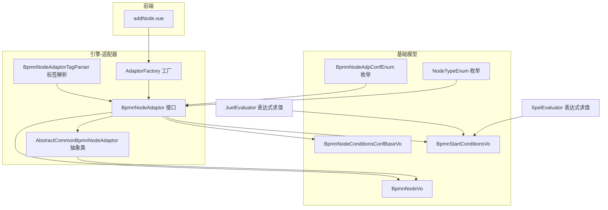
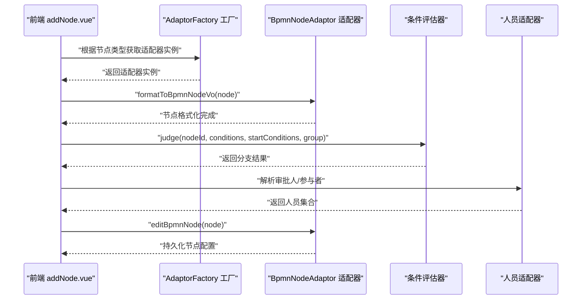
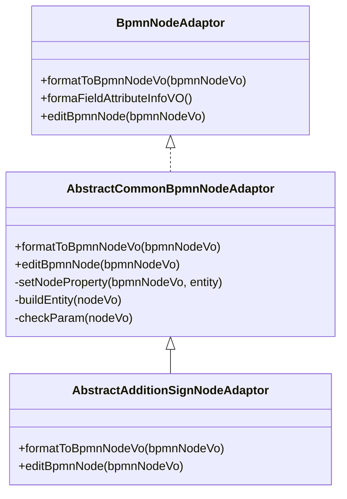
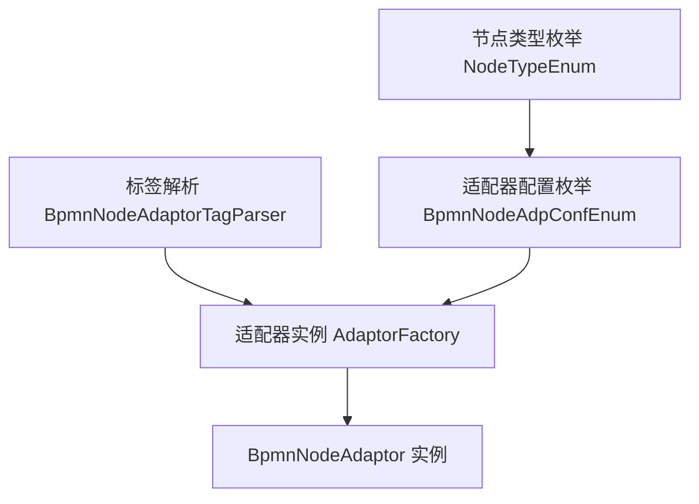
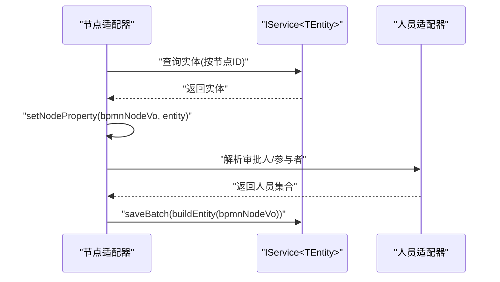
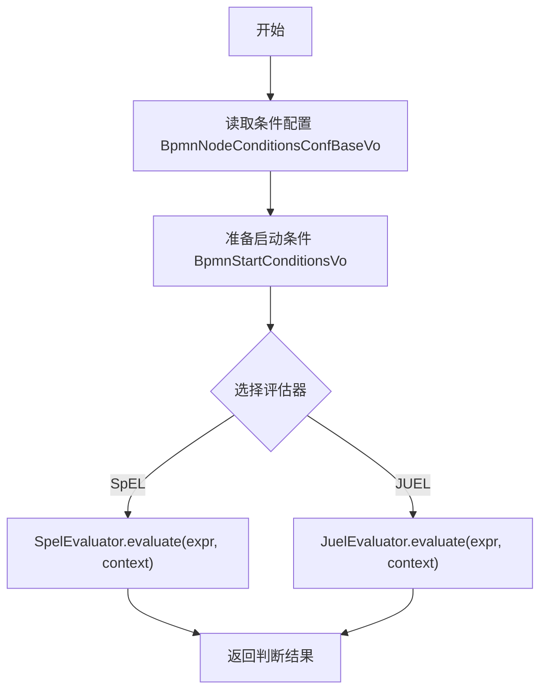
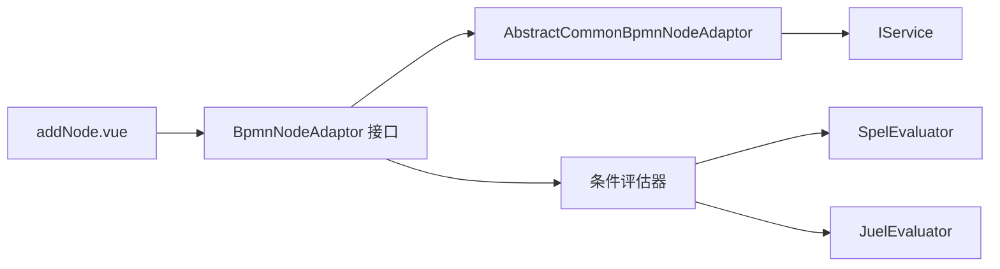

# 自定义节点开发

<cite>
**本文引用的文件**
- [BpmnNodeAdaptor.java](file://antflow-engine/src/main/java/org/openoa/engine/bpmnconf/adp/bpmnnodeadp/BpmnNodeAdaptor.java)
- [AbstractCommonBpmnNodeAdaptor.java](file://antflow-engine/src/main/java/org/openoa/engine/bpmnconf/adp/bpmnnodeadp/AbstractCommonBpmnNodeAdaptor.java)
- [AbstractAdditionSignNodeAdaptor.java](file://antflow-engine/src/main/java/org/openoa/engine/bpmnconf/adp/bpmnnodeadp/AbstractAdditionSignNodeAdaptor.java)
- [BpmnNodeAdpConfEnum.java](file://antflow-engine/src/main/java/org/openoa/engine/bpmnconf/constant/enus/BpmnNodeAdpConfEnum.java)
- [NodeTypeEnum.java](file://antflow-base/src/main/java/org/openoa/base/constant/enums/NodeTypeEnum.java)
- [BpmnNodeConditionsAdaptor.java](file://antflow-engine/src/main/java/org/openoa/engine/bpmnconf/adp/conditionfilter/nodetypeconditions/BpmnNodeConditionsAdaptor.java)
- [BpmnNodeConditionsEmptyAdp.java](file://antflow-engine/src/main/java/org/openoa/engine/bpmnconf/adp/conditionfilter/nodetypeconditions/BpmnNodeConditionsEmptyAdp.java)
- [SpelExpressionConditionJudge.java](file://antflow-engine/src/main/java/org/openoa/engine/bpmnconf/adp/conditionfilter/conditionjudge/SpelExpressionConditionJudge.java)
- [JuelExpressionConditionJudge.java](file://antflow-engine/src/main/java/org/openoa/engine/bpmnconf/adp/conditionfilter/conditionjudge/JuelExpressionConditionJudge.java)
- [ApprovedUsersPersonnelAdaptor.java](file://antflow-engine/src/main/java/org/openoa/engine/bpmnconf/adp/personneladp/ApprovedUsersPersonnelAdaptor.java)
- [DeppartmentLeaderPersonnelAdaptor.java](file://antflow-engine/src/main/java/org/openoa/engine/bpmnconf/adp/personneladp/DeppartmentLeaderPersonnelAdaptor.java)
- [DirectLeaderPersonnelAdaptor.java](file://antflow-engine/src/main/java/org/openoa/engine/bpmnconf/adp/personneladp/DirectLeaderPersonnelAdaptor.java)
- [HrbpPersonnelAdaptor.java](file://antflow-engine/src/main/java/org/openoa/engine/bpmnconf/adp/personneladp/HrbpPersonnelAdaptor.java)
- [FormRelatedPersonnelAdaptor.java](file://antflow-engine/src/main/java/org/openoa/engine/bpmnconf/adp/personneladp/FormRelatedPersonnelAdaptor.java)
- [BusinessTablePersonnelAdaptor.java](file://antflow-engine/src/main/java/org/openoa/engine/bpmnconf/adp/personneladp/BusinessTablePersonnelAdaptor.java)
- [AdaptorFactory.java](file://antflow-engine/src/main/java/org/openoa/engine/factory/AdaptorFactory.java)
- [AdaptorFactoryAspect.java](file://antflow-engine/src/main/java/org/openoa/engine/factory/AdaptorFactoryAspect.java)
- [AdaptorFactoryProxy.java](file://antflow-engine/src/main/java/org/openoa/engine/factory/AdaptorFactoryProxy.java)
- [AutoParseProxyFactory.java](file://antflow-engine/src/main/java/org/openoa/engine/factory/AutoParseProxyFactory.java)
- [SimpleProxyFactory.java](file://antflow-engine/src/main/java/org/openoa/engine/factory/SimpleProxyFactory.java)
- [IAdaptorFactory.java](file://antflow-engine/src/main/java/org/openoa/engine/factory/IAdaptorFactory.java)
- [BpmnNodeAdaptorTagParser.java](file://antflow-engine/src/main/java/org/openoa/engine/bpmnconf/service/tagparser/BpmnNodeAdaptorTagParser.java)
- [BpmnNodeVo.java](file://antflow-base/src/main/java/org/openoa/base/vo/BpmnNodeVo.java)
- [PersonnelRuleVO.java](file://antflow-base/src/main/java/org/openoa/base/vo/PersonnelRuleVO.java)
- [BpmnNodeConditionsConfBaseVo.java](file://antflow-base/src/main/java/org/openoa/base/vo/BpmnNodeConditionsConfBaseVo.java)
- [BpmnStartConditionsVo.java](file://antflow-base/src/main/java/org/openoa/base/vo/BpmnStartConditionsVo.java)
- [SpelEvaluator.java](file://antflow-engine/src/main/java/org/openoa/engine/utils/SpelEvaluator.java)
- [JuelEvaluator.java](file://antflow-engine/src/main/java/org/openoa/engine/utils/JuelEvaluator.java)
- [addNode.vue](file://antflow-vue/src/components/Workflow/addNode.vue)
</cite>

## 目录
1. [简介](#简介)
2. [项目结构](#项目结构)
3. [核心组件](#核心组件)
4. [架构总览](#架构总览)
5. [详细组件分析](#详细组件分析)
6. [依赖关系分析](#依赖关系分析)
7. [性能考虑](#性能考虑)
8. [故障排查指南](#故障排查指南)
9. [结论](#结论)
10. [附录](#附录)

## 简介
本指南面向需要在 AntFlow 流程引擎中开发“自定义节点”的工程师，系统讲解节点适配器的设计原理与实现模式，覆盖以下主题：
- 节点适配器接口与抽象基类的职责边界
- 节点类型注册机制与标签解析
- 节点属性配置方式与人员适配器集成
- 条件评估器的开发流程与表达式求值
- 完整的自定义节点开发示例（含节点适配器、条件判断、人员适配器）
- 生命周期管理、错误处理与性能优化策略
- 节点测试方法与调试技巧

## 项目结构
AntFlow 将“节点适配器”作为可插拔扩展点，通过工厂与标签解析机制完成节点类型的动态注册与调用。核心位置如下：
- 引擎层适配器接口与实现：antflow-engine/src/main/java/org/openoa/engine/bpmnconf/adp/
- 基础模型与枚举：antflow-base/src/main/java/org/openoa/base/
- 前端节点添加入口：antflow-vue/src/components/Workflow/addNode.vue

图表来源
- [BpmnNodeAdaptor.java:1-30](file://antflow-engine/src/main/java/org/openoa/engine/bpmnconf/adp/bpmnnodeadp/BpmnNodeAdaptor.java#L1-L30)
- [AbstractCommonBpmnNodeAdaptor.java:1-47](file://antflow-engine/src/main/java/org/openoa/engine/bpmnconf/adp/bpmnnodeadp/AbstractCommonBpmnNodeAdaptor.java#L1-L47)
- [AdaptorFactory.java](file://antflow-engine/src/main/java/org/openoa/engine/factory/AdaptorFactory.java)
- [BpmnNodeAdaptorTagParser.java](file://antflow-engine/src/main/java/org/openoa/engine/bpmnconf/service/tagparser/BpmnNodeAdaptorTagParser.java)
- [BpmnNodeVo.java](file://antflow-base/src/main/java/org/openoa/base/vo/BpmnNodeVo.java)
- [BpmnNodeConditionsConfBaseVo.java](file://antflow-base/src/main/java/org/openoa/base/vo/BpmnNodeConditionsConfBaseVo.java)
- [BpmnStartConditionsVo.java](file://antflow-base/src/main/java/org/openoa/base/vo/BpmnStartConditionsVo.java)
- [NodeTypeEnum.java:1-62](file://antflow-base/src/main/java/org/openoa/base/constant/enums/NodeTypeEnum.java#L1-L62)
- [BpmnNodeAdpConfEnum.java:1-66](file://antflow-engine/src/main/java/org/openoa/engine/bpmnconf/constant/enus/BpmnNodeAdpConfEnum.java#L1-L66)
- [SpelEvaluator.java](file://antflow-engine/src/main/java/org/openoa/engine/utils/SpelEvaluator.java)
- [JuelEvaluator.java](file://antflow-engine/src/main/java/org/openoa/engine/utils/JuelEvaluator.java)

章节来源
- [BpmnNodeAdaptor.java:1-30](file://antflow-engine/src/main/java/org/openoa/engine/bpmnconf/adp/bpmnnodeadp/BpmnNodeAdaptor.java#L1-L30)
- [AbstractCommonBpmnNodeAdaptor.java:1-47](file://antflow-engine/src/main/java/org/openoa/engine/bpmnconf/adp/bpmnnodeadp/AbstractCommonBpmnNodeAdaptor.java#L1-L47)
- [BpmnNodeAdpConfEnum.java:1-66](file://antflow-engine/src/main/java/org/openoa/engine/bpmnconf/constant/enus/BpmnNodeAdpConfEnum.java#L1-L66)
- [NodeTypeEnum.java:1-62](file://antflow-base/src/main/java/org/openoa/base/constant/enums/NodeTypeEnum.java#L1-L62)
- [addNode.vue:92-145](file://antflow-vue/src/components/Workflow/addNode.vue#L92-L145)

## 核心组件
- 节点适配器接口与职责
  - BpmnNodeAdaptor：定义节点格式化、字段属性信息、编辑节点等扩展点，统一适配器服务接口。
  - AbstractCommonBpmnNodeAdaptor：封装“查询实体—设置节点属性—保存实体”的通用流程，简化实现。
  - AbstractAdditionSignNodeAdaptor：为附加签名类节点提供通用能力（如批量保存、参数校验等）。

- 节点类型与属性枚举
  - NodeTypeEnum：定义节点类型（如条件节点、审批人节点、抄送节点等），并标注是否具有属性表。
  - BpmnNodeAdpConfEnum：将节点属性与节点类型映射为适配器配置枚举，便于统一检索与筛选。

- 条件评估器
  - ConditionJudge 接口及其实现（SpelExpressionConditionJudge、JuelExpressionConditionJudge）：负责根据表达式与启动条件判断分支走向。

- 人员适配器
  - ApprovedUsersPersonnelAdaptor、DeppartmentLeaderPersonnelAdaptor、DirectLeaderPersonnelAdaptor、HrbpPersonnelAdaptor、FormRelatedPersonnelAdaptor、BusinessTablePersonnelAdaptor 等：用于从不同来源解析审批人或参与者。

章节来源
- [BpmnNodeAdaptor.java:1-30](file://antflow-engine/src/main/java/org/openoa/engine/bpmnconf/adp/bpmnnodeadp/BpmnNodeAdaptor.java#L1-L30)
- [AbstractCommonBpmnNodeAdaptor.java:1-47](file://antflow-engine/src/main/java/org/openoa/engine/bpmnconf/adp/bpmnnodeadp/AbstractCommonBpmnNodeAdaptor.java#L1-L47)
- [NodeTypeEnum.java:1-62](file://antflow-base/src/main/java/org/openoa/base/constant/enums/NodeTypeEnum.java#L1-L62)
- [BpmnNodeAdpConfEnum.java:1-66](file://antflow-engine/src/main/java/org/openoa/engine/bpmnconf/constant/enus/BpmnNodeAdpConfEnum.java#L1-L66)
- [SpelExpressionConditionJudge.java:1-16](file://antflow-engine/src/main/java/org/openoa/engine/bpmnconf/adp/conditionfilter/conditionjudge/SpelExpressionConditionJudge.java#L1-L16)
- [JuelExpressionConditionJudge.java:1-16](file://antflow-engine/src/main/java/org/openoa/engine/bpmnconf/adp/conditionfilter/conditionjudge/JuelExpressionConditionJudge.java#L1-L16)
- [ApprovedUsersPersonnelAdaptor.java](file://antflow-engine/src/main/java/org/openoa/engine/bpmnconf/adp/personneladp/ApprovedUsersPersonnelAdaptor.java)
- [DeppartmentLeaderPersonnelAdaptor.java](file://antflow-engine/src/main/java/org/openoa/engine/bpmnconf/adp/personneladp/DeppartmentLeaderPersonnelAdaptor.java)
- [DirectLeaderPersonnelAdaptor.java](file://antflow-engine/src/main/java/org/openoa/engine/bpmnconf/adp/personneladp/DirectLeaderPersonnelAdaptor.java)
- [HrbpPersonnelAdaptor.java](file://antflow-engine/src/main/java/org/openoa/engine/bpmnconf/adp/personneladp/HrbpPersonnelAdaptor.java)
- [FormRelatedPersonnelAdaptor.java](file://antflow-engine/src/main/java/org/openoa/engine/bpmnconf/adp/personneladp/FormRelatedPersonnelAdaptor.java)
- [BusinessTablePersonnelAdaptor.java](file://antflow-engine/src/main/java/org/openoa/engine/bpmnconf/adp/personneladp/BusinessTablePersonnelAdaptor.java)

## 架构总览
下图展示“前端触发—工厂解析—适配器执行—条件评估—人员解析”的关键链路。

图表来源
- [addNode.vue:92-145](file://antflow-vue/src/components/Workflow/addNode.vue#L92-L145)
- [AdaptorFactory.java](file://antflow-engine/src/main/java/org/openoa/engine/factory/AdaptorFactory.java)
- [BpmnNodeAdaptor.java:1-30](file://antflow-engine/src/main/java/org/openoa/engine/bpmnconf/adp/bpmnnodeadp/BpmnNodeAdaptor.java#L1-L30)
- [SpelExpressionConditionJudge.java:1-16](file://antflow-engine/src/main/java/org/openoa/engine/bpmnconf/adp/conditionfilter/conditionjudge/SpelExpressionConditionJudge.java#L1-L16)
- [JuelExpressionConditionJudge.java:1-16](file://antflow-engine/src/main/java/org/openoa/engine/bpmnconf/adp/conditionfilter/conditionjudge/JuelExpressionConditionJudge.java#L1-L16)

## 详细组件分析

### 节点适配器接口与实现模式
- 接口职责
  - formatToBpmnNodeVo：将节点配置格式化为 BpmnNodeVo，供前端渲染与后续流程使用。
  - formaFieldAttributeInfoVO：预留字段属性信息转换（当前注释为暂未使用）。
  - editBpmnNode：编辑节点时的持久化逻辑，通常配合 AbstractCommonBpmnNodeAdaptor 执行保存。

- 抽象实现要点
  - AbstractCommonBpmnNodeAdaptor 统一封装了“查询实体—设置节点属性—保存实体”的流程，减少重复代码。
  - 子类只需实现 setNodeProperty、buildEntity、checkParam 三个方法，即可完成节点属性与配置的读写。

图表来源
- [BpmnNodeAdaptor.java:1-30](file://antflow-engine/src/main/java/org/openoa/engine/bpmnconf/adp/bpmnnodeadp/BpmnNodeAdaptor.java#L1-L30)
- [AbstractCommonBpmnNodeAdaptor.java:1-47](file://antflow-engine/src/main/java/org/openoa/engine/bpmnconf/adp/bpmnnodeadp/AbstractCommonBpmnNodeAdaptor.java#L1-L47)
- [AbstractAdditionSignNodeAdaptor.java](file://antflow-engine/src/main/java/org/openoa/engine/bpmnconf/adp/bpmnnodeadp/AbstractAdditionSignNodeAdaptor.java)

章节来源
- [BpmnNodeAdaptor.java:1-30](file://antflow-engine/src/main/java/org/openoa/engine/bpmnconf/adp/bpmnnodeadp/BpmnNodeAdaptor.java#L1-L30)
- [AbstractCommonBpmnNodeAdaptor.java:1-47](file://antflow-engine/src/main/java/org/openoa/engine/bpmnconf/adp/bpmnnodeadp/AbstractCommonBpmnNodeAdaptor.java#L1-L47)

### 节点类型注册机制与标签解析
- 节点类型枚举
  - NodeTypeEnum 定义了节点类型与“是否具有属性表”的标记，用于区分需要额外配置表的节点类型。
- 适配器配置枚举
  - BpmnNodeAdpConfEnum 将节点属性与节点类型映射为适配器配置枚举，便于统一检索与筛选。
- 标签解析
  - BpmnNodeAdaptorTagParser 通过标签解析机制，将节点类型与适配器实现进行绑定，实现运行时动态加载。

图表来源
- [NodeTypeEnum.java:1-62](file://antflow-base/src/main/java/org/openoa/base/constant/enums/NodeTypeEnum.java#L1-L62)
- [BpmnNodeAdpConfEnum.java:1-66](file://antflow-engine/src/main/java/org/openoa/engine/bpmnconf/constant/enus/BpmnNodeAdpConfEnum.java#L1-L66)
- [BpmnNodeAdaptorTagParser.java](file://antflow-engine/src/main/java/org/openoa/engine/bpmnconf/service/tagparser/BpmnNodeAdaptorTagParser.java)

章节来源
- [NodeTypeEnum.java:1-62](file://antflow-base/src/main/java/org/openoa/base/constant/enums/NodeTypeEnum.java#L1-L62)
- [BpmnNodeAdpConfEnum.java:1-66](file://antflow-engine/src/main/java/org/openoa/engine/bpmnconf/constant/enus/BpmnNodeAdpConfEnum.java#L1-L66)
- [BpmnNodeAdaptorTagParser.java](file://antflow-engine/src/main/java/org/openoa/engine/bpmnconf/service/tagparser/BpmnNodeAdaptorTagParser.java)

### 节点属性配置方式与人员适配器集成
- 属性配置
  - 对于需要属性表的节点类型，AbstractCommonBpmnNodeAdaptor 在 formatToBpmnNodeVo 中查询实体并调用 setNodeProperty 写入 BpmnNodeVo；在 editBpmnNode 中构建实体并通过 IService 批量保存。
- 人员适配器
  - 提供多种人员来源解析器，如“已审批用户”“部门领导”“直接上级”“HRBP”“表单关联用户”“业务表字段”等，按需组合以满足复杂审批规则。

图表来源
- [AbstractCommonBpmnNodeAdaptor.java:20-47](file://antflow-engine/src/main/java/org/openoa/engine/bpmnconf/adp/bpmnnodeadp/AbstractCommonBpmnNodeAdaptor.java#L20-L47)
- [ApprovedUsersPersonnelAdaptor.java](file://antflow-engine/src/main/java/org/openoa/engine/bpmnconf/adp/personneladp/ApprovedUsersPersonnelAdaptor.java)
- [DeppartmentLeaderPersonnelAdaptor.java](file://antflow-engine/src/main/java/org/openoa/engine/bpmnconf/adp/personneladp/DeppartmentLeaderPersonnelAdaptor.java)
- [DirectLeaderPersonnelAdaptor.java](file://antflow-engine/src/main/java/org/openoa/engine/bpmnconf/adp/personneladp/DirectLeaderPersonnelAdaptor.java)
- [HrbpPersonnelAdaptor.java](file://antflow-engine/src/main/java/org/openoa/engine/bpmnconf/adp/personneladp/HrbpPersonnelAdaptor.java)
- [FormRelatedPersonnelAdaptor.java](file://antflow-engine/src/main/java/org/openoa/engine/bpmnconf/adp/personneladp/FormRelatedPersonnelAdaptor.java)
- [BusinessTablePersonnelAdaptor.java](file://antflow-engine/src/main/java/org/openoa/engine/bpmnconf/adp/personneladp/BusinessTablePersonnelAdaptor.java)

章节来源
- [AbstractCommonBpmnNodeAdaptor.java:1-47](file://antflow-engine/src/main/java/org/openoa/engine/bpmnconf/adp/bpmnnodeadp/AbstractCommonBpmnNodeAdaptor.java#L1-L47)

### 条件评估器的开发流程
- 接口与实现
  - ConditionJudge：定义 judge 方法，接收节点ID、条件配置、启动条件与分组，返回布尔结果。
  - SpelExpressionConditionJudge/JuelExpressionConditionJudge：分别基于 SpEL 与 JUEL 进行表达式求值。
- 开发步骤
  1) 实现 ConditionJudge 接口，编写表达式解析与上下文传入逻辑。
  2) 在 BpmnNodeConditionsAdaptor 中注册或复用该评估器。
  3) 在 editBpmnNode 或运行期调用 judge 判断分支。

图表来源
- [SpelExpressionConditionJudge.java:1-16](file://antflow-engine/src/main/java/org/openoa/engine/bpmnconf/adp/conditionfilter/conditionjudge/SpelExpressionConditionJudge.java#L1-L16)
- [JuelExpressionConditionJudge.java:1-16](file://antflow-engine/src/main/java/org/openoa/engine/bpmnconf/adp/conditionfilter/conditionjudge/JuelExpressionConditionJudge.java#L1-L16)
- [BpmnNodeConditionsConfBaseVo.java](file://antflow-base/src/main/java/org/openoa/base/vo/BpmnNodeConditionsConfBaseVo.java)
- [BpmnStartConditionsVo.java](file://antflow-base/src/main/java/org/openoa/base/vo/BpmnStartConditionsVo.java)
- [SpelEvaluator.java](file://antflow-engine/src/main/java/org/openoa/engine/utils/SpelEvaluator.java)
- [JuelEvaluator.java](file://antflow-engine/src/main/java/org/openoa/engine/utils/JuelEvaluator.java)

章节来源
- [SpelExpressionConditionJudge.java:1-16](file://antflow-engine/src/main/java/org/openoa/engine/bpmnconf/adp/conditionfilter/conditionjudge/SpelExpressionConditionJudge.java#L1-L16)
- [JuelExpressionConditionJudge.java:1-16](file://antflow-engine/src/main/java/org/openoa/engine/bpmnconf/adp/conditionfilter/conditionjudge/JuelExpressionConditionJudge.java#L1-L16)

### 自定义节点开发示例（不含代码片段）
- 步骤一：确定节点类型与属性表
  - 参考 NodeTypeEnum，确认节点类型是否需要属性表；若需要，则继承 AbstractCommonBpmnNodeAdaptor。
- 步骤二：实现适配器
  - 实现 setNodeProperty：将实体属性映射到 BpmnNodeVo。
  - 实现 buildEntity：将 BpmnNodeVo 转换为持久化实体。
  - 实现 checkParam：校验输入参数。
- 步骤三：注册与命名
  - 使用标签解析机制（参考 BpmnNodeAdaptorTagParser）将节点类型与适配器实现绑定。
- 步骤四：条件评估器
  - 若节点涉及条件分支，实现 ConditionJudge 并在运行期调用 judge。
- 步骤五：人员适配器集成
  - 根据业务需求选择合适的人员适配器（如部门领导、直接上级、表单关联用户等）。

章节来源
- [AbstractCommonBpmnNodeAdaptor.java:1-47](file://antflow-engine/src/main/java/org/openoa/engine/bpmnconf/adp/bpmnnodeadp/AbstractCommonBpmnNodeAdaptor.java#L1-L47)
- [BpmnNodeAdaptorTagParser.java](file://antflow-engine/src/main/java/org/openoa/engine/bpmnconf/service/tagparser/BpmnNodeAdaptorTagParser.java)
- [SpelExpressionConditionJudge.java:1-16](file://antflow-engine/src/main/java/org/openoa/engine/bpmnconf/adp/conditionfilter/conditionjudge/SpelExpressionConditionJudge.java#L1-L16)
- [JuelExpressionConditionJudge.java:1-16](file://antflow-engine/src/main/java/org/openoa/engine/bpmnconf/adp/conditionfilter/conditionjudge/JuelExpressionConditionJudge.java#L1-L16)

## 依赖关系分析
- 组件耦合
  - 适配器接口与实现之间采用接口隔离与抽象继承，降低耦合度。
  - AbstractCommonBpmnNodeAdaptor 依赖 IService<TEntity>，实现数据访问的统一入口。
- 外部依赖
  - 表达式求值依赖 SpEL/JUEL 评估器。
  - 前端通过 addNode.vue 触发节点创建与适配器调用。

图表来源
- [BpmnNodeAdaptor.java:1-30](file://antflow-engine/src/main/java/org/openoa/engine/bpmnconf/adp/bpmnnodeadp/BpmnNodeAdaptor.java#L1-L30)
- [AbstractCommonBpmnNodeAdaptor.java:1-47](file://antflow-engine/src/main/java/org/openoa/engine/bpmnconf/adp/bpmnnodeadp/AbstractCommonBpmnNodeAdaptor.java#L1-L47)
- [SpelEvaluator.java](file://antflow-engine/src/main/java/org/openoa/engine/utils/SpelEvaluator.java)
- [JuelEvaluator.java](file://antflow-engine/src/main/java/org/openoa/engine/utils/JuelEvaluator.java)
- [addNode.vue:92-145](file://antflow-vue/src/components/Workflow/addNode.vue#L92-L145)

章节来源
- [BpmnNodeAdaptor.java:1-30](file://antflow-engine/src/main/java/org/openoa/engine/bpmnconf/adp/bpmnnodeadp/BpmnNodeAdaptor.java#L1-L30)
- [AbstractCommonBpmnNodeAdaptor.java:1-47](file://antflow-engine/src/main/java/org/openoa/engine/bpmnconf/adp/bpmnnodeadp/AbstractCommonBpmnNodeAdaptor.java#L1-L47)

## 性能考虑
- 批量持久化
  - AbstractCommonBpmnNodeAdaptor 在 editBpmnNode 中使用 saveBatch，减少多次数据库往返。
- 表达式求值缓存
  - 对重复表达式可考虑缓存编译后的表达式对象，避免重复解析。
- 数据访问优化
  - 查询实体时尽量使用精确条件（如按节点ID），并结合数据库索引提升查询效率。
- 前端交互
  - addNode.vue 中的节点创建应避免不必要的重渲染，合理使用响应式数据。

## 故障排查指南
- 适配器未生效
  - 检查标签解析是否正确绑定节点类型与适配器实现。
  - 确认 BpmnNodeAdaptorTagParser 的注册与扫描范围。
- 条件判断异常
  - 核对表达式语法与上下文变量是否匹配；优先使用简单表达式定位问题。
  - 分别尝试 SpEL 与 JUEL 评估器，排除求值器差异导致的问题。
- 人员解析为空
  - 核对人员适配器的输入参数与业务数据是否正确；检查组织架构与用户状态。
- 编辑失败
  - 检查 checkParam 参数校验逻辑；查看 buildEntity 是否正确构造实体列表。

章节来源
- [BpmnNodeAdaptorTagParser.java](file://antflow-engine/src/main/java/org/openoa/engine/bpmnconf/service/tagparser/BpmnNodeAdaptorTagParser.java)
- [SpelExpressionConditionJudge.java:1-16](file://antflow-engine/src/main/java/org/openoa/engine/bpmnconf/adp/conditionfilter/conditionjudge/SpelExpressionConditionJudge.java#L1-L16)
- [JuelExpressionConditionJudge.java:1-16](file://antflow-engine/src/main/java/org/openoa/engine/bpmnconf/adp/conditionfilter/conditionjudge/JuelExpressionConditionJudge.java#L1-L16)

## 结论
通过接口隔离与抽象继承，AntFlow 将“节点适配器”设计为可插拔扩展点，结合标签解析与工厂机制实现节点类型的动态注册。配合条件评估器与人员适配器，开发者可以快速实现复杂的自定义节点，满足多样化的审批与流程控制需求。

## 附录
- 前端节点添加入口
  - addNode.vue 提供节点类型映射与创建回调，便于在设计器中触发适配器执行。

章节来源
- [addNode.vue:92-145](file://antflow-vue/src/components/Workflow/addNode.vue#L92-L145)