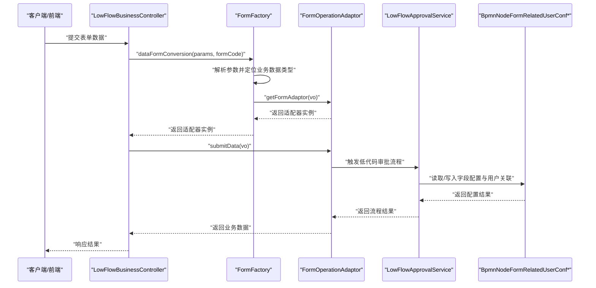
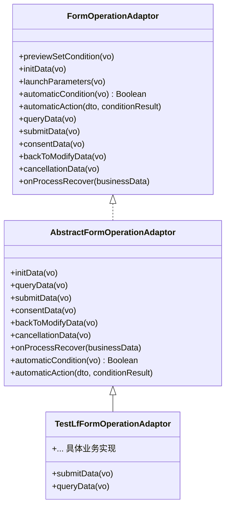
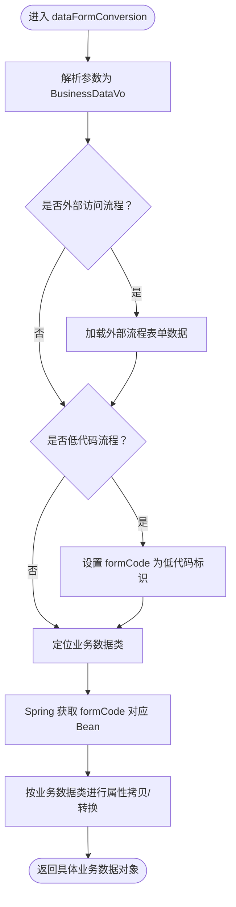
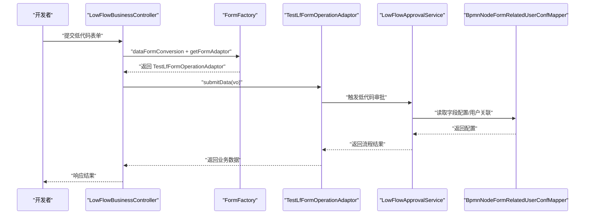
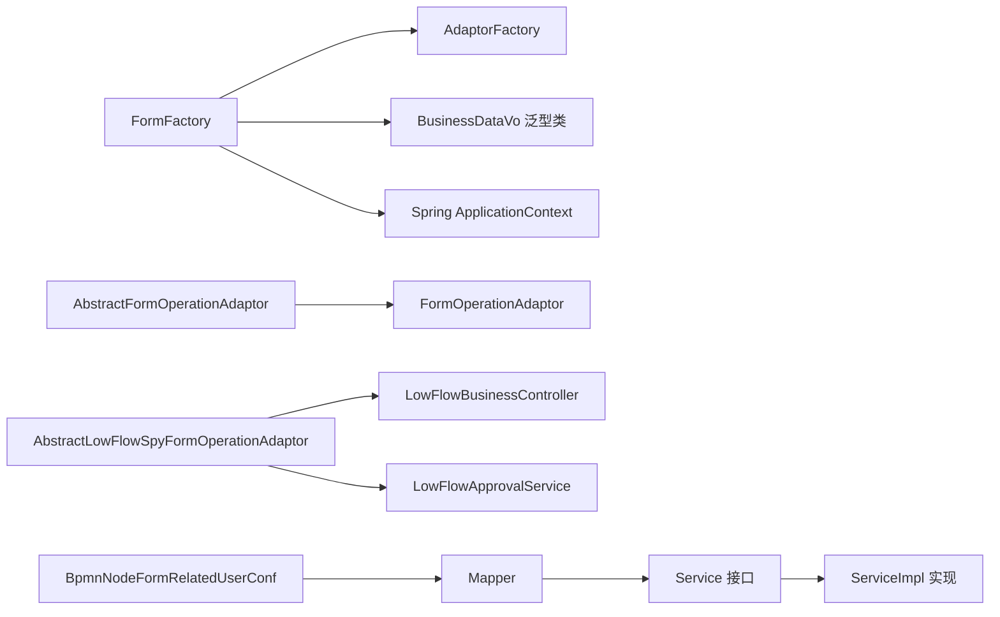

# 自定义表单开发

<cite>
**本文引用的文件**
- [FormAdapter.java](file://antflow-engine/src/main/java/org/openoa/engine/bpmnconf/adp/FormAdapter.java)
- [FormOperationAdaptor.java](file://antflow-base/src/main/java/org/openoa/base/interf/FormOperationAdaptor.java)
- [FormFactory.java](file://antflow-engine/src/main/java/org/openoa/engine/factory/FormFactory.java)
- [AdaptorFactory.java](file://antflow-engine/src/main/java/org/openoa/engine/factory/AdaptorFactory.java)
- [AbstractFormOperationAdaptor.java](file://antflow-engine/src/main/java/org/openoa/engine/bpmnconf/adp/processoperation/AbstractFormOperationAdaptor.java)
- [ProcessConstants.java](file://antflow-engine/src/main/java/org/openoa/engine/bpmnconf/common/ProcessConstants.java)
- [AntFlowConstants.java](file://antflow-engine/src/main/java/org/openoa/engine/bpmnconf/constant/AntFlowConstants.java)
- [LowFlowBusinessController.java](file://antflow-engine/src/main/java/org/openoa/engine/bpmnconf/controller/LowFlowBusinessController.java)
- [LowFlowApprovalService.java](file://antflow-engine/src/main/java/org/openoa/engine/lowflow/service/LowFlowApprovalService.java)
- [AbstractLowFlowSpyFormOperationAdaptor.java](file://antflow-engine/src/main/java/org/openoa/engine/bpmnconf/adp/processoperation/AbstractLowFlowSpyFormOperationAdaptor.java)
- [BpmnNodeFormRelatedUserConf.java](file://antflow-base/src/main/java/org/openoa/base/entity/BpmnNodeFormRelatedUserConf.java)
- [BpmnNodeFormRelatedUserConfMapper.java](file://antflow-engine/src/main/java/org/openoa/engine/bpmnconf/mapper/BpmnNodeFormRelatedUserConfMapper.java)
- [BpmnNodeFormRelatedUserConfService.java](file://antflow-engine/src/main/java/org/openoa/engine/bpmnconf/service/interf/repository/BpmnNodeFormRelatedUserConfService.java)
- [BpmnNodeFormRelatedUserConfSerivceImpl.java](file://antflow-engine/src/main/java/org/openoa/engine/bpmnconf/service/impl/BpmnNodeFormRelatedUserConfSerivceImpl.java)
- [LowFlowBusinessDataVO.java](file://antflow-base/src/main/java/org/openoa/base/vo/LowFlowBusinessDataVO.java)
- [TestLfFormOperationAdaptor.java](file://antflow-engine/src/main/java/org/openoa/engine/lowflow/service/TestLfFormOperationAdaptor.java)
</cite>

## 目录
1. [简介](#简介)
2. [项目结构](#项目结构)
3. [核心组件](#核心组件)
4. [架构总览](#架构总览)
5. [详细组件分析](#详细组件分析)
6. [依赖关系分析](#依赖关系分析)
7. [性能考虑](#性能考虑)
8. [故障排查指南](#故障排查指南)
9. [结论](#结论)
10. [附录](#附录)

## 简介
本指南面向“自定义表单开发”，围绕以下目标展开：表单适配器的实现原理与开发模式、FormAdapter 接口的使用方法、表单工厂的创建机制；深入解释表单字段的动态处理、数据验证器的开发方法、表单渲染器的实现方式；提供低代码表单开发的完整示例，涵盖表单代码管理、字段配置处理、数据持久化机制；解释表单验证规则的实现、表单数据转换逻辑、表单状态管理；最后给出表单测试策略与性能优化建议。

## 项目结构
本项目采用分层+模块化的组织方式：
- antflow-base：基础接口与实体，定义了表单适配器核心接口、常量、VO等。
- antflow-engine：引擎与适配器工厂，负责表单适配器的发现、装配与调用。
- antflow-vue：前端低代码设计器与运行时组件。
- antflow-web：Web 应用入口与测试样例。
- doc：系统文档与使用手册。

下图展示与“自定义表单开发”直接相关的模块与文件关系：

```mermaid
graph TB
subgraph "基础层"
FOI["FormOperationAdaptor 接口<br/>定义表单适配器能力"]
FAD["FormAdapter 接口<br/>已废弃，兼容旧实现"]
AC["AntFlowConstants 常量"]
LFVO["LowFlowBusinessDataVO 低代码数据模型"]
end
subgraph "引擎层"
FF["FormFactory 表单工厂"]
AF["AdaptorFactory 适配器工厂"]
AFOA["AbstractFormOperationAdaptor 抽象基类"]
LFAOA["AbstractLowFlowSpyFormOperationAdaptor 低代码抽象基类"]
PC["ProcessConstants 流程常量与工具"]
LFC["LowFlowBusinessController 控制器"]
LFS["LowFlowApprovalService 低代码审批服务"]
TESTAD["TestLfFormOperationAdaptor 示例实现"]
end
subgraph "持久化层"
BNFRU["BpmnNodeFormRelatedUserConf 实体"]
BNFRUM["BpmnNodeFormRelatedUserConfMapper 映射"]
BNFRUS["BpmnNodeFormRelatedUserConfService 接口"]
BNFRUI["BpmnNodeFormRelatedUserConfSerivceImpl 实现"]
end
FOI --> FF
FAD --> FF
AF --> FF
AFOA --> FF
LFAOA --> FF
PC --> FF
LFC --> FF
LFS --> FF
TESTAD --> FF
BNFRU --> BNFRUM
BNFRUM --> BNFRUS
BNFRUS --> BNFRUI
```

图表来源
- [FormOperationAdaptor.java:1-106](file://antflow-base/src/main/java/org/openoa/base/interf/FormOperationAdaptor.java#L1-L106)
- [FormAdapter.java:1-81](file://antflow-engine/src/main/java/org/openoa/engine/bpmnconf/adp/FormAdapter.java#L1-L81)
- [FormFactory.java:1-159](file://antflow-engine/src/main/java/org/openoa/engine/factory/FormFactory.java#L1-L159)
- [AdaptorFactory.java:1-34](file://antflow-engine/src/main/java/org/openoa/engine/factory/AdaptorFactory.java#L1-L34)
- [AbstractFormOperationAdaptor.java:1-63](file://antflow-engine/src/main/java/org/openoa/engine/bpmnconf/adp/processoperation/AbstractFormOperationAdaptor.java#L1-L63)
- [AbstractLowFlowSpyFormOperationAdaptor.java](file://antflow-engine/src/main/java/org/openoa/engine/bpmnconf/adp/processoperation/AbstractLowFlowSpyFormOperationAdaptor.java)
- [ProcessConstants.java:1-158](file://antflow-engine/src/main/java/org/openoa/engine/bpmnconf/common/ProcessConstants.java#L1-L158)
- [LowFlowBusinessController.java](file://antflow-engine/src/main/java/org/openoa/engine/bpmnconf/controller/LowFlowBusinessController.java)
- [LowFlowApprovalService.java](file://antflow-engine/src/main/java/org/openoa/engine/lowflow/service/LowFlowApprovalService.java)
- [TestLfFormOperationAdaptor.java](file://antflow-engine/src/main/java/org/openoa/engine/lowflow/service/TestLfFormOperationAdaptor.java)
- [BpmnNodeFormRelatedUserConf.java](file://antflow-base/src/main/java/org/openoa/base/entity/BpmnNodeFormRelatedUserConf.java)
- [BpmnNodeFormRelatedUserConfMapper.java](file://antflow-engine/src/main/java/org/openoa/engine/bpmnconf/mapper/BpmnNodeFormRelatedUserConfMapper.java)
- [BpmnNodeFormRelatedUserConfService.java](file://antflow-engine/src/main/java/org/openoa/engine/bpmnconf/service/interf/repository/BpmnNodeFormRelatedUserConfService.java)
- [BpmnNodeFormRelatedUserConfSerivceImpl.java](file://antflow-engine/src/main/java/org/openoa/engine/bpmnconf/service/impl/BpmnNodeFormRelatedUserConfSerivceImpl.java)
- [LowFlowBusinessDataVO.java](file://antflow-base/src/main/java/org/openoa/base/vo/LowFlowBusinessDataVO.java)

章节来源
- [FormOperationAdaptor.java:1-106](file://antflow-base/src/main/java/org/openoa/base/interf/FormOperationAdaptor.java#L1-L106)
- [FormFactory.java:1-159](file://antflow-engine/src/main/java/org/openoa/engine/factory/FormFactory.java#L1-L159)
- [AdaptorFactory.java:1-34](file://antflow-engine/src/main/java/org/openoa/engine/factory/AdaptorFactory.java#L1-L34)

## 核心组件
- 表单适配器接口：FormOperationAdaptor 定义了表单生命周期的关键钩子，包括预览条件设置、初始化数据、启动参数、自动条件与动作、查询数据、提交数据、同意审批、退回修改、取消与流程恢复等。
- 表单工厂：FormFactory 负责根据表单编码或业务数据对象解析并获取对应的 FormOperationAdaptor 实例，同时完成请求参数到具体业务数据类型的转换。
- 适配器工厂：AdaptorFactory 提供不同类型的适配器（如流程、人员、会签节点等）的获取入口。
- 抽象适配器：AbstractFormOperationAdaptor 提供默认空实现，便于快速实现最小可用表单适配器。
- 低代码适配器：AbstractLowFlowSpyFormOperationAdaptor 为低代码流程提供抽象基类，配合 LowFlowBusinessController 与 LowFlowApprovalService 使用。
- 流程常量与工具：ProcessConstants 提供流程节点查询、历史任务查询等工具方法，AntFlowConstants 提供流程与节点常量。
- 字段配置与持久化：BpmnNodeFormRelatedUserConf 及其 Mapper/Service/Impl 提供表单字段与节点关联用户的配置与持久化能力。

章节来源
- [FormOperationAdaptor.java:1-106](file://antflow-base/src/main/java/org/openoa/base/interf/FormOperationAdaptor.java#L1-L106)
- [FormFactory.java:1-159](file://antflow-engine/src/main/java/org/openoa/engine/factory/FormFactory.java#L1-L159)
- [AbstractFormOperationAdaptor.java:1-63](file://antflow-engine/src/main/java/org/openoa/engine/bpmnconf/adp/processoperation/AbstractFormOperationAdaptor.java#L1-L63)
- [AbstractLowFlowSpyFormOperationAdaptor.java](file://antflow-engine/src/main/java/org/openoa/engine/bpmnconf/adp/processoperation/AbstractLowFlowSpyFormOperationAdaptor.java)
- [ProcessConstants.java:1-158](file://antflow-engine/src/main/java/org/openoa/engine/bpmnconf/common/ProcessConstants.java#L1-L158)
- [AntFlowConstants.java:1-92](file://antflow-engine/src/main/java/org/openoa/engine/bpmnconf/constant/AntFlowConstants.java#L1-L92)
- [BpmnNodeFormRelatedUserConf.java](file://antflow-base/src/main/java/org/openoa/base/entity/BpmnNodeFormRelatedUserConf.java)
- [BpmnNodeFormRelatedUserConfMapper.java](file://antflow-engine/src/main/java/org/openoa/engine/bpmnconf/mapper/BpmnNodeFormRelatedUserConfMapper.java)
- [BpmnNodeFormRelatedUserConfService.java](file://antflow-engine/src/main/java/org/openoa/engine/bpmnconf/service/interf/repository/BpmnNodeFormRelatedUserConfService.java)
- [BpmnNodeFormRelatedUserConfSerivceImpl.java](file://antflow-engine/src/main/java/org/openoa/engine/bpmnconf/service/impl/BpmnNodeFormRelatedUserConfSerivceImpl.java)

## 架构总览
下图展示了“表单工厂 + 适配器 + 业务数据”的交互关系，以及低代码场景下的关键组件：

图表来源
- [FormFactory.java:70-123](file://antflow-engine/src/main/java/org/openoa/engine/factory/FormFactory.java#L70-L123)
- [FormOperationAdaptor.java:60-66](file://antflow-base/src/main/java/org/openoa/base/interf/FormOperationAdaptor.java#L60-L66)
- [LowFlowBusinessController.java](file://antflow-engine/src/main/java/org/openoa/engine/bpmnconf/controller/LowFlowBusinessController.java)
- [LowFlowApprovalService.java](file://antflow-engine/src/main/java/org/openoa/engine/lowflow/service/LowFlowApprovalService.java)
- [BpmnNodeFormRelatedUserConf.java](file://antflow-base/src/main/java/org/openoa/base/entity/BpmnNodeFormRelatedUserConf.java)

## 详细组件分析

### 表单适配器接口与生命周期
- 接口职责：统一表单在流程中的行为契约，覆盖从“预览、初始化、启动、自动条件/动作、查询、提交、审批、退回、取消、恢复”在内的全生命周期。
- 关键方法：
  - 预览条件设置：previewSetCondition
  - 初始化数据：initData
  - 启动参数：launchParameters
  - 自动条件与动作：automaticCondition、automaticAction
  - 查询与提交：queryData、submitData
  - 审批与退回：consentData、backToModifyData
  - 取消与恢复：cancellationData、onProcessRecover
- 开发建议：
  - 仅实现必要的方法，其他使用默认空实现（可参考 AbstractFormOperationAdaptor）。
  - submitData 返回原对象，确保业务属性更新生效。
  - cancellationData 通常用于失效业务数据，避免脏数据参与后续流程。

图表来源
- [FormOperationAdaptor.java:1-106](file://antflow-base/src/main/java/org/openoa/base/interf/FormOperationAdaptor.java#L1-L106)
- [AbstractFormOperationAdaptor.java:1-63](file://antflow-engine/src/main/java/org/openoa/engine/bpmnconf/adp/processoperation/AbstractFormOperationAdaptor.java#L1-L63)
- [TestLfFormOperationAdaptor.java](file://antflow-engine/src/main/java/org/openoa/engine/lowflow/service/TestLfFormOperationAdaptor.java)

章节来源
- [FormOperationAdaptor.java:1-106](file://antflow-base/src/main/java/org/openoa/base/interf/FormOperationAdaptor.java#L1-L106)
- [AbstractFormOperationAdaptor.java:1-63](file://antflow-engine/src/main/java/org/openoa/engine/bpmnconf/adp/processoperation/AbstractFormOperationAdaptor.java#L1-L63)

### 表单工厂与适配器工厂
- FormFactory 的职责：
  - 根据表单编码或业务数据对象获取 FormOperationAdaptor 实例。
  - 将请求参数字符串或业务数据对象转换为具体业务数据类型（通过泛型推断）。
  - 支持外部访问流程与低代码流程的数据映射。
- 关键流程：
  - dataFormConversion：解析参数、处理外部访问流程与低代码标识、定位业务数据类并进行属性拷贝。
  - getFormAdaptor：通过适配器工厂与 Spring 容器获取适配器实例。
- 注意事项：
  - 若找不到适配器或未正确声明泛型，将抛出异常。
  - 低代码流程通过特殊 formCode 标识进行识别与处理。

图表来源
- [FormFactory.java:70-123](file://antflow-engine/src/main/java/org/openoa/engine/factory/FormFactory.java#L70-L123)

章节来源
- [FormFactory.java:1-159](file://antflow-engine/src/main/java/org/openoa/engine/factory/FormFactory.java#L1-L159)
- [AdaptorFactory.java:1-34](file://antflow-engine/src/main/java/org/openoa/engine/factory/AdaptorFactory.java#L1-L34)

### 低代码表单开发
- 低代码适配器基类：AbstractLowFlowSpyFormOperationAdaptor 为低代码流程提供抽象实现，结合 LowFlowBusinessController 与 LowFlowApprovalService 使用。
- 数据模型：LowFlowBusinessDataVO 作为低代码业务数据载体，承载字段配置与表单数据。
- 示例实现：TestLfFormOperationAdaptor 展示如何在 submitData/queryData 等方法中对接低代码流程与字段配置。
- 字段配置持久化：BpmnNodeFormRelatedUserConf 及其 Mapper/Service/Impl 提供字段与节点关联用户的配置读写能力。

图表来源
- [LowFlowBusinessController.java](file://antflow-engine/src/main/java/org/openoa/engine/bpmnconf/controller/LowFlowBusinessController.java)
- [FormFactory.java:50-62](file://antflow-engine/src/main/java/org/openoa/engine/factory/FormFactory.java#L50-L62)
- [TestLfFormOperationAdaptor.java](file://antflow-engine/src/main/java/org/openoa/engine/lowflow/service/TestLfFormOperationAdaptor.java)
- [LowFlowApprovalService.java](file://antflow-engine/src/main/java/org/openoa/engine/lowflow/service/LowFlowApprovalService.java)
- [BpmnNodeFormRelatedUserConfMapper.java](file://antflow-engine/src/main/java/org/openoa/engine/bpmnconf/mapper/BpmnNodeFormRelatedUserConfMapper.java)

章节来源
- [AbstractLowFlowSpyFormOperationAdaptor.java](file://antflow-engine/src/main/java/org/openoa/engine/bpmnconf/adp/processoperation/AbstractLowFlowSpyFormOperationAdaptor.java)
- [LowFlowBusinessController.java](file://antflow-engine/src/main/java/org/openoa/engine/bpmnconf/controller/LowFlowBusinessController.java)
- [LowFlowApprovalService.java](file://antflow-engine/src/main/java/org/openoa/engine/lowflow/service/LowFlowApprovalService.java)
- [LowFlowBusinessDataVO.java](file://antflow-base/src/main/java/org/openoa/base/vo/LowFlowBusinessDataVO.java)
- [TestLfFormOperationAdaptor.java](file://antflow-engine/src/main/java/org/openoa/engine/lowflow/service/TestLfFormOperationAdaptor.java)
- [BpmnNodeFormRelatedUserConf.java](file://antflow-base/src/main/java/org/openoa/base/entity/BpmnNodeFormRelatedUserConf.java)
- [BpmnNodeFormRelatedUserConfMapper.java](file://antflow-engine/src/main/java/org/openoa/engine/bpmnconf/mapper/BpmnNodeFormRelatedUserConfMapper.java)
- [BpmnNodeFormRelatedUserConfService.java](file://antflow-engine/src/main/java/org/openoa/engine/bpmnconf/service/interf/repository/BpmnNodeFormRelatedUserConfService.java)
- [BpmnNodeFormRelatedUserConfSerivceImpl.java](file://antflow-engine/src/main/java/org/openoa/engine/bpmnconf/service/impl/BpmnNodeFormRelatedUserConfSerivceImpl.java)

### 表单字段的动态处理与数据验证
- 动态处理：通过 AbstractLowFlowSpyFormOperationAdaptor 与 LowFlowApprovalService，在流程节点处动态读取字段配置（如 BpmnNodeFormRelatedUserConf），并据此决定字段可见性、可编辑性与校验规则。
- 数据验证器：可在 submitData 中对业务数据进行校验，必要时抛出业务异常以阻止流程推进；也可在 automaticCondition/automaticAction 中基于条件动态调整校验策略。
- 字段配置持久化：BpmnNodeFormRelatedUserConfMapper/Service/Impl 提供字段与节点关联用户的读写，保障字段配置的可追溯与可维护。

章节来源
- [AbstractLowFlowSpyFormOperationAdaptor.java](file://antflow-engine/src/main/java/org/openoa/engine/bpmnconf/adp/processoperation/AbstractLowFlowSpyFormOperationAdaptor.java)
- [LowFlowApprovalService.java](file://antflow-engine/src/main/java/org/openoa/engine/lowflow/service/LowFlowApprovalService.java)
- [BpmnNodeFormRelatedUserConf.java](file://antflow-base/src/main/java/org/openoa/base/entity/BpmnNodeFormRelatedUserConf.java)
- [BpmnNodeFormRelatedUserConfMapper.java](file://antflow-engine/src/main/java/org/openoa/engine/bpmnconf/mapper/BpmnNodeFormRelatedUserConfMapper.java)
- [BpmnNodeFormRelatedUserConfService.java](file://antflow-engine/src/main/java/org/openoa/engine/bpmnconf/service/interf/repository/BpmnNodeFormRelatedUserConfService.java)
- [BpmnNodeFormRelatedUserConfSerivceImpl.java](file://antflow-engine/src/main/java/org/openoa/engine/bpmnconf/service/impl/BpmnNodeFormRelatedUserConfSerivceImpl.java)

### 表单渲染器与状态管理
- 渲染器：前端通过低代码设计器生成的表单 JSON 与字段配置，结合后端适配器返回的预览条件与启动参数，驱动前端渲染。
- 状态管理：流程状态由 ProcessConstants 提供的工具方法辅助判断（如当前节点、下一节点、历史任务等），前端据此切换表单视图与交互状态。

章节来源
- [ProcessConstants.java:49-83](file://antflow-engine/src/main/java/org/openoa/engine/bpmnconf/common/ProcessConstants.java#L49-L83)
- [AntFlowConstants.java:1-92](file://antflow-engine/src/main/java/org/openoa/engine/bpmnconf/constant/AntFlowConstants.java#L1-L92)

## 依赖关系分析
- 组件耦合：
  - FormFactory 依赖 AdaptorFactory、Spring 上下文与业务数据类泛型推断。
  - 低代码适配器依赖 LowFlowBusinessController 与 LowFlowApprovalService。
  - 字段配置通过 Mapper/Service/Impl 形成闭环，避免直接耦合到业务逻辑。
- 外部依赖：
  - FastJSON 用于参数解析与对象转换。
  - MyBatis-Plus 用于字段配置的查询与持久化。
  - Spring BeanUtils 用于属性拷贝。

图表来源
- [FormFactory.java:1-159](file://antflow-engine/src/main/java/org/openoa/engine/factory/FormFactory.java#L1-L159)
- [AdaptorFactory.java:1-34](file://antflow-engine/src/main/java/org/openoa/engine/factory/AdaptorFactory.java#L1-L34)
- [AbstractFormOperationAdaptor.java:1-63](file://antflow-engine/src/main/java/org/openoa/engine/bpmnconf/adp/processoperation/AbstractFormOperationAdaptor.java#L1-L63)
- [AbstractLowFlowSpyFormOperationAdaptor.java](file://antflow-engine/src/main/java/org/openoa/engine/bpmnconf/adp/processoperation/AbstractLowFlowSpyFormOperationAdaptor.java)
- [LowFlowBusinessController.java](file://antflow-engine/src/main/java/org/openoa/engine/bpmnconf/controller/LowFlowBusinessController.java)
- [LowFlowApprovalService.java](file://antflow-engine/src/main/java/org/openoa/engine/lowflow/service/LowFlowApprovalService.java)
- [BpmnNodeFormRelatedUserConf.java](file://antflow-base/src/main/java/org/openoa/base/entity/BpmnNodeFormRelatedUserConf.java)
- [BpmnNodeFormRelatedUserConfMapper.java](file://antflow-engine/src/main/java/org/openoa/engine/bpmnconf/mapper/BpmnNodeFormRelatedUserConfMapper.java)
- [BpmnNodeFormRelatedUserConfService.java](file://antflow-engine/src/main/java/org/openoa/engine/bpmnconf/service/interf/repository/BpmnNodeFormRelatedUserConfService.java)
- [BpmnNodeFormRelatedUserConfSerivceImpl.java](file://antflow-engine/src/main/java/org/openoa/engine/bpmnconf/service/impl/BpmnNodeFormRelatedUserConfSerivceImpl.java)

章节来源
- [FormFactory.java:1-159](file://antflow-engine/src/main/java/org/openoa/engine/factory/FormFactory.java#L1-L159)
- [AdaptorFactory.java:1-34](file://antflow-engine/src/main/java/org/openoa/engine/factory/AdaptorFactory.java#L1-L34)

## 性能考虑
- 泛型反射开销：FormFactory 在解析业务数据类时使用反射与泛型推断，建议在高频路径中缓存推断结果，减少重复计算。
- Spring Bean 获取：频繁通过 Bean 名称获取适配器实例，建议在适配器注册阶段建立名称到实例的映射表，降低容器查找成本。
- 低代码字段配置：Mapper 查询应使用精确条件与索引，避免全表扫描；对热点配置进行本地缓存。
- 参数解析：FastJSON 解析参数时尽量避免不必要的字段转换，仅解析必要字段。

## 故障排查指南
- 适配器未找到：
  - 现象：抛出“无法通过表单编码获取处理 Bean”异常。
  - 排查：确认表单编码与 Spring Bean 名称一致，检查适配器是否正确注册。
- 泛型缺失：
  - 现象：抛出“该表单未关联业务实现类或未关联实现类泛型”异常。
  - 排查：确保适配器实现类声明了正确的泛型参数，且业务数据类可被正确解析。
- 外部访问流程数据缺失：
  - 现象：外部流程表单数据为空。
  - 排查：确认外部流程编号匹配，检查 OutSideBpmAccessBusiness 表单数据字段是否正确填充。
- 低代码流程异常：
  - 现象：低代码提交失败或字段配置不生效。
  - 排查：核对 LowFlowBusinessController 的入参、FormFactory 的转换逻辑、TestLfFormOperationAdaptor 的 submitData 实现与 BpmnNodeFormRelatedUserConf 的配置。

章节来源
- [FormFactory.java:70-123](file://antflow-engine/src/main/java/org/openoa/engine/factory/FormFactory.java#L70-L123)
- [FormFactory.java:124-152](file://antflow-engine/src/main/java/org/openoa/engine/factory/FormFactory.java#L124-L152)

## 结论
通过 FormOperationAdaptor 接口与 FormFactory 工厂，系统实现了“表单适配器 + 业务数据 + 流程引擎”的解耦设计。低代码场景通过 AbstractLowFlowSpyFormOperationAdaptor 与相关服务，提供了灵活的字段配置与流程编排能力。遵循本文档的开发模式与最佳实践，可高效构建可维护、可扩展的自定义表单体系。

## 附录
- 开发步骤建议：
  - 定义业务数据类（继承 BusinessDataVo 或对应低代码 VO）。
  - 实现 FormOperationAdaptor 或 AbstractFormOperationAdaptor 子类，按需实现生命周期方法。
  - 在 Spring 中注册适配器 Bean，确保 Bean 名称与表单编码一致。
  - 使用 FormFactory 进行参数解析与适配器获取，调用 submitData 完成业务提交。
  - 通过 BpmnNodeFormRelatedUserConf 配置字段与节点关联用户，实现动态字段控制。
- 测试策略：
  - 单元测试：针对 submitData/queryData/cancellationData 等关键方法编写边界与异常场景测试。
  - 集成测试：模拟低代码流程提交，验证字段配置与流程流转。
  - 性能测试：对高频路径（如参数解析、Bean 获取、字段查询）进行压测与优化。