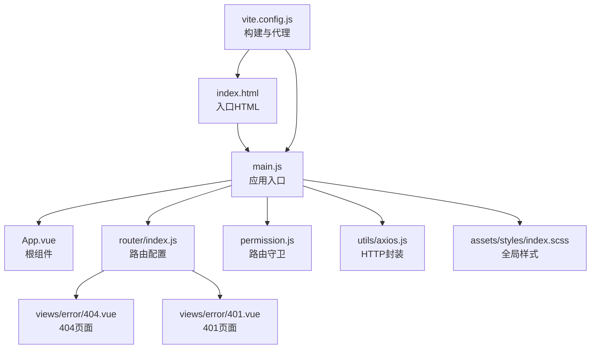
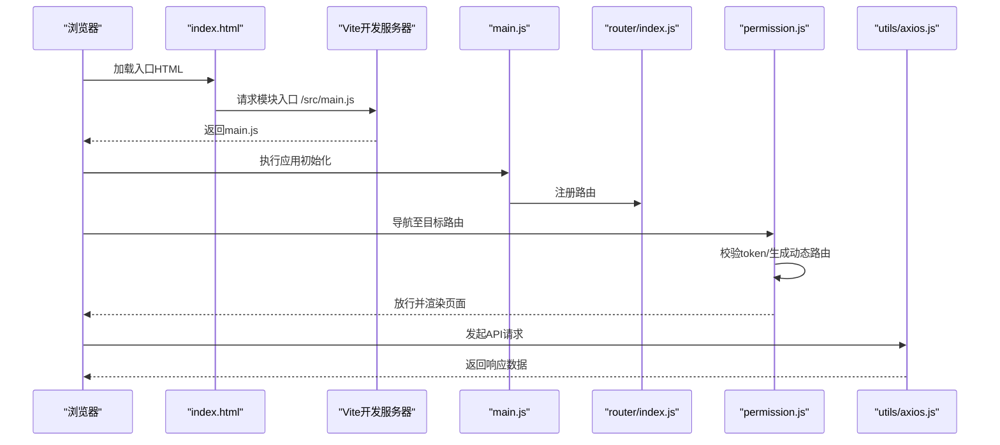
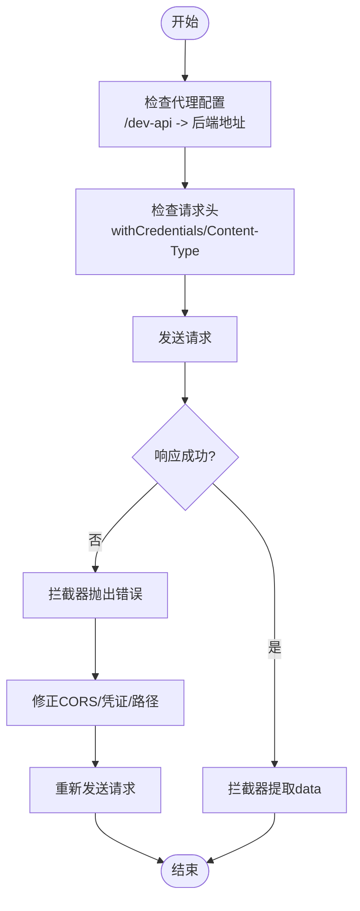
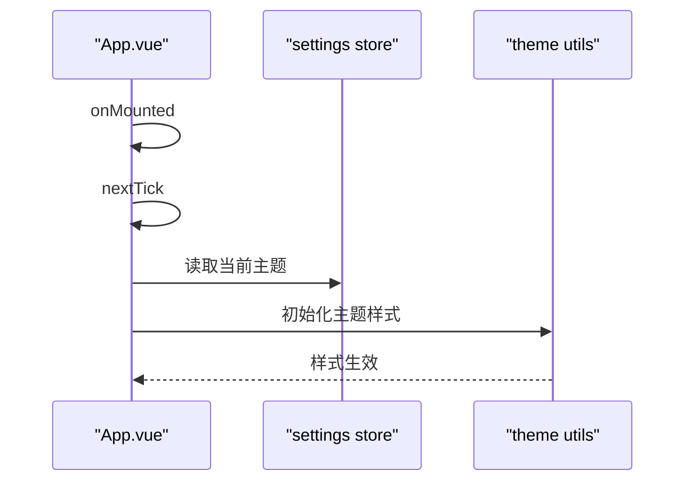
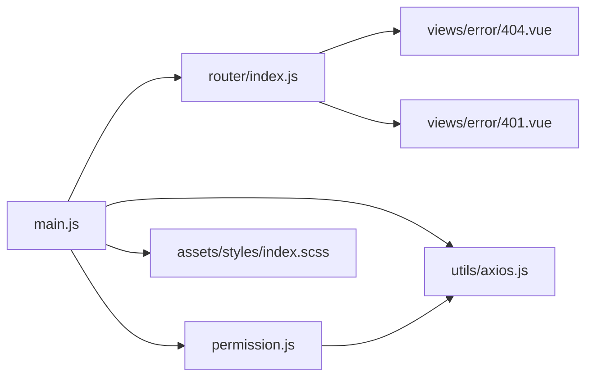

# 前端显示问题

<cite>
**本文引用的文件**
- [package.json](file://antflow-vue/package.json)
- [vite.config.js](file://antflow-vue/vite.config.js)
- [index.html](file://antflow-vue/index.html)
- [main.js](file://antflow-vue/src/main.js)
- [App.vue](file://antflow-vue/src/App.vue)
- [axios.js](file://antflow-vue/src/utils/axios.js)
- [errorCode.js](file://antflow-vue/src/utils/errorCode.js)
- [404.vue](file://antflow-vue/src/views/error/404.vue)
- [401.vue](file://antflow-vue/src/views/error/401.vue)
- [index.js](file://antflow-vue/src/store/index.js)
- [router/index.js](file://antflow-vue/src/router/index.js)
- [plugins/index.js](file://antflow-vue/src/plugins/index.js)
- [permission.js](file://antflow-vue/src/permission.js)
- [index.scss](file://antflow-vue/src/assets/styles/index.scss)
</cite>

## 目录
1. [简介](#简介)
2. [项目结构](#项目结构)
3. [核心组件](#核心组件)
4. [架构总览](#架构总览)
5. [详细组件分析](#详细组件分析)
6. [依赖关系分析](#依赖关系分析)
7. [性能考量](#性能考量)
8. [故障排查指南](#故障排查指南)
9. [结论](#结论)
10. [附录](#附录)

## 简介
本指南聚焦于前端显示问题的实用调试方法，覆盖静态资源加载失败（CSS、JS、图片404）、API 接口调用错误（CORS、参数与响应异常）、Vue 组件渲染问题（生命周期、响应式与事件）、浏览器兼容性（ES6/CSS3/第三方库版本冲突），并结合仓库中的实际配置与代码片段，提供控制台错误解读与修复建议，以及开发/生产环境差异化的调试策略。

## 项目结构
该前端工程采用 Vue 3 + Vite 构建，使用 Element Plus 作为 UI 基础库，通过路由守卫与状态管理实现权限控制与页面跳转，资源通过 Vite 的开发服务器与代理解决跨域与路径问题。关键入口与配置如下：
- 入口 HTML：index.html 引入模块入口脚本
- 应用入口：main.js 创建应用实例、注册插件与全局组件
- 路由与权限：router/index.js 定义公共与动态路由；permission.js 实现前置守卫
- 请求封装：utils/axios.js 封装 axios 并设置超时与跨域凭证
- 错误页：views/error/404.vue、401.vue 提供错误页面
- 样式：assets/styles/index.scss 统一引入基础样式与变量
- 构建与代理：vite.config.js 配置 base、alias、代理与打包输出

**图表来源**
- [index.html:1-215](file://antflow-vue/index.html#L1-L215)
- [main.js:1-110](file://antflow-vue/src/main.js#L1-L110)
- [App.vue:1-16](file://antflow-vue/src/App.vue#L1-L16)
- [router/index.js:1-339](file://antflow-vue/src/router/index.js#L1-L339)
- [permission.js:1-77](file://antflow-vue/src/permission.js#L1-L77)
- [axios.js:1-35](file://antflow-vue/src/utils/axios.js#L1-L35)
- [404.vue:1-228](file://antflow-vue/src/views/error/404.vue#L1-L228)
- [401.vue:1-83](file://antflow-vue/src/views/error/401.vue#L1-L83)
- [index.scss:1-205](file://antflow-vue/src/assets/styles/index.scss#L1-L205)
- [vite.config.js:1-100](file://antflow-vue/vite.config.js#L1-L100)

**章节来源**
- [index.html:1-215](file://antflow-vue/index.html#L1-L215)
- [main.js:1-110](file://antflow-vue/src/main.js#L1-L110)
- [vite.config.js:1-100](file://antflow-vue/vite.config.js#L1-L100)

## 核心组件
- 应用入口与全局注册
  - main.js 中完成 Element Plus、SVG 图标、全局组件与指令、打印插件、vForm 设计器等的注册与挂载，确保运行期样式与组件可用。
- 路由与权限
  - router/index.js 定义常量路由（含 404/401）与动态路由，permission.js 在导航前根据 token 与用户信息生成可访问路由并跳转。
- 请求与错误码
  - utils/axios.js 统一封装请求拦截与响应拦截，设置超时与跨域凭证；errorCode.js 提供常见错误码提示映射。
- 错误页
  - 404.vue 与 401.vue 提供可视化错误页，便于定位资源缺失或权限不足问题。
- 样式与主题
  - index.scss 引入过渡、侧边栏、按钮、Element Plus 等样式，App.vue 在挂载后初始化主题样式。

**章节来源**
- [main.js:1-110](file://antflow-vue/src/main.js#L1-L110)
- [router/index.js:1-339](file://antflow-vue/src/router/index.js#L1-L339)
- [permission.js:1-77](file://antflow-vue/src/permission.js#L1-L77)
- [axios.js:1-35](file://antflow-vue/src/utils/axios.js#L1-L35)
- [errorCode.js:1-7](file://antflow-vue/src/utils/errorCode.js#L1-L7)
- [404.vue:1-228](file://antflow-vue/src/views/error/404.vue#L1-L228)
- [401.vue:1-83](file://antflow-vue/src/views/error/401.vue#L1-L83)
- [index.scss:1-205](file://antflow-vue/src/assets/styles/index.scss#L1-L205)
- [App.vue:1-16](file://antflow-vue/src/App.vue#L1-L16)

## 架构总览
下图展示了从浏览器加载到页面渲染的关键链路，以及与后端交互的代理与跨域处理。

**图表来源**
- [index.html:1-215](file://antflow-vue/index.html#L1-L215)
- [main.js:1-110](file://antflow-vue/src/main.js#L1-L110)
- [router/index.js:1-339](file://antflow-vue/src/router/index.js#L1-L339)
- [permission.js:1-77](file://antflow-vue/src/permission.js#L1-L77)
- [axios.js:1-35](file://antflow-vue/src/utils/axios.js#L1-L35)

## 详细组件分析

### 静态资源加载失败排查（CSS/JS/图片）
- 常见现象
  - 页面空白、样式错乱、图片不显示、控制台出现 404/401。
- 定位步骤
  - 打开网络面板，确认资源请求路径与返回状态；检查 base 与 alias 是否正确解析。
  - 确认 index.html 中的模块入口路径与 main.js 是否存在。
  - 检查全局样式是否正确引入，是否存在拼写错误或路径问题。
- 关键配置与入口
  - index.html 引入模块入口脚本，确保路径正确。
  - vite.config.js 的 alias 与 base 决定资源解析与部署路径。
  - main.js 引入全局样式与第三方库样式，确保顺序正确。
  - index.scss 统一引入过渡、侧边栏、按钮、Element Plus 等样式。
- 建议修复
  - 若部署在子路径，确保 base 与 VITE_HOME_PATH 正确设置。
  - 资源路径使用 @ 别名，避免相对路径导致的打包后失效。
  - 图片资源使用 @/assets 或通过 import 引入，避免硬编码绝对路径。

**章节来源**
- [index.html:1-215](file://antflow-vue/index.html#L1-L215)
- [vite.config.js:1-100](file://antflow-vue/vite.config.js#L1-L100)
- [main.js:1-110](file://antflow-vue/src/main.js#L1-L110)
- [index.scss:1-205](file://antflow-vue/src/assets/styles/index.scss#L1-L205)

### API 接口调用错误诊断（CORS/参数/响应）
- 常见现象
  - 控制台 CORS 报错、请求超时、响应体为空或格式异常。
- 定位步骤
  - 查看请求拦截器是否正确设置凭证与 Content-Type。
  - 检查代理配置是否覆盖目标路径，代理 rewrite 是否正确。
  - 核对后端接口地址与路径前缀，确认与后端约定一致。
- 关键配置
  - utils/axios.js 设置 withCredentials 与超时时间，拦截器统一处理响应数据。
  - vite.config.js 的 server.proxy 将 /dev-api 代理到后端地址，并支持 springdoc 文档代理。
- 建议修复
  - 开发环境使用代理，避免跨域；生产环境确保后端正确配置 CORS。
  - 参数与响应格式遵循后端契约，必要时在拦截器中做统一转换。
  - 对于鉴权接口，确保携带正确的 token 与 Cookie。

**图表来源**
- [axios.js:1-35](file://antflow-vue/src/utils/axios.js#L1-L35)
- [vite.config.js:64-81](file://antflow-vue/vite.config.js#L64-L81)

**章节来源**
- [axios.js:1-35](file://antflow-vue/src/utils/axios.js#L1-L35)
- [vite.config.js:1-100](file://antflow-vue/vite.config.js#L1-L100)

### Vue 组件渲染问题调试（生命周期/响应式/事件）
- 常见现象
  - 组件未渲染、数据未更新、事件未触发、主题样式未生效。
- 定位步骤
  - 检查组件是否在 main.js 中正确注册为全局组件或局部注册。
  - 确认 App.vue 的生命周期钩子是否在挂载后执行主题初始化。
  - 使用浏览器开发者工具查看组件树与响应式数据变化。
- 关键配置
  - main.js 中全局挂载多个组件（分页、富文本、上传、字典标签等），确保导入路径正确。
  - App.vue 在 mounted/nextTick 中初始化主题样式。
- 建议修复
  - 对需要全局使用的组件优先在 main.js 注册，减少重复导入。
  - 主题切换逻辑放在挂载后执行，避免样式未就绪导致的闪烁或错位。
  - 事件绑定使用 .once/.passive 等修饰符优化性能，避免内存泄漏。

**图表来源**
- [App.vue:1-16](file://antflow-vue/src/App.vue#L1-L16)

**章节来源**
- [main.js:1-110](file://antflow-vue/src/main.js#L1-L110)
- [App.vue:1-16](file://antflow-vue/src/App.vue#L1-L16)

### 浏览器兼容性问题识别与处理（ES6/CSS3/第三方库）
- 常见现象
  - ES6+ 语法报错、CSS3 属性不生效、第三方库版本冲突导致功能异常。
- 定位步骤
  - 查看浏览器控制台与构建日志，确认是否因 polyfill 或转译缺失导致。
  - 检查 package.json 中依赖版本与浏览器支持矩阵。
- 关键配置
  - package.json 中包含 Vue 3、Element Plus、axios 等现代库，需确保目标浏览器支持相应特性。
  - Vite 默认针对现代浏览器进行优化，如需兼容旧浏览器，可在构建配置中启用 polyfill 或调整目标。
- 建议修复
  - 对于旧版 IE，使用 index.html 中的条件跳转到降级页。
  - 第三方库版本冲突时，优先使用锁定版本或升级到兼容版本。
  - CSS3 属性缺失时，补充必要的前缀或回退方案。

**章节来源**
- [package.json:1-54](file://antflow-vue/package.json#L1-L54)
- [index.html:1-215](file://antflow-vue/index.html#L1-L215)

## 依赖关系分析
- 组件耦合与职责
  - main.js 作为应用入口，负责全局注册与挂载，耦合度较高但职责清晰。
  - permission.js 与 router/index.js 联动，实现权限控制与动态路由注入。
  - axios.js 作为 HTTP 适配层，被各页面与服务模块复用。
- 外部依赖
  - Vue 3、Element Plus、axios、pinia、vue-router 等为核心依赖。
- 潜在风险
  - 路由守卫逻辑复杂，需关注异步加载与错误分支。
  - 代理配置覆盖范围需与后端接口保持一致，避免遗漏路径。

**图表来源**
- [main.js:1-110](file://antflow-vue/src/main.js#L1-L110)
- [router/index.js:1-339](file://antflow-vue/src/router/index.js#L1-L339)
- [permission.js:1-77](file://antflow-vue/src/permission.js#L1-L77)
- [axios.js:1-35](file://antflow-vue/src/utils/axios.js#L1-L35)
- [index.scss:1-205](file://antflow-vue/src/assets/styles/index.scss#L1-L205)
- [404.vue:1-228](file://antflow-vue/src/views/error/404.vue#L1-L228)
- [401.vue:1-83](file://antflow-vue/src/views/error/401.vue#L1-L83)

**章节来源**
- [main.js:1-110](file://antflow-vue/src/main.js#L1-L110)
- [router/index.js:1-339](file://antflow-vue/src/router/index.js#L1-L339)
- [permission.js:1-77](file://antflow-vue/src/permission.js#L1-L77)
- [axios.js:1-35](file://antflow-vue/src/utils/axios.js#L1-L35)
- [index.scss:1-205](file://antflow-vue/src/assets/styles/index.scss#L1-L205)

## 性能考量
- 构建优化
  - vite.config.js 中对第三方库进行手动分块与 CommonJS 包含配置，有助于减小首屏体积与避免打包错误。
  - 生产环境关闭内联 sourcemap，降低体积与加载时间。
- 运行时优化
  - 使用 NProgress 提升导航体验；Element Plus 的 size 从 Cookie 读取，减少重复渲染。
  - 合理拆分全局样式与按需引入，避免全量样式导致的渲染压力。

**章节来源**
- [vite.config.js:1-100](file://antflow-vue/vite.config.js#L1-L100)
- [main.js:1-110](file://antflow-vue/src/main.js#L1-L110)

## 故障排查指南

### 静态资源加载失败
- CSS 样式缺失
  - 现象：页面无样式或样式错乱
  - 排查：确认 index.html 中引入的模块入口与 main.js 存在；检查 main.js 是否正确引入全局样式；确认 vite.config.js 的 alias 与 base 设置
  - 修复：使用 @ 别名导入样式；确保 index.scss 引入顺序正确
- JavaScript 脚本错误
  - 现象：控制台报语法错误或模块未找到
  - 排查：检查 main.js 中的导入路径与第三方库版本；确认 Vite 插件与依赖安装完整
  - 修复：修正导入路径；更新 package.json 依赖版本；清理缓存后重试
- 图片资源 404
  - 现象：图片不显示或控制台 404
  - 排查：确认图片路径是否使用 @/assets；检查打包后资源目录结构
  - 修复：使用 import 引入图片；或在 public 目录放置无需打包的静态资源

**章节来源**
- [index.html:1-215](file://antflow-vue/index.html#L1-L215)
- [main.js:1-110](file://antflow-vue/src/main.js#L1-L110)
- [vite.config.js:1-100](file://antflow-vue/vite.config.js#L1-L100)
- [index.scss:1-205](file://antflow-vue/src/assets/styles/index.scss#L1-L205)

### API 接口调用错误
- 跨域（CORS）
  - 现象：控制台 CORS 报错
  - 排查：确认 axios 的 withCredentials；确认 vite 代理是否覆盖目标路径
  - 修复：开发环境使用代理；生产环境后端开启允许的 Origin/Method/Headers
- 请求参数错误
  - 现象：后端返回参数校验失败
  - 排查：核对请求体与 Content-Type；检查拦截器是否对数据做了不恰当转换
  - 修复：按后端契约准备参数；必要时在拦截器中做格式化
- 响应数据格式异常
  - 现象：响应体为空或结构不符
  - 排查：确认拦截器是否正确提取 data；检查后端返回结构
  - 修复：在拦截器中增加健壮性判断；与后端统一响应格式

**章节来源**
- [axios.js:1-35](file://antflow-vue/src/utils/axios.js#L1-L35)
- [vite.config.js:64-81](file://antflow-vue/vite.config.js#L64-L81)

### Vue 组件渲染问题
- 生命周期问题
  - 现象：主题样式未生效或组件未渲染
  - 排查：确认 App.vue 的 mounted/nextTick 逻辑；检查全局组件注册顺序
  - 修复：将主题初始化放在 nextTick 中；确保全局组件在挂载前注册
- 响应式数据更新异常
  - 现象：视图不更新或数据不同步
  - 排查：确认使用的是响应式 API；避免直接修改数组/对象长度
  - 修复：使用 Vue 3 的响应式 API；必要时强制刷新
- 事件绑定错误
  - 现象：事件未触发或多次触发
  - 排查：检查事件修饰符与作用域；确认事件监听器是否正确移除
  - 修复：使用 .once/.passive 等修饰符；在组件卸载时清理监听器

**章节来源**
- [App.vue:1-16](file://antflow-vue/src/App.vue#L1-L16)
- [main.js:1-110](file://antflow-vue/src/main.js#L1-L110)

### 浏览器兼容性问题
- ES6 语法支持
  - 现象：旧版浏览器报语法错误
  - 排查：确认目标浏览器列表与构建配置
  - 修复：为旧版浏览器提供 polyfill 或调整构建目标
- CSS3 属性兼容
  - 现象：部分样式不生效
  - 排查：检查浏览器支持情况与前缀
  - 修复：补充前缀或提供回退方案
- 第三方库版本冲突
  - 现象：功能异常或构建失败
  - 排查：核对 package.json 版本与依赖树
  - 修复：锁定或升级到兼容版本；清理 node_modules 后重装

**章节来源**
- [package.json:1-54](file://antflow-vue/package.json#L1-L54)
- [index.html:1-215](file://antflow-vue/index.html#L1-L215)

### 控制台错误信息解读与修复建议
- 404/401 页面
  - 404.vue 与 401.vue 提供直观的错误页，便于定位资源缺失或权限不足
- 错误码映射
  - errorCode.js 提供常见错误码提示，辅助快速理解后端返回语义
- 路由与权限
  - permission.js 在导航前进行权限校验与动态路由注入，异常时会弹出消息并重定向

**章节来源**
- [404.vue:1-228](file://antflow-vue/src/views/error/404.vue#L1-L228)
- [401.vue:1-83](file://antflow-vue/src/views/error/401.vue#L1-L83)
- [errorCode.js:1-7](file://antflow-vue/src/utils/errorCode.js#L1-L7)
- [permission.js:1-77](file://antflow-vue/src/permission.js#L1-L77)

### 开发环境与生产环境调试策略
- 开发环境
  - 使用 Vite 代理解决跨域；开启热更新与源码映射；利用浏览器调试工具定位资源与网络问题
- 生产环境
  - 关注构建产物体积与分块策略；确保 base 与静态资源路径正确；监控错误上报与日志

**章节来源**
- [vite.config.js:1-100](file://antflow-vue/vite.config.js#L1-L100)
- [main.js:1-110](file://antflow-vue/src/main.js#L1-L110)

## 结论
通过结合 index.html、main.js、router/permission、axios 与样式配置，可以系统性地定位与修复前端显示问题。开发阶段重点在于代理与资源路径，生产阶段重点在于构建优化与错误监控。遵循本文提供的排查步骤与修复建议，可显著提升问题定位效率与稳定性。

## 附录
- 关键文件清单
  - 入口与构建：index.html、vite.config.js、main.js
  - 路由与权限：router/index.js、permission.js
  - 请求与错误：utils/axios.js、utils/errorCode.js
  - 错误页：views/error/404.vue、views/error/401.vue
  - 样式：assets/styles/index.scss
  - 状态：store/index.js
  - 插件：plugins/index.js