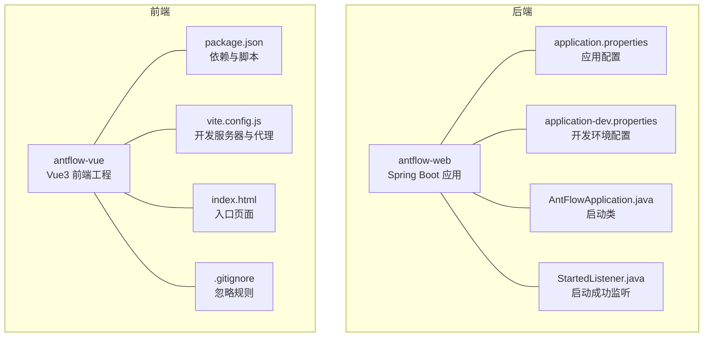
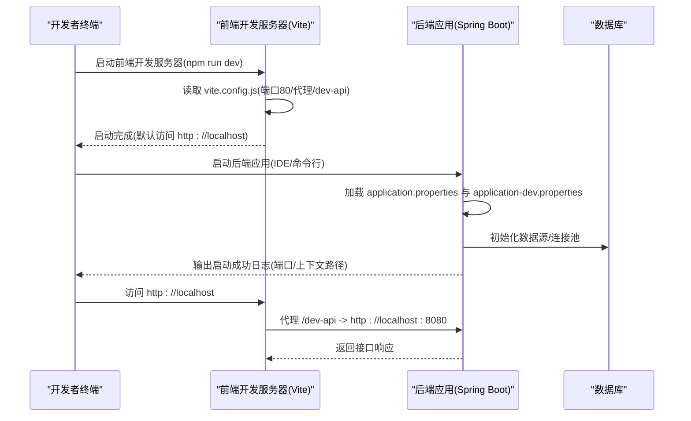
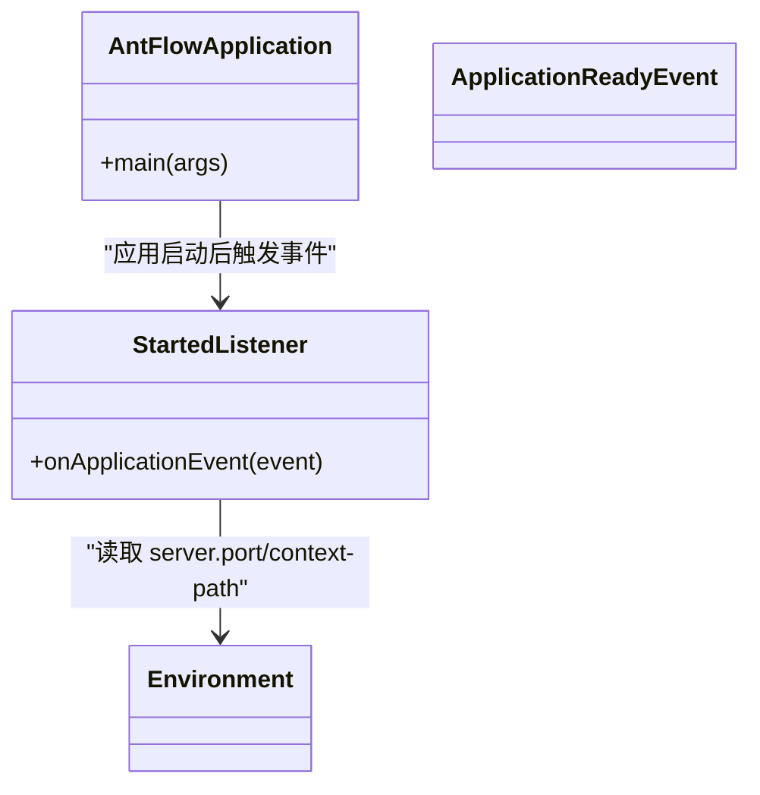
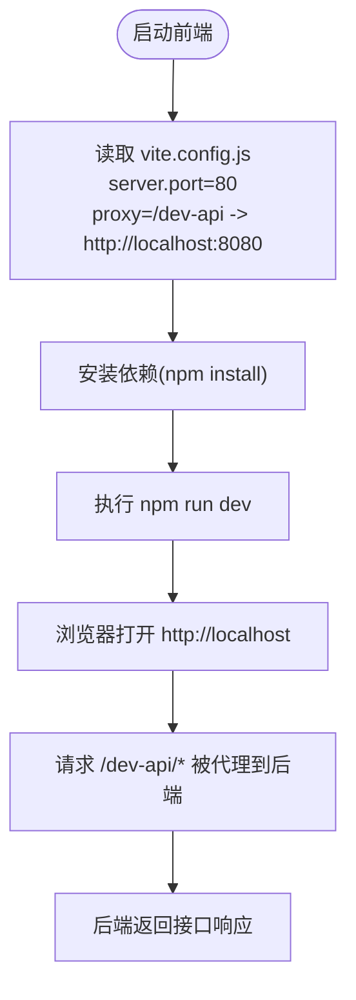
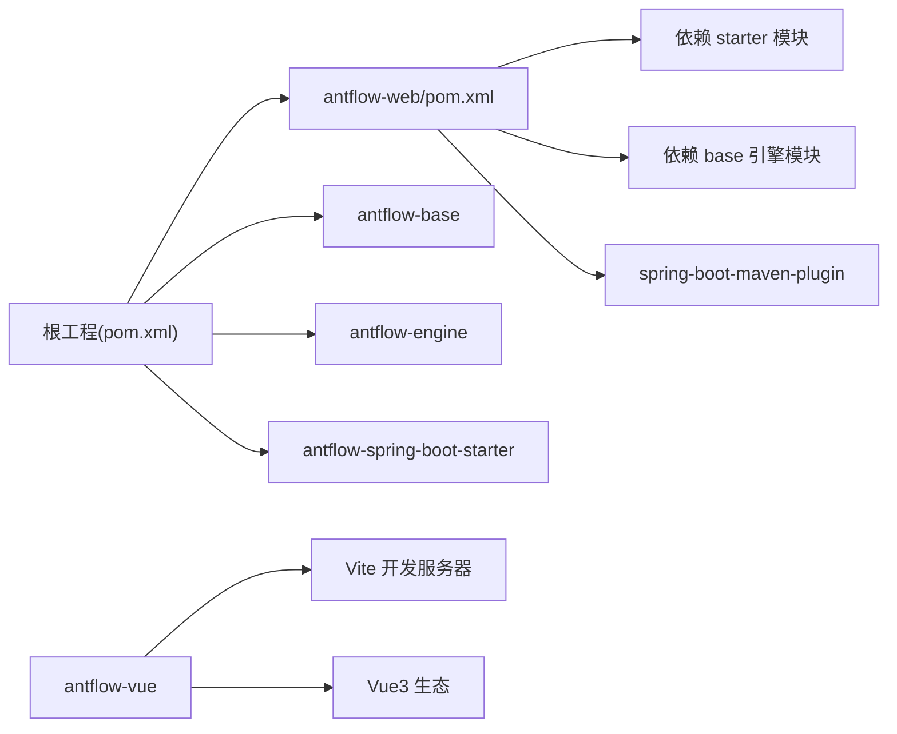

# 启动问题排查

<cite>
**本文引用的文件**
- [pom.xml](file://pom.xml)
- [mvnw.cmd](file://mvnw.cmd)
- [antflow-web/pom.xml](file://antflow-web/pom.xml)
- [antflow-web/src/main/java/org/openoa/AntFlowApplication.java](file://antflow-web/src/main/java/org/openoa/AntFlowApplication.java)
- [antflow-web/src/main/resources/application.properties](file://antflow-web/src/main/resources/application.properties)
- [antflow-web/src/main/resources/application-dev.properties](file://antflow-web/src/main/resources/application-dev.properties)
- [antflow-web/src/main/java/org/openoa/common/config/StartedListener.java](file://antflow-web/src/main/java/org/openoa/common/config/StartedListener.java)
- [antflow-vue/package.json](file://antflow-vue/package.json)
- [antflow-vue/vite.config.js](file://antflow-vue/vite.config.js)
- [antflow-vue/README.md](file://antflow-vue/README.md)
- [antflow-vue/index.html](file://antflow-vue/index.html)
- [antflow-vue/.gitignore](file://antflow-vue/.gitignore)
</cite>

## 目录
1. [简介](#简介)
2. [项目结构](#项目结构)
3. [核心组件](#核心组件)
4. [架构总览](#架构总览)
5. [详细组件分析](#详细组件分析)
6. [依赖关系分析](#依赖关系分析)
7. [性能注意事项](#性能注意事项)
8. [故障排查指南](#故障排查指南)
9. [结论](#结论)
10. [附录](#附录)

## 简介
本指南面向首次或再次启动 AntFlow 项目的研发与运维人员，聚焦两类典型启动失败场景：
- Spring Boot 后端启动失败：涵盖端口占用、JVM 内存不足、数据库连接配置错误等常见问题的诊断与修复步骤。
- Vue.js 前端启动失败：涵盖 Node.js 版本要求、npm 依赖安装失败、端口冲突（默认 80）等问题的排查与解决。

同时提供命令行排查步骤、启动成功的判断标准以及常见错误代码的含义解释，帮助快速定位并解决问题。

## 项目结构
AntFlow 采用多模块 Maven 工程组织，后端主模块为 antflow-web，前端位于 antflow-vue。后端使用 Spring Boot 启动类，前端使用 Vite 开发服务器。

图表来源
- [antflow-web/src/main/java/org/openoa/AntFlowApplication.java:1-17](file://antflow-web/src/main/java/org/openoa/AntFlowApplication.java#L1-L17)
- [antflow-web/src/main/resources/application.properties:1-36](file://antflow-web/src/main/resources/application.properties#L1-L36)
- [antflow-web/src/main/resources/application-dev.properties:1-44](file://antflow-web/src/main/resources/application-dev.properties#L1-L44)
- [antflow-vue/vite.config.js:1-100](file://antflow-vue/vite.config.js#L1-L100)
- [antflow-vue/package.json:1-54](file://antflow-vue/package.json#L1-L54)
- [antflow-vue/index.html:1-215](file://antflow-vue/index.html#L1-L215)
- [antflow-vue/.gitignore:1-24](file://antflow-vue/.gitignore#L1-L24)

章节来源
- [pom.xml:1-236](file://pom.xml#L1-L236)
- [antflow-web/pom.xml:1-66](file://antflow-web/pom.xml#L1-L66)
- [antflow-web/src/main/java/org/openoa/AntFlowApplication.java:1-17](file://antflow-web/src/main/java/org/openoa/AntFlowApplication.java#L1-L17)
- [antflow-web/src/main/resources/application.properties:1-36](file://antflow-web/src/main/resources/application.properties#L1-L36)
- [antflow-web/src/main/resources/application-dev.properties:1-44](file://antflow-web/src/main/resources/application-dev.properties#L1-L44)
- [antflow-vue/vite.config.js:1-100](file://antflow-vue/vite.config.js#L1-L100)
- [antflow-vue/package.json:1-54](file://antflow-vue/package.json#L1-L54)
- [antflow-vue/index.html:1-215](file://antflow-vue/index.html#L1-L215)
- [antflow-vue/.gitignore:1-24](file://antflow-vue/.gitignore#L1-L24)

## 核心组件
- 后端启动类与监听器
  - 启动类负责引导 Spring Boot 应用启动。
  - 启动成功监听器在应用就绪事件中输出启动成功日志，包含端口与上下文路径信息，便于快速确认启动状态。
- 前端开发服务器与代理
  - Vite 开发服务器默认监听 80 端口，并通过代理将 /dev-api 请求转发至后端接口地址（默认 http://localhost:8080）。
  - package.json 提供 dev/build/preview 等脚本，便于一键启动与构建。

章节来源
- [antflow-web/src/main/java/org/openoa/AntFlowApplication.java:1-17](file://antflow-web/src/main/java/org/openoa/AntFlowApplication.java#L1-L17)
- [antflow-web/src/main/java/org/openoa/common/config/StartedListener.java:1-29](file://antflow-web/src/main/java/org/openoa/common/config/StartedListener.java#L1-L29)
- [antflow-vue/vite.config.js:64-81](file://antflow-vue/vite.config.js#L64-L81)
- [antflow-vue/package.json:8-13](file://antflow-vue/package.json#L8-L13)

## 架构总览
后端与前端的启动交互如下：前端开发服务器通过代理将请求转发到后端服务，后端提供 REST 接口与静态资源（如 Swagger 文档入口）。启动成功后，后端会在日志中打印服务地址，前端在浏览器打开默认地址进行访问。

图表来源
- [antflow-vue/vite.config.js:64-81](file://antflow-vue/vite.config.js#L64-L81)
- [antflow-web/src/main/resources/application-dev.properties:1-44](file://antflow-web/src/main/resources/application-dev.properties#L1-L44)
- [antflow-web/src/main/java/org/openoa/common/config/StartedListener.java:20-28](file://antflow-web/src/main/java/org/openoa/common/config/StartedListener.java#L20-L28)

## 详细组件分析

### 后端启动组件分析
- 启动类与插件
  - 启动类位于 antflow-web 模块，使用 Spring Boot 插件打包并指定主类。
  - 父工程 pom.xml 中定义了 Spring Boot 版本与多环境 Profile，确保资源过滤与激活正确。
- 配置文件
  - application.properties 指定活动 Profile 与 Jackson、AOP、Activiti 等基础配置。
  - application-dev.properties 指定后端服务端口、数据库连接参数、Druid/Hikari 连接池参数、MyBatis/MyBatis-Plus 日志级别等。
- 启动成功监听
  - StartedListener 在 ApplicationReadyEvent 事件中输出服务地址与上下文路径，便于快速确认启动成功。

图表来源
- [antflow-web/src/main/java/org/openoa/AntFlowApplication.java:1-17](file://antflow-web/src/main/java/org/openoa/AntFlowApplication.java#L1-L17)
- [antflow-web/src/main/java/org/openoa/common/config/StartedListener.java:1-29](file://antflow-web/src/main/java/org/openoa/common/config/StartedListener.java#L1-L29)

章节来源
- [antflow-web/pom.xml:50-66](file://antflow-web/pom.xml#L50-L66)
- [pom.xml:142-172](file://pom.xml#L142-L172)
- [antflow-web/src/main/resources/application.properties:1-36](file://antflow-web/src/main/resources/application.properties#L1-L36)
- [antflow-web/src/main/resources/application-dev.properties:1-44](file://antflow-web/src/main/resources/application-dev.properties#L1-L44)
- [antflow-web/src/main/java/org/openoa/common/config/StartedListener.java:20-28](file://antflow-web/src/main/java/org/openoa/common/config/StartedListener.java#L20-L28)

### 前端启动组件分析
- 开发服务器与代理
  - vite.config.js 中 server.port 默认 80，host 允许外网访问，open 自动打开浏览器。
  - 通过 proxy 将 /dev-api 前缀请求代理到后端 baseUrl（默认 http://localhost:8080），并支持 swagger 文档代理。
- 依赖与脚本
  - package.json 提供 dev/build/preview 等脚本；.gitignore 忽略 node_modules、dist、lock 文件等。
  - index.html 作为入口页面，包含基础样式与加载动画。

图表来源
- [antflow-vue/vite.config.js:64-81](file://antflow-vue/vite.config.js#L64-L81)
- [antflow-vue/package.json:8-13](file://antflow-vue/package.json#L8-L13)
- [antflow-vue/index.html:1-215](file://antflow-vue/index.html#L1-L215)

章节来源
- [antflow-vue/vite.config.js:1-100](file://antflow-vue/vite.config.js#L1-L100)
- [antflow-vue/package.json:1-54](file://antflow-vue/package.json#L1-L54)
- [antflow-vue/index.html:1-215](file://antflow-vue/index.html#L1-L215)
- [antflow-vue/.gitignore:1-24](file://antflow-vue/.gitignore#L1-L24)

## 依赖关系分析
- 后端模块依赖
  - antflow-web 依赖 spring-boot-starter-web、antflow-base/engine 等模块，并通过 spring-boot-maven-plugin 指定启动类。
- 前端模块依赖
  - 使用 Vite 作为开发服务器与构建工具，依赖 Vue3、Element Plus、Axios 等生态库。
- 环境与包装器
  - 项目提供 Maven Wrapper 启动脚本，确保在未安装 Maven 的环境中也能使用 mvnw.cmd 执行构建。

图表来源
- [pom.xml:6-11](file://pom.xml#L6-L11)
- [antflow-web/pom.xml:20-48](file://antflow-web/pom.xml#L20-L48)
- [antflow-vue/package.json:18-49](file://antflow-vue/package.json#L18-L49)

章节来源
- [pom.xml:1-236](file://pom.xml#L1-L236)
- [antflow-web/pom.xml:1-66](file://antflow-web/pom.xml#L1-L66)
- [antflow-vue/package.json:1-54](file://antflow-vue/package.json#L1-L54)

## 性能注意事项
- 数据库连接池参数
  - application-dev.properties 中配置了 Druid 与 Hikari 的多项参数，建议根据实际并发与数据库性能调优，避免连接超时或抖动。
- 日志级别
  - MyBatis/Activiti 的调试日志级别较高，建议在生产关闭或降低，减少 IO 压力。
- 前端打包优化
  - vite.config.js 对第三方库进行了分包与 sourcemap 控制，建议在生产构建时关闭 sourcemap 以减小体积。

章节来源
- [antflow-web/src/main/resources/application-dev.properties:7-24](file://antflow-web/src/main/resources/application-dev.properties#L7-L24)
- [antflow-web/src/main/resources/application-dev.properties:29-32](file://antflow-web/src/main/resources/application-dev.properties#L29-L32)
- [antflow-vue/vite.config.js:32-62](file://antflow-vue/vite.config.js#L32-L62)

## 故障排查指南

### 一、后端启动失败排查

1) 端口占用（默认 8080 冲突）
- 现象
  - 启动时报端口被占用或启动卡住。
- 诊断步骤
  - 查看启动日志中的端口绑定信息（启动成功监听会输出 server.port）。
  - 使用系统命令查询占用端口的进程并终止。
- 修复方案
  - 修改 application-dev.properties 中的 server.port 为其他可用端口。
  - 或释放占用 8080 的进程。

章节来源
- [antflow-web/src/main/resources/application-dev.properties:1-1](file://antflow-web/src/main/resources/application-dev.properties#L1-L1)
- [antflow-web/src/main/java/org/openoa/common/config/StartedListener.java:22-27](file://antflow-web/src/main/java/org/openoa/common/config/StartedListener.java#L22-L27)

2) JVM 内存不足
- 现象
  - 启动过程中出现 OOM 或长时间 GC。
- 诊断步骤
  - 观察启动日志是否出现内存相关异常。
  - 使用系统监控工具查看内存占用。
- 修复方案
  - 通过 Maven Wrapper 参数传入 JVM 内存配置（如 MAVEN_OPTS）。
  - 调整连接池与缓存大小，降低峰值内存。

章节来源
- [mvnw.cmd:30-33](file://mvnw.cmd#L30-L33)

3) 数据库连接配置错误
- 现象
  - 启动阶段连接数据库失败，报用户名/密码/URL 错误或驱动类找不到。
- 诊断步骤
  - 检查 application-dev.properties 中的数据库 URL、用户名、密码与驱动类。
  - 确认数据库服务可达且网络策略允许访问。
- 修复方案
  - 更新正确的数据库连接信息。
  - 如使用 MySQL，确保驱动类名与版本兼容。

章节来源
- [antflow-web/src/main/resources/application-dev.properties:3-6](file://antflow-web/src/main/resources/application-dev.properties#L3-L6)

4) 启动成功的判断标准
- 成功标志
  - 后端启动成功监听输出服务地址与端口、上下文路径。
  - 前端浏览器打开 http://localhost，页面正常加载。
- 常见错误代码与含义
  - 端口占用：启动日志提示 Address already in use 或类似信息。
  - 数据库连接失败：启动日志出现 SQLNonTransientConnectionException、CommunicationsException 等。
  - 配置文件解析失败：启动日志提示 Cannot resolve placeholder 或配置项缺失。

章节来源
- [antflow-web/src/main/java/org/openoa/common/config/StartedListener.java:22-27](file://antflow-web/src/main/java/org/openoa/common/config/StartedListener.java#L22-L27)
- [antflow-vue/vite.config.js:64-81](file://antflow-vue/vite.config.js#L64-L81)

### 二、前端启动失败排查

1) Node.js 版本要求
- 要求
  - 项目使用 Vite 与现代 ES 模块语法，需满足 Node.js 版本要求。
- 诊断步骤
  - 查看 README 中的运行说明与依赖版本。
- 修复方案
  - 升级 Node.js 至满足要求的版本后再安装依赖与启动。

章节来源
- [antflow-vue/README.md:19-37](file://antflow-vue/README.md#L19-L37)
- [antflow-vue/package.json:1-54](file://antflow-vue/package.json#L1-L54)

2) npm 依赖安装失败
- 现象
  - npm install 报错，常见于网络或权限问题。
- 诊断步骤
  - 查看 npm/yarn 错误日志，确认网络与 registry 配置。
  - 检查 .gitignore 是否误排除了 lock 文件导致重复下载。
- 修复方案
  - 使用国内镜像源重试安装。
  - 清理缓存后重试。

章节来源
- [antflow-vue/.gitignore:22-23](file://antflow-vue/.gitignore#L22-L23)
- [antflow-vue/README.md:28-30](file://antflow-vue/README.md#L28-L30)

3) 端口冲突（默认 80）
- 现象
  - npm run dev 启动后浏览器无法访问，或提示端口被占用。
- 诊断步骤
  - 查看 vite.config.js 中 server.port=80。
  - 使用系统命令查询占用 80 的进程。
- 修复方案
  - 修改 vite.config.js 中的 server.port 为其他可用端口。
  - 或释放占用 80 的进程（需管理员权限）。

章节来源
- [antflow-vue/vite.config.js:64-66](file://antflow-vue/vite.config.js#L64-L66)

4) 代理后端接口失败
- 现象
  - 前端页面空白或接口 404，浏览器 Network 显示 /dev-api 请求失败。
- 诊断步骤
  - 确认后端已启动且监听 8080。
  - 检查 vite.config.js 中 baseUrl 与 proxy 配置。
- 修复方案
  - 确保后端先于前端启动。
  - 如后端端口变更，同步修改 baseUrl 与 proxy。

章节来源
- [antflow-vue/vite.config.js:68-80](file://antflow-vue/vite.config.js#L68-L80)

### 三、通用命令行排查步骤

- 后端
  - 使用 Maven Wrapper 启动：在根目录执行 mvnw.cmd（Windows）或 ./mvnw（Unix）。
  - 查看启动日志：关注 StartedListener 输出的服务地址与端口。
  - 检查配置文件：核对 application.properties 与 application-dev.properties 的端口、数据库连接等。
- 前端
  - 安装依赖：在 antflow-vue 目录执行 npm install。
  - 启动开发服务器：执行 npm run dev。
  - 访问地址：浏览器打开 http://localhost（或修改后的端口）。
  - 检查代理：确认 /dev-api 请求被正确代理到后端。

章节来源
- [mvnw.cmd:1-183](file://mvnw.cmd#L1-L183)
- [antflow-web/src/main/java/org/openoa/common/config/StartedListener.java:22-27](file://antflow-web/src/main/java/org/openoa/common/config/StartedListener.java#L22-L27)
- [antflow-web/src/main/resources/application-dev.properties:1-44](file://antflow-web/src/main/resources/application-dev.properties#L1-L44)
- [antflow-vue/README.md:28-37](file://antflow-vue/README.md#L28-L37)

## 结论
通过明确后端与前端的启动组件、配置文件与开发服务器行为，结合上述排查步骤与判断标准，可高效定位并解决启动失败问题。建议在团队内统一 Node.js、Maven 与数据库版本，规范配置文件命名与端口分配，以减少环境差异带来的启动问题。

## 附录

### A. 启动成功判断清单
- 后端
  - 启动成功监听输出服务地址与端口、上下文路径。
  - 接口可访问（如 Swagger 文档入口）。
- 前端
  - 浏览器打开 http://localhost 正常显示页面。
  - 控制台无跨域与代理错误。

章节来源
- [antflow-web/src/main/java/org/openoa/common/config/StartedListener.java:22-27](file://antflow-web/src/main/java/org/openoa/common/config/StartedListener.java#L22-L27)
- [antflow-vue/vite.config.js:64-81](file://antflow-vue/vite.config.js#L64-L81)