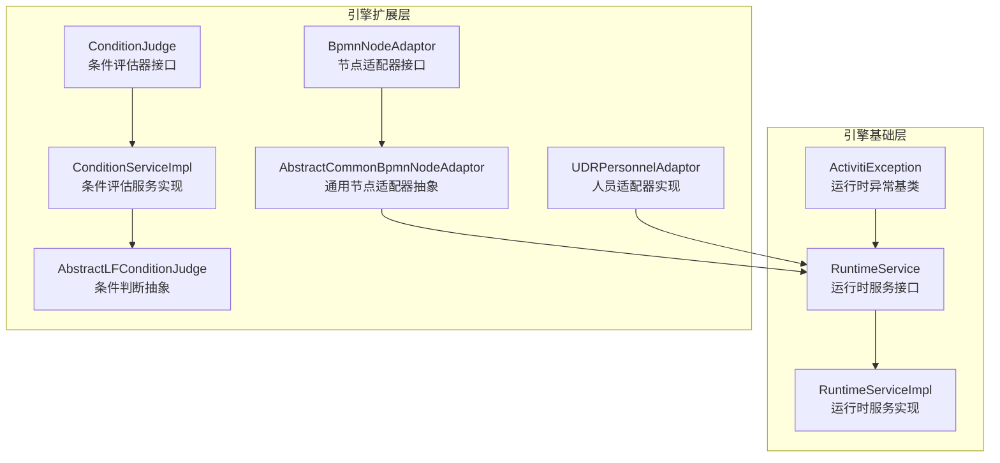
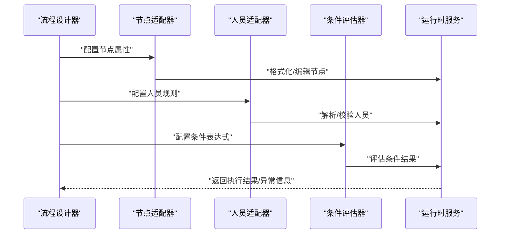
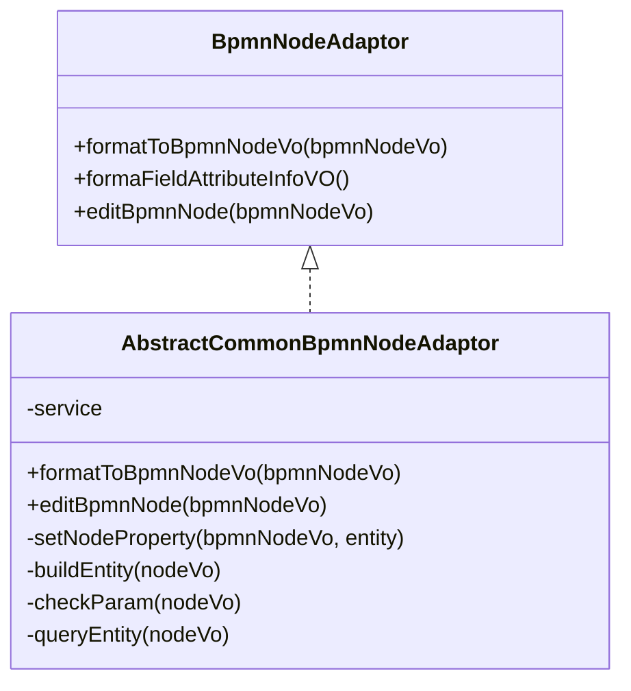
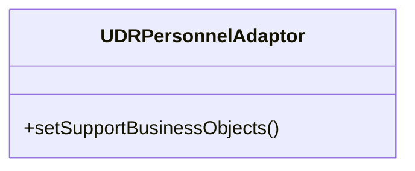
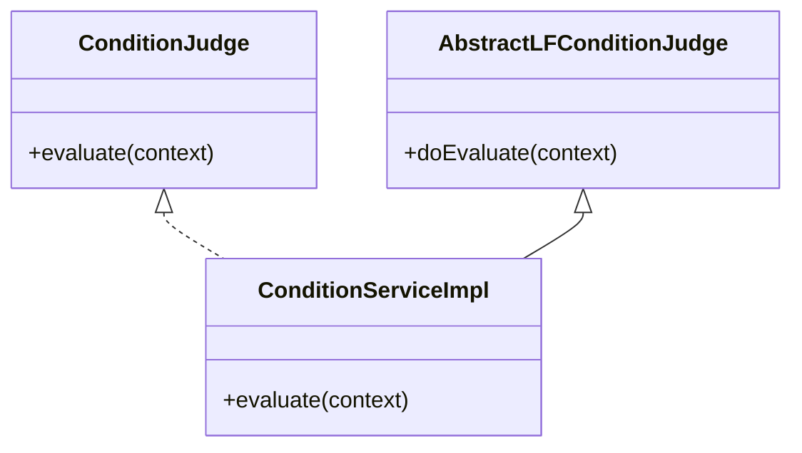
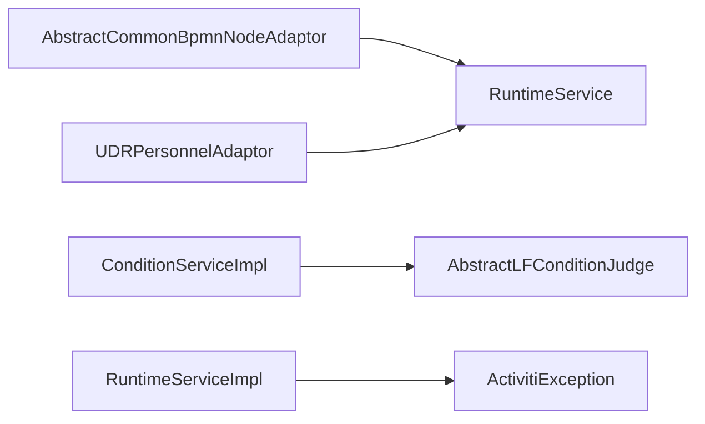

# 工作流执行异常

<cite>
**本文引用的文件**
- [ActivitiException.java](file://antflow-base/src/main/java/org/activiti/engine/ActivitiException.java)
- [BpmnNodeAdaptor.java](file://antflow-engine/src/main/java/org/openoa/engine/bpmnconf/adp/bpmnnodeadp/BpmnNodeAdaptor.java)
- [AbstractCommonBpmnNodeAdaptor.java](file://antflow-engine/src/main/java/org/openoa/engine/bpmnconf/adp/bpmnnodeadp/AbstractCommonBpmnNodeAdaptor.java)
- [UDRPersonnelAdaptor.java](file://antflow-engine/src/main/java/org/openoa/engine/bpmnconf/adp/personneladp/UDRPersonnelAdaptor.java)
- [ConditionJudge.java](file://antflow-engine/src/main/java/org/openoa/engine/bpmnconf/adp/conditionfilter/ConditionJudge.java)
- [ConditionServiceImpl.java](file://antflow-engine/src/main/java/org/openoa/engine/bpmnconf/adp/conditionfilter/ConditionServiceImpl.java)
- [AbstractLFConditionJudge.java](file://antflow-engine/src/main/java/org/openoa/engine/bpmnconf/adp/conditionfilter/conditionjudge/AbstractLFConditionJudge.java)
- [RuntimeService.java](file://antflow-base/src/main/java/org/activiti/engine/RuntimeService.java)
- [RuntimeServiceImpl.java](file://antflow-base/src/main/java/org/activiti/engine/impl/RuntimeServiceImpl.java)
</cite>

## 目录
1. [简介](#简介)
2. [项目结构](#项目结构)
3. [核心组件](#核心组件)
4. [架构总览](#架构总览)
5. [详细组件分析](#详细组件分析)
6. [依赖分析](#依赖分析)
7. [性能考虑](#性能考虑)
8. [故障排除指南](#故障排除指南)
9. [结论](#结论)
10. [附录](#附录)

## 简介
本指南聚焦于工作流执行异常的综合诊断与修复，覆盖流程定义错误、虚拟节点（VNode）执行异常、运行时异常调试、常见错误类型与性能优化建议。通过对项目中工作流引擎与适配器体系的分析，帮助开发者快速定位问题根因并给出可操作的修复路径。

## 项目结构
本项目采用分层与模块化组织方式：
- 引擎基础层：基于 Activiti 的运行时服务与异常体系，提供流程实例、任务、变量等核心能力。
- 引擎扩展层：在 Activiti 基础上扩展了节点适配器、人员适配器、条件评估器等，用于对接业务规则与数据。
- 低代码/可视化层：通过流程设计器与节点属性配置，驱动引擎侧的适配器与执行逻辑。

图表来源
- [RuntimeService.java](file://antflow-base/src/main/java/org/activiti/engine/RuntimeService.java)
- [RuntimeServiceImpl.java](file://antflow-base/src/main/java/org/activiti/engine/impl/RuntimeServiceImpl.java)
- [ActivitiException.java](file://antflow-base/src/main/java/org/activiti/engine/ActivitiException.java)
- [BpmnNodeAdaptor.java](file://antflow-engine/src/main/java/org/openoa/engine/bpmnconf/adp/bpmnnodeadp/BpmnNodeAdaptor.java)
- [AbstractCommonBpmnNodeAdaptor.java](file://antflow-engine/src/main/java/org/openoa/engine/bpmnconf/adp/bpmnnodeadp/AbstractCommonBpmnNodeAdaptor.java)
- [UDRPersonnelAdaptor.java](file://antflow-engine/src/main/java/org/openoa/engine/bpmnconf/adp/personneladp/UDRPersonnelAdaptor.java)
- [ConditionJudge.java](file://antflow-engine/src/main/java/org/openoa/engine/bpmnconf/adp/conditionfilter/ConditionJudge.java)
- [ConditionServiceImpl.java](file://antflow-engine/src/main/java/org/openoa/engine/bpmnconf/adp/conditionfilter/ConditionServiceImpl.java)
- [AbstractLFConditionJudge.java](file://antflow-engine/src/main/java/org/openoa/engine/bpmnconf/adp/conditionfilter/conditionjudge/AbstractLFConditionJudge.java)

章节来源
- [RuntimeService.java](file://antflow-base/src/main/java/org/activiti/engine/RuntimeService.java)
- [RuntimeServiceImpl.java](file://antflow-base/src/main/java/org/activiti/engine/impl/RuntimeServiceImpl.java)
- [ActivitiException.java](file://antflow-base/src/main/java/org/activiti/engine/ActivitiException.java)
- [BpmnNodeAdaptor.java](file://antflow-engine/src/main/java/org/openoa/engine/bpmnconf/adp/bpmnnodeadp/BpmnNodeAdaptor.java)
- [AbstractCommonBpmnNodeAdaptor.java](file://antflow-engine/src/main/java/org/openoa/engine/bpmnconf/adp/bpmnnodeadp/AbstractCommonBpmnNodeAdaptor.java)
- [UDRPersonnelAdaptor.java](file://antflow-engine/src/main/java/org/openoa/engine/bpmnconf/adp/personneladp/UDRPersonnelAdaptor.java)
- [ConditionJudge.java](file://antflow-engine/src/main/java/org/openoa/engine/bpmnconf/adp/conditionfilter/ConditionJudge.java)
- [ConditionServiceImpl.java](file://antflow-engine/src/main/java/org/openoa/engine/bpmnconf/adp/conditionfilter/ConditionServiceImpl.java)
- [AbstractLFConditionJudge.java](file://antflow-engine/src/main/java/org/openoa/engine/bpmnconf/adp/conditionfilter/conditionjudge/AbstractLFConditionJudge.java)

## 核心组件
- 运行时服务与异常体系
  - 运行时服务接口负责流程实例启动、变量设置、任务推进等核心操作；实现类承载具体执行逻辑。
  - 异常基类为所有运行时异常提供统一包装，便于捕获与追踪。
- 节点适配器与通用适配器
  - 节点适配器接口定义格式化与编辑节点的能力；通用适配器抽象封装了实体查询、参数校验与批量保存等通用流程。
- 人员适配器
  - 以 UDR 人员适配器为例，展示如何通过构造函数注入员工信息服务与人员提供服务，实现对特定业务对象的支持。
- 条件评估器
  - 条件评估器接口与服务实现定义了条件判断的契约与默认实现；抽象条件判断类提供扩展点。

章节来源
- [RuntimeService.java](file://antflow-base/src/main/java/org/activiti/engine/RuntimeService.java)
- [RuntimeServiceImpl.java](file://antflow-base/src/main/java/org/activiti/engine/impl/RuntimeServiceImpl.java)
- [ActivitiException.java](file://antflow-base/src/main/java/org/activiti/engine/ActivitiException.java)
- [BpmnNodeAdaptor.java](file://antflow-engine/src/main/java/org/openoa/engine/bpmnconf/adp/bpmnnodeadp/BpmnNodeAdaptor.java)
- [AbstractCommonBpmnNodeAdaptor.java](file://antflow-engine/src/main/java/org/openoa/engine/bpmnconf/adp/bpmnnodeadp/AbstractCommonBpmnNodeAdaptor.java)
- [UDRPersonnelAdaptor.java](file://antflow-engine/src/main/java/org/openoa/engine/bpmnconf/adp/personneladp/UDRPersonnelAdaptor.java)
- [ConditionJudge.java](file://antflow-engine/src/main/java/org/openoa/engine/bpmnconf/adp/conditionfilter/ConditionJudge.java)
- [ConditionServiceImpl.java](file://antflow-engine/src/main/java/org/openoa/engine/bpmnconf/adp/conditionfilter/ConditionServiceImpl.java)
- [AbstractLFConditionJudge.java](file://antflow-engine/src/main/java/org/openoa/engine/bpmnconf/adp/conditionfilter/conditionjudge/AbstractLFConditionJudge.java)

## 架构总览
下图展示了从流程定义到执行的关键链路：流程定义经由节点/人员/条件适配器映射到运行时服务，最终驱动流程实例推进与任务处理。

图表来源
- [BpmnNodeAdaptor.java](file://antflow-engine/src/main/java/org/openoa/engine/bpmnconf/adp/bpmnnodeadp/BpmnNodeAdaptor.java)
- [AbstractCommonBpmnNodeAdaptor.java](file://antflow-engine/src/main/java/org/openoa/engine/bpmnconf/adp/bpmnnodeadp/AbstractCommonBpmnNodeAdaptor.java)
- [UDRPersonnelAdaptor.java](file://antflow-engine/src/main/java/org/openoa/engine/bpmnconf/adp/personneladp/UDRPersonnelAdaptor.java)
- [ConditionJudge.java](file://antflow-engine/src/main/java/org/openoa/engine/bpmnconf/adp/conditionfilter/ConditionJudge.java)
- [ConditionServiceImpl.java](file://antflow-engine/src/main/java/org/openoa/engine/bpmnconf/adp/conditionfilter/ConditionServiceImpl.java)
- [RuntimeService.java](file://antflow-base/src/main/java/org/activiti/engine/RuntimeService.java)

## 详细组件分析

### 组件A：节点适配器与通用适配器
- 角色与职责
  - 节点适配器接口定义格式化节点与编辑节点的能力；通用适配器抽象封装了实体查询、参数校验与批量保存等通用流程。
- 关键流程
  - 格式化阶段：根据节点 ID 查询持久化实体，并将实体属性写入节点视图对象。
  - 编辑阶段：校验参数合法性，构建实体集合，批量保存。
- 可能的异常点
  - 实体查询为空或重复导致的空指针。
  - 参数校验失败导致的流程中断。
  - 批量保存失败导致的状态不一致。

图表来源
- [BpmnNodeAdaptor.java](file://antflow-engine/src/main/java/org/openoa/engine/bpmnconf/adp/bpmnnodeadp/BpmnNodeAdaptor.java)
- [AbstractCommonBpmnNodeAdaptor.java](file://antflow-engine/src/main/java/org/openoa/engine/bpmnconf/adp/bpmnnodeadp/AbstractCommonBpmnNodeAdaptor.java)

章节来源
- [BpmnNodeAdaptor.java](file://antflow-engine/src/main/java/org/openoa/engine/bpmnconf/adp/bpmnnodeadp/BpmnNodeAdaptor.java)
- [AbstractCommonBpmnNodeAdaptor.java](file://antflow-engine/src/main/java/org/openoa/engine/bpmnconf/adp/bpmnnodeadp/AbstractCommonBpmnNodeAdaptor.java)

### 组件B：人员适配器（以 UDR 为例）
- 角色与职责
  - 通过构造函数注入员工信息服务与人员提供服务，声明支持的业务对象类型。
- 关键流程
  - 初始化阶段绑定服务实例。
  - 在流程执行时根据节点配置解析人员集合。
- 可能的异常点
  - 服务注入缺失导致空指针。
  - 支持的业务对象类型不匹配导致解析失败。

图表来源
- [UDRPersonnelAdaptor.java](file://antflow-engine/src/main/java/org/openoa/engine/bpmnconf/adp/personneladp/UDRPersonnelAdaptor.java)

章节来源
- [UDRPersonnelAdaptor.java](file://antflow-engine/src/main/java/org/openoa/engine/bpmnconf/adp/personneladp/UDRPersonnelAdaptor.java)

### 组件C：条件评估器
- 角色与职责
  - 条件评估器接口定义评估契约；服务实现提供默认评估逻辑；抽象条件判断类提供扩展点。
- 关键流程
  - 表达式解析与求值。
  - 结果判定与回传。
- 可能的异常点
  - 表达式语法错误。
  - 变量缺失或类型不匹配导致求值失败。

图表来源
- [ConditionJudge.java](file://antflow-engine/src/main/java/org/openoa/engine/bpmnconf/adp/conditionfilter/ConditionJudge.java)
- [ConditionServiceImpl.java](file://antflow-engine/src/main/java/org/openoa/engine/bpmnconf/adp/conditionfilter/ConditionServiceImpl.java)
- [AbstractLFConditionJudge.java](file://antflow-engine/src/main/java/org/openoa/engine/bpmnconf/adp/conditionfilter/conditionjudge/AbstractLFConditionJudge.java)

章节来源
- [ConditionJudge.java](file://antflow-engine/src/main/java/org/openoa/engine/bpmnconf/adp/conditionfilter/ConditionJudge.java)
- [ConditionServiceImpl.java](file://antflow-engine/src/main/java/org/openoa/engine/bpmnconf/adp/conditionfilter/ConditionServiceImpl.java)
- [AbstractLFConditionJudge.java](file://antflow-engine/src/main/java/org/openoa/engine/bpmnconf/adp/conditionfilter/conditionjudge/AbstractLFConditionJudge.java)

### 组件D：运行时服务与异常体系
- 角色与职责
  - 运行时服务接口定义流程实例、变量、任务等操作；实现类承载具体执行逻辑；异常基类统一包装运行时异常。
- 关键流程
  - 启动流程实例、设置变量、推进执行、查询状态。
- 可能的异常点
  - 流程定义不存在、变量类型不匹配、任务不存在等。

```mermaid
classDiagram
class RuntimeService {
+startProcessInstanceByKey(key, variables)
+setVariable(executionId, variable, value)
+createTask(taskDefinitionKey, assignee)
}
class RuntimeServiceImpl {
+startProcessInstanceByKey(key, variables)
+setVariable(executionId, variable, value)
+createTask(taskDefinitionKey, assignee)
}
class ActivitiException {
+ActivitiException(message, cause)
+ActivitiException(message)
}
RuntimeService <|.. RuntimeServiceImpl
ActivitiException <.. RuntimeServiceImpl
```

图表来源
- [RuntimeService.java](file://antflow-base/src/main/java/org/activiti/engine/RuntimeService.java)
- [RuntimeServiceImpl.java](file://antflow-base/src/main/java/org/activiti/engine/impl/RuntimeServiceImpl.java)
- [ActivitiException.java](file://antflow-base/src/main/java/org/activiti/engine/ActivitiException.java)

章节来源
- [RuntimeService.java](file://antflow-base/src/main/java/org/activiti/engine/RuntimeService.java)
- [RuntimeServiceImpl.java](file://antflow-base/src/main/java/org/activiti/engine/impl/RuntimeServiceImpl.java)
- [ActivitiException.java](file://antflow-base/src/main/java/org/activiti/engine/ActivitiException.java)

## 依赖分析
- 组件耦合
  - 通用节点适配器依赖服务接口进行实体持久化，体现良好的分层与依赖倒置。
  - 人员适配器通过构造函数注入服务，避免硬编码依赖。
  - 条件评估器通过接口与抽象类解耦具体实现。
- 外部依赖
  - 运行时服务依赖 Activiti 引擎提供的执行能力。
- 潜在风险
  - 服务注入缺失或配置错误可能导致空指针异常。
  - 条件表达式与变量类型不匹配可能导致求值失败。

图表来源
- [AbstractCommonBpmnNodeAdaptor.java](file://antflow-engine/src/main/java/org/openoa/engine/bpmnconf/adp/bpmnnodeadp/AbstractCommonBpmnNodeAdaptor.java)
- [UDRPersonnelAdaptor.java](file://antflow-engine/src/main/java/org/openoa/engine/bpmnconf/adp/personneladp/UDRPersonnelAdaptor.java)
- [ConditionServiceImpl.java](file://antflow-engine/src/main/java/org/openoa/engine/bpmnconf/adp/conditionfilter/ConditionServiceImpl.java)
- [AbstractLFConditionJudge.java](file://antflow-engine/src/main/java/org/openoa/engine/bpmnconf/adp/conditionfilter/conditionjudge/AbstractLFConditionJudge.java)
- [RuntimeServiceImpl.java](file://antflow-base/src/main/java/org/activiti/engine/impl/RuntimeServiceImpl.java)
- [ActivitiException.java](file://antflow-base/src/main/java/org/activiti/engine/ActivitiException.java)

章节来源
- [AbstractCommonBpmnNodeAdaptor.java](file://antflow-engine/src/main/java/org/openoa/engine/bpmnconf/adp/bpmnnodeadp/AbstractCommonBpmnNodeAdaptor.java)
- [UDRPersonnelAdaptor.java](file://antflow-engine/src/main/java/org/openoa/engine/bpmnconf/adp/personneladp/UDRPersonnelAdaptor.java)
- [ConditionServiceImpl.java](file://antflow-engine/src/main/java/org/openoa/engine/bpmnconf/adp/conditionfilter/ConditionServiceImpl.java)
- [AbstractLFConditionJudge.java](file://antflow-engine/src/main/java/org/openoa/engine/bpmnconf/adp/conditionfilter/conditionjudge/AbstractLFConditionJudge.java)
- [RuntimeServiceImpl.java](file://antflow-base/src/main/java/org/activiti/engine/impl/RuntimeServiceImpl.java)
- [ActivitiException.java](file://antflow-base/src/main/java/org/activiti/engine/ActivitiException.java)

## 性能考虑
- 批量持久化
  - 通用节点适配器在编辑节点时采用批量保存策略，减少多次数据库往返，提升吞吐。
- 表达式求值
  - 条件评估器应避免复杂表达式与频繁变量访问，必要时缓存中间结果。
- 人员解析
  - 人员适配器在解析大量人员时应考虑分页与去重，避免重复查询与内存占用过高。
- 异常开销
  - 统一异常包装有助于快速定位问题，但应避免过度捕获与重复日志输出。

## 故障排除指南

### 流程定义错误的识别与修复
- BPMN 节点配置错误
  - 现象：节点无法进入或无法退出，流程卡死。
  - 定位技巧：核对节点 ID、名称、边界事件与子流程配置；检查节点属性是否被适配器正确格式化。
  - 修复建议：确保节点 ID 唯一且与流程定义一致；确认通用适配器已正确查询并写入节点属性。
- 流程边界条件设置不当
  - 现象：条件表达式不生效或抛出异常。
  - 定位技巧：检查表达式语法与变量命名；确认变量已在流程启动前设置。
  - 修复建议：简化表达式并逐步验证；确保变量类型与表达式期望一致。
- 节点间连接关系错误
  - 现象：流程分支不按预期执行。
  - 定位技巧：核对顺序流的条件表达式与默认流向；检查并行网关的分支同步。
  - 修复建议：明确每个顺序流的触发条件，避免默认流与条件流冲突。

### 虚拟节点（VNode）执行异常
- 节点适配器实现错误
  - 现象：节点属性未生效或编辑失败。
  - 定位技巧：检查通用适配器的参数校验与实体构建逻辑；确认服务注入与查询条件。
  - 修复建议：完善参数校验与异常处理；确保查询条件唯一性与健壮性。
- 条件评估器异常
  - 现象：条件判断结果异常或抛出异常。
  - 定位技巧：检查表达式上下文变量是否存在；确认抽象条件判断的扩展实现是否正确。
  - 修复建议：在评估前校验上下文完整性；为表达式提供默认安全值。
- 人员适配器配置问题
  - 现象：人员解析失败或为空。
  - 定位技巧：检查构造函数注入的服务实例；确认支持的业务对象类型声明。
  - 修复建议：确保服务实例可用且已初始化；核对业务对象类型与节点配置一致。

### 工作流运行时异常调试
- 流程实例状态检查
  - 使用运行时服务查询流程实例状态与变量，确认实例是否正常推进。
- 任务节点执行记录分析
  - 通过历史服务与运行时服务结合，查看任务创建、分配、完成记录，定位执行断点。
- 变量传递问题排查
  - 核对变量命名、类型与作用域；在关键节点打印变量快照，确认传递链路。

### 常见工作流执行错误与解决方案
- 空指针异常
  - 典型场景：服务注入缺失、实体查询为空、表达式上下文变量缺失。
  - 解决方案：在关键步骤添加非空校验与默认值；确保服务实例可用；完善异常包装与日志。
- 类型转换错误
  - 典型场景：变量类型与表达式期望不一致。
  - 解决方案：在设置变量时进行显式类型转换；在表达式中进行类型校验。
- 循环引用问题
  - 典型场景：并行网关分支未正确汇聚，导致流程无法结束。
  - 解决方案：明确分支汇聚策略；为并行分支设置超时与兜底逻辑。

## 结论
通过将流程定义、节点/人员/条件适配器与运行时服务有机结合，本项目提供了可扩展的工作流执行框架。针对执行异常，建议从“定义—适配—执行”三个层面逐层排查，并结合统一异常包装与日志体系快速定位问题根因。同时，关注批量持久化、表达式求值与人员解析的性能与稳定性，持续优化执行效率与可靠性。

## 附录
- 术语
  - VNode：虚拟节点，通过适配器映射到实际 BPMN 节点。
  - 适配器：用于将业务配置映射到引擎执行逻辑的组件。
  - 条件评估器：用于计算表达式与判定分支走向的组件。
- 参考文件
  - [RuntimeService.java](file://antflow-base/src/main/java/org/activiti/engine/RuntimeService.java)
  - [RuntimeServiceImpl.java](file://antflow-base/src/main/java/org/activiti/engine/impl/RuntimeServiceImpl.java)
  - [ActivitiException.java](file://antflow-base/src/main/java/org/activiti/engine/ActivitiException.java)
  - [BpmnNodeAdaptor.java](file://antflow-engine/src/main/java/org/openoa/engine/bpmnconf/adp/bpmnnodeadp/BpmnNodeAdaptor.java)
  - [AbstractCommonBpmnNodeAdaptor.java](file://antflow-engine/src/main/java/org/openoa/engine/bpmnconf/adp/bpmnnodeadp/AbstractCommonBpmnNodeAdaptor.java)
  - [UDRPersonnelAdaptor.java](file://antflow-engine/src/main/java/org/openoa/engine/bpmnconf/adp/personneladp/UDRPersonnelAdaptor.java)
  - [ConditionJudge.java](file://antflow-engine/src/main/java/org/openoa/engine/bpmnconf/adp/conditionfilter/ConditionJudge.java)
  - [ConditionServiceImpl.java](file://antflow-engine/src/main/java/org/openoa/engine/bpmnconf/adp/conditionfilter/ConditionServiceImpl.java)
  - [AbstractLFConditionJudge.java](file://antflow-engine/src/main/java/org/openoa/engine/bpmnconf/adp/conditionfilter/conditionjudge/AbstractLFConditionJudge.java)