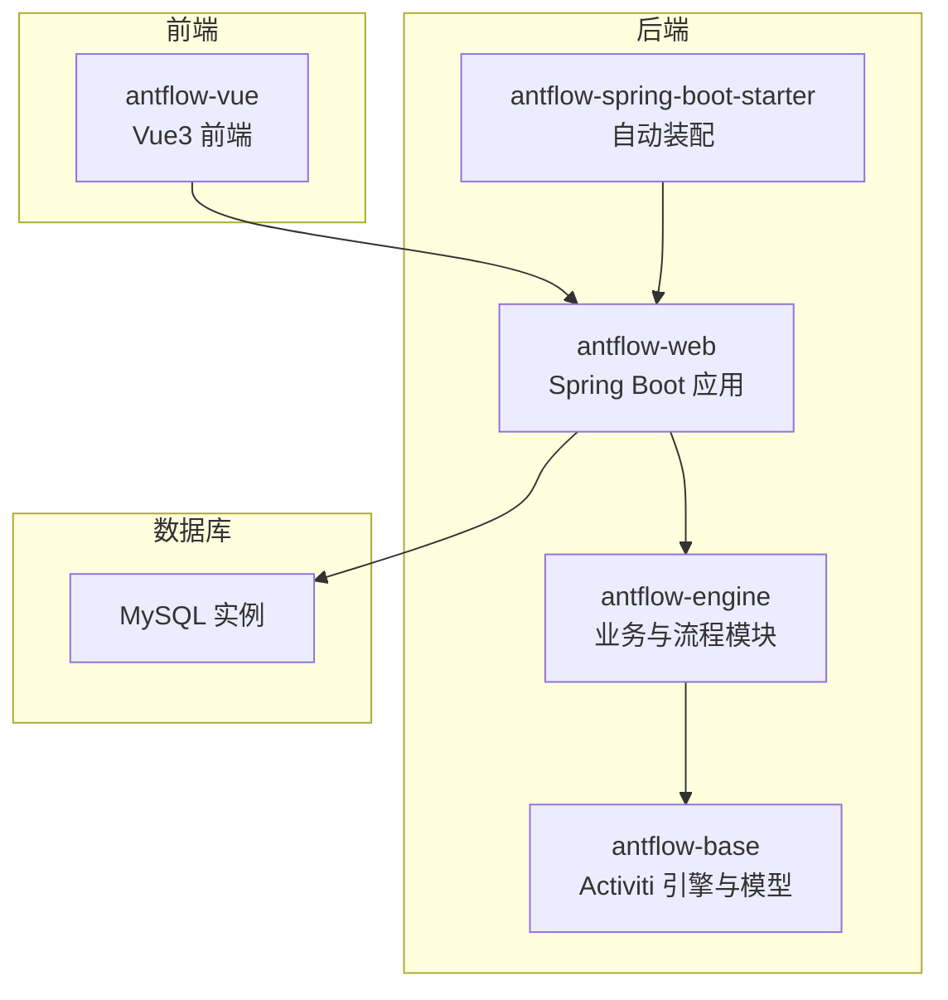
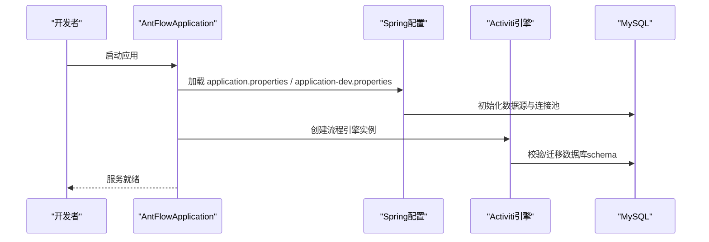
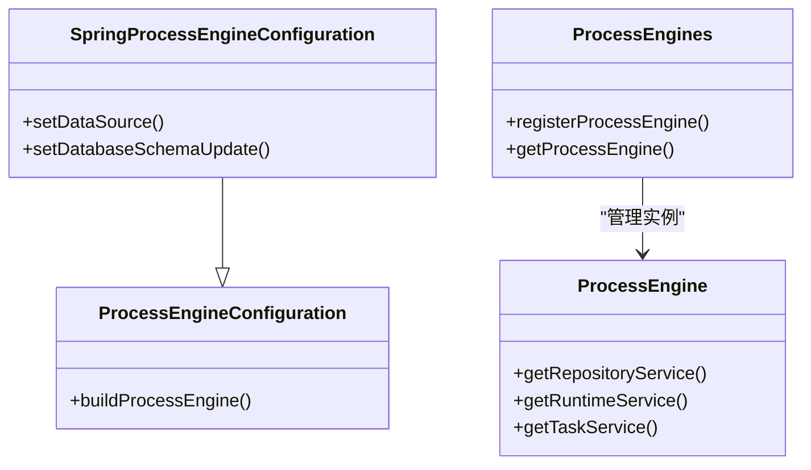
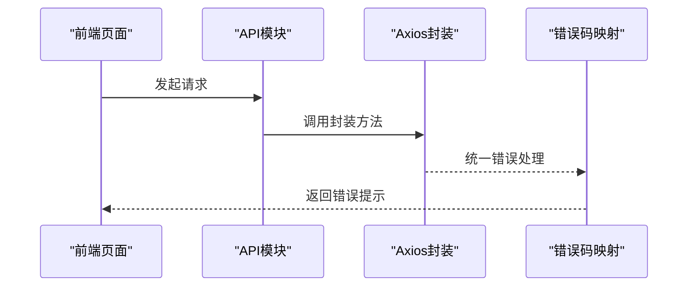
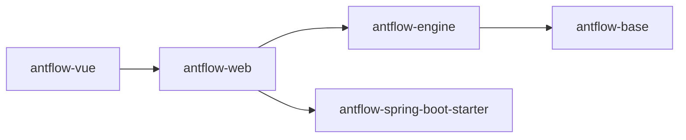

# 常见问题解决

<cite>
**本文引用的文件**
- [application.properties](file://antflow-web/src/main/resources/application.properties)
- [application-dev.properties](file://antflow-web/src/main/resources/application-dev.properties)
- [logback-spring.xml](file://antflow-web/src/main/resources/logback-spring.xml)
- [AntFlowApplication.java](file://antflow-web/src/main/java/org/openoa/AntFlowApplication.java)
- [SpringProcessEngineConfiguration.java](file://antflow-base/src/main/java/org/activiti/spring/SpringProcessEngineConfiguration.java)
- [ProcessEngineConfiguration.java](file://antflow-base/src/main/java/org/activiti/engine/ProcessEngineConfiguration.java)
- [ActivitiWrongDbException.java](file://antflow-base/src/main/java/org/activiti/engine/ActivitiWrongDbException.java)
- [ProcessEngine.java](file://antflow-base/src/main/java/org/activiti/engine/ProcessEngine.java)
- [ProcessEngineLifecycleListener.java](file://antflow-base/src/main/java/org/activiti/engine/ProcessEngineLifecycleListener.java)
- [ProcessEngines.java](file://antflow-base/src/main/java/org/activiti/engine/ProcessEngines.java)
- [AntFlowAutoConfiguration.java](file://antflow-spring-boot-starter/src/main/java/org/openoa/starter/config/AntFlowAutoConfiguration.java)
- [AntFlowConstants.java](file://antflow-engine/src/main/java/org/openoa/engine/bpmnconf/constant/AntFlowConstants.java)
- [BpmnConfController.java](file://antflow-engine/src/main/java/org/openoa/engine/bpmnconf/controller/BpmnConfController.java)
- [BpmnNodeMapper.java](file://antflow-engine/src/main/java/org/openoa/engine/bpmnconf/mapper/BpmnNodeMapper.java)
- [BpmnNodeMapper.xml](file://antflow-engine/src/main/resources/mapper/BpmnNodeMapper.xml)
- [BpmnConfMapper.java](file://antflow-engine/src/main/java/org/openoa/engine/bpmnconf/mapper/BpmnConfMapper.java)
- [BpmnConfMapper.xml](file://antflow-engine/src/main/resources/mapper/BpmnConfMapper.xml)
- [BpmnConfNodePropertyConverter.java](file://antflow-engine/src/main/java/org/openoa/engine/utils/BpmnConfNodePropertyConverter.java)
- [BpmnUtils.java](file://antflow-engine/src/main/java/org/openoa/engine/utils/BpmnUtils.java)
- [BpmnConfController.java](file://antflow-engine/src/main/java/org/openoa/engine/bpmnconf/controller/BpmnConfController.java)
- [user.js](file://antflow-vue/src/api/system/user.js)
- [request.js](file://antflow-vue/src/utils/request.js)
- [axios.js](file://antflow-vue/src/utils/axios.js)
- [errorCode.js](file://antflow-vue/src/utils/errorCode.js)
- [index.html](file://antflow-vue/index.html)
- [vite.config.js](file://antflow-vue/vite.config.js)
- [低代码版本.md](file://doc/系统操作手册-低代码版本.md)
- [系统集成.md](file://doc/系统集成与扩展开发篇/系统集成.md)
</cite>

## 目录
1. [简介](#简介)
2. [项目结构](#项目结构)
3. [核心组件](#核心组件)
4. [架构总览](#架构总览)
5. [详细组件分析](#详细组件分析)
6. [依赖关系分析](#依赖关系分析)
7. [性能考虑](#性能考虑)
8. [故障排查指南](#故障排查指南)
9. [结论](#结论)
10. [附录](#附录)

## 简介
本指南面向运维与开发人员，聚焦于启动失败、数据库连接、工作流执行异常、前端页面问题以及系统性能瓶颈的快速定位与解决。内容基于仓库中的实际配置与代码实现，提供可操作的命令行与配置示例路径，帮助在真实环境中高效排障。

## 项目结构
AntFlow采用前后端分离与模块化分层设计：后端由Spring Boot工程与Activiti引擎组成，前端为Vue3项目，通过REST API交互；同时提供Spring Boot Starter便于集成。

图示来源
- [AntFlowApplication.java](file://antflow-web/src/main/java/org/openoa/AntFlowApplication.java)
- [SpringProcessEngineConfiguration.java](file://antflow-base/src/main/java/org/activiti/spring/SpringProcessEngineConfiguration.java)
- [AntFlowAutoConfiguration.java](file://antflow-spring-boot-starter/src/main/java/org/openoa/starter/config/AntFlowAutoConfiguration.java)

章节来源
- [application.properties](file://antflow-web/src/main/resources/application.properties)
- [application-dev.properties](file://antflow-web/src/main/resources/application-dev.properties)

## 核心组件
- 启动与配置
  - 应用入口与自动装配：Spring Boot应用入口类负责启动，Starter提供自动装配能力。
  - 数据源与连接池：dev环境默认使用Druid/HikariCP连接池配置，生产需按需调整。
  - 日志与慢SQL：Logback配置输出业务日志、SQL日志与慢SQL日志，便于问题定位。
- 流程引擎
  - Activiti引擎通过Spring配置注入，支持数据库schema更新策略与生命周期监听。
  - 工作流配置与节点映射：BPMN配置与节点映射通过MyBatis XML与实体类维护。
- 前端交互
  - Axios封装与错误码处理：统一拦截器、错误码映射与跨域配置。
  - 构建与静态资源：Vite构建工具与HTML入口。

章节来源
- [AntFlowApplication.java](file://antflow-web/src/main/java/org/openoa/AntFlowApplication.java)
- [application.properties](file://antflow-web/src/main/resources/application.properties)
- [application-dev.properties](file://antflow-web/src/main/resources/application-dev.properties)
- [logback-spring.xml](file://antflow-web/src/main/resources/logback-spring.xml)
- [SpringProcessEngineConfiguration.java](file://antflow-base/src/main/java/org/activiti/spring/SpringProcessEngineConfiguration.java)
- [BpmnConfMapper.java](file://antflow-engine/src/main/java/org/openoa/engine/bpmnconf/mapper/BpmnConfMapper.java)
- [BpmnConfMapper.xml](file://antflow-engine/src/main/resources/mapper/BpmnConfMapper.xml)
- [request.js](file://antflow-vue/src/utils/request.js)
- [axios.js](file://antflow-vue/src/utils/axios.js)
- [errorCode.js](file://antflow-vue/src/utils/errorCode.js)

## 架构总览
系统启动与请求处理的关键链路如下：

图示来源
- [AntFlowApplication.java](file://antflow-web/src/main/java/org/openoa/AntFlowApplication.java)
- [application.properties](file://antflow-web/src/main/resources/application.properties)
- [application-dev.properties](file://antflow-web/src/main/resources/application-dev.properties)
- [SpringProcessEngineConfiguration.java](file://antflow-base/src/main/java/org/activiti/spring/SpringProcessEngineConfiguration.java)

## 详细组件分析

### 启动与配置组件
- 应用入口与自动装配
  - 入口类负责扫描与启动，Starter提供自动装配，确保引擎与业务模块被正确加载。
- 数据源与连接池
  - dev环境默认启用Druid/HikariCP参数，包含空闲、最大活跃、超时、心跳与校验查询等配置。
- 日志与慢SQL
  - SQL日志与慢SQL日志分别落盘，便于定位慢查询与异常SQL。

章节来源
- [AntFlowApplication.java](file://antflow-web/src/main/java/org/openoa/AntFlowApplication.java)
- [AntFlowAutoConfiguration.java](file://antflow-spring-boot-starter/src/main/java/org/openoa/starter/config/AntFlowAutoConfiguration.java)
- [application-dev.properties](file://antflow-web/src/main/resources/application-dev.properties)
- [logback-spring.xml](file://antflow-web/src/main/resources/logback-spring.xml)

### 流程引擎组件
- 引擎配置与生命周期
  - Spring配置注入引擎，支持数据库schema更新策略与生命周期监听器。
- 工作流配置与节点映射
  - BPMN配置与节点属性转换器、工具类负责解析与校验，映射XML与实体类。

图示来源
- [ProcessEngineConfiguration.java](file://antflow-base/src/main/java/org/activiti/engine/ProcessEngineConfiguration.java)
- [SpringProcessEngineConfiguration.java](file://antflow-base/src/main/java/org/activiti/spring/SpringProcessEngineConfiguration.java)
- [ProcessEngine.java](file://antflow-base/src/main/java/org/activiti/engine/ProcessEngine.java)
- [ProcessEngines.java](file://antflow-base/src/main/java/org/activiti/engine/ProcessEngines.java)

章节来源
- [SpringProcessEngineConfiguration.java](file://antflow-base/src/main/java/org/activiti/spring/SpringProcessEngineConfiguration.java)
- [ProcessEngineLifecycleListener.java](file://antflow-base/src/main/java/org/activiti/engine/ProcessEngineLifecycleListener.java)
- [ActivitiWrongDbException.java](file://antflow-base/src/main/java/org/activiti/engine/ActivitiWrongDbException.java)

### 前端交互组件
- 请求封装与错误码
  - Axios封装统一处理请求与响应，错误码映射便于前端展示与定位。
- 构建与静态资源
  - Vite配置与HTML入口，支持开发与生产构建。

图示来源
- [user.js](file://antflow-vue/src/api/system/user.js)
- [request.js](file://antflow-vue/src/utils/request.js)
- [axios.js](file://antflow-vue/src/utils/axios.js)
- [errorCode.js](file://antflow-vue/src/utils/errorCode.js)

章节来源
- [user.js](file://antflow-vue/src/api/system/user.js)
- [request.js](file://antflow-vue/src/utils/request.js)
- [axios.js](file://antflow-vue/src/utils/axios.js)
- [errorCode.js](file://antflow-vue/src/utils/errorCode.js)
- [index.html](file://antflow-vue/index.html)
- [vite.config.js](file://antflow-vue/vite.config.js)

## 依赖关系分析
- 后端模块耦合
  - antflow-web 依赖 antflow-engine 与 antflow-base，Starter提供自动装配。
- 前端依赖
  - 前端通过API模块与后端交互，统一使用Axios封装。

图示来源
- [AntFlowApplication.java](file://antflow-web/src/main/java/org/openoa/AntFlowApplication.java)
- [AntFlowAutoConfiguration.java](file://antflow-spring-boot-starter/src/main/java/org/openoa/starter/config/AntFlowAutoConfiguration.java)

章节来源
- [AntFlowApplication.java](file://antflow-web/src/main/java/org/openoa/AntFlowApplication.java)
- [AntFlowAutoConfiguration.java](file://antflow-spring-boot-starter/src/main/java/org/openoa/starter/config/AntFlowAutoConfiguration.java)

## 性能考虑
- 连接池与数据库
  - 合理设置最大连接数、空闲连接、超时时间与心跳检测，避免连接泄漏与抖动。
- SQL与慢查询
  - 开启SQL与慢SQL日志，结合数据库慢查询分析工具定位热点SQL。
- 并发与线程
  - 控制并发任务数量与异步执行策略，避免CPU与内存峰值过高。
- 前端性能
  - 使用构建优化与CDN，减少首屏加载时间。

章节来源
- [application-dev.properties](file://antflow-web/src/main/resources/application-dev.properties)
- [logback-spring.xml](file://antflow-web/src/main/resources/logback-spring.xml)

## 故障排查指南

### 启动失败排查
- 端口冲突
  - 现象：启动时报端口占用或绑定失败。
  - 排查：检查服务端口配置与系统占用情况。
  - 解决：修改端口或释放占用进程。
  - 参考配置路径
    - [application-dev.properties](file://antflow-web/src/main/resources/application-dev.properties#L1)
- 数据库连接失败
  - 现象：应用启动阶段无法建立数据库连接。
  - 排查：核对连接串、用户名、密码与驱动类名；确认网络连通性与防火墙策略。
  - 解决：修正连接串与驱动版本，确保可达性。
  - 参考配置路径
    - [application-dev.properties:3-6](file://antflow-web/src/main/resources/application-dev.properties#L3-L6)
- 依赖缺失
  - 现象：启动报类找不到或自动装配失败。
  - 排查：确认依赖是否完整引入，Starter是否生效。
  - 解决：补齐依赖或检查打包产物。
  - 参考配置路径
    - [AntFlowAutoConfiguration.java](file://antflow-spring-boot-starter/src/main/java/org/openoa/starter/config/AntFlowAutoConfiguration.java)
- 引擎初始化异常
  - 现象：流程引擎创建失败或数据库schema不匹配。
  - 排查：检查schema更新策略与数据库版本一致性。
  - 解决：根据策略调整schema更新或修复数据库。
  - 参考配置路径
    - [SpringProcessEngineConfiguration.java](file://antflow-base/src/main/java/org/activiti/spring/SpringProcessEngineConfiguration.java)
    - [ActivitiWrongDbException.java](file://antflow-base/src/main/java/org/activiti/engine/ActivitiWrongDbException.java)

章节来源
- [application-dev.properties:1-6](file://antflow-web/src/main/resources/application-dev.properties#L1-L6)
- [AntFlowAutoConfiguration.java](file://antflow-spring-boot-starter/src/main/java/org/openoa/starter/config/AntFlowAutoConfiguration.java)
- [SpringProcessEngineConfiguration.java](file://antflow-base/src/main/java/org/activiti/spring/SpringProcessEngineConfiguration.java)
- [ActivitiWrongDbException.java](file://antflow-base/src/main/java/org/activiti/engine/ActivitiWrongDbException.java)

### 数据库连接问题诊断
- 连接字符串错误
  - 现象：URL格式不正确导致连接失败。
  - 排查：核对主机、端口、数据库名与参数。
  - 解决：修正URL参数。
  - 参考配置路径
    - [application-dev.properties](file://antflow-web/src/main/resources/application-dev.properties#L3)
- 驱动版本不匹配
  - 现象：驱动类名与数据库版本不兼容。
  - 排查：确认驱动类名与数据库版本匹配。
  - 解决：更换匹配的驱动。
  - 参考配置路径
    - [application-dev.properties](file://antflow-web/src/main/resources/application-dev.properties#L6)
- 网络配置问题
  - 现象：内网/外网访问受限。
  - 排查：使用telnet或数据库客户端测试连通性。
  - 解决：放通安全组/防火墙策略。
  - 参考配置路径
    - [application-dev.properties:3-6](file://antflow-web/src/main/resources/application-dev.properties#L3-L6)

章节来源
- [application-dev.properties:3-6](file://antflow-web/src/main/resources/application-dev.properties#L3-L6)

### 工作流执行异常定位
- 流程定义错误
  - 现象：流程部署失败或运行时报错。
  - 排查：检查BPMN文件合法性与节点配置。
  - 解决：修正流程定义或节点属性。
  - 参考配置路径
    - [BpmnConfController.java](file://antflow-engine/src/main/java/org/openoa/engine/bpmnconf/controller/BpmnConfController.java)
- 节点配置问题
  - 现象：节点执行异常或数据映射失败。
  - 排查：核对节点属性转换器与映射XML。
  - 解决：修正节点属性与映射关系。
  - 参考配置路径
    - [BpmnConfNodePropertyConverter.java](file://antflow-engine/src/main/java/org/openoa/engine/utils/BpmnConfNodePropertyConverter.java)
    - [BpmnConfMapper.xml](file://antflow-engine/src/main/resources/mapper/BpmnConfMapper.xml)
- 人员适配器异常
  - 现象：审批人选择或适配失败。
  - 排查：检查人员适配器实现与数据源。
  - 解决：完善适配器逻辑或修复数据。
  - 参考配置路径
    - [AntFlowConstants.java](file://antflow-engine/src/main/java/org/openoa/engine/bpmnconf/constant/AntFlowConstants.java)

章节来源
- [BpmnConfController.java](file://antflow-engine/src/main/java/org/openoa/engine/bpmnconf/controller/BpmnConfController.java)
- [BpmnConfNodePropertyConverter.java](file://antflow-engine/src/main/java/org/openoa/engine/utils/BpmnConfNodePropertyConverter.java)
- [BpmnConfMapper.xml](file://antflow-engine/src/main/resources/mapper/BpmnConfMapper.xml)
- [AntFlowConstants.java](file://antflow-engine/src/main/java/org/openoa/engine/bpmnconf/constant/AntFlowConstants.java)

### 前端页面问题调试
- 静态资源加载失败
  - 现象：CSS/JS未加载或404。
  - 排查：检查构建产物与服务器静态目录映射。
  - 解决：重新构建并确认入口HTML路径。
  - 参考配置路径
    - [index.html](file://antflow-vue/index.html)
    - [vite.config.js](file://antflow-vue/vite.config.js)
- API接口调用错误
  - 现象：接口返回错误码或跨域失败。
  - 排查：检查Axios封装与错误码映射。
  - 解决：修正请求参数或跨域配置。
  - 参考配置路径
    - [user.js](file://antflow-vue/src/api/system/user.js)
    - [request.js](file://antflow-vue/src/utils/request.js)
    - [axios.js](file://antflow-vue/src/utils/axios.js)
    - [errorCode.js](file://antflow-vue/src/utils/errorCode.js)
- 跨域问题
  - 现象：浏览器CORS报错。
  - 排查：确认后端CORS配置与前端代理设置。
  - 解决：在后端开放允许的源或调整代理。
  - 参考配置路径
    - [vite.config.js](file://antflow-vue/vite.config.js)

章节来源
- [index.html](file://antflow-vue/index.html)
- [vite.config.js](file://antflow-vue/vite.config.js)
- [user.js](file://antflow-vue/src/api/system/user.js)
- [request.js](file://antflow-vue/src/utils/request.js)
- [axios.js](file://antflow-vue/src/utils/axios.js)
- [errorCode.js](file://antflow-vue/src/utils/errorCode.js)

### 系统性能瓶颈识别
- 内存不足
  - 现象：GC频繁或OOM。
  - 排查：查看JVM堆与GC日志，评估对象生命周期。
  - 解决：优化对象复用与缓存策略。
- 数据库查询慢
  - 现象：慢SQL增多。
  - 排查：启用慢SQL日志并分析热点SQL。
  - 解决：添加索引、优化查询或拆分读写。
  - 参考配置路径
    - [logback-spring.xml:62-77](file://antflow-web/src/main/resources/logback-spring.xml#L62-L77)
- 并发处理问题
  - 现象：高并发下响应变慢。
  - 排查：检查连接池参数与线程池配置。
  - 解决：调整连接池上限与超时策略。
  - 参考配置路径
    - [application-dev.properties:7-21](file://antflow-web/src/main/resources/application-dev.properties#L7-L21)

章节来源
- [logback-spring.xml:62-77](file://antflow-web/src/main/resources/logback-spring.xml#L62-L77)
- [application-dev.properties:7-21](file://antflow-web/src/main/resources/application-dev.properties#L7-L21)

## 结论
通过明确的启动配置、引擎与数据库参数、前端请求封装与日志体系，本指南提供了从启动失败到性能瓶颈的全链路排查路径。建议在生产环境按需调整连接池与日志级别，并持续监控慢SQL与并发指标，确保系统稳定运行。

## 附录
- 快速参考清单
  - 启动端口：[application-dev.properties](file://antflow-web/src/main/resources/application-dev.properties#L1)
  - 数据库连接串与驱动：[application-dev.properties:3-6](file://antflow-web/src/main/resources/application-dev.properties#L3-L6)
  - 连接池参数：[application-dev.properties:7-21](file://antflow-web/src/main/resources/application-dev.properties#L7-L21)
  - SQL与慢SQL日志：[logback-spring.xml:45-77](file://antflow-web/src/main/resources/logback-spring.xml#L45-L77)
  - 前端入口与构建：[index.html](file://antflow-vue/index.html)，[vite.config.js](file://antflow-vue/vite.config.js)
  - 工作流配置与节点映射：[BpmnConfMapper.xml](file://antflow-engine/src/main/resources/mapper/BpmnConfMapper.xml)，[BpmnConfNodePropertyConverter.java](file://antflow-engine/src/main/java/org/openoa/engine/utils/BpmnConfNodePropertyConverter.java)
  - 系统集成与外部接入：[系统集成.md](file://doc/系统集成与扩展开发篇/系统集成.md)
  - 低代码操作手册：[低代码版本.md](file://doc/系统操作手册-低代码版本.md)