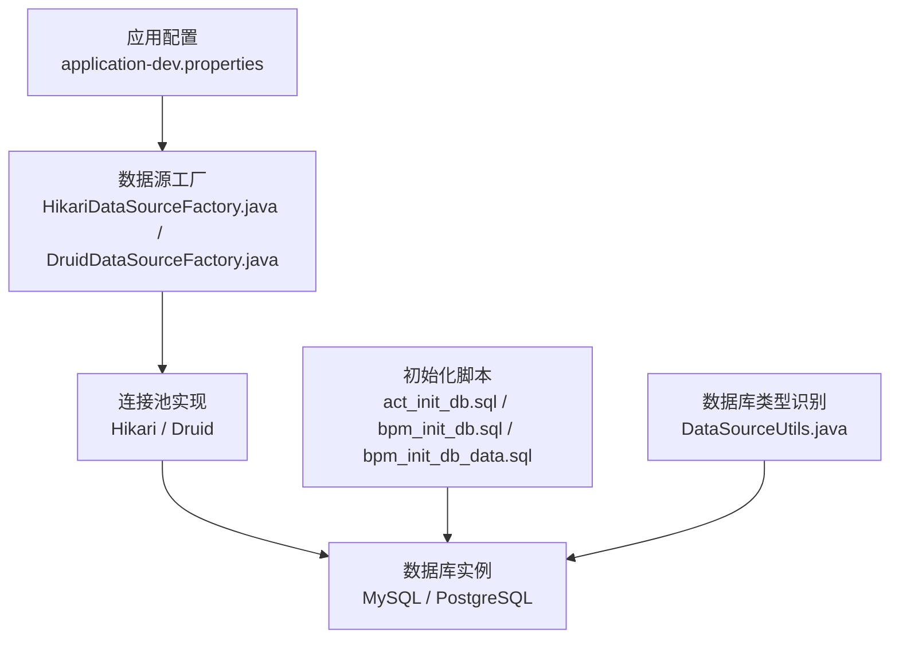
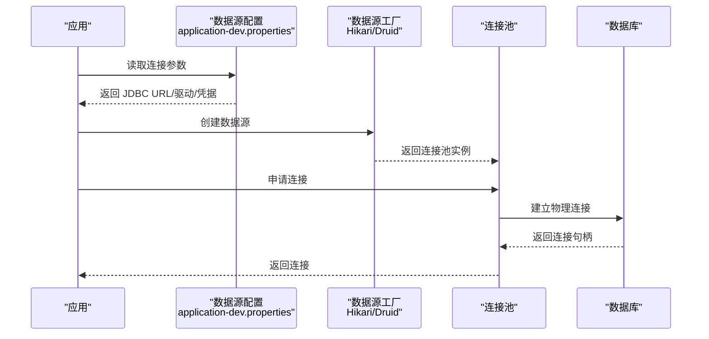
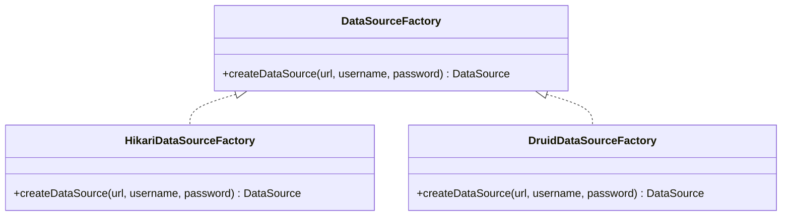
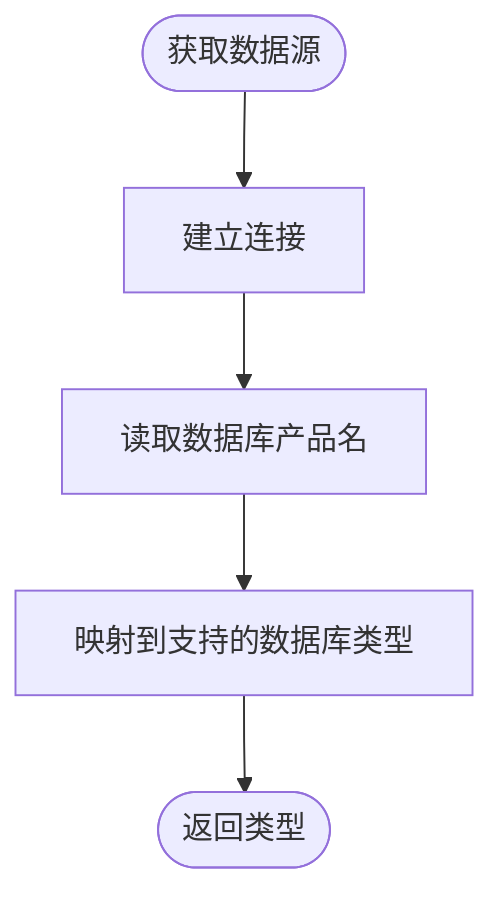
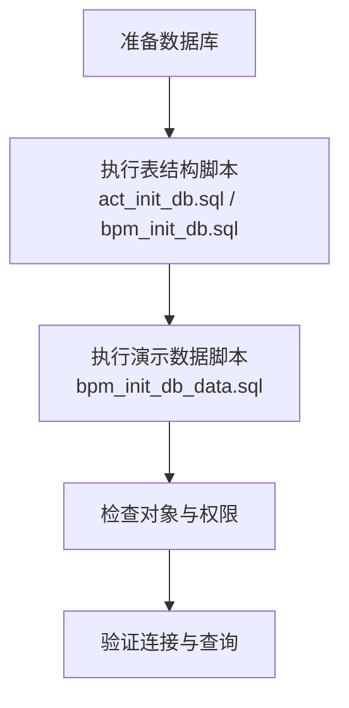
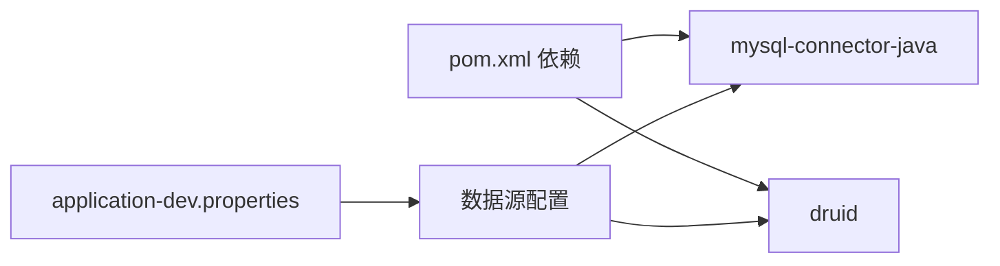
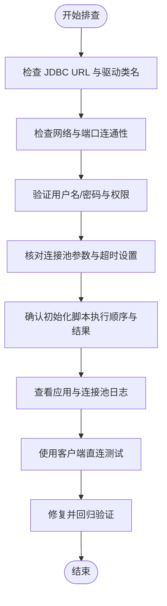

# 数据库连接问题

<cite>
**本文引用的文件**
- [pom.xml](file://pom.xml)
- [application.properties](file://antflow-web/src/main/resources/application.properties)
- [application-dev.properties](file://antflow-web/src/main/resources/application-dev.properties)
- [DataSourceUtils.java](file://antflow-base/src/main/java/org/openoa/base/util/DataSourceUtils.java)
- [HikariDataSourceFactory.java](file://antflow-engine/src/main/java/org/openoa/engine/conf/engineconfig/HikariDataSourceFactory.java)
- [DruidDataSourceFactory.java](file://antflow-engine/src/main/java/org/openoa/engine/conf/engineconfig/DruidDataSourceFactory.java)
- [GenericDruidDataSourceConfig.java](file://antflow-engine/src/main/java/org/openoa/engine/conf/engineconfig/GenericDruidDataSourceConfig.java)
- [act_init_db.sql](file://script/act_init_db.sql)
- [bpm_init_db.sql](file://script/bpm_init_db.sql)
- [bpm_init_db_data.sql](file://script/bpm_init_db_data.sql)
- [2.antflow postgresql支持.md](file://doc/多数据库支持/2.antflow postgresql支持.md)
</cite>

## 目录
1. [简介](#简介)
2. [项目结构](#项目结构)
3. [核心组件](#核心组件)
4. [架构总览](#架构总览)
5. [详细组件分析](#详细组件分析)
6. [依赖分析](#依赖分析)
7. [性能考虑](#性能考虑)
8. [故障排查指南](#故障排查指南)
9. [结论](#结论)
10. [附录](#附录)

## 简介
本指南面向数据库连接问题的排查与优化，结合仓库中的配置与脚本，系统性说明连接失败的常见原因、不同数据库类型的配置差异、初始化脚本执行步骤、连接池参数调优，以及日志分析与测试命令。目标是帮助开发者与运维人员快速定位并解决连接异常。

## 项目结构
本项目采用多模块结构，数据库相关的关键位置如下：
- 顶层依赖声明与构建配置：pom.xml
- 应用配置（含数据源与连接池参数）：application.properties、application-dev.properties
- 动态识别数据库类型工具：DataSourceUtils.java
- 连接池工厂与配置（Hikari、Druid）：HikariDataSourceFactory.java、DruidDataSourceFactory.java、GenericDruidDataSourceConfig.java
- 初始化脚本（Activiti、业务表、演示数据）：script/act_init_db.sql、bpm_init_db.sql、bpm_init_db_data.sql
- PostgreSQL 支持文档：doc/多数据库支持/2.antflow postgresql支持.md

图表来源
- [application-dev.properties:1-44](file://antflow-web/src/main/resources/application-dev.properties#L1-L44)
- [HikariDataSourceFactory.java:1-26](file://antflow-engine/src/main/java/org/openoa/engine/conf/engineconfig/HikariDataSourceFactory.java#L1-L26)
- [DruidDataSourceFactory.java:1-28](file://antflow-engine/src/main/java/org/openoa/engine/conf/engineconfig/DruidDataSourceFactory.java#L1-L28)
- [DataSourceUtils.java:1-28](file://antflow-base/src/main/java/org/openoa/base/util/DataSourceUtils.java#L1-L28)
- [act_init_db.sql:1-470](file://script/act_init_db.sql#L1-L470)
- [bpm_init_db.sql:1-800](file://script/bpm_init_db.sql#L1-L800)
- [bpm_init_db_data.sql:1-104](file://script/bpm_init_db_data.sql#L1-L104)

章节来源
- [pom.xml:1-236](file://pom.xml#L1-L236)
- [application.properties:1-36](file://antflow-web/src/main/resources/application.properties#L1-L36)
- [application-dev.properties:1-44](file://antflow-web/src/main/resources/application-dev.properties#L1-L44)

## 核心组件
- 数据源配置与连接池参数
  - MySQL 示例配置位于 application-dev.properties，包含 JDBC URL、用户名、密码、驱动类名及 Druid/Hikari 的连接池参数。
  - 顶层 pom.xml 引入 MySQL Connector/J 与 Druid。
- 数据库类型识别
  - DataSourceUtils 通过 JDBC 获取数据库产品名，映射到支持的数据库类型枚举，便于后续差异化处理。
- 连接池工厂
  - HikariDataSourceFactory 默认创建 HikariDataSource 并设置基础池大小。
  - DruidDataSourceFactory 为注释示例，展示了基于 Druid 的数据源工厂实现思路。
  - GenericDruidDataSourceConfig 为 Druid 基础数据源的配置示例。

章节来源
- [application-dev.properties:1-44](file://antflow-web/src/main/resources/application-dev.properties#L1-L44)
- [pom.xml:93-96](file://pom.xml#L93-L96)
- [DataSourceUtils.java:1-28](file://antflow-base/src/main/java/org/openoa/base/util/DataSourceUtils.java#L1-L28)
- [HikariDataSourceFactory.java:1-26](file://antflow-engine/src/main/java/org/openoa/engine/conf/engineconfig/HikariDataSourceFactory.java#L1-L26)
- [DruidDataSourceFactory.java:1-28](file://antflow-engine/src/main/java/org/openoa/engine/conf/engineconfig/DruidDataSourceFactory.java#L1-L28)
- [GenericDruidDataSourceConfig.java:1-18](file://antflow-engine/src/main/java/org/openoa/engine/conf/engineconfig/GenericDruidDataSourceConfig.java#L1-L18)

## 架构总览
数据库连接链路从应用配置开始，经由数据源工厂生成连接池，最终访问数据库；初始化脚本负责创建必要的表结构与演示数据。

图表来源
- [application-dev.properties:1-44](file://antflow-web/src/main/resources/application-dev.properties#L1-L44)
- [HikariDataSourceFactory.java:1-26](file://antflow-engine/src/main/java/org/openoa/engine/conf/engineconfig/HikariDataSourceFactory.java#L1-L26)
- [DruidDataSourceFactory.java:1-28](file://antflow-engine/src/main/java/org/openoa/engine/conf/engineconfig/DruidDataSourceFactory.java#L1-L28)

## 详细组件分析

### 组件A：连接池工厂与参数
- HikariDataSourceFactory
  - 默认设置最大池大小与最小空闲数，适用于大多数场景。
  - 可通过自定义实现覆盖默认行为。
- DruidDataSourceFactory（注释示例）
  - 展示了基于 Druid 的工厂实现方式，便于在多租户或复杂场景中复用基础配置。
- GenericDruidDataSourceConfig（注释示例）
  - 通过配置前缀绑定 Druid 参数，便于集中管理。

图表来源
- [HikariDataSourceFactory.java:1-26](file://antflow-engine/src/main/java/org/openoa/engine/conf/engineconfig/HikariDataSourceFactory.java#L1-L26)
- [DruidDataSourceFactory.java:1-28](file://antflow-engine/src/main/java/org/openoa/engine/conf/engineconfig/DruidDataSourceFactory.java#L1-L28)

章节来源
- [HikariDataSourceFactory.java:1-26](file://antflow-engine/src/main/java/org/openoa/engine/conf/engineconfig/HikariDataSourceFactory.java#L1-L26)
- [DruidDataSourceFactory.java:1-28](file://antflow-engine/src/main/java/org/openoa/engine/conf/engineconfig/DruidDataSourceFactory.java#L1-L28)
- [GenericDruidDataSourceConfig.java:1-18](file://antflow-engine/src/main/java/org/openoa/engine/conf/engineconfig/GenericDruidDataSourceConfig.java#L1-L18)

### 组件B：数据库类型识别
- DataSourceUtils 通过获取数据库产品名并映射到支持的数据库类型，有助于在多数据库环境下进行差异化处理。

图表来源
- [DataSourceUtils.java:1-28](file://antflow-base/src/main/java/org/openoa/base/util/DataSourceUtils.java#L1-L28)

章节来源
- [DataSourceUtils.java:1-28](file://antflow-base/src/main/java/org/openoa/base/util/DataSourceUtils.java#L1-L28)

### 组件C：初始化脚本与权限
- Activiti 表结构：act_init_db.sql
- 业务流程表结构：bpm_init_db.sql
- 演示数据：bpm_init_db_data.sql
- 执行顺序建议：先执行表结构脚本，再执行演示数据脚本；如需 PostgreSQL，请参考 PostgreSQL 支持文档中的脚本与驱动说明。

图表来源
- [act_init_db.sql:1-470](file://script/act_init_db.sql#L1-L470)
- [bpm_init_db.sql:1-800](file://script/bpm_init_db.sql#L1-L800)
- [bpm_init_db_data.sql:1-104](file://script/bpm_init_db_data.sql#L1-L104)
- [2.antflow postgresql支持.md:55-85](file://doc/多数据库支持/2.antflow postgresql支持.md#L55-L85)

章节来源
- [act_init_db.sql:1-470](file://script/act_init_db.sql#L1-L470)
- [bpm_init_db.sql:1-800](file://script/bpm_init_db.sql#L1-L800)
- [bpm_init_db_data.sql:1-104](file://script/bpm_init_db_data.sql#L1-L104)
- [2.antflow postgresql支持.md:55-85](file://doc/多数据库支持/2.antflow postgresql支持.md#L55-L85)

## 依赖分析
- 顶层依赖
  - MySQL Connector/J：用于 MySQL 连接。
  - Druid：连接池实现。
- 应用配置
  - application-dev.properties 中的 JDBC URL、驱动类名、用户名/密码与连接池参数共同决定连接行为。

图表来源
- [pom.xml:93-96](file://pom.xml#L93-L96)
- [application-dev.properties:1-44](file://antflow-web/src/main/resources/application-dev.properties#L1-L44)

章节来源
- [pom.xml:1-236](file://pom.xml#L1-L236)
- [application-dev.properties:1-44](file://antflow-web/src/main/resources/application-dev.properties#L1-L44)

## 性能考虑
- 连接池参数调优要点
  - 最大活跃连接数：根据并发请求与数据库承载能力设定，避免过高导致数据库过载。
  - 最小空闲连接数：保证热身连接数量，降低首次连接延迟。
  - 连接等待时间：限制客户端等待连接的时间，防止线程长时间阻塞。
  - 空闲回收周期与空闲阈值：平衡资源占用与连接有效性。
  - 连接验证策略：启用空闲检测与健康检查，减少无效连接。
- 日志与监控
  - 开启 SQL 日志输出与调试级别日志，辅助定位慢查询与连接异常。
  - 结合数据库侧慢查询日志与连接数统计进行综合分析。

## 故障排查指南

### 一、连接字符串与驱动类名
- 常见问题
  - JDBC URL 缺少必要参数（如字符集、时区、schema 等）。
  - 驱动类名与数据库类型不匹配。
- 排查步骤
  - 对照 application-dev.properties 中的 JDBC URL 与驱动类名。
  - 如切换至 PostgreSQL，参考 PostgreSQL 支持文档中的 URL 与驱动配置。

章节来源
- [application-dev.properties:1-44](file://antflow-web/src/main/resources/application-dev.properties#L1-L44)
- [2.antflow postgresql支持.md:76-85](file://doc/多数据库支持/2.antflow postgresql支持.md#L76-L85)

### 二、数据库服务状态与网络
- 常见问题
  - 数据库服务未启动或监听端口不可达。
  - 防火墙阻拦或安全组未放通端口。
- 排查步骤
  - 使用 telnet 或 nc 测试端口连通性。
  - 在数据库服务器上确认监听地址与端口。
  - 检查网络 ACL、安全组策略。

### 三、认证与权限
- 常见问题
  - 用户名/密码错误或账号被锁定。
  - 目标 schema 或数据库不存在。
  - 权限不足导致无法访问表或执行 DDL/DML。
- 排查步骤
  - 使用数据库客户端工具验证凭据与权限。
  - 确认初始化脚本已正确执行，对象与权限已创建。

章节来源
- [act_init_db.sql:1-470](file://script/act_init_db.sql#L1-L470)
- [bpm_init_db.sql:1-800](file://script/bpm_init_db.sql#L1-L800)
- [bpm_init_db_data.sql:1-104](file://script/bpm_init_db_data.sql#L1-L104)

### 四、连接池参数与超时
- 常见问题
  - 最大连接数过小导致排队与超时。
  - 空闲回收过于激进导致频繁重建连接。
  - 连接验证失败引发大量无效连接。
- 排查步骤
  - 检查 application-dev.properties 中的连接池参数。
  - 结合数据库连接数上限与平均响应时间调整池大小。
  - 启用连接池健康检查与回收策略日志。

章节来源
- [application-dev.properties:7-21](file://antflow-web/src/main/resources/application-dev.properties#L7-L21)

### 五、数据库类型差异与初始化
- MySQL
  - 使用 application-dev.properties 中的 MySQL 配置。
  - 先执行表结构脚本，再执行演示数据脚本。
- PostgreSQL
  - 参考 PostgreSQL 支持文档，使用对应的脚本与驱动。
  - 注意 schema 参数与当前 schema 设置。

章节来源
- [application-dev.properties:1-44](file://antflow-web/src/main/resources/application-dev.properties#L1-L44)
- [2.antflow postgresql支持.md:55-85](file://doc/多数据库支持/2.antflow postgresql支持.md#L55-L85)

### 六、日志分析与 SQL 测试
- 日志定位
  - 开启 MyBatis 与 Activiti 的调试日志，观察 SQL 输出与异常堆栈。
  - 查看连接池健康检查与回收日志。
- SQL 连接测试
  - 使用数据库客户端连接字符串进行直连测试，验证连通性与权限。
  - 执行简单查询（如 SELECT 1）验证连接可用性。

章节来源
- [application-dev.properties:26-32](file://antflow-web/src/main/resources/application-dev.properties#L26-L32)

### 七、故障排除流程图

## 结论
数据库连接问题通常由配置错误、网络与权限、连接池参数不当或初始化缺失引起。通过对照配置文件、执行正确的初始化脚本、合理设置连接池参数，并结合日志与客户端直连测试，可高效定位并解决问题。对于多数据库场景，应严格区分 URL、驱动与初始化脚本的差异。

## 附录

### A. 初始化脚本执行步骤（MySQL）
- 执行顺序
  - 先执行表结构脚本：act_init_db.sql、bpm_init_db.sql
  - 再执行演示数据脚本：bpm_init_db_data.sql
- 权限与对象
  - 确保数据库用户具备创建表、索引与插入数据的权限。

章节来源
- [act_init_db.sql:1-470](file://script/act_init_db.sql#L1-L470)
- [bpm_init_db.sql:1-800](file://script/bpm_init_db.sql#L1-L800)
- [bpm_init_db_data.sql:1-104](file://script/bpm_init_db_data.sql#L1-L104)

### B. PostgreSQL 初始化与配置要点
- 脚本与驱动
  - 参考 PostgreSQL 支持文档，使用对应脚本与驱动依赖。
- URL 与 schema
  - 使用 currentSchema 参数指定当前 schema。

章节来源
- [2.antflow postgresql支持.md:55-85](file://doc/多数据库支持/2.antflow postgresql.support.md#L55-L85)