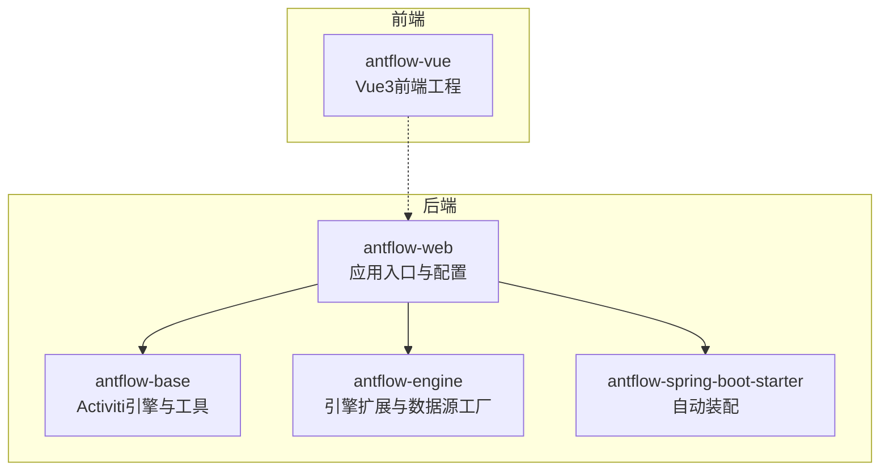
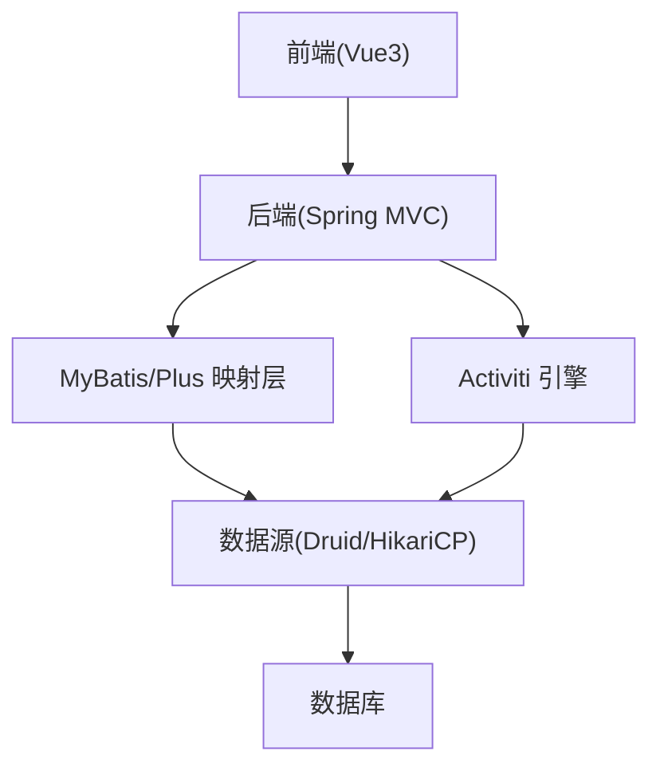
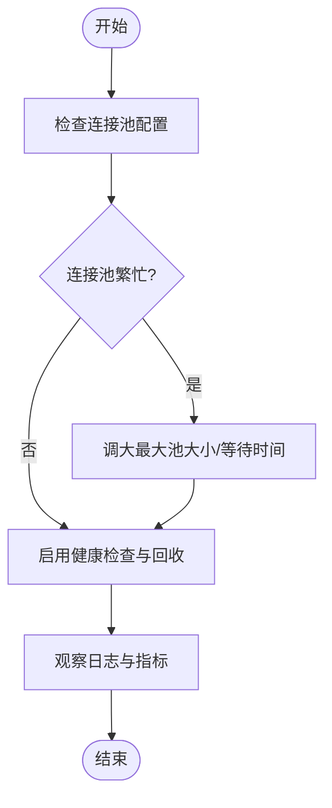
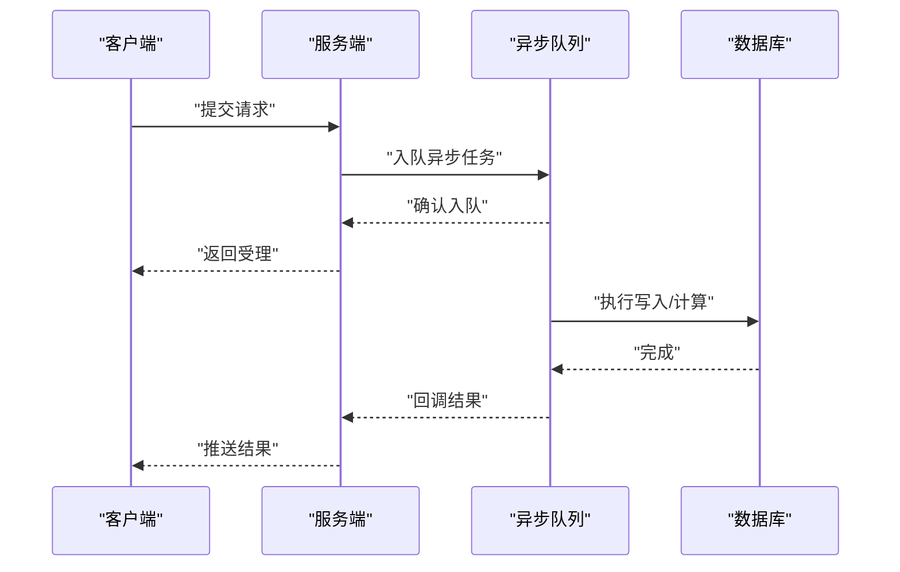
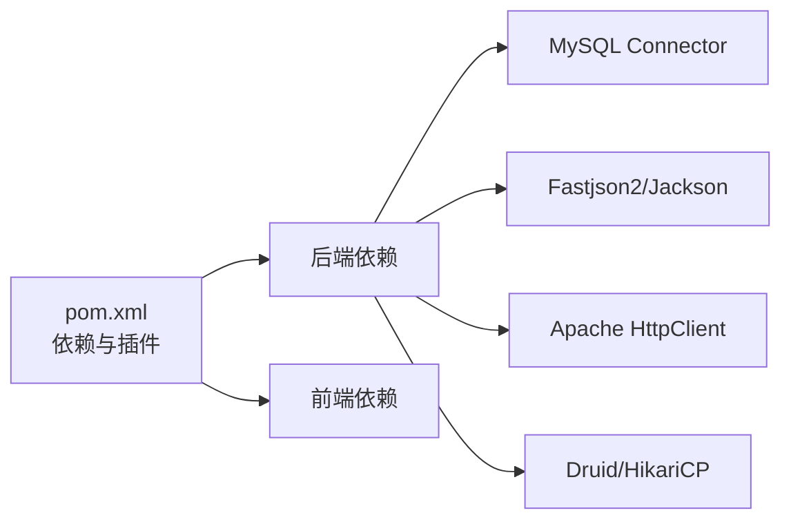

# 系统性能问题

<cite>
**本文引用的文件**
- [pom.xml](file://pom.xml)
- [application.properties](file://antflow-web/src/main/resources/application.properties)
- [application-dev.properties](file://antflow-web/src/main/resources/application-dev.properties)
- [HikariDataSourceFactory.java](file://antflow-engine/src/main/java/org/openoa/engine/conf/engineconfig/HikariDataSourceFactory.java)
- [DataSourceUtils.java](file://antflow-base/src/main/java/org/openoa/base/util/DataSourceUtils.java)
- [ProcessEngineConfigurationImpl.java](file://antflow-base/src/main/java/org/activiti/engine/impl/cfg/ProcessEngineConfigurationImpl.java)
- [13.前端系统.md](file://doc/系统介绍篇/13.前端系统.md)
- [前端手册.md](file://antflow-vue/public/docs/前端手册.md)
</cite>

## 目录
1. [简介](#简介)
2. [项目结构](#项目结构)
3. [核心组件](#核心组件)
4. [架构总览](#架构总览)
5. [详细组件分析](#详细组件分析)
6. [依赖关系分析](#依赖关系分析)
7. [性能考量](#性能考量)
8. [故障排查指南](#故障排查指南)
9. [结论](#结论)
10. [附录](#附录)

## 简介
本指南聚焦于系统性能问题的深度分析与优化，围绕以下关键领域展开：
- 内存不足问题：JVM堆内存溢出、前端内存泄漏、数据库连接池耗尽的识别与解决
- 数据库查询慢：SQL优化、索引设计、查询计划分析、连接池配置调优
- 并发处理问题：线程池配置、锁竞争、异步处理优化
- 前端性能瓶颈：资源加载、组件渲染、网络请求优化
- 性能监控工具：JProfiler、Chrome DevTools、数据库性能分析工具的使用
- 性能测试与基准指标：测试方法与可量化的评估指标

本指南结合仓库中的实际配置与实现，提供可落地的诊断步骤与优化建议。

## 项目结构
系统采用多模块聚合工程，核心模块包括：
- antflow-web：Spring Boot 后端应用入口与配置
- antflow-base：Activiti 引擎相关实现与基础工具
- antflow-engine：引擎扩展、数据源工厂、配置与服务
- antflow-spring-boot-starter：自动装配与启动器
- antflow-vue：前端工程与文档

**图表来源**
- [pom.xml](file://pom.xml)
- [application.properties](file://antflow-web/src/main/resources/application.properties)

**章节来源**
- [pom.xml](file://pom.xml)
- [application.properties](file://antflow-web/src/main/resources/application.properties)

## 核心组件
- 数据源与连接池
  - Druid 与 HikariCP 在配置中均有体现，且存在 HikariDataSourceFactory 默认实现，最大连接数与最小空闲数可调
- Activiti 引擎配置
  - ProcessEngineConfigurationImpl 提供异步执行器、线程池队列、锁时间、重试等待等并发相关参数
- 前端布局与状态管理
  - 前端系统文档描述了布局组件、响应式设计、主题支持与状态管理，有助于定位前端性能问题

**章节来源**
- [application-dev.properties](file://antflow-web/src/main/resources/application-dev.properties)
- [HikariDataSourceFactory.java](file://antflow-engine/src/main/java/org/openoa/engine/conf/engineconfig/HikariDataSourceFactory.java)
- [ProcessEngineConfigurationImpl.java](file://antflow-base/src/main/java/org/activiti/engine/impl/cfg/ProcessEngineConfigurationImpl.java)
- [13.前端系统.md](file://doc/系统介绍篇/13.前端系统.md)

## 架构总览
后端通过 Spring Boot 启动，整合 MyBatis/MyBatis-Plus、Druid/HikariCP 连接池、Activiti 引擎；前端基于 Vue3，通过 API 与后端交互。整体数据流如下：

**图表来源**
- [application-dev.properties](file://antflow-web/src/main/resources/application-dev.properties)
- [HikariDataSourceFactory.java](file://antflow-engine/src/main/java/org/openoa/engine/conf/engineconfig/HikariDataSourceFactory.java)
- [ProcessEngineConfigurationImpl.java](file://antflow-base/src/main/java/org/activiti/engine/impl/cfg/ProcessEngineConfigurationImpl.java)

## 详细组件分析

### 组件一：数据库连接池与内存压力
- Druid 配置要点
  - 最小空闲、初始大小、最大活跃、最大等待、移除废弃超时、心跳与校验查询等
  - 适用于开发/测试环境的连接池参数
- HikariCP 配置要点
  - 默认实现中设置了最大池大小与最小空闲数，可通过自定义工厂覆盖
- 内存压力识别
  - 连接池耗尽表现为“获取连接超时”或“队列积压”
  - 通过日志级别与监控指标观察连接池状态
- 优化建议
  - 根据峰值并发与事务持续时间调整最大池大小与等待时间
  - 开启连接回收与健康检查，避免长时间占用连接
  - 对慢查询与长事务进行治理，减少连接持有时间

**图表来源**
- [application-dev.properties](file://antflow-web/src/main/resources/application-dev.properties)
- [HikariDataSourceFactory.java](file://antflow-engine/src/main/java/org/openoa/engine/conf/engineconfig/HikariDataSourceFactory.java)

**章节来源**
- [application-dev.properties](file://antflow-web/src/main/resources/application-dev.properties)
- [HikariDataSourceFactory.java](file://antflow-engine/src/main/java/org/openoa/engine/conf/engineconfig/HikariDataSourceFactory.java)

### 组件二：JVM 堆内存与 GC 抖动
- 识别方法
  - 观察 Full GC 频率与停顿时间
  - 分析堆转储，定位不可达对象仍被引用的根因
- 常见原因
  - 缓存未清理、线程局部变量泄漏、大对象常驻、频繁分配
- 优化策略
  - 合理设置堆大小与新生代比例
  - 使用弱引用/软引用缓存，及时释放大对象
  - 定期巡检线程池与异步任务，避免任务堆积
  - 对热点对象序列化/反序列化进行优化

[本节为通用指导，无需具体文件分析]

### 组件三：前端内存泄漏与渲染性能
- 识别方法
  - Chrome DevTools Memory/Performance 面板记录内存增长曲线与长任务
  - 关注组件卸载时事件监听器与定时器是否清理
- 优化策略
  - 懒加载与分包，减少首屏体积
  - 虚拟滚动与分页，降低 DOM 数量
  - 合理使用响应式数据，避免深层嵌套导致的过度重渲染
  - 使用浏览器缓存与 CDN 加速静态资源

**章节来源**
- [13.前端系统.md](file://doc/系统介绍篇/13.前端系统.md)
- [前端手册.md](file://antflow-vue/public/docs/前端手册.md)

### 组件四：数据库查询慢的优化
- SQL 优化
  - 避免 SELECT *，只取必要字段
  - 使用 EXPLAIN 分析执行计划，关注全表扫描与回表
- 索引设计
  - 为高频过滤/排序/连接列建立合适索引
  - 避免冗余与重复索引
- 查询计划分析
  - 结合数据库性能分析工具，定位慢查询日志与高耗时语句
- 连接池配置调优
  - 与连接池参数协同，避免超时与排队

**章节来源**
- [application-dev.properties](file://antflow-web/src/main/resources/application-dev.properties)

### 组件五：并发处理问题排查
- 线程池配置
  - 核心线程、最大线程、队列容量、拒绝策略需与业务负载匹配
- 锁竞争分析
  - 识别热点锁与长事务，拆分粒度、缩短持锁时间
- 异步处理优化
  - 利用异步执行器与队列，合理设置锁时间与重试等待

**图表来源**
- [ProcessEngineConfigurationImpl.java](file://antflow-base/src/main/java/org/activiti/engine/impl/cfg/ProcessEngineConfigurationImpl.java)

**章节来源**
- [ProcessEngineConfigurationImpl.java](file://antflow-base/src/main/java/org/activiti/engine/impl/cfg/ProcessEngineConfigurationImpl.java)

## 依赖关系分析
- 后端依赖
  - MyBatis/Plus、Druid/HikariCP、MySQL Connector、Jackson/Fastjson2、HTTP 客户端等
- 前端依赖
  - Vue3、Element Plus、Pinia、Vite 插件等

**图表来源**
- [pom.xml](file://pom.xml)

**章节来源**
- [pom.xml](file://pom.xml)

## 性能考量
- JVM 层面
  - 合理设置堆大小与 GC 参数，监控 Full GC 与晋升失败
- 数据库层面
  - 连接池参数与 SQL 执行计划协同优化
- 并发层面
  - 线程池与异步执行器参数与业务特征匹配
- 前端层面
  - 资源体积、渲染路径与网络请求优化

[本节为通用指导，无需具体文件分析]

## 故障排查指南
- 内存不足
  - JVM：使用堆转储与 GC 日志定位泄漏点
  - 前端：DevTools Memory 面板观察增长曲线，检查组件生命周期
  - 数据库：监控连接池活跃数与等待时间，避免连接泄漏
- 查询慢
  - 使用 EXPLAIN 与慢查询日志，结合索引策略与 SQL 改写
- 并发问题
  - 检查线程池队列长度与拒绝策略，分析锁竞争热点
- 前端卡顿
  - 使用 Performance 面板识别长任务，优化渲染与网络请求

**章节来源**
- [application-dev.properties](file://antflow-web/src/main/resources/application-dev.properties)
- [13.前端系统.md](file://doc/系统介绍篇/13.前端系统.md)

## 结论
系统性能优化是一个多维度协同的过程，需要从 JVM、数据库、并发与前端四个层面系统性地识别瓶颈并实施针对性优化。结合仓库中的连接池与引擎配置，可优先从连接池参数、SQL 执行计划与异步执行器参数入手，配合前端资源与渲染优化，形成完整的性能提升闭环。

## 附录
- 性能监控工具使用建议
  - JVM：JProfiler/VisualVM/Arthas
  - 前端：Chrome DevTools Memory/Performance
  - 数据库：EXPLAIN/慢查询日志/连接池监控
- 性能测试与基准指标
  - 基准测试：吞吐量、延迟分布、错误率、资源占用
  - 压力测试：逐步加压至瓶颈，记录拐点与退化行为
  - 回归测试：在每次优化后对比关键指标，确保收益稳定

[本节为通用指导，无需具体文件分析]