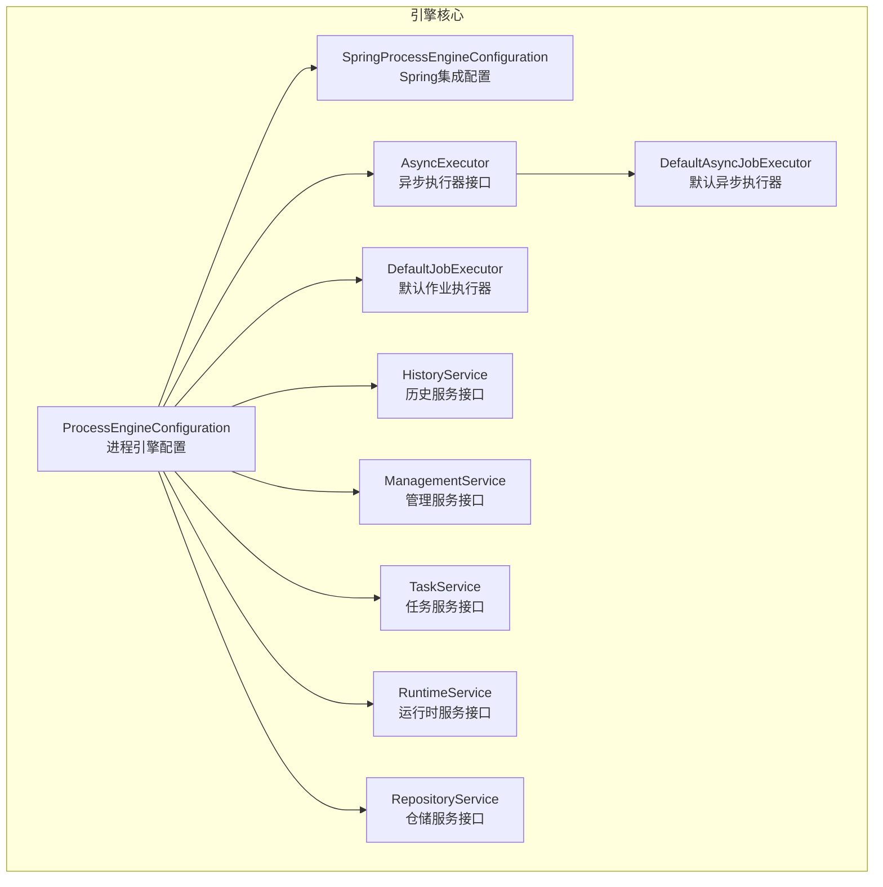
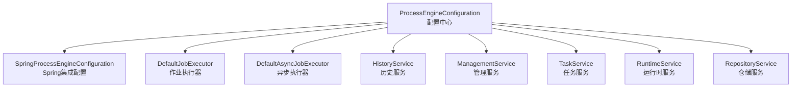
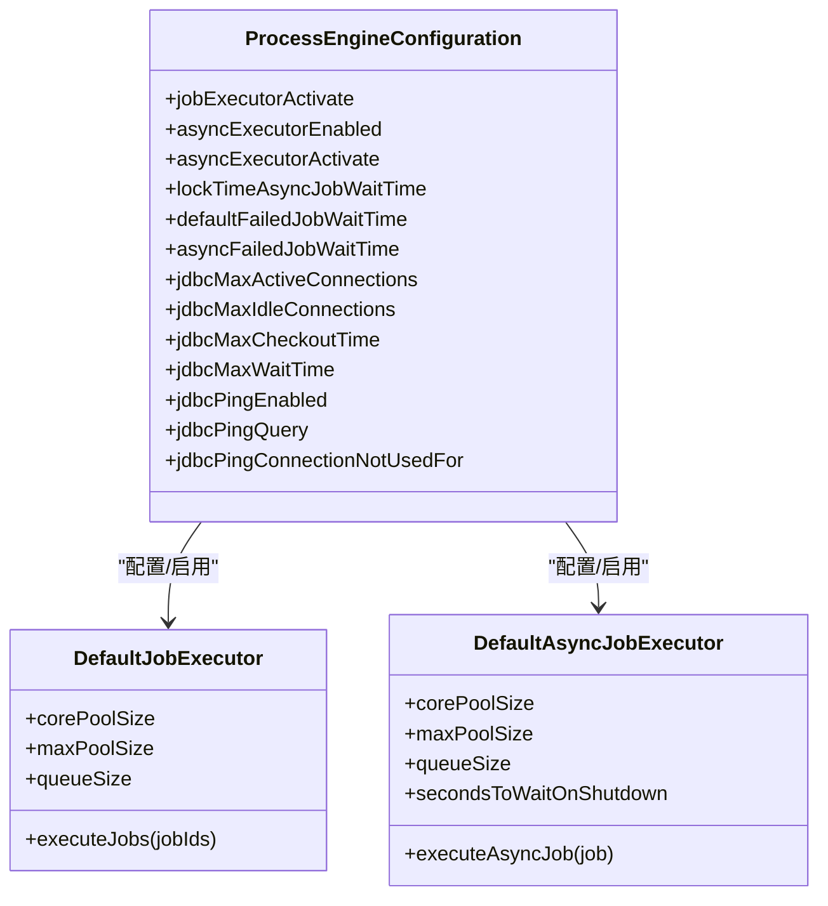
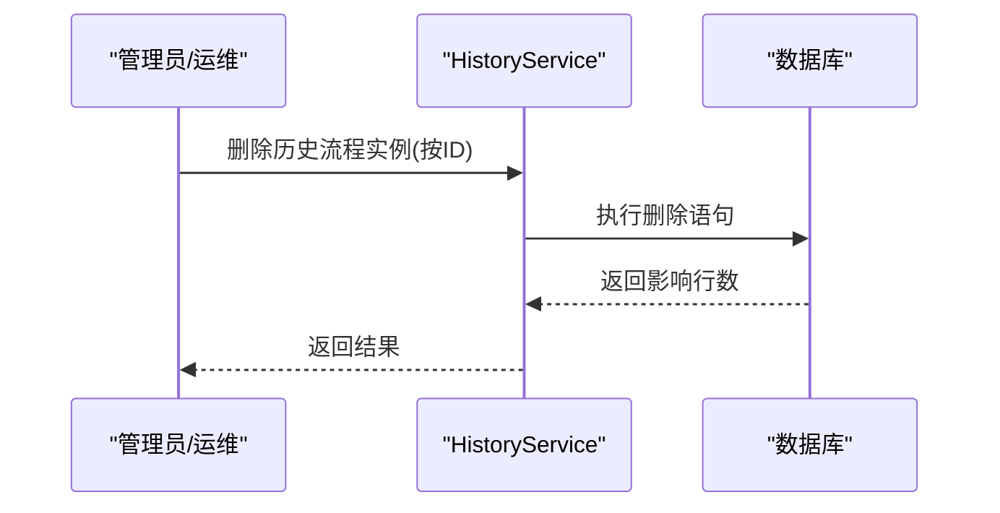
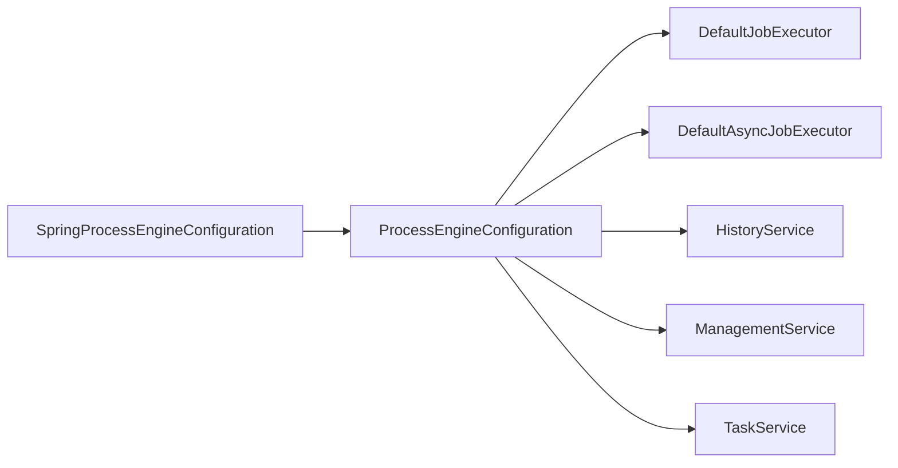

# 工作流引擎性能调优

<cite>
**本文引用的文件**
- [ProcessEngineConfiguration.java](file://antflow-base/src/main/java/org/activiti/engine/ProcessEngineConfiguration.java)
- [SpringProcessEngineConfiguration.java](file://antflow-base/src/main/java/org/activiti/spring/SpringProcessEngineConfiguration.java)
- [AsyncExecutor.java](file://antflow-base/src/main/java/org/activiti/engine/impl/asyncexecutor/AsyncExecutor.java)
- [DefaultAsyncJobExecutor.java](file://antflow-base/src/main/java/org/activiti/engine/impl/asyncexecutor/DefaultAsyncJobExecutor.java)
- [DefaultJobExecutor.java](file://antflow-base/src/main/java/org/activiti/engine/impl/jobexecutor/DefaultJobExecutor.java)
- [HistoryService.java](file://antflow-base/src/main/java/org/activiti/engine/HistoryService.java)
- [ManagementService.java](file://antflow-base/src/main/java/org/activiti/engine/ManagementService.java)
- [TaskService.java](file://antflow-base/src/main/java/org/activiti/engine/TaskService.java)
- [RuntimeService.java](file://antflow-base/src/main/java/org/activiti/engine/RuntimeService.java)
- [RepositoryService.java](file://antflow-base/src/main/java/org/activiti/engine/RepositoryService.java)
</cite>

## 目录
1. [简介](#简介)
2. [项目结构](#项目结构)
3. [核心组件](#核心组件)
4. [架构总览](#架构总览)
5. [详细组件分析](#详细组件分析)
6. [依赖分析](#依赖分析)
7. [性能考量](#性能考量)
8. [故障排查指南](#故障排查指南)
9. [结论](#结论)
10. [附录](#附录)

## 简介
本指南面向工作流引擎的性能调优实践，围绕Activiti引擎在本仓库中的实现与扩展，系统阐述以下主题：Job执行器配置与并发调优、历史数据清理策略、变量存储优化、流程实例管理（数量控制、历史归档、内存优化）、任务调度性能（查询优化、分配算法、并发处理）、执行监控（时间统计、瓶颈识别、指标分析）、消息处理（队列配置、异步处理、重试机制），以及基准测试、瓶颈诊断工具与调优前后对比方法。目标是帮助读者在生产环境中构建高性能、可维护的工作流平台。

## 项目结构
本仓库采用分层与功能模块化组织方式：
- antflow-base：Activiti核心引擎与Spring集成适配层，包含配置接口、执行器实现、服务接口与实现等。
- antflow-engine：业务流程引擎扩展，包含监听器、服务适配、Mapper与配置等。
- antflow-spring-boot-starter：Spring Boot自动装配入口。
- antflow-vue：前端系统。
- antflow-web：Web应用入口。
- doc：系统文档与集成指南。
- script：数据库初始化脚本。

下图展示与性能调优相关的关键模块与文件：

**图表来源**
- [ProcessEngineConfiguration.java:103-109](file://antflow-base/src/main/java/org/activiti/engine/ProcessEngineConfiguration.java#L103-L109)
- [SpringProcessEngineConfiguration.java:49-64](file://antflow-base/src/main/java/org/activiti/spring/SpringProcessEngineConfiguration.java#L49-L64)
- [AsyncExecutor.java:22-88](file://antflow-base/src/main/java/org/activiti/engine/impl/asyncexecutor/AsyncExecutor.java#L22-L88)
- [DefaultAsyncJobExecutor.java:31-157](file://antflow-base/src/main/java/org/activiti/engine/impl/asyncexecutor/DefaultAsyncJobExecutor.java#L31-L157)
- [DefaultJobExecutor.java:39-141](file://antflow-base/src/main/java/org/activiti/engine/impl/jobexecutor/DefaultJobExecutor.java#L39-L141)
- [HistoryService.java:50-127](file://antflow-base/src/main/java/org/activiti/engine/HistoryService.java#L50-L127)
- [ManagementService.java:40-165](file://antflow-base/src/main/java/org/activiti/engine/ManagementService.java#L40-L165)
- [TaskService.java:38-477](file://antflow-base/src/main/java/org/activiti/engine/TaskService.java#L38-L477)
- [RuntimeService.java](file://antflow-base/src/main/java/org/activiti/engine/RuntimeService.java)
- [RepositoryService.java](file://antflow-base/src/main/java/org/activiti/engine/RepositoryService.java)

**章节来源**
- [ProcessEngineConfiguration.java:103-109](file://antflow-base/src/main/java/org/activiti/engine/ProcessEngineConfiguration.java#L103-L109)
- [SpringProcessEngineConfiguration.java:49-64](file://antflow-base/src/main/java/org/activiti/spring/SpringProcessEngineConfiguration.java#L49-L64)

## 核心组件
- 进程引擎配置：提供数据库连接池、历史级别、Job执行器开关、异步执行器开关、锁时间与失败等待时间等关键参数。
- Spring集成配置：在Spring环境下自动部署资源、事务上下文工厂、数据源代理等，确保与Spring事务一致。
- 异步执行器：负责异步作业的获取、执行、线程池大小、队列容量、锁时间与重试等待时间等。
- 默认作业执行器：负责定时作业与普通作业的线程池与队列管理。
- 历史服务：提供历史实例查询、删除、原生SQL查询等能力，支撑历史数据清理与审计。
- 管理服务：提供作业查询、强制执行、删除、重试次数设置、事件日志读取等运维能力。
- 任务服务：任务生命周期管理、变量存取、候选参与者、评论附件等，直接影响任务查询与分配性能。
- 运行时服务：流程实例与执行流的启动、挂起、删除、变量访问等。
- 仓储服务：流程定义部署、删除、查询等。

**章节来源**
- [ProcessEngineConfiguration.java:103-109](file://antflow-base/src/main/java/org/activiti/engine/ProcessEngineConfiguration.java#L103-L109)
- [ProcessEngineConfiguration.java:155-161](file://antflow-base/src/main/java/org/activiti/engine/ProcessEngineConfiguration.java#L155-L161)
- [SpringProcessEngineConfiguration.java:49-64](file://antflow-base/src/main/java/org/activiti/spring/SpringProcessEngineConfiguration.java#L49-L64)
- [AsyncExecutor.java:22-88](file://antflow-base/src/main/java/org/activiti/engine/impl/asyncexecutor/AsyncExecutor.java#L22-L88)
- [DefaultAsyncJobExecutor.java:31-157](file://antflow-base/src/main/java/org/activiti/engine/impl/asyncexecutor/DefaultAsyncJobExecutor.java#L31-L157)
- [DefaultJobExecutor.java:39-141](file://antflow-base/src/main/java/org/activiti/engine/impl/jobexecutor/DefaultJobExecutor.java#L39-L141)
- [HistoryService.java:50-127](file://antflow-base/src/main/java/org/activiti/engine/HistoryService.java#L50-L127)
- [ManagementService.java:40-165](file://antflow-base/src/main/java/org/activiti/engine/ManagementService.java#L40-L165)
- [TaskService.java:38-477](file://antflow-base/src/main/java/org/activiti/engine/TaskService.java#L38-L477)
- [RuntimeService.java](file://antflow-base/src/main/java/org/activiti/engine/RuntimeService.java)
- [RepositoryService.java](file://antflow-base/src/main/java/org/activiti/engine/RepositoryService.java)

## 架构总览
下图展示引擎配置、执行器与服务之间的交互关系，体现性能调优的关键路径。

**图表来源**
- [ProcessEngineConfiguration.java:103-109](file://antflow-base/src/main/java/org/activiti/engine/ProcessEngineConfiguration.java#L103-L109)
- [SpringProcessEngineConfiguration.java:49-64](file://antflow-base/src/main/java/org/activiti/spring/SpringProcessEngineConfiguration.java#L49-L64)
- [DefaultJobExecutor.java:39-141](file://antflow-base/src/main/java/org/activiti/engine/impl/jobexecutor/DefaultJobExecutor.java#L39-L141)
- [DefaultAsyncJobExecutor.java:31-157](file://antflow-base/src/main/java/org/activiti/engine/impl/asyncexecutor/DefaultAsyncJobExecutor.java#L31-L157)
- [HistoryService.java:50-127](file://antflow-base/src/main/java/org/activiti/engine/HistoryService.java#L50-L127)
- [ManagementService.java:40-165](file://antflow-base/src/main/java/org/activiti/engine/ManagementService.java#L40-L165)
- [TaskService.java:38-477](file://antflow-base/src/main/java/org/activiti/engine/TaskService.java#L38-L477)

## 详细组件分析

### Job执行器配置与调优
- 关键参数
  - 作业执行器激活标志：控制是否启用作业执行器。
  - 异步执行器开关与激活标志：控制异步执行器的启用与激活。
  - 锁定时间与失败等待时间：异步作业锁定超时、失败作业等待时间。
  - 数据库连接池参数：最大活跃连接、空闲连接、借出超时、等待时间、心跳检测等。
- 默认执行器行为
  - 默认作业执行器与异步执行器均基于线程池与阻塞队列，具备可配置的核心/最大线程数、队列容量、拒绝策略与关闭等待时间。
  - 异步执行器提供“队列满时解锁作业”的策略，避免阻塞后续获取。
- 调优建议
  - 根据CPU核数与IO特性调整核心/最大线程数与队列容量。
  - 在高并发场景下，适当提高队列容量以缓冲瞬时峰值；在内存受限场景下，降低队列容量以减少堆积。
  - 合理设置失败等待时间与锁定时间，平衡吞吐与一致性。
  - 使用Spring集成配置确保数据源与事务上下文正确注入。

**图表来源**
- [ProcessEngineConfiguration.java:103-109](file://antflow-base/src/main/java/org/activiti/engine/ProcessEngineConfiguration.java#L103-L109)
- [ProcessEngineConfiguration.java:155-161](file://antflow-base/src/main/java/org/activiti/engine/ProcessEngineConfiguration.java#L155-L161)
- [DefaultJobExecutor.java:39-141](file://antflow-base/src/main/java/org/activiti/engine/impl/jobexecutor/DefaultJobExecutor.java#L39-L141)
- [DefaultAsyncJobExecutor.java:31-157](file://antflow-base/src/main/java/org/activiti/engine/impl/asyncexecutor/DefaultAsyncJobExecutor.java#L31-L157)

**章节来源**
- [ProcessEngineConfiguration.java:103-109](file://antflow-base/src/main/java/org/activiti/engine/ProcessEngineConfiguration.java#L103-L109)
- [ProcessEngineConfiguration.java:155-161](file://antflow-base/src/main/java/org/activiti/engine/ProcessEngineConfiguration.java#L155-L161)
- [DefaultJobExecutor.java:39-141](file://antflow-base/src/main/java/org/activiti/engine/impl/jobexecutor/DefaultJobExecutor.java#L39-L141)
- [DefaultAsyncJobExecutor.java:31-157](file://antflow-base/src/main/java/org/activiti/engine/impl/asyncexecutor/DefaultAsyncJobExecutor.java#L31-L157)

### 历史数据清理策略
- 清理接口
  - 支持按任务ID或流程实例ID删除历史记录，适用于动态任务或需要清理的场景。
  - 提供原生SQL查询能力，便于批量清理与审计。
- 策略建议
  - 定期清理过期流程实例的历史数据，结合保留周期策略（如仅保留最近N个月）。
  - 对高频流程实例采用分批清理，避免长事务与锁竞争。
  - 清理前先统计历史表规模，制定增量清理计划。

**图表来源**
- [HistoryService.java:87-88](file://antflow-base/src/main/java/org/activiti/engine/HistoryService.java#L87-L88)

**章节来源**
- [HistoryService.java:50-127](file://antflow-base/src/main/java/org/activiti/engine/HistoryService.java#L50-L127)

### 变量存储优化
- 存储范围
  - 支持任务级与执行作用域变量的读写，任务本地变量与全局变量的区分有助于减少跨实例传播开销。
- 性能要点
  - 优先使用局部变量，避免在大型流程中频繁传递大量全局变量。
  - 对于大批量变量读取，使用指定变量名集合的查询接口，减少不必要的扫描。
  - 控制变量值大小，避免将大对象（如大文本、二进制）直接作为流程变量存储。

**章节来源**
- [TaskService.java:330-407](file://antflow-base/src/main/java/org/activiti/engine/TaskService.java#L330-L407)

### 流程实例管理优化
- 数量控制
  - 通过运行时服务限制并发流程实例数量，结合流程定义的版本与部署策略，避免实例爆炸。
  - 对长时间未推进的实例进行挂起或清理，释放资源。
- 历史归档
  - 将已完成实例迁移至归档库或冷存储，保留必要索引以便查询。
- 内存优化
  - 合理设置历史级别，审计级别会生成更多历史数据，需权衡查询便利性与存储成本。
  - 使用分页查询与投影字段，减少一次性加载的数据量。

**章节来源**
- [RuntimeService.java](file://antflow-base/src/main/java/org/activiti/engine/RuntimeService.java)
- [ProcessEngineConfiguration.java:105-106](file://antflow-base/src/main/java/org/activiti/engine/ProcessEngineConfiguration.java#L105-L106)

### 任务调度性能优化
- 查询优化
  - 使用任务查询接口与原生SQL，结合合适的过滤条件与排序字段，避免全表扫描。
  - 对高频查询建立必要的索引（如assignee、owner、taskDefinitionKey等）。
- 分配算法
  - 实现公平轮询、最少任务优先等策略，避免热点节点过载。
  - 结合候选组与候选人列表，减少无效分配尝试。
- 并发处理
  - 通过执行器线程池与队列容量合理配置，提升任务完成速率。
  - 对长耗时任务拆分为多个子任务或异步步骤，缩短阻塞时间。

**章节来源**
- [TaskService.java:320-328](file://antflow-base/src/main/java/org/activiti/engine/TaskService.java#L320-L328)
- [DefaultAsyncJobExecutor.java:31-157](file://antflow-base/src/main/java/org/activiti/engine/impl/asyncexecutor/DefaultAsyncJobExecutor.java#L31-L157)

### 执行监控与性能指标
- 监控能力
  - 使用管理服务查询作业状态、异常堆栈与事件日志，定位执行瓶颈。
  - 通过数据库表计数与元数据查询，评估实体规模与增长趋势。
- 指标建议
  - 作业排队时延、执行时延、失败率、重试次数、线程池利用率。
  - 历史表增长速率、查询响应时间、变量读写频率。

**章节来源**
- [ManagementService.java:69-106](file://antflow-base/src/main/java/org/activiti/engine/ManagementService.java#L69-L106)
- [ManagementService.java:145-156](file://antflow-base/src/main/java/org/activiti/engine/ManagementService.java#L145-L156)

### 消息处理优化
- 配置要点
  - 在Spring集成配置中确保数据源与事务上下文正确注入，避免消息处理过程中的事务问题。
  - 通过执行器参数控制消息处理的并发度与队列容量。
- 异步处理与重试
  - 对失败的消息采用指数退避重试策略，避免雪崩效应。
  - 对重复消息进行幂等处理，结合唯一键或去重表。

**章节来源**
- [SpringProcessEngineConfiguration.java:123-131](file://antflow-base/src/main/java/org/activiti/spring/SpringProcessEngineConfiguration.java#L123-L131)
- [AsyncExecutor.java:72-87](file://antflow-base/src/main/java/org/activiti/engine/impl/asyncexecutor/AsyncExecutor.java#L72-L87)

## 依赖分析
- 组件耦合
  - 配置类为执行器与服务提供统一入口，执行器依赖配置中的线程池与等待时间参数。
  - 服务接口与实现分离，便于替换与扩展。
- 外部依赖
  - 数据库连接池与事务管理由Spring集成配置提供，保证与应用事务一致。
  - 日志与线程池为执行器运行提供基础能力。

**图表来源**
- [ProcessEngineConfiguration.java:103-109](file://antflow-base/src/main/java/org/activiti/engine/ProcessEngineConfiguration.java#L103-L109)
- [DefaultJobExecutor.java:39-141](file://antflow-base/src/main/java/org/activiti/engine/impl/jobexecutor/DefaultJobExecutor.java#L39-L141)
- [DefaultAsyncJobExecutor.java:31-157](file://antflow-base/src/main/java/org/activiti/engine/impl/asyncexecutor/DefaultAsyncJobExecutor.java#L31-L157)
- [HistoryService.java:50-127](file://antflow-base/src/main/java/org/activiti/engine/HistoryService.java#L50-L127)
- [ManagementService.java:40-165](file://antflow-base/src/main/java/org/activiti/engine/ManagementService.java#L40-L165)
- [TaskService.java:38-477](file://antflow-base/src/main/java/org/activiti/engine/TaskService.java#L38-L477)
- [SpringProcessEngineConfiguration.java:49-64](file://antflow-base/src/main/java/org/activiti/spring/SpringProcessEngineConfiguration.java#L49-L64)

**章节来源**
- [ProcessEngineConfiguration.java:103-109](file://antflow-base/src/main/java/org/activiti/engine/ProcessEngineConfiguration.java#L103-L109)
- [SpringProcessEngineConfiguration.java:49-64](file://antflow-base/src/main/java/org/activiti/spring/SpringProcessEngineConfiguration.java#L49-L64)

## 性能考量
- 线程池与队列
  - 核心线程数应覆盖CPU核心数，最大线程数用于应对突发流量；队列容量决定背压能力。
  - 队列满时的拒绝策略与回退逻辑（解锁作业）对稳定性至关重要。
- 数据库与连接池
  - 合理设置最大活跃连接与等待时间，避免连接池耗尽导致的阻塞。
  - 开启心跳检测与合适的查询语句，降低无效连接与慢查询风险。
- 历史与变量
  - 历史级别与变量规模直接影响存储与查询性能，应结合业务需求选择合适策略。
- 任务与流程
  - 任务查询条件与索引设计、流程实例数量控制与归档策略共同决定整体性能表现。

## 故障排查指南
- 作业积压
  - 使用管理服务查询作业状态与异常堆栈，检查线程池配置与队列容量。
  - 通过事件日志定位具体环节的瓶颈。
- 执行失败
  - 设置作业重试次数与失败等待时间，避免频繁重试造成压力。
  - 对失败作业进行隔离与人工干预，防止连锁反应。
- 性能下降
  - 监控历史表增长速率与查询响应时间，必要时进行归档与索引优化。
  - 评估变量大小与读写频率，减少不必要的大对象传输。

**章节来源**
- [ManagementService.java:69-106](file://antflow-base/src/main/java/org/activiti/engine/ManagementService.java#L69-L106)
- [ManagementService.java:145-156](file://antflow-base/src/main/java/org/activiti/engine/ManagementService.java#L145-L156)

## 结论
通过对配置参数、执行器并发、历史清理、变量存储与任务调度等方面的系统性调优，可在保证稳定性的前提下显著提升工作流引擎的吞吐与响应能力。建议在生产环境实施渐进式调优，并持续监控关键指标，形成闭环优化机制。

## 附录
- 基准测试方法
  - 设计不同并发与数据规模的压测场景，记录吞吐、延迟与错误率。
  - 对比调优前后指标变化，量化收益。
- 瓶颈诊断工具
  - 使用管理服务与事件日志定位热点作业与慢查询。
  - 结合数据库慢查询日志与线程转储，分析执行路径与资源占用。
- 调优前后对比
  - 记录线程池利用率、队列长度、历史表增长速率、任务完成时延等关键指标，形成对比报告。