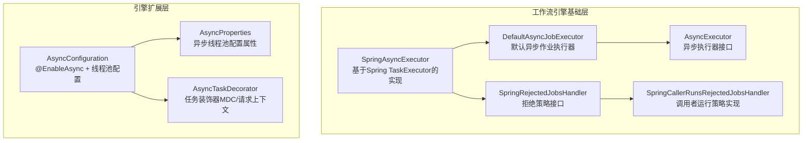
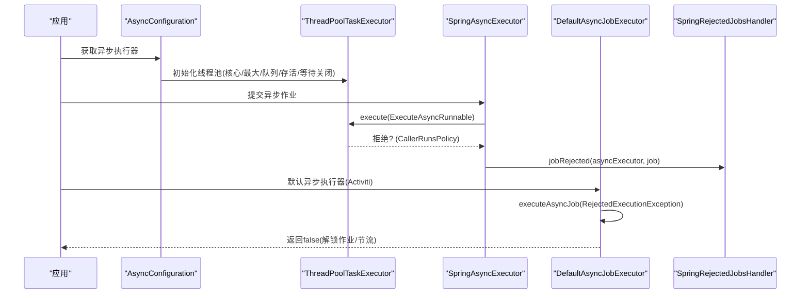
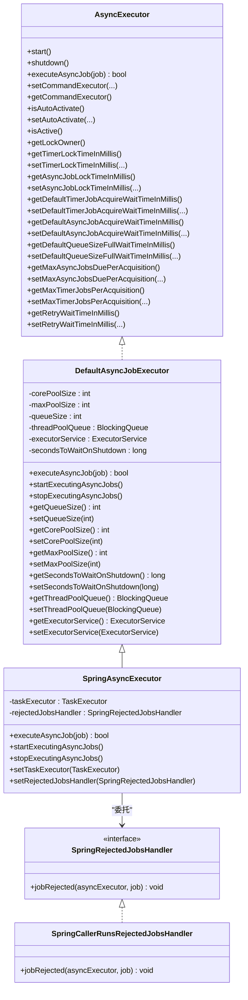
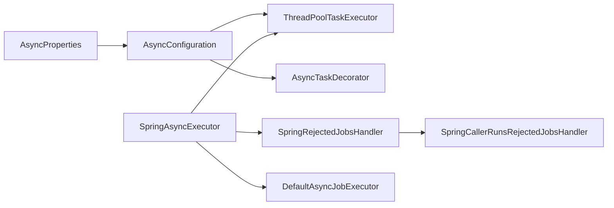

# 异步处理优化

<cite>
**本文引用的文件**
- [SpringAsyncExecutor.java](file://antflow-base/src/main/java/org/activiti/spring/SpringAsyncExecutor.java)
- [SpringRejectedJobsHandler.java](file://antflow-base/src/main/java/org/activiti/spring/SpringRejectedJobsHandler.java)
- [SpringCallerRunsRejectedJobsHandler.java](file://antflow-base/src/main/java/org/activiti/spring/SpringCallerRunsRejectedJobsHandler.java)
- [DefaultAsyncJobExecutor.java](file://antflow-base/src/main/java/org/activiti/engine/impl/asyncexecutor/DefaultAsyncJobExecutor.java)
- [AsyncExecutor.java](file://antflow-base/src/main/java/org/activiti/engine/impl/asyncexecutor/AsyncExecutor.java)
- [AsyncConfiguration.java](file://antflow-engine/src/main/java/org/openoa/engine/conf/async/AsyncConfiguration.java)
- [AsyncProperties.java](file://antflow-engine/src/main/java/org/openoa/engine/conf/confval/AsyncProperties.java)
- [AsyncTaskDecorator.java](file://antflow-engine/src/main/java/org/openoa/engine/conf/async/AsyncTaskDecorator.java)
</cite>

## 目录
1. [简介](#简介)
2. [项目结构](#项目结构)
3. [核心组件](#核心组件)
4. [架构总览](#架构总览)
5. [详细组件分析](#详细组件分析)
6. [依赖分析](#依赖分析)
7. [性能考虑](#性能考虑)
8. [故障排查指南](#故障排查指南)
9. [结论](#结论)
10. [附录](#附录)

## 简介
本指南聚焦于Spring异步处理在AntFlow工作流引擎中的优化实践，围绕以下主题展开：
- Spring异步注解（@Async）的性能优化配置：线程池大小调优、拒绝策略、任务队列容量等
- 异步任务调度优化：@Scheduled并发控制、执行时间监控、超时处理
- 异步异常处理：异常传播、重试策略、降级处理
- 异步任务监控与追踪：执行日志、性能指标、异常统计
- 与工作流引擎的集成优化：流程实例异步处理、任务异步执行、回调机制
- 最佳实践、性能测试方法与故障排查技巧

## 项目结构
本项目采用分层与模块化组织，异步处理相关能力主要分布在以下位置：
- 工作流引擎基础层（Activiti）：提供异步作业执行器与拒绝策略接口
- 引擎扩展层（OpenOA）：提供Spring异步配置、属性与装饰器，用于统一管理线程池与上下文传递

**图表来源**
- [DefaultAsyncJobExecutor.java:31-157](file://antflow-base/src/main/java/org/activiti/engine/impl/asyncexecutor/DefaultAsyncJobExecutor.java#L31-L157)
- [AsyncExecutor.java:22-89](file://antflow-base/src/main/java/org/activiti/engine/impl/asyncexecutor/AsyncExecutor.java#L22-L89)
- [SpringAsyncExecutor.java:38-100](file://antflow-base/src/main/java/org/activiti/spring/SpringAsyncExecutor.java#L38-L100)
- [SpringRejectedJobsHandler.java:25-28](file://antflow-base/src/main/java/org/activiti/spring/SpringRejectedJobsHandler.java#L25-L28)
- [SpringCallerRunsRejectedJobsHandler.java:26-40](file://antflow-base/src/main/java/org/activiti/spring/SpringCallerRunsRejectedJobsHandler.java#L26-L40)
- [AsyncConfiguration.java:22-51](file://antflow-engine/src/main/java/org/openoa/engine/conf/async/AsyncConfiguration.java#L22-L51)
- [AsyncProperties.java:6-106](file://antflow-engine/src/main/java/org/openoa/engine/conf/confval/AsyncProperties.java#L6-L106)
- [AsyncTaskDecorator.java:10-30](file://antflow-engine/src/main/java/org/openoa/engine/conf/async/AsyncTaskDecorator.java#L10-L30)

**章节来源**
- [AsyncConfiguration.java:18-51](file://antflow-engine/src/main/java/org/openoa/engine/conf/async/AsyncConfiguration.java#L18-L51)
- [AsyncProperties.java:10-106](file://antflow-engine/src/main/java/org/openoa/engine/conf/confval/AsyncProperties.java#L10-L106)
- [DefaultAsyncJobExecutor.java:31-157](file://antflow-base/src/main/java/org/activiti/engine/impl/asyncexecutor/DefaultAsyncJobExecutor.java#L31-L157)
- [SpringAsyncExecutor.java:38-100](file://antflow-base/src/main/java/org/activiti/spring/SpringAsyncExecutor.java#L38-L100)

## 核心组件
- 线程池配置与异常处理：通过@EnableAsync与AsyncConfigurer自定义Executor，结合AsyncProperties进行参数化配置；异常处理器记录错误信息以便定位问题。
- 上下文传递：通过TaskDecorator在异步任务中复制MDC与RequestAttributes，确保日志与Web上下文一致。
- 工作流异步执行：SpringAsyncExecutor基于Spring TaskExecutor执行作业，并委托SpringRejectedJobsHandler处理拒绝策略。

**章节来源**
- [AsyncConfiguration.java:29-50](file://antflow-engine/src/main/java/org/openoa/engine/conf/async/AsyncConfiguration.java#L29-L50)
- [AsyncTaskDecorator.java:10-30](file://antflow-engine/src/main/java/org/openoa/engine/conf/async/AsyncTaskDecorator.java#L10-L30)
- [SpringAsyncExecutor.java:80-88](file://antflow-base/src/main/java/org/activiti/spring/SpringAsyncExecutor.java#L80-L88)

## 架构总览
下图展示了从Spring异步配置到工作流引擎异步执行的关键交互路径：

**图表来源**
- [AsyncConfiguration.java:29-45](file://antflow-engine/src/main/java/org/openoa/engine/conf/async/AsyncConfiguration.java#L29-L45)
- [SpringAsyncExecutor.java:80-88](file://antflow-base/src/main/java/org/activiti/spring/SpringAsyncExecutor.java#L80-L88)
- [DefaultAsyncJobExecutor.java:53-67](file://antflow-base/src/main/java/org/activiti/engine/impl/asyncexecutor/DefaultAsyncJobExecutor.java#L53-L67)
- [SpringRejectedJobsHandler.java:25-28](file://antflow-base/src/main/java/org/activiti/spring/SpringRejectedJobsHandler.java#L25-L28)

## 详细组件分析

### 组件一：Spring异步配置与线程池优化
- 关键点
  - 使用@EnableAsync与AsyncConfigurer.getAsyncExecutor()统一管理线程池
  - 通过AsyncProperties注入核心线程数、最大线程数、队列容量、线程名前缀、存活时间、关闭等待时间等
  - 设置拒绝策略为CallerRunsPolicy，避免丢弃任务导致积压
  - 使用TaskDecorator传递MDC与请求上下文，便于异步日志追踪

- 性能调优要点
  - 核心线程数：建议根据CPU核心数与IO密集度设定，避免过小导致排队，过大导致上下文切换开销
  - 最大线程数：应高于峰值并发，预留缓冲空间
  - 队列容量：平衡内存占用与背压能力，避免无限增长
  - 存活时间：长任务场景可适当增大，短任务场景可减小
  - 关闭等待时间：确保优雅停机，避免任务丢失

- 异常处理
  - 自定义AsyncUncaughtExceptionHandler记录异常堆栈，便于定位问题

**章节来源**
- [AsyncConfiguration.java:29-50](file://antflow-engine/src/main/java/org/openoa/engine/conf/async/AsyncConfiguration.java#L29-L50)
- [AsyncProperties.java:10-106](file://antflow-engine/src/main/java/org/openoa/engine/conf/confval/AsyncProperties.java#L10-L106)
- [AsyncTaskDecorator.java:10-30](file://antflow-engine/src/main/java/org/openoa/engine/conf/async/AsyncTaskDecorator.java#L10-L30)

### 组件二：工作流引擎异步执行器与拒绝策略
- DefaultAsyncJobExecutor
  - 内置线程池与阻塞队列，负责作业采集与执行
  - 当队列满或线程池饱和时返回false，触发解锁与节流逻辑
  - 支持优雅停机，等待指定秒数完成当前任务

- SpringAsyncExecutor
  - 基于Spring TaskExecutor执行作业
  - 捕获RejectedExecutionException并委托SpringRejectedJobsHandler处理
  - 可与应用服务器线程池集成，避免EE规范限制

- 拒绝策略
  - SpringRejectedJobsHandler定义策略接口
  - SpringCallerRunsRejectedJobsHandler在调用线程直接执行被拒绝的任务，降低丢弃风险

**图表来源**
- [AsyncExecutor.java:22-89](file://antflow-base/src/main/java/org/activiti/engine/impl/asyncexecutor/AsyncExecutor.java#L22-L89)
- [DefaultAsyncJobExecutor.java:31-157](file://antflow-base/src/main/java/org/activiti/engine/impl/asyncexecutor/DefaultAsyncJobExecutor.java#L31-L157)
- [SpringAsyncExecutor.java:38-100](file://antflow-base/src/main/java/org/activiti/spring/SpringAsyncExecutor.java#L38-L100)
- [SpringRejectedJobsHandler.java:25-28](file://antflow-base/src/main/java/org/activiti/spring/SpringRejectedJobsHandler.java#L25-L28)
- [SpringCallerRunsRejectedJobsHandler.java:26-40](file://antflow-base/src/main/java/org/activiti/spring/SpringCallerRunsRejectedJobsHandler.java#L26-L40)

**章节来源**
- [DefaultAsyncJobExecutor.java:53-107](file://antflow-base/src/main/java/org/activiti/engine/impl/asyncexecutor/DefaultAsyncJobExecutor.java#L53-L107)
- [SpringAsyncExecutor.java:80-88](file://antflow-base/src/main/java/org/activiti/spring/SpringAsyncExecutor.java#L80-L88)
- [SpringRejectedJobsHandler.java:25-28](file://antflow-base/src/main/java/org/activiti/spring/SpringRejectedJobsHandler.java#L25-L28)
- [SpringCallerRunsRejectedJobsHandler.java:30-37](file://antflow-base/src/main/java/org/activiti/spring/SpringCallerRunsRejectedJobsHandler.java#L30-L37)

### 组件三：异步任务调度与并发控制
- 并发控制
  - 通过线程池核心/最大线程数限制同时执行的任务数量
  - 合理设置队列容量，避免内存压力与延迟放大
- 执行时间监控
  - 建议在任务入口埋点，记录开始/结束时间与耗时，结合日志聚合与指标系统
- 超时处理
  - 对长任务设置超时保护，超时后主动中断或回滚，避免资源泄漏

[本节为通用指导，不直接分析具体文件，故无“章节来源”]

### 组件四：异步异常处理与降级
- 异常传播
  - 使用AsyncUncaughtExceptionHandler集中捕获未预期异常，避免异常冒泡影响主线程
- 重试策略
  - 对幂等性任务可引入指数退避重试；对非幂等任务需谨慎，必要时采用死信队列
- 降级处理
  - 在线程池饱和或队列满时，优先保证核心业务，非关键任务降级为同步或延迟执行

**章节来源**
- [AsyncConfiguration.java:47-50](file://antflow-engine/src/main/java/org/openoa/engine/conf/async/AsyncConfiguration.java#L47-L50)

### 组件五：异步任务监控与追踪
- 执行日志
  - 使用TaskDecorator复制MDC与请求上下文，确保异步任务日志具备完整的TraceId与用户信息
- 性能指标
  - 统计线程池活跃度、队列长度、拒绝次数、任务耗时分布等
- 异常统计
  - 记录异常类型与频率，识别热点问题与回归风险

**章节来源**
- [AsyncTaskDecorator.java:10-30](file://antflow-engine/src/main/java/org/openoa/engine/conf/async/AsyncTaskDecorator.java#L10-L30)

### 组件六：与工作流引擎的集成优化
- 流程实例异步处理
  - 将长耗时子流程或并行分支放入独立线程池，避免阻塞主流程
- 任务异步执行
  - 使用SpringAsyncExecutor替代默认执行器，结合应用服务器线程池提升资源利用率
- 回调机制优化
  - 在作业被拒绝时，采用调用者运行策略（CallerRuns）降低丢失风险，或转存至外部队列持久化

**章节来源**
- [SpringAsyncExecutor.java:80-88](file://antflow-base/src/main/java/org/activiti/spring/SpringAsyncExecutor.java#L80-L88)
- [SpringCallerRunsRejectedJobsHandler.java:30-37](file://antflow-base/src/main/java/org/activiti/spring/SpringCallerRunsRejectedJobsHandler.java#L30-L37)

## 依赖分析
- 组件耦合
  - AsyncConfiguration依赖AsyncProperties与ThreadPoolTaskExecutor，形成配置驱动的线程池
  - SpringAsyncExecutor依赖TaskExecutor与SpringRejectedJobsHandler，职责清晰、耦合度低
  - DefaultAsyncJobExecutor作为工作流引擎内部实现，提供默认的线程池与拒绝行为
- 外部依赖
  - Spring TaskExecutor抽象屏蔽底层线程池实现差异
  - SLF4J用于日志输出，便于监控与排障

**图表来源**
- [AsyncProperties.java:6-106](file://antflow-engine/src/main/java/org/openoa/engine/conf/confval/AsyncProperties.java#L6-L106)
- [AsyncConfiguration.java:22-51](file://antflow-engine/src/main/java/org/openoa/engine/conf/async/AsyncConfiguration.java#L22-L51)
- [AsyncTaskDecorator.java:10-30](file://antflow-engine/src/main/java/org/openoa/engine/conf/async/AsyncTaskDecorator.java#L10-L30)
- [SpringAsyncExecutor.java:38-100](file://antflow-base/src/main/java/org/activiti/spring/SpringAsyncExecutor.java#L38-L100)
- [SpringRejectedJobsHandler.java:25-28](file://antflow-base/src/main/java/org/activiti/spring/SpringRejectedJobsHandler.java#L25-L28)
- [SpringCallerRunsRejectedJobsHandler.java:26-40](file://antflow-base/src/main/java/org/activiti/spring/SpringCallerRunsRejectedJobsHandler.java#L26-L40)
- [DefaultAsyncJobExecutor.java:31-157](file://antflow-base/src/main/java/org/activiti/engine/impl/asyncexecutor/DefaultAsyncJobExecutor.java#L31-L157)

**章节来源**
- [AsyncConfiguration.java:29-45](file://antflow-engine/src/main/java/org/openoa/engine/conf/async/AsyncConfiguration.java#L29-L45)
- [SpringAsyncExecutor.java:80-88](file://antflow-base/src/main/java/org/activiti/spring/SpringAsyncExecutor.java#L80-L88)

## 性能考虑
- 线程池参数调优
  - CPU密集型：核心线程数≈CPU核数，最大线程数略大于核心数，队列容量适中
  - IO密集型：核心线程数可小于CPU核数，最大线程数较大，队列容量偏大
- 拒绝策略选择
  - CallerRuns：降低丢弃率，但可能阻塞作业采集线程
  - Abort/CallerRuns混合：对关键路径使用Abort，非关键路径使用CallerRuns
- 监控与告警
  - 队列长度、拒绝次数、任务耗时P99、线程池活跃度等指标需纳入告警
- 优雅停机
  - 合理设置awaitTerminationSeconds，确保任务在停机前完成或被安全中断

[本节为通用指导，不直接分析具体文件，故无“章节来源”]

## 故障排查指南
- 现象：任务堆积、队列满
  - 排查：检查线程池最大线程数与队列容量是否合理，是否存在长时间阻塞任务
  - 处理：临时提升最大线程数或扩大队列，同时优化任务耗时
- 现象：异常频发
  - 排查：查看AsyncUncaughtExceptionHandler记录的异常堆栈，定位具体方法与输入
  - 处理：修复异常逻辑或增加重试/熔断
- 现象：作业被拒绝
  - 排查：确认拒绝策略是否为CallerRuns，以及调用线程是否被阻塞
  - 处理：调整拒绝策略或扩容线程池

**章节来源**
- [AsyncConfiguration.java:47-50](file://antflow-engine/src/main/java/org/openoa/engine/conf/async/AsyncConfiguration.java#L47-L50)
- [SpringAsyncExecutor.java:80-88](file://antflow-base/src/main/java/org/activiti/spring/SpringAsyncExecutor.java#L80-L88)

## 结论
通过将Spring异步配置与工作流引擎异步执行器有机结合，可在保证吞吐与稳定性的同时，实现精细化的性能调优与可观测性增强。建议以参数化配置为核心，配合完善的监控与告警体系，持续迭代线程池参数，确保在高并发场景下的可靠运行。

## 附录
- 性能测试方法
  - 压力测试：逐步提升并发与任务量，观察队列长度、拒绝次数、P99耗时变化
  - 稳定性测试：长时间运行，监控线程池活跃度与GC情况
- 最佳实践清单
  - 明确任务类型（CPU/IO），分别配置独立线程池
  - 启用TaskDecorator，确保日志链路完整
  - 设置合理的拒绝策略与降级方案
  - 建立指标与告警，定期复盘与调参

[本节为通用指导，不直接分析具体文件，故无“章节来源”]