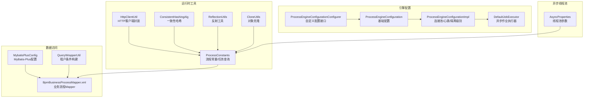
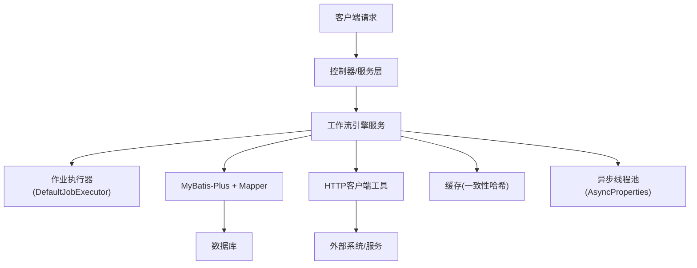
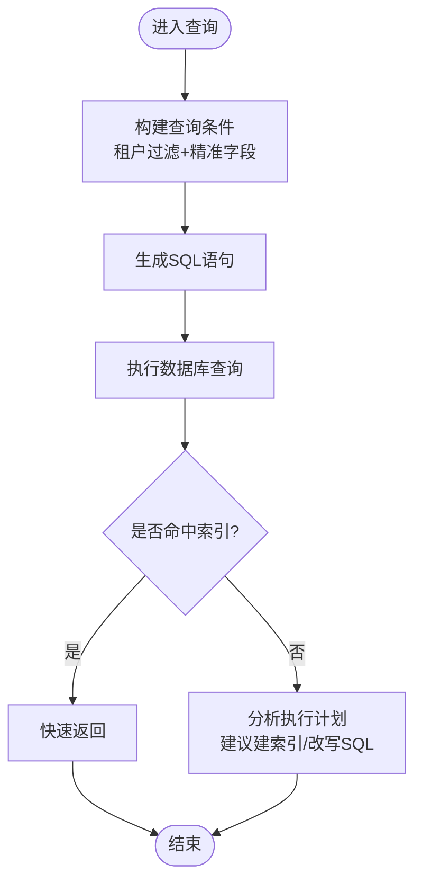
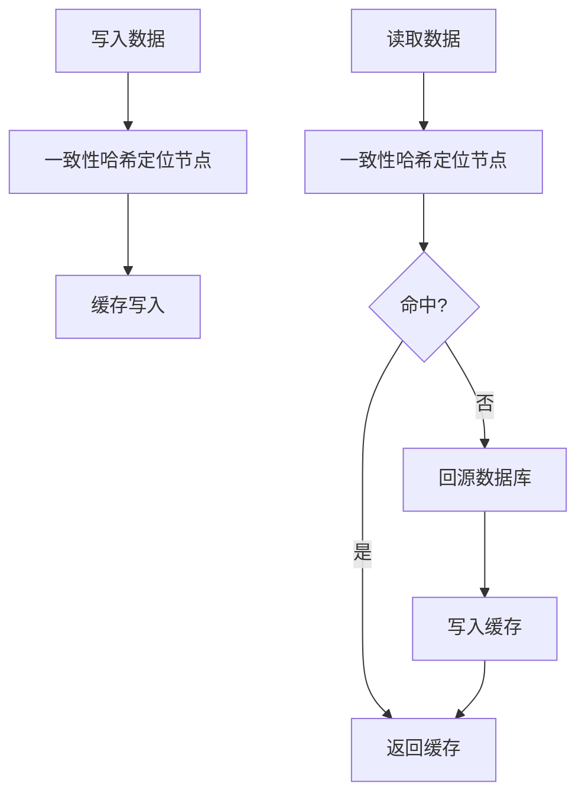
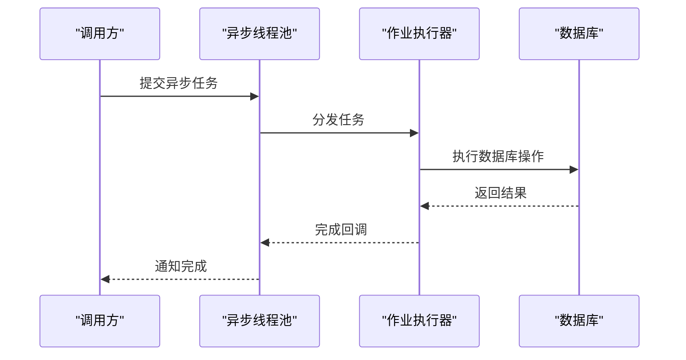
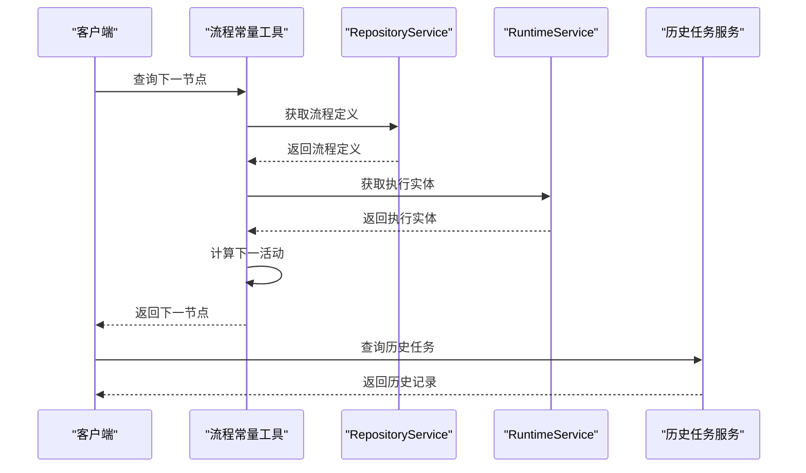
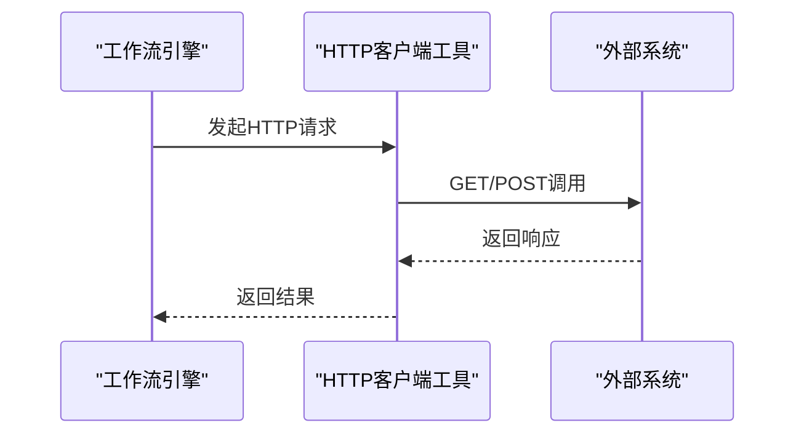
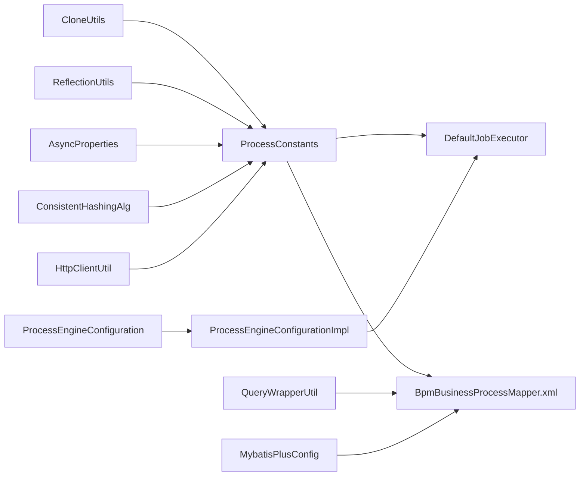

# 性能优化

<cite>
**本文引用的文件**
- [HttpClientUtil.java](file://antflow-engine/src/main/java/org/openoa/engine/utils/HttpClientUtil.java)
- [BpmBusinessProcessMapper.xml](file://antflow-engine/src/main/resources/mapper/BpmBusinessProcessMapper.xml)
- [ProcessConstants.java](file://antflow-engine/src/main/java/org/openoa/engine/bpmnconf/common/ProcessConstants.java)
- [ConsistentHashingAlg.java](file://antflow-engine/src/main/java/org/openoa/engine/utils/ConsistentHashingAlg.java)
- [QueryWrapperUtil.java](file://antflow-engine/src/main/java/org/openoa/engine/utils/QueryWrapperUtil.java)
- [ProcessEngineConfiguration.java](file://antflow-base/src/main/java/org/activiti/engine/ProcessEngineConfiguration.java)
- [ProcessEngineConfigurationImpl.java](file://antflow-base/src/main/java/org/activiti/engine/impl/cfg/ProcessEngineConfigurationImpl.java)
- [DefaultJobExecutor.java](file://antflow-base/src/main/java/org/activiti/engine/impl/jobexecutor/DefaultJobExecutor.java)
- [AsyncProperties.java](file://antflow-engine/src/main/java/org/openoa/engine/conf/confval/AsyncProperties.java)
- [MybatisPlusConfig.java](file://antflow-engine/src/main/java/org/openoa/engine/conf/mybatis/MybatisPlusConfig.java)
- [ProcessEngineConfigurationConfigurer.java](file://antflow-engine/src/main/java/org/openoa/engine/conf/engineconfig/ProcessEngineConfigurationConfigurer.java)
- [ReflectionUtils.java](file://antflow-engine/src/main/java/org/openoa/engine/utils/ReflectionUtils.java)
- [CloneUtils.java](file://antflow-engine/src/main/java/org/openoa/engine/utils/CloneUtils.java)
</cite>

## 目录
1. [简介](#简介)
2. [项目结构](#项目结构)
3. [核心组件](#核心组件)
4. [架构总览](#架构总览)
5. [详细组件分析](#详细组件分析)
6. [依赖关系分析](#依赖关系分析)
7. [性能考量](#性能考量)
8. [故障排查指南](#故障排查指南)
9. [结论](#结论)
10. [附录](#附录)

## 简介
本指南聚焦于工作流引擎系统的性能优化实践，围绕以下目标展开：识别并定位系统性能瓶颈（CPU、内存、数据库、网络），给出数据库查询优化策略（索引、SQL、连接池、批量）、缓存策略（命中率、失效、一致性）、异步处理（线程池、调度、消息队列、并发控制）、工作流引擎调优（流程实例、任务调度、变量存储），并提供性能测试与基准对比方法。内容基于仓库中的实际代码与配置进行提炼，帮助读者在不改变业务逻辑的前提下获得稳定且可量化的性能收益。

## 项目结构
本项目采用前后端分离与模块化设计，后端由工作流引擎核心模块、Spring Boot Starter、Web工程与前端Vue工程组成。与性能优化直接相关的关键模块与文件如下：
- 引擎配置与执行器：Activiti配置、默认作业执行器、自定义配置接口
- 数据访问层：MyBatis-Plus配置、Mapper XML、租户条件工具
- 工作流运行时工具：流程常量与查询、HTTP客户端工具
- 分布式与一致性：一致性哈希算法
- 反射与对象复制：反射工具、克隆工具
- 异步线程池：异步线程池参数配置

**图示来源**
- [ProcessEngineConfiguration.java:510-556](file://antflow-base/src/main/java/org/activiti/engine/ProcessEngineConfiguration.java#L510-L556)
- [ProcessEngineConfigurationImpl.java:733-763](file://antflow-base/src/main/java/org/activiti/engine/impl/cfg/ProcessEngineConfigurationImpl.java#L733-L763)
- [DefaultJobExecutor.java:113-140](file://antflow-base/src/main/java/org/activiti/engine/impl/jobexecutor/DefaultJobExecutor.java#L113-L140)
- [ProcessEngineConfigurationConfigurer.java:1-29](file://antflow-engine/src/main/java/org/openoa/engine/conf/engineconfig/ProcessEngineConfigurationConfigurer.java#L1-L29)
- [MybatisPlusConfig.java:112-140](file://antflow-engine/src/main/java/org/openoa/engine/conf/mybatis/MybatisPlusConfig.java#L112-L140)
- [BpmBusinessProcessMapper.xml:1-67](file://antflow-engine/src/main/resources/mapper/BpmBusinessProcessMapper.xml#L1-L67)
- [QueryWrapperUtil.java:1-25](file://antflow-engine/src/main/java/org/openoa/engine/utils/QueryWrapperUtil.java#L1-L25)
- [ProcessConstants.java:1-158](file://antflow-engine/src/main/java/org/openoa/engine/bpmnconf/common/ProcessConstants.java#L1-L158)
- [HttpClientUtil.java:1-101](file://antflow-engine/src/main/java/org/openoa/engine/utils/HttpClientUtil.java#L1-L101)
- [ConsistentHashingAlg.java:1-87](file://antflow-engine/src/main/java/org/openoa/engine/utils/ConsistentHashingAlg.java#L1-L87)
- [AsyncProperties.java:1-56](file://antflow-engine/src/main/java/org/openoa/engine/conf/confval/AsyncProperties.java#L1-L56)
- [ReflectionUtils.java:1-135](file://antflow-engine/src/main/java/org/openoa/engine/utils/ReflectionUtils.java#L1-L135)
- [CloneUtils.java:1-31](file://antflow-engine/src/main/java/org/openoa/engine/utils/CloneUtils.java#L1-L31)

**章节来源**
- [ProcessEngineConfiguration.java:510-556](file://antflow-base/src/main/java/org/activiti/engine/ProcessEngineConfiguration.java#L510-L556)
- [ProcessEngineConfigurationImpl.java:733-763](file://antflow-base/src/main/java/org/activiti/engine/impl/cfg/ProcessEngineConfigurationImpl.java#L733-L763)
- [DefaultJobExecutor.java:113-140](file://antflow-base/src/main/java/org/activiti/engine/impl/jobexecutor/DefaultJobExecutor.java#L113-L140)
- [ProcessEngineConfigurationConfigurer.java:1-29](file://antflow-engine/src/main/java/org/openoa/engine/conf/engineconfig/ProcessEngineConfigurationConfigurer.java#L1-L29)
- [MybatisPlusConfig.java:112-140](file://antflow-engine/src/main/java/org/openoa/engine/conf/mybatis/MybatisPlusConfig.java#L112-L140)
- [BpmBusinessProcessMapper.xml:1-67](file://antflow-engine/src/main/resources/mapper/BpmBusinessProcessMapper.xml#L1-L67)
- [QueryWrapperUtil.java:1-25](file://antflow-engine/src/main/java/org/openoa/engine/utils/QueryWrapperUtil.java#L1-L25)
- [ProcessConstants.java:1-158](file://antflow-engine/src/main/java/org/openoa/engine/bpmnconf/common/ProcessConstants.java#L1-L158)
- [HttpClientUtil.java:1-101](file://antflow-engine/src/main/java/org/openoa/engine/utils/HttpClientUtil.java#L1-L101)
- [ConsistentHashingAlg.java:1-87](file://antflow-engine/src/main/java/org/openoa/engine/utils/ConsistentHashingAlg.java#L1-L87)
- [AsyncProperties.java:1-56](file://antflow-engine/src/main/java/org/openoa/engine/conf/confval/AsyncProperties.java#L1-L56)
- [ReflectionUtils.java:1-135](file://antflow-engine/src/main/java/org/openoa/engine/utils/ReflectionUtils.java#L1-L135)
- [CloneUtils.java:1-31](file://antflow-engine/src/main/java/org/openoa/engine/utils/CloneUtils.java#L1-L31)

## 核心组件
- 引擎配置与连接池：通过基础配置类与实现类设置JDBC连接池上限、空闲连接、checkout超时、等待时间、心跳检测与事务隔离级别，直接影响数据库侧吞吐与稳定性。
- 默认作业执行器：异步作业线程池的核心，包含线程存活时间、队列大小、锁时间、等待关闭时间等参数，决定后台任务的并发与响应能力。
- MyBatis-Plus配置：提供分页、逻辑删除、自动填充等增强能力，结合Mapper XML实现高效查询与更新。
- 租户条件构建：在严格租户模式下自动追加租户过滤条件，避免跨租户数据泄露并减少无效扫描。
- 流程常量与查询：封装流程实例、任务查询、历史任务记录等常用操作，便于统一优化与复用。
- HTTP客户端工具：统一REST调用入口，便于集中限流、熔断与链路追踪。
- 一致性哈希：用于分布式缓存或分片场景，提升缓存命中与扩容稳定性。
- 异步线程池参数：核心/最大线程数、队列容量、线程名前缀、保活时间、优雅停机等待时间等，决定异步任务的吞吐与稳定性。
- 反射与对象复制：在流程适配与数据转换中减少重复代码，但需注意性能开销。

**章节来源**
- [ProcessEngineConfiguration.java:510-556](file://antflow-base/src/main/java/org/activiti/engine/ProcessEngineConfiguration.java#L510-L556)
- [ProcessEngineConfigurationImpl.java:733-763](file://antflow-base/src/main/java/org/activiti/engine/impl/cfg/ProcessEngineConfigurationImpl.java#L733-L763)
- [DefaultJobExecutor.java:113-140](file://antflow-base/src/main/java/org/activiti/engine/impl/jobexecutor/DefaultJobExecutor.java#L113-L140)
- [MybatisPlusConfig.java:112-140](file://antflow-engine/src/main/java/org/openoa/engine/conf/mybatis/MybatisPlusConfig.java#L112-L140)
- [QueryWrapperUtil.java:1-25](file://antflow-engine/src/main/java/org/openoa/engine/utils/QueryWrapperUtil.java#L1-L25)
- [ProcessConstants.java:1-158](file://antflow-engine/src/main/java/org/openoa/engine/bpmnconf/common/ProcessConstants.java#L1-L158)
- [HttpClientUtil.java:1-101](file://antflow-engine/src/main/java/org/openoa/engine/utils/HttpClientUtil.java#L1-L101)
- [ConsistentHashingAlg.java:1-87](file://antflow-engine/src/main/java/org/openoa/engine/utils/ConsistentHashingAlg.java#L1-L87)
- [AsyncProperties.java:1-56](file://antflow-engine/src/main/java/org/openoa/engine/conf/confval/AsyncProperties.java#L1-L56)
- [ReflectionUtils.java:1-135](file://antflow-engine/src/main/java/org/openoa/engine/utils/ReflectionUtils.java#L1-L135)
- [CloneUtils.java:1-31](file://antflow-engine/src/main/java/org/openoa/engine/utils/CloneUtils.java#L1-L31)

## 架构总览
系统性能优化涉及“配置—执行—数据—网络—缓存—异步”全链路协同。下图展示关键路径与优化切入点：

**图示来源**
- [DefaultJobExecutor.java:113-140](file://antflow-base/src/main/java/org/activiti/engine/impl/jobexecutor/DefaultJobExecutor.java#L113-L140)
- [MybatisPlusConfig.java:112-140](file://antflow-engine/src/main/java/org/openoa/engine/conf/mybatis/MybatisPlusConfig.java#L112-L140)
- [BpmBusinessProcessMapper.xml:1-67](file://antflow-engine/src/main/resources/mapper/BpmBusinessProcessMapper.xml#L1-L67)
- [HttpClientUtil.java:1-101](file://antflow-engine/src/main/java/org/openoa/engine/utils/HttpClientUtil.java#L1-L101)
- [ConsistentHashingAlg.java:1-87](file://antflow-engine/src/main/java/org/openoa/engine/utils/ConsistentHashingAlg.java#L1-L87)
- [AsyncProperties.java:1-56](file://antflow-engine/src/main/java/org/openoa/engine/conf/confval/AsyncProperties.java#L1-L56)

## 详细组件分析

### 数据库性能优化策略
- 连接池配置
  - 最大活跃连接、最大空闲连接、checkout超时、等待时间、心跳检测与查询、长时间未使用心跳间隔、默认事务隔离级别等均在基础配置实现中设置，直接影响数据库连接争用与可用性。
  - 建议：根据QPS与慢查询比例调整最大活跃/空闲连接；开启健康检查并设置合理心跳查询；按业务隔离级别选择合适的事务隔离。
- 查询优化
  - 使用租户条件构建工具在严格租户模式下自动追加过滤，避免全表扫描。
  - Mapper XML中使用精确字段列表与条件片段，避免SELECT *，减少网络与解析开销。
- 批量操作优化
  - MyBatis-Plus支持批量插入/更新，建议在流程批处理场景中使用，减少往返次数。
- 索引优化
  - 建议对高频WHERE与JOIN字段建立复合索引，结合执行计划分析热点SQL。

**图示来源**
- [QueryWrapperUtil.java:1-25](file://antflow-engine/src/main/java/org/openoa/engine/utils/QueryWrapperUtil.java#L1-L25)
- [BpmBusinessProcessMapper.xml:1-67](file://antflow-engine/src/main/resources/mapper/BpmBusinessProcessMapper.xml#L1-L67)
- [ProcessEngineConfigurationImpl.java:733-763](file://antflow-base/src/main/java/org/activiti/engine/impl/cfg/ProcessEngineConfigurationImpl.java#L733-L763)

**章节来源**
- [ProcessEngineConfigurationImpl.java:733-763](file://antflow-base/src/main/java/org/activiti/engine/impl/cfg/ProcessEngineConfigurationImpl.java#L733-L763)
- [QueryWrapperUtil.java:1-25](file://antflow-engine/src/main/java/org/openoa/engine/utils/QueryWrapperUtil.java#L1-L25)
- [BpmBusinessProcessMapper.xml:1-67](file://antflow-engine/src/main/resources/mapper/BpmBusinessProcessMapper.xml#L1-L67)

### 缓存策略实施
- Redis配置与一致性
  - 使用一致性哈希算法将键映射到缓存节点，降低扩容时的数据迁移成本，提升命中率与稳定性。
  - 建议：为热点数据设置合理的TTL与过期策略；对读多写少场景启用预热；对强一致场景采用写后失效或版本号控制。
- 命中率优化
  - 通过热点数据识别与预加载策略提升命中率；对长尾数据采用降级或旁路策略。
- 失效策略
  - 写操作触发失效，读操作触发回源；对批量更新采用批量失效或延迟失效。

**图示来源**
- [ConsistentHashingAlg.java:1-87](file://antflow-engine/src/main/java/org/openoa/engine/utils/ConsistentHashingAlg.java#L1-L87)

**章节来源**
- [ConsistentHashingAlg.java:1-87](file://antflow-engine/src/main/java/org/openoa/engine/utils/ConsistentHashingAlg.java#L1-L87)

### 异步处理优化方案
- 线程池配置
  - 核心线程数、最大线程数、队列容量、线程名前缀、保活时间、优雅停机等待时间等参数决定异步任务的并发与稳定性。
  - 建议：核心线程数与CPU核数匹配，最大线程数按峰值突发流量设定，队列容量按峰值积压容忍度设定。
- 异步任务调度
  - 结合作业执行器的锁时间、等待时间与队列满策略，避免阻塞与丢弃。
- 并发控制
  - 在业务层对高并发场景进行限流与熔断，防止级联故障。

**图示来源**
- [AsyncProperties.java:1-56](file://antflow-engine/src/main/java/org/openoa/engine/conf/confval/AsyncProperties.java#L1-L56)
- [DefaultJobExecutor.java:113-140](file://antflow-base/src/main/java/org/activiti/engine/impl/jobexecutor/DefaultJobExecutor.java#L113-L140)

**章节来源**
- [AsyncProperties.java:1-56](file://antflow-engine/src/main/java/org/openoa/engine/conf/confval/AsyncProperties.java#L1-L56)
- [DefaultJobExecutor.java:113-140](file://antflow-base/src/main/java/org/activiti/engine/impl/jobexecutor/DefaultJobExecutor.java#L113-L140)

### 工作流引擎性能调优
- 流程实例管理
  - 通过流程常量工具统一查询当前任务、下一节点、历史任务等，避免重复查询与无谓计算。
- 任务调度优化
  - 合理设置作业执行器的锁时间与等待时间，避免任务积压与死锁。
- 变量存储优化
  - 将大对象序列化为轻量结构或落盘，减少流程变量在内存中的占用。

**图示来源**
- [ProcessConstants.java:1-158](file://antflow-engine/src/main/java/org/openoa/engine/bpmnconf/common/ProcessConstants.java#L1-L158)

**章节来源**
- [ProcessConstants.java:1-158](file://antflow-engine/src/main/java/org/openoa/engine/bpmnconf/common/ProcessConstants.java#L1-L158)

### 网络延迟检测与优化
- 统一HTTP客户端
  - 通过HTTP客户端工具封装GET/POST请求，便于集中限流、熔断与链路追踪。
- 外部系统集成
  - 对外部系统调用进行超时与重试策略配置，避免阻塞主流程。

**图示来源**
- [HttpClientUtil.java:1-101](file://antflow-engine/src/main/java/org/openoa/engine/utils/HttpClientUtil.java#L1-L101)

**章节来源**
- [HttpClientUtil.java:1-101](file://antflow-engine/src/main/java/org/openoa/engine/utils/HttpClientUtil.java#L1-L101)

## 依赖关系分析
- 引擎配置依赖连接池与心跳设置，影响数据库侧性能与稳定性。
- 作业执行器依赖线程池参数，影响异步任务吞吐与延迟。
- 数据访问层依赖租户条件与Mapper XML，影响查询效率与安全性。
- 工具层依赖反射与对象复制，影响对象转换性能与内存占用。

**图示来源**
- [ProcessEngineConfiguration.java:510-556](file://antflow-base/src/main/java/org/activiti/engine/ProcessEngineConfiguration.java#L510-L556)
- [ProcessEngineConfigurationImpl.java:733-763](file://antflow-base/src/main/java/org/activiti/engine/impl/cfg/ProcessEngineConfigurationImpl.java#L733-L763)
- [DefaultJobExecutor.java:113-140](file://antflow-base/src/main/java/org/activiti/engine/impl/jobexecutor/DefaultJobExecutor.java#L113-L140)
- [MybatisPlusConfig.java:112-140](file://antflow-engine/src/main/java/org/openoa/engine/conf/mybatis/MybatisPlusConfig.java#L112-L140)
- [BpmBusinessProcessMapper.xml:1-67](file://antflow-engine/src/main/resources/mapper/BpmBusinessProcessMapper.xml#L1-L67)
- [QueryWrapperUtil.java:1-25](file://antflow-engine/src/main/java/org/openoa/engine/utils/QueryWrapperUtil.java#L1-L25)
- [ProcessConstants.java:1-158](file://antflow-engine/src/main/java/org/openoa/engine/bpmnconf/common/ProcessConstants.java#L1-L158)
- [HttpClientUtil.java:1-101](file://antflow-engine/src/main/java/org/openoa/engine/utils/HttpClientUtil.java#L1-L101)
- [ConsistentHashingAlg.java:1-87](file://antflow-engine/src/main/java/org/openoa/engine/utils/ConsistentHashingAlg.java#L1-L87)
- [AsyncProperties.java:1-56](file://antflow-engine/src/main/java/org/openoa/engine/conf/confval/AsyncProperties.java#L1-L56)
- [ReflectionUtils.java:1-135](file://antflow-engine/src/main/java/org/openoa/engine/utils/ReflectionUtils.java#L1-L135)
- [CloneUtils.java:1-31](file://antflow-engine/src/main/java/org/openoa/engine/utils/CloneUtils.java#L1-L31)

**章节来源**
- [ProcessEngineConfiguration.java:510-556](file://antflow-base/src/main/java/org/activiti/engine/ProcessEngineConfiguration.java#L510-L556)
- [ProcessEngineConfigurationImpl.java:733-763](file://antflow-base/src/main/java/org/activiti/engine/impl/cfg/ProcessEngineConfigurationImpl.java#L733-L763)
- [DefaultJobExecutor.java:113-140](file://antflow-base/src/main/java/org/activiti/engine/impl/jobexecutor/DefaultJobExecutor.java#L113-L140)
- [MybatisPlusConfig.java:112-140](file://antflow-engine/src/main/java/org/openoa/engine/conf/mybatis/MybatisPlusConfig.java#L112-L140)
- [BpmBusinessProcessMapper.xml:1-67](file://antflow-engine/src/main/resources/mapper/BpmBusinessProcessMapper.xml#L1-L67)
- [QueryWrapperUtil.java:1-25](file://antflow-engine/src/main/java/org/openoa/engine/utils/QueryWrapperUtil.java#L1-L25)
- [ProcessConstants.java:1-158](file://antflow-engine/src/main/java/org/openoa/engine/bpmnconf/common/ProcessConstants.java#L1-L158)
- [HttpClientUtil.java:1-101](file://antflow-engine/src/main/java/org/openoa/engine/utils/HttpClientUtil.java#L1-L101)
- [ConsistentHashingAlg.java:1-87](file://antflow-engine/src/main/java/org/openoa/engine/utils/ConsistentHashingAlg.java#L1-L87)
- [AsyncProperties.java:1-56](file://antflow-engine/src/main/java/org/openoa/engine/conf/confval/AsyncProperties.java#L1-L56)
- [ReflectionUtils.java:1-135](file://antflow-engine/src/main/java/org/openoa/engine/utils/ReflectionUtils.java#L1-L135)
- [CloneUtils.java:1-31](file://antflow-engine/src/main/java/org/openoa/engine/utils/CloneUtils.java#L1-L31)

## 性能考量
- CPU使用率分析
  - 关注异步线程池与作业执行器的线程利用率，避免过度上下文切换；对热点方法进行剖析，减少不必要的反射与字符串拼接。
- 内存占用监控
  - 控制流程变量大小与生命周期；对大对象采用序列化或落盘；监控堆外内存（如Netty/Redis客户端）。
- 数据库查询性能分析
  - 使用租户条件与精准字段列表；对高频SQL建立索引；限制一次性返回的数据量。
- 网络延迟检测
  - 统一HTTP客户端，设置超时与重试；对外部依赖进行熔断与降级。

[本节为通用指导，无需特定文件引用]

## 故障排查指南
- 数据库连接问题
  - 检查连接池参数（最大活跃/空闲、checkout超时、等待时间、心跳）与事务隔离级别设置，结合慢查询日志定位瓶颈。
- 异步任务积压
  - 调整线程池参数与队列容量，检查锁时间与等待时间，必要时增加核心线程数。
- 缓存命中率低
  - 检查一致性哈希分布与节点数量，评估TTL与预热策略；对热点键进行拆分与冗余。
- HTTP调用异常
  - 查看统一HTTP客户端的超时与重试配置，结合链路追踪定位慢调用。

**章节来源**
- [ProcessEngineConfigurationImpl.java:733-763](file://antflow-base/src/main/java/org/activiti/engine/impl/cfg/ProcessEngineConfigurationImpl.java#L733-L763)
- [DefaultJobExecutor.java:113-140](file://antflow-base/src/main/java/org/activiti/engine/impl/jobexecutor/DefaultJobExecutor.java#L113-L140)
- [AsyncProperties.java:1-56](file://antflow-engine/src/main/java/org/openoa/engine/conf/confval/AsyncProperties.java#L1-L56)
- [ConsistentHashingAlg.java:1-87](file://antflow-engine/src/main/java/org/openoa/engine/utils/ConsistentHashingAlg.java#L1-L87)
- [HttpClientUtil.java:1-101](file://antflow-engine/src/main/java/org/openoa/engine/utils/HttpClientUtil.java#L1-L101)

## 结论
通过在引擎配置、连接池、作业执行器、数据访问、缓存、异步线程池与网络调用等层面进行系统性优化，可显著提升工作流引擎的整体性能与稳定性。建议以基准测试为依据，持续监控关键指标，并结合业务场景迭代优化策略。

[本节为总结，无需特定文件引用]

## 附录
- 性能测试方法
  - 基准测试：使用JMH或Gatling对关键路径（流程启动、任务查询、异步任务提交）进行压力测试，记录吞吐与延迟。
  - 回归测试：在每次优化后进行回归测试，确保功能正确性与性能提升。
- 优化前后对比
  - 记录CPU使用率、内存占用、数据库连接数、平均响应时间、错误率等指标，形成对比报告。

[本节为通用指导，无需特定文件引用]