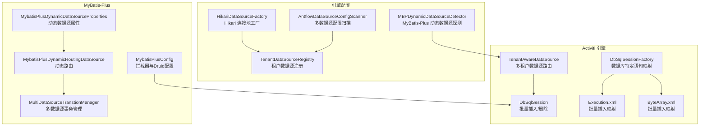
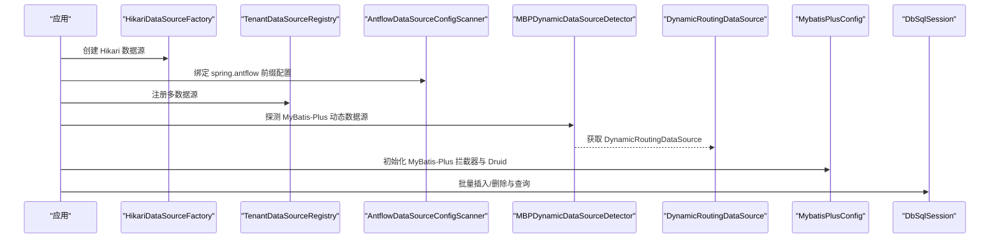
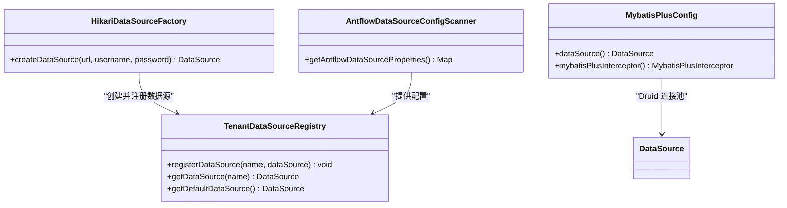
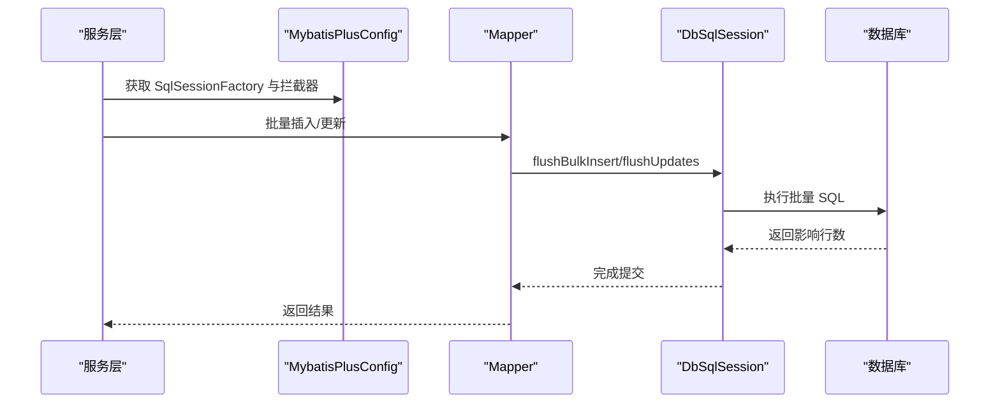
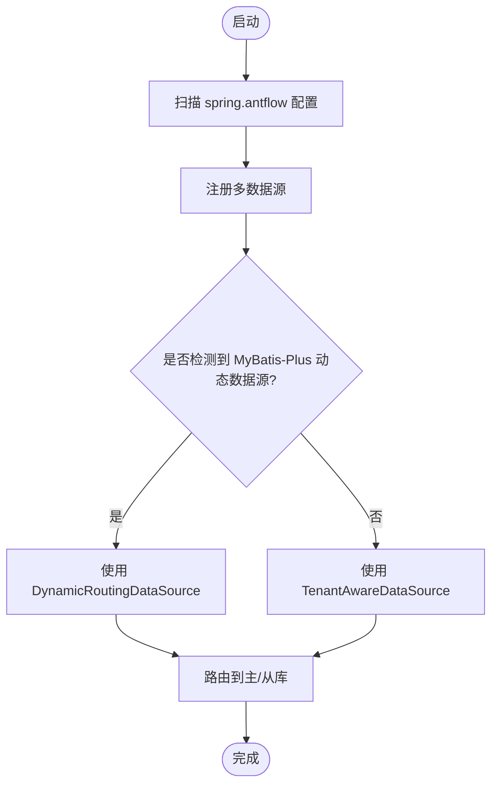
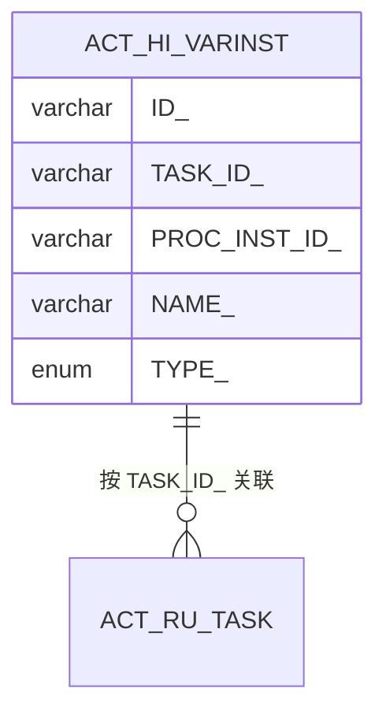
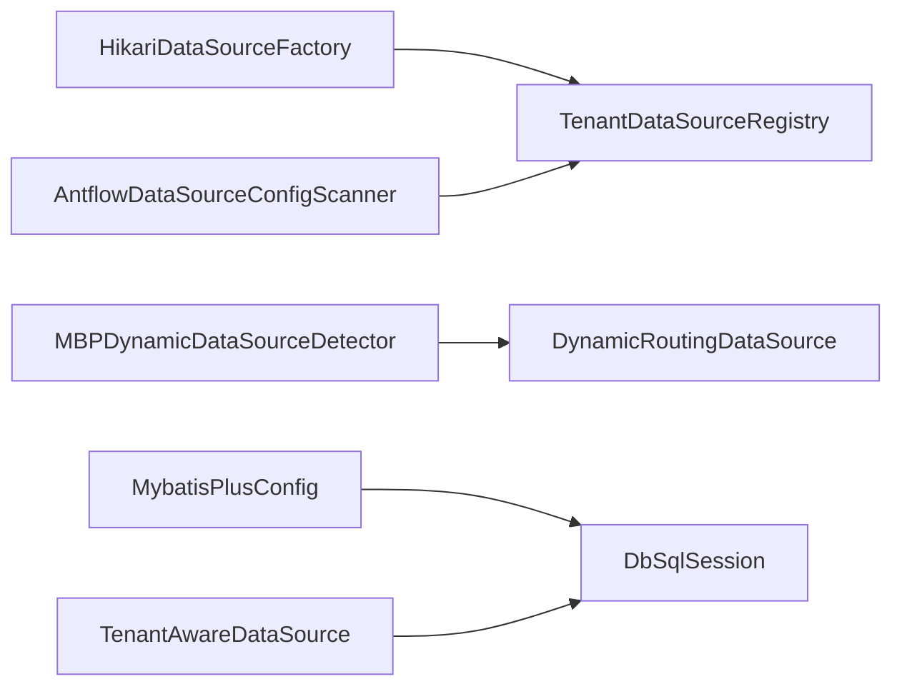

# 数据库性能优化

<cite>
**本文引用的文件**
- [HikariDataSourceFactory.java](file://antflow-engine/src/main/java/org/openoa/engine/conf/engineconfig/HikariDataSourceFactory.java)
- [TenantDataSourceRegistry.java](file://antflow-engine/src/main/java/org/openoa/engine/conf/engineconfig/TenantDataSourceRegistry.java)
- [AntflowDataSourceConfigScanner.java](file://antflow-engine/src/main/java/org/openoa/engine/conf/engineconfig/AntflowDataSourceConfigScanner.java)
- [MBPDynamicDataSourceDetector.java](file://antflow-engine/src/main/java/org/openoa/engine/conf/engineconfig/MBPDynamicDataSourceDetector.java)
- [MybatisPlusConfig.java](file://antflow-engine/src/main/java/org/openoa/engine/conf/mybatis/MybatisPlusConfig.java)
- [MybatisPlusDynamicDataSourceProperties.java](file://antflow-engine/src/main/java/org/openoa/engine/conf/mybatis/MybatisPlusDynamicDataSourceProperties.java)
- [MybatisPlusDynamicRoutingDataSource.java](file://antflow-engine/src/main/java/org/openoa/engine/conf/mybatis/MybatisPlusDynamicRoutingDataSource.java)
- [MultiDataSourceTranstionManager.java](file://antflow-engine/src/main/java/org/openoa/engine/conf/mybatis/MultiDataSourceTranstionManager.java)
- [TenantAwareDataSource.java](file://antflow-base/src/main/java/org/activiti/engine/impl/cfg/multitenant/TenantAwareDataSource.java)
- [DbSqlSession.java](file://antflow-base/src/main/java/org/activiti/engine/impl/db/DbSqlSession.java)
- [DbSqlSessionFactory.java](file://antflow-base/src/main/java/org/activiti/engine/impl/db/DbSqlSessionFactory.java)
- [Execution.xml](file://antflow-base/src/main/resources/org/activiti/db/mapping/entity/Execution.xml)
- [ByteArray.xml](file://antflow-base/src/main/resources/org/activiti/db/mapping/entity/ByteArray.xml)
- [activiti.mysql.create.engine.sql](file://antflow-base/src/main/resources/org/activiti/db/create/activiti.mysql.create.engine.sql)
- [ACT_IDX_HI_PROCVAR_TASK_ID.sql](file://antflow-base/src/main/resources/org/activiti/db/upgrade/activiti.mysql.upgradestep.51630.to.51640.history.sql)
</cite>

## 目录
1. [简介](#简介)
2. [项目结构](#项目结构)
3. [核心组件](#核心组件)
4. [架构总览](#架构总览)
5. [详细组件分析](#详细组件分析)
6. [依赖分析](#依赖分析)
7. [性能考虑](#性能考虑)
8. [故障排查指南](#故障排查指南)
9. [结论](#结论)
10. [附录](#附录)

## 简介
本指南聚焦于数据库性能优化，结合仓库中的连接池、MyBatis-Plus、多数据源与索引等实现，给出可落地的参数调优、连接泄漏检测、批量优化、读写分离与监控建议。内容涵盖：
- 连接池优化：HikariCP 与 Druid 的参数调优、连接泄漏检测、最大连接数设置
- MyBatis-Plus 性能：批量操作、二级缓存、分页与乐观锁插件、SQL 执行计划分析
- 多数据源：动态路由、读写分离、负载均衡与事务管理
- 索引优化：复合索引、覆盖索引、避免索引失效
- 测试与监控：性能测试方法、慢查询分析工具、监控指标解读

## 项目结构
本项目采用多模块结构，数据库相关能力主要分布在以下模块：
- antflow-engine：连接池工厂、多数据源注册与扫描、MyBatis-Plus 配置与动态数据源桥接
- antflow-base：Activiti 引擎数据库建模与批量 SQL 映射，包含索引与批量插入语句
- antflow-web：应用入口（未在本文展开）

**图表来源**
- [HikariDataSourceFactory.java:1-27](file://antflow-engine/src/main/java/org/openoa/engine/conf/engineconfig/HikariDataSourceFactory.java#L1-L27)
- [TenantDataSourceRegistry.java:1-64](file://antflow-engine/src/main/java/org/openoa/engine/conf/engineconfig/TenantDataSourceRegistry.java#L1-L64)
- [AntflowDataSourceConfigScanner.java:1-31](file://antflow-engine/src/main/java/org/openoa/engine/conf/engineconfig/AntflowDataSourceConfigScanner.java#L1-L31)
- [MBPDynamicDataSourceDetector.java:1-58](file://antflow-engine/src/main/java/org/openoa/engine/conf/engineconfig/MBPDynamicDataSourceDetector.java#L1-L58)
- [MybatisPlusConfig.java:1-141](file://antflow-engine/src/main/java/org/openoa/engine/conf/mybatis/MybatisPlusConfig.java#L1-L141)
- [MybatisPlusDynamicDataSourceProperties.java:1-60](file://antflow-engine/src/main/java/org/openoa/engine/conf/mybatis/MybatisPlusDynamicDataSourceProperties.java#L1-L60)
- [MybatisPlusDynamicRoutingDataSource.java:1-28](file://antflow-engine/src/main/java/org/openoa/engine/conf/mybatis/MybatisPlusDynamicRoutingDataSource.java#L1-L28)
- [MultiDataSourceTranstionManager.java:1-28](file://antflow-engine/src/main/java/org/openoa/engine/conf/mybatis/MultiDataSourceTranstionManager.java#L1-L28)
- [TenantAwareDataSource.java:33-70](file://antflow-base/src/main/java/org/activiti/engine/impl/cfg/multitenant/TenantAwareDataSource.java#L33-L70)
- [DbSqlSession.java:218-867](file://antflow-base/src/main/java/org/activiti/engine/impl/db/DbSqlSession.java#L218-L867)
- [DbSqlSessionFactory.java:71-137](file://antflow-base/src/main/java/org/activiti/engine/impl/db/DbSqlSessionFactory.java#L71-L137)
- [Execution.xml:51-80](file://antflow-base/src/main/resources/org/activiti/db/mapping/entity/Execution.xml#L51-L80)
- [ByteArray.xml:34-70](file://antflow-base/src/main/resources/org/activiti/db/mapping/entity/ByteArray.xml#L34-L70)

**章节来源**
- [HikariDataSourceFactory.java:1-27](file://antflow-engine/src/main/java/org/openoa/engine/conf/engineconfig/HikariDataSourceFactory.java#L1-L27)
- [TenantDataSourceRegistry.java:1-64](file://antflow-engine/src/main/java/org/openoa/engine/conf/engineconfig/TenantDataSourceRegistry.java#L1-L64)
- [AntflowDataSourceConfigScanner.java:1-31](file://antflow-engine/src/main/java/org/openoa/engine/conf/engineconfig/AntflowDataSourceConfigScanner.java#L1-L31)
- [MBPDynamicDataSourceDetector.java:1-58](file://antflow-engine/src/main/java/org/openoa/engine/conf/engineconfig/MBPDynamicDataSourceDetector.java#L1-L58)
- [MybatisPlusConfig.java:1-141](file://antflow-engine/src/main/java/org/openoa/engine/conf/mybatis/MybatisPlusConfig.java#L1-L141)
- [MybatisPlusDynamicDataSourceProperties.java:1-60](file://antflow-engine/src/main/java/org/openoa/engine/conf/mybatis/MybatisPlusDynamicDataSourceProperties.java#L1-L60)
- [MybatisPlusDynamicRoutingDataSource.java:1-28](file://antflow-engine/src/main/java/org/openoa/engine/conf/mybatis/MybatisPlusDynamicRoutingDataSource.java#L1-L28)
- [MultiDataSourceTranstionManager.java:1-28](file://antflow-engine/src/main/java/org/openoa/engine/conf/mybatis/MultiDataSourceTranstionManager.java#L1-L28)
- [TenantAwareDataSource.java:33-70](file://antflow-base/src/main/java/org/activiti/engine/impl/cfg/multitenant/TenantAwareDataSource.java#L33-L70)
- [DbSqlSession.java:218-867](file://antflow-base/src/main/java/org/activiti/engine/impl/db/DbSqlSession.java#L218-L867)
- [DbSqlSessionFactory.java:71-137](file://antflow-base/src/main/java/org/activiti/engine/impl/db/DbSqlSessionFactory.java#L71-L137)
- [Execution.xml:51-80](file://antflow-base/src/main/resources/org/activiti/db/mapping/entity/Execution.xml#L51-L80)
- [ByteArray.xml:34-70](file://antflow-base/src/main/resources/org/activiti/db/mapping/entity/ByteArray.xml#L34-L70)

## 核心组件
- 连接池工厂与注册
  - HikariDataSourceFactory：默认 Hikari 连接池工厂，提供最大池大小与最小空闲数等基础配置入口
  - TenantDataSourceRegistry：基于配置扫描注册多租户/多数据源，支持回退到默认数据源
  - AntflowDataSourceConfigScanner：从环境变量中绑定前缀 spring.antflow 的多数据源配置
- MyBatis-Plus 配置
  - MybatisPlusConfig：示例化 Druid 连接池配置与 MyBatis-Plus 拦截器（分页、乐观锁）
  - MybatisPlusDynamicDataSourceProperties：基于 Dynamic-DS 属性构建 Druid 连接池参数
  - MybatisPlusDynamicRoutingDataSource：动态路由数据源装配
  - MultiDataSourceTranstionManager：多数据源事务管理器
  - MBPDynamicDataSourceDetector：检测是否存在 MyBatis-Plus 动态数据源并优先使用
- Activiti 引擎与索引
  - TenantAwareDataSource：按租户选择数据源
  - DbSqlSession/DbSqlSessionFactory：批量插入/删除与数据库特定语句映射
  - Execution.xml/ByteArray.xml：批量插入 XML 映射
  - activiti.mysql.create.engine.sql：引擎表与索引定义
  - ACT_IDX_HI_PROCVAR_TASK_ID.sql：历史变量表索引升级脚本

**章节来源**
- [HikariDataSourceFactory.java:1-27](file://antflow-engine/src/main/java/org/openoa/engine/conf/engineconfig/HikariDataSourceFactory.java#L1-L27)
- [TenantDataSourceRegistry.java:1-64](file://antflow-engine/src/main/java/org/openoa/engine/conf/engineconfig/TenantDataSourceRegistry.java#L1-L64)
- [AntflowDataSourceConfigScanner.java:1-31](file://antflow-engine/src/main/java/org/openoa/engine/conf/engineconfig/AntflowDataSourceConfigScanner.java#L1-L31)
- [MybatisPlusConfig.java:1-141](file://antflow-engine/src/main/java/org/openoa/engine/conf/mybatis/MybatisPlusConfig.java#L1-L141)
- [MybatisPlusDynamicDataSourceProperties.java:1-60](file://antflow-engine/src/main/java/org/openoa/engine/conf/mybatis/MybatisPlusDynamicDataSourceProperties.java#L1-L60)
- [MybatisPlusDynamicRoutingDataSource.java:1-28](file://antflow-engine/src/main/java/org/openoa/engine/conf/mybatis/MybatisPlusDynamicRoutingDataSource.java#L1-L28)
- [MultiDataSourceTranstionManager.java:1-28](file://antflow-engine/src/main/java/org/openoa/engine/conf/mybatis/MultiDataSourceTranstionManager.java#L1-L28)
- [MBPDynamicDataSourceDetector.java:1-58](file://antflow-engine/src/main/java/org/openoa/engine/conf/engineconfig/MBPDynamicDataSourceDetector.java#L1-L58)
- [TenantAwareDataSource.java:33-70](file://antflow-base/src/main/java/org/activiti/engine/impl/cfg/multitenant/TenantAwareDataSource.java#L33-L70)
- [DbSqlSession.java:218-867](file://antflow-base/src/main/java/org/activiti/engine/impl/db/DbSqlSession.java#L218-L867)
- [DbSqlSessionFactory.java:71-137](file://antflow-base/src/main/java/org/activiti/engine/impl/db/DbSqlSessionFactory.java#L71-L137)
- [Execution.xml:51-80](file://antflow-base/src/main/resources/org/activiti/db/mapping/entity/Execution.xml#L51-L80)
- [ByteArray.xml:34-70](file://antflow-base/src/main/resources/org/activiti/db/mapping/entity/ByteArray.xml#L34-L70)
- [activiti.mysql.create.engine.sql:203-210](file://antflow-base/src/main/resources/org/activiti/db/create/activiti.mysql.create.engine.sql#L203-L210)
- [ACT_IDX_HI_PROCVAR_TASK_ID.sql:1-1](file://antflow-base/src/main/resources/org/activiti/db/upgrade/activiti.mysql.upgradestep.51630.to.51640.history.sql#L1-L1)

## 架构总览
下图展示数据库层的关键交互：连接池工厂与注册、多数据源探测与路由、MyBatis-Plus 插件、Activiti 批量处理与索引。

**图表来源**
- [HikariDataSourceFactory.java:1-27](file://antflow-engine/src/main/java/org/openoa/engine/conf/engineconfig/HikariDataSourceFactory.java#L1-L27)
- [TenantDataSourceRegistry.java:1-64](file://antflow-engine/src/main/java/org/openoa/engine/conf/engineconfig/TenantDataSourceRegistry.java#L1-L64)
- [AntflowDataSourceConfigScanner.java:1-31](file://antflow-engine/src/main/java/org/openoa/engine/conf/engineconfig/AntflowDataSourceConfigScanner.java#L1-L31)
- [MBPDynamicDataSourceDetector.java:1-58](file://antflow-engine/src/main/java/org/openoa/engine/conf/engineconfig/MBPDynamicDataSourceDetector.java#L1-L58)
- [MybatisPlusConfig.java:1-141](file://antflow-engine/src/main/java/org/openoa/engine/conf/mybatis/MybatisPlusConfig.java#L1-L141)
- [DbSqlSession.java:218-867](file://antflow-base/src/main/java/org/activiti/engine/impl/db/DbSqlSession.java#L218-L867)

## 详细组件分析

### 连接池优化：HikariCP 与 Druid
- HikariCP
  - 工厂类提供最大池大小与最小空闲数等参数入口，便于在生产环境按 QPS 与延迟目标调整
  - 建议：根据并发线程峰值设置最大池大小，最小空闲保持较低以减少常驻连接
- Druid
  - 示例配置展示了初始大小、最小空闲、最大活跃、验证查询、PSCache 等参数
  - 建议：开启慢 SQL 记录与合并 SQL，结合监控平台定位热点 SQL；合理设置移除废弃连接超时

**图表来源**
- [HikariDataSourceFactory.java:1-27](file://antflow-engine/src/main/java/org/openoa/engine/conf/engineconfig/HikariDataSourceFactory.java#L1-L27)
- [TenantDataSourceRegistry.java:1-64](file://antflow-engine/src/main/java/org/openoa/engine/conf/engineconfig/TenantDataSourceRegistry.java#L1-L64)
- [AntflowDataSourceConfigScanner.java:1-31](file://antflow-engine/src/main/java/org/openoa/engine/conf/engineconfig/AntflowDataSourceConfigScanner.java#L1-L31)
- [MybatisPlusConfig.java:1-141](file://antflow-engine/src/main/java/org/openoa/engine/conf/mybatis/MybatisPlusConfig.java#L1-L141)

**章节来源**
- [HikariDataSourceFactory.java:1-27](file://antflow-engine/src/main/java/org/openoa/engine/conf/engineconfig/HikariDataSourceFactory.java#L1-L27)
- [MybatisPlusConfig.java:1-141](file://antflow-engine/src/main/java/org/openoa/engine/conf/mybatis/MybatisPlusConfig.java#L1-L141)

### MyBatis-Plus 性能优化
- 分页与乐观锁
  - 使用分页内核与乐观锁内核，避免 N+1 查询与并发更新丢失
- 批量操作
  - 借助 DbSqlSession 的批量插入/删除机制，减少往返次数
  - XML 中提供 Oracle/MySQL 的批量插入映射，提升写入吞吐
- 二级缓存
  - 可结合 Ehcache/Redis 缓存实体与列表结果，降低热数据查询压力
- SQL 执行计划分析
  - 结合慢 SQL 记录与数据库执行计划，识别全表扫描与索引缺失

**图表来源**
- [MybatisPlusConfig.java:86-100](file://antflow-engine/src/main/java/org/openoa/engine/conf/mybatis/MybatisPlusConfig.java#L86-L100)
- [DbSqlSession.java:840-867](file://antflow-base/src/main/java/org/activiti/engine/impl/db/DbSqlSession.java#L840-L867)
- [Execution.xml:51-80](file://antflow-base/src/main/resources/org/activiti/db/mapping/entity/Execution.xml#L51-L80)
- [ByteArray.xml:34-70](file://antflow-base/src/main/resources/org/activiti/db/mapping/entity/ByteArray.xml#L34-L70)

**章节来源**
- [MybatisPlusConfig.java:86-100](file://antflow-engine/src/main/java/org/openoa/engine/conf/mybatis/MybatisPlusConfig.java#L86-L100)
- [DbSqlSession.java:218-867](file://antflow-base/src/main/java/org/activiti/engine/impl/db/DbSqlSession.java#L218-L867)
- [Execution.xml:51-80](file://antflow-base/src/main/resources/org/activiti/db/mapping/entity/Execution.xml#L51-L80)
- [ByteArray.xml:34-70](file://antflow-base/src/main/resources/org/activiti/db/mapping/entity/ByteArray.xml#L34-L70)

### 多数据源配置优化
- 动态数据源切换
  - 通过 MBPDynamicDataSourceDetector 自动探测 MyBatis-Plus 动态数据源，优先使用
  - TenantAwareDataSource 支持按租户选择数据源
- 读写分离与负载均衡
  - 借助 DynamicRoutingDataSource 实现主从路由与权重策略
  - MultiDataSourceTranstionManager 提供多数据源事务管理
- 配置扫描
  - AntflowDataSourceConfigScanner 从 spring.antflow 前缀读取多数据源配置，TenantDataSourceRegistry 注册并回退默认数据源

**图表来源**
- [AntflowDataSourceConfigScanner.java:20-30](file://antflow-engine/src/main/java/org/openoa/engine/conf/engineconfig/AntflowDataSourceConfigScanner.java#L20-L30)
- [TenantDataSourceRegistry.java:40-64](file://antflow-engine/src/main/java/org/openoa/engine/conf/engineconfig/TenantDataSourceRegistry.java#L40-L64)
- [MBPDynamicDataSourceDetector.java:24-51](file://antflow-engine/src/main/java/org/openoa/engine/conf/engineconfig/MBPDynamicDataSourceDetector.java#L24-L51)
- [TenantAwareDataSource.java:64-70](file://antflow-base/src/main/java/org/activiti/engine/impl/cfg/multitenant/TenantAwareDataSource.java#L64-L70)
- [MybatisPlusDynamicRoutingDataSource.java:18-27](file://antflow-engine/src/main/java/org/openoa/engine/conf/mybatis/MybatisPlusDynamicRoutingDataSource.java#L18-L27)
- [MultiDataSourceTranstionManager.java:22-26](file://antflow-engine/src/main/java/org/openoa/engine/conf/mybatis/MultiDataSourceTranstionManager.java#L22-L26)

**章节来源**
- [AntflowDataSourceConfigScanner.java:1-31](file://antflow-engine/src/main/java/org/openoa/engine/conf/engineconfig/AntflowDataSourceConfigScanner.java#L1-L31)
- [TenantDataSourceRegistry.java:1-64](file://antflow-engine/src/main/java/org/openoa/engine/conf/engineconfig/TenantDataSourceRegistry.java#L1-L64)
- [MBPDynamicDataSourceDetector.java:1-58](file://antflow-engine/src/main/java/org/openoa/engine/conf/engineconfig/MBPDynamicDataSourceDetector.java#L1-L58)
- [TenantAwareDataSource.java:33-70](file://antflow-base/src/main/java/org/activiti/engine/impl/cfg/multitenant/TenantAwareDataSource.java#L33-L70)
- [MybatisPlusDynamicRoutingDataSource.java:1-28](file://antflow-engine/src/main/java/org/openoa/engine/conf/mybatis/MybatisPlusDynamicRoutingDataSource.java#L1-L28)
- [MultiDataSourceTranstionManager.java:1-28](file://antflow-engine/src/main/java/org/openoa/engine/conf/mybatis/MultiDataSourceTranstionManager.java#L1-L28)

### 索引优化
- 复合索引设计
  - 历史变量表存在按任务 ID 的索引，适合按任务维度查询变量
- 覆盖索引使用
  - 在查询条件与返回列均命中索引时，可避免回表
- 避免索引失效
  - 避免在索引列上使用函数或隐式转换；尽量使用等值匹配与范围查询的最优顺序

**图表来源**
- [activiti.mysql.create.engine.sql:203-210](file://antflow-base/src/main/resources/org/activiti/db/create/activiti.mysql.create.engine.sql#L203-L210)
- [ACT_IDX_HI_PROCVAR_TASK_ID.sql:1-1](file://antflow-base/src/main/resources/org/activiti/db/upgrade/activiti.mysql.upgradestep.51630.to.51640.history.sql#L1-L1)

**章节来源**
- [activiti.mysql.create.engine.sql:203-210](file://antflow-base/src/main/resources/org/activiti/db/create/activiti.mysql.create.engine.sql#L203-L210)
- [ACT_IDX_HI_PROCVAR_TASK_ID.sql:1-1](file://antflow-base/src/main/resources/org/activiti/db/upgrade/activiti.mysql.upgradestep.51630.to.51640.history.sql#L1-L1)

## 依赖分析
- 组件耦合
  - HikariDataSourceFactory 与 TenantDataSourceRegistry 解耦，通过接口与配置扫描解耦合
  - MBPDynamicDataSourceDetector 仅在检测到动态数据源时介入，避免强依赖
  - MyBatis-Plus 配置与 Activiti 批量处理通过拦截器与 XML 映射解耦
- 外部依赖
  - HikariCP、Druid、Dynamic-DS、MyBatis-Plus、Activiti 引擎

**图表来源**
- [HikariDataSourceFactory.java:1-27](file://antflow-engine/src/main/java/org/openoa/engine/conf/engineconfig/HikariDataSourceFactory.java#L1-L27)
- [TenantDataSourceRegistry.java:1-64](file://antflow-engine/src/main/java/org/openoa/engine/conf/engineconfig/TenantDataSourceRegistry.java#L1-L64)
- [AntflowDataSourceConfigScanner.java:1-31](file://antflow-engine/src/main/java/org/openoa/engine/conf/engineconfig/AntflowDataSourceConfigScanner.java#L1-L31)
- [MBPDynamicDataSourceDetector.java:1-58](file://antflow-engine/src/main/java/org/openoa/engine/conf/engineconfig/MBPDynamicDataSourceDetector.java#L1-L58)
- [MybatisPlusConfig.java:1-141](file://antflow-engine/src/main/java/org/openoa/engine/conf/mybatis/MybatisPlusConfig.java#L1-L141)
- [TenantAwareDataSource.java:33-70](file://antflow-base/src/main/java/org/activiti/engine/impl/cfg/multitenant/TenantAwareDataSource.java#L33-L70)
- [DbSqlSession.java:218-867](file://antflow-base/src/main/java/org/activiti/engine/impl/db/DbSqlSession.java#L218-L867)

**章节来源**
- [HikariDataSourceFactory.java:1-27](file://antflow-engine/src/main/java/org/openoa/engine/conf/engineconfig/HikariDataSourceFactory.java#L1-L27)
- [TenantDataSourceRegistry.java:1-64](file://antflow-engine/src/main/java/org/openoa/engine/conf/engineconfig/TenantDataSourceRegistry.java#L1-L64)
- [AntflowDataSourceConfigScanner.java:1-31](file://antflow-engine/src/main/java/org/openoa/engine/conf/engineconfig/AntflowDataSourceConfigScanner.java#L1-L31)
- [MBPDynamicDataSourceDetector.java:1-58](file://antflow-engine/src/main/java/org/openoa/engine/conf/engineconfig/MBPDynamicDataSourceDetector.java#L1-L58)
- [MybatisPlusConfig.java:1-141](file://antflow-engine/src/main/java/org/openoa/engine/conf/mybatis/MybatisPlusConfig.java#L1-L141)
- [TenantAwareDataSource.java:33-70](file://antflow-base/src/main/java/org/activiti/engine/impl/cfg/multitenant/TenantAwareDataSource.java#L33-L70)
- [DbSqlSession.java:218-867](file://antflow-base/src/main/java/org/activiti/engine/impl/db/DbSqlSession.java#L218-L867)

## 性能考虑
- 连接池参数
  - 最大池大小：按峰值并发与平均请求时长估算，预留 20%~30% 安全余量
  - 最小空闲：维持少量空闲连接以降低首次获取延迟
  - 连接验证：启用空闲检测，避免僵尸连接占用资源
- 批量写入
  - 使用批量插入/删除映射，减少网络往返；控制批次大小，避免一次性过大导致内存压力
- 事务与锁
  - 合理使用乐观锁，避免长事务；多数据源事务需确保全局一致性
- 索引与查询
  - 基于访问模式建立复合索引；避免在索引列上使用函数或类型转换
- 监控与告警
  - 开启慢 SQL 记录与合并 SQL；结合数据库执行计划与慢查询日志定位瓶颈

## 故障排查指南
- 连接泄漏
  - 确认连接在 finally 块中关闭；启用连接池的移除废弃连接与超时检测
  - 使用 Druid 的慢 SQL 与合并 SQL 观察异常 SQL
- 死锁与锁等待
  - 查看数据库锁等待日志；缩短事务时间，避免跨表大事务
- 索引失效
  - 检查 SQL 是否对索引列使用函数或隐式转换；确认统计信息最新
- 多数据源事务
  - 确保事务管理器与路由策略一致；避免跨库分布式事务复杂度

**章节来源**
- [MybatisPlusConfig.java:110-141](file://antflow-engine/src/main/java/org/openoa/engine/conf/mybatis/MybatisPlusConfig.java#L110-L141)
- [MultiDataSourceTranstionManager.java:22-26](file://antflow-engine/src/main/java/org/openoa/engine/conf/mybatis/MultiDataSourceTranstionManager.java#L22-L26)
- [DbSqlSession.java:218-867](file://antflow-base/src/main/java/org/activiti/engine/impl/db/DbSqlSession.java#L218-L867)

## 结论
本指南基于仓库中的连接池工厂、多数据源与 MyBatis-Plus 批量处理实现，给出了连接池参数调优、批量写入、索引设计与监控实践。建议在生产环境中结合业务流量模型与数据库资源，持续迭代参数与索引策略，并通过慢 SQL 与执行计划进行闭环优化。

## 附录
- 性能测试方法
  - 使用数据库基准测试工具模拟并发场景；对比不同连接池参数与索引策略下的吞吐与延迟
- 慢查询分析
  - 启用慢 SQL 记录与合并 SQL；结合数据库执行计划查看索引使用情况
- 监控指标
  - 连接池活跃连接数、等待时间、创建/销毁数量；慢 SQL 数量与耗时分布；索引命中率与全表扫描次数