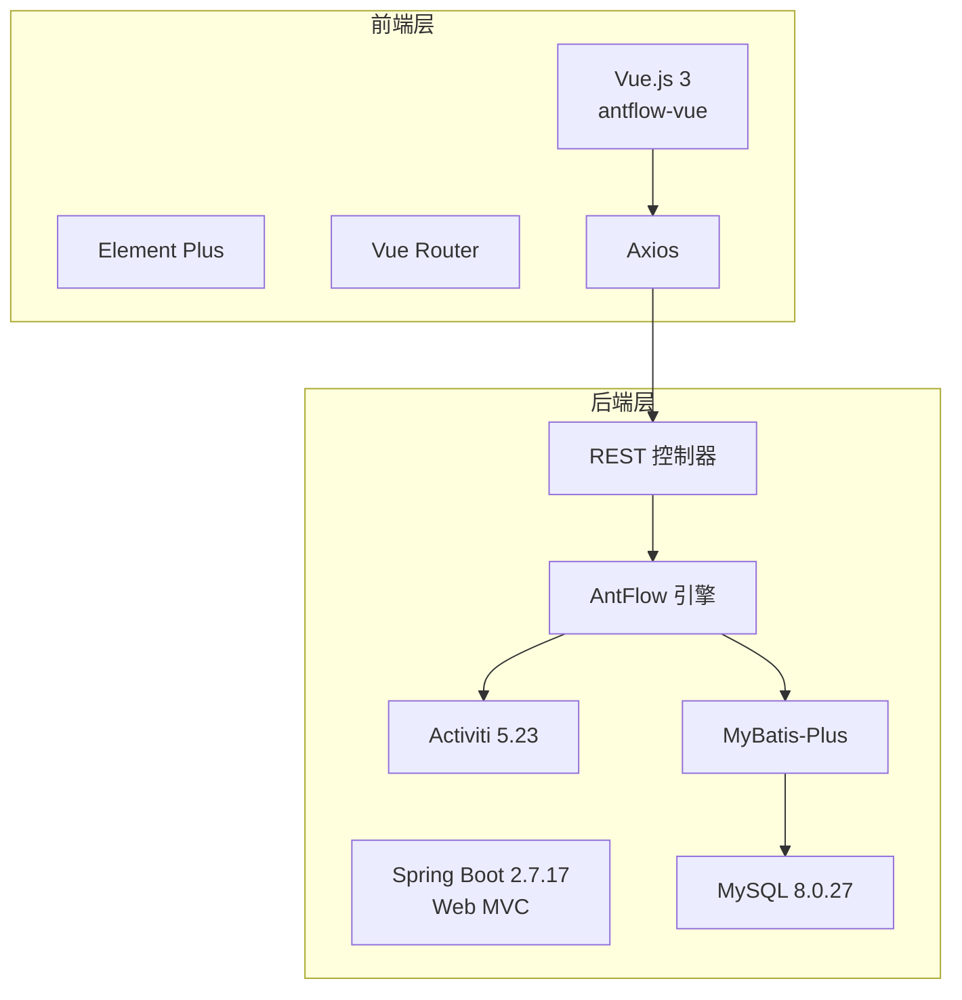
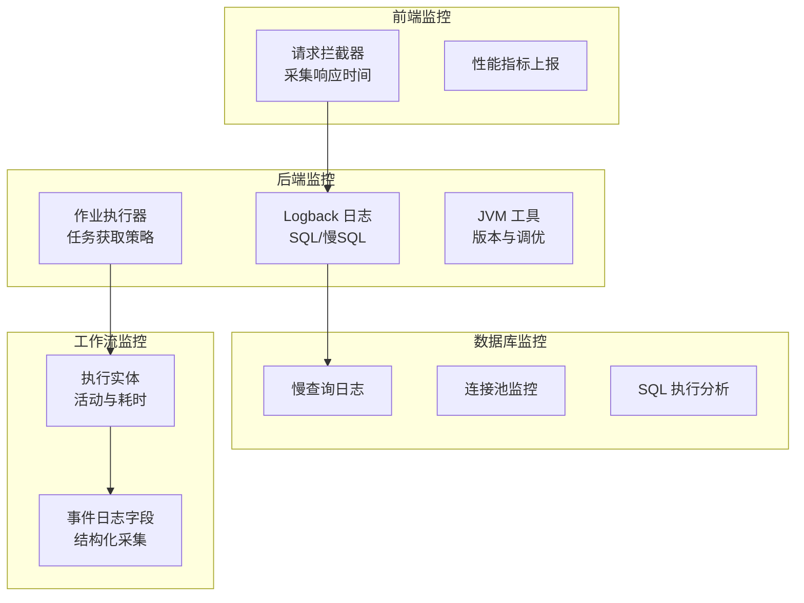
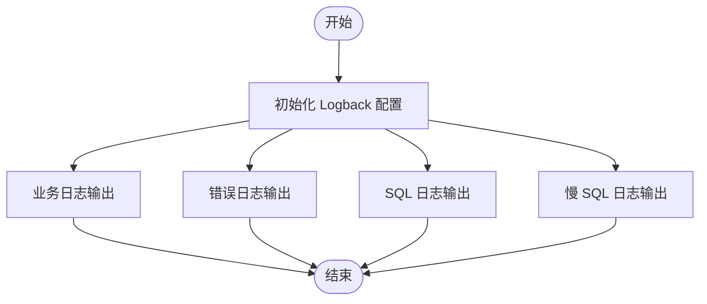
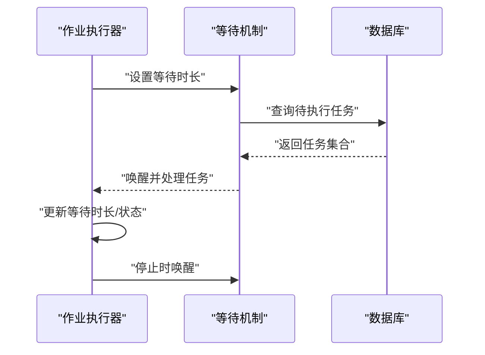
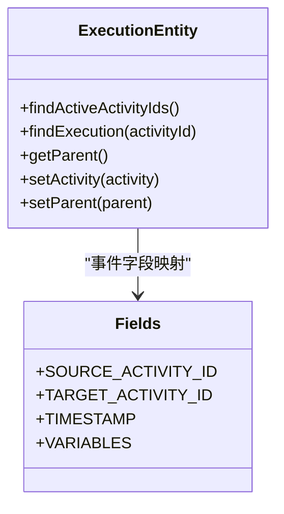
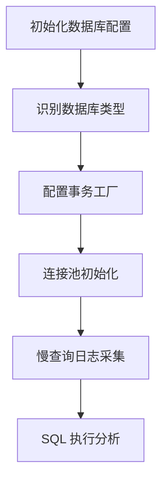
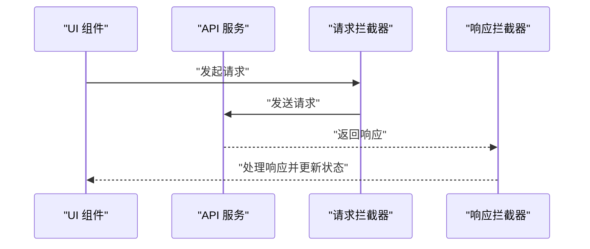
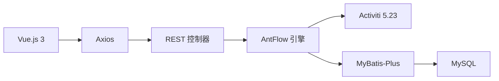

# 监控与性能分析

<cite>
**本文引用的文件**   
- [logback-spring.xml](file://antflow-web/src/main/resources/logback-spring.xml)
- [AntFlow_系统架构.md](file://doc/系统介绍篇/2.AntFlow_系统架构.md)
- [开发者指南.md](file://doc/系统介绍篇/20.开发者指南.md)
- [ProcessEngineConfigurationImpl.java](file://antflow-base/src/main/java/org/activiti/engine/impl/cfg/ProcessEngineConfigurationImpl.java)
- [DbSqlSessionFactory.java](file://antflow-base/src/main/java/org/activiti/engine/impl/db/DbSqlSessionFactory.java)
- [AcquireJobsRunnableImpl.java](file://antflow-base/src/main/java/org/activiti/engine/impl/jobexecutor/AcquireJobsRunnableImpl.java)
- [AcquireAsyncJobsDueRunnable.java](file://antflow-base/src/main/java/org/activiti/engine/impl/asyncexecutor/AcquireAsyncJobsDueRunnable.java)
- [ExecutionEntity.java](file://antflow-base/src/main/java/org/activiti/engine/impl/persistence/entity/ExecutionEntity.java)
- [JvmUtil.java](file://antflow-base/src/main/java/org/activiti/engine/impl/util/JvmUtil.java)
- [Fields.java](file://antflow-base/src/main/java/org/activiti/engine/impl/event/logger/handler/Fields.java)
- [前端手册.md](file://antflow-vue/public/docs/前端手册.md)
</cite>

## 目录
1. [简介](#简介)
2. [项目结构](#项目结构)
3. [核心组件](#核心组件)
4. [架构总览](#架构总览)
5. [详细组件分析](#详细组件分析)
6. [依赖关系分析](#依赖关系分析)
7. [性能考量](#性能考量)
8. [故障排查指南](#故障排查指南)
9. [结论](#结论)
10. [附录](#附录)

## 简介
本指南面向系统运维与开发团队，围绕 AntFlow 工作流平台构建“系统监控与性能分析”完整方案。内容覆盖：
- 应用性能监控体系搭建：APM 工具集成、性能指标采集、监控告警配置
- JVM 性能监控：堆内存分析、GC 日志分析、线程状态监控、类加载监控
- 数据库性能监控：慢查询监控、连接池状态监控、SQL 执行分析
- 工作流执行监控：流程实例执行时间统计、任务处理耗时分析、瓶颈节点识别
- 前端性能监控：页面加载时间、API 响应时间、用户体验指标
- 性能分析工具使用指南、性能基线建立方法、性能问题诊断流程

## 项目结构
AntFlow 采用多模块 Maven 架构，核心模块包括基础层、核心引擎、Web 接口层与启动器模块。系统前后端分离，前端基于 Vue 3 + Element Plus，后端基于 Spring Boot 2.7.17，持久化采用 MyBatis-Plus 与 MySQL。

图表来源
- [AntFlow_系统架构.md:11-122](file://doc/系统介绍篇/2.AntFlow_系统架构.md#L11-L122)

章节来源
- [AntFlow_系统架构.md:1-285](file://doc/系统介绍篇/2.AntFlow_系统架构.md#L1-L285)

## 核心组件
- 日志与慢 SQL 监控：通过 Logback 配置分别输出业务日志、SQL 日志与慢 SQL 日志，便于定位性能瓶颈与异常。
- 工作流引擎配置：通过 ProcessEngineConfigurationImpl 初始化数据库类型、连接池与事务工厂，支撑流程执行性能与稳定性。
- 作业执行器：AcquireJobsRunnableImpl 与 AcquireAsyncJobsDueRunnable 控制定时任务与异步任务的获取与等待策略，影响吞吐与延迟。
- 执行实体与活动追踪：ExecutionEntity 记录执行路径与活动状态，为流程耗时统计与瓶颈识别提供数据基础。
- JVM 工具：JvmUtil 提供 JDK 版本判断，辅助 GC 与内存调优策略制定。
- 事件日志字段：Fields 定义事件日志字段，用于流程事件的结构化采集与分析。

章节来源
- [logback-spring.xml:1-94](file://antflow-web/src/main/resources/logback-spring.xml#L1-L94)
- [ProcessEngineConfigurationImpl.java:762-872](file://antflow-base/src/main/java/org/activiti/engine/impl/cfg/ProcessEngineConfigurationImpl.java#L762-L872)
- [AcquireJobsRunnableImpl.java:95-137](file://antflow-base/src/main/java/org/activiti/engine/impl/jobexecutor/AcquireJobsRunnableImpl.java#L95-L137)
- [AcquireAsyncJobsDueRunnable.java:86-133](file://antflow-base/src/main/java/org/activiti/engine/impl/asyncexecutor/AcquireAsyncJobsDueRunnable.java#L86-L133)
- [ExecutionEntity.java:150-914](file://antflow-base/src/main/java/org/activiti/engine/impl/persistence/entity/ExecutionEntity.java#L150-L914)
- [JvmUtil.java:1-26](file://antflow-base/src/main/java/org/activiti/engine/impl/util/JvmUtil.java#L1-L26)
- [Fields.java:37-60](file://antflow-base/src/main/java/org/activiti/engine/impl/event/logger/handler/Fields.java#L37-L60)

## 架构总览
系统监控与性能分析贯穿前端、后端、数据库与工作流引擎四个层面。前端通过 Axios 统一拦截器采集 API 响应时间与错误；后端通过 Logback 输出 SQL 与慢 SQL 日志；数据库层通过慢查询日志与连接池监控；工作流引擎层通过作业执行器与执行实体追踪流程耗时。

图表来源
- [前端手册.md:303-379](file://antflow-vue/public/docs/前端手册.md#L303-L379)
- [logback-spring.xml:45-85](file://antflow-web/src/main/resources/logback-spring.xml#L45-L85)
- [AcquireJobsRunnableImpl.java:95-137](file://antflow-base/src/main/java/org/activiti/engine/impl/jobexecutor/AcquireJobsRunnableImpl.java#L95-L137)
- [ExecutionEntity.java:150-914](file://antflow-base/src/main/java/org/activiti/engine/impl/persistence/entity/ExecutionEntity.java#L150-L914)
- [Fields.java:37-60](file://antflow-base/src/main/java/org/activiti/engine/impl/event/logger/handler/Fields.java#L37-L60)

## 详细组件分析

### 日志与慢 SQL 监控
- 目标：统一输出业务日志、SQL 日志与慢 SQL 日志，支持按级别与时间滚动归档。
- 关键点：
  - 业务日志与错误日志分离输出，便于快速定位异常。
  - SQL 日志与慢 SQL 日志分别落盘，支持错误级别过滤与历史保留策略。
  - 结合业务埋点日志路径，形成端到端的调用链路观测。

图表来源
- [logback-spring.xml:28-85](file://antflow-web/src/main/resources/logback-spring.xml#L28-L85)

章节来源
- [logback-spring.xml:1-94](file://antflow-web/src/main/resources/logback-spring.xml#L1-L94)

### 工作流作业执行器监控
- 目标：通过作业执行器的等待与唤醒机制，控制任务获取频率与延迟，平衡吞吐与实时性。
- 关键点：
  - AcquireJobsRunnableImpl 与 AcquireAsyncJobsDueRunnable 分别负责同步与异步任务的获取。
  - 通过 millisToWait 控制等待时长，isWaiting 标识等待状态，stop() 支持优雅停止。
  - 与流程引擎配置联动，确保任务调度策略与数据库负载相匹配。

图表来源
- [AcquireJobsRunnableImpl.java:95-137](file://antflow-base/src/main/java/org/activiti/engine/impl/jobexecutor/AcquireJobsRunnableImpl.java#L95-L137)
- [AcquireAsyncJobsDueRunnable.java:86-133](file://antflow-base/src/main/java/org/activiti/engine/impl/asyncexecutor/AcquireAsyncJobsDueRunnable.java#L86-L133)

章节来源
- [AcquireJobsRunnableImpl.java:95-137](file://antflow-base/src/main/java/org/activiti/engine/impl/jobexecutor/AcquireJobsRunnableImpl.java#L95-L137)
- [AcquireAsyncJobsDueRunnable.java:86-133](file://antflow-base/src/main/java/org/activiti/engine/impl/asyncexecutor/AcquireAsyncJobsDueRunnable.java#L86-L133)

### 执行实体与流程耗时统计
- 目标：通过 ExecutionEntity 记录执行路径与活动状态，实现流程实例与任务的耗时统计与瓶颈识别。
- 关键点：
  - 收集活跃活动 ID、父子执行关系、任务列表等，支撑路径追踪。
  - 与事件日志字段配合，记录变量、行为类、时间戳等上下文信息，便于回溯分析。

图表来源
- [ExecutionEntity.java:726-741](file://antflow-base/src/main/java/org/activiti/engine/impl/persistence/entity/ExecutionEntity.java#L726-L741)
- [ExecutionEntity.java:866-914](file://antflow-base/src/main/java/org/activiti/engine/impl/persistence/entity/ExecutionEntity.java#L866-L914)
- [Fields.java:37-60](file://antflow-base/src/main/java/org/activiti/engine/impl/event/logger/handler/Fields.java#L37-L60)

章节来源
- [ExecutionEntity.java:150-914](file://antflow-base/src/main/java/org/activiti/engine/impl/persistence/entity/ExecutionEntity.java#L150-L914)
- [Fields.java:37-60](file://antflow-base/src/main/java/org/activiti/engine/impl/event/logger/handler/Fields.java#L37-L60)

### 数据库性能监控
- 目标：通过慢查询日志与连接池监控，结合 SQL 执行分析，定位数据库瓶颈。
- 关键点：
  - ProcessEngineConfigurationImpl 初始化数据库类型与事务工厂，确保连接池与事务一致性。
  - DbSqlSessionFactory 针对不同数据库类型提供特定 SQL 语句映射，减少跨数据库兼容性问题。
  - 结合慢 SQL 日志与连接池指标，评估查询复杂度与并发压力。

图表来源
- [ProcessEngineConfigurationImpl.java:762-872](file://antflow-base/src/main/java/org/activiti/engine/impl/cfg/ProcessEngineConfigurationImpl.java#L762-L872)
- [DbSqlSessionFactory.java:55-163](file://antflow-base/src/main/java/org/activiti/engine/impl/db/DbSqlSessionFactory.java#L55-L163)

章节来源
- [ProcessEngineConfigurationImpl.java:762-872](file://antflow-base/src/main/java/org/activiti/engine/impl/cfg/ProcessEngineConfigurationImpl.java#L762-L872)
- [DbSqlSessionFactory.java:55-163](file://antflow-base/src/main/java/org/activiti/engine/impl/db/DbSqlSessionFactory.java#L55-L163)

### 前端性能监控
- 目标：通过统一请求拦截器采集页面加载与 API 响应时间，结合用户体验指标进行监控。
- 关键点：
  - 前端手册描述了请求流程与拦截器用法，便于在 Axios 层统一采集性能数据。
  - 页面加载时间可通过浏览器性能 API 与网络面板结合分析。
  - 用户体验指标可结合页面交互与错误上报，形成闭环监控。

图表来源
- [前端手册.md:303-379](file://antflow-vue/public/docs/前端手册.md#L303-L379)

章节来源
- [前端手册.md:303-379](file://antflow-vue/public/docs/前端手册.md#L303-L379)

## 依赖关系分析
- 前端依赖：Vue 3、Element Plus、Axios、Pinia、Vue Router
- 后端依赖：Spring Boot 2.7.17、Activiti 5.23、MyBatis-Plus、MySQL
- 监控依赖：Logback（日志）、作业执行器（任务调度）、事件日志（结构化数据）

图表来源
- [AntFlow_系统架构.md:63-122](file://doc/系统介绍篇/2.AntFlow_系统架构.md#L63-L122)

章节来源
- [AntFlow_系统架构.md:1-285](file://doc/系统介绍篇/2.AntFlow_系统架构.md#L1-L285)

## 性能考量
- 日志与慢 SQL：合理设置日志级别与滚动策略，避免磁盘 IO 压力；慢 SQL 日志用于识别热点查询与索引缺失。
- 作业执行器：根据业务峰值调整等待时长与并发度，避免过载或饥饿；结合数据库连接池上限，控制整体并发。
- 数据库：针对不同数据库类型优化 SQL 映射与分页策略；定期审查慢查询与锁等待。
- 前端：通过请求拦截器统一采集性能指标；结合浏览器性能面板与网络面板，定位首屏与交互延迟。
- 工作流：利用执行实体与事件日志，统计流程实例耗时与节点耗时，识别瓶颈环节。

## 故障排查指南
- 日志定位：优先查看错误日志与慢 SQL 日志，结合 ruid 上下文串定位请求链路。
- 任务积压：检查作业执行器等待时长与唤醒机制，确认数据库连接与事务配置。
- 数据库异常：核对数据库类型识别与事务工厂配置，排查连接池耗尽与锁冲突。
- 前端异常：通过请求拦截器与响应拦截器捕获错误，结合浏览器网络面板分析失败原因。

章节来源
- [logback-spring.xml:28-85](file://antflow-web/src/main/resources/logback-spring.xml#L28-L85)
- [AcquireJobsRunnableImpl.java:95-137](file://antflow-base/src/main/java/org/activiti/engine/impl/jobexecutor/AcquireJobsRunnableImpl.java#L95-L137)
- [ProcessEngineConfigurationImpl.java:762-872](file://antflow-base/src/main/java/org/activiti/engine/impl/cfg/ProcessEngineConfigurationImpl.java#L762-L872)
- [前端手册.md:303-379](file://antflow-vue/public/docs/前端手册.md#L303-L379)

## 结论
通过日志与慢 SQL 监控、作业执行器与执行实体追踪、数据库与前端性能采集，以及工作流事件日志的结构化输出，AntFlow 形成了覆盖全链路的监控与性能分析体系。建议在生产环境中结合 APM 工具与告警策略，持续建立性能基线并完善诊断流程，以保障系统稳定与高性能运行。

## 附录
- 性能基线建立：以日志与慢 SQL 为基础，结合作业执行器等待时长与数据库连接池指标，设定阈值与基线。
- 诊断流程：从日志与慢 SQL 入手，结合前端性能指标与工作流耗时统计，逐步缩小问题范围并定位根因。