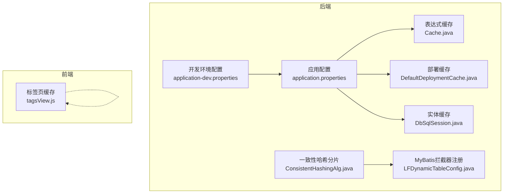
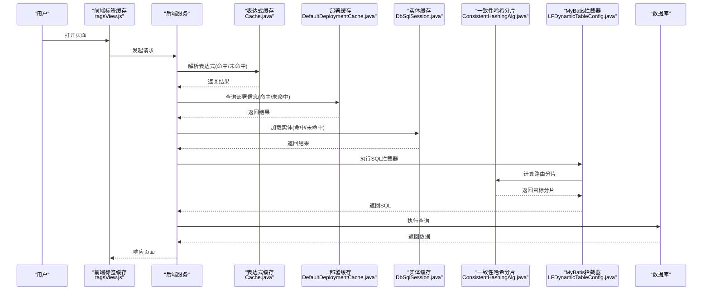
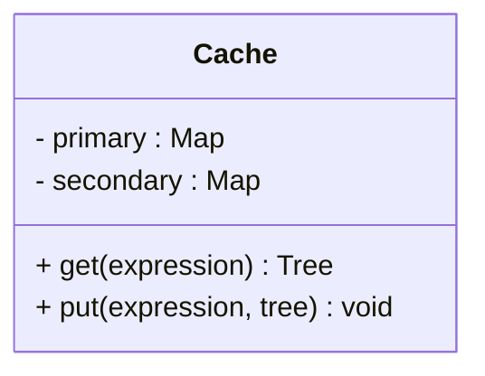
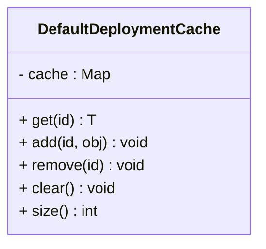
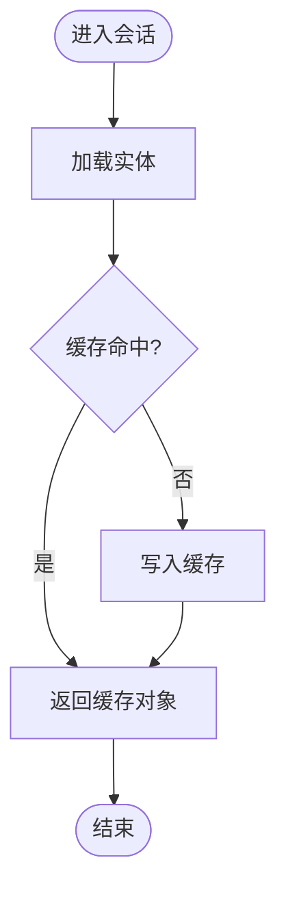
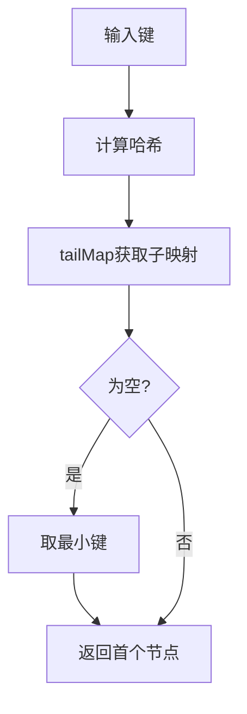
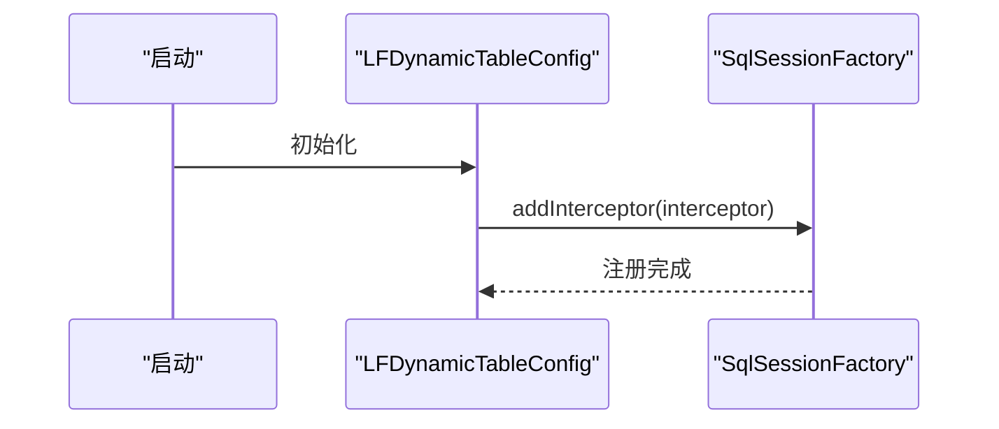
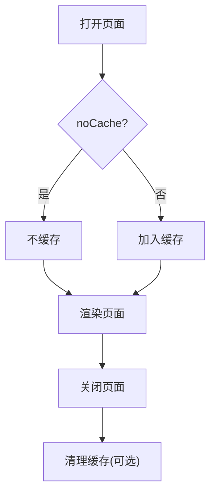
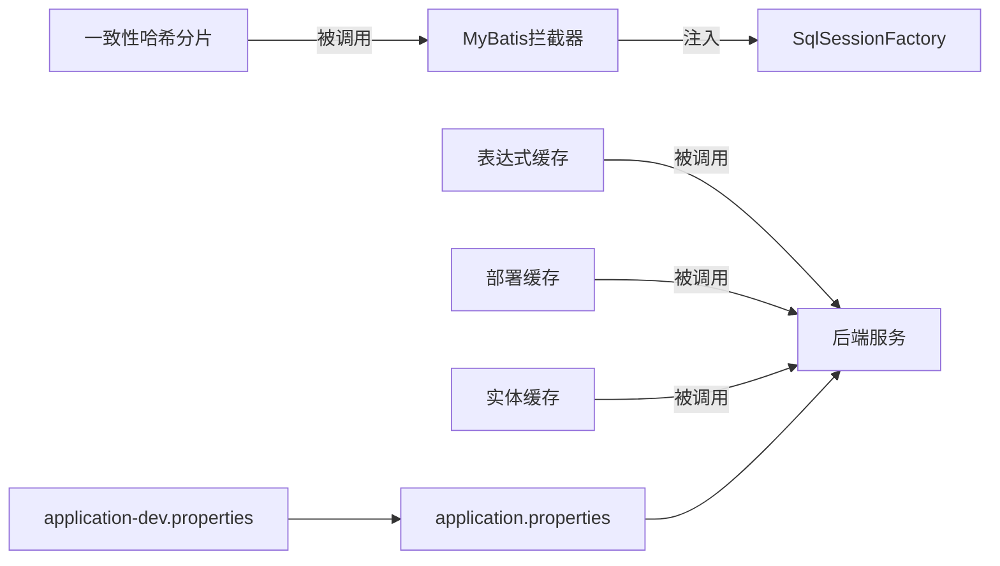

# 缓存策略优化

<cite>
**本文引用的文件**
- [application.properties](file://antflow-web/src/main/resources/application.properties)
- [application-dev.properties](file://antflow-web/src/main/resources/application-dev.properties)
- [Cache.java](file://antflow-base/src/main/java/org/activiti/engine/impl/juel/Cache.java)
- [DefaultDeploymentCache.java](file://antflow-base/src/main/java/org/activiti/engine/impl/persistence/deploy/DefaultDeploymentCache.java)
- [DbSqlSession.java](file://antflow-base/src/main/java/org/activiti/engine/impl/db/DbSqlSession.java)
- [ConsistentHashingAlg.java](file://antflow-engine/src/main/java/org/openoa/engine/utils/ConsistentHashingAlg.java)
- [LFDynamicTableConfig.java](file://antflow-engine/src/main/java/org/openoa/engine/conf/mybatis/LFDynamicTableConfig.java)
- [tagsView.js](file://antflow-vue/src/store/modules/tagsView.js)
</cite>

## 目录
1. [简介](#简介)
2. [项目结构](#项目结构)
3. [核心组件](#核心组件)
4. [架构总览](#架构总览)
5. [详细组件分析](#详细组件分析)
6. [依赖关系分析](#依赖关系分析)
7. [性能考量](#性能考量)
8. [故障排查指南](#故障排查指南)
9. [结论](#结论)
10. [附录](#附录)

## 简介
本指南聚焦于分布式缓存架构设计与缓存策略优化，结合仓库中的现有缓存实现与配置，系统阐述以下主题：
- 分布式缓存架构设计：Redis集群配置、缓存分片策略、数据一致性保证
- 缓存命中率优化：热点数据识别、预加载策略、淘汰算法选择
- 缓存安全防护：缓存穿透、击穿、雪崩的防护机制
- 缓存数据结构优化：对象序列化、压缩算法、TTL策略
- 异步缓存更新：失效策略、后台刷新、缓存预热
- 性能监控与排障：指标采集、命中率分析工具、常见问题定位

说明：当前仓库未直接包含Redis客户端或Spring Cache注解配置，但提供了内存级LRU缓存实现、一致性哈希分片工具以及前端页面标签缓存策略，可作为构建分布式缓存体系的参考与扩展基础。

## 项目结构
围绕缓存策略优化，本仓库与之相关的模块与文件如下：
- 后端缓存实现与配置
  - 内存LRU缓存：Activiti引擎内部表达式解析缓存、部署缓存、实体缓存
  - 数据库访问缓存：MyBatis层缓存与拦截器
  - 一致性哈希分片：用于表/数据分片的路由策略
- 前端页面缓存
  - 标签页缓存策略：避免重复渲染与请求

**图表来源**
- [application.properties:1-36](file://antflow-web/src/main/resources/application.properties#L1-L36)
- [application-dev.properties:1-44](file://antflow-web/src/main/resources/application-dev.properties#L1-L44)
- [Cache.java:1-86](file://antflow-base/src/main/java/org/activiti/engine/impl/juel/Cache.java#L1-L86)
- [DefaultDeploymentCache.java:1-83](file://antflow-base/src/main/java/org/activiti/engine/impl/persistence/deploy/DefaultDeploymentCache.java#L1-L83)
- [DbSqlSession.java:492-560](file://antflow-base/src/main/java/org/activiti/engine/impl/db/DbSqlSession.java#L492-L560)
- [ConsistentHashingAlg.java:1-70](file://antflow-engine/src/main/java/org/openoa/engine/utils/ConsistentHashingAlg.java#L1-L70)
- [LFDynamicTableConfig.java:1-20](file://antflow-engine/src/main/java/org/openoa/engine/conf/mybatis/LFDynamicTableConfig.java#L1-L20)
- [tagsView.js:1-139](file://antflow-vue/src/store/modules/tagsView.js#L1-L139)

**章节来源**
- [application.properties:1-36](file://antflow-web/src/main/resources/application.properties#L1-L36)
- [application-dev.properties:1-44](file://antflow-web/src/main/resources/application-dev.properties#L1-L44)

## 核心组件
- 表达式解析缓存（LRU）
  - 作用：对表达式树进行LRU缓存，限制最大容量，按访问顺序淘汰最久未使用的条目
  - 关键点：同步LinkedHashMap实现LRU；支持二级弱引用缓存
- 部署定义缓存（LRU）
  - 作用：对流程部署对象设置硬性上限，超过阈值按LRU淘汰
  - 关键点：访问序维护；日志记录淘汰事件
- 实体缓存（会话级）
  - 作用：在一次数据库会话内缓存持久化对象，避免重复查询
  - 关键点：按类与ID维度缓存；提供批量查找与移除
- 一致性哈希分片
  - 作用：为表/数据分片提供稳定的路由策略，降低迁移成本
  - 关键点：虚拟节点；尾映射；哈希函数
- MyBatis拦截器注册
  - 作用：将SQL拦截器注入到SqlSessionFactory，实现动态表路由
- 前端标签页缓存
  - 作用：通过noCache标记控制页面缓存，减少不必要的重复渲染

**章节来源**
- [Cache.java:26-86](file://antflow-base/src/main/java/org/activiti/engine/impl/juel/Cache.java#L26-L86)
- [DefaultDeploymentCache.java:24-83](file://antflow-base/src/main/java/org/activiti/engine/impl/persistence/deploy/DefaultDeploymentCache.java#L24-L83)
- [DbSqlSession.java:500-560](file://antflow-base/src/main/java/org/activiti/engine/impl/db/DbSqlSession.java#L500-L560)
- [ConsistentHashingAlg.java:1-70](file://antflow-engine/src/main/java/org/openoa/engine/utils/ConsistentHashingAlg.java#L1-L70)
- [LFDynamicTableConfig.java:1-20](file://antflow-engine/src/main/java/org/openoa/engine/conf/mybatis/LFDynamicTableConfig.java#L1-L20)
- [tagsView.js:1-139](file://antflow-vue/src/store/modules/tagsView.js#L1-L139)

## 架构总览
下图展示从请求到缓存与数据库的交互路径，以及分片与拦截器的作用位置：

**图表来源**
- [Cache.java:70-84](file://antflow-base/src/main/java/org/activiti/engine/impl/juel/Cache.java#L70-L84)
- [DefaultDeploymentCache.java:61-75](file://antflow-base/src/main/java/org/activiti/engine/impl/persistence/deploy/DefaultDeploymentCache.java#L61-L75)
- [DbSqlSession.java:514-521](file://antflow-base/src/main/java/org/activiti/engine/impl/db/DbSqlSession.java#L514-L521)
- [ConsistentHashingAlg.java:62-70](file://antflow-engine/src/main/java/org/openoa/engine/utils/ConsistentHashingAlg.java#L62-L70)
- [LFDynamicTableConfig.java:16-19](file://antflow-engine/src/main/java/org/openoa/engine/conf/mybatis/LFDynamicTableConfig.java#L16-L19)

## 详细组件分析

### 组件A：表达式解析缓存（LRU）
- 设计要点
  - 使用LinkedHashMap维护访问顺序，实现LRU淘汰
  - 支持二级弱引用缓存，提升冷门条目的回收效率
  - 同步包装保证并发安全
- 性能特征
  - 时间复杂度：get/put近似O(1)
  - 空间复杂度：O(n)，n为缓存容量
- 优化建议
  - 为热点表达式设置更大容量或短TTL
  - 对高频表达式采用“只读”缓存，避免写竞争
  - 结合监控统计命中率，动态调整容量

**图表来源**
- [Cache.java:33-85](file://antflow-base/src/main/java/org/activiti/engine/impl/juel/Cache.java#L33-L85)

**章节来源**
- [Cache.java:26-86](file://antflow-base/src/main/java/org/activiti/engine/impl/juel/Cache.java#L26-L86)

### 组件B：部署定义缓存（LRU）
- 设计要点
  - 可配置上限；超过阈值按LRU淘汰
  - 日志记录淘汰事件，便于追踪
- 适用场景
  - 流程部署元数据、模型定义等静态/半静态数据
- 优化建议
  - 将热点流程ID加入白名单，延长TTL
  - 对频繁变更的部署设置更短TTL，降低陈旧风险

**图表来源**
- [DefaultDeploymentCache.java:28-82](file://antflow-base/src/main/java/org/activiti/engine/impl/persistence/deploy/DefaultDeploymentCache.java#L28-L82)

**章节来源**
- [DefaultDeploymentCache.java:24-83](file://antflow-base/src/main/java/org/activiti/engine/impl/persistence/deploy/DefaultDeploymentCache.java#L24-L83)

### 组件C：实体缓存（会话级）
- 设计要点
  - 以类+ID为键，缓存持久化对象
  - 提供批量查找与移除接口
- 适用场景
  - 同一事务/会话内的重复读取
- 优化建议
  - 控制会话生命周期，避免长事务导致缓存膨胀
  - 对大对象启用压缩或延迟加载

**图表来源**
- [DbSqlSession.java:500-521](file://antflow-base/src/main/java/org/activiti/engine/impl/db/DbSqlSession.java#L500-L521)

**章节来源**
- [DbSqlSession.java:500-560](file://antflow-base/src/main/java/org/activiti/engine/impl/db/DbSqlSession.java#L500-L560)

### 组件D：一致性哈希分片
- 设计要点
  - 虚拟节点均匀分布
  - tailMap实现顺时针路由
- 适用场景
  - 动态扩容缩容下的稳定路由
- 优化建议
  - 调整虚拟节点数量平衡均匀性与内存占用
  - 对热点键增加权重或单独路由

**图表来源**
- [ConsistentHashingAlg.java:62-70](file://antflow-engine/src/main/java/org/openoa/engine/utils/ConsistentHashingAlg.java#L62-L70)

**章节来源**
- [ConsistentHashingAlg.java:1-70](file://antflow-engine/src/main/java/org/openoa/engine/utils/ConsistentHashingAlg.java#L1-L70)

### 组件E：MyBatis拦截器注册
- 设计要点
  - 在启动阶段向SqlSessionFactory注入拦截器
- 适用场景
  - 动态表路由、SQL改写
- 优化建议
  - 仅在需要时启用拦截器，避免影响全链路性能

**图表来源**
- [LFDynamicTableConfig.java:16-19](file://antflow-engine/src/main/java/org/openoa/engine/conf/mybatis/LFDynamicTableConfig.java#L16-L19)

**章节来源**
- [LFDynamicTableConfig.java:1-20](file://antflow-engine/src/main/java/org/openoa/engine/conf/mybatis/LFDynamicTableConfig.java#L1-L20)

### 组件F：前端标签页缓存
- 设计要点
  - 通过noCache标记控制是否缓存页面
  - 维护已访问与缓存的标签集合
- 优化建议
  - 对高频页面默认noCache=false，减少重复渲染
  - 对复杂页面设置合理的缓存时间

**图表来源**
- [tagsView.js:30-35](file://antflow-vue/src/store/modules/tagsView.js#L30-L35)

**章节来源**
- [tagsView.js:1-139](file://antflow-vue/src/store/modules/tagsView.js#L1-L139)

## 依赖关系分析
- 组件耦合
  - 表达式缓存与部署缓存均基于LRU思想，属于引擎内部缓存层
  - 实体缓存与MyBatis拦截器配合，形成数据访问层缓存
  - 一致性哈希分片为数据层分片提供路由能力
- 外部依赖
  - 应用配置文件提供数据库连接池参数，间接影响缓存可用内存与IO吞吐
- 循环依赖
  - 当前实现未见循环依赖迹象

**图表来源**
- [Cache.java:70-84](file://antflow-base/src/main/java/org/activiti/engine/impl/juel/Cache.java#L70-L84)
- [DefaultDeploymentCache.java:61-75](file://antflow-base/src/main/java/org/activiti/engine/impl/persistence/deploy/DefaultDeploymentCache.java#L61-L75)
- [DbSqlSession.java:514-521](file://antflow-base/src/main/java/org/activiti/engine/impl/db/DbSqlSession.java#L514-L521)
- [ConsistentHashingAlg.java:62-70](file://antflow-engine/src/main/java/org/openoa/engine/utils/ConsistentHashingAlg.java#L62-L70)
- [LFDynamicTableConfig.java:16-19](file://antflow-engine/src/main/java/org/openoa/engine/conf/mybatis/LFDynamicTableConfig.java#L16-L19)
- [application.properties:1-36](file://antflow-web/src/main/resources/application.properties#L1-L36)
- [application-dev.properties:1-44](file://antflow-web/src/main/resources/application-dev.properties#L1-L44)

**章节来源**
- [application.properties:1-36](file://antflow-web/src/main/resources/application.properties#L1-L36)
- [application-dev.properties:1-44](file://antflow-web/src/main/resources/application-dev.properties#L1-L44)

## 性能考量
- 缓存命中率优化
  - 热点识别：通过埋点统计访问频次，识别Top-K键
  - 预加载策略：在低峰期提前加载热点键，设置较短TTL
  - 淘汰算法：优先采用LRU；对时效性强的数据采用LFU
- 数据结构与序列化
  - 优先使用紧凑的二进制序列化（如Kryo、Protostuff），减少网络传输
  - 对大对象启用压缩（如LZ4、Zstd），权衡CPU与带宽
- TTL策略
  - 固定TTL：适用于静态数据
  - 随机抖动：在固定TTL基础上加随机偏移，分散过期高峰
  - 懒更新：读取时检查TTL，必要时异步刷新
- 分布式一致性
  - 读写一致性：先写数据库，再删缓存，避免脏读
  - 广播失效：使用消息队列通知多节点失效缓存键
- 异步更新
  - 后台刷新：热点键定期后台刷新，维持高命中率
  - 缓存预热：系统启动或扩容后，按历史访问排序预热Top-K键

## 故障排查指南
- 缓存穿透
  - 现象：大量不存在的键频繁查询数据库
  - 排查：检查是否存在恶意请求或键拼写错误
  - 处置：对空结果也缓存短TTL；使用布隆过滤器拦截
- 缓存击穿
  - 现象：热点键过期瞬间大量并发请求打到数据库
  - 排查：确认热点键TTL与刷新策略
  - 处置：互斥锁/分布式锁保护；热点键永不过期，后台异步刷新
- 缓存雪崩
  - 现象：大面积缓存同时过期，数据库瞬时压力激增
  - 排查：检查TTL分布是否集中
  - 处置：TTL加随机抖动；多级缓存（本地+分布式）；限流降载
- 命中率异常
  - 排查：核对缓存容量、淘汰策略、TTL设置
  - 处置：调整容量与算法；对热点键单独优化
- 分片路由异常
  - 排查：确认一致性哈希环状态与虚拟节点数量
  - 处置：重建路由表；临时绕过分片验证问题

## 结论
本指南基于仓库现有缓存实现与配置，总结了LRU缓存、分片路由与前端页面缓存的关键设计点，并提出了面向生产的缓存策略优化建议。若需引入Redis等分布式缓存，可在此基础上扩展：以LRU/LFU算法为内核，以一致性哈希为分片基石，以TTL抖动与异步刷新保障稳定性，并辅以完善的监控与告警体系。

## 附录
- 配置参考
  - 数据库连接池参数：最大活跃数、空闲保持、验证策略等
  - Jackson日期格式与时区：统一序列化输出，避免解析差异
- 监控指标建议
  - 缓存命中率、请求延迟、淘汰速率、内存使用率
  - 热点键Top-K、分片路由命中率、异常请求占比
- 工具与实践
  - 使用Prometheus/Grafana采集指标
  - 通过埋点统计访问频次，驱动预加载与TTL优化
  - 定期演练缓存雪崩恢复流程