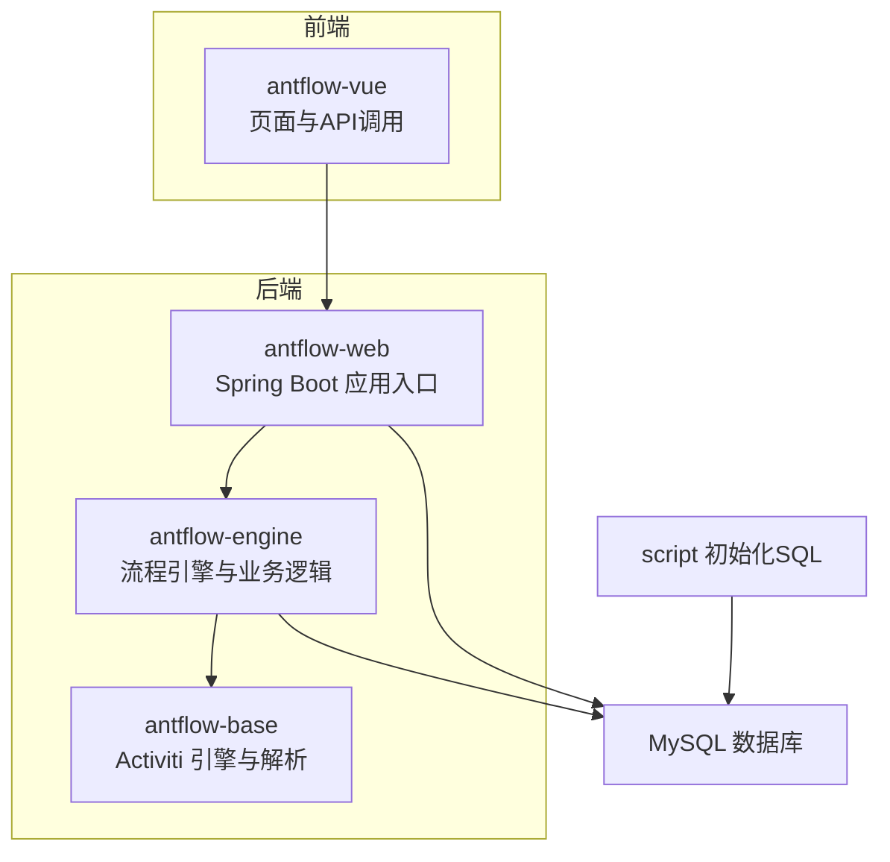
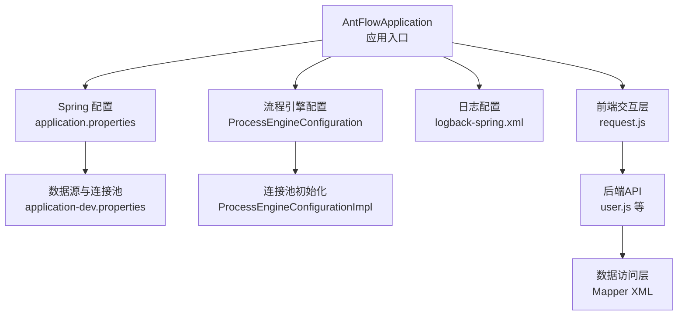
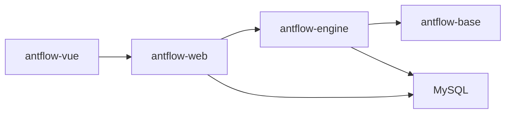
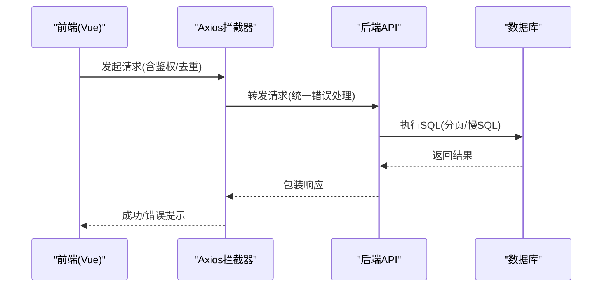
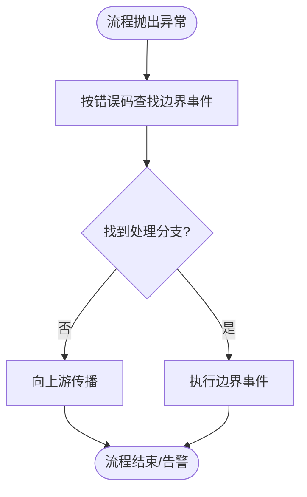

# 故障排查与运维

<cite>
**本文引用的文件**
- [AntFlowApplication.java](file://antflow-web/src/main/java/org/openoa/AntFlowApplication.java)
- [logback-spring.xml](file://antflow-web/src/main/resources/logback-spring.xml)
- [application.properties](file://antflow-web/src/main/resources/application.properties)
- [application-dev.properties](file://antflow-web/src/main/resources/application-dev.properties)
- [MyBatisPlusConfig.java](file://antflow-engine/src/main/java/org/openoa/engine/conf/mybatis/MyBatisPlusConfig.java)
- [BpmBusinessProcessMapper.xml](file://antflow-engine/src/main/resources/mapper/BpmBusinessProcessMapper.xml)
- [request.js](file://antflow-vue/src/utils/request.js)
- [user.js](file://antflow-vue/src/api/system/user.js)
- [ErrorPropagation.java](file://antflow-base/src/main/java/org/activiti/engine/impl/bpmn/helper/ErrorPropagation.java)
- [ErrorEventDefinition.java](file://antflow-base/src/main/java/org/activiti/engine/impl/bpmn/parser/ErrorEventDefinition.java)
- [ProcessEngineConfiguration.java](file://antflow-base/src/main/java/org/activiti/engine/ProcessEngineConfiguration.java)
- [ProcessEngineConfigurationImpl.java](file://antflow-base/src/main/java/org/activiti/engine/impl/cfg/ProcessEngineConfigurationImpl.java)
- [act_init_db.sql](file://script/act_init_db.sql)
- [bpm_init_db.sql](file://script/bpm_init_db.sql)
- [bpm_init_db_data.sql](file://script/bpm_init_db_data.sql)
</cite>

## 目录
1. [简介](#简介)
2. [项目结构](#项目结构)
3. [核心组件](#核心组件)
4. [架构总览](#架构总览)
5. [详细组件分析](#详细组件分析)
6. [依赖关系分析](#依赖关系分析)
7. [性能考量](#性能考量)
8. [故障排查指南](#故障排查指南)
9. [结论](#结论)
10. [附录](#附录)

## 简介
本指南面向运维与开发团队，围绕启动失败、数据库连接、工作流执行异常、前端页面问题、系统性能瓶颈等常见问题，提供可操作的诊断步骤与解决策略。同时覆盖日志配置优化、监控指标建议、健康检查实现、运维工具使用、备份恢复流程以及紧急预案与支持渠道，帮助快速定位与恢复生产环境。

## 项目结构
项目采用多模块分层设计：前端Vue工程负责界面与交互；后端Web工程作为入口与配置中心；引擎与基础库模块承载流程引擎与持久化能力；脚本目录提供初始化SQL。

图示来源
- [AntFlowApplication.java:1-17](file://antflow-web/src/main/java/org/openoa/AntFlowApplication.java#L1-L17)
- [application.properties:1-36](file://antflow-web/src/main/resources/application.properties#L1-L36)
- [application-dev.properties:1-44](file://antflow-web/src/main/resources/application-dev.properties#L1-L44)

章节来源
- [AntFlowApplication.java:1-17](file://antflow-web/src/main/java/org/openoa/AntFlowApplication.java#L1-L17)
- [application.properties:1-36](file://antflow-web/src/main/resources/application.properties#L1-L36)
- [application-dev.properties:1-44](file://antflow-web/src/main/resources/application-dev.properties#L1-L44)

## 核心组件
- 启动入口与配置
  - 后端应用入口负责加载Spring上下文与事务管理，确保数据库与流程引擎初始化顺序正确。
  - 应用配置集中于properties文件，包含激活的profile、JPA/Jackson日期格式、SaaS模式开关、邮件通知等。
- 日志与监控
  - Logback配置按业务日志、SQL日志、慢SQL日志分离输出，支持滚动与压缩归档，便于问题回溯与容量管理。
- 数据访问层
  - MyBatis-Plus配置与拦截器启用分页与乐观锁，结合Druid/Hikari连接池参数保障连接稳定性。
- 前端交互
  - Axios封装统一拦截器，处理鉴权、重复提交、超时、401重登、500/601提示等，提升用户体验与可观测性。
- 流程引擎
  - Activiti引擎配置与连接池参数、错误传播机制，支撑流程异常捕获与边界事件处理。

章节来源
- [AntFlowApplication.java:1-17](file://antflow-web/src/main/java/org/openoa/AntFlowApplication.java#L1-L17)
- [logback-spring.xml:1-94](file://antflow-web/src/main/resources/logback-spring.xml#L1-L94)
- [application.properties:1-36](file://antflow-web/src/main/resources/application.properties#L1-L36)
- [application-dev.properties:1-44](file://antflow-web/src/main/resources/application-dev.properties#L1-L44)
- [MyBatisPlusConfig.java:1-141](file://antflow-engine/src/main/java/org/openoa/engine/conf/mybatis/MyBatisPlusConfig.java#L1-L141)
- [request.js:1-205](file://antflow-vue/src/utils/request.js#L1-L205)

## 架构总览
后端服务通过Spring Boot启动，加载流程引擎与数据访问层，前端通过Axios与后端交互。日志与配置分别在运行时与构建期生效，保证可观测性与可维护性。

图示来源
- [AntFlowApplication.java:1-17](file://antflow-web/src/main/java/org/openoa/AntFlowApplication.java#L1-L17)
- [application.properties:1-36](file://antflow-web/src/main/resources/application.properties#L1-L36)
- [application-dev.properties:1-44](file://antflow-web/src/main/resources/application-dev.properties#L1-L44)
- [ProcessEngineConfiguration.java:510-556](file://antflow-base/src/main/java/org/activiti/engine/ProcessEngineConfiguration.java#L510-L556)
- [ProcessEngineConfigurationImpl.java:733-763](file://antflow-base/src/main/java/org/activiti/engine/impl/cfg/ProcessEngineConfigurationImpl.java#L733-L763)
- [logback-spring.xml:1-94](file://antflow-web/src/main/resources/logback-spring.xml#L1-L94)
- [request.js:1-205](file://antflow-vue/src/utils/request.js#L1-L205)
- [user.js:1-137](file://antflow-vue/src/api/system/user.js#L1-L137)
- [BpmBusinessProcessMapper.xml:1-67](file://antflow-engine/src/main/resources/mapper/BpmBusinessProcessMapper.xml#L1-L67)

## 详细组件分析

### 启动与健康检查
- 启动顺序
  - 应用入口加载Spring上下文，随后初始化流程引擎与数据源；若数据库或引擎配置不一致，可能引发启动失败。
- 健康检查建议
  - 对外暴露健康端点，检查数据库连通性、流程引擎可用性、关键线程池状态。
  - 结合日志级别与告警阈值，对ERROR与WARN进行实时告警。

章节来源
- [AntFlowApplication.java:1-17](file://antflow-web/src/main/java/org/openoa/AntFlowApplication.java#L1-L17)
- [application.properties:1-36](file://antflow-web/src/main/resources/application.properties#L1-L36)
- [application-dev.properties:1-44](file://antflow-web/src/main/resources/application-dev.properties#L1-L44)

### 日志与审计
- 日志分类
  - 控制台输出、业务日志、SQL日志、慢SQL日志、中间件日志，均配置滚动与保留策略。
- 优化要点
  - 生产环境建议降低根日志级别，仅保留必要级别；对敏感字段脱敏；结合分布式追踪ID定位请求链路。
  - SQL与慢SQL日志按天切割并压缩，避免磁盘膨胀。

章节来源
- [logback-spring.xml:1-94](file://antflow-web/src/main/resources/logback-spring.xml#L1-L94)

### 数据库连接与连接池
- 连接池参数
  - Druid/Hikari的关键参数包括初始连接数、最大活跃、空闲回收、验证查询、移除废弃连接等，直接影响连接稳定性与性能。
- 排查要点
  - 观察连接池溢出、超时、废弃连接数量；核对驱动、URL、账号密码；确认数据库网络与防火墙策略。
- 参考配置
  - 开发环境示例展示了连接池与验证查询配置，生产需结合压测结果调整。

章节来源
- [application-dev.properties:1-44](file://antflow-web/src/main/resources/application-dev.properties#L1-L44)
- [ProcessEngineConfiguration.java:510-556](file://antflow-base/src/main/java/org/activiti/engine/ProcessEngineConfiguration.java#L510-L556)
- [ProcessEngineConfigurationImpl.java:733-763](file://antflow-base/src/main/java/org/activiti/engine/impl/cfg/ProcessEngineConfigurationImpl.java#L733-L763)

### 数据访问层与SQL
- MyBatis-Plus配置
  - 分页与乐观锁拦截器启用，驼峰映射开启，便于SQL与实体映射一致性。
- SQL审计
  - 通过日志与慢SQL日志定位异常SQL；结合Mapper XML核对字段映射与条件拼接。
- 关键Mapper
  - 业务流程相关Mapper提供查询、更新、删除等常用操作，便于定位流程数据异常。

章节来源
- [MyBatisPlusConfig.java:1-141](file://antflow-engine/src/main/java/org/openoa/engine/conf/mybatis/MyBatisPlusConfig.java#L1-L141)
- [BpmBusinessProcessMapper.xml:1-67](file://antflow-engine/src/main/resources/mapper/BpmBusinessProcessMapper.xml#L1-L67)

### 前端交互与页面问题
- 统一拦截器
  - 请求阶段注入令牌、参数序列化、重复提交防抖；响应阶段处理401重登、500/601提示、超时与网络异常。
- API调用
  - 用户相关API封装GET/POST/PUT/DELETE，便于定位接口异常与权限问题。
- 调试建议
  - 打开浏览器开发者工具，查看网络面板与控制台错误；结合后端日志与追踪ID定位问题。

章节来源
- [request.js:1-205](file://antflow-vue/src/utils/request.js#L1-L205)
- [user.js:1-137](file://antflow-vue/src/api/system/user.js#L1-L137)

### 工作流执行异常定位
- 错误传播机制
  - 当流程抛出错误时，引擎根据错误码与边界事件查找处理分支；若无匹配处理，则向上游传播直至终止。
- 定位步骤
  - 查看流程变量与事件日志；核对边界事件配置与错误码；结合慢SQL与业务日志定位具体环节。
- 参考实现
  - 错误传播与事件定义解析逻辑，支撑异常分支捕获与处理。

章节来源
- [ErrorPropagation.java:29-252](file://antflow-base/src/main/java/org/activiti/engine/impl/bpmn/helper/ErrorPropagation.java#L29-L252)
- [ErrorEventDefinition.java:37-65](file://antflow-base/src/main/java/org/activiti/engine/impl/bpmn/parser/ErrorEventDefinition.java#L37-L65)

## 依赖关系分析
后端模块间存在清晰的依赖层次：Web模块依赖引擎模块，引擎模块依赖基础库模块；前端通过API与后端交互；数据库作为共享依赖。

图示来源
- [AntFlowApplication.java:1-17](file://antflow-web/src/main/java/org/openoa/AntFlowApplication.java#L1-L17)
- [application.properties:1-36](file://antflow-web/src/main/resources/application.properties#L1-L36)
- [application-dev.properties:1-44](file://antflow-web/src/main/resources/application-dev.properties#L1-L44)

章节来源
- [AntFlowApplication.java:1-17](file://antflow-web/src/main/java/org/openoa/AntFlowApplication.java#L1-L17)
- [application.properties:1-36](file://antflow-web/src/main/resources/application.properties#L1-L36)
- [application-dev.properties:1-44](file://antflow-web/src/main/resources/application-dev.properties#L1-L44)

## 性能考量
- 连接池与SQL
  - 合理设置最大活跃、空闲回收、验证查询与超时，避免连接争用与堆积；对慢SQL进行日志与监控。
- 日志级别
  - 生产环境降低日志量，避免IO瓶颈；对关键路径增加采样或异步落盘。
- 前端交互
  - 控制重复提交窗口与请求体大小，避免阻塞UI与后端队列。
- 流程引擎
  - 合理配置引擎参数与事务隔离级别，避免长事务与死锁风险。

## 故障排查指南

### 启动失败排查
- 步骤
  - 检查激活的profile与配置文件是否正确加载；核对数据库连接参数与驱动；确认流程引擎配置项。
  - 查看启动日志中的异常堆栈，优先处理数据源初始化失败与引擎配置缺失。
- 关联文件
  - 应用入口、配置文件、引擎配置与实现。

章节来源
- [AntFlowApplication.java:1-17](file://antflow-web/src/main/java/org/openoa/AntFlowApplication.java#L1-L17)
- [application.properties:1-36](file://antflow-web/src/main/resources/application.properties#L1-L36)
- [application-dev.properties:1-44](file://antflow-web/src/main/resources/application-dev.properties#L1-L44)
- [ProcessEngineConfiguration.java:510-556](file://antflow-base/src/main/java/org/activiti/engine/ProcessEngineConfiguration.java#L510-L556)
- [ProcessEngineConfigurationImpl.java:733-763](file://antflow-base/src/main/java/org/activiti/engine/impl/cfg/ProcessEngineConfigurationImpl.java#L733-L763)

### 数据库连接问题
- 现象
  - 应用启动卡住、连接池耗尽、查询超时、事务异常。
- 排查
  - 检查连接URL、用户名、密码与驱动；核对连接池参数与验证查询；观察连接池指标与数据库负载。
  - 若为引擎连接，检查引擎配置中的JDBC参数与连接池初始化逻辑。
- 解决
  - 调整连接池上限与超时；修复网络与权限；必要时切换连接池类型（如从Druid切换至Hikari）。

章节来源
- [application-dev.properties:1-44](file://antflow-web/src/main/resources/application-dev.properties#L1-L44)
- [ProcessEngineConfiguration.java:510-556](file://antflow-base/src/main/java/org/activiti/engine/ProcessEngineConfiguration.java#L510-L556)
- [ProcessEngineConfigurationImpl.java:733-763](file://antflow-base/src/main/java/org/activiti/engine/impl/cfg/ProcessEngineConfigurationImpl.java#L733-L763)

### 工作流执行异常定位
- 现象
  - 节点报错、流程中断、边界事件未触发。
- 排查
  - 使用错误传播机制定位错误码与处理分支；核对边界事件配置；查看流程变量与事件日志。
- 解决
  - 补充边界事件或修正错误码；优化流程设计减少异常分支。

章节来源
- [ErrorPropagation.java:29-252](file://antflow-base/src/main/java/org/activiti/engine/impl/bpmn/helper/ErrorPropagation.java#L29-L252)
- [ErrorEventDefinition.java:37-65](file://antflow-base/src/main/java/org/activiti/engine/impl/bpmn/parser/ErrorEventDefinition.java#L37-L65)

### 前端页面问题调试
- 现象
  - 页面空白、接口报错、重复提交、登录失效。
- 排查
  - 打开浏览器控制台与网络面板；检查拦截器中的401重登、超时与网络异常提示；核对API路径与参数。
- 解决
  - 修复鉴权与参数；优化拦截器逻辑；增强错误提示与重试策略。

章节来源
- [request.js:1-205](file://antflow-vue/src/utils/request.js#L1-L205)
- [user.js:1-137](file://antflow-vue/src/api/system/user.js#L1-L137)

### 系统性能瓶颈识别
- 方法
  - 关注连接池指标、慢SQL日志、GC与线程池状态；结合日志与监控平台定位热点接口与数据库。
- 建议
  - 对高频接口与SQL进行缓存与分页优化；调整连接池与引擎参数；对长事务与批量操作进行拆分。

章节来源
- [logback-spring.xml:1-94](file://antflow-web/src/main/resources/logback-spring.xml#L1-L94)
- [application-dev.properties:1-44](file://antflow-web/src/main/resources/application-dev.properties#L1-L44)

### 日志配置优化
- 建议
  - 生产环境降低日志级别，启用滚动与压缩；对敏感字段脱敏；统一追踪ID；对关键路径增加采样。
- 参考
  - 业务日志、SQL日志、慢SQL日志的路径与保留策略。

章节来源
- [logback-spring.xml:1-94](file://antflow-web/src/main/resources/logback-spring.xml#L1-L94)

### 监控指标与健康检查
- 指标建议
  - 应用存活、连接池活跃/空闲/超时、慢SQL次数、接口响应时间与错误率、流程引擎作业队列长度。
- 健康检查
  - 提供健康端点，检查数据库连通、引擎可用、关键线程池状态与磁盘空间。

章节来源
- [application-dev.properties:1-44](file://antflow-web/src/main/resources/application-dev.properties#L1-L44)

### 运维工具与备份恢复
- 工具
  - 数据库客户端、日志采集与可视化、性能分析工具、容器编排与监控平台。
- 备份
  - 基于数据库物理/逻辑备份策略，定期导出关键业务表与流程元数据。
- 恢复
  - 制定RTO/RPO目标，演练恢复流程，验证数据一致性与应用可用性。
- 初始化脚本
  - 使用脚本初始化流程与业务基础数据，确保新环境快速可用。

章节来源
- [act_init_db.sql](file://script/act_init_db.sql)
- [bpm_init_db.sql](file://script/bpm_init_db.sql)
- [bpm_init_db_data.sql](file://script/bpm_init_db_data.sql)

### 紧急情况处理预案
- 预案内容
  - 快速降级策略、限流与熔断、应急回滚、热修复与灰度发布。
- 通道
  - 内部工单系统、IM群组、值班电话与远程协助工具。
- 支持
  - 社区论坛、官方文档与FAQ，必要时提交Issue并附带日志与复现步骤。

## 结论
通过规范的日志与监控、合理的连接池与引擎参数、完善的异常处理与健康检查，以及标准化的备份恢复与应急预案，可以有效降低故障影响面并加速恢复。建议在生产环境中持续优化配置与流程设计，结合自动化工具提升运维效率与稳定性。

## 附录

### 关键流程图：前端请求到后端处理

图示来源
- [request.js:1-205](file://antflow-vue/src/utils/request.js#L1-L205)
- [user.js:1-137](file://antflow-vue/src/api/system/user.js#L1-L137)

### 关键流程图：流程异常传播

图示来源
- [ErrorPropagation.java:29-252](file://antflow-base/src/main/java/org/activiti/engine/impl/bpmn/helper/ErrorPropagation.java#L29-L252)
- [ErrorEventDefinition.java:37-65](file://antflow-base/src/main/java/org/activiti/engine/impl/bpmn/parser/ErrorEventDefinition.java#L37-L65)