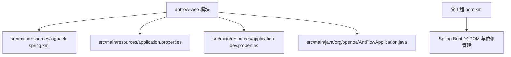
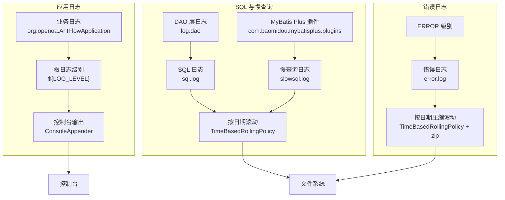
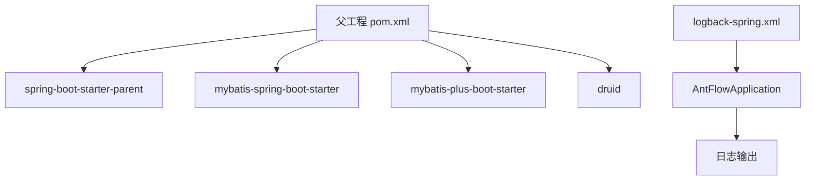
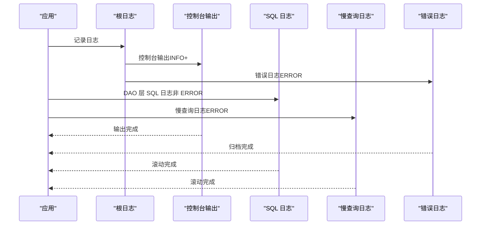

# Logback 日志配置

<cite>
**本文引用的文件**
- [logback-spring.xml](file://antflow-web/src/main/resources/logback-spring.xml)
- [pom.xml](file://pom.xml)
- [application.properties](file://antflow-web/src/main/resources/application.properties)
- [application-dev.properties](file://antflow-web/src/main/resources/application-dev.properties)
- [AntFlowApplication.java](file://antflow-web/src/main/java/org/openoa/AntFlowApplication.java)
</cite>

## 目录
1. [简介](#简介)
2. [项目结构](#项目结构)
3. [核心组件](#核心组件)
4. [架构总览](#架构总览)
5. [详细组件分析](#详细组件分析)
6. [依赖关系分析](#依赖关系分析)
7. [性能考虑](#性能考虑)
8. [故障排查指南](#故障排查指南)
9. [结论](#结论)
10. [附录](#附录)

## 简介
本文件面向 Logback 在本项目中的实际配置与使用，围绕 logback-spring.xml 展开，系统性解释以下内容：
- 配置文件结构与关键节点作用
- 日志级别设置、输出格式定制、文件滚动策略
- 不同日志类型的配置方法：业务日志、错误日志、SQL 日志、慢查询日志
- 日志路径配置、控制台输出、文件输出
- 最佳实践与性能优化建议（日志级别、文件大小与保留策略）
- 具体配置示例与故障排查方法

## 项目结构
本项目的日志配置位于 antflow-web 模块的 resources 目录下，采用 Spring Boot 推荐的 logback-spring.xml 方式加载，便于与 Spring Profile 和属性体系集成。

图表来源
- [logback-spring.xml:1-94](file://antflow-web/src/main/resources/logback-spring.xml#L1-L94)
- [application.properties:1-36](file://antflow-web/src/main/resources/application.properties#L1-L36)
- [application-dev.properties:1-44](file://antflow-web/src/main/resources/application-dev.properties#L1-L44)
- [pom.xml:1-236](file://pom.xml#L1-L236)

章节来源
- [logback-spring.xml:1-94](file://antflow-web/src/main/resources/logback-spring.xml#L1-L94)
- [application.properties:1-36](file://antflow-web/src/main/resources/application.properties#L1-L36)
- [application-dev.properties:1-44](file://antflow-web/src/main/resources/application-dev.properties#L1-L44)
- [pom.xml:1-236](file://pom.xml#L1-L236)

## 核心组件
本节从配置文件角度拆解 Logback 的核心组成，帮助理解日志输出流向与策略。

- 属性与路径
  - 应用名、根日志路径、业务日志路径、埋点日志路径、中间件日志路径
  - 控制台输出模式与文件输出模式的格式化模板
- Appender
  - 控制台输出：ConsoleAppender
  - 错误日志：RollingFileAppender + LevelFilter（仅记录 ERROR）
  - SQL 日志：RollingFileAppender（排除 ERROR）
  - 慢查询日志：RollingFileAppender + LevelFilter（仅记录 ERROR）
- Logger
  - 针对 DAO 层日志与 MyBatis Plus 插件的日志进行定向路由
  - 应用主类日志与根日志级别统一由属性控制

章节来源
- [logback-spring.xml:5-18](file://antflow-web/src/main/resources/logback-spring.xml#L5-L18)
- [logback-spring.xml:21-94](file://antflow-web/src/main/resources/logback-spring.xml#L21-L94)

## 架构总览
下图展示日志从产生到落盘的关键路径，以及不同日志类型的分流策略。

图表来源
- [logback-spring.xml:21-94](file://antflow-web/src/main/resources/logback-spring.xml#L21-L94)

## 详细组件分析

### 属性与路径配置
- 应用名与日志根路径：通过属性统一管理，便于在不同环境切换
- 业务日志路径：${LOG_ROOT_PATH}/${APP_NAME}/logs
- 埋点日志路径：${LOG_ROOT_PATH}/${APP_NAME}/monitor/biz_logs
- 中间件日志路径：${LOG_ROOT_PATH}/logs
- 输出格式模板：
  - 控制台无文件行号信息，便于阅读
  - 文件输出包含文件与行号，便于定位

章节来源
- [logback-spring.xml:5-18](file://antflow-web/src/main/resources/logback-spring.xml#L5-L18)

### 控制台输出（ConsoleAppender）
- 使用 PatternLayoutEncoder 定义控制台输出格式
- 适用于开发与调试阶段，便于实时观察日志

章节来源
- [logback-spring.xml:21-25](file://antflow-web/src/main/resources/logback-spring.xml#L21-L25)

### 错误日志（RollingFileAppender + LevelFilter）
- 过滤器仅允许 ERROR 级别进入
- 按日期滚动并压缩归档，保留天数可配置
- 适合集中收集错误，避免污染业务日志

章节来源
- [logback-spring.xml:28-43](file://antflow-web/src/main/resources/logback-spring.xml#L28-L43)

### SQL 日志（RollingFileAppender）
- 通过过滤器排除 ERROR，仅记录非错误 SQL
- 按日期滚动并压缩归档，保留天数可配置
- 与 MyBatis/MyBatis Plus 的日志实现配合使用

章节来源
- [logback-spring.xml:45-60](file://antflow-web/src/main/resources/logback-spring.xml#L45-L60)
- [application-dev.properties:29-31](file://antflow-web/src/main/resources/application-dev.properties#L29-L31)

### 慢查询日志（RollingFileAppender + LevelFilter）
- 仅记录 ERROR 级别的慢查询事件
- 与 SQL 日志分离，便于专项分析

章节来源
- [logback-spring.xml:62-77](file://antflow-web/src/main/resources/logback-spring.xml#L62-L77)

### 日志类型与路由
- 业务日志：应用主类与根日志级别统一由属性控制，输出到控制台
- DAO 层日志：定向到 SQL 日志文件
- MyBatis Plus 插件：定向到慢查询日志文件
- 中间件与第三方库：统一降级为 ERROR 级别，减少噪音

章节来源
- [logback-spring.xml:78-94](file://antflow-web/src/main/resources/logback-spring.xml#L78-L94)
- [application-dev.properties:30-31](file://antflow-web/src/main/resources/application-dev.properties#L30-L31)

### 日志级别与全局控制
- LOG_LEVEL 属性控制应用主类与根日志级别
- 开发环境可通过 application-dev.properties 设置更细粒度的日志级别（如 Mapper、Activiti 实体等）

章节来源
- [logback-spring.xml](file://antflow-web/src/main/resources/logback-spring.xml#L6)
- [application-dev.properties:30-31](file://antflow-web/src/main/resources/application-dev.properties#L30-L31)

### 输出格式定制
- 控制台格式：强调时间、级别、线程、类名、消息，适合交互式观察
- 文件格式：包含文件与行号，便于问题回溯
- 可扩展的自定义转换器（conversionRule），用于增强消息字段

章节来源
- [logback-spring.xml](file://antflow-web/src/main/resources/logback-spring.xml#L3)
- [logback-spring.xml:15-18](file://antflow-web/src/main/resources/logback-spring.xml#L15-L18)

### 日志路径配置
- 统一通过属性定义根路径与子路径，便于在不同环境（dev/uat/pro）灵活调整
- 文件输出默认位于 ${user.home} 下的 log 子目录

章节来源
- [logback-spring.xml:5-14](file://antflow-web/src/main/resources/logback-spring.xml#L5-L14)

### 启动入口与日志生效
- 应用启动类为 AntFlowApplication，其所在包作为业务日志的根命名空间，确保日志路由正确

章节来源
- [AntFlowApplication.java](file://antflow-web/src/main/java/org/openoa/AntFlowApplication.java)

## 依赖关系分析
- Spring Boot 父 POM 提供默认日志实现与依赖管理
- MyBatis/MyBatis Plus Starter 与 Druid 等组件的日志输出受 Logback 控制
- 日志配置通过 logback-spring.xml 与 Spring Profile 集成，实现环境差异化

图表来源
- [pom.xml:32-96](file://pom.xml#L32-L96)
- [logback-spring.xml:1-94](file://antflow-web/src/main/resources/logback-spring.xml#L1-L94)
- [AntFlowApplication.java](file://antflow-web/src/main/java/org/openoa/AntFlowApplication.java)

章节来源
- [pom.xml:32-96](file://pom.xml#L32-L96)
- [logback-spring.xml:1-94](file://antflow-web/src/main/resources/logback-spring.xml#L1-L94)

## 性能考虑
- 日志级别选择
  - 生产环境建议将根日志级别设为 INFO 或更高，避免冗余日志影响性能
  - 对于第三方库（如 com.alibaba），建议统一降为 ERROR，减少 IO 压力
- 文件滚动策略
  - 按日期滚动并压缩归档，可显著降低单文件体积与磁盘碎片
  - 合理设置 maxHistory，平衡存储占用与历史查询需求
- 输出格式
  - 控制台输出适合开发调试；生产环境建议主要依赖文件输出，避免终端渲染开销
- 过滤策略
  - 使用 LevelFilter 精准筛选日志，减少不必要的写入与压缩

章节来源
- [logback-spring.xml:28-94](file://antflow-web/src/main/resources/logback-spring.xml#L28-L94)
- [application-dev.properties:30-31](file://antflow-web/src/main/resources/application-dev.properties#L30-L31)

## 故障排查指南
- 日志不输出或输出异常
  - 检查 LOG_LEVEL 属性是否被覆盖
  - 确认应用主类包名与日志命名空间一致
- SQL 日志缺失
  - 确认 MyBatis/MyBatis Plus 的日志实现已启用（application-dev.properties 中已配置）
  - 检查 DAO 包名是否匹配 log.dao 路由
- 慢查询日志为空
  - 确认慢查询阈值与触发条件
  - 检查慢查询日志 Appender 的过滤器配置
- 文件未滚动或过大
  - 检查 RollingPolicy 的日期模式与文件名模式
  - 确认 maxHistory 设置合理
- 控制台输出乱码或格式异常
  - 检查编码设置与 Pattern 模式
  - 确认终端支持彩色输出

章节来源
- [logback-spring.xml:6-18](file://antflow-web/src/main/resources/logback-spring.xml#L6-L18)
- [logback-spring.xml:28-94](file://antflow-web/src/main/resources/logback-spring.xml#L28-L94)
- [application-dev.properties:29-31](file://antflow-web/src/main/resources/application-dev.properties#L29-L31)

## 结论
本配置以 logback-spring.xml 为核心，结合 Spring Profile 与属性体系，实现了对业务日志、错误日志、SQL 日志与慢查询日志的精细化分流与高效管理。通过合理的日志级别、滚动策略与输出格式，既能满足开发调试需求，又能在生产环境中保持良好的性能与可观测性。

## 附录

### 配置示例路径
- 控制台输出与根日志级别：[logback-spring.xml:6-92](file://antflow-web/src/main/resources/logback-spring.xml#L6-L92)
- 错误日志输出与滚动策略：[logback-spring.xml:28-43](file://antflow-web/src/main/resources/logback-spring.xml#L28-L43)
- SQL 日志输出与滚动策略：[logback-spring.xml:45-60](file://antflow-web/src/main/resources/logback-spring.xml#L45-L60)
- 慢查询日志输出与滚动策略：[logback-spring.xml:62-77](file://antflow-web/src/main/resources/logback-spring.xml#L62-L77)
- 日志命名空间与路由：[logback-spring.xml:78-94](file://antflow-web/src/main/resources/logback-spring.xml#L78-L94)
- 开发环境日志级别与实现：[application-dev.properties:29-31](file://antflow-web/src/main/resources/application-dev.properties#L29-L31)

### 关键流程时序（日志产生到落盘）

图表来源
- [logback-spring.xml:21-94](file://antflow-web/src/main/resources/logback-spring.xml#L21-L94)